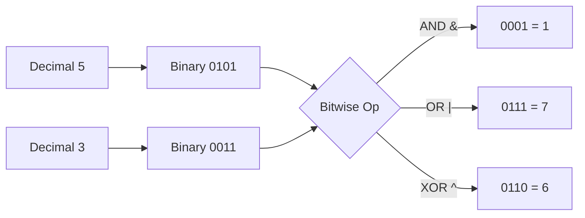

# 🔢 Bit Manipulation

> **One-line summary**: Operate directly on bits — XOR, AND, OR, shifts — for elegant O(1) tricks that would otherwise require O(n) logic.

---

## Diagram


## 🎯 Concept

Computers store integers as sequences of **bits** (binary digits). Bit manipulation works on these bits directly using **bitwise operators**, letting you replace whole loops with single, blazingly fast CPU instructions.



### Core Operators

| Operation   | Symbol | Example  | Result | Rule                          |
| ----------- | ------ | -------- | ------ | ----------------------------- |
| AND         | `&`    | `5 & 3`  | `1`    | 1 only if **both** bits are 1 |
| OR          | `\|`   | `5 \| 3` | `7`    | 1 if **either** bit is 1      |
| XOR         | `^`    | `5 ^ 3`  | `6`    | 1 if bits **differ**          |
| NOT         | `~`    | `~5`     | `-6`   | flips every bit               |
| Left shift  | `<<`   | `5 << 1` | `10`   | multiply by 2ᵏ                |
| Right shift | `>>`   | `5 >> 1` | `2`    | divide by 2ᵏ (floor)          |

**Key XOR properties**: `a^a=0`, `a^0=a`, commutative, associative. These make XOR the go-to tool for "find the odd one out" problems.

### Essential Bit Tricks (Cheat Sheet)

| Goal                       | Expression                     |
| -------------------------- | ------------------------------ |
| Check if `i`-th bit is set | `(n >> i) & 1`                 |
| Set the `i`-th bit         | `n \| (1 << i)`                |
| Clear the `i`-th bit       | `n & ~(1 << i)`                |
| Toggle the `i`-th bit      | `n ^ (1 << i)`                 |
| Turn off lowest set bit    | `n & (n - 1)`                  |
| Isolate lowest set bit     | `n & (-n)`                     |
| Check power of two         | `n > 0 && (n & (n - 1)) === 0` |
| Multiply / divide by 2     | `n << 1` / `n >> 1`            |

---

## ⚡ Time & Space Complexity

| Operation                                      | Time      | Space | Notes                      |
| ---------------------------------------------- | --------- | ----- | -------------------------- |
| Single bitwise op (`&`, `\|`, `^`, `<<`, `>>`) | O(1)      | O(1)  | One CPU instruction        |
| Count set bits (Brian Kernighan)               | O(k)      | O(1)  | k = number of set bits     |
| Count set bits (naive scan)                    | O(log n)  | O(1)  | Iterate over all bits      |
| Iterate all subsets via bitmask                | O(2ⁿ)     | O(1)  | n = number of elements     |
| Bitmask DP                                     | O(2ⁿ · n) | O(2ⁿ) | Classic TSP-style problems |

**Key Insight**: Bit operations are constant time regardless of the value, which is why they turn many O(n) checks into O(1).

---

## Common Patterns

### Find Single Number

```javascript
const singleNumber = (nums) => nums.reduce((acc, n) => acc ^ n, 0);
```

### Check Even/Odd

```javascript
const isEven = (n) => (n & 1) === 0;
```

### Count Set Bits (Brian Kernighan)

```javascript
function countBits(n) {
  let count = 0;
  while (n > 0) {
    n &= n - 1;
    count++;
  }
  return count;
}
```

### XOR Swap

```javascript
let a = 5,
  b = 3;
a ^= b;
b ^= a;
a ^= b;
```

### Power of Two Check

```javascript
const isPowerOfTwo = (n) => n > 0 && (n & (n - 1)) === 0;
```

---

## Pitfalls

- JS bitwise ops work on 32-bit signed integers — large numbers get truncated
- `~n = -(n+1)` — use `>>> 0` to convert to unsigned if needed
- XOR swap doesn't work if `a` and `b` point to the same variable

---

## 🧪 Worked Examples

### Example 1: Missing Number (XOR)

> Given `n` distinct numbers in range `[0, n]`, find the one missing.

```javascript
function missingNumber(nums) {
  let xor = nums.length; // start with n
  for (let i = 0; i < nums.length; i++) {
    xor ^= i ^ nums[i]; // cancel indices with values
  }
  return xor;
}
// Every present number cancels with its index; the missing one survives.
// Time: O(n), Space: O(1)
```

### Example 2: Generate All Subsets (Bitmask)

> Enumerate the power set of an array of size `n` using bit masks.

```javascript
function subsets(nums) {
  const n = nums.length;
  const result = [];
  for (let mask = 0; mask < 1 << n; mask++) {
    const subset = [];
    for (let i = 0; i < n; i++) {
      if (mask & (1 << i)) subset.push(nums[i]);
    }
    result.push(subset);
  }
  return result;
}
// Each of the 2^n masks encodes one subset (bit i => include nums[i]).
// Time: O(2^n * n), Space: O(1) extra (excluding output)
```

### Example 3: Sum of Two Integers Without `+`

> Add two integers using only bitwise operations.

```javascript
function getSum(a, b) {
  while (b !== 0) {
    const carry = (a & b) << 1; // bits that carry over
    a = a ^ b; // add without carry
    b = carry; // apply carry next round
  }
  return a;
}
// XOR adds bit-by-bit; AND<<1 computes the carry. Repeat until no carry.
// Time: O(1) (fixed 32-bit width), Space: O(1)
```

---

## Practice Problems

### Easy Problems

| Problem                                                                                                                                         | Difficulty | Solution |
| ----------------------------------------------------------------------------------------------------------------------------------------------- | ---------- | -------- |
| [LC 136 — Single Number](https://leetcode.com/problems/single-number/)                                                                          | Easy       |          |
| [LC 191 — Number of 1 Bits](https://leetcode.com/problems/number-of-1-bits/)                                                                    | Easy       |          |
| [LC 231 — Power of Two](https://leetcode.com/problems/power-of-two/)                                                                            | Easy       |          |
| [LC 268 — Missing Number](https://leetcode.com/problems/missing-number/)                                                                        | Easy       |          |
| [LC 338 — Counting Bits](https://leetcode.com/problems/counting-bits/)                                                                          | Easy       |          |
| [LC 342 — Power of Four](https://leetcode.com/problems/power-of-four/)                                                                          | Easy       |          |
| [LC 389 — Find the Difference](https://leetcode.com/problems/find-the-difference/)                                                              | Easy       |          |
| [LC 401 — Binary Watch](https://leetcode.com/problems/binary-watch/)                                                                            | Easy       |          |
| [LC 405 — Convert a Number to Hexadecimal](https://leetcode.com/problems/convert-a-number-to-hexadecimal/)                                      | Easy       |          |
| [LC 461 — Hamming Distance](https://leetcode.com/problems/hamming-distance/)                                                                    | Easy       |          |
| [LC 476 — Number Complement](https://leetcode.com/problems/number-complement/)                                                                  | Easy       |          |
| [LC 693 — Binary Number with Alternating Bits](https://leetcode.com/problems/binary-number-with-alternating-bits/)                              | Easy       |          |
| [LC 762 — Prime Number of Set Bits](https://leetcode.com/problems/prime-number-of-set-bits-in-binary-representation/)                           | Easy       |          |
| [LC 832 — Flipping an Image](https://leetcode.com/problems/flipping-an-image/)                                                                  | Easy       |          |
| [LC 868 — Binary Gap](https://leetcode.com/problems/binary-gap/)                                                                                | Easy       |          |
| [LC 1009 — Complement of Base 10 Integer](https://leetcode.com/problems/complement-of-base-10-integer/)                                         | Easy       |          |
| [LC 1290 — Convert Binary Number in a Linked List to Integer](https://leetcode.com/problems/convert-binary-number-in-a-linked-list-to-integer/) | Easy       |          |
| [LC 1342 — Number of Steps to Reduce a Number to Zero](https://leetcode.com/problems/number-of-steps-to-reduce-a-number-to-zero/)               | Easy       |          |
| [LC 1356 — Sort Integers by The Number of 1 Bits](https://leetcode.com/problems/sort-integers-by-the-number-of-1-bits/)                         | Easy       |          |
| [LC 1486 — XOR Operation in an Array](https://leetcode.com/problems/xor-operation-in-an-array/)                                                 | Easy       |          |
| [LC 1720 — Decode XORed Array](https://leetcode.com/problems/decode-xored-array/)                                                               | Easy       |          |
| [LC 2220 — Minimum Bit Flips to Convert Number](https://leetcode.com/problems/minimum-bit-flips-to-convert-number/)                             | Easy       |          |
| [LC 2239 — Find Closest Number to Zero](https://leetcode.com/problems/find-closest-number-to-zero/)                                             | Easy       |          |
| [CC — Little Elephant and Bits (LEBITS)](https://www.codechef.com/problems/LEBITS)                                                              | Easy       |          |
| [CC — Bit Difference (BITDIFF)](https://www.codechef.com/problems/BITDIFF)                                                                      | Easy       |          |
| [CC — Count Set Bits (CNTSETBIT)](https://www.codechef.com/problems/CNTSETBIT)                                                                  | Easy       |          |
| [CC — XOR Basics (XORBASIC)](https://www.codechef.com/problems/XORBASIC)                                                                        | Easy       |          |

### Medium Problems

| Problem                                                                                                                                                     | Difficulty | Solution |
| ----------------------------------------------------------------------------------------------------------------------------------------------------------- | ---------- | -------- |
| [LC 137 — Single Number II](https://leetcode.com/problems/single-number-ii/)                                                                                | Medium     |          |
| [LC 190 — Reverse Bits](https://leetcode.com/problems/reverse-bits/)                                                                                        | Medium     |          |
| [LC 201 — Bitwise AND of Numbers Range](https://leetcode.com/problems/bitwise-and-of-numbers-range/)                                                        | Medium     |          |
| [LC 260 — Single Number III](https://leetcode.com/problems/single-number-iii/)                                                                              | Medium     |          |
| [LC 287 — Find the Duplicate Number](https://leetcode.com/problems/find-the-duplicate-number/)                                                              | Medium     |          |
| [LC 318 — Maximum Product of Word Lengths](https://leetcode.com/problems/maximum-product-of-word-lengths/)                                                  | Medium     |          |
| [LC 371 — Sum of Two Integers](https://leetcode.com/problems/sum-of-two-integers/)                                                                          | Medium     |          |
| [LC 393 — UTF-8 Validation](https://leetcode.com/problems/utf-8-validation/)                                                                                | Medium     |          |
| [LC 421 — Maximum XOR of Two Numbers in an Array](https://leetcode.com/problems/maximum-xor-of-two-numbers-in-an-array/)                                    | Medium     |          |
| [LC 477 — Total Hamming Distance](https://leetcode.com/problems/total-hamming-distance/)                                                                    | Medium     |          |
| [LC 645 — Set Mismatch](https://leetcode.com/problems/set-mismatch/)                                                                                        | Medium     |          |
| [LC 898 — Bitwise ORs of Subarrays](https://leetcode.com/problems/bitwise-ors-of-subarrays/)                                                                | Medium     |          |
| [LC 1310 — XOR Queries of a Subarray](https://leetcode.com/problems/xor-queries-of-a-subarray/)                                                             | Medium     |          |
| [LC 1318 — Minimum Flips to Make a OR b Equal to c](https://leetcode.com/problems/minimum-flips-to-make-a-or-b-equal-to-c/)                                 | Medium     |          |
| [LC 1442 — Count Triplets That Can Form Two Arrays of Equal XOR](https://leetcode.com/problems/count-triplets-that-can-form-two-arrays-of-equal-xor/)       | Medium     |          |
| [LC 1521 — Find a Value of a Mysterious Function Closest to Target](https://leetcode.com/problems/find-a-value-of-a-mysterious-function-closest-to-target/) | Medium     |          |
| [LC 1680 — Concatenation of Consecutive Binary Numbers](https://leetcode.com/problems/concatenation-of-consecutive-binary-numbers/)                         | Medium     |          |
| [LC 1734 — Decode XORed Permutation](https://leetcode.com/problems/decode-xored-permutation/)                                                               | Medium     |          |
| [LC 1829 — Maximum XOR for Each Query](https://leetcode.com/problems/maximum-xor-for-each-query/)                                                           | Medium     |          |
| [LC 1835 — Find XOR Sum of All Pairs Bitwise AND](https://leetcode.com/problems/find-xor-sum-of-all-pairs-bitwise-and/)                                     | Medium     |          |
| [CC — XOR Engine (XORENG)](https://www.codechef.com/problems/XORENG)                                                                                        | Medium     |          |
| [CC — AND OR Union (ANDORUN)](https://www.codechef.com/problems/ANDORUN)                                                                                    | Medium     |          |
| [CC — Subset XOR (SUBSETXOR)](https://www.codechef.com/problems/SUBSETXOR)                                                                                  | Medium     |          |
| [CC — Bit Manipulation Tricks (BITTRICK)](https://www.codechef.com/problems/BITTRICK)                                                                       | Medium     |          |

### Hard Problems

| Problem                                                                                                                                   | Difficulty | Solution |
| ----------------------------------------------------------------------------------------------------------------------------------------- | ---------- | -------- |
| [LC 51 — N-Queens](https://leetcode.com/problems/n-queens/)                                                                               | Hard       |          |
| [LC 52 — N-Queens II](https://leetcode.com/problems/n-queens-ii/)                                                                         | Hard       |          |
| [LC 115 — Distinct Subsequences](https://leetcode.com/problems/distinct-subsequences/)                                                    | Hard       |          |
| [LC 1178 — Number of Valid Words for Each Puzzle](https://leetcode.com/problems/number-of-valid-words-for-each-puzzle/)                   | Hard       |          |
| [LC 1255 — Maximum Score Words Formed by Letters](https://leetcode.com/problems/maximum-score-words-formed-by-letters/)                   | Hard       |          |
| [LC 1542 — Find Longest Awesome Substring](https://leetcode.com/problems/find-longest-awesome-substring/)                                 | Hard       |          |
| [LC 1659 — Maximize Grid Happiness](https://leetcode.com/problems/maximize-grid-happiness/)                                               | Hard       |          |
| [LC 1707 — Maximum XOR With an Element From Array](https://leetcode.com/problems/maximum-xor-with-an-element-from-array/)                 | Hard       |          |
| [LC 1803 — Count Pairs With XOR in a Range](https://leetcode.com/problems/count-pairs-with-xor-in-a-range/)                               | Hard       |          |
| [LC 1915 — Number of Wonderful Substrings](https://leetcode.com/problems/number-of-wonderful-substrings/)                                 | Hard       |          |
| [LC 2003 — Smallest Missing Genetic Value in Each Subtree](https://leetcode.com/problems/smallest-missing-genetic-value-in-each-subtree/) | Hard       |          |
| [CC — Complex Bit Operations (COMPLEXBIT)](https://www.codechef.com/problems/COMPLEXBIT)                                                  | Hard       |          |
| [CC — Bit Masking DP (BITMASKDP)](https://www.codechef.com/problems/BITMASKDP)                                                            | Hard       |          |
| [CC — Trie with XOR (TRIEXOR)](https://www.codechef.com/problems/TRIEXOR)                                                                 | Hard       |          |
| [CC — Advanced Bitwise (ADVBIT)](https://www.codechef.com/problems/ADVBIT)                                                                | Hard       |          |

---

## Related Topics

- [Math](../math/README.md) — modular arithmetic and number theory
- [School Basics](../school-basics/README.md) — XOR swap covered there
- [Dynamic Programming](../dp/README.md) — bitmask DP for subset/state problems
- [Recursion](../recursion/README.md) — subset generation via recursion vs bitmask

[← Back to Home](../index.md) · © sparshjaswal
