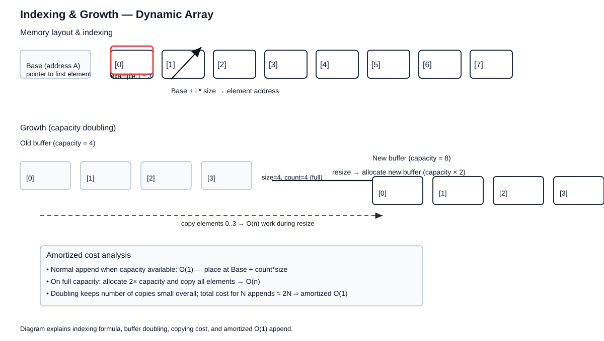

# 🏗️ Design Data Structures

> **One-line summary**: Build custom data structures combining existing primitives (hash maps, heaps, linked lists) to meet specific time/space requirements.

---

## Diagram




## Concept

Design problems ask you to implement a class with specific operations at defined complexities.

**Key building blocks**:

- **Hash Map + Doubly Linked List** → LRU Cache (O(1) get/put)
- **Hash Map + Min/Max Heap** → LFU Cache
- **Two Stacks** → Queue; **Two Queues** → Stack
- **Trie + Hash Map** → prefix-based lookups
- **Hash Map + Array** → O(1) insert/delete/getRandom

---

## Common Patterns

### LRU Cache Skeleton

```javascript
class LRUCache {
  constructor(capacity) {
    this.cap = capacity;
    this.map = new Map();
  }
  get(key) {
    if (!this.map.has(key)) return -1;
    const val = this.map.get(key);
    this.map.delete(key);
    this.map.set(key, val);
    return val;
  }
  put(key, value) {
    this.map.delete(key);
    if (this.map.size === this.cap) this.map.delete(this.map.keys().next().value);
    this.map.set(key, value);
  }
}
```

### O(1) Insert/Delete/GetRandom

```javascript
class RandomizedSet {
  constructor() {
    this.map = new Map();
    this.arr = [];
  }
  insert(val) {
    if (this.map.has(val)) return false;
    this.map.set(val, this.arr.length);
    this.arr.push(val);
    return true;
  }
  remove(val) {
    if (!this.map.has(val)) return false;
    const i = this.map.get(val),
      last = this.arr[this.arr.length - 1];
    this.arr[i] = last;
    this.map.set(last, i);
    this.arr.pop();
    this.map.delete(val);
    return true;
  }
  getRandom() {
    return this.arr[Math.floor(Math.random() * this.arr.length)];
  }
}
```

---

## Pitfalls

- LRU with JS Map: insertion order is preserved — use `map.keys().next()` to get LRU
- Thread safety not relevant in JS (single-threaded), but clarify in interviews
- Always clarify expected time complexity before designing

---

## Practice Problems

| Problem                                                                                            | Difficulty | Solution |
| -------------------------------------------------------------------------------------------------- | ---------- | -------- |
| [LC 146 — LRU Cache](https://leetcode.com/problems/lru-cache/)                                     | Medium     |          |
| [LC 460 — LFU Cache](https://leetcode.com/problems/lfu-cache/)                                     | Hard       |          |
| [LC 380 — Insert Delete GetRandom O(1)](https://leetcode.com/problems/insert-delete-getrandom-o1/) | Medium     |          |
| [LC 705 — Design HashSet](https://leetcode.com/problems/design-hashset/)                           | Easy       |          |
| [LC 706 — Design HashMap](https://leetcode.com/problems/design-hashmap/)                           | Easy       |          |
| [LC 641 — Design Circular Deque](https://leetcode.com/problems/design-circular-deque/)             | Medium     |          |
| [LC 208 — Implement Trie](https://leetcode.com/problems/implement-trie-prefix-tree/)               | Medium     |          |
| [LC 355 — Design Twitter](https://leetcode.com/problems/design-twitter/)                           | Medium     |          |
| [LC 1206 — Design Skiplist](https://leetcode.com/problems/design-skiplist/)                        | Hard       |          |
| [CC — Cache Hits (CACHEHIT)](https://www.codechef.com/problems/CACHEHIT)                           | Easy       |          |
| [LC 1146 — Snapshot Array](https://leetcode.com/problems/snapshot-array/)                          | Medium     |          |
| [LC 155 — Min Stack](https://leetcode.com/problems/min-stack/)                                     | Medium     |          |
| [LC 232 — Implement Queue using Stacks](https://leetcode.com/problems/implement-queue-using-stacks/) | Easy       |          |
| [LC 295 — Find Median from Data Stream](https://leetcode.com/problems/find-median-from-data-stream/) | Hard       |          |
| [LC 346 — Moving Average from Data Stream](https://leetcode.com/problems/moving-average-from-data-stream/) | Easy       |          |
| [LC 348 — Design Tic-Tac-Toe](https://leetcode.com/problems/design-tic-tac-toe/)                   | Medium     |          |
| [LC 362 — Design Hit Counter](https://leetcode.com/problems/design-hit-counter/)                   | Medium     |          |
| [LC 381 — Insert Delete GetRandom O(1) - Duplicates](https://leetcode.com/problems/insert-delete-getrandom-o1-duplicates-allowed/) | Hard       |          |
| [LC 432 — All O`one Data Structure](https://leetcode.com/problems/all-oone-data-structure/)        | Hard       |          |
| [LC 588 — Design In-Memory File System](https://leetcode.com/problems/design-in-memory-file-system/) | Hard       |          |
| [LC 622 — Design Circular Queue](https://leetcode.com/problems/design-circular-queue/)             | Medium     |          |
| [LC 631 — Design Excel Sum Formula](https://leetcode.com/problems/design-excel-sum-formula/)       | Hard       |          |
| [LC 716 — Max Stack](https://leetcode.com/problems/max-stack/)                                     | Hard       |          |
| [LC 895 — Maximum Frequency Stack](https://leetcode.com/problems/maximum-frequency-stack/)         | Hard       |          |
| [LC 1244 — Design A Leaderboard](https://leetcode.com/problems/design-a-leaderboard/)              | Medium     |          |
| [LC 1352 — Product of the Last K Numbers](https://leetcode.com/problems/product-of-the-last-k-numbers/) | Medium     |          |
| [LC 1472 — Design Browser History](https://leetcode.com/problems/design-browser-history/)          | Medium     |          |
| [CC — Data Structure Design (DSDESIGN)](https://www.codechef.com/problems/DSDESIGN)               | Medium     |          |
| [CC — Custom Stack (CUSTSTACK)](https://www.codechef.com/problems/CUSTSTACK)                      | Easy       |          |

---

## Related Topics

- [Heap](../heap/README.md) — LFU, median stream
- [Linked List](../linked-list/README.md) — LRU doubly linked list
- [Hashing](../hashing/README.md) — O(1) lookups

[← Back to Home](../index.md) · © sparshjaswal
