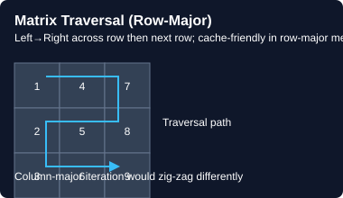

# 🔢 Matrix

> **One-line summary**: 2D arrays — master spiral traversal, layer-by-layer rotation, and diagonal/anti-diagonal iteration.

---

## Concept




Operations: row-by-row, column-by-column, spiral, diagonal, layer rotation, BFS/DFS on grid.

**Key trick**: `matrix[row][col]` → after 90° rotation: `rotated[col][n-1-row]`.

---

## Time & Space Complexity

| Operation | Time | Space |
|-----------|------|-------|
| Traverse all cells | O(m·n) | O(1) |
| Spiral traversal | O(m·n) | O(1) |
| Rotate in-place | O(n²) | O(1) |
| BFS/DFS on grid | O(m·n) | O(m·n) |

---

## Common Patterns

### Spiral Order
```javascript
function spiralOrder(matrix) {
  const result = [];
  let top=0, bottom=matrix.length-1, left=0, right=matrix[0].length-1;
  while (top<=bottom && left<=right) {
    for (let i=left; i<=right; i++) result.push(matrix[top][i]); top++;
    for (let i=top; i<=bottom; i++) result.push(matrix[i][right]); right--;
    if (top<=bottom) { for (let i=right; i>=left; i--) result.push(matrix[bottom][i]); bottom--; }
    if (left<=right) { for (let i=bottom; i>=top; i--) result.push(matrix[i][left]); left++; }
  }
  return result;
}
```

### Pascal's Triangle Row
```javascript
function getRow(rowIndex) {
  const row = new Array(rowIndex+1).fill(0); row[0]=1;
  for (let i=1; i<=rowIndex; i++)
    for (let j=i; j>0; j--) row[j] += row[j-1];
  return row;
}
```

---

## Pitfalls

- Spiral: guard `top <= bottom` and `left <= right` before reverse passes
- BFS on grid: mark visited immediately when enqueuing, not when dequeuing
- In-place rotation: transpose first, then reverse each row

---

## Practice Problems

| Problem | Difficulty | Solution |
|---------|-----------|----------|
| [LC 54 — Spiral Matrix](https://leetcode.com/problems/spiral-matrix/) | Medium | [View Solution](./matrix/LC-54-spiral-matrix) |
| [LC 59 — Spiral Matrix II](https://leetcode.com/problems/spiral-matrix-ii/) | Medium | [View Solution](./matrix/LC-59-spiral-matrix-ii) |
| [LC 118 — Pascal's Triangle](https://leetcode.com/problems/pascals-triangle/) | Easy | [View Solution](./matrix/LC-118-pascals-triangle) |
| [LC 119 — Pascal's Triangle II](https://leetcode.com/problems/pascals-triangle-ii/) | Easy | [View Solution](./matrix/LC-119-pascals-triangle-ii) |
| [LC 48 — Rotate Image](https://leetcode.com/problems/rotate-image/) | Medium |  |
| [LC 73 — Set Matrix Zeroes](https://leetcode.com/problems/set-matrix-zeroes/) | Medium |  |
| [LC 733 — Flood Fill](https://leetcode.com/problems/flood-fill/) | Easy |  |
| [LC 74 — Search a 2D Matrix](https://leetcode.com/problems/search-a-2d-matrix/) | Medium |  |
| [LC 240 — Search a 2D Matrix II](https://leetcode.com/problems/search-a-2d-matrix-ii/) | Medium |  |
| [CC — Matrix Rotation (MTRNSFRM)](https://www.codechef.com/problems/MTRNSFRM) | Medium |  |
| [LC 542 — 01 Matrix](https://leetcode.com/problems/01-matrix/) | Medium |  |
| [LC 36 — Valid Sudoku](https://leetcode.com/problems/valid-sudoku/) | Medium |  |
| [LC 37 — Sudoku Solver](https://leetcode.com/problems/sudoku-solver/) | Hard |  |
| [LC 79 — Word Search](https://leetcode.com/problems/word-search/) | Medium |  |
| [LC 130 — Surrounded Regions](https://leetcode.com/problems/surrounded-regions/) | Medium |  |
| [LC 200 — Number of Islands](https://leetcode.com/problems/number-of-islands/) | Medium |  |
| [LC 212 — Word Search II](https://leetcode.com/problems/word-search-ii/) | Hard |  |
| [LC 221 — Maximal Square](https://leetcode.com/problems/maximal-square/) | Medium |  |
| [LC 289 — Game of Life](https://leetcode.com/problems/game-of-life/) | Medium |  |
| [LC 378 — Kth Smallest Element in a Sorted Matrix](https://leetcode.com/problems/kth-smallest-element-in-a-sorted-matrix/) | Medium |  |
| [LC 463 — Island Perimeter](https://leetcode.com/problems/island-perimeter/) | Easy |  |
| [LC 498 — Diagonal Traverse](https://leetcode.com/problems/diagonal-traverse/) | Medium |  |
| [LC 695 — Max Area of Island](https://leetcode.com/problems/max-area-of-island/) | Medium |  |
| [LC 766 — Toeplitz Matrix](https://leetcode.com/problems/toeplitz-matrix/) | Easy |  |
| [LC 867 — Transpose Matrix](https://leetcode.com/problems/transpose-matrix/) | Easy |  |
| [LC 885 — Spiral Matrix III](https://leetcode.com/problems/spiral-matrix-iii/) | Medium |  |
| [LC 994 — Rotting Oranges](https://leetcode.com/problems/rotting-oranges/) | Medium |  |
| [LC 1091 — Shortest Path in Binary Matrix](https://leetcode.com/problems/shortest-path-in-binary-matrix/) | Medium |  |
| [LC 1329 — Sort the Matrix Diagonally](https://leetcode.com/problems/sort-the-matrix-diagonally/) | Medium |  |
| [LC 1380 — Lucky Numbers in a Matrix](https://leetcode.com/problems/lucky-numbers-in-a-matrix/) | Easy |  |
| [LC 1572 — Matrix Diagonal Sum](https://leetcode.com/problems/matrix-diagonal-sum/) | Easy |  |
| [LC 1905 — Count Sub Islands](https://leetcode.com/problems/count-sub-islands/) | Medium |  |
| [CC — Matrix Multiplication (MATMUL)](https://www.codechef.com/problems/MATMUL) | Medium |  |
| [CC — Grid Paths (GRIDPATH)](https://www.codechef.com/problems/GRIDPATH) | Medium |  |
| [CC — 2D Array Sum (ARRAY2D)](https://www.codechef.com/problems/ARRAY2D) | Easy |  |

---

## Related Topics

- [Two Pointers](../two-pointers/README.md) — converging pointers on matrix rows/columns
- [Graphs](../graphs/README.md) — BFS/DFS on grid = graph traversal
- [Binary Search](../binary-search/README.md) — 2D sorted matrix search

[← Back to Home](../index.md) · © sparshjaswal
