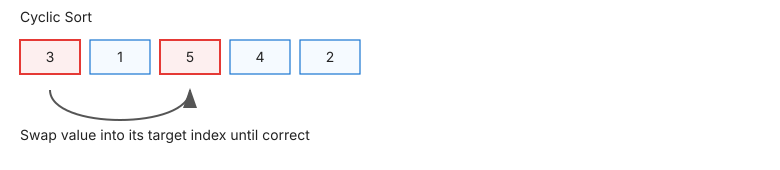

# 🔃 Sorting

> **One-line summary**: Rearrange elements in order — the prerequisite for binary search, two pointers, and many greedy algorithms.

---


## Enhanced Visualization


*Interactive comparison of Bubble Sort, Quick Sort, and Merge Sort with real-time performance metrics*




## Algorithm Analysis

The enhanced animation above demonstrates three fundamental sorting paradigms:

### 🔴 **Bubble Sort** - Simple but Inefficient
- **Strategy**: Compare adjacent elements and swap if out of order
- **Performance**: ~500,000 operations for n=1000 elements
- **Visual**: Watch elements "bubble" to their correct positions
- **Best for**: Educational purposes, very small datasets

### 🟣 **Quick Sort** - Efficient Divide-and-Conquer
- **Strategy**: Choose pivot, partition around it, recursively sort
- **Performance**: ~10,000 operations for n=1000 elements
- **Visual**: See pivot selection and partitioning phases
- **Best for**: General-purpose sorting, in-place requirements

### 🔵 **Merge Sort** - Stable and Predictable
- **Strategy**: Divide array, sort halves, merge sorted results
- **Performance**: ~10,000 operations for n=1000 elements
- **Visual**: Observe divide-and-conquer with merging phases
- **Best for**: Stable sorting, linked lists, external sorting

### Complete Algorithm Comparison

| Algorithm | Time (avg) | Time (worst) | Space | Stable? |
|-----------|-----------|--------------|-------|---------|
| Bubble Sort | O(n²) | O(n²) | O(1) | Yes |
| Selection Sort | O(n²) | O(n²) | O(1) | No |
| Insertion Sort | O(n²) | O(n²) | O(1) | Yes |
| Merge Sort | O(n log n) | O(n log n) | O(n) | Yes |
| Quick Sort | O(n log n) | O(n²) | O(log n) | No |
| Heap Sort | O(n log n) | O(n log n) | O(1) | No |
| Counting Sort | O(n + k) | O(n + k) | O(k) | Yes |
| Radix Sort | O(nk) | O(nk) | O(n+k) | Yes |

**Cyclic Sort**: for arrays containing numbers in range [1..n] — place each number at index `num-1` in O(n), O(1) space.

---

## Common Patterns

### Merge Sort
```javascript
function mergeSort(arr) {
  if (arr.length <= 1) return arr;
  const mid = Math.floor(arr.length / 2);
  return merge(mergeSort(arr.slice(0, mid)), mergeSort(arr.slice(mid)));
}
function merge(left, right) {
  const result = [];
  let i = 0, j = 0;
  while (i < left.length && j < right.length)
    result.push(left[i] <= right[j] ? left[i++] : right[j++]);
  return result.concat(left.slice(i), right.slice(j));
}
```

### Cyclic Sort
```javascript
function cyclicSort(nums) {
  let i = 0;
  while (i < nums.length) {
    const correct = nums[i] - 1;
    if (nums[i] !== nums[correct]) [nums[i], nums[correct]] = [nums[correct], nums[i]];
    else i++;
  }
  return nums;
}
```

---

## Pitfalls

- Quick sort worst case O(n²) on sorted input — use random pivot or 3-way partition
- Stable vs unstable: use stable sort when equal elements must maintain relative order
- JS `Array.sort()` is not guaranteed stable in older engines (ES2019+ guarantees it)

---

## Practice Problems

| Problem | Difficulty | Solution |
|---------|-----------|----------|
| [LC 75 — Sort Colors](https://leetcode.com/problems/sort-colors/) | Medium |  |
| [LC 912 — Sort an Array](https://leetcode.com/problems/sort-an-array/) | Medium |  |
| [LC 148 — Sort List](https://leetcode.com/problems/sort-list/) | Medium |  |
| [LC 179 — Largest Number](https://leetcode.com/problems/largest-number/) | Medium |  |
| [LC 315 — Count of Smaller Numbers After Self](https://leetcode.com/problems/count-of-smaller-numbers-after-self/) | Hard |  |
| [CC — Turbo Sort (TSORT)](https://www.codechef.com/problems/TSORT) | Easy |  |
| [CC — Inversion Count (INVCNT)](https://www.codechef.com/problems/INVCNT) | Medium |  |
| [CC — Smallest Difference (SMASTR)](https://www.codechef.com/problems/SMASTR) | Easy |  |
| [LC 164 — Maximum Gap](https://leetcode.com/problems/maximum-gap/) | Hard |  |
| [LC 905 — Sort Array By Parity](https://leetcode.com/problems/sort-array-by-parity/) | Easy |  |
| [LC 1636 — Sort Array by Increasing Frequency](https://leetcode.com/problems/sort-array-by-increasing-frequency/) | Easy |  |
| [LC 56 — Merge Intervals](https://leetcode.com/problems/merge-intervals/) | Medium |  |
| [LC 57 — Insert Interval](https://leetcode.com/problems/insert-interval/) | Medium |  |
| [LC 147 — Insertion Sort List](https://leetcode.com/problems/insertion-sort-list/) | Medium |  |
| [LC 215 — Kth Largest Element in an Array](https://leetcode.com/problems/kth-largest-element-in-an-array/) | Medium |  |
| [LC 242 — Valid Anagram](https://leetcode.com/problems/valid-anagram/) | Easy |  |
| [LC 252 — Meeting Rooms](https://leetcode.com/problems/meeting-rooms/) | Easy |  |
| [LC 253 — Meeting Rooms II](https://leetcode.com/problems/meeting-rooms-ii/) | Medium |  |
| [LC 274 — H-Index](https://leetcode.com/problems/h-index/) | Medium |  |
| [LC 324 — Wiggle Sort II](https://leetcode.com/problems/wiggle-sort-ii/) | Medium |  |
| [LC 347 — Top K Frequent Elements](https://leetcode.com/problems/top-k-frequent-elements/) | Medium |  |
| [LC 349 — Intersection of Two Arrays](https://leetcode.com/problems/intersection-of-two-arrays/) | Easy |  |
| [LC 350 — Intersection of Two Arrays II](https://leetcode.com/problems/intersection-of-two-arrays-ii/) | Easy |  |
| [LC 435 — Non-overlapping Intervals](https://leetcode.com/problems/non-overlapping-intervals/) | Medium |  |
| [LC 451 — Sort Characters By Frequency](https://leetcode.com/problems/sort-characters-by-frequency/) | Medium |  |
| [LC 506 — Relative Ranks](https://leetcode.com/problems/relative-ranks/) | Easy |  |
| [LC 561 — Array Partition](https://leetcode.com/problems/array-partition/) | Easy |  |
| [LC 692 — Top K Frequent Words](https://leetcode.com/problems/top-k-frequent-words/) | Medium |  |
| [LC 791 — Custom Sort String](https://leetcode.com/problems/custom-sort-string/) | Medium |  |
| [LC 853 — Car Fleet](https://leetcode.com/problems/car-fleet/) | Medium |  |
| [LC 922 — Sort Array By Parity II](https://leetcode.com/problems/sort-array-by-parity-ii/) | Easy |  |
| [LC 973 — K Closest Points to Origin](https://leetcode.com/problems/k-closest-points-to-origin/) | Medium |  |
| [LC 1122 — Relative Sort Array](https://leetcode.com/problems/relative-sort-array/) | Easy |  |
| [LC 1365 — How Many Numbers Are Smaller Than Current](https://leetcode.com/problems/how-many-numbers-are-smaller-than-the-current-number/) | Easy |  |
| [CC — Merge Sort (MERGSORT)](https://www.codechef.com/problems/MERGSORT) | Medium |  |
| [CC — Quick Sort (QUICKSRT)](https://www.codechef.com/problems/QUICKSRT) | Medium |  |
| [CC — Counting Sort (CNTSORT)](https://www.codechef.com/problems/CNTSORT) | Easy |  |

---

## Related Topics

- [Binary Search](../binary-search/README.md) — requires sorted input
- [Two Pointers](../two-pointers/README.md) — converging pointers need sorted array
- [Heap](../heap/README.md) — heapsort; partial sort for Top-K

[← Back to Home](../index.md) · © sparshjaswal
