> **One-line summary**: Hierarchical node structures — master traversals (inorder, BFS, DFS), BST properties, and path problems for O(n) or O(log n) solutions.
---

## 📊 Visual Learning

### Tree Structure Overview

*Understanding the hierarchical nature of binary trees and their node relationships*


*Interactive visualization of all tree traversal methods with smooth animations, node state changes, and real-time sequence display*

### Tree Traversal Process

*Classic tree traversal flow diagram*
### Tree Operations Complexity Chart

*Visual comparison of time complexities for different tree operations*

## 💡 Core Concepts

### What are Trees?
Trees are **hierarchical data structures** consisting of nodes connected by edges. They're fundamental in computer science for representing hierarchical relationships.

### Key Tree Properties
- **Binary Tree**: Each node has **at most 2 children** (left and right)
- **BST Property**: For any node, **left subtree values < node value < right subtree values**
- **Height**: The longest path from root to any leaf node
- **Depth**: The distance from root to a specific node

### Essential Tree Traversals
- **Inord### Essential Tree Traversals

The enhanced animation above demonstrates all four traversal methods:

- **Inorder (L-N-R)**: Left → Node → Right
  - **Sequence**: 8 → 4 → 2 → 9 → 5 → 1 → 6 → 3 → 7
  - **Use Case**: Gives sorted order for BST, expression evaluation
  - **Visual**: Watch nodes light up following left-root-right pattern

- **Preorder (N-L-R)**: Node → Left → Right
  - **Sequence**: 1 → 2 → 4 → 8 → 5 → 9 → 3 → 6 → 7
  - **Use Case**: Tree copying, serialization, prefix expressions
  - **Visual**: Root nodes are processed before children

- **Postorder (L-R-N)**: Left → Right → Node
  - **Sequence**: 8 → 4 → 9 → 5 → 2 → 6 → 7 → 3 → 1
  - **Use Case**: Tree deletion, calculating directory sizes, postfix expressions
  - **Visual**: Children are processed before their parents

- **Level-order (BFS)**: Visit nodes level by level
  - **Sequence**: 1 → 2 → 3 → 4 → 5 → 6 → 7 → 8 → 9
  - **Use Case**: Finding shortest path, level-wise processing, tree printing
  - **Visual**: Processes all nodes at each level before moving to next levelr:**
- **Hierarchical data** (file systems, organization charts)
- **Fast searching** in sorted data (BST: O(log n))
- **Expression parsing** (syntax trees)
- **Decision making** (decision trees)
- **Range queries** and **ordered data**

❌ **Not suitable for:**
- Simple linear data access
- When you need constant-time random access
- Memory-constrained environments (pointer overhead)


| **Insert** | O(log n) | O(n) | O(h) | Maintains BST property during insertion |
| **Delete** | O(log n) | O(n) | O(h) | Complex case: node with two children |
- **Space complexity**: O(h) due to recursion stack depth

### Tree Traversal Complexities
| Traversal Type | **Time** | **Space** | **Use Case** |
|----------------|----------|-----------|-------------|
| **Inorder** | O(n) | O(h) | Get sorted sequence from BST |
| **Preorder** | O(n) | O(h) | Tree serialization, copying |
| **Postorder** | O(n) | O(h) | Tree deletion, expression evaluation |
| **Level-order (BFS)** | O(n) | O(w) | Tree printing, finding level info |

*w = maximum width of tree (can be O(n) for complete binary tree)*


## Common Patterns

### Inorder DFS
```javascript
function inorder(root, result = []) {
  if (!root) return result;
  result.push(root.val);
  inorder(root.right, result);
function levelOrder(root) {
  if (!root) return [];
  const queue = [root], result = [];
  while (queue.length) {
    const size = queue.length, level = [];
    for (let i = 0; i < size; i++) {
      const n = queue.shift();
      if (n.right) queue.push(n.right);
    }
  }
  return result;
```

  const right = lowestCommonAncestor(root.right, p, q);
  return left && right ? root : left || right;
}
```

---

## Pitfalls

- Null check before accessing `.left` / `.right`
- BST validation: pass min/max bounds recursively, not just compare with parent
- Height vs depth: height = edges from node to deepest leaf; depth = edges from root

---
## Practice Problems

### 🟢 Easy - Foundation Building

| Problem | Difficulty | FAANG Frequency | Solution |
| [LC 404 — Sum of Left Leaves](https://leetcode.com/problems/sum-of-left-leaves/) | Easy |  |
| [LC 437 — Path Sum III](https://leetcode.com/problems/path-sum| [LC 543 — Diameter of Binary Tree](https://leetcode.com/problems/diameter-of-binary-tree/) | Easy | ⭐⭐⭐⭐ Amazon, Google |  |h-tree/) | Easy |  |
| [LC 530 — Minimum Absolute Difference in BST](https://leetcode.com/problems/minimum-absolute-difference-in-bst/) | Easy |  |
| [LC 543 — Diameter of Binary Tree](https://leetcode.com/problems/diameter-of-binary-tree/) | Easy |  |
| [LC 563 — Binary Tree Tilt](https://leetcode.com/problems/binary-tree-tilt/) | Easy |  |
| [LC 572 — Subtree of Another Tree](https://leetcode.com/problems/subtree-of-another-tree/) | Easy |  |
| [LC 589 — N-ary Tree Preorder Traversal](https://leetcode.com/problems/n-ary-tree-preorder-traversal/) | Easy |  |
| [LC 590 — N-ary Tree Postorder Traversal](https://leetcode.com/problems/n-ary-tree-postorder-traversal/) | Easy |  |
| [LC 617 — Merge Two Binary Trees](https://leetcode.com/problems/merge-two-binary-trees/) | Easy |  |
| [LC 637 — Average of Levels in Binary Tree](https://leetcode.com/problems/average-of-levels-in-binary-tree/) | Easy |  |
| [LC 653 — Two Sum IV - Input is a BST](https://leetcode.com/problems/two-sum-iv-input-is-a-bst/) | Easy |  |
| [LC 669 — Trim a BST](https://leetcode.com/problems/trim-a-binary-search-tree/) | Easy |  |
| [LC 671 — Second Minimum Node](https://leetcode.com/problems/second-minimum-node-in-a-binary-tree/) | Easy |  |
| [LC 700 — Search in a BST](https://leetcode.com/problems/search-in-a-binary-search-tree/) | Easy |  |
| [LC 701 — Insert into a BST](https://leetcode.com/problems/insert-into-a-binary-search-tree/) | Easy |  |
| [LC 783 — Minimum Distance Between BST Nodes](https://leetcode.com/problems/minimum-distance-between-bst-nodes/) | Easy |  |
| [LC 872 — Leaf-Similar Trees](https://leetcode.com/problems/leaf-similar-trees/) | Easy |  |
| [LC 938 — Range Sum of BST](https://leetcode.com/problems/range-sum-of-bst/) | Easy |  |
| [LC 965 — Univalued Binary Tree](https://leetcode.com/problems/univalued-binary-tree/) | Easy |  |
| [LC 102 — Level Order Traversal](https://leetcode.com/problems/binary-tree-level-order-traversal/) | Medium | ⭐⭐⭐⭐⭐ All FAANG | |
| [LC 103 — Zigzag Level Order](https://leetcode.com/problems/binary-tree-zigzag-level-order-traversal/) | Medium | ⭐⭐⭐⭐ Amazon, Microsoft | |
| [LC 105 — Construct from Preorder and Inorder](https://leetcode.com/problems/construct-binary-tree-from-preorder-and-inorder-traversal/) | Medium | ⭐⭐⭐⭐ Google, Facebook | |
| [LC 106 — Construct from Inorder and Postorder](https://leetcode.com/problems/construct-binary-tree-from-inorder-and-postorder-traversal/) | Medium | ⭐⭐⭐ Google, Apple | |
| [LC 113 — Path Sum II](https://leetcode.com/problems/path-sum-ii/) | Medium | ⭐⭐⭐ Amazon, Microsoft | |
| [LC 114 — Flatten Binary Tree to Linked List](https://leetcode.com/problems/flatten-binary-tree-to-linked-list/) | Medium | ⭐⭐⭐⭐ Amazon, Microsoft | |
| [LC 124 — Binary Tree Max Path Sum](https://leetcode.com/problems/binary-tree-maximum-path-sum/) | Medium | ⭐⭐⭐⭐⭐ All FAANG | |
| [LC 129 — Sum Root to Leaf Numbers](https://leetcode.com/problems/sum-root-to-leaf-numbers/) | Medium | ⭐⭐⭐ Amazon, Google | |
| [LC 173 — BST Iterator](https://leetcode.com/problems/binary-search-tree-iterator/) | Medium | ⭐⭐⭐⭐ Google, Facebook | |
| [LC 199 — Binary Tree Right Side View](https://leetcode.com/problems/binary-tree-right-side-view/) | Medium | ⭐⭐⭐⭐⭐ Amazon, Facebook | |
| [LC 222 — Count Complete Tree Nodes](https://leetcode.com/problems/count-complete-tree-nodes/) | Medium | ⭐⭐⭐ Google, Microsoft | |
| [LC 230 — Kth Smallest Element in a BST](https://leetcode.com/problems/kth-smallest-element-in-a-bst/) | Medium | ⭐⭐⭐⭐ Amazon, Google | |
| [LC 236 — Lowest Common Ancestor](https://leetcode.com/problems/lowest-common-ancestor-of-a-binary-tree/) | Medium | ⭐⭐⭐⭐⭐ All FAANG | |
| [LC 297 — Serialize and Deserialize Binary Tree](https://leetcode.com/problems/serialize-and-deserialize-binary-tree/) | Medium | ⭐⭐⭐⭐⭐ All FAANG | |
| [LC 337 — House Robber III](https://leetcode.com/problems/house-robber-iii/) | Medium | ⭐⭐⭐ Amazon, Microsoft | |
| [LC 515 — Find Largest Value in Each Tree Row](https://leetcode.com/problems/find-largest-value-in-each-tree-row/) | Medium | ⭐⭐ Amazon, Microsoft | |
| [LC 538 — Convert BST to Greater Tree](https://leetcode.com/problems/convert-bst-to-greater-tree/) | Medium | ⭐⭐⭐ Amazon, Google | |
| [LC 1008 — Construct BST from Preorder](https://leetcode.com/problems/construct-binary-search-tree-from-preorder-traversal/) | Medium | ⭐⭐ Google, Microsoft | |
| [LC 1026 — Maximum Difference Between Node and Ancestor](https://leetcode.com/problems/maximum-difference-between-node-and-ancestor/) | Medium | ⭐⭐ Amazon, Google | |
| [LC 1110 — Delete Nodes And Return Forest](https://leetcode.com/problems/delete-nodes-and-return-forest/) | Medium | ⭐⭐⭐ Amazon, Google | |
| [LC 1448 — Count Good Nodes](https://leetcode.com/problems/count-good-nodes-in-binary-tree/) | Medium | ⭐⭐⭐⭐ Amazon, Microsoft | |

### 🔴 Hard - Advanced Algorithms
| Problem | Difficulty | FAANG Frequency | Solution |
|---------|-----------|----------------|----------|
| [LC 124 — Binary Tree Max Path Sum](https://leetcode.com/problems/binary-tree-maximum-path-sum/) | Hard | ⭐⭐⭐⭐⭐ All FAANG | |
| [LC 212 — Word Search II](https://leetcode.com/problems/word-search-ii/) | Hard | ⭐⭐⭐⭐ Amazon, Google | |
| [LC 297 — Serialize and Deserialize Binary Tree](https://leetcode.com/problems/serialize-and-deserialize-binary-tree/) | Hard | ⭐⭐⭐⭐⭐ All FAANG | |
| [LC 315 — Count of Smaller Numbers After Self](https://leetcode.com/problems/count-of-smaller-numbers-after-self/) | Hard | ⭐⭐⭐ Google, Microsoft | |
| [LC 336 — Palindrome Pairs](https://leetcode.com/problems/palindrome-pairs/) | Hard | ⭐⭐⭐ Amazon, Google | |
| [LC 431 — Encode N-ary Tree to Binary Tree](https://leetcode.com/problems/encode-n-ary-tree-to-binary-tree/) | Hard | ⭐⭐⭐ Google, Facebook | |
| [LC 440 — K-th Smallest in Lexicographical Order](https://leetcode.com/problems/k-th-smallest-in-lexicographical-order/) | Hard | ⭐⭐ Google, Apple | |
| [LC 493 — Reverse Pairs](https://leetcode.com/problems/reverse-pairs/) | Hard | ⭐⭐⭐ Google, Microsoft | |
| [LC 652 — Find Duplicate Subtrees](https://leetcode.com/problems/find-duplicate-subtrees/) | Hard | ⭐⭐⭐ Amazon, Google | |
| [LC 834 — Sum of Distances in Tree](https://leetcode.com/problems/sum-of-distances-in-tree/) | Hard | ⭐⭐⭐ Google, Facebook | |
| [LC 968 — Binary Tree Cameras](https://leetcode.com/problems/binary-tree-cameras/) | Hard | ⭐⭐⭐ Google, Amazon | |
| [LC 1028 — Recover Tree From Preorder](https://leetcode.com/problems/recover-a-tree-from-preorder-traversal/) | Hard | ⭐⭐ Google, Microsoft | |
| [LC 1569 — Number of Ways to Reorder Array to Get Same BST](https://leetcode.com/problems/number-of-ways-to-reorder-array-to-get-same-bst/) | Hard | ⭐⭐ Google, Facebook | |
| [LC 1932 — Merge BSTs to Create Single BST](https://leetcode.com/problems/merge-bsts-to-create-single-bst/) | Hard | ⭐⭐ Amazon, Apple | |

---

## Related Topics

- [Recursion](../recursion/README.md) — most tree algorithms are recursive
- [Heap](../heap/README.md) — heap is a complete binary tree
- [Queue](../queue/README.md) — BFS uses a queue

[← Back to Home](../index.md) · © sparshjaswal

