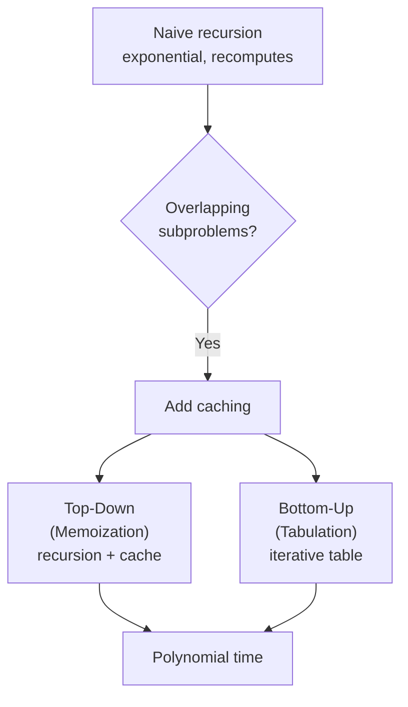

# 🧠 Dynamic Programming

> **One-line summary**: Break a problem into overlapping subproblems, solve each once — turning exponential time into polynomial.

---

## Diagram


## 🎯 Concept

**Dynamic Programming (DP)** solves complex problems by breaking them into simpler subproblems, solving each subproblem **once**, and storing (caching) the result. Apply DP when a problem has **both**:

1. **Optimal substructure**: the optimal solution is built from optimal solutions of its subproblems.
2. **Overlapping subproblems**: the same subproblem is computed many times by a naive recursion.



### Top-Down vs Bottom-Up

| Aspect    | Top-Down (Memoization)          | Bottom-Up (Tabulation)             |
| --------- | ------------------------------- | ---------------------------------- |
| Style     | Recursion + cache               | Iterative table filling            |
| Order     | Solves on demand                | Solves all states in order         |
| Space     | O(states) + call stack          | O(states), often space-optimizable |
| Intuition | Easier to write from recurrence | Faster, no recursion overhead      |

### Common DP Categories

1D DP · 2D / grid DP · Knapsack (take / not-take) · LIS · LCS / DP on strings · DP on stocks · Partition / interval DP · Bitmask DP.

---

## ⚡ Time & Space Complexity

| Pattern                            | Time       | Space              |
| ---------------------------------- | ---------- | ------------------ |
| 1D DP (house robber, climb stairs) | O(n)       | O(1) optimised     |
| 2D DP (grid / string)              | O(m·n)     | O(n) row-optimised |
| 0/1 Knapsack                       | O(n·W)     | O(W)               |
| LIS (DP)                           | O(n²)      | O(n)               |
| LIS (patience/binary search)       | O(n log n) | O(n)               |
| LCS                                | O(m·n)     | O(m·n)             |

**Key Insight**: The number of **distinct states** × **work per state** = total time. Optimize space by keeping only the states you still need (e.g., last row/two variables).

---

## Common Patterns

### 1D DP — House Robber

```javascript
function rob(nums) {
  let prev2 = 0,
    prev1 = 0;
  for (const n of nums) {
    const curr = Math.max(prev1, prev2 + n);
    prev2 = prev1;
    prev1 = curr;
  }
  return prev1;
}
// State: best loot up to house i. Time O(n), Space O(1).
```

### 2D DP — Edit Distance (Levenshtein)

```javascript
function editDistance(w1, w2) {
  const m = w1.length,
    n = w2.length;
  const dp = Array.from({ length: m + 1 }, (_, i) =>
    Array.from({ length: n + 1 }, (_, j) => (i === 0 ? j : j === 0 ? i : 0)),
  );
  for (let i = 1; i <= m; i++)
    for (let j = 1; j <= n; j++)
      dp[i][j] =
        w1[i - 1] === w2[j - 1]
          ? dp[i - 1][j - 1]
          : 1 + Math.min(dp[i - 1][j - 1], dp[i - 1][j], dp[i][j - 1]);
  return dp[m][n];
}
// Time O(m*n), Space O(m*n).
```

### 0/1 Knapsack — take / not-take

```javascript
function knapsack(weights, values, W) {
  const dp = new Array(W + 1).fill(0);
  for (let i = 0; i < weights.length; i++)
    for (let w = W; w >= weights[i]; w--)
      // iterate backwards for 0/1
      dp[w] = Math.max(dp[w], dp[w - weights[i]] + values[i]);
  return dp[W];
}
// Time O(n*W), Space O(W).
```

### LIS — Longest Increasing Subsequence O(n log n)

```javascript
function lengthOfLIS(nums) {
  const tails = [];
  for (const x of nums) {
    let lo = 0,
      hi = tails.length;
    while (lo < hi) {
      const mid = (lo + hi) >> 1;
      if (tails[mid] < x) lo = mid + 1;
      else hi = mid;
    }
    tails[lo] = x;
  }
  return tails.length;
}
// Binary search keeps the smallest tail per length. Time O(n log n).
```

---

## 🧪 Worked Example: Coin Change (min coins)

> Given coin denominations and an amount, find the fewest coins to make it.

```javascript
function coinChange(coins, amount) {
  const dp = new Array(amount + 1).fill(Infinity);
  dp[0] = 0; // 0 coins to make amount 0
  for (let a = 1; a <= amount; a++) {
    for (const coin of coins) {
      if (coin <= a) dp[a] = Math.min(dp[a], dp[a - coin] + 1);
    }
  }
  return dp[amount] === Infinity ? -1 : dp[amount];
}
// dp[a] = fewest coins to form amount a. Time O(amount * coins), Space O(amount).
```

**Recurrence**: `dp[a] = min(dp[a - coin] + 1)` over all coins that fit — optimal substructure (best for `a` uses the best for `a - coin`) and overlapping subproblems (`dp[a - coin]` reused).

---

## Pitfalls

- **Wrong iteration order**: 0/1 knapsack must iterate capacity **backwards**; unbounded knapsack forwards.
- **Uninitialized base cases**: forgetting `dp[0]` leads to wrong answers.
- **Not space-optimizing**: many 2D DPs only need the previous row.
- **Confusing subsequence vs substring**: contiguity changes the recurrence.

---

## Practice Problems

| Problem                                                                                                    | Difficulty | Solution |
| ---------------------------------------------------------------------------------------------------------- | ---------- | -------- |
| [LC 70 — Climbing Stairs](https://leetcode.com/problems/climbing-stairs/)                                  | Easy       |          |
| [LC 121 — Best Time to Buy and Sell Stock](https://leetcode.com/problems/best-time-to-buy-and-sell-stock/) | Easy       |          |
| [LC 198 — House Robber](https://leetcode.com/problems/house-robber/)                                       | Medium     |          |
| [LC 322 — Coin Change](https://leetcode.com/problems/coin-change/)                                         | Medium     |          |
| [LC 300 — Longest Increasing Subsequence](https://leetcode.com/problems/longest-increasing-subsequence/)   | Medium     |          |
| [LC 1143 — Longest Common Subsequence](https://leetcode.com/problems/longest-common-subsequence/)          | Medium     |          |

| [LC 62 — Unique Paths](https://leetcode.com/problems/unique-paths/) | Medium | |
| [LC 63 — Unique Paths II](https://leetcode.com/problems/unique-paths-ii/) | Medium | |
| [LC 64 — Minimum Path Sum](https://leetcode.com/problems/minimum-path-sum/) | Medium | |
| [LC 91 — Decode Ways](https://leetcode.com/problems/decode-ways/) | Medium | |
| [LC 96 — Unique Binary Search Trees](https://leetcode.com/problems/unique-binary-search-trees/) | Medium | |
| [LC 120 — Triangle](https://leetcode.com/problems/triangle/) | Medium | |
| [LC 139 — Word Break](https://leetcode.com/problems/word-break/) | Medium | |
| [LC 152 — Maximum Product Subarray](https://leetcode.com/problems/maximum-product-subarray/) | Medium | |
| [LC 213 — House Robber II](https://leetcode.com/problems/house-robber-ii/) | Medium | |
| [LC 221 — Maximal Square](https://leetcode.com/problems/maximal-square/) | Medium | |
| [LC 279 — Perfect Squares](https://leetcode.com/problems/perfect-squares/) | Medium | |
| [LC 300 — Longest Increasing Subsequence](https://leetcode.com/problems/longest-increasing-subsequence/) | Medium | |
| [LC 309 — Best Time to Buy and Sell Stock with Cooldown](https://leetcode.com/problems/best-time-to-buy-and-sell-stock-with-cooldown/) | Medium | |
| [LC 322 — Coin Change](https://leetcode.com/problems/coin-change/) | Medium | |
| [LC 338 — Counting Bits](https://leetcode.com/problems/counting-bits/) | Medium | |
| [LC 343 — Integer Break](https://leetcode.com/problems/integer-break/) | Medium | |
| [LC 377 — Combination Sum IV](https://leetcode.com/problems/combination-sum-iv/) | Medium | |
| [LC 416 — Partition Equal Subset Sum](https://leetcode.com/problems/partition-equal-subset-sum/) | Medium | |
| [LC 494 — Target Sum](https://leetcode.com/problems/target-sum/) | Medium | |
| [LC 516 — Longest Palindromic Subsequence](https://leetcode.com/problems/longest-palindromic-subsequence/) | Medium | |
| [LC 518 — Coin Change 2](https://leetcode.com/problems/coin-change-2/) | Medium | |

| [LC 740 — Delete and Earn](https://leetcode.com/problems/delete-and-earn/) | Medium | |
| [LC 931 — Minimum Falling Path Sum](https://leetcode.com/problems/minimum-falling-path-sum/) | Medium | |

| [LC 42 — Trapping Rain Water](https://leetcode.com/problems/trapping-rain-water/) | Hard | |
| [LC 44 — Wildcard Matching](https://leetcode.com/problems/wildcard-matching/) | Hard | |
| [LC 72 — Edit Distance](https://leetcode.com/problems/edit-distance/) | Hard | |
| [LC 85 — Maximal Rectangle](https://leetcode.com/problems/maximal-rectangle/) | Hard | |
| [LC 87 — Scramble String](https://leetcode.com/problems/scramble-string/) | Hard | |
| [LC 115 — Distinct Subsequences](https://leetcode.com/problems/distinct-subsequences/) | Hard | |
| [LC 123 — Best Time to Buy and Sell Stock III](https://leetcode.com/problems/best-time-to-buy-and-sell-stock-iii/) | Hard | |
| [LC 132 — Palindrome Partitioning II](https://leetcode.com/problems/palindrome-partitioning-ii/) | Hard | |
| [LC 140 — Word Break II](https://leetcode.com/problems/word-break-ii/) | Hard | |
| [LC 188 — Best Time to Buy and Sell Stock IV](https://leetcode.com/problems/best-time-to-buy-and-sell-stock-iv/) | Hard | |
| [LC 312 — Burst Balloons](https://leetcode.com/problems/burst-balloons/) | Hard | |
| [LC 329 — Longest Increasing Path in a Matrix](https://leetcode.com/problems/longest-increasing-path-in-a-matrix/) | Hard | |
| [LC 354 — Russian Doll Envelopes](https://leetcode.com/problems/russian-doll-envelopes/) | Hard | |
| [LC 410 — Split Array Largest Sum](https://leetcode.com/problems/split-array-largest-sum/) | Hard | |
| [LC 446 — Arithmetic Slices II - Subsequence](https://leetcode.com/problems/arithmetic-slices-ii-subsequence/) | Hard | |
| [LC 472 — Concatenated Words](https://leetcode.com/problems/concatenated-words/) | Hard | |
| [LC 546 — Remove Boxes](https://leetcode.com/problems/remove-boxes/) | Hard | |
| [LC 664 — Strange Printer](https://leetcode.com/problems/strange-printer/) | Hard | |
| [LC 689 — Maximum Sum of 3 Non-Overlapping Subarrays](https://leetcode.com/problems/maximum-sum-of-3-non-overlapping-subarrays/) | Hard | |
| [LC 1000 — Minimum Cost to Merge Stones](https://leetcode.com/problems/minimum-cost-to-merge-stones/) | Hard | |
| [LC 1092 — Shortest Common Supersequence](https://leetcode.com/problems/shortest-common-supersequence/) | Hard | |
| [LC 1235 — Maximum Profit in Job Scheduling](https://leetcode.com/problems/maximum-profit-in-job-scheduling/) | Hard | |
| [CC — LCS (LCSSTR)](https://www.codechef.com/problems/LCSSTR) | Hard | |
| [CC — Advanced DP (ADVDP)](https://www.codechef.com/problems/ADVDP) | Hard | |
| [CC — Matrix Chain Multiplication (MATCHAIN)](https://www.codechef.com/problems/MATCHAIN) | Hard | |

---

## Related Topics

- [Recursion](../recursion/README.md) — memoisation is recursion + cache
- [Kadane's Algorithm](../kadanes-algorithm/README.md) — 1D DP solved greedily
- [Backtracking](../backtracking/README.md) — DP prunes redundant states; backtracking explores all

[← Back to Home](../index.md) · © sparshjaswal
