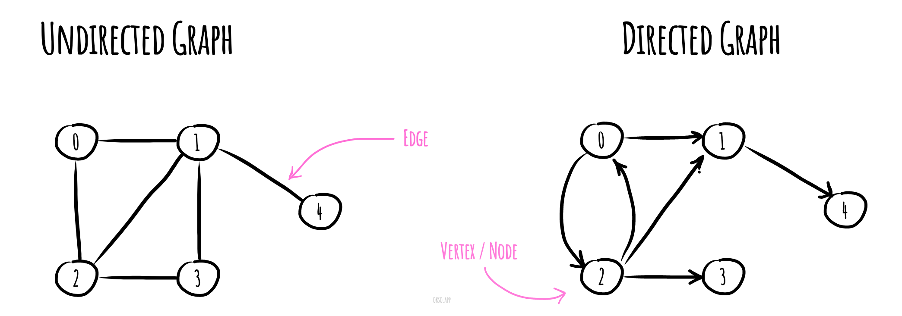

# 🗺️ Graphs

> **One-line summary**: Nodes connected by edges — BFS for shortest path, DFS for connectivity/cycle, topological sort for dependencies, Union-Find for dynamic connectivity.

---

## Enhanced Visualization


_Interactive demonstration of BFS, DFS, and Dijkstra's algorithm with path finding and performance analysis_


## Core Graph Concepts

The enhanced animation above demonstrates three fundamental graph algorithms:

### 🔵 **Breadth-First Search (BFS)**

- **Strategy**: Explores nodes level by level using a queue
- **Path**: A → B → C → F (shortest in unweighted graphs)
- **Time**: O(V + E) | **Space**: O(V)
- **Use Cases**: Shortest path, social networks, web crawling

### 🟣 **Depth-First Search (DFS)**

- **Strategy**: Explores as far as possible using recursion/stack
- **Path**: A → D → E → F (explores deeply first)
- **Time**: O(V + E) | **Space**: O(V)
- **Use Cases**: Topological sorting, cycle detection, connectivity

### 🟡 **Dijkstra's Algorithm**

- **Strategy**: Uses priority queue for weighted shortest paths
- **Path**: A → B → E → F (Distance: 7 - optimal weighted path)
- **Time**: O((V + E) log V) | **Space**: O(V)
- **Use Cases**: GPS navigation, network routing, flight planning

### Graph Fundamentals

**G = (V, E)**. Types: directed, undirected, weighted, DAG.

**Representations**:

- Adjacency List: `Map<node, neighbors[]>` — O(V+E) space — preferred.
- Adjacency Matrix: `matrix[u][v]` — O(V²) — dense graphs.

**Also covers**: BFS pattern, DFS pattern, topological sort, Union-Find, Dijkstra, Bellman-Ford.

---

## Time & Space Complexity

| Algorithm                     | Time           | Space |
| ----------------------------- | -------------- | ----- |
| BFS / DFS                     | O(V + E)       | O(V)  |
| Dijkstra (min-heap)           | O((V+E) log V) | O(V)  |
| Topological Sort (Kahn)       | O(V + E)       | O(V)  |
| Union-Find (with compression) | O(α(n)) per op | O(n)  |

---

## Common Patterns

### BFS (Shortest Path)

```javascript
function bfs(graph, start) {
  const visited = new Set([start]),
    queue = [start];
  while (queue.length) {
    const node = queue.shift();
    for (const nb of graph.get(node) || [])
      if (!visited.has(nb)) {
        visited.add(nb);
        queue.push(nb);
      }
  }
}
```

### DFS (Connected Components)

```javascript
function dfs(graph, node, visited = new Set()) {
  visited.add(node);
  for (const nb of graph.get(node) || []) if (!visited.has(nb)) dfs(graph, nb, visited);
}
```

### Topological Sort (Kahn's BFS)

```javascript
function topoSort(n, edges) {
  const inDeg = new Array(n).fill(0),
    adj = Array.from({ length: n }, () => []);
  for (const [a, b] of edges) {
    adj[b].push(a);
    inDeg[a]++;
  }
  const queue = [],
    order = [];
  for (let i = 0; i < n; i++) if (!inDeg[i]) queue.push(i);
  while (queue.length) {
    const node = queue.shift();
    order.push(node);
    for (const nb of adj[node]) if (--inDeg[nb] === 0) queue.push(nb);
  }
  return order.length === n ? order : []; // empty = cycle
}
```

### Union-Find

```javascript
const parent = Array.from({ length: n }, (_, i) => i);
function find(x) {
  return parent[x] === x ? x : (parent[x] = find(parent[x]));
}
function union(x, y) {
  parent[find(x)] = find(y);
}
```

---

## Pitfalls

- Forgetting to mark visited before enqueuing (BFS) — causes duplicates
- Cycle detection: in undirected graph pass parent to DFS to avoid false positives
- Topological sort only valid on DAG — if cycle exists, output length < n

---

## Practice Problems

| Problem                                                                                                                                          | Difficulty | Solution |
| ------------------------------------------------------------------------------------------------------------------------------------------------ | ---------- | -------- |
| [LC 200 — Number of Islands](https://leetcode.com/problems/number-of-islands/)                                                                   | Medium     |          |
| [LC 207 — Course Schedule](https://leetcode.com/problems/course-schedule/)                                                                       | Medium     |          |
| [LC 210 — Course Schedule II](https://leetcode.com/problems/course-schedule-ii/)                                                                 | Medium     |          |
| [LC 323 — Number of Connected Components](https://leetcode.com/problems/number-of-connected-components-in-an-undirected-graph/)                  | Medium     |          |
| [LC 127 — Word Ladder](https://leetcode.com/problems/word-ladder/)                                                                               | Hard       |          |
| [LC 743 — Network Delay Time (Dijkstra)](https://leetcode.com/problems/network-delay-time/)                                                      | Medium     |          |
| [LC 684 — Redundant Connection (Union-Find)](https://leetcode.com/problems/redundant-connection/)                                                | Medium     |          |
| [CC — Grid Escape (GRIDECP)](https://www.codechef.com/problems/GRIDECP)                                                                          | Medium     |          |
| [CC — Dijkstra (DIJKST)](https://www.codechef.com/problems/DIJKST)                                                                               | Hard       |          |
| [LC 1584 — Min Cost to Connect All Points](https://leetcode.com/problems/min-cost-to-connect-all-points/)                                        | Medium     |          |
| [LC 787 — Cheapest Flights Within K Stops](https://leetcode.com/problems/cheapest-flights-within-k-stops/)                                       | Medium     |          |
| [LC 133 — Clone Graph](https://leetcode.com/problems/clone-graph/)                                                                               | Medium     |          |
| [LC 695 — Max Area of Island](https://leetcode.com/problems/max-area-of-island/)                                                                 | Medium     |          |
| [LC 130 — Surrounded Regions](https://leetcode.com/problems/surrounded-regions/)                                                                 | Medium     |          |
| [LC 417 — Pacific Atlantic Water Flow](https://leetcode.com/problems/pacific-atlantic-water-flow/)                                               | Medium     |          |
| [LC 547 — Number of Provinces](https://leetcode.com/problems/number-of-provinces/)                                                               | Medium     |          |
| [LC 1020 — Number of Enclaves](https://leetcode.com/problems/number-of-enclaves/)                                                                | Medium     |          |
| [LC 1905 — Count Sub Islands](https://leetcode.com/problems/count-sub-islands/)                                                                  | Medium     |          |
| [LC 797 — All Paths From Source to Target](https://leetcode.com/problems/all-paths-from-source-to-target/)                                       | Medium     |          |
| [LC 785 — Is Graph Bipartite?](https://leetcode.com/problems/is-graph-bipartite/)                                                                | Medium     |          |
| [LC 886 — Possible Bipartition](https://leetcode.com/problems/possible-bipartition/)                                                             | Medium     |          |
| [LC 399 — Evaluate Division](https://leetcode.com/problems/evaluate-division/)                                                                   | Medium     |          |
| [LC 1319 — Number of Operations to Make Network Connected](https://leetcode.com/problems/number-of-operations-to-make-network-connected/)        | Medium     |          |
| [LC 1466 — Reorder Routes to Make All Paths Lead to Zero](https://leetcode.com/problems/reorder-routes-to-make-all-paths-lead-to-the-city-zero/) | Medium     |          |
| [LC 1557 — Minimum Number of Vertices to Reach All Nodes](https://leetcode.com/problems/minimum-number-of-vertices-to-reach-all-nodes/)          | Medium     |          |
| [CC — Chef and Graph Queries (CHEFGRAPH)](https://www.codechef.com/problems/CHEFGRAPH)                                                           | Hard       |          |
| [CC — Roads and Libraries (ROADS)](https://www.codechef.com/problems/ROADS)                                                                      | Medium     |          |
| [CC — Shortest Path (SHORTPATH)](https://www.codechef.com/problems/SHORTPATH)                                                                    | Medium     |          |

---

## Related Topics

- [Trees](../trees/README.md) — trees are acyclic connected graphs
- [Heap](../heap/README.md) — Dijkstra requires min-heap
- [Dynamic Programming](../dp/README.md) — DP on DAGs

---

## Graph Data Structure Reference

Runnable implementations (with tests) live alongside this guide in this folder: [`Graph.js`](./Graph.js), [`GraphVertex.js`](./GraphVertex.js), [`GraphEdge.js`](./GraphEdge.js), plus algorithm folders such as `dijkstra/`, `bellman-ford/`, `kruskal/`, `prim/`, `topological-sorting/`, and more.

In computer science, a **graph** is an abstract data type that is meant to implement the undirected graph and directed graph concepts from mathematics, specifically the field of graph theory.

A graph data structure consists of a finite (and possibly mutable) set of vertices or nodes or points, together with a set of unordered pairs of these vertices for an undirected graph or a set of ordered pairs for a directed graph. These pairs are known as edges, arcs, or lines for an undirected graph and as arrows, directed edges, directed arcs, or directed lines for a directed graph. The vertices may be part of the graph structure, or may be external entities represented by integer indices or references.



### References

- [Wikipedia](https://en.wikipedia.org/wiki/Graph_(abstract_data_type))
- [Introduction to Graphs on YouTube](https://www.youtube.com/watch?v=gXgEDyodOJU&index=9&list=PLLXdhg_r2hKA7DPDsunoDZ-Z769jWn4R8)
- [Graphs representation on YouTube](https://www.youtube.com/watch?v=k1wraWzqtvQ&index=10&list=PLLXdhg_r2hKA7DPDsunoDZ-Z769jWn4R8)

[← Back to Home](../index.md) · © sparshjaswal
