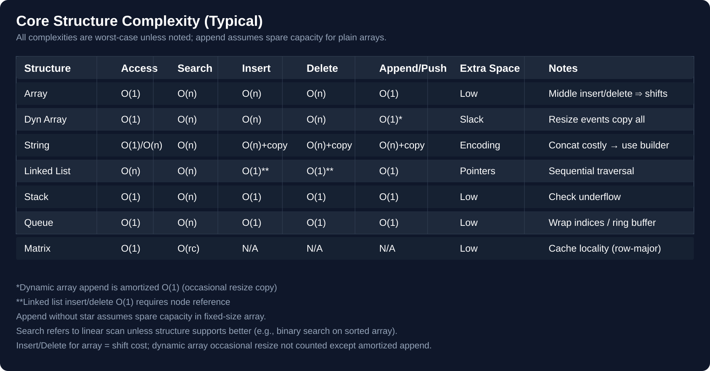

# 💡 Greedy

> **One-line summary**: Make the locally optimal choice at each step — works when local optima lead to a global optimum (proved by exchange argument).

---

## Diagram




## Concept

A greedy algorithm: picks best available option, never backtracks. Works when **greedy choice property** + **optimal substructure** hold. When greedy fails, use DP.

Typically requires initial **sorting**. Time is usually O(n log n).

---

## Common Patterns

### Interval Scheduling (sort by end time)

```javascript
function maxNonOverlapping(intervals) {
  intervals.sort((a, b) => a[1] - b[1]);
  let count = 0,
    lastEnd = -Infinity;
  for (const [s, e] of intervals)
    if (s >= lastEnd) {
      count++;
      lastEnd = e;
    }
  return count;
}
```

### Jump Game

```javascript
function canJump(nums) {
  let maxReach = 0;
  for (let i = 0; i < nums.length; i++) {
    if (i > maxReach) return false;
    maxReach = Math.max(maxReach, i + nums[i]);
  }
  return true;
}
```

---

## Pitfalls

- Greedy doesn't always work — verify with exchange argument or counterexample
- 0/1 Knapsack fails with greedy — use DP
- Greedy needs correct sorting criterion — wrong sort → wrong answer

---

## Practice Problems

| Problem                                                                                                            | Difficulty | Solution |
| ------------------------------------------------------------------------------------------------------------------ | ---------- | -------- |
| [LC 455 — Assign Cookies](https://leetcode.com/problems/assign-cookies/)                                           | Easy       |          |
| [LC 55 — Jump Game](https://leetcode.com/problems/jump-game/)                                                      | Medium     |          |
| [LC 45 — Jump Game II](https://leetcode.com/problems/jump-game-ii/)                                                | Medium     |          |
| [LC 435 — Non-overlapping Intervals](https://leetcode.com/problems/non-overlapping-intervals/)                     | Medium     |          |
| [LC 134 — Gas Station](https://leetcode.com/problems/gas-station/)                                                 | Medium     |          |
| [LC 763 — Partition Labels](https://leetcode.com/problems/partition-labels/)                                       | Medium     |          |
| [LC 406 — Queue Reconstruction by Height](https://leetcode.com/problems/queue-reconstruction-by-height/)           | Medium     |          |
| [LC 1005 — Maximize Sum After K Negations](https://leetcode.com/problems/maximize-sum-of-array-after-k-negations/) | Easy       |          |
| [CC — Good Sequences (CHEFSQ)](https://www.codechef.com/problems/CHEFSQ)                                           | Easy       |          |
| [CC — Election Chips (ELECCHRP)](https://www.codechef.com/problems/ELECCHRP)                                       | Medium     |          |
| [LC 135 — Candy](https://leetcode.com/problems/candy/)                                                             | Hard       |          |
| [LC 122 — Best Time to Buy and Sell Stock II](https://leetcode.com/problems/best-time-to-buy-and-sell-stock-ii/) | Easy |  |
| [LC 860 — Lemonade Change](https://leetcode.com/problems/lemonade-change/) | Easy |  |
| [LC 944 — Delete Columns to Make Sorted](https://leetcode.com/problems/delete-columns-to-make-sorted/) | Easy |  |
| [LC 1221 — Split a String in Balanced Strings](https://leetcode.com/problems/split-a-string-in-balanced-strings/) | Easy |  |
| [LC 1710 — Maximum Units on a Truck](https://leetcode.com/problems/maximum-units-on-a-truck/) | Easy |  |
| [LC 11 — Container With Most Water](https://leetcode.com/problems/container-with-most-water/) | Medium |  |
| [LC 56 — Merge Intervals](https://leetcode.com/problems/merge-intervals/) | Medium |  |
| [LC 452 — Minimum Number of Arrows to Burst Balloons](https://leetcode.com/problems/minimum-number-of-arrows-to-burst-balloons/) | Medium |  |
| [LC 621 — Task Scheduler](https://leetcode.com/problems/task-scheduler/) | Medium |  |
| [LC 714 — Best Time to Buy and Sell Stock with Transaction Fee](https://leetcode.com/problems/best-time-to-buy-and-sell-stock-with-transaction-fee/) | Medium |  |
| [LC 1029 — Two City Scheduling](https://leetcode.com/problems/two-city-scheduling/) | Medium |  |
| [LC 1247 — Minimum Swaps to Make Strings Equal](https://leetcode.com/problems/minimum-swaps-to-make-strings-equal/) | Medium |  |
| [LC 1481 — Least Number of Unique Integers after K Removals](https://leetcode.com/problems/least-number-of-unique-integers-after-k-removals/) | Medium |  |
| [LC 1642 — Furthest Building You Can Reach](https://leetcode.com/problems/furthest-building-you-can-reach/) | Medium |  |
| [LC 1647 — Minimum Deletions to Make Character Frequencies Unique](https://leetcode.com/problems/minimum-deletions-to-make-character-frequencies-unique/) | Medium |  |
| [LC 1899 — Merge Triplets to Form Target Triplet](https://leetcode.com/problems/merge-triplets-to-form-target-triplet/) | Medium |  |
| [CC — Activity Selection (ACTSEL)](https://www.codechef.com/problems/ACTSEL) | Medium |  |
| [CC — Fractional Knapsack (FRACKNAP)](https://www.codechef.com/problems/FRACKNAP) | Medium |  |
| [LC 68 — Text Justification](https://leetcode.com/problems/text-justification/) | Hard |  |
| [LC 321 — Create Maximum Number](https://leetcode.com/problems/create-maximum-number/) | Hard |  |
| [LC 330 — Patching Array](https://leetcode.com/problems/patching-array/) | Hard |  |
| [LC 502 — IPO](https://leetcode.com/problems/ipo/) | Hard |  |
| [LC 630 — Course Schedule III](https://leetcode.com/problems/course-schedule-iii/) | Hard |  |
| [LC 757 — Set Intersection Size At Least Two](https://leetcode.com/problems/set-intersection-size-at-least-two/) | Hard |  |
| [LC 765 — Couples Holding Hands](https://leetcode.com/problems/couples-holding-hands/) | Hard |  |
| [LC 968 — Binary Tree Cameras](https://leetcode.com/problems/binary-tree-cameras/) | Hard |  |
| [LC 1665 — Minimum Initial Energy to Finish Tasks](https://leetcode.com/problems/minimum-initial-energy-to-finish-tasks/) | Hard |  |
| [CC — Job Sequencing (JOBSEQ)](https://www.codechef.com/problems/JOBSEQ) | Hard |  |
| [CC — Advanced Greedy (ADVGREEDY)](https://www.codechef.com/problems/ADVGREEDY) | Hard |  |

---

## Related Topics

- [Dynamic Programming](../dp/README.md) — when greedy fails, DP is next
- [Sorting](../sorting/README.md) — greedy often starts with a sort

[← Back to Home](../index.md) · © sparshjaswal
