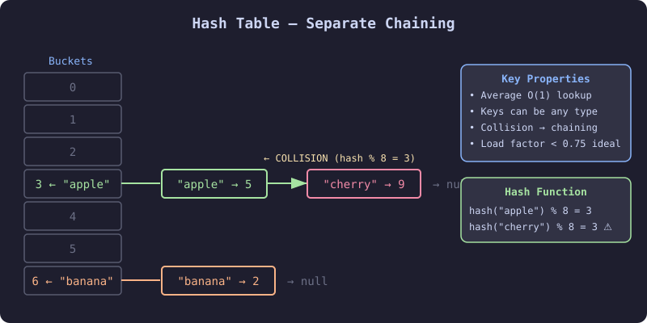
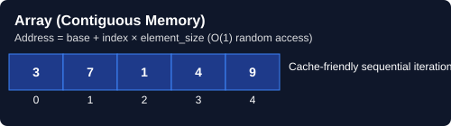

# 🗂️ Hashing (Map / Set)

> **One-line summary**: Use a hash table to achieve O(1) average-time lookup, insertion, and deletion — turning O(n²) brute-force into O(n).

---

### What is Hashing?

### Key Hash Table Components

- **Hash Function**: Converts keys into array indices

### JavaScript Hash Structures

- **Map** (`new Map()`) — **Key-value pairs**; preserves insertion order; any type as key
- **Set** (`new Set()`) — **Unique values only**; no duplicates allowed
- **Object** (`{}`) — **String/Symbol keys**; prototype chain considerations
- **WeakMap/WeakSet** — **Garbage collection friendly**; object keys only

### Performance Characteristics

- **Average case**: **O(1)** insert, lookup, delete
- **Worst case**: **O(n)** due to hash collisions (rare with good hash function)
- **Space complexity**: **O(n)** where n is number of elements

### When to Use Hashing?

✅ **Perfect for:**

- **Fast lookups** (checking if element exists)
- **Counting frequencies** (character/word counting)
- **Removing duplicates** (using Set)
- **Caching/Memoization** (storing computed results)
- **Database indexing** (quick record retrieval)
- **Two-sum type problems** (complement lookup)

❌ **Not suitable for:**

- **Ordered data** (use TreeMap/sorted structures)
- **Range queries** (use segment trees/arrays)
- **Memory-constrained environments** (overhead of hash table)
- **Small datasets** (array iteration might be faster)

---

## 📊 Visual Learning

### Hash Table Structure


_Understanding how hash functions map keys to array indices and handle collisions_


_Step-by-step visualization of key hashing, collision detection, and resolution strategies_


_Comparing array-based storage vs hash table organization for efficient data access_

---

## Time & Space Complexity

| Operation | Average | Worst |
| --------- | ------- | ----- |
| Insert    | O(1)    | O(n)  |
| Lookup    | O(1)    | O(n)  |
| Delete    | O(1)    | O(n)  |
| Space     | O(n)    | O(n)  |

---

## Common Patterns

### Pattern 1 — Frequency Count

```javascript
const freq = new Map();
for (const ch of s) freq.set(ch, (freq.get(ch) || 0) + 1);
```

### Pattern 2 — Complement Lookup (Two Sum)

```javascript
const seen = new Map();
for (let i = 0; i < nums.length; i++) {
  const comp = target - nums[i];
  if (seen.has(comp)) return [seen.get(comp), i];
  seen.set(nums[i], i);
}
```

### Pattern 3 — Canonical Key (Group Anagrams)

```javascript
const groups = new Map();
for (const w of words) {
  const key = w.split('').sort().join('');
  if (!groups.has(key)) groups.set(key, []);
  groups.get(key).push(w);
}
```

### Pattern 4 — Set Membership (Contains Duplicate)

```javascript
const seen = new Set();
for (const n of nums) {
  if (seen.has(n)) return true;
  seen.add(n);
}
return false;
```

---

## Pitfalls

- Using object `{}` as map — breaks with keys like `"__proto__"` — prefer `new Map()`
- Comparing object keys by reference, not value
- Forgetting that `Map.size` ≠ `Object.keys(obj).length`

---

## Practice Problems

| Problem | Difficulty | Solution |
| ------- | ---------- | -------- |

| [LC 1 — Two Sum](https://leetcode.com/problems/two-sum/) | Easy | [View Solution](./LC-1-two-sum) |
| [LC 217 — Contains Duplicate](https://leetcode.com/problems/contains-duplicate/) | Easy | [View Solution](./LC-217-contains-duplicate) |
| [LC 242 — Valid Anagram](https://leetcode.com/problems/valid-anagram/) | Easy | [View Solution](./LC-242-valid-anagram) |
| [LC 929 — Unique Email Addresses](https://leetcode.com/problems/unique-email-addresses/) | Easy | [View Solution](./LC-929-unique-email-addresses) |
| [LC 575 — Distribute Candies](https://leetcode.com/problems/distribute-candies/) | Easy | [View Solution](./LC-575-distribute-candies) |
| [LC 349 — Intersection of Two Arrays](https://leetcode.com/problems/intersection-of-two-arrays/) | Easy | [View Solution](./LC-349-intersection-of-two-arrays) |
| [LC 219 — Contains Duplicate II](https://leetcode.com/problems/contains-duplicate-ii/) | Easy | [View Solution](./LC-219-contains-duplicate-ii) |
| [LC 383 — Ransom Note](https://leetcode.com/problems/ransom-note/) | Easy | |
| [LC 387 — First Unique Character in a String](https://leetcode.com/problems/first-unique-character-in-a-string/) | Easy | |
| [LC 389 — Find the Difference](https://leetcode.com/problems/find-the-difference/) | Easy | |
| [LC 448 — Find All Numbers Disappeared in an Array](https://leetcode.com/problems/find-all-numbers-disappeared-in-an-array/) | Easy | |
| [LC 771 — Jewels and Stones](https://leetcode.com/problems/jewels-and-stones/) | Easy | |
| [LC 1002 — Find Common Characters](https://leetcode.com/problems/find-common-characters/) | Easy | |
| [LC 1207 — Unique Number of Occurrences](https://leetcode.com/problems/unique-number-of-occurrences/) | Easy | |
| [CC — Frequency of Characters (FREQ)](https://www.codechef.com/problems/FREQ) | Easy | |
| [CC — Count Distinct Elements (DISTELEM)](https://www.codechef.com/problems/DISTELEM) | Easy | |
| [LC 49 — Group Anagrams](https://leetcode.com/problems/group-anagrams/) | Medium | [View Solution](./LC-49-group-anagrams) |
| [LC 347 — Top K Frequent Elements](https://leetcode.com/problems/top-k-frequent-elements/) | Medium | [View Solution](./LC-347-top-k-frequent-elements) |
| [LC 128 — Longest Consecutive Sequence](https://leetcode.com/problems/longest-consecutive-sequence/) | Medium | [View Solution](./LC-128-longest-consecutive-sequence) |
| [LC 167 — Two Sum II](https://leetcode.com/problems/two-sum-ii-input-array-is-sorted/) | Medium | [View Solution](./LC-167-two-sum-ii-input-array-is-sorted) |
| [LC 3 — Longest Substring Without Repeating Characters](https://leetcode.com/problems/longest-substring-without-repeating-characters/) | Medium | |
| [LC 36 — Valid Sudoku](https://leetcode.com/problems/valid-sudoku/) | Medium | |
| [LC 187 — Repeated DNA Sequences](https://leetcode.com/problems/repeated-dna-sequences/) | Medium | |
| [LC 454 — 4Sum II](https://leetcode.com/problems/4sum-ii/) | Medium | |
| [LC 560 — Subarray Sum Equals K](https://leetcode.com/problems/subarray-sum-equals-k/) | Medium | |
| [LC 692 — Top K Frequent Words](https://leetcode.com/problems/top-k-frequent-words/) | Medium | |
| [LC 974 — Subarray Sums Divisible by K](https://leetcode.com/problems/subarray-sums-divisible-by-k/) | Medium | |
| [LC 1010 — Pairs of Songs With Total Durations Divisible by 60](https://leetcode.com/problems/pairs-of-songs-with-total-durations-divisible-by-60/) | Medium | |
| [CC — Subarray with Given Sum (SUBSUM)](https://www.codechef.com/problems/SUBSUM) | Medium | |
| [CC — Hash Table Operations (HASHTBL)](https://www.codechef.com/problems/HASHTBL) | Medium | |
| [LC 30 — Substring with Concatenation of All Words](https://leetcode.com/problems/substring-with-concatenation-of-all-words/) | Hard | |
| [LC 41 — First Missing Positive](https://leetcode.com/problems/first-missing-positive/) | Hard | |
| [LC 149 — Max Points on a Line](https://leetcode.com/problems/max-points-on-a-line/) | Hard | |
| [LC 269 — Alien Dictionary](https://leetcode.com/problems/alien-dictionary/) | Hard | |
| [LC 336 — Palindrome Pairs](https://leetcode.com/problems/palindrome-pairs/) | Hard | |
| [CC — Advanced Hashing (ADVHASH)](https://www.codechef.com/problems/ADVHASH) | Hard | |

---

## Related Topics

- [Prefix Sum](../prefix-sum/README.md) — hash maps power "subarray sum = K"
- [Sliding Window](../sliding-window/README.md) — freq maps track window contents
- [Two Pointers](../two-pointers/README.md)
