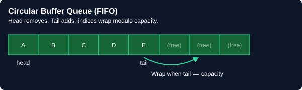
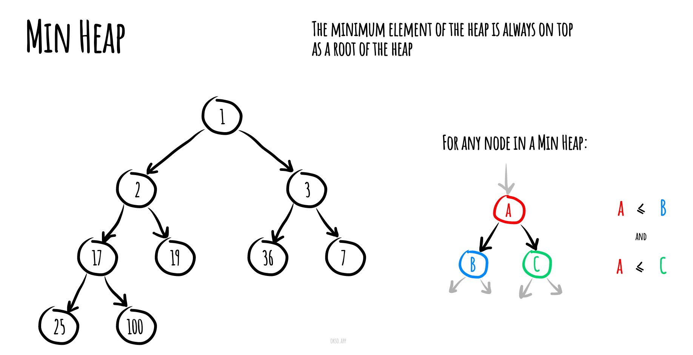
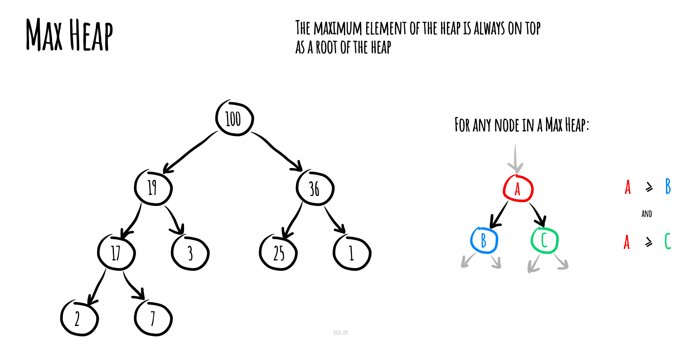

# 🏔️ Heap (Priority Queue)

> **One-line summary**: A complete binary tree satisfying the heap property — O(log n) insert and extract-min/max, the engine behind Top-K, median, K-way merge, and scheduling algorithms.

---

## Diagram




## Concept

- **Min-heap**: parent ≤ children → `peek()` is minimum.
- **Max-heap**: parent ≥ children → `peek()` is maximum.
- JavaScript has no native heap — simulate with sorted array or use `@datastructures-js/priority-queue`.

**Key operations**: insert O(log n), extractMin/Max O(log n), peek O(1), heapify O(n).

---

## Time & Space Complexity

| Operation                      | Time       | Space |
| ------------------------------ | ---------- | ----- |
| Insert                         | O(log n)   | O(1)  |
| Extract min/max                | O(log n)   | O(1)  |
| Peek                           | O(1)       | O(1)  |
| Heapify                        | O(n)       | O(1)  |
| Top-K elements                 | O(n log k) | O(k)  |
| K-way merge (n total, k lists) | O(n log k) | O(k)  |

---

## Common Patterns

### Pattern 1 — Top-K Frequent (Min-Heap of size K)

```javascript
function topKFrequent(nums, k) {
  const freq = new Map();
  for (const n of nums) freq.set(n, (freq.get(n) || 0) + 1);
  return [...freq.entries()]
    .sort((a, b) => b[1] - a[1])
    .slice(0, k)
    .map(([num]) => num);
}
```

### Pattern 2 — Two Heaps (Median from Stream)

```javascript
// maxHeap = lower half, minHeap = upper half
// Invariant: |maxHeap.size - minHeap.size| <= 1
// Median = maxHeap.top() or avg of both tops
```

### Pattern 3 — K-way Merge

```javascript
// 1. Add first element from each list to min-heap with [value, listIdx, elemIdx]
// 2. Extract min → push to result → add next element from same list
// 3. Repeat until heap empty
```

---

## Pitfalls

- JS has no native heap — off-the-shelf sort trick is O(n log n), not O(n log k)
- Rebalancing Two Heaps: ensure size diff ≤ 1 after every insert
- K-way merge: track which list each heap element came from

---

## Practice Problems

| Problem                                                                                                          | Difficulty | Solution                                  |
| ---------------------------------------------------------------------------------------------------------------- | ---------- | ----------------------------------------- |
| [LC 215 — Kth Largest Element](https://leetcode.com/problems/kth-largest-element-in-an-array/)                   | Medium     | [View Solution](./heap/LC-215-kth-largest-element-in-an-array) |
| [LC 973 — K Closest Points to Origin](https://leetcode.com/problems/k-closest-points-to-origin/)                 | Medium     |                                           |
| [LC 295 — Find Median from Data Stream](https://leetcode.com/problems/find-median-from-data-stream/)             | Hard       |                                           |
| [LC 23 — Merge K Sorted Lists](https://leetcode.com/problems/merge-k-sorted-lists/)                              | Hard       |                                           |
| [LC 378 — Kth Smallest in Sorted Matrix](https://leetcode.com/problems/kth-smallest-element-in-a-sorted-matrix/) | Medium     |                                           |
| [LC 373 — Find K Pairs with Smallest Sums](https://leetcode.com/problems/find-k-pairs-with-smallest-sums/)       | Medium     |                                           |
| [LC 480 — Sliding Window Median](https://leetcode.com/problems/sliding-window-median/)                           | Hard       |                                           |
| [LC 502 — IPO](https://leetcode.com/problems/ipo/)                                                               | Hard       |                                           |
| [LC 703 — Kth Largest Element in a Stream](https://leetcode.com/problems/kth-largest-element-in-a-stream/)       | Easy       |                                           |
| [CC — IPC Trainers (IPCTRAIN)](https://www.codechef.com/problems/IPCTRAIN)                                       | Hard       |                                           |
| [LC 1046 — Last Stone Weight](https://leetcode.com/problems/last-stone-weight/)                                  | Easy       |                                           |
| [LC 1337 — The K Weakest Rows in a Matrix](https://leetcode.com/problems/the-k-weakest-rows-in-a-matrix/) | Easy |  |
| [LC 1464 — Maximum Product of Two Elements in an Array](https://leetcode.com/problems/maximum-product-of-two-elements-in-an-array/) | Easy |  |
| [LC 1845 — Seat Reservation Manager](https://leetcode.com/problems/seat-reservation-manager/) | Medium |  |
| [LC 347 — Top K Frequent Elements](https://leetcode.com/problems/top-k-frequent-elements/) | Medium |  |
| [LC 692 — Top K Frequent Words](https://leetcode.com/problems/top-k-frequent-words/) | Medium |  |
| [LC 1167 — Minimum Cost to Connect Sticks](https://leetcode.com/problems/minimum-cost-to-connect-sticks/) | Medium |  |
| [LC 1353 — Maximum Number of Events That Can Be Attended](https://leetcode.com/problems/maximum-number-of-events-that-can-be-attended/) | Medium |  |
| [LC 1642 — Furthest Building You Can Reach](https://leetcode.com/problems/furthest-building-you-can-reach/) | Medium |  |
| [LC 1834 — Single-Threaded CPU](https://leetcode.com/problems/single-threaded-cpu/) | Medium |  |
| [LC 2542 — Maximum Subsequence Score](https://leetcode.com/problems/maximum-subsequence-score/) | Medium |  |
| [CC — Heap Operations (HEAPOPS)](https://www.codechef.com/problems/HEAPOPS) | Medium |  |
| [CC — Priority Queue (PRIORQUE)](https://www.codechef.com/problems/PRIORQUE) | Medium |  |
| [LC 218 — The Skyline Problem](https://leetcode.com/problems/the-skyline-problem/) | Hard |  |
| [LC 239 — Sliding Window Maximum](https://leetcode.com/problems/sliding-window-maximum/) | Hard |  |
| [LC 407 — Trapping Rain Water II](https://leetcode.com/problems/trapping-rain-water-ii/) | Hard |  |
| [LC 632 — Smallest Range Covering Elements from K Lists](https://leetcode.com/problems/smallest-range-covering-elements-from-k-lists/) | Hard |  |
| [LC 857 — Minimum Cost to Hire K Workers](https://leetcode.com/problems/minimum-cost-to-hire-k-workers/) | Hard |  |
| [LC 1439 — Find the Kth Smallest Sum of a Matrix With Sorted Rows](https://leetcode.com/problems/find-the-kth-smallest-sum-of-a-matrix-with-sorted-rows/) | Hard |  |
| [LC 2386 — Find the K-Sum of an Array](https://leetcode.com/problems/find-the-k-sum-of-an-array/) | Hard |  |
| [CC — Advanced Heap (ADVHEAP)](https://www.codechef.com/problems/ADVHEAP) | Hard |  |

---

## Related Topics

- [Trees](../trees/README.md) — heap is a complete binary tree
- [Sorting](../sorting/README.md) — heapsort uses heap operations
- [Graphs](../graphs/README.md) — Dijkstra uses min-heap

---

## Heap Data Structure Reference

The following notes and runnable implementations (with tests) live alongside this guide in this folder.

In computer science, a **heap** is a specialized tree-based data structure that satisfies the heap property described below.

In a *min heap*, if `P` is a parent node of `C`, then the key (the value) of `P` is less than or equal to the key of `C`.



In a *max heap*, the key of `P` is greater than or equal to the key of `C`.




The node at the "top" of the heap with no parents is called the root node.

### Time Complexities

Here are time complexities of various heap data structures. Function names assume a max-heap.

| Operation | find-max | delete-max | insert | increase-key | meld |
| --------- | -------- | ---------- | ------ | ------------ | ---- |
| [Binary](https://en.wikipedia.org/wiki/Binary_heap) | `Θ(1)` | `Θ(log n)` | `O(log n)` | `O(log n)` | `Θ(n)` |
| [Leftist](https://en.wikipedia.org/wiki/Leftist_tree) | `Θ(1)` | `Θ(log n)` | `Θ(log n)` | `O(log n)` | `Θ(log n)` |
| [Binomial](https://en.wikipedia.org/wiki/Binomial_heap) | `Θ(1)` | `Θ(log n)` | `Θ(1)` | `O(log n)` | `O(log n)` |
| [Fibonacci](https://en.wikipedia.org/wiki/Fibonacci_heap) | `Θ(1)` | `Θ(log n)` | `Θ(1)` | `Θ(1)` | `Θ(1)` |
| [Pairing](https://en.wikipedia.org/wiki/Pairing_heap) | `Θ(1)` | `Θ(log n)` | `Θ(1)` | `o(log n)` | `Θ(1)` |
| [Brodal](https://en.wikipedia.org/wiki/Brodal_queue) | `Θ(1)` | `Θ(log n)` | `Θ(1)` | `Θ(1)` | `Θ(1)` |

Where:

- **find-max (or find-min):** find a maximum item of a max-heap, or a minimum item of a min-heap, respectively (a.k.a. *peek*)
- **delete-max (or delete-min):** removing the root node of a max heap (or min heap), respectively
- **insert:** adding a new key to the heap (a.k.a., *push*)
- **increase-key or decrease-key:** updating a key within a max- or min-heap, respectively
- **meld:** joining two heaps to form a valid new heap containing all the elements of both, destroying the original heaps.

> In this repository, the [MaxHeap.js](./MaxHeap.js) and [MinHeap.js](./MinHeap.js) are examples of the **Binary** heap.

### Implementation

- [MaxHeap.js](./MaxHeap.js) and [MinHeap.js](./MinHeap.js)
- [MaxHeapAdhoc.js](./MaxHeapAdhoc.js) and [MinHeapAdhoc.js](./MinHeapAdhoc.js) — the minimalistic (ad hoc) version of a MinHeap/MaxHeap data structure that doesn't have external dependencies and is easy to copy-paste and use during a coding interview.

### References

- [Wikipedia](https://en.wikipedia.org/wiki/Heap_(data_structure))
- [YouTube](https://www.youtube.com/watch?v=t0Cq6tVNRBA&index=5&t=0s&list=PLLXdhg_r2hKA7DPDsunoDZ-Z769jWn4R8)

[← Back to Home](../index.md) · © sparshjaswal
