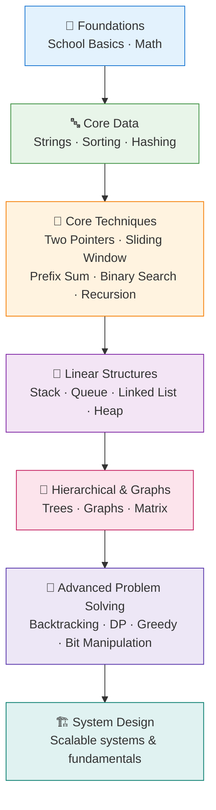

# 📊 DSA Concepts

> **One-line summary**: A structured, topic-wise roadmap through Data Structures & Algorithms — from first principles to advanced problem solving — with visuals, complexity tables, and curated practice.

_Big-O cheat sheet — understand time & space trade-offs across every approach_

---

## 🎯 What Are Data Structures & Algorithms?

- **Data Structures** are ways to **organize and store data** so it can be accessed and modified efficiently (arrays, linked lists, stacks, queues, trees, graphs, heaps, hash tables).
- **Algorithms** are **step-by-step procedures** that operate on that data to solve a problem (searching, sorting, traversal, optimization).

The right data structure paired with the right algorithm is the difference between a program that runs in **milliseconds** and one that runs in **hours**. Mastering DSA sharpens your problem-solving, prepares you for **coding interviews**, and makes you a stronger engineer for real-world systems.

> 💡 **Complexity first**: Every topic below includes a **Big-O time/space table**. Learn to reason about complexity before optimizing.

---

## 🗺️ Recommended Learning Path

**How to progress:**

1. **Foundations** — build fluency with basic programming and math for algorithmic thinking.
2. **Core Data** — learn how strings, sorting, and hashing power almost every problem.
3. **Core Techniques** — the reusable patterns interviewers love (two pointers, sliding window, binary search).
4. **Linear Structures** — model order and access patterns with stacks, queues, lists, and heaps.
5. **Hierarchical & Graphs** — traverse and reason over trees and graphs.
6. **Advanced Problem Solving** — combine everything with backtracking, DP, greedy, and bit tricks.
7. **System Design** — scale your knowledge to real, distributed systems.

---

## 📚 Topic Directory

All topics are grouped by category and cross-linked. Each page includes explanations, complexity tables, patterns, worked examples, and practice problems.

### 🏫 Foundations

| Topic                                         | What You'll Learn                              | Typical Complexity |
| --------------------------------------------- | ---------------------------------------------- | ------------------ |
| [🏫 School Basics](./school-basics/README.md) | Core programming constructs & basic algorithms | Varies             |
| [🔢 Math](./math/README.md)                   | GCD, primes, modular arithmetic, combinatorics | O(√n) – O(n)       |

### 🔤 Arrays, Strings & Sorting

| Topic                             | What You'll Learn                            | Typical Complexity |
| --------------------------------- | -------------------------------------------- | ------------------ |
| [🔤 Strings](./strings/README.md) | Pattern matching, two pointers, hashing, KMP | O(n) – O(n+m)      |
| [🔃 Sorting](./sorting/README.md) | Comparison & non-comparison sorts, stability | O(n log n)         |
| [🗺️ Hashing](./hashing/README.md) | Hash maps/sets for O(1) lookups              | O(1) avg           |

### 🔧 Core Techniques

| Topic                                                  | What You'll Learn                                | Typical Complexity |
| ------------------------------------------------------ | ------------------------------------------------ | ------------------ |
| [🎯 Two Pointers](./two-pointers/README.md)            | Converging/parallel pointers on arrays           | O(n)               |
| [🪟 Sliding Window](./sliding-window/README.md)        | Fixed/variable windows for subarrays             | O(n)               |
| [➕ Prefix Sum](./prefix-sum/README.md)                | O(1) range queries after preprocessing           | O(1) query         |
| [🔍 Binary Search](./binary-search/README.md)          | Search sorted spaces & "binary search on answer" | O(log n)           |
| [🔁 Recursion](./recursion/README.md)                  | Divide & conquer, call stacks, memoization       | Varies             |
| [📉 Kadane's Algorithm](./kadanes-algorithm/README.md) | Maximum subarray sum                             | O(n)               |

### 🧱 Linear Data Structures

| Topic                                             | What You'll Learn                   | Typical Complexity   |
| ------------------------------------------------- | ----------------------------------- | -------------------- |
| [🥞 Stack](./stack/README.md)                     | LIFO, expression parsing, DFS       | O(1) push/pop        |
| [🚶 Queue](./queue/README.md)                     | FIFO, BFS, scheduling               | O(1) enqueue/dequeue |
| [🔗 Linked List](./linked-list/README.md)         | Pointers, reversal, cycle detection | O(n)                 |
| [⛰️ Heap](./heap/README.md)                       | Priority queues, Top-K, heapsort    | O(log n)             |
| [📏 Monotonic Stack](./monotonic-stack/README.md) | Next greater/smaller element        | O(n)                 |

### 🌳 Non-Linear Data Structures

| Topic                           | What You'll Learn              | Typical Complexity |
| ------------------------------- | ------------------------------ | ------------------ |
| [🔲 Matrix](./matrix/README.md) | 2D traversal, rotation, spiral | O(m·n)             |
| [🌳 Trees](./trees/README.md)   | Traversals, BST, LCA, tree DP  | O(n)               |
| [🕸️ Graphs](./graphs/README.md) | BFS, DFS, shortest paths, MST  | O(V+E)             |

### 🚀 Advanced Problem Solving

| Topic                                               | What You'll Learn                             | Typical Complexity |
| --------------------------------------------------- | --------------------------------------------- | ------------------ |
| [🔙 Backtracking](./backtracking/README.md)         | Exhaustive search with pruning                | O(bᵈ)              |
| [🧠 Dynamic Programming](./dp/README.md)            | Overlapping subproblems, optimal substructure | O(n) – O(n²)       |
| [💡 Greedy](./greedy/README.md)                     | Locally optimal choices, exchange argument    | O(n log n)         |
| [🔢 Bit Manipulation](./bit-manipulation/README.md) | XOR tricks, masks, set-bit counting           | O(1) – O(n)        |

---

## ⚡ Big-O Quick Reference

| Complexity | Name         | Example                        |
| ---------- | ------------ | ------------------------------ |
| O(1)       | Constant     | Hash lookup, array index       |
| O(log n)   | Logarithmic  | Binary search, balanced BST    |
| O(n)       | Linear       | Single pass, prefix sum build  |
| O(n log n) | Linearithmic | Merge sort, heap sort          |
| O(n²)      | Quadratic    | Nested loops, bubble sort      |
| O(2ⁿ)      | Exponential  | Naive recursion (fib), subsets |
| O(n!)      | Factorial    | Permutations, brute-force TSP  |

> See the [complexity cheat sheet](../assets/images/complexity-cheat-sheet.svg) above for a visual comparison.

---

## 🧭 Where to Begin

**Beginner?** Start here in order:

1. [School Basics](./school-basics/README.md)
2. [Math](./math/README.md)
3. [Strings](./strings/README.md)
4. [Sorting](./sorting/README.md) & [Hashing](./hashing/README.md)

**Comfortable with basics?** Build pattern fluency:

1. [Two Pointers](./two-pointers/README.md)
2. [Sliding Window](./sliding-window/README.md)
3. [Prefix Sum](./prefix-sum/README.md)
4. [Binary Search](./binary-search/README.md) & [Recursion](./recursion/README.md)

**Interview prep?** Master structures and advanced topics:

1. [Stack](./stack/README.md), [Queue](./queue/README.md), [Linked List](./linked-list/README.md), [Heap](./heap/README.md)
2. [Trees](./trees/README.md) & [Graphs](./graphs/README.md)
3. [Dynamic Programming](./dp/README.md), [Greedy](./greedy/README.md), [Backtracking](./backtracking/README.md), [Bit Manipulation](./bit-manipulation/README.md)

---

## 🎯 How to Use These Docs

- **Read the concept** and study the visual/mermaid diagram.
- **Memorize the complexity table** — interviewers always ask.
- **Type out the code templates** — don't just read them.
- **Solve the practice problems** from Easy → Medium → Hard.
- **Cross-link topics** — most hard problems combine two or more patterns.

[Start Learning →](./school-basics/README.md) · © sparshjaswal
