# 📈 Kadane's Algorithm

> **One-line summary**: Find the maximum-sum contiguous subarray in O(n) by tracking the best sum ending at each position.

---

## Concept

At each index decide: extend the previous subarray, or start fresh?

```
maxEndHere = max(arr[i], maxEndHere + arr[i])
maxSoFar   = max(maxSoFar, maxEndHere)
```

---

## Diagram




---

## Time & Space Complexity

| Variant               | Time | Space |
| --------------------- | ---- | ----- |
| Max subarray sum      | O(n) | O(1)  |
| Circular max subarray | O(n) | O(1)  |

---

## Common Patterns

### Basic Kadane

```javascript
function maxSubarraySum(arr) {
  let maxEndHere = arr[0],
    maxSoFar = arr[0];
  for (let i = 1; i < arr.length; i++) {
    maxEndHere = Math.max(arr[i], maxEndHere + arr[i]);
    maxSoFar = Math.max(maxSoFar, maxEndHere);
  }
  return maxSoFar;
}
```

### Circular Variant

```javascript
function maxCircular(arr) {
  const total = arr.reduce((s, x) => s + x, 0);
  const maxLinear = kadane(arr);
  const minLinear = kadane(arr.map((x) => -x));
  const maxCircular = total + minLinear;
  return maxCircular === 0 ? maxLinear : Math.max(maxLinear, maxCircular);
}
```

---

## Pitfalls

- All-negative array: result is the largest single element, not 0
- Circular variant: if all elements are negative the circular answer is 0 — guard against it

---

## Practice Problems

| Problem                                                                                                                                                    | Difficulty | Solution                                  |
| ---------------------------------------------------------------------------------------------------------------------------------------------------------- | ---------- | ----------------------------------------- |
| [LC 53 — Maximum Subarray](https://leetcode.com/problems/maximum-subarray/)                                                                                | Medium     | [View Solution](./LC-53-maximum-subarray) |
| [LC 918 — Maximum Sum Circular Subarray](https://leetcode.com/problems/maximum-sum-circular-subarray/)                                                     | Medium     |                                           |
| [LC 152 — Maximum Product Subarray](https://leetcode.com/problems/maximum-product-subarray/)                                                               | Medium     |                                           |
| [LC 1749 — Maximum Absolute Sum of Any Subarray](https://leetcode.com/problems/maximum-absolute-sum-of-any-subarray/)                                      | Medium     |                                           |
| [LC 238 — Product of Array Except Self](https://leetcode.com/problems/product-of-array-except-self/)                                                       | Medium     |                                           |
| [CC — Maximum Subarray Sum (KCON)](https://www.codechef.com/problems/KCON)                                                                                 | Medium     |                                           |
| [LC 643 — Maximum Average Subarray I](https://leetcode.com/problems/maximum-average-subarray-i/)                                                           | Easy       |                                           |
| [LC 325 — Maximum Size Subarray Sum Equals k](https://leetcode.com/problems/maximum-size-subarray-sum-equals-k/)                                           | Medium     |                                           |
| [LC 1567 — Maximum Length of Subarray With Positive Product](https://leetcode.com/problems/maximum-length-of-subarray-with-positive-product/)              | Medium     |                                           |
| [LC 1856 — Maximum Subarray Min-Product](https://leetcode.com/problems/maximum-subarray-min-product/)                                                      | Medium     |                                           |
| [LC 1186 — Maximum Subarray Sum with One Deletion](https://leetcode.com/problems/maximum-subarray-sum-with-one-deletion/)                                  | Medium     |                                           |
| [LC 121 — Best Time to Buy and Sell Stock](https://leetcode.com/problems/best-time-to-buy-and-sell-stock/)                                                 | Easy       |                                           |
| [LC 122 — Best Time to Buy and Sell Stock II](https://leetcode.com/problems/best-time-to-buy-and-sell-stock-ii/)                                           | Medium     |                                           |
| [LC 697 — Degree of an Array](https://leetcode.com/problems/degree-of-an-array/)                                                                           | Easy       |                                           |
| [LC 978 — Longest Turbulent Subarray](https://leetcode.com/problems/longest-turbulent-subarray/)                                                           | Medium     |                                           |
| [LC 1004 — Max Consecutive Ones III](https://leetcode.com/problems/max-consecutive-ones-iii/)                                                              | Medium     |                                           |
| [LC 1191 — K-Concatenation Maximum Sum](https://leetcode.com/problems/k-concatenation-maximum-sum/)                                                        | Medium     |                                           |
| [LC 1395 — Count Number of Teams](https://leetcode.com/problems/count-number-of-teams/)                                                                    | Medium     |                                           |
| [LC 1524 — Number of Sub-arrays With Odd Sum](https://leetcode.com/problems/number-of-sub-arrays-with-odd-sum/)                                            | Medium     |                                           |
| [LC 1546 — Maximum Number of Non-Overlapping Subarrays](https://leetcode.com/problems/maximum-number-of-non-overlapping-subarrays-with-sum-equals-target/) | Medium     |                                           |
| [CC — Chef and Subarrays (CHEFSUM)](https://www.codechef.com/problems/CHEFSUM)                                                                             | Medium     |                                           |
| [CC — Maximum Subarray (MAXSUM)](https://www.codechef.com/problems/MAXSUM)                                                                                 | Easy       |                                           |
| [CC — Subarray with Given Sum (SUBSUM)](https://www.codechef.com/problems/SUBSUM)                                                                          | Medium     |                                           |

---

## Related Topics

- [Prefix Sum](../prefix-sum/README.md) — complementary single-pass technique
- [Dynamic Programming](../dp/README.md) — Kadane is a 1D DP solved greedily
- [Sliding Window](../sliding-window/README.md) — for bounded subarray variants

[← Back to Home](../index.md) · © sparshjaswal
