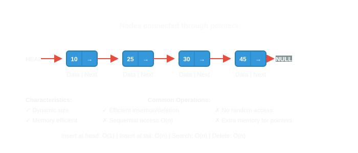

# 🔗 Linked List

> **One-line summary**: A dynamic chain of nodes — O(1) insert/delete at known position, O(n) access by index. Master reversal, cycle detection, and merge patterns.

---

## Concept

Each **node**: `val` + `next` pointer (singly), or `prev`+`next` (doubly).

**Types**: Singly, Doubly, Circular.

---

## Diagram




---

## Time & Space Complexity

| Operation                 | Time | Space |
| ------------------------- | ---- | ----- |
| Access by index           | O(n) | O(1)  |
| Insert/Delete at head     | O(1) | O(1)  |
| Reverse                   | O(n) | O(1)  |
| Cycle detection (Floyd's) | O(n) | O(1)  |
| Find middle               | O(n) | O(1)  |

---

## Common Patterns

### Reverse (Iterative)

```javascript
function reverseList(head) {
  let prev = null,
    curr = head;
  while (curr) {
    const next = curr.next;
    curr.next = prev;
    prev = curr;
    curr = next;
  }
  return prev;
}
```

### Cycle Detection (Floyd's)

```javascript
function hasCycle(head) {
  let slow = head,
    fast = head;
  while (fast && fast.next) {
    slow = slow.next;
    fast = fast.next.next;
    if (slow === fast) return true;
  }
  return false;
}
```

### Find Middle

```javascript
function findMiddle(head) {
  let slow = head,
    fast = head;
  while (fast && fast.next) {
    slow = slow.next;
    fast = fast.next.next;
  }
  return slow;
}
```

### Merge Two Sorted Lists

```javascript
function mergeTwoLists(l1, l2) {
  const dummy = { next: null };
  let cur = dummy;
  while (l1 && l2) {
    if (l1.val <= l2.val) {
      cur.next = l1;
      l1 = l1.next;
    } else {
      cur.next = l2;
      l2 = l2.next;
    }
    cur = cur.next;
  }
  cur.next = l1 || l2;
  return dummy.next;
}
```

---

## Pitfalls

- Losing reference to `next` before reassigning — store it first
- Forgetting to update `tail.next = null` after reversal
- Off-by-one in middle finding: even-length list has two middles

---

## Practice Problems

| Problem                                                                                                                                         | Difficulty | Solution |
| ----------------------------------------------------------------------------------------------------------------------------------------------- | ---------- | -------- |
| [LC 206 — Reverse Linked List](https://leetcode.com/problems/reverse-linked-list/)                                                              | Easy       |          |
| [LC 160 — Intersection of Two Linked Lists](https://leetcode.com/problems/intersection-of-two-linked-lists/)                                    | Easy       |          |
| [LC 141 — Linked List Cycle](https://leetcode.com/problems/linked-list-cycle/)                                                                  | Easy       |          |
| [LC 876 — Middle of the Linked List](https://leetcode.com/problems/middle-of-the-linked-list/)                                                  | Easy       |          |
| [LC 19 — Remove Nth Node From End](https://leetcode.com/problems/remove-nth-node-from-end-of-list/)                                             | Medium     |          |
| [LC 143 — Reorder List](https://leetcode.com/problems/reorder-list/)                                                                            | Medium     |          |
| [LC 234 — Palindrome Linked List](https://leetcode.com/problems/palindrome-linked-list/)                                                        | Easy       |          |
| [LC 25 — Reverse Nodes in k-Group](https://leetcode.com/problems/reverse-nodes-in-k-group/)                                                     | Hard       |          |
| [LC 138 — Copy List with Random Pointer](https://leetcode.com/problems/copy-list-with-random-pointer/)                                          | Medium     |          |
| [CC — Linked List Operations (LISTOPS)](https://www.codechef.com/problems/LISTOPS)                                                              | Medium     |          |
| [LC 2 — Add Two Numbers](https://leetcode.com/problems/add-two-numbers/)                                                                        | Medium     |          |
| [LC 21 — Merge Two Sorted Lists](https://leetcode.com/problems/merge-two-sorted-lists/)                                                         | Easy       |          |
| [LC 83 — Remove Duplicates from Sorted List](https://leetcode.com/problems/remove-duplicates-from-sorted-list/)                                 | Easy       |          |
| [LC 203 — Remove Linked List Elements](https://leetcode.com/problems/remove-linked-list-elements/)                                              | Easy       |          |
| [LC 237 — Delete Node in a Linked List](https://leetcode.com/problems/delete-node-in-a-linked-list/)                                            | Easy       |          |
| [LC 1290 — Convert Binary Number in a Linked List to Integer](https://leetcode.com/problems/convert-binary-number-in-a-linked-list-to-integer/) | Easy       |          |
| [LC 1474 — Delete N Nodes After M Nodes of a Linked List](https://leetcode.com/problems/delete-n-nodes-after-m-nodes-of-a-linked-list/)         | Easy       |          |
| [LC 24 — Swap Nodes in Pairs](https://leetcode.com/problems/swap-nodes-in-pairs/)                                                               | Medium     |          |
| [LC 61 — Rotate List](https://leetcode.com/problems/rotate-list/)                                                                               | Medium     |          |
| [LC 82 — Remove Duplicates from Sorted List II](https://leetcode.com/problems/remove-duplicates-from-sorted-list-ii/)                           | Medium     |          |
| [LC 86 — Partition List](https://leetcode.com/problems/partition-list/)                                                                         | Medium     |          |
| [LC 92 — Reverse Linked List II](https://leetcode.com/problems/reverse-linked-list-ii/)                                                         | Medium     |          |
| [LC 142 — Linked List Cycle II](https://leetcode.com/problems/linked-list-cycle-ii/)                                                            | Medium     |          |
| [LC 147 — Insertion Sort List](https://leetcode.com/problems/insertion-sort-list/)                                                              | Medium     |          |
| [LC 148 — Sort List](https://leetcode.com/problems/sort-list/)                                                                                  | Medium     |          |
| [LC 328 — Odd Even Linked List](https://leetcode.com/problems/odd-even-linked-list/)                                                            | Medium     |          |
| [LC 445 — Add Two Numbers II](https://leetcode.com/problems/add-two-numbers-ii/)                                                                | Medium     |          |
| [LC 725 — Split Linked List in Parts](https://leetcode.com/problems/split-linked-list-in-parts/)                                                | Medium     |          |
| [LC 817 — Linked List Components](https://leetcode.com/problems/linked-list-components/)                                                        | Medium     |          |
| [LC 1019 — Next Greater Node In Linked List](https://leetcode.com/problems/next-greater-node-in-linked-list/)                                   | Medium     |          |
| [LC 1367 — Linked List in Binary Tree](https://leetcode.com/problems/linked-list-in-binary-tree/)                                               | Medium     |          |
| [LC 1721 — Swapping Nodes in a Linked List](https://leetcode.com/problems/swapping-nodes-in-a-linked-list/)                                     | Medium     |          |
| [CC — Linked List Operations (LISTOPS)](https://www.codechef.com/problems/LISTOPS)                                                              | Medium     |          |
| [CC — Reverse Linked List (REVLIST)](https://www.codechef.com/problems/REVLIST)                                                                 | Medium     |          |
| [CC — Merge Sorted Lists (MERGESORT)](https://www.codechef.com/problems/MERGESORT)                                                              | Medium     |          |
| [LC 23 — Merge k Sorted Lists](https://leetcode.com/problems/merge-k-sorted-lists/)                                                             | Hard       |          |
| [LC 146 — LRU Cache](https://leetcode.com/problems/lru-cache/)                                                                                  | Hard       |          |
| [LC 460 — LFU Cache](https://leetcode.com/problems/lfu-cache/)                                                                                  | Hard       |          |
| [LC 1206 — Design Skiplist](https://leetcode.com/problems/design-skiplist/)                                                                     | Hard       |          |
| [CC — Advanced Linked List (ADVLIST)](https://www.codechef.com/problems/ADVLIST)                                                                | Hard       |          |

---

## Related Topics

- [Two Pointers](../two-pointers/README.md) — fast/slow is a linked-list technique
- [Stack](../stack/README.md) — LRU = doubly linked list + hash map
- [Trees](../trees/README.md) — tree nodes are linked nodes with more pointers

[← Back to Home](../index.md) · © sparshjaswal
