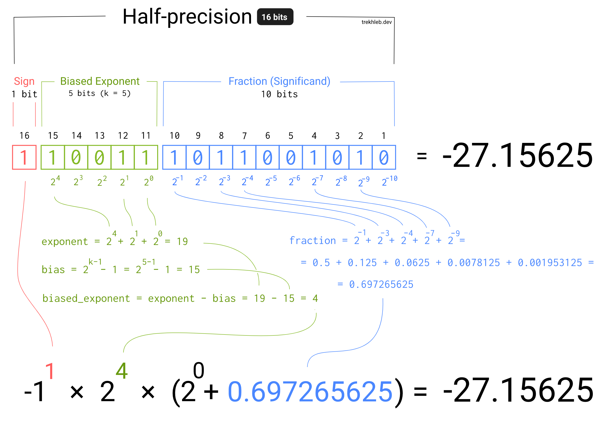

# Binary representation of floating-point numbers

Have you ever wondered how computers store the floating-point numbers like `3.1416` (𝝿) or `9.109 × 10⁻³¹` (the mass of the electron in kg) in the memory which is limited by a finite number of ones and zeroes (aka bits)?

It seems pretty straightforward for integers (i.e. `17`). Let's say we have 16 bits (2 bytes) to store the number. In 16 bits we may store the integers in a range of `[0, 65535]`:

```text
(0000000000000000)₂ = (0)₁₀

(0000000000010001)₂ =
    (1 × 2⁴) +
    (0 × 2³) +
    (0 × 2²) +
    (0 × 2¹) +
    (1 × 2⁰) = (17)₁₀

(1111111111111111)₂ =
    (1 × 2¹⁵) +
    (1 × 2¹⁴) +
    (1 × 2¹³) +
    (1 × 2¹²) +
    (1 × 2¹¹) +
    (1 × 2¹⁰) +
    (1 × 2⁹) +
    (1 × 2⁸) +
    (1 × 2⁷) +
    (1 × 2⁶) +
    (1 × 2⁵) +
    (1 × 2⁴) +
    (1 × 2³) +
    (1 × 2²) +
    (1 × 2¹) +
    (1 × 2⁰) = (65535)₁₀
```

If we need a signed integer we may use [two's complement](https://en.wikipedia.org/wiki/Two%27s_complement) and shift the range of `[0, 65535]` towards the negative numbers. In this case, our 16 bits would represent the numbers in a range of `[-32768, +32767]`.

As you might have noticed, this approach won't allow you to represent the numbers like `-27.15625` (numbers after the decimal point are just being ignored).

We're not the first ones who have noticed this issue though. Around ≈36 years ago some smart folks overcame this limitation by introducing the [IEEE 754](https://en.wikipedia.org/wiki/IEEE_754) standard for floating-point arithmetic.

The IEEE 754 standard describes the way (the framework) of using those 16 bits (or 32, or 64 bits) to store the numbers of wider range, including the small floating numbers (smaller than 1 and closer to 0).

To get the idea behind the standard we might recall the [scientific notation](https://en.wikipedia.org/wiki/Scientific_notation) - a way of expressing numbers that are too large or too small (usually would result in a long string of digits) to be conveniently written in decimal form.


As you may see from the image, the number representation might be split into three parts:

- **sign**
- **fraction (aka significand)** - the valuable digits (the meaning, the payload) of the number
- **exponent** - controls how far and in which direction to move the decimal point in the fraction

The **base** part we may omit by just agreeing on what it will be equal to. In our case, we'll be using `2` as a base.

Instead of using all 16 bits (or 32 bits, or 64 bits) to store the fraction of the number, we may share the bits and store a sign, exponent, and fraction at the same time. Depending on the number of bits that we're going to use to store the number we end up with the following splits:

| Floating-point format                                                                    | Total bits | Sign bits | Exponent bits | Fraction bits | Base |
| :--------------------------------------------------------------------------------------- | :--------: | :-------: | :-----------: | :-----------: | :--: |
| [Half-precision](https://en.wikipedia.org/wiki/Half-precision_floating-point_format)     |     16     |     1     |       5       |      10       |  2   |
| [Single-precision](https://en.wikipedia.org/wiki/Single-precision_floating-point_format) |     32     |     1     |       8       |      23       |  2   |
| [Double-precision](https://en.wikipedia.org/wiki/Double-precision_floating-point_format) |     64     |     1     |      11       |      52       |  2   |

With this approach, the number of bits for the fraction has been reduced (i.e. for the 16-bits number it was reduced from 16 bits to 10 bits). It means that the fraction might take a narrower range of values now (losing some precision). However, since we also have an exponent part, it will actually increase the ultimate number range and also allow us to describe the numbers between 0 and 1 (if the exponent is negative).

> For example, a signed 32-bit integer variable has a maximum value of 2³¹ − 1 = 2,147,483,647, whereas an IEEE 754 32-bit base-2 floating-point variable has a maximum value of ≈ 3.4028235 × 10³⁸.

To make it possible to have a negative exponent, the IEEE 754 standard uses the [biased exponent](https://en.wikipedia.org/wiki/Exponent_bias). The idea is simple - subtract the bias from the exponent value to make it negative. For example, if the exponent has 5 bits, it might take the values from the range of `[0, 31]` (all values are positive here). But if we subtract the value of `15` from it, the range will be `[-15, 16]`. The number `15` is called bias, and it is being calculated by the following formula:

```
exponent_bias = 2 ^ (k−1) − 1

k - number of exponent bits
```

I've tried to describe the logic behind the converting of floating-point numbers from a binary format back to the decimal format on the image below. Hopefully, it will give you a better understanding of how the IEEE 754 standard works. The 16-bits number is being used here for simplicity, but the same approach works for 32-bits and 64-bits numbers as well.



> Checkout the [interactive version of this diagram](https://trekhleb.dev/blog/2021/binary-floating-point/) to play around with setting bits on and off, and seeing how it would influence the final result

Here is the number ranges that different floating-point formats support:

| Floating-point format | Exp min | Exp max | Range             | Min positive |
| :-------------------- | :------ | :------ | :---------------- | :----------- |
| Half-precision        | −14     | +15     | ±65,504           | 6.10 × 10⁻⁵  |
| Single-precision      | −126    | +127    | ±3.4028235 × 10³⁸ | 1.18 × 10⁻³⁸ |

Be aware that this is by no means a complete and sufficient overview of the IEEE 754 standard. It is rather a simplified and basic overview. Several corner cases were omitted in the examples above for simplicity of presentation (i.e. `-0`, `-∞`, `+∞` and `NaN` (not a number) values)

## Code examples

- See the [bitsToFloat.js](bitsToFloat.js) for the example of how to convert array of bits to the floating point number (the example is a bit artificial but still it gives the overview of how the conversion is going on)
- See the [floatAsBinaryString.js](floatAsBinaryString.js) for the example of how to see the actual binary representation of the floating-point number in JavaScript

## References

You might also want to check out the following resources to get a deeper understanding of the binary representation of floating-point numbers:

- [Interactive version of this article](https://trekhleb.dev/blog/2021/binary-floating-point/) (allows setting the bits manually and seeing the resulting floating number)
- [Here is what you need to know about JavaScript’s Number type](https://indepth.dev/posts/1139/here-is-what-you-need-to-know-about-javascripts-number-type)
- [Float Exposed](https://float.exposed/)
- [IEEE754 Visualization](https://bartaz.github.io/ieee754-visualization/)
