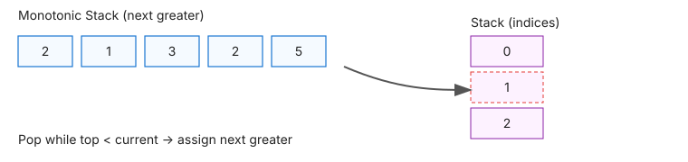

# 📉 Monotonic Stack

> **One-line summary**: A stack that maintains a strictly increasing or decreasing order — enabling O(n) solutions for "next greater/smaller element" and span problems.

---

## Concept

A **monotonic stack** is a stack where elements are always in monotonically increasing or decreasing order. When a new element violates the order, pop elements until the invariant is restored — those popped elements have found their answer.

**Key insight**: each element is pushed and popped at most once → **O(n) total**.

- **Decreasing stack** → used for "next greater element"
- **Increasing stack** → used for "next smaller element"

---

## Diagram




---

## Time & Space Complexity

| Operation                      | Time | Space |
| ------------------------------ | ---- | ----- |
| Build NGE array                | O(n) | O(n)  |
| Daily Temperatures             | O(n) | O(n)  |
| Largest Rectangle in Histogram | O(n) | O(n)  |

---

## Common Patterns

### Pattern 1 — Next Greater Element

```javascript
function nextGreaterElement(nums) {
  const result = new Array(nums.length).fill(-1);
  const stack = []; // stores indices
  for (let i = 0; i < nums.length; i++) {
    while (stack.length && nums[i] > nums[stack[stack.length - 1]]) result[stack.pop()] = nums[i];
    stack.push(i);
  }
  return result;
}
```

### Pattern 2 — Daily Temperatures

```javascript
function dailyTemperatures(temps) {
  const result = new Array(temps.length).fill(0);
  const stack = [];
  for (let i = 0; i < temps.length; i++) {
    while (stack.length && temps[i] > temps[stack[stack.length - 1]]) {
      const idx = stack.pop();
      result[idx] = i - idx;
    }
    stack.push(i);
  }
  return result;
}
```

---

## When to Use

- Finding next/previous greater or smaller elements
- Range-based problems with comparisons
- Span and width problems (largest rectangle, trapping rain)
- Stock span problems

---

## Pitfalls

- Storing values instead of indices (indices let you compute distances)
- Forgetting to process remaining elements left in the stack at the end
- Confusing increasing vs decreasing stack direction

---

## Practice Problems

| Problem                                                                                                                         | Difficulty | Solution                                         |
| ------------------------------------------------------------------------------------------------------------------------------- | ---------- | ------------------------------------------------ |
| [LC 496 — Next Greater Element I](https://leetcode.com/problems/next-greater-element-i/)                                        | Easy       | [View Solution](./LC-496-next-greater-element-i) |
| [LC 739 — Daily Temperatures](https://leetcode.com/problems/daily-temperatures/)                                                | Medium     | [View Solution](./LC-739-daily-temperatures)     |
| [LC 503 — Next Greater Element II](https://leetcode.com/problems/next-greater-element-ii/)                                      | Medium     |                                                  |
| [LC 901 — Online Stock Span](https://leetcode.com/problems/online-stock-span/)                                                  | Medium     |                                                  |
| [LC 84 — Largest Rectangle in Histogram](https://leetcode.com/problems/largest-rectangle-in-histogram/)                         | Hard       |                                                  |
| [LC 42 — Trapping Rain Water](https://leetcode.com/problems/trapping-rain-water/)                                               | Hard       |                                                  |
| [LC 85 — Maximal Rectangle](https://leetcode.com/problems/maximal-rectangle/)                                                   | Hard       |                                                  |
| [LC 907 — Sum of Subarray Minimums](https://leetcode.com/problems/sum-of-subarray-minimums/)                                    | Medium     |                                                  |
| [LC 456 — 132 Pattern](https://leetcode.com/problems/132-pattern/)                                                              | Medium     |                                                  |
| [CC — Monotonicity Check (MONOTON)](https://www.codechef.com/problems/MONOTON)                                                  | Easy       |                                                  |
| [LC 2104 — Sum of Subarray Ranges](https://leetcode.com/problems/sum-of-subarray-ranges/)                                       | Medium     |                                                  |
| [LC 316 — Remove Duplicate Letters](https://leetcode.com/problems/remove-duplicate-letters/)                                    | Medium     |                                                  |
| [LC 402 — Remove K Digits](https://leetcode.com/problems/remove-k-digits/)                                                      | Medium     |                                                  |
| [LC 581 — Shortest Unsorted Continuous Subarray](https://leetcode.com/problems/shortest-unsorted-continuous-subarray/)          | Medium     |                                                  |
| [LC 962 — Maximum Width Ramp](https://leetcode.com/problems/maximum-width-ramp/)                                                | Medium     |                                                  |
| [LC 1019 — Next Greater Node in Linked List](https://leetcode.com/problems/next-greater-node-in-linked-list/)                   | Medium     |                                                  |
| [LC 1124 — Longest Well-Performing Interval](https://leetcode.com/problems/longest-well-performing-interval/)                   | Medium     |                                                  |
| [LC 1130 — Minimum Cost Tree From Leaf Values](https://leetcode.com/problems/minimum-cost-tree-from-leaf-values/)               | Medium     |                                                  |
| [LC 1475 — Final Prices With a Special Discount](https://leetcode.com/problems/final-prices-with-a-special-discount-in-a-shop/) | Easy       |                                                  |
| [LC 1504 — Count Submatrices With All Ones](https://leetcode.com/problems/count-submatrices-with-all-ones/)                     | Medium     |                                                  |
| [LC 1673 — Find the Most Competitive Subsequence](https://leetcode.com/problems/find-the-most-competitive-subsequence/)         | Medium     |                                                  |
| [LC 1793 — Maximum Score of a Good Subarray](https://leetcode.com/problems/maximum-score-of-a-good-subarray/)                   | Hard       |                                                  |
| [LC 2289 — Steps to Make Array Non-decreasing](https://leetcode.com/problems/steps-to-make-array-non-decreasing/)               | Medium     |                                                  |
| [CC — Stack Operations (STACKOP)](https://www.codechef.com/problems/STACKOP)                                                    | Easy       |                                                  |
| [CC — Histogram Area (HISTAREA)](https://www.codechef.com/problems/HISTAREA)                                                    | Medium     |                                                  |

---

## Related Topics

- [Stack](../stack/README.md) — monotonic stack is a specialised stack
- [Sliding Window](../sliding-window/README.md) — sliding window maximum uses monotonic deque

[← Back to Home](../index.md) · © sparshjaswal
