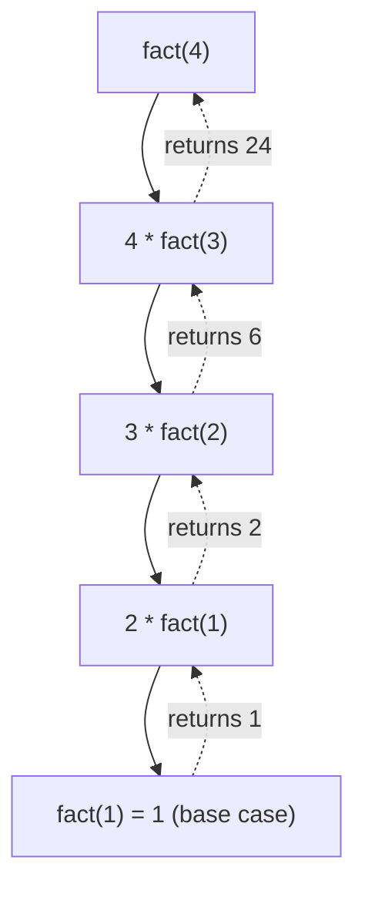

# 🔁 Recursion

> **One-line summary**: Solve a problem by breaking it into smaller instances of itself — the foundation of DFS, divide-and-conquer, backtracking, and tree algorithms.

---

## Diagram


## 🎯 Concept

**Recursion** is when a function calls itself to solve smaller instances of the same problem. Every recursive function needs:

1. **Base case** — the smallest input, solved directly; stops the recursion.
2. **Recursive case** — reduces the problem toward the base case.
3. **Trust the recursion** — assume the recursive call returns the correct answer (the "recursive leap of faith").

### The Call Stack

Each recursive call is pushed onto the **call stack** with its own local variables. When the base case returns, the frames **unwind** in reverse (LIFO) order.



### Recursion vs Iteration

| Aspect | Recursion | Iteration |
| ------ | --------- | --------- |
| Readability | Elegant for trees/divide-and-conquer | Simpler for linear loops |
| Memory | O(depth) stack frames | O(1) usually |
| Risk | Stack overflow on deep recursion | None |
| Conversion | Any recursion → loop + explicit stack | — |

### Memoization (Intro)

When recursive calls repeat the **same subproblem**, cache results to avoid recomputation — turning exponential time into linear. This is the bridge to [Dynamic Programming](../dp/README.md).

---

## ⚡ Time & Space Complexity

| Recursive Pattern | Time | Space (stack) |
| ----------------- | ---- | ------------- |
| Linear (factorial) | O(n) | O(n) |
| Binary (naive Fibonacci) | O(2ⁿ) | O(n) |
| Binary (memoized Fibonacci) | O(n) | O(n) |
| Divide & conquer (merge sort) | O(n log n) | O(log n) |
| Fast exponentiation | O(log n) | O(log n) |

**Key Insight**: Recursion depth determines auxiliary **space** — always bound the depth to avoid stack overflow.

---

## Common Patterns

### Factorial

```javascript
function factorial(n) {
  if (n <= 1) return 1;
  return n * factorial(n - 1);
}
```

### Fibonacci (memoised)

```javascript
function fib(n, memo = {}) {
  if (n <= 1) return n;
  if (memo[n]) return memo[n];
  return (memo[n] = fib(n - 1, memo) + fib(n - 2, memo));
}
```

### Power (fast exponentiation)

```javascript
function power(base, exp) {
  if (exp === 0) return 1;
  if (exp % 2 === 0) {
    const half = power(base, exp / 2);
    return half * half;
  }
  return base * power(base, exp - 1);
}
```

---

## Pitfalls

- Missing base case → infinite recursion / stack overflow
- Redundant subproblem calls → add memoisation
- Deep recursion in JS → stack size ~10k; consider iterative with explicit stack

---

## 🧪 Worked Example: Naive vs Memoized Fibonacci

> The classic demonstration of why memoization matters.

```javascript
// ❌ Naive: recomputes the same subproblems exponentially
function fibNaive(n) {
  if (n <= 1) return n;
  return fibNaive(n - 1) + fibNaive(n - 2);
}
// Time: O(2^n) — fib(40) makes ~1.6 billion calls!

// ✅ Memoized: each subproblem solved once
function fibMemo(n, memo = new Map()) {
  if (n <= 1) return n;
  if (memo.has(n)) return memo.get(n);
  const result = fibMemo(n - 1, memo) + fibMemo(n - 2, memo);
  memo.set(n, result);
  return result;
}
// Time: O(n), Space: O(n)
```

**Takeaway**: The recursion *tree* for `fibNaive(5)` computes `fib(2)` three times and `fib(1)` five times. Memoization prunes those repeats — the same idea that powers [Dynamic Programming](../dp/README.md).

---

## Practice Problems

| Problem                                                                                                        | Difficulty | Solution |
| -------------------------------------------------------------------------------------------------------------- | ---------- | -------- |
| [LC 231 — Power of Two](https://leetcode.com/problems/power-of-two/)                                           | Easy       |          |
| [LC 110 — Balanced Binary Tree](https://leetcode.com/problems/balanced-binary-tree/)                           | Easy       |          |
| [LC 24 — Swap Nodes in Pairs](https://leetcode.com/problems/swap-nodes-in-pairs/)                              | Medium     |          |
| [LC 344 — Reverse String](https://leetcode.com/problems/reverse-string/)                                       | Easy       |          |
| [LC 509 — Fibonacci Number](https://leetcode.com/problems/fibonacci-number/)                                   | Easy       |          |
| [LC 326 — Power of Three](https://leetcode.com/problems/power-of-three/)                                       | Easy       |          |
| [LC 779 — K-th Symbol in Grammar](https://leetcode.com/problems/k-th-symbol-in-grammar/)                       | Medium     |          |
| [LC 95 — Unique Binary Search Trees II](https://leetcode.com/problems/unique-binary-search-trees-ii/)          | Medium     |          |
| [LC 894 — All Possible Full Binary Trees](https://leetcode.com/problems/all-possible-full-binary-trees/)       | Medium     |          |
| [CC — Recamán Sequence (RECAMAN)](https://www.codechef.com/problems/RECAMAN)                                   | Easy       |          |
| [LC 241 — Different Ways to Add Parentheses](https://leetcode.com/problems/different-ways-to-add-parentheses/) | Medium     |          |
| [LC 21 — Merge Two Sorted Lists](https://leetcode.com/problems/merge-two-sorted-lists/)                        | Easy       |          |
| [LC 50 — Pow(x, n)](https://leetcode.com/problems/powx-n/)                                                    | Medium     |          |
| [LC 70 — Climbing Stairs](https://leetcode.com/problems/climbing-stairs/)                                     | Easy       |          |
| [LC 104 — Maximum Depth of Binary Tree](https://leetcode.com/problems/maximum-depth-of-binary-tree/)           | Easy       |          |
| [LC 111 — Minimum Depth of Binary Tree](https://leetcode.com/problems/minimum-depth-of-binary-tree/)           | Easy       |          |
| [LC 206 — Reverse Linked List](https://leetcode.com/problems/reverse-linked-list/)                             | Easy       |          |
| [LC 226 — Invert Binary Tree](https://leetcode.com/problems/invert-binary-tree/)                               | Easy       |          |
| [LC 234 — Palindrome Linked List](https://leetcode.com/problems/palindrome-linked-list/)                       | Easy       |          |
| [LC 342 — Power of Four](https://leetcode.com/problems/power-of-four/)                                         | Easy       |          |
| [LC 372 — Super Pow](https://leetcode.com/problems/super-pow/)                                                 | Medium     |          |
| [LC 390 — Elimination Game](https://leetcode.com/problems/elimination-game/)                                   | Medium     |          |
| [LC 486 — Predict the Winner](https://leetcode.com/problems/predict-the-winner/)                               | Medium     |          |
| [LC 687 — Longest Univalue Path](https://leetcode.com/problems/longest-univalue-path/)                         | Medium     |          |
| [LC 698 — Partition to K Equal Sum Subsets](https://leetcode.com/problems/partition-to-k-equal-sum-subsets/)   | Medium     |          |
| [LC 700 — Search in a Binary Search Tree](https://leetcode.com/problems/search-in-a-binary-search-tree/)       | Easy       |          |
| [LC 701 — Insert into a Binary Search Tree](https://leetcode.com/problems/insert-into-a-binary-search-tree/)   | Medium     |          |
| [LC 1137 — N-th Tribonacci Number](https://leetcode.com/problems/n-th-tribonacci-number/)                      | Easy       |          |
| [LC 1342 — Number of Steps to Reduce to Zero](https://leetcode.com/problems/number-of-steps-to-reduce-a-number-to-zero/) | Easy       |          |
| [LC 1545 — Find Kth Bit in Nth Binary String](https://leetcode.com/problems/find-kth-bit-in-nth-binary-string/) | Medium     |          |
| [CC — Factorial (FACT)](https://www.codechef.com/problems/FACT)                                               | Easy       |          |
| [CC — Tower of Hanoi (HANOI)](https://www.codechef.com/problems/HANOI)                                        | Medium     |          |
| [CC — Recursive Function (RECFUNC)](https://www.codechef.com/problems/RECFUNC)                                 | Easy       |          |

---

## Related Topics

- [Backtracking](../backtracking/README.md) — recursion with undo
- [Dynamic Programming](../dp/README.md) — memoised recursion
- [Trees](../trees/README.md) — most tree algorithms are recursive

[← Back to Home](../index.md) · © sparshjaswal
