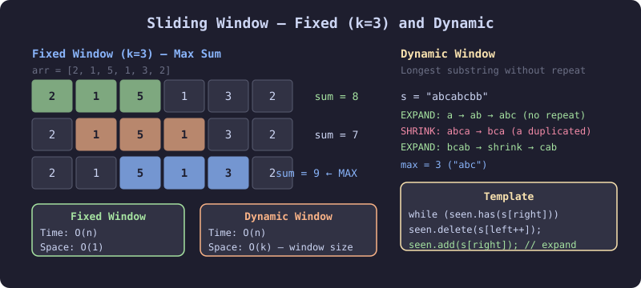

# 🪟 Sliding Window

> **One-line summary**: Move a window over the input to solve subarray/substring problems in O(n) instead of O(n²).

---

## 💡 Core Concepts

### What is Sliding Window?
Sliding Window is an **optimization technique** that transforms nested loops into a single loop by maintaining a **window** (subarray/substring) that slides across the input data.

### Types of Sliding Window

#### 1️⃣ Fixed-Size Window
- **Window size remains constant** (exactly K elements)
- **Move window one position** at a time
- **Perfect for**: "Find max sum of K consecutive elements"

#### 2️⃣ Dynamic/Variable Window
- **Window size changes** based on conditions
- **Expand right pointer** to include new elements
- **Shrink left pointer** when constraint is violated
- **Perfect for**: "Find smallest subarray with sum ≥ target"

### Key Sliding Window Properties
- **Linear Time**: Reduces O(n²) brute force to **O(n)**
- **Two Pointers**: Uses left and right pointers to define window boundaries
- **State Tracking**: Maintains window state (sum, count, frequency, etc.)
- **Constraint-Based**: Window adjusts based on problem constraints

### When to Use Sliding Window?
✅ **Perfect for:**
- **Subarray/substring problems** with contiguous elements
- **"Find maximum/minimum in window"** problems
- **"Count subarrays with property X"** problems
- **String pattern matching** and anagram problems
- **"Longest/shortest subarray with condition"** problems

❌ **Not suitable for:**
- **Non-contiguous subsequence** problems
- **Problems requiring global optimization** (use DP)
- **Tree/graph traversal** problems

### Related Patterns
- **Overlapping Intervals**: Sort by start time, merge when `intervals[i].start <= lastEnd`
- **Two Pointers**: Similar concept but for different problem types
- **Prefix Sum**: Can be combined with sliding window for range queries

---

## 📊 Visual Learning

### Sliding Window Technique Over

### Enhanced Visualization Features

The enhanced animation demonstrates:
- **Dynamic window expansion and contraction** with smooth visual transitions
- **Real-time sum calculation** showing constraint validation
- **Color-coded status indicators** (valid/invalid states)
- **Step-by-step algorithm phases** with detailed explanations
- **Interactive pointer movements** showing left and right boundary adjustments
- **Visual constraint checking** highlighting when sum exceeds target


*Step-by-step visualization of how the sliding window moves across arrays to solve subarray problems*

### Dynamic Window Expansion

*Interactive demonstration of window expansion and contraction based on problem constraints*

### Window Size Comparison

*Visual comparison between fixed-size and variable-size sliding window approaches*

### Memory Usage Optimization

*Understanding space complexity and memory patterns in sliding window algorithms*

---

## Time & Space Complexity

| Variant | Time | Space |
|---------|------|-------|
| Fixed window | O(n) | O(1) or O(k) |
| Dynamic window | O(n) | O(k) |
| Merge intervals | O(n log n) | O(n) |

---

## Common Patterns

### Fixed Window — Max Sum of K Elements
```javascript
function maxSumK(arr, k) {
  let windowSum = arr.slice(0, k).reduce((s, x) => s + x, 0);
  let maxSum = windowSum;
  for (let i = k; i < arr.length; i++) {
    windowSum += arr[i] - arr[i - k];
    maxSum = Math.max(maxSum, windowSum);
  }
  return maxSum;
}
```

### Dynamic Window — Longest Substring Without Repeat
```javascript
function lengthOfLongestSubstring(s) {
  const seen = new Map();
  let left = 0, maxLen = 0;
  for (let right = 0; right < s.length; right++) {
    if (seen.has(s[right])) left = Math.max(left, seen.get(s[right]) + 1);
    seen.set(s[right], right);
    maxLen = Math.max(maxLen, right - left + 1);
  }
  return maxLen;
}
```

### Merge Intervals
```javascript
function merge(intervals) {
  intervals.sort((a, b) => a[0] - b[0]);
  const result = [intervals[0]];
  for (const [s, e] of intervals.slice(1)) {
    if (s <= result[result.length - 1][1]) result[result.length - 1][1] = Math.max(result[result.length - 1][1], e);
    else result.push([s, e]);
  }
  return result;
}
```

---

## Pitfalls

- Dynamic window: shrink from left until constraint is satisfied again — don't reset the window
- Fixed window: slide by adding right element and subtracting element that just left

---

## Practice Problems

| Problem | Difficulty | Solution |
|---------|-----------|----------|
| [LC 121 — Best Time to Buy and Sell Stock](https://leetcode.com/problems/best-time-to-buy-and-sell-stock/) | Easy |  |
| [LC 219 — Contains Duplicate II](https://leetcode.com/problems/contains-duplicate-ii/) | Easy |  |
| [LC 643 — Maximum Average Subarray I](https://leetcode.com/problems/maximum-average-subarray-i/) | Easy |  |
| [LC 1004 — Max Consecutive Ones III](https://leetcode.com/problems/max-consecutive-ones-iii/) | Easy |  |
| [LC 1456 — Maximum Number of Vowels in a Substring of Given Length](https://leetcode.com/problems/maximum-number-of-vowels-in-a-substring-of-given-length/) | Easy |  |
| [LC 1652 — Defuse the Bomb](https://leetcode.com/problems/defuse-the-bomb/) | Easy |  |
| [LC 1876 — Substrings of Size Three with Distinct Characters](https://leetcode.com/problems/substrings-of-size-three-with-distinct-characters/) | Easy |  |
| [LC 1984 — Minimum Difference Between Highest and Lowest of K Scores](https://leetcode.com/problems/minimum-difference-between-highest-and-lowest-of-k-scores/) | Easy |  |
| [LC 2269 — Find the K-Beauty of a Number](https://leetcode.com/problems/find-the-k-beauty-of-a-number/) | Easy |  |
| [LC 2379 — Minimum Recolors to Get K Consecutive Black Blocks](https://leetcode.com/problems/minimum-recolors-to-get-k-consecutive-black-blocks/) | Easy |  |
| [CC — Fixed Window Sum (FIXWIN)](https://www.codechef.com/problems/FIXWIN) | Easy |  |
| [CC — Sliding Window Basic (SLIDEWIN)](https://www.codechef.com/problems/SLIDEWIN) | Easy |  |
| [CC — Maximum Window (MAXWIN)](https://www.codechef.com/problems/MAXWIN) | Easy |  |
| [LC 3 — Longest Substring Without Repeating](https://leetcode.com/problems/longest-substring-without-repeating-characters/) | Medium |  |
| [LC 56 — Merge Intervals](https://leetcode.com/problems/merge-intervals/) | Medium |  |
| [LC 567 — Permutation in String](https://leetcode.com/problems/permutation-in-string/) | Medium |  |
| [LC 438 — Find All Anagrams in a String](https://leetcode.com/problems/find-all-anagrams-in-a-string/) | Medium |  |
| [LC 424 — Longest Repeating Character Replacement](https://leetcode.com/problems/longest-repeating-character-replacement/) | Medium |  |
| [LC 57 — Insert Interval](https://leetcode.com/problems/insert-interval/) | Medium |  |

| [LC 904 — Fruit Into Baskets](https://leetcode.com/problems/fruit-into-baskets/) | Medium |  |
| [LC 159 — Longest Substring with At Most Two Distinct Characters](https://leetcode.com/problems/longest-substring-with-at-most-two-distinct-characters/) | Medium |  |
| [LC 209 — Minimum Size Subarray Sum](https://leetcode.com/problems/minimum-size-subarray-sum/) | Medium |  |
| [LC 340 — Longest Substring with At Most K Distinct Characters](https://leetcode.com/problems/longest-substring-with-at-most-k-distinct-characters/) | Medium |  |
| [LC 395 — Longest Substring with At Least K Repeating Characters](https://leetcode.com/problems/longest-substring-with-at-least-k-repeating-characters/) | Medium |  |
| [LC 435 — Non-overlapping Intervals](https://leetcode.com/problems/non-overlapping-intervals/) | Medium |  |
| [LC 452 — Minimum Number of Arrows to Burst Balloons](https://leetcode.com/problems/minimum-number-of-arrows-to-burst-balloons/) | Medium |  |
| [LC 713 — Subarray Product Less Than K](https://leetcode.com/problems/subarray-product-less-than-k/) | Medium |  |
| [LC 930 — Binary Subarrays With Sum](https://leetcode.com/problems/binary-subarrays-with-sum/) | Medium |  |
| [LC 986 — Interval List Intersections](https://leetcode.com/problems/interval-list-intersections/) | Medium |  |
| [LC 992 — Subarrays with K Different Integers](https://leetcode.com/problems/subarrays-with-k-different-integers/) | Medium |  |
| [LC 1208 — Get Equal Substrings Within Budget](https://leetcode.com/problems/get-equal-substrings-within-budget/) | Medium |  |
| [LC 1248 — Count Number of Nice Subarrays](https://leetcode.com/problems/count-number-of-nice-subarrays/) | Medium |  |
| [LC 1438 — Longest Continuous Subarray With Absolute Diff Less Than or Equal to Limit](https://leetcode.com/problems/longest-continuous-subarray-with-absolute-diff-less-than-or-equal-to-limit/) | Medium |  |
| [LC 1493 — Longest Subarray of 1's After Deleting One Element](https://leetcode.com/problems/longest-subarray-of-1s-after-deleting-one-element/) | Medium |  |
| [LC 1658 — Minimum Operations to Reduce X to Zero](https://leetcode.com/problems/minimum-operations-to-reduce-x-to-zero/) | Medium |  |
| [LC 1695 — Maximum Erasure Value](https://leetcode.com/problems/maximum-erasure-value/) | Medium |  |
| [LC 1838 — Frequency of the Most Frequent Element](https://leetcode.com/problems/frequency-of-the-most-frequent-element/) | Medium |  |
| [LC 2024 — Maximize the Confusion of an Exam](https://leetcode.com/problems/maximize-the-confusion-of-an-exam/) | Medium |  |
| [CC — Maximum Unique Subarray Window (UNQEQ)](https://www.codechef.com/problems/UNQEQ) | Medium |  |
| [CC — Dynamic Window (DYNWIN)](https://www.codechef.com/problems/DYNWIN) | Medium |  |
| [CC — Interval Merging (INTMERGE)](https://www.codechef.com/problems/INTMERGE) | Medium |  |
| [CC — Substring Matching (SUBMATCH)](https://www.codechef.com/problems/SUBMATCH) | Medium |  |
| [LC 76 — Minimum Window Substring](https://leetcode.com/problems/minimum-window-substring/) | Hard |  |
| [LC 239 — Sliding Window Maximum](https://leetcode.com/problems/sliding-window-maximum/) | Hard |  |
| [LC 30 — Substring with Concatenation of All Words](https://leetcode.com/problems/substring-with-concatenation-of-all-words/) | Hard |  |
| [LC 84 — Largest Rectangle in Histogram](https://leetcode.com/problems/largest-rectangle-in-histogram/) | Hard |  |
| [LC 85 — Maximal Rectangle](https://leetcode.com/problems/maximal-rectangle/) | Hard |  |
| [LC 632 — Smallest Range Covering Elements from K Lists](https://leetcode.com/problems/smallest-range-covering-elements-from-k-lists/) | Hard |  |
| [LC 727 — Minimum Window Subsequence](https://leetcode.com/problems/minimum-window-subsequence/) | Hard |  |
| [LC 862 — Shortest Subarray with Sum at Least K](https://leetcode.com/problems/shortest-subarray-with-sum-at-least-k/) | Hard |  |
| [LC 1425 — Constrained Subsequence Sum](https://leetcode.com/problems/constrained-subsequence-sum/) | Hard |  |
| [LC 1499 — Max Value of Equation](https://leetcode.com/problems/max-value-of-equation/) | Hard |  |
| [LC 1687 — Delivering Boxes from Storage to Ports](https://leetcode.com/problems/delivering-boxes-from-storage-to-ports/) | Hard |  |
| [LC 1793 — Maximum Score of a Good Subarray](https://leetcode.com/problems/maximum-score-of-a-good-subarray/) | Hard |  |
| [LC 2009 — Minimum Number of Operations to Make Array Continuous](https://leetcode.com/problems/minimum-number-of-operations-to-make-array-continuous/) | Hard |  |
| [LC 2444 — Count Subarrays With Fixed Bounds](https://leetcode.com/problems/count-subarrays-with-fixed-bounds/) | Hard |  |
| [CC — Advanced Sliding Window (ADVSLIDE)](https://www.codechef.com/problems/ADVSLIDE) | Hard |  |
| [CC — Complex Window Operations (COMPLEXWIN)](https://www.codechef.com/problems/COMPLEXWIN) | Hard |  |
| [CC — Sliding Window Maximum (SLIDEMAX)](https://www.codechef.com/problems/SLIDEMAX) | Hard |  |

---

## Related Topics

- [Two Pointers](../two-pointers/README.md) — sliding window is two pointers with a constraint
- [Hashing](../hashing/README.md) — frequency maps used inside windows
- [Prefix Sum](../prefix-sum/README.md)

[← Back to Home](../index.md) · © sparshjaswal
