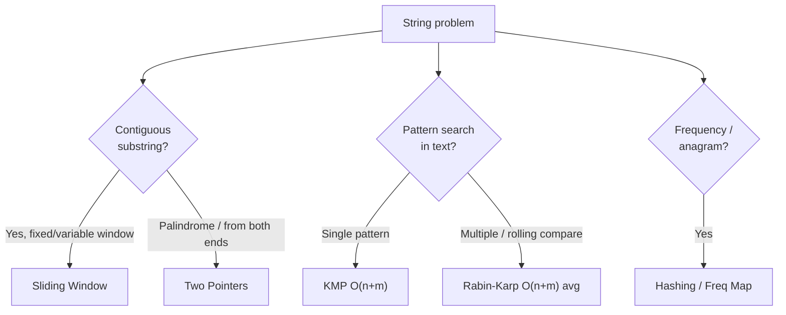

# 🔤 Strings

> **One-line summary**: Immutable character sequences — master sliding window, two pointers, and hashing on strings for O(n) solutions to substring/pattern problems.

---

## 📊 Visual Learning

### String Processing Techniques

*Visualization of sliding window technique for substring problems and pattern matching*

### String Algorithm Animations

*Interactive demonstration of string manipulation algorithms and optimization techniques*

### Two Pointers on Strings

*Visual guide to using two pointers for palindrome checking and string reversal*

### String Hashing Visualization

*Understanding how string hashing works for fast substring search and pattern matching*

## 🎯 Core Concepts

### String Fundamentals
- **Immutability**: Strings in JavaScript are immutable — operations create new strings
- **Character Access**: Use `s[i]` or `s.charAt(i)` to access characters
- **Length**: `s.length` gives the number of characters
- **Conversion**: `s.split('')` converts string to character array for manipulation

### Essential String Operations
```javascript
// Basic operations
s.charAt(i)           // Get character at index i
s.charCodeAt(i)       // Get ASCII/Unicode value
String.fromCharCode(c) // Convert ASCII to character
s.slice(start, end)   // Extract substring
s.substring(start, end) // Similar to slice
s.indexOf(substr)     // Find first occurrence
s.toLowerCase()       // Convert to lowercase
s.toUpperCase()       // Convert to uppercase
```

### ⚡ Common Operation Complexity

| Operation | Time | Space |
| --------- | ---- | ----- |
| Access `s[i]` | O(1) | O(1) |
| Concatenation `a + b` | O(n + m) | O(n + m) |
| `slice` / `substring` | O(k) | O(k) |
| `indexOf` (naive search) | O(n·m) | O(1) |
| Reverse | O(n) | O(n) |
| Sort characters | O(n log n) | O(n) |
| Frequency map build | O(n) | O(1) (fixed alphabet) |

> ⚠️ Strings are **immutable** in JS — building a string in a loop with `+=` is O(n²). Use an array + `join('')` for O(n).

### Key String Patterns
- **Anagram Detection**: Sort characters or use frequency counting
- **Palindrome Check**: Two pointers from ends moving inward
- **Substring Search**: Sliding window or KMP algorithm
- **Pattern Matching**: Regular expressions or manual parsing

### When to Use String Algorithms?
✅ **Use when you need:**
- Text processing and manipulation
- Pattern matching and searching
- Anagram or palindrome detection
- Substring operations
- Character frequency analysis

❌ **Avoid when:**
- Working with purely numerical data
- Simple boolean operations
- Array manipulations without text context

---

## 🧩 String Algorithm Toolkit

Most string problems reduce to one of a handful of patterns. Pick the right tool:



| Technique | Use Case | Time | Space | Cross-link |
| --------- | -------- | ---- | ----- | ---------- |
| Two Pointers | Palindromes, reversal | O(n) | O(1) | [Two Pointers](../two-pointers/README.md) |
| Sliding Window | Longest/shortest substring with constraint | O(n) | O(k) | [Sliding Window](../sliding-window/README.md) |
| Hashing / Freq Map | Anagrams, char counts | O(n) | O(1) (26 letters) | [Hashing](../hashing/README.md) |
| KMP | Single-pattern search | O(n + m) | O(m) | — |
| Rabin-Karp | Rolling-hash pattern search | O(n + m) avg | O(1) | — |

### KMP — Knuth-Morris-Pratt (linear pattern matching)

```javascript
function kmpSearch(text, pattern) {
  const lps = buildLPS(pattern); // longest proper prefix that is also suffix
  let i = 0, j = 0;
  while (i < text.length) {
    if (text[i] === pattern[j]) { i++; j++; }
    if (j === pattern.length) return i - j;      // match found
    else if (i < text.length && text[i] !== pattern[j]) {
      j = j > 0 ? lps[j - 1] : 0;                 // skip using LPS table
      if (j === 0 && text[i] !== pattern[0]) i++;
    }
  }
  return -1;
}

function buildLPS(p) {
  const lps = new Array(p.length).fill(0);
  let len = 0, i = 1;
  while (i < p.length) {
    if (p[i] === p[len]) lps[i++] = ++len;
    else if (len > 0) len = lps[len - 1];
    else lps[i++] = 0;
  }
  return lps;
}
// Time: O(n + m), Space: O(m). Never re-examines text characters.
```

### Rabin-Karp — rolling hash search

```javascript
function rabinKarp(text, pattern) {
  const base = 256, mod = 1_000_000_007;
  const m = pattern.length, n = text.length;
  if (m > n) return -1;
  let patHash = 0, winHash = 0, pow = 1;
  for (let i = 0; i < m; i++) {
    patHash = (patHash * base + pattern.charCodeAt(i)) % mod;
    winHash = (winHash * base + text.charCodeAt(i)) % mod;
    if (i < m - 1) pow = (pow * base) % mod;
  }
  for (let i = 0; i + m <= n; i++) {
    if (patHash === winHash && text.substr(i, m) === pattern) return i;
    if (i + m < n) {
      winHash = ((winHash - text.charCodeAt(i) * pow % mod + mod) * base
                 + text.charCodeAt(i + m)) % mod;
    }
  }
  return -1;
}
// Avg O(n + m); rolling hash updates the window in O(1).
```

---

## � String Algorithms Reference

The following string algorithms live as runnable implementations (with tests) in this folder. Each entry preserves the full reference notes merged from the former `concepts/string` collection.

### Hamming Distance

> 📁 Implementation: [`hamming-distance/`](./hamming-distance/hammingDistance.js) · Tests: [`hamming-distance/__test__`](./hamming-distance/__test__/hammingDistance.test.js)

The Hamming distance between two strings of equal length is the number of positions at which the corresponding symbols are different. In other words, it measures the minimum number of substitutions required to change one string into the other, or the minimum number of errors that could have transformed one string into the other. In a more general context, the Hamming distance is one of several string metrics for measuring the edit distance between two sequences.

**Examples**

The Hamming distance between:

- "ka**rol**in" and "ka**thr**in" is **3**.
- "k**a**r**ol**in" and "k**e**r**st**in" is **3**.
- 10**1**1**1**01 and 10**0**1**0**01 is **2**.
- 2**17**3**8**96 and 2**23**3**7**96 is **3**.

**References**

- [Wikipedia](https://en.wikipedia.org/wiki/Hamming_distance)

---

### Knuth–Morris–Pratt Algorithm

> 📁 Implementation: [`knuth-morris-pratt/`](./knuth-morris-pratt/knuthMorrisPratt.js) · Tests: [`knuth-morris-pratt/__test__`](./knuth-morris-pratt/__test__/knuthMorrisPratt.test.js)

The Knuth–Morris–Pratt string searching algorithm (or KMP algorithm) searches for occurrences of a "word" `W` within a main "text string" `T` by employing the observation that when a mismatch occurs, the word itself embodies sufficient information to determine where the next match could begin, thus bypassing re-examination of previously matched characters.

**Complexity**

- **Time:** `O(|W| + |T|)` (much faster comparing to trivial `O(|W| * |T|)`)
- **Space:** `O(|W|)`

**References**

- [Wikipedia](https://en.wikipedia.org/wiki/Knuth%E2%80%93Morris%E2%80%93Pratt_algorithm)
- [YouTube](https://www.youtube.com/watch?v=GTJr8OvyEVQ&list=PLLXdhg_r2hKA7DPDsunoDZ-Z769jWn4R8)

---

### Levenshtein Distance

> 📁 Implementation: [`levenshtein-distance/`](./levenshtein-distance/levenshteinDistance.js) · Tests: [`levenshtein-distance/__test__`](./levenshtein-distance/__test__/levenshteinDistance.test.js)

The Levenshtein distance is a string metric for measuring the difference between two sequences. Informally, the Levenshtein distance between two words is the minimum number of single-character edits (insertions, deletions or substitutions) required to change one word into the other.

**Definition**

Mathematically, the Levenshtein distance between two strings `a` and `b` (of length `|a|` and `|b|` respectively) is given by

where


where

is the indicator function equal to `0` when

and equal to 1 otherwise, and

is the distance between the first `i` characters of `a` and the first `j` characters of `b`.

Note that the first element in the minimum corresponds to deletion (from `a` to `b`), the second to insertion and the third to match or mismatch, depending on whether the respective symbols are the same.

**Example**

For example, the Levenshtein distance between `kitten` and `sitting` is `3`, since the following three edits change one into the other, and there is no way to do it with fewer than three edits:

1. **k**itten → **s**itten (substitution of "s" for "k")
2. sitt**e**n → sitt**i**n (substitution of "i" for "e")
3. sittin → sittin**g** (insertion of "g" at the end).

**Applications**

This has a wide range of applications, for instance, spell checkers, correction systems for optical character recognition, fuzzy string searching, and software to assist natural language translation based on translation memory.

**Dynamic Programming Approach Explanation**

Let’s take a simple example of finding minimum edit distance between strings `ME` and `MY`. Intuitively you already know that minimum edit distance here is `1` operation, which is replacing `E` with `Y`. But let’s try to formalize it in a form of the algorithm in order to be able to do more complex examples like transforming `Saturday` into `Sunday`.

To apply the mathematical formula mentioned above to `ME → MY` transformation we need to know minimum edit distances of `ME → M`, `M → MY` and `M → M` transformations in prior. Then we will need to pick the minimum one and add _one_ operation to transform last letters `E → Y`. So minimum edit distance of `ME → MY` transformation is being calculated based on three previously possible transformations.

To explain this further let’s draw the following matrix:


- Cell `(0:1)` contains red number 1. It means that we need 1 operation to transform `M` to an empty string. And it is by deleting `M`. This is why this number is red.
- Cell `(0:2)` contains red number 2. It means that we need 2 operations to transform `ME` to an empty string. And it is by deleting `E` and `M`.
- Cell `(1:0)` contains green number 1. It means that we need 1 operation to transform an empty string to `M`. And it is by inserting `M`. This is why this number is green.
- Cell `(2:0)` contains green number 2. It means that we need 2 operations to transform an empty string to `MY`. And it is by inserting `Y` and  `M`.
- Cell `(1:1)` contains number 0. It means that it costs nothing to transform `M` into `M`.
- Cell `(1:2)` contains red number 1. It means that we need 1 operation to transform `ME` to `M`. And it is by deleting `E`.
- And so on...

This looks easy for such small matrix as ours (it is only `3x3`). But here you may find basic concepts that may be applied to calculate all those numbers for bigger matrices (let’s say a `9x7` matrix for `Saturday → Sunday` transformation).

According to the formula you only need three adjacent cells `(i-1:j)`, `(i-1:j-1)`, and `(i:j-1)` to calculate the number for current cell `(i:j)`. All we need to do is to find the minimum of those three cells and then add `1` in case if we have different letters in `i`'s row and `j`'s column.

You may clearly see the recursive nature of the problem.


Let's draw a decision graph for this problem.


You may see a number of overlapping sub-problems on the picture that are marked with red. Also there is no way to reduce the number of operations and make it less than a minimum of those three adjacent cells from the formula.

Also you may notice that each cell number in the matrix is being calculated based on previous ones. Thus the tabulation technique (filling the cache in bottom-up direction) is being applied here.

Applying this principle further we may solve more complicated cases like with `Saturday → Sunday` transformation.


**References**

- [Wikipedia](https://en.wikipedia.org/wiki/Levenshtein_distance)
- [YouTube](https://www.youtube.com/watch?v=We3YDTzNXEk&list=PLLXdhg_r2hKA7DPDsunoDZ-Z769jWn4R8)
- [ITNext](https://itnext.io/dynamic-programming-vs-divide-and-conquer-2fea680becbe)

---

### Longest Common Substring Problem

> 📁 Implementation: [`longest-common-substring/`](./longest-common-substring/longestCommonSubstring.js) · Tests: [`longest-common-substring/__test__`](./longest-common-substring/__test__/longestCommonSubstring.test.js)

The longest common substring problem is to find the longest string (or strings) that is a substring (or are substrings) of two or more strings.

**Example**

The longest common substring of the strings `ABABC`, `BABCA` and `ABCBA` is string `ABC` of length 3. Other common substrings are `A`, `AB`, `B`, `BA`, `BC` and `C`.

```
ABABC
  |||
 BABCA
  |||
  ABCBA
```

**References**

- [Wikipedia](https://en.wikipedia.org/wiki/Longest_common_substring_problem)
- [YouTube](https://www.youtube.com/watch?v=BysNXJHzCEs&list=PLLXdhg_r2hKA7DPDsunoDZ-Z769jWn4R8)

---

### Palindrome Check

> 📁 Implementation: [`palindrome/`](./palindrome/isPalindrome.js) · Tests: [`palindrome/__test__`](./palindrome/__test__/isPalindrome.test.js)

A [Palindrome](https://en.wikipedia.org/wiki/Palindrome) is a string that reads the same forwards and backwards. This means that the second half of the string is the reverse of the first half.

**Examples**

The following are palindromes (thus would return `TRUE`):

```
- "a"
- "pop"     ->  p + o + p
- "deed"    ->  de + ed
- "kayak"   ->  ka + y + ak
- "racecar" ->  rac + e + car
```

The following are NOT palindromes (thus would return `FALSE`):

```
- "rad"
- "dodo"
- "polo"
```

**References**

- [GeeksForGeeks - Check if a number is Palindrome](https://www.geeksforgeeks.org/check-if-a-number-is-palindrome/)

---

### Rabin Karp Algorithm

> 📁 Implementation: [`rabin-karp/`](./rabin-karp/rabinKarp.js) · Tests: [`rabin-karp/__test__`](./rabin-karp/__test__/rabinKarp.test.js)

In computer science, the Rabin–Karp algorithm or Karp–Rabin algorithm is a string searching algorithm created by Richard M. Karp and Michael O. Rabin (1987) that uses hashing to find any one of a set of pattern strings in a text.

**Algorithm**

The Rabin–Karp algorithm seeks to speed up the testing of equality of the pattern to the substrings in the text by using a hash function. A hash function is a function which converts every string into a numeric value, called its hash value; for example, we might have `hash('hello') = 5`. The algorithm exploits the fact that if two strings are equal, their hash values are also equal. Thus, string matching is reduced (almost) to computing the hash value of the search pattern and then looking for substrings of the input string with that hash value.

However, there are two problems with this approach. First, because there are so many different strings and so few hash values, some differing strings will have the same hash value. If the hash values match, the pattern and the substring may not match; consequently, the potential match of search pattern and the substring must be confirmed by comparing them; that comparison can take a long time for long substrings. Luckily, a good hash function on reasonable strings usually does not have many collisions, so the expected search time will be acceptable.

**Hash Function Used**

The key to the Rabin–Karp algorithm's performance is the efficient computation of hash values of the successive substrings of the text. The **Rabin fingerprint** is a popular and effective rolling hash function.

The **polynomial hash function** described in this example is not a Rabin fingerprint, but it works equally well. It treats every substring as a number in some base, the base being usually a large prime.

**Complexity**

For text of length `n` and `p` patterns of combined length `m`, its average and best case running time is `O(n + m)` in space `O(p)`, but its worst-case time is `O(n * m)`.

**Application**

A practical application of the algorithm is detecting plagiarism. Given source material, the algorithm can rapidly search through a paper for instances of sentences from the source material, ignoring details such as case and punctuation. Because of the abundance of the sought strings, single-string searching algorithms are impractical.

**References**

- [Wikipedia](https://en.wikipedia.org/wiki/Rabin%E2%80%93Karp_algorithm)
- [YouTube](https://www.youtube.com/watch?v=H4VrKHVG5qI&list=PLLXdhg_r2hKA7DPDsunoDZ-Z769jWn4R8)

---

### Regular Expression Matching

> 📁 Implementation: [`regular-expression-matching/`](./regular-expression-matching/regularExpressionMatching.js) · Tests: [`regular-expression-matching/__test__`](./regular-expression-matching/__test__/regularExpressionMatching.test.js)

Given an input string `s` and a pattern `p`, implement regular expression matching with support for `.` and `*`.

- `.` Matches any single character.
- `*` Matches zero or more of the preceding element.

The matching should cover the **entire** input string (not partial).

**Note**

- `s` could be empty and contains only lowercase letters `a-z`.
- `p` could be empty and contains only lowercase letters `a-z`, and characters like `.` or `*`.

**Examples**

**Example #1**

Input:
```
s = 'aa'
p = 'a'
```

Output: `false`

Explanation: `a` does not match the entire string `aa`.

**Example #2**

Input:
```
s = 'aa'
p = 'a*'
```

Output: `true`

Explanation: `*` means zero or more of the preceding element, `a`. Therefore, by repeating `a` once, it becomes `aa`.

**Example #3**

Input:

```
s = 'ab'
p = '.*'
```

Output: `true`

Explanation: `.*` means "zero or more (`*`) of any character (`.`)".

**Example #4**

Input:

```
s = 'aab'
p = 'c*a*b'
```

Output: `true`

Explanation: `c` can be repeated 0 times, `a` can be repeated 1 time. Therefore it matches `aab`.

**References**

- [YouTube](https://www.youtube.com/watch?v=l3hda49XcDE&list=PLLXdhg_r2hKA7DPDsunoDZ-Z769jWn4R8&index=71&t=0s)
- [LeetCode](https://leetcode.com/problems/regular-expression-matching/description/)

---

### Z Algorithm

> 📁 Implementation: [`z-algorithm/`](./z-algorithm/zAlgorithm.js) · Tests: [`z-algorithm/__test__`](./z-algorithm/__test__/zAlgorithm.test.js)

The Z-algorithm finds occurrences of a "word" `W` within a main "text string" `T` in linear time `O(|W| + |T|)`.

Given a string `S` of length `n`, the algorithm produces an array, `Z` where `Z[i]` represents the longest substring starting from `S[i]` which is also a prefix of `S`. Finding `Z` for the string obtained by concatenating the word, `W` with a nonce character, say `$` followed by the text, `T`, helps with pattern matching, for if there is some index `i` such that `Z[i]` equals the pattern length, then the pattern must be present at that point.

While the `Z` array can be computed with two nested loops in `O(|W| * |T|)` time, the following strategy shows how to obtain it in linear time, based on the idea that as we iterate over the letters in the string (index `i` from `1` to `n - 1`), we maintain an interval `[L, R]` which is the interval with maximum `R` such that `1 ≤ L ≤ i ≤ R` and `S[L...R]` is a prefix that is also a substring (if no such interval exists, just let `L = R =  - 1`). For `i = 1`, we can simply compute `L` and `R` by comparing `S[0...]` to `S[1...]`.

**Example of Z array**

```
Index            0   1   2   3   4   5   6   7   8   9  10  11 
Text             a   a   b   c   a   a   b   x   a   a   a   z
Z values         X   1   0   0   3   1   0   0   2   2   1   0 
```

Other examples

```
str =  a a a a a a
Z[] =  x 5 4 3 2 1
```

```
str =  a a b a a c d
Z[] =  x 1 0 2 1 0 0
```

```
str =  a b a b a b a b
Z[] =  x 0 6 0 4 0 2 0
```

**Example of Z box**


**Complexity**

- **Time:** `O(|W| + |T|)`
- **Space:** `O(|W|)`

**References**

- [GeeksForGeeks](https://www.geeksforgeeks.org/z-algorithm-linear-time-pattern-searching-algorithm/)
- [YouTube](https://www.youtube.com/watch?v=CpZh4eF8QBw&t=0s&list=PLLXdhg_r2hKA7DPDsunoDZ-Z769jWn4R8&index=70)
- [Z Algorithm by Ivan Yurchenko](https://ivanyu.me/blog/2013/10/15/z-algorithm/)

---

## �🔧 Essential Patterns & Templates

### 1️⃣ Anagram Detection - Two Approaches

**Method 1: Sorting (Simple but O(n log n))**
```javascript
function isAnagram(s, t) {
  if (s.length !== t.length) return false;
  return s.split('').sort().join('') === t.split('').sort().join('');
}
// Time: O(n log n), Space: O(n)
// Use case: Simple anagram check
```

**Method 2: Frequency Count (Optimal O(n))**
```javascript
function isAnagram(s, t) {
  if (s.length !== t.length) return false;
  const freq = {};
  
  // Count characters in first string
  for (const char of s) {
    freq[char] = (freq[char] || 0) + 1;
  }
  
  // Decrement for second string
  for (const char of t) {
    if (!freq[char]) return false;
    freq[char]--;
  }
  
  return true;
}
// Time: O(n), Space: O(1) - at most 26 letters
```

### 2️⃣ Palindrome Check - Two Pointers
```javascript
function isPalindrome(s) {
  // Clean string: remove non-alphanumeric, convert to lowercase
  const cleaned = s.replace(/[^a-zA-Z0-9]/g, '').toLowerCase();
  
  let left = 0, right = cleaned.length - 1;
  
  while (left < right) {
    if (cleaned[left] !== cleaned[right]) return false;
    left++;
    right--;
  }
  
  return true;
}
// Time: O(n), Space: O(1)
// Use case: Valid palindrome problems
```

### 3️⃣ Sliding Window - Longest Substring Without Repeating Characters
```javascript
function lengthOfLongestSubstring(s) {
  const charSet = new Set();
  let left = 0, maxLength = 0;
  
  for (let right = 0; right < s.length; right++) {
    // Shrink window until no duplicates
    while (charSet.has(s[right])) {
      charSet.delete(s[left]);
      left++;
    }
    
    charSet.add(s[right]);
    maxLength = Math.max(maxLength, right - left + 1);
  }
  
  return maxLength;
}
// Time: O(n), Space: O(min(m,n)) where m is charset size
// Use case: Substring problems with constraints
```

### 4️⃣ String Matching - KMP Algorithm Preview
```javascript
function strStr(haystack, needle) {
  if (needle.length === 0) return 0;
  if (needle.length > haystack.length) return -1;
  
  // Simple approach - for KMP, build failure function
  for (let i = 0; i <= haystack.length - needle.length; i++) {
    if (haystack.substring(i, i + needle.length) === needle) {
      return i;
    }
  }
  
  return -1;
}
// Time: O(n*m) simple, O(n+m) with KMP
// Use case: Pattern matching, substring search
```

### 5️⃣ Character Frequency Map
```javascript
function getCharFrequency(s) {
  const freq = new Map();
  
  for (const char of s) {
    freq.set(char, (freq.get(char) || 0) + 1);
  }
  
  return freq;
}
// Use case: Anagrams, character analysis, permutations
```

---

## ⚠️ Common Pitfalls & How to Avoid Them

### 🚫 **Performance Pitfalls**
```javascript
// ❌ Wrong - O(n²) string concatenation in loop
let result = '';
for (let i = 0; i < arr.length; i++) {
  result += arr[i]; // Creates new string each time!
}

// ✅ Correct - O(n) using array join
const parts = [];
for (let i = 0; i < arr.length; i++) {
  parts.push(arr[i]);
}
const result = parts.join('');
```

### 🚫 **Character Access Confusion**
```javascript
// Both work in modern JavaScript
const char1 = str[i];        // ✅ Preferred - cleaner syntax
const char2 = str.charAt(i); // ✅ Safe - returns '' for invalid index

// Key difference:
str[999]        // undefined for out-of-bounds
str.charAt(999) // '' (empty string) for out-of-bounds
```

### 🚫 **Unicode and Emoji Issues**
```javascript
const text = "Hello 👋 World";
console.log(text.length); // 13 (not 12!) - emoji counts as 2

// ✅ For proper character counting with Unicode:
const properLength = [...text].length; // 12 - correct count
```

### 🚫 **Case Sensitivity Mistakes**
```javascript
// ❌ Wrong - case sensitive comparison
if (str1 === str2) { ... }

// ✅ Correct - case insensitive when needed
if (str1.toLowerCase() === str2.toLowerCase()) { ... }
```

### 🚫 **Boundary Conditions**
```javascript
// Always check for:
// - Empty strings
// - Single character strings
// - Null or undefined inputs
function safeStringOperation(s) {
  if (!s || s.length === 0) return '';
  // ... rest of logic
}
```

### 💡 **Pro Tips**
- Use `String.prototype.includes()` for substring checking
- Remember that `slice()` can take negative indices
- Use template literals for complex string building
- Consider regex for complex pattern matching
- Use `split()` and `join()` for character manipulation

---

## Practice Problems

| Problem | Difficulty | Solution |
| ------- | ---------- | -------- |
| [LC 14 — Longest Common Prefix](https://leetcode.com/problems/longest-common-prefix/) | Easy |  |
| [LC 28 — Implement strStr()](https://leetcode.com/problems/implement-strstr/) | Easy |  |
| [LC 58 — Length of Last Word](https://leetcode.com/problems/length-of-last-word/) | Easy |  |
| [LC 125 — Valid Palindrome](https://leetcode.com/problems/valid-palindrome/) | Easy |  |
| [LC 242 — Valid Anagram](https://leetcode.com/problems/valid-anagram/) | Easy |  |
| [LC 344 — Reverse String](https://leetcode.com/problems/reverse-string/) | Easy |  |
| [LC 345 — Reverse Vowels of a String](https://leetcode.com/problems/reverse-vowels-of-a-string/) | Easy |  |
| [LC 383 — Ransom Note](https://leetcode.com/problems/ransom-note/) | Easy |  |
| [LC 387 — First Unique Character in a String](https://leetcode.com/problems/first-unique-character-in-a-string/) | Easy |  |
| [LC 389 — Find the Difference](https://leetcode.com/problems/find-the-difference/) | Easy |  |
| [LC 415 — Add Strings](https://leetcode.com/problems/add-strings/) | Easy |  |
| [LC 459 — Repeated Substring Pattern](https://leetcode.com/problems/repeated-substring-pattern/) | Easy |  |
| [LC 520 — Detect Capital](https://leetcode.com/problems/detect-capital/) | Easy |  |
| [LC 541 — Reverse String II](https://leetcode.com/problems/reverse-string-ii/) | Easy |  |
| [LC 557 — Reverse Words in a String III](https://leetcode.com/problems/reverse-words-in-a-string-iii/) | Easy |  |
| [LC 680 — Valid Palindrome II](https://leetcode.com/problems/valid-palindrome-ii/) | Easy |  |
| [LC 709 — To Lower Case](https://leetcode.com/problems/to-lower-case/) | Easy |  |
| [LC 771 — Jewels and Stones](https://leetcode.com/problems/jewels-and-stones/) | Easy |  |
| [LC 796 — Rotate String](https://leetcode.com/problems/rotate-string/) | Easy |  |
| [LC 819 — Most Common Word](https://leetcode.com/problems/most-common-word/) | Easy |  |
| [LC 859 — Buddy Strings](https://leetcode.com/problems/buddy-strings/) | Easy |  |
| [LC 925 — Long Pressed Name](https://leetcode.com/problems/long-pressed-name/) | Easy |  |
| [LC 1002 — Find Common Characters](https://leetcode.com/problems/find-common-characters/) | Easy |  |
| [LC 1108 — Defanging an IP Address](https://leetcode.com/problems/defanging-an-ip-address/) | Easy |  |
| [LC 1221 — Split a String in Balanced Strings](https://leetcode.com/problems/split-a-string-in-balanced-strings/) | Easy |  |
| [CC — String Basics (STRBASIC)](https://www.codechef.com/problems/STRBASIC) | Easy |  |
| [CC — Character Count (CHARCOUNT)](https://www.codechef.com/problems/CHARCOUNT) | Easy |  |
| [CC — Palindrome Check (PALCHECK)](https://www.codechef.com/problems/PALCHECK) | Easy |  |
| [LC 3 — Longest Substring Without Repeating Characters](https://leetcode.com/problems/longest-substring-without-repeating-characters/) | Medium |  |
| [LC 5 — Longest Palindromic Substring](https://leetcode.com/problems/longest-palindromic-substring/) | Medium |  |
| [LC 6 — Zigzag Conversion](https://leetcode.com/problems/zigzag-conversion/) | Medium |  |
| [LC 8 — String to Integer (atoi)](https://leetcode.com/problems/string-to-integer-atoi/) | Medium |  |
| [LC 12 — Integer to Roman](https://leetcode.com/problems/integer-to-roman/) | Medium |  |
| [LC 13 — Roman to Integer](https://leetcode.com/problems/roman-to-integer/) | Medium |  |
| [LC 17 — Letter Combinations of a Phone Number](https://leetcode.com/problems/letter-combinations-of-a-phone-number/) | Medium |  |
| [LC 22 — Generate Parentheses](https://leetcode.com/problems/generate-parentheses/) | Medium |  |
| [LC 49 — Group Anagrams](https://leetcode.com/problems/group-anagrams/) | Medium |  |
| [LC 71 — Simplify Path](https://leetcode.com/problems/simplify-path/) | Medium |  |
| [LC 91 — Decode Ways](https://leetcode.com/problems/decode-ways/) | Medium |  |
| [LC 139 — Word Break](https://leetcode.com/problems/word-break/) | Medium |  |
| [LC 151 — Reverse Words in a String](https://leetcode.com/problems/reverse-words-in-a-string/) | Medium |  |
| [LC 165 — Compare Version Numbers](https://leetcode.com/problems/compare-version-numbers/) | Medium |  |
| [LC 179 — Largest Number](https://leetcode.com/problems/largest-number/) | Medium |  |
| [LC 187 — Repeated DNA Sequences](https://leetcode.com/problems/repeated-dna-sequences/) | Medium |  |
| [LC 227 — Basic Calculator II](https://leetcode.com/problems/basic-calculator-ii/) | Medium |  |
| [LC 271 — Encode and Decode Strings](https://leetcode.com/problems/encode-and-decode-strings/) | Medium |  |
| [LC 290 — Word Pattern](https://leetcode.com/problems/word-pattern/) | Medium |  |
| [LC 394 — Decode String](https://leetcode.com/problems/decode-string/) | Medium |  |
| [LC 424 — Longest Repeating Character Replacement](https://leetcode.com/problems/longest-repeating-character-replacement/) | Medium |  |
| [LC 438 — Find All Anagrams in a String](https://leetcode.com/problems/find-all-anagrams-in-a-string/) | Medium |  |
| [LC 443 — String Compression](https://leetcode.com/problems/string-compression/) | Medium |  |
| [LC 516 — Longest Palindromic Subsequence](https://leetcode.com/problems/longest-palindromic-subsequence/) | Medium |  |
| [LC 567 — Permutation in String](https://leetcode.com/problems/permutation-in-string/) | Medium |  |
| [LC 647 — Palindromic Substrings](https://leetcode.com/problems/palindromic-substrings/) | Medium |  |
| [LC 692 — Top K Frequent Words](https://leetcode.com/problems/top-k-frequent-words/) | Medium |  |
| [LC 763 — Partition Labels](https://leetcode.com/problems/partition-labels/) | Medium |  |
| [LC 791 — Custom Sort String](https://leetcode.com/problems/custom-sort-string/) | Medium |  |
| [LC 856 — Score of Parentheses](https://leetcode.com/problems/score-of-parentheses/) | Medium |  |
| [LC 890 — Find and Replace Pattern](https://leetcode.com/problems/find-and-replace-pattern/) | Medium |  |
| [LC 929 — Unique Email Addresses](https://leetcode.com/problems/unique-email-addresses/) | Medium |  |
| [LC 1071 — Greatest Common Divisor of Strings](https://leetcode.com/problems/greatest-common-divisor-of-strings/) | Medium |  |
| [LC 1209 — Remove All Adjacent Duplicates in String II](https://leetcode.com/problems/remove-all-adjacent-duplicates-in-string-ii/) | Medium |  |
| [LC 1249 — Minimum Remove to Make Valid Parentheses](https://leetcode.com/problems/minimum-remove-to-make-valid-parentheses/) | Medium |  |
| [LC 1456 — Maximum Number of Vowels in a Substring of Given Length](https://leetcode.com/problems/maximum-number-of-vowels-in-a-substring-of-given-length/) | Medium |  |
| [CC — String Manipulation (STRMANIP)](https://www.codechef.com/problems/STRMANIP) | Medium |  |
| [CC — Pattern Matching (PATMATCH)](https://www.codechef.com/problems/PATMATCH) | Medium |  |
| [CC — Anagram Problems (ANAGRAM)](https://www.codechef.com/problems/ANAGRAM) | Medium |  |
| [LC 10 — Regular Expression Matching](https://leetcode.com/problems/regular-expression-matching/) | Hard |  |
| [LC 30 — Substring with Concatenation of All Words](https://leetcode.com/problems/substring-with-concatenation-of-all-words/) | Hard |  |
| [LC 32 — Longest Valid Parentheses](https://leetcode.com/problems/longest-valid-parentheses/) | Hard |  |
| [LC 44 — Wildcard Matching](https://leetcode.com/problems/wildcard-matching/) | Hard |  |
| [LC 68 — Text Justification](https://leetcode.com/problems/text-justification/) | Hard |  |
| [LC 72 — Edit Distance](https://leetcode.com/problems/edit-distance/) | Hard |  |
| [LC 76 — Minimum Window Substring](https://leetcode.com/problems/minimum-window-substring/) | Hard |  |
| [LC 87 — Scramble String](https://leetcode.com/problems/scramble-string/) | Hard |  |
| [LC 115 — Distinct Subsequences](https://leetcode.com/problems/distinct-subsequences/) | Hard |  |
| [LC 126 — Word Ladder II](https://leetcode.com/problems/word-ladder-ii/) | Hard |  |
| [LC 140 — Word Break II](https://leetcode.com/problems/word-break-ii/) | Hard |  |
| [LC 214 — Shortest Palindrome](https://leetcode.com/problems/shortest-palindrome/) | Hard |  |
| [LC 224 — Basic Calculator](https://leetcode.com/problems/basic-calculator/) | Hard |  |
| [LC 269 — Alien Dictionary](https://leetcode.com/problems/alien-dictionary/) | Hard |  |
| [LC 301 — Remove Invalid Parentheses](https://leetcode.com/problems/remove-invalid-parentheses/) | Hard |  |
| [LC 316 — Remove Duplicate Letters](https://leetcode.com/problems/remove-duplicate-letters/) | Hard |  |
| [LC 336 — Palindrome Pairs](https://leetcode.com/problems/palindrome-pairs/) | Hard |  |
| [LC 472 — Concatenated Words](https://leetcode.com/problems/concatenated-words/) | Hard |  |
| [LC 564 — Find the Closest Palindrome](https://leetcode.com/problems/find-the-closest-palindrome/) | Hard |  |
| [LC 726 — Number of Atoms](https://leetcode.com/problems/number-of-atoms/) | Hard |  |
| [LC 727 — Minimum Window Subsequence](https://leetcode.com/problems/minimum-window-subsequence/) | Hard |  |
| [LC 1044 — Longest Duplicate Substring](https://leetcode.com/problems/longest-duplicate-substring/) | Hard |  |
| [LC 1092 — Shortest Common Supersequence](https://leetcode.com/problems/shortest-common-supersequence/) | Hard |  |
| [LC 1316 — Distinct Echo Substrings](https://leetcode.com/problems/distinct-echo-substrings/) | Hard |  |
| [LC 1392 — Longest Happy Prefix](https://leetcode.com/problems/longest-happy-prefix/) | Hard |  |
| [CC — Advanced String Algorithms (ADVSTR)](https://www.codechef.com/problems/ADVSTR) | Hard |  |
| [CC — KMP Algorithm (KMPALGO)](https://www.codechef.com/problems/KMPALGO) | Hard |  |
| [CC — String Hashing (STRHASH)](https://www.codechef.com/problems/STRHASH) | Hard |  |


---

## 🔗 Related Topics

- **[Sliding Window](../sliding-window/README.md)** — Essential for substring problems
- **[Two Pointers](../two-pointers/README.md)** — Palindrome and string reversal
- **[Hashing](../hashing/README.md)** — Character frequency and anagram detection
- **[Dynamic Programming](../dp/README.md)** — Edit distance and string matching
- **[Backtracking](../backtracking/README.md)** — String permutations and combinations

---

## 🎯 Quick Interview Prep Checklist

- [ ] Master anagram detection (both sorting and frequency methods)
- [ ] Understand palindrome checking with two pointers
- [ ] Practice sliding window for substring problems
- [ ] Know string manipulation techniques (reverse, rotate)
- [ ] Comfortable with character frequency counting
- [ ] Understand basic pattern matching algorithms
- [ ] Practice string parsing and validation
- [ ] Know when to use StringBuilder pattern (array + join)

[← Back to Home](../index.md) · © sparshjaswal
