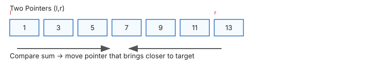

# 👈👉 Two Pointers

> **One-line summary**: Use two indices that move toward each other (or in the same direction) to eliminate the O(n²) nested loop — achieving O(n) on sorted data.

---

## Concept

Two pointers maintains **two indices** — `left` and `right` — and moves them strategically:

- **Opposite-direction** (converging): both ends converge inward — sorted array, palindrome, container problems.
- **Same-direction** (fast/slow): both move forward, one faster — remove duplicates, cycle detection, is-subsequence.

**Prerequisite**: sorted array (for opposite-direction), or logical ordering for same-direction.

---

## Diagram




```
Sorted: [1, 2, 3, 4, 6]  target=6
         L              R
Step 1: 1+6=7 > 6 → R--
Step 2: 1+4=5 < 6 → L++
Step 3: 2+4=6 ✓
```

---

## Time & Space Complexity

| Variant                         | Time   | Space |
| ------------------------------- | ------ | ----- |
| Two Sum Sorted                  | O(n)   | O(1)  |
| Remove duplicates / Move Zeroes | O(n)   | O(1)  |
| Merge sorted arrays             | O(m+n) | O(1)  |
| Is Subsequence                  | O(n)   | O(1)  |
| Trapping Rain Water             | O(n)   | O(1)  |

---

## Common Patterns

### Pattern 1 — Opposite Direction (Two Sum Sorted)

```javascript
function twoSumSorted(arr, target) {
  let left = 0,
    right = arr.length - 1;
  while (left < right) {
    const sum = arr[left] + arr[right];
    if (sum === target) return [left, right];
    if (sum < target) left++;
    else right--;
  }
  return [];
}
```

### Pattern 2 — Same Direction (Move Zeroes)

```javascript
function moveZeroes(nums) {
  let insertPos = 0;
  for (let i = 0; i < nums.length; i++) if (nums[i] !== 0) nums[insertPos++] = nums[i];
  while (insertPos < nums.length) nums[insertPos++] = 0;
}
```

### Pattern 3 — Fast/Slow (Is Subsequence)

```javascript
function isSubsequence(s, t) {
  let i = 0,
    j = 0;
  while (i < s.length && j < t.length) {
    if (s[i] === t[j]) i++;
    j++;
  }
  return i === s.length;
}
```

### Pattern 4 — Fast/Slow (Cycle Detection in Linked List)

```javascript
function hasCycle(head) {
  let slow = head,
    fast = head;
  while (fast && fast.next) {
    slow = slow.next;
    fast = fast.next.next;
    if (slow === fast) return true;
  }
  return false;
}
```

---

## When to Use

- Sorted arrays where you need to find pairs or triplets
- Problems requiring partitioning or rearranging elements
- Optimising brute-force O(n²) solutions to O(n)
- Palindrome checking in arrays/strings
- Cycle detection in linked lists (fast/slow variant)

---

## Pitfalls

- Forgetting to sort the array first (opposite-direction only works on sorted input)
- Moving both pointers simultaneously instead of one at a time
- Off-by-one: use `left < right` not `left <= right` for converging pointers

---

## Practice Problems

| Problem                                                                                                                                                                              | Difficulty | Solution                                    |
| ------------------------------------------------------------------------------------------------------------------------------------------------------------------------------------ | ---------- | ------------------------------------------- |
| [LC 88 — Merge Sorted Array](https://leetcode.com/problems/merge-sorted-array/)                                                                                                      | Easy       | [View Solution](./LC-88-merge-sorted-array) |
| [LC 283 — Move Zeroes](https://leetcode.com/problems/move-zeroes/)                                                                                                                   | Easy       | [View Solution](./LC-283-move-zeroes)       |
| [LC 392 — Is Subsequence](https://leetcode.com/problems/is-subsequence/)                                                                                                             | Easy       | [View Solution](./LC-392-is-subsequence)    |
| [LC 977 — Squares of a Sorted Array](https://leetcode.com/problems/squares-of-a-sorted-array/)                                                                                       | Easy       |                                             |
| [LC 844 — Backspace String Compare](https://leetcode.com/problems/backspace-string-compare/)                                                                                         | Easy       |                                             |
| [LC 27 — Remove Element](https://leetcode.com/problems/remove-element/)                                                                                                              | Easy       |                                             |
| [LC 125 — Valid Palindrome](https://leetcode.com/problems/valid-palindrome/)                                                                                                         | Easy       |                                             |
| [LC 234 — Palindrome Linked List](https://leetcode.com/problems/palindrome-linked-list/)                                                                                             | Easy       |                                             |
| [LC 344 — Reverse String](https://leetcode.com/problems/reverse-string/)                                                                                                             | Easy       |                                             |
| [LC 345 — Reverse Vowels of a String](https://leetcode.com/problems/reverse-vowels-of-a-string) [LC 905 — Sort Array By Parity](https://leetcode.com/problems/sort-array-by-parity/) | Easy       |                                             |
| [LC 922 — Sort Array By Parity II](https://leetcode.com/problems/sort-array-by-parity-ii/)                                                                                           | Easy       |                                             |
| [LC 1089 — Duplicate Zeros](https://leetcode.com/problems/duplicate-zeros/)                                                                                                          | Easy       |                                             |
| [LC 1768 — Merge Strings Alternately](https://leetcode.com/problems/merge-strings-alternately/)                                                                                      | Easy       |                                             |
| [LC 1984 — Minimum Difference Between Highest and Lowest of K Scores](https://leetcode.com/problems/minimum-difference-between-highest-and-lowest-of-k-scores/)                      | Easy       |                                             |
| [CC — String Rotation (ROTSTRNG)](https://www.codechef.com/problems/ROTSTRNG)                                                                                                        | Easy       |                                             |
| [CC — Palindrome Check (PALCHECK)](https://www.codechef.com/problems/PALCHECK)                                                                                                       | Easy       |                                             |
| [CC — Array Partition (ARRPART)](https://www.codechef.com/problems/ARRPART)                                                                                                          | Easy       |                                             |
| [CC — Two Sum Sorted (TWOSUMSOR)](https://www.codechef.com/problems/TWOSUMSOR)                                                                                                       | Easy       |                                             |
| [CC — Palindrome Check (PALCHECK)](https://www.codechef.com/problems/PALCHECK)                                                                                                       | Easy       |                                             |
| [CC — Array Partition (ARRPART)](https://www.codechef.com/problems/ARRPART)                                                                                                          | Easy       |                                             |
| [LC 15 — 3Sum](https://leetcode.com/problems/3sum/)                                                                                                                                  | Medium     |                                             |
| [LC 11 — Container With Most Water](https://leetcode.com/problems/container-with-most-water/)                                                                                        | Medium     |                                             |
| [LC 16 — 3Sum Closest](https://leetcode.com/problems/3sum-closest/)                                                                                                                  | Medium     |                                             |
| [LC 18 — 4Sum](https://leetcode.com/problems/4sum/)                                                                                                                                  | Medium     |                                             |
| [LC 75 — Sort Colors](https://leetcode.com/problems/sort-colors/)                                                                                                                    | Medium     |                                             |
| [LC 80 — Remove Duplicates from Sorted Array II](https://leetcode.com/problems/remove-duplicates-from-sorted-array-ii/)                                                              | Medium     |                                             |
| [LC 167 — Two Sum II - Input Array Is Sorted](https://leetcode.com/problems/two-sum-ii-input-array-is-sorted/)                                                                       | Medium     |                                             |
| [LC 209 — Minimum Size Subarray Sum](https://leetcode.com/problems/minimum-size-subarray-sum/)                                                                                       | Medium     |                                             |
| [LC 259 — 3Sum Smaller](https://leetcode.com/problems/3sum-smaller/)                                                                                                                 | Medium     |                                             |
| [LC 287 — Find the Duplicate Number](https://leetcode.com/problems/find-the-duplicate-number/)                                                                                       | Medium     |                                             |
| [LC 986 — Interval List Intersections](https://leetcode.com/problems/interval-list-intersections/)                                                                                   | Medium     |                                             |
| [LC 1004 — Max Consecutive Ones III](https://leetcode.com/problems/max-consecutive-ones-iii/)                                                                                        | Medium     |                                             |
| [LC 1040 — Moving Stones Until Consecutive II](https://leetcode.com/problems/moving-stones-until-consecutive-ii/)                                                                    | Medium     |                                             |
| [LC 1498 — Number of Subsequences That Satisfy the Given Sum Condition](https://leetcode.com/problems/number-of-subsequences-that-satisfy-the-given-sum-condition/)                  | Medium     |                                             |
| [LC 1658 — Minimum Operations to Reduce X to Zero](https://leetcode.com/problems/minimum-operations-to-reduce-x-to-zero/)                                                            | Medium     |                                             |
| [LC 1750 — Minimum Length of String After Deleting Similar Ends](https://leetcode.com/problems/minimum-length-of-string-after-deleting-similar-ends/)                                | Medium     |                                             |
| [CC — Make Palindrome 2 (MAKEPAL2)](https://www.codechef.com/problems/MAKEPAL2)                                                                                                      | Medium     |                                             |
| [CC — Subarray with Given Sum (SUBSUM2)](https://www.codechef.com/problems/SUBSUM2)                                                                                                  | Medium     |                                             |
| [CC — Container Water (CONTWATER)](https://www.codechef.com/problems/CONTWATER)                                                                                                      | Medium     |                                             | blems/MAKEPAL2) | Medium |     |
| [CC — Two Pointer Technique (TWOPTR)](https://www.codechef.com/problems/TWOPTR)                                                                                                      | Medium     |                                             |
| [CC — Subarray with Given Sum (SUBSUM2)](https://www.codechef.com/problems/SUBSUM2)                                                                                                  | Medium     |                                             |
| [LC 42 — Trapping Rain Water](https://leetcode.com/problems/trapping-rain-water/)                                                                                                    | Hard       |                                             |
| [LC 76 — Minimum Window Substring](https://leetcode.com)                                                                                                                             | Hard       |                                             |
| [LC 923 — 3Sum With Multiplicity](https://leetcode.com/problems/3sum-with-multiplicity/)                                                                                             | Hard       |                                             |
| [LC 1793 — Maximum Score of a Good Subarray](https://leetcode.com/problems/maximum-score-of-a-good-subarray/)                                                                        | Hard       |                                             |
| [LC 1970 — Last Day Where You Can Still Cross](https://leetcode.com/problems/last-day-where-you-can-still-cross/)                                                                    | Hard       |                                             |
| [LC 2040 — Kth Smallest Product of Two Sorted Arrays](https://leetcode.com/problems/kth-smallest-product-of-two-sorted-arrays/)                                                      | Hard       |                                             |
| [LC 2444 — Count Subarrays With Fixed Bounds](https://leetcode.com/problems/count-subarrays-with-fixed-bounds/)                                                                      | Hard       |                                             |
| [CC — Advanced Two Pointers (ADVTWOPTR)](https://www.codechef.com/problems/ADVTWOPTR)                                                                                                | Hard       |                                             |
| [CC — Rain Water Trapping (RAINWATER)](https://www.codechef.com/problems/RAINWATER)                                                                                                  | Hard       |                                             |
| [LC 719 — Find K-th Smallest Pair Distance](https://leetcode.com/problems/find-k-th-smallest-pair-distance/)                                                                         | Hard       |                                             |
| [LC 923 — 3Sum With Multiplicity](https://leetcode.com/problems/3sum-with-multiplicity/)                                                                                             | Hard       |                                             |
| [CC — Advanced Two Pointers (ADVTWOPTR)](https://www.codechef.com/problems/ADVTWOPTR)                                                                                                | Hard       |                                             |

---

## Related Topics

- [Sliding Window](../sliding-window/README.md) — same-direction two pointers with a window constraint
- [Binary Search](../binary-search/README.md) — both reduce search space
- [Sorting](../sorting/README.md) — prerequisite for opposite-direction
- [Linked List](../linked-list/README.md) — fast/slow pointer variant

[← Back to Home](../index.md) · © sparshjaswal
