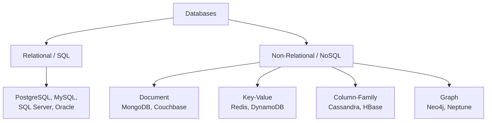
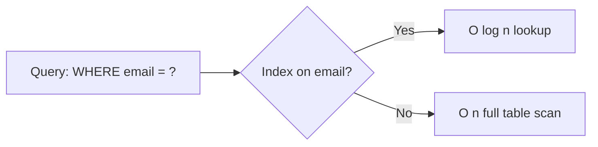
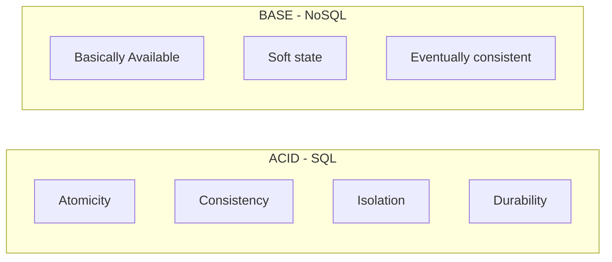
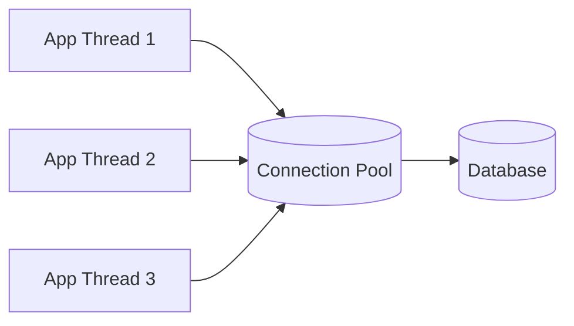

# Databases

> **One-line summary**: Choosing the right database — and modeling data correctly — is the single biggest lever on a system's scalability, consistency, and cost.

---

## 🧩 Core Concepts

A **database** stores, organizes, and retrieves data reliably. The two broad families are **relational (SQL)** and **non-relational (NoSQL)**. Picking between them (and the right sub-type) is a foundational system-design decision that drives your consistency model, query flexibility, and how you [shard](./sharding.md) and [replicate](./replication.md) later.

---

## 🗃️ SQL vs NoSQL

### Relational (SQL)

Data lives in **tables** (rows + columns) with a fixed **schema** and enforced **relationships** (foreign keys). Queried with **SQL**, and typically **ACID**-compliant.

**Strengths**: structured data, complex joins, strong consistency, mature tooling.
**Weaknesses**: rigid schema, harder to scale writes horizontally.

### Non-Relational (NoSQL)

A family of stores optimized for **flexible schemas**, **horizontal scale**, and **specific access patterns**. Usually favor **availability + partition tolerance** (see [CAP Theorem](./cap-theorem.md)) with **eventual consistency** (see [Consistency Models](./consistency-models.md)).

| Type | Data Model | Best For | Examples |
|------|-----------|----------|----------|
| **Document** | JSON/BSON documents | Semi-structured data, evolving schemas, catalogs | MongoDB, Couchbase |
| **Key-Value** | `key → value` map | Caching, sessions, high-throughput lookups | Redis, DynamoDB |
| **Column-Family** | Sparse wide rows by column | Time-series, write-heavy, huge datasets | Cassandra, HBase |
| **Graph** | Nodes + edges | Highly connected data, relationships | Neo4j, Neptune |

### Head-to-Head

| Dimension | SQL | NoSQL |
|-----------|-----|-------|
| **Schema** | Fixed, enforced | Flexible / schema-less |
| **Scaling** | Primarily vertical (harder horizontal) | Built for horizontal ([sharding](./sharding.md)) |
| **Consistency** | Strong (ACID) | Tunable, often eventual (BASE) |
| **Joins** | First-class, powerful | Limited / denormalized |
| **Query language** | Standard SQL | Varies per engine |
| **Best fit** | Transactions, reporting, relations | Scale, flexible data, specific access patterns |

---

## 🎯 When to Use Each

**Choose SQL when:**
- You need **transactions** and strong consistency (payments, inventory, banking).
- Data is **highly relational** with complex queries and joins.
- The schema is well-understood and stable.

**Choose NoSQL when:**
- You need **massive horizontal scale** and high write throughput.
- The schema is **flexible or rapidly evolving**.
- Access patterns are known and simple (key lookups, document fetches).
- Eventual consistency is acceptable.

> 💡 **Polyglot persistence**: real systems often mix both — e.g., PostgreSQL for orders, Redis for sessions, Cassandra for event logs.

---

## 🔍 Indexing

An **index** is an auxiliary data structure that speeds up reads at the cost of extra storage and slower writes (the index must be updated on every write).

| Index Type | Structure | Great For | Weak For |
|-----------|-----------|-----------|----------|
| **B-Tree** | Balanced sorted tree | Range queries, sorting, `>`, `<`, `BETWEEN`, prefix `LIKE` | Nothing major — the default |
| **Hash** | Hash table | Exact-match equality (`=`) | Range queries (not supported) |

- **B-Tree** is the default in most engines: `O(log n)` lookups and supports ordered scans.
- **Hash** indexes give `O(1)` average equality lookups but cannot serve ranges.
- **Composite indexes** cover multi-column queries (order matters: leftmost-prefix rule).
- Over-indexing hurts write performance and wastes storage — index deliberately.

---

## 🧱 Normalization vs Denormalization

| Approach | Idea | Pros | Cons |
|----------|------|------|------|
| **Normalization** | Split data into related tables, no redundancy (3NF) | No duplication, consistent updates, less storage | More joins, slower reads |
| **Denormalization** | Duplicate data to avoid joins | Fast reads, fewer joins | Redundancy, harder/costly writes, risk of drift |

- **Normalize** for write-heavy, consistency-critical OLTP systems.
- **Denormalize** for read-heavy systems and NoSQL, trading storage & write cost for read speed. Pairs well with [caching](./caching.md).

---

## ⚖️ ACID vs BASE

**ACID** — guarantees for reliable transactions:
- **Atomicity** — all-or-nothing; a transaction fully completes or fully rolls back.
- **Consistency** — moves the DB from one valid state to another (constraints hold).
- **Isolation** — concurrent transactions don't interfere (via isolation levels).
- **Durability** — committed data survives crashes.

**BASE** — the relaxed philosophy for scale (see [CAP Theorem](./cap-theorem.md)):
- **Basically Available** — the system always responds, even if degraded.
- **Soft state** — state may change over time without input.
- **Eventually consistent** — replicas converge given enough time.

---

## 🔄 Transactions & Isolation Levels

A **transaction** groups multiple operations into one atomic unit. Isolation levels trade consistency for concurrency:

| Isolation Level | Dirty Read | Non-Repeatable Read | Phantom Read |
|-----------------|:----------:|:-------------------:|:------------:|
| **Read Uncommitted** | ✅ possible | ✅ possible | ✅ possible |
| **Read Committed** | ❌ | ✅ possible | ✅ possible |
| **Repeatable Read** | ❌ | ❌ | ✅ possible |
| **Serializable** | ❌ | ❌ | ❌ |

> Higher isolation = more correctness but more locking/contention and lower throughput.

---

## 🔌 Connection Pooling

Opening a DB connection is expensive (TCP + auth handshake). A **connection pool** keeps a set of reusable open connections that application threads borrow and return.

- **Reduces latency** — no per-request handshake.
- **Caps concurrency** — protects the DB from connection exhaustion.
- Tune **pool size** to match DB limits and workload (e.g., HikariCP, PgBouncer).

---

## 🧠 Trade-offs / When to Use

- **SQL** → correctness, relations, transactions; scale vertically or via [read replicas](./replication.md).
- **NoSQL** → scale and flexibility; accept eventual consistency and denormalization.
- **Indexing** → speeds reads, slows writes — index for your real query patterns.
- **Normalization** → write integrity; **denormalization** → read speed.
- When one DB isn't enough, combine [sharding](./sharding.md) (scale writes) + [replication](./replication.md) (scale reads/availability) + [caching](./caching.md) (reduce load).

---

## 🔗 Related Topics

- [Sharding](./sharding.md) — partition data across nodes to scale writes
- [Replication](./replication.md) — copy data for availability and read scaling
- [Caching](./caching.md) — reduce database load with fast in-memory reads
- [CAP Theorem](./cap-theorem.md) — consistency vs availability under partitions
- [Consistency Models](./consistency-models.md) — strong vs eventual consistency
- [Scalability](./scalability.md) — vertical vs horizontal scaling

[← Back to System Design](./README.md) · © sparshjaswal
