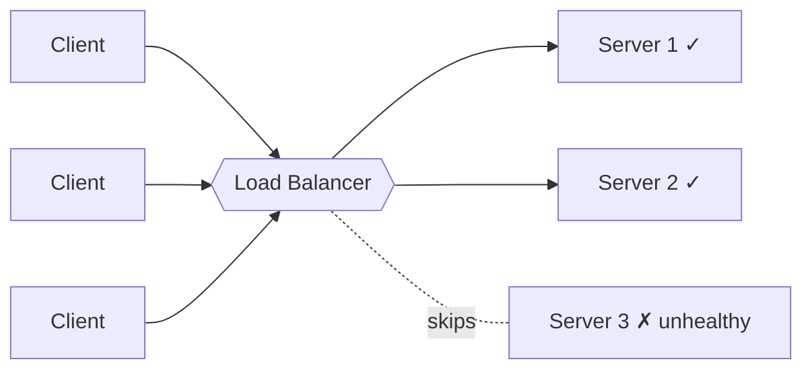
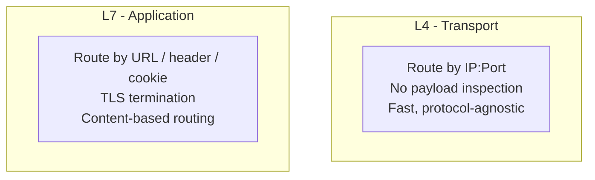
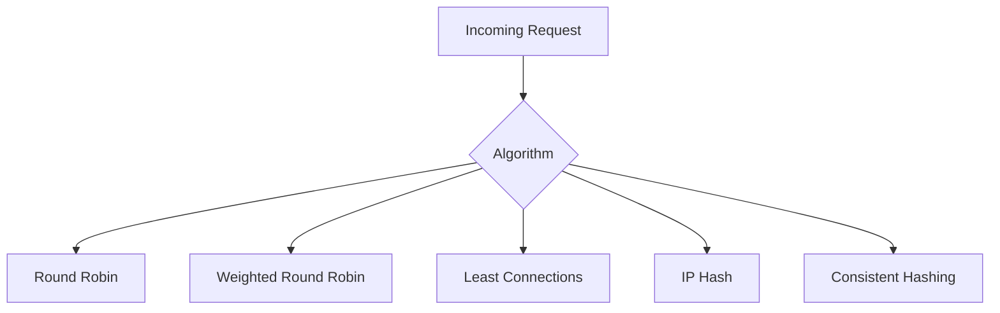
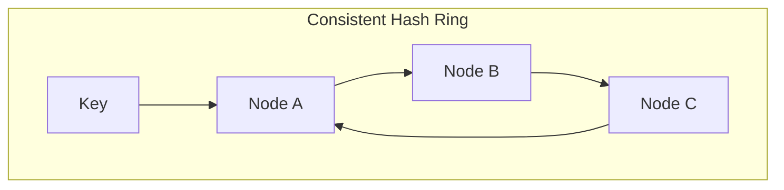
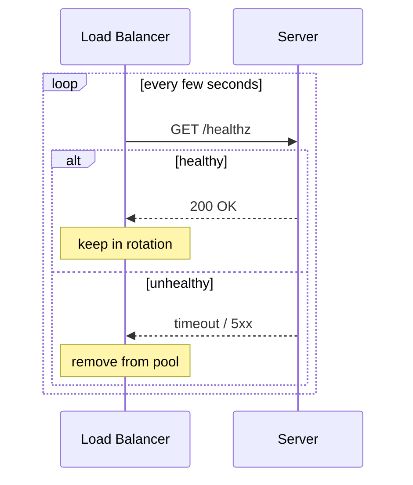
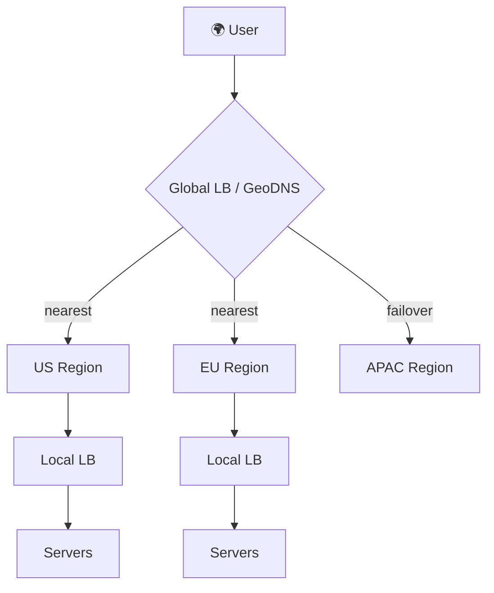

# Load Balancing

> **One-line summary**: A load balancer distributes incoming traffic across multiple servers so no single machine is overwhelmed — the backbone of horizontal scaling, high availability, and zero-downtime deploys.

---

## 🧩 Core Concepts — What & Why

When you [scale horizontally](./scalability.md), you have many identical servers. Something must decide *which* server handles each request — that's the **load balancer (LB)**. It sits between clients and your server pool and forwards traffic based on an **algorithm** and the **health** of each backend.

**Why load balance?**

- **Scalability** — spread load across many stateless servers.
- **High availability** — route around failed nodes automatically.
- **Zero-downtime deploys** — drain traffic from a node, update it, add it back.
- **Performance** — keep any single node below saturation, reducing latency.

---

## 🔌 L4 vs. L7 Load Balancers

Load balancers operate at different layers of the network stack.

- **Layer 4 (Transport)** balances by **IP address and TCP/UDP port**. It doesn't inspect the payload — it just forwards packets/connections. Extremely fast and protocol-agnostic.
- **Layer 7 (Application)** understands **HTTP/HTTPS** — it can route on URL path, headers, cookies, or hostname, terminate TLS, and do content-based routing. More features, slightly more overhead.

| Feature | L4 (Transport) | L7 (Application) |
| --- | --- | --- |
| **Routing basis** | IP + port | URL, headers, cookies, host |
| **Payload aware** | No | Yes |
| **Speed** | Very fast | Fast (more work per request) |
| **TLS termination** | No | Yes |
| **Content routing** | No | Yes (e.g., `/api` → API pool) |
| **Examples** | AWS NLB, HAProxy (TCP) | AWS ALB, NGINX, Envoy |

**Real-world example**: An [API gateway](./api-design.md) uses an **L7** balancer to send `/images/*` to an image service and `/checkout/*` to a payment service, while a high-throughput game backend may prefer **L4** for raw speed.

---

## 🎛️ Load Balancing Algorithms

How does the LB pick a backend? The choice depends on whether servers are equal, how long requests take, and whether cache locality matters.

### Round Robin
Cycle through servers in order: 1 → 2 → 3 → 1… Simple and fair when servers are identical and requests are uniform. Ignores current load.

### Weighted Round Robin
Assign each server a **weight** based on capacity; more powerful servers get proportionally more requests. Great for heterogeneous hardware.

### Least Connections
Send each request to the server with the **fewest active connections**. Adapts to real load — ideal when request durations vary widely (some cheap, some expensive).

### IP Hash
Hash the client's IP to pick a server, so a given client consistently reaches the same backend. A simple way to get **session affinity** without cookies.

### Consistent Hashing
Maps both servers and keys onto a hash ring so that **adding/removing a server only remaps a small fraction of keys** (not all of them). Essential for distributed caches and shard routing (deep dive in [Hashing](../hashing/README.md) and [Sharding](./sharding.md)).

| Algorithm | Best When | Weakness |
| --- | --- | --- |
| **Round Robin** | Identical servers, uniform requests | Ignores load |
| **Weighted RR** | Mixed server sizes | Static weights |
| **Least Connections** | Variable request cost | Needs live conn tracking |
| **IP Hash** | Simple affinity needed | Uneven if IPs cluster (NAT) |
| **Consistent Hashing** | Caches, shard routing | More complex to implement |

---

## ❤️ Health Checks

A load balancer must only send traffic to **healthy** backends. It periodically probes each server and removes failing ones from rotation.

- **Active checks** — the LB pings an endpoint (e.g., `GET /healthz`) on a schedule.
- **Passive checks** — the LB watches real traffic and ejects a node after repeated errors/timeouts.

> **Tip**: A good health endpoint checks *dependencies* (DB, cache) too — a server that can't reach its database should report unhealthy even if the process is alive.

---

## 🍪 Sticky Sessions (Session Affinity)

**Sticky sessions** pin a client to the same backend for the duration of a session — useful for [stateful services](./scalability.md) that hold session data in memory. The LB uses a cookie or client IP to route consistently.

**Trade-off**: stickiness undermines even load distribution and complicates failover (if that server dies, the session is lost). **Preferred alternative**: keep app servers stateless and store session state in a shared store like Redis (see [Caching](./caching.md)), so *any* server can handle *any* request.

---

## 🌐 Global vs. Local Load Balancing

- **Local (within a data center)** — distributes across servers in one region/zone. Usually L4/L7 as above.
- **Global (across data centers)** — routes users to the *nearest or healthiest region*, typically via **GeoDNS** or **Anycast**. Improves latency and provides disaster recovery / regional failover.

| | Local LB | Global LB |
| --- | --- | --- |
| **Scope** | One data center / zone | Multiple regions |
| **Mechanism** | L4/L7 proxy | GeoDNS, Anycast |
| **Optimizes** | Server-level distribution | Latency + regional failover |

---

## ⚖️ Trade-offs / When to Use

- **The LB can become a bottleneck or SPOF.** Run it in a redundant pair (active-passive or active-active) and consider managed cloud LBs.
- **L4 for speed, L7 for smarts.** Use L7 when you need path/host routing, TLS termination, or [rate limiting](./rate-limiting.md); use L4 when raw throughput matters most.
- **Prefer stateless + shared store over sticky sessions** for clean horizontal scaling.
- **Match the algorithm to the workload** — least-connections for uneven request costs, consistent hashing for caches, round robin for uniform loads.

---

## 🔗 Related Topics

- [Scalability](./scalability.md) — load balancing is what makes horizontal scaling work
- [Caching](./caching.md) — shared session/state store to keep servers stateless
- [Rate Limiting](./rate-limiting.md) — often enforced at the L7 balancer / gateway
- [Microservices](./microservices.md) — per-service routing and service discovery
- [API Design](./api-design.md) — gateways and content-based routing
- [Consistency Models](./consistency-models.md) — implications of multi-region routing
- [Hashing](../hashing/README.md) — consistent hashing internals

---

[← Back to System Design](./README.md) · © sparshjaswal
