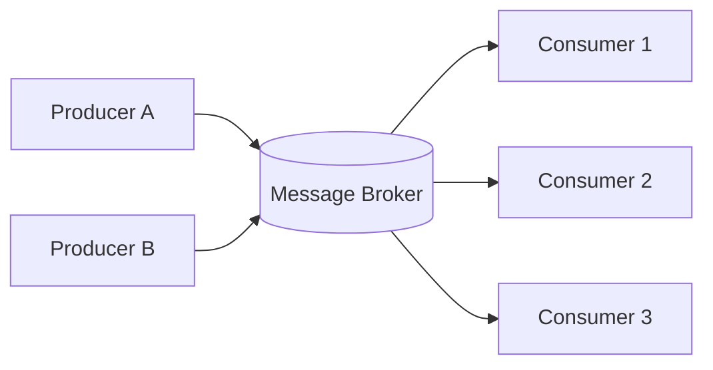
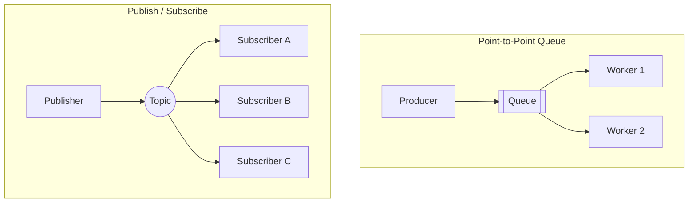
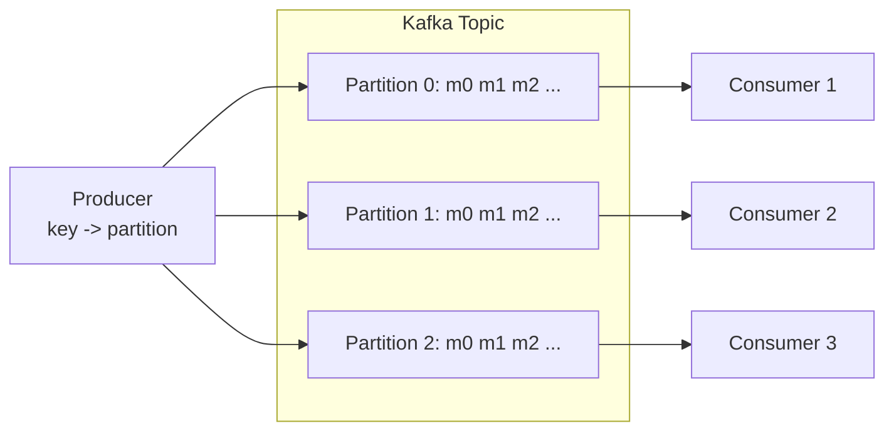
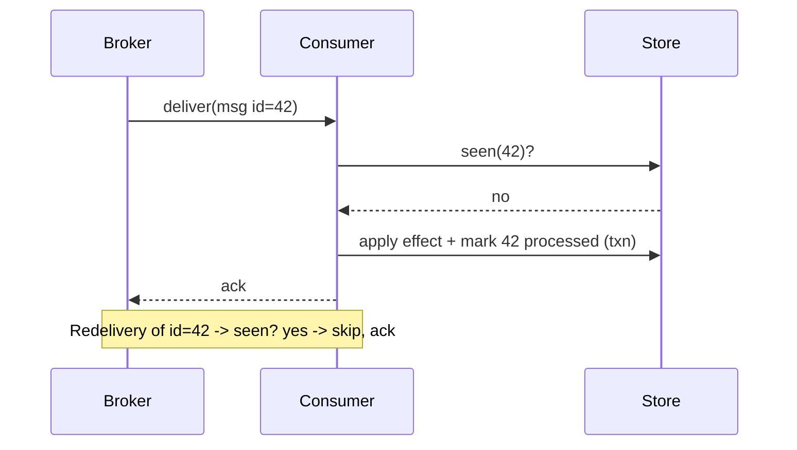
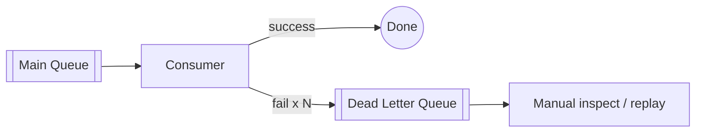

# Message Queues

> **One-line summary**: Message queues decouple producers from consumers so systems stay responsive, absorb traffic spikes, and process work asynchronously and reliably.

---

## 🧩 Core Concepts

### Why Async Messaging?

Synchronous calls tightly couple services: the caller must wait for the callee, and a slow or failed downstream drags the whole request down. **Asynchronous messaging** breaks this coupling by placing a durable broker between the producer and consumer.

- **Decoupling** — producers and consumers don't need to know about, or be available at, the same time.
- **Load leveling (buffering)** — the queue absorbs bursts; consumers drain work at their own pace.
- **Resilience** — if a consumer crashes, messages persist and are reprocessed later.
- **Scalability** — add more consumers to increase throughput without changing producers.

### Point-to-Point vs. Publish/Subscribe

- **Point-to-point (work queue)**: each message is delivered to **exactly one** consumer in a competing-consumers group. Ideal for distributing tasks (e.g., image resizing).
- **Publish/subscribe (fan-out)**: each message is delivered to **every** subscriber. Ideal for broadcasting events (e.g., "order placed" → email, analytics, inventory).

### Message Queues vs. Event Streaming

A **traditional queue** treats messages as transient tasks that are removed once acknowledged. An **event stream** (log) is an append-only, replayable record where consumers track their own read position (offset).

| Aspect | Message Queue (RabbitMQ) | Event Stream (Kafka) |
|--------|--------------------------|----------------------|
| **Model** | Smart broker, dumb consumer | Dumb broker, smart consumer |
| **Message lifetime** | Deleted after ack | Retained by time/size; replayable |
| **Consumption** | Broker pushes; message consumed once | Consumers pull by offset; many can re-read |
| **Ordering** | Per-queue | Strong per-partition |
| **Throughput** | High (tens of thousands/s) | Very high (millions/s) |
| **Routing** | Rich (exchanges, bindings, priorities) | Simple (topic + partition key) |
| **Best for** | Task distribution, RPC, complex routing | Event sourcing, log aggregation, stream analytics |

### Kafka vs. RabbitMQ Semantics

- **RabbitMQ** — an **AMQP broker** with exchanges (direct, topic, fanout, headers) that route to bound queues. The broker tracks delivery and redelivers unacked messages. Great when you need flexible routing, priorities, or per-message TTL.
- **Kafka** — a **distributed commit log**. Topics are split into **partitions**; each partition is an ordered, immutable sequence. Consumers in a group each own a subset of partitions and commit **offsets**. Great for high-throughput, replayable event pipelines.

---

## 📬 Delivery Guarantees

| Guarantee | Meaning | Duplicates? | Loss? | How |
|-----------|---------|-------------|-------|-----|
| **At-most-once** | Fire-and-forget | No | Possible | Ack before processing / no retries |
| **At-least-once** | Retry until acked | Possible | No | Ack after processing + redelivery |
| **Exactly-once** | Effectively once | No | No | Idempotency + transactions/dedup |

- **At-most-once** — lowest latency, acceptable for metrics or high-volume telemetry where a lost sample is harmless.
- **At-least-once** — the pragmatic default. Messages may be redelivered, so consumers **must** be idempotent.
- **Exactly-once** — the hardest and most expensive. In practice it is achieved as *effectively-once* by combining at-least-once delivery with **idempotent consumers** and/or **transactional writes** (e.g., Kafka's transactional producer + read-committed consumer).

### Idempotent Consumers

Since at-least-once redelivers, design consumers so that processing the same message twice has the same effect as processing it once:

- Use a **unique message/business key** and record processed IDs in a dedup store.
- Prefer **upserts** over blind inserts; use conditional updates.
- Wrap the side effect and the offset/ack commit in a **single transaction** where possible.

---

## 🔀 Ordering, Dead Letters, and Backpressure

### Ordering

- Global ordering is expensive and rarely needed. Kafka guarantees ordering **within a partition** — route related events with the same **partition key** (e.g., `userId`) to preserve their order.
- RabbitMQ preserves order **within a single queue** with a single consumer; competing consumers break strict order.

### Dead Letter Queues (DLQ)

When a message repeatedly fails (poison message), route it to a **dead letter queue** after N attempts instead of blocking the pipeline. Operators can inspect, fix, and replay DLQ messages.

### Backpressure

When producers outpace consumers, the queue grows unbounded and latency spikes. Manage it with:

- **Consumer prefetch limits** — cap in-flight unacked messages per consumer.
- **Bounded queues** — reject or block producers when full.
- **Autoscaling consumers** — scale out on queue depth / lag.
- **Shed load** — drop or sample low-priority messages under extreme load.

---

## ⚖️ Trade-offs / When to Use

| Use a message queue when... | Avoid / reconsider when... |
|-----------------------------|----------------------------|
| Work can be processed asynchronously | The caller needs an immediate synchronous result |
| You need to smooth traffic spikes | Latency budget is sub-millisecond end-to-end |
| Services should be decoupled | The added broker/operational complexity isn't justified |
| You need retries, DLQs, fan-out | Strict global ordering across all messages is required |

**Common use cases**: order processing, email/SMS notifications, image/video transcoding, log & metrics pipelines, event-driven microservices, CQRS/event sourcing, and buffering writes to slow downstream systems.

---

## 🔗 Related Topics

- [Scalability](./scalability.md) — add consumers to scale throughput horizontally
- [Load Balancing](./load-balancing.md) — competing consumers distribute work like an L7 balancer
- [Consistency Models](./consistency-models.md) — async messaging typically yields eventual consistency
- [Rate Limiting](./rate-limiting.md) — queues provide natural load leveling and backpressure
- [Microservices](./microservices.md) — async messaging is the backbone of event-driven services

[← Back to System Design](./README.md) · © sparshjaswal
