# API Gateway 🚪

An API gateway is the single entry point for all client requests in a microservices architecture. It sits between clients and backend services, handling cross-cutting concerns — authentication, rate limiting, request transformation, routing, and observability — so that individual services can focus on business logic.

> _Think of the API gateway as the front door to your microservices. Every request knocks here first._

---

## Why an API Gateway?

In a monolithic application, a client makes one call to one endpoint. In microservices, a single page might need data from a dozen services. Without a gateway:

- **Clients become chatty** — multiple round-trips to different services increase latency
- **Cross-cutting concerns duplicate** — every service implements auth, rate limiting, logging
- **Client logic bloats** — clients must know service locations, handle partial failures, compose data
- **Protocol coupling** — internal services may use gRPC, Thrift, or message queues; clients typically speak HTTP/JSON

An API gateway solves these by centralizing infrastructure concerns into a dedicated layer.

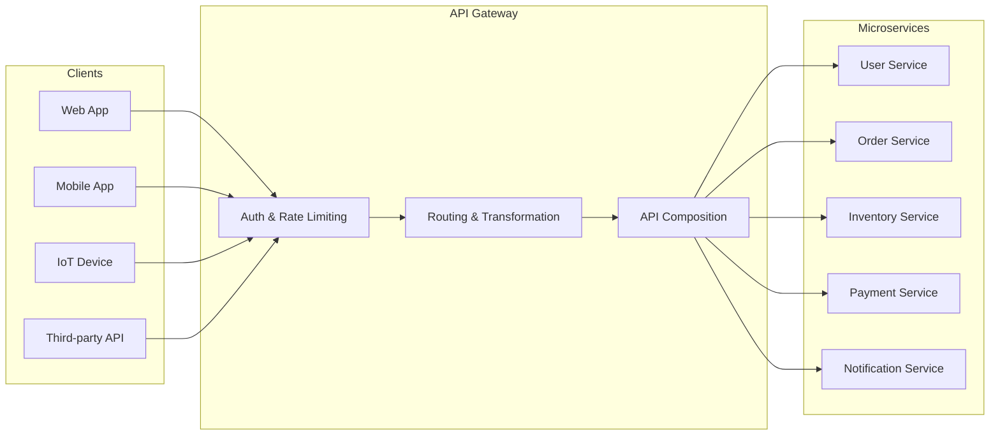

---

## Core Responsibilities

### 1. Request Routing

The gateway inspects incoming requests (URL path, headers, query parameters) and forwards them to the appropriate backend service. Routing rules may be static (config file) or dynamic (service discovery).

```yaml
# Kong declarative routing example
services:
  - name: user-service
    url: http://user-service:3000
    routes:
      - name: user-routes
        paths:
          - /api/users
        strip_path: true
  - name: order-service
    url: http://order-service:3001
    routes:
      - name: order-routes
        paths:
          - /api/orders
```

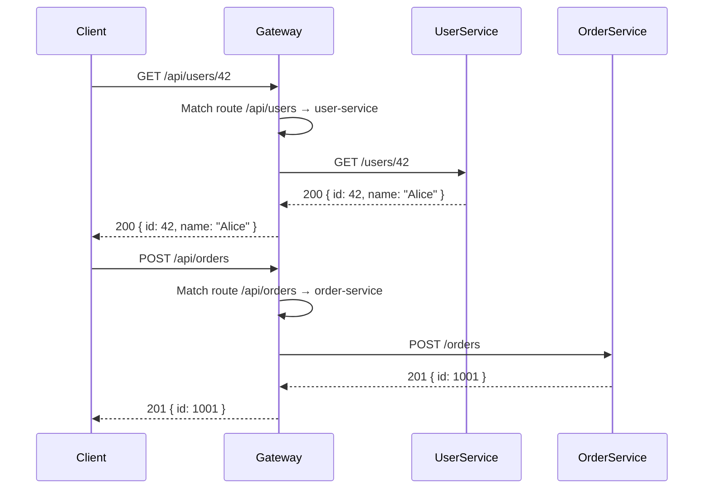

### 2. Authentication & Authorization

The gateway verifies credentials at the edge before any request reaches internal services. This offloads auth logic from every service.

**Authentication methods at the gateway:**

| Method            | How it works                                                                | Use case                                          |
| ----------------- | --------------------------------------------------------------------------- | ------------------------------------------------- |
| **JWT**           | Gateway validates token signature, expiry, and claims                       | Service-to-service and client-to-service          |
| **API Key**       | Static key passed in header or query param                                  | Simple service access, rate-limiting per consumer |
| **OAuth2 / OIDC** | Gateway acts as resource server, validates tokens from an identity provider | User-facing applications with delegated access    |
| **mTLS**          | Mutual TLS — both client and gateway present certificates                   | Zero-trust, service mesh internal traffic         |
| **HMAC**          | Request signed with shared secret                                           | Webhook validation, legacy system integration     |

**Kong JWT plugin example:**

```yaml
# Enable JWT on a route
plugins:
  - name: jwt
    route: user-routes
    config:
      claims_to_verify:
        - exp
      key_claim_name: kid
      secret_is_base64: false
```

**Express Gateway JWT pipeline:**

```yaml
# gateway.config.yml
pipelines:
  - name: authenticated-api
    apiEndpoints:
      - api
    policies:
      - jwt:
          - action:
              secretOrPublicKey: 'my-secret'
              checkCredentialExistence: true
      - proxy:
          - action:
              serviceEndpoint: backend
```

**Custom Node.js gateway — JWT middleware:**

```typescript
import jwt from 'jsonwebtoken';
import { Request, Response, NextFunction } from 'express';

interface AuthenticatedRequest extends Request {
  userId?: string;
  roles?: string[];
}

export function authenticateJwt(
  req: AuthenticatedRequest,
  res: Response,
  next: NextFunction,
): void {
  const authHeader = req.headers.authorization;

  if (!authHeader?.startsWith('Bearer ')) {
    res.status(401).json({ error: { code: 'MISSING_TOKEN', message: 'Bearer token required' } });
    return;
  }

  const token = authHeader.split(' ')[1];

  try {
    const decoded = jwt.verify(token, process.env.JWT_SECRET!) as {
      sub: string;
      roles: string[];
      exp: number;
    };

    req.userId = decoded.sub;
    req.roles = decoded.roles;
    next();
  } catch (err) {
    res.status(401).json({
      error: {
        code: 'INVALID_TOKEN',
        message: err instanceof jwt.TokenExpiredError ? 'Token expired' : 'Invalid token',
      },
    });
  }
}

export function authorize(...allowedRoles: string[]) {
  return (req: AuthenticatedRequest, res: Response, next: NextFunction): void => {
    if (!req.roles?.some((role) => allowedRoles.includes(role))) {
      res.status(403).json({ error: { code: 'FORBIDDEN', message: 'Insufficient permissions' } });
      return;
    }
    next();
  };
}

// Usage on gateway routes
gatewayApp.get('/api/admin/users', authenticateJwt, authorize('admin'), proxyToUserService);
```

### 3. Rate Limiting

The gateway enforces rate limits globally or per consumer, protecting backend services from abuse and ensuring fair resource distribution.

**Rate limiting at the gateway (Kong):**

```yaml
plugins:
  - name: rate-limiting
    service: user-service
    config:
      minute: 100 # 100 requests per minute
      hour: 5000 # 5000 requests per hour
      policy: local # local (per node) or redis (cluster-wide)
      fault_tolerant: true
      hide_client_headers: false
```

**Custom rate limiter using Redis (sliding window):**

```typescript
import { createClient } from 'redis';

const redis = createClient({ url: process.env.REDIS_URL });

interface RateLimitConfig {
  windowMs: number; // window size in milliseconds
  max: number; // max requests in the window
}

export function slidingWindowRateLimiter(config: RateLimitConfig) {
  return async (req: Request, res: Response, next: NextFunction): Promise<void> => {
    const key = `ratelimit:${req.ip}:${req.route?.path || 'global'}`;
    const now = Date.now();
    const windowStart = now - config.windowMs;

    const pipeline = redis.multi();
    pipeline.zAdd(key, { score: now, value: `${now}-${Math.random()}` });
    pipeline.zRemRangeByScore(key, 0, windowStart);
    pipeline.zCard(key);
    pipeline.expire(key, Math.ceil(config.windowMs / 1000));

    const [, , count] = (await pipeline.exec()) as [unknown, unknown, number];

    res.setHeader('X-RateLimit-Limit', config.max);
    res.setHeader('X-RateLimit-Remaining', Math.max(0, config.max - count));
    res.setHeader('X-RateLimit-Reset', Math.ceil((windowStart + config.windowMs) / 1000));

    if (count > config.max) {
      res.status(429).json({
        error: { code: 'RATE_LIMITED', message: 'Too many requests. Slow down.' },
        retryAfter: Math.ceil(config.windowMs / 1000),
      });
      return;
    }

    next();
  };
}
```

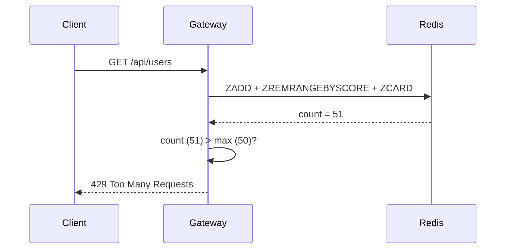

### 4. Request & Response Transformation

The gateway can modify requests before forwarding and responses before returning to clients. This includes header injection, payload restructuring, and protocol translation.

**Common transformations:**

| Transformation            | Direction | Example                                                  |
| ------------------------- | --------- | -------------------------------------------------------- |
| **Add headers**           | Request   | Inject `X-Request-ID`, `X-User-ID` for tracing           |
| **Strip headers**         | Response  | Remove `Server`, `X-Powered-By` for security             |
| **Protocol translation**  | Both      | Accept HTTP/JSON from client, forward gRPC to service    |
| **Payload restructuring** | Response  | Convert snake_case to camelCase, flatten nested response |
| **Legacy compatibility**  | Both      | Map old API surface to new service endpoints             |
| **Response compression**  | Response  | Gzip/Brotli for payloads > threshold                     |
| **Request validation**    | Request   | Validate JSON schema, reject malformed payloads at edge  |

**Kong request transformer:**

```yaml
plugins:
  - name: request-transformer
    route: user-routes
    config:
      add:
        headers:
          - 'X-Request-ID:$(uuid)'
          - 'X-Gateway-Timestamp:$(timestamp)'
        querystring:
          - 'gateway:kong'
      remove:
        headers:
          - 'X-Internal-Debug'
```

**Custom transformation middleware:**

```typescript
import { Request, Response, NextFunction } from 'express';
import { v4 as uuidv4 } from 'uuid';

export function requestTransformer(req: Request, res: Response, next: NextFunction): void {
  // Inject correlation ID
  const correlationId = (req.headers['x-correlation-id'] as string) || uuidv4();
  req.headers['x-correlation-id'] = correlationId;
  res.setHeader('X-Correlation-ID', correlationId);

  // Strip sensitive internal headers before forwarding
  delete req.headers['x-internal-token'];
  delete req.headers['authorization']; // re-inject after gateway auth if needed

  next();
}

// Response transformation — intercept and modify
export function responseTransformer(originalBody: unknown, req: Request): unknown {
  if (typeof originalBody !== 'object' || originalBody === null) return originalBody;

  const body = originalBody as Record<string, unknown>;

  // Convert snake_case keys to camelCase
  return Object.entries(body).reduce<Record<string, unknown>>((acc, [key, value]) => {
    const camelKey = key.replace(/_([a-z])/g, (_, letter) => letter.toUpperCase());
    acc[camelKey] = value;
    return acc;
  }, {});
}
```

### 5. API Composition / Aggregation

Instead of requiring clients to make multiple calls, the gateway can fan out to several services, aggregate responses, and return a single coalesced result.

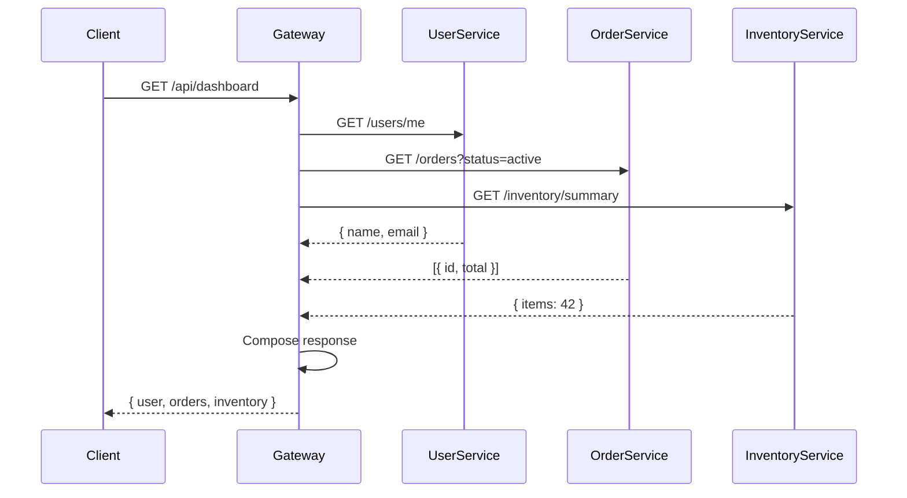

**Custom composition endpoint (Node.js):**

```typescript
import express, { Request, Response, NextFunction } from 'express';
import axios, { AxiosError } from 'axios';

const app = express();

interface DashboardResponse {
  user: { id: string; name: string; email: string };
  activeOrders: Array<{ id: string; total: number; status: string }>;
  inventory: { totalItems: number; lowStock: number };
}

app.get('/api/dashboard', async (req: Request, res: Response) => {
  const userId = (req as any).userId; // injected by auth middleware

  try {
    // Fan-out requests in parallel
    const [userResp, ordersResp, inventoryResp] = await Promise.allSettled([
      axios.get(`http://user-service:3000/users/${userId}`, { timeout: 2000 }),
      axios.get(`http://order-service:3001/orders`, {
        params: { userId, status: 'active' },
        timeout: 2000,
      }),
      axios.get(`http://inventory-service:3002/inventory/summary`, { timeout: 2000 }),
    ]);

    const dashboard: Partial<DashboardResponse> = {};

    // Graceful degradation — don't fail if one service is down
    if (userResp.status === 'fulfilled') {
      dashboard.user = userResp.value.data;
    }
    if (ordersResp.status === 'fulfilled') {
      dashboard.activeOrders = ordersResp.value.data;
    }
    if (inventoryResp.status === 'fulfilled') {
      dashboard.inventory = inventoryResp.value.data;
    }

    res.json({ data: dashboard });
  } catch (err) {
    const axiosErr = err as AxiosError;
    res.status(502).json({
      error: {
        code: 'COMPOSITION_FAILED',
        message: 'Failed to compose dashboard response',
        details: axiosErr.message,
      },
    });
  }
});
```

### 6. Circuit Breaking

When a downstream service fails repeatedly, the gateway can open a circuit — failing fast instead of waiting for timeouts. This prevents cascading failures and gives failing services time to recover.

**Circuit breaker states:**

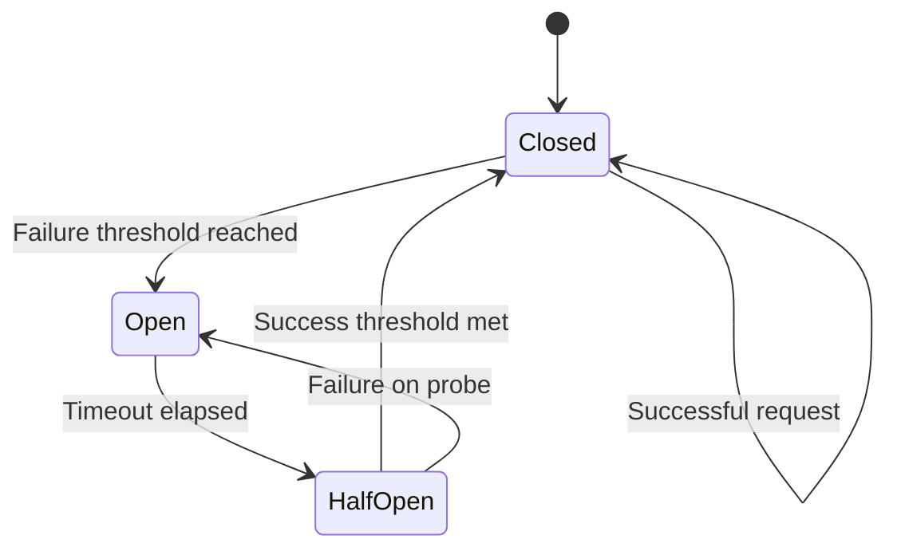

**Circuit breaker implementation (TypeScript):**

```typescript
interface CircuitBreakerConfig {
  failureThreshold: number; // consecutive failures to open circuit
  successThreshold: number; // consecutive successes in half-open to close
  timeout: number; // ms before moving from open → half-open
  requestTimeout: number; // ms before a request times out
}

enum CircuitState {
  CLOSED = 'CLOSED',
  OPEN = 'OPEN',
  HALF_OPEN = 'HALF_OPEN',
}

export class CircuitBreaker {
  private state = CircuitState.CLOSED;
  private failureCount = 0;
  private successCount = 0;
  private nextAttempt: number = 0;
  private config: Required<CircuitBreakerConfig>;

  constructor(config: CircuitBreakerConfig) {
    this.config = {
      failureThreshold: 5,
      successThreshold: 3,
      timeout: 30000,
      requestTimeout: 5000,
      ...config,
    };
  }

  async call<T>(fn: () => Promise<T>): Promise<T> {
    if (this.state === CircuitState.OPEN) {
      if (Date.now() < this.nextAttempt) {
        throw new Error('Circuit is OPEN — rejecting fast');
      }
      this.state = CircuitState.HALF_OPEN;
    }

    try {
      const result = await this.withTimeout(fn(), this.config.requestTimeout);
      this.onSuccess();
      return result;
    } catch (err) {
      this.onFailure();
      throw err;
    }
  }

  private onSuccess(): void {
    this.failureCount = 0;
    if (this.state === CircuitState.HALF_OPEN) {
      this.successCount++;
      if (this.successCount >= this.config.successThreshold) {
        this.state = CircuitState.CLOSED;
        this.successCount = 0;
        console.log('Circuit CLOSED — service recovered');
      }
    }
  }

  private onFailure(): void {
    this.failureCount++;
    if (this.state === CircuitState.CLOSED && this.failureCount >= this.config.failureThreshold) {
      this.state = CircuitState.OPEN;
      this.nextAttempt = Date.now() + this.config.timeout;
      this.successCount = 0;
      console.warn(`Circuit OPEN — will retry at ${new Date(this.nextAttempt).toISOString()}`);
    } else if (this.state === CircuitState.HALF_OPEN) {
      this.state = CircuitState.OPEN;
      this.nextAttempt = Date.now() + this.config.timeout;
      this.successCount = 0;
      console.warn('Circuit re-OPENED — half-open probe failed');
    }
  }

  private withTimeout<T>(promise: Promise<T>, ms: number): Promise<T> {
    return Promise.race([
      promise,
      new Promise<T>((_, reject) =>
        setTimeout(() => reject(new Error(`Request timed out after ${ms}ms`)), ms),
      ),
    ]);
  }
}

// Usage in gateway route
const orderServiceBreaker = new CircuitBreaker({
  failureThreshold: 3,
  timeout: 15000,
  requestTimeout: 3000,
});

app.get('/api/orders', async (req: Request, res: Response) => {
  try {
    const orders = await orderServiceBreaker.call(() =>
      axios.get('http://order-service/api/orders').then((r) => r.data),
    );
    res.json(orders);
  } catch (err) {
    if ((err as Error).message === 'Circuit is OPEN — rejecting fast') {
      res.status(503).json({
        error: { code: 'SERVICE_UNAVAILABLE', message: 'Orders service temporarily unavailable' },
      });
    } else {
      res.status(502).json({ error: { code: 'UPSTREAM_ERROR', message: (err as Error).message } });
    }
  }
});
```

### 7. Observability

The gateway is the ideal place for observability — every request passes through it, making it the single point for logging, metrics, and tracing.

**What to observe:**

| Pillar            | Data                                           | Tools                         |
| ----------------- | ---------------------------------------------- | ----------------------------- |
| **Logging**       | Request/response metadata, errors, latencies   | ELK stack, Loki               |
| **Metrics**       | Request count, error rate, latency percentiles | Prometheus + Grafana          |
| **Tracing**       | Distributed traces with correlation IDs        | Jaeger, Zipkin, OpenTelemetry |
| **Health checks** | Upstream service health, gateway self-health   | Built-in health endpoints     |

**Gateway metrics middleware (prom-client):**

```typescript
import { Registry, Counter, Histogram, Gauge } from 'prom-client';

const registry = new Registry();

const httpRequestsTotal = new Counter({
  name: 'gateway_http_requests_total',
  help: 'Total HTTP requests through the gateway',
  labelNames: ['method', 'route', 'status_code'],
  registers: [registry],
});

const httpRequestDurationMs = new Histogram({
  name: 'gateway_http_request_duration_ms',
  help: 'HTTP request duration in ms',
  labelNames: ['method', 'route'],
  buckets: [5, 10, 25, 50, 100, 250, 500, 1000, 2500, 5000],
  registers: [registry],
});

const upstreamHealth = new Gauge({
  name: 'gateway_upstream_healthy',
  help: 'Whether upstream service is healthy (1 = healthy, 0 = unhealthy)',
  labelNames: ['service'],
  registers: [registry],
});

export function metricsMiddleware(req: Request, res: Response, next: NextFunction): void {
  const start = Date.now();

  res.on('finish', () => {
    const duration = Date.now() - start;
    const route = req.route?.path || req.path;

    httpRequestsTotal.inc({ method: req.method, route, status_code: res.statusCode });
    httpRequestDurationMs.observe({ method: req.method, route }, duration);
  });

  next();
}

app.get('/metrics', async (_req: Request, res: Response) => {
  res.setHeader('Content-Type', registry.contentType);
  res.end(await registry.metrics());
});

// Health check with upstream probes
app.get('/health', async (_req: Request, res: Response) => {
  const checks = await Promise.all([
    checkService('user-service', 'http://user-service:3000/health'),
    checkService('order-service', 'http://order-service:3001/health'),
  ]);

  const healthy = checks.every((c) => c.healthy);

  res.status(healthy ? 200 : 503).json({
    status: healthy ? 'healthy' : 'degraded',
    services: checks,
  });
});

async function checkService(
  name: string,
  url: string,
): Promise<{ name: string; healthy: boolean; latencyMs: number }> {
  const start = Date.now();
  try {
    await axios.get(url, { timeout: 2000 });
    const latency = Date.now() - start;
    upstreamHealth.set({ service: name }, 1);
    return { name, healthy: true, latencyMs: latency };
  } catch {
    upstreamHealth.set({ service: name }, 0);
    return { name, healthy: false, latencyMs: Date.now() - start };
  }
}
```

---

## API Gateway vs Reverse Proxy vs Load Balancer

These three components are often confused. Here's how they differ:

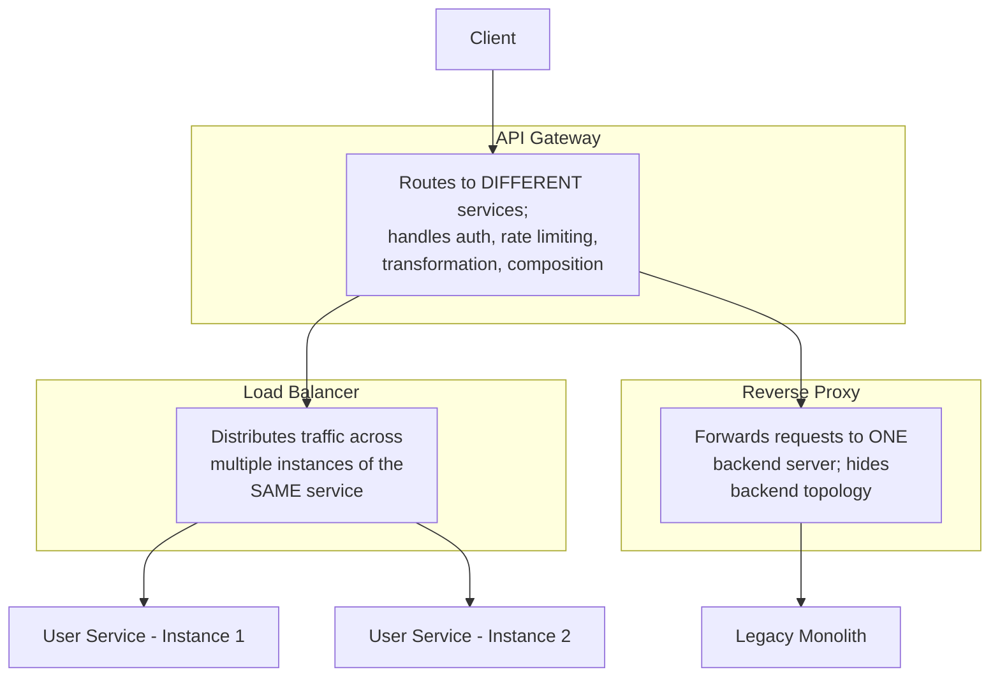

| Feature                 | Load Balancer                       | Reverse Proxy                 | API Gateway                                         |
| ----------------------- | ----------------------------------- | ----------------------------- | --------------------------------------------------- |
| **Primary role**        | Distribute traffic across instances | Forward requests, hide origin | Route to different services, cross-cutting concerns |
| **Routing granularity** | Instance-level (same service)       | Single backend                | Service/endpoint-level (multiple services)          |
| **Protocol handled**    | TCP, HTTP, UDP                      | HTTP, TCP                     | HTTP, WebSocket, gRPC                               |
| **Authentication**      | Rarely                              | Sometimes                     | Core feature                                        |
| **Rate limiting**       | Connection-level                    | Sometimes                     | Core feature                                        |
| **Transformation**      | No                                  | Header manipulation           | Full request/response transformation                |
| **API composition**     | No                                  | No                            | Yes                                                 |
| **Service discovery**   | Static or basic health checks       | Static                        | Dynamic (Consul, Kubernetes, DNS)                   |
| **Examples**            | HAProxy, AWS ELB, NGINX (stream)    | NGINX, Apache httpd           | Kong, Envoy, AWS API Gateway, Traefik               |

**Key distinction:** A load balancer spreads load for one service across many instances. A reverse proxy sits in front of one backend. An API gateway routes to _different_ backend services based on the request and adds intelligence at the edge.

---

## Gateway Solutions Comparison

| Feature               | Kong                                 | NGINX                                   | Traefik                                  | AWS API Gateway              | Envoy                             | Express Gateway                   |
| --------------------- | ------------------------------------ | --------------------------------------- | ---------------------------------------- | ---------------------------- | --------------------------------- | --------------------------------- |
| **Type**              | API Gateway                          | Web server / Reverse proxy              | Cloud-native reverse proxy               | Managed API Gateway          | L7 Proxy / Service mesh           | API Gateway framework             |
| **License**           | Apache 2.0 (OSS)                     | Open-source (nginx) / Plus (paid)       | MIT                                      | Managed service              | Apache 2.0                        | Apache 2.0                        |
| **Configuration**     | Declarative (YAML/JSON), Admin API   | `nginx.conf` (text)                     | Dynamic (labels, CRDs, providers)        | Console, CloudFormation, SDK | xDS APIs (dynamic)                | YAML config files                 |
| **Plugin ecosystem**  | ✅ 200+ plugins, Lua/Go/JS           | Limited (nginx modules)                 | Middleware system                        | AWS integrations             | Filters (C++, WASM, Lua)          | Node.js middleware                |
| **Service discovery** | DNS, Consul, Kubernetes              | DNS, Plus (paid)                        | Docker, K8s, Consul, etcd, ZooKeeper     | N/A (managed)                | xDS (EDS)                         | Static endpoints                  |
| **gRPC support**      | ✅ (via plugin)                      | ✅ (via module)                         | ✅ (native)                              | ❌ (REST only)               | ✅ (first-class)                  | ❌                                |
| **WebSocket**         | ✅                                   | ✅                                      | ✅                                       | ✅ (API Gateway V2)          | ✅                                | ✅                                |
| **Rate limiting**     | ✅ (multiple algorithms)             | ✅ (limit_req, limit_conn)              | ✅ (RateLimit middleware)                | ✅ (usage plans, API keys)   | ✅ (local & global)               | ✅ (built-in policy)              |
| **Clustering**        | ✅ (Postgres/Cassandra)              | Plus only                               | ✅ (distributed Let's Encrypt, KV store) | Managed                      | ✅ (xDS control plane)            | ❌ (single node)                  |
| **Learning curve**    | Medium                               | Low (simple) / High (advanced)          | Low                                      | Low                          | High                              | Low                               |
| **Best for**          | API management, multi-team platforms | Simple routing, static content, ingress | Kubernetes ingress, Docker               | Serverless, AWS ecosystem    | Service mesh, high-scale L7 proxy | Node.js projects, simple gateways |

---

## Kong Deep Dive 🦍

Kong is one of the most popular open-source API gateways. It runs on top of OpenResty (NGINX + LuaJIT), giving it NGINX's battle-tested performance with Lua's extensibility.

### Architecture

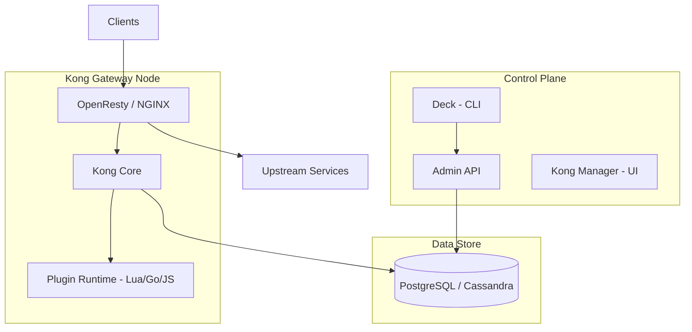

### Key Concepts

| Concept      | Description                                                                                     |
| ------------ | ----------------------------------------------------------------------------------------------- |
| **Service**  | A logical abstraction of an upstream API or microservice (URL + optional path/host/port config) |
| **Route**    | A path (or host/header/method) matching rule that directs traffic to a Service                  |
| **Upstream** | A virtual hostname representing a set of backend targets with optional health checking          |
| **Target**   | An IP address or hostname with a port that receives proxied traffic                             |
| **Consumer** | An entity that consumes the API — often a developer or application with an API key              |
| **Plugin**   | Modular components that add functionality to routes, services, or consumers                     |

### Kong in DB-less (Declarative) Mode

For infrastructure-as-code and Kubernetes-native deployments, Kong can run without a database, loading configuration from a YAML/JSON file.

```yaml
# kong.yml — declarative configuration
_format_version: '3.0'

services:
  - name: user-service
    url: http://user-service.namespace.svc.cluster.local:3000
    connect_timeout: 5000
    read_timeout: 10000
    retries: 3
    routes:
      - name: user-routes
        paths:
          - /api/users
        strip_path: true
        methods:
          - GET
          - POST
          - PUT
          - DELETE
    plugins:
      - name: jwt
      - name: rate-limiting
        config:
          minute: 200
          policy: redis
          redis_host: redis.kong.svc.cluster.local
          redis_port: 6379
      - name: request-transformer
        config:
          add:
            headers:
              - 'X-Gateway:Kong'
      - name: cors
        config:
          origins:
            - 'https://myapp.example.com'
          methods:
            - GET
            - POST
            - PUT
            - DELETE

  - name: order-service
    url: http://order-service.namespace.svc.cluster.local:3001
    routes:
      - name: order-routes
        paths:
          - /api/orders
    plugins:
      - name: oauth2
        config:
          scopes:
            - read:orders
            - write:orders
          mandatory_scope: true
```

### Kong Custom Plugin (Lua)

```lua
-- kong/plugins/custom-logger/handler.lua
local BasePlugin = require "kong.plugins.base_plugin"
local cjson = require "cjson"

local CustomLoggerHandler = BasePlugin:extend()

function CustomLoggerHandler:new()
  CustomLoggerHandler.super.new(self, "custom-logger")
end

function CustomLoggerHandler:access(conf)
  CustomLoggerHandler.super.access(self)

  -- Inject custom header
  kong.service.request.set_header("X-Trace-Id", kong.request.get_id())

  -- Block requests from specific IP ranges
  local client_ip = kong.client.get_forwarded_ip()
  if conf.blocked_ips and conf.blocked_ips[client_ip] then
    return kong.response.exit(403, { message = "IP blocked" })
  end
end

function CustomLoggerHandler:log(conf)
  CustomLoggerHandler.super.log(self)

  local log_entry = {
    request_id = kong.request.get_id(),
    client_ip = kong.client.get_forwarded_ip(),
    method = kong.request.get_method(),
    path = kong.request.get_path(),
    latency_proxy = kong.latency.proxy,   -- ms waiting for upstream
    latency_kong = kong.latency.kong,      -- ms in Kong itself
    status = kong.response.get_status(),
    consumer = kong.client.get_credential() and kong.client.get_consumer().username,
  }

  kong.log.notice(cjson.encode(log_entry))
end

return CustomLoggerHandler
```

### Kong Performance

Kong runs on OpenResty, which handles ~30,000–50,000 requests/second on modest hardware. Performance tips:

- Use DB-less mode where possible (no database round-trip per request)
- Use Redis-backed rate limiting for cluster consistency
- Disable plugins per-route (only enable what's needed)
- Tune NGINX worker count and connections via environment variables

---

## Envoy & Service Mesh 🕸️

Envoy is a high-performance L7 proxy originally built by Lyft, now a CNCF graduated project. Unlike Kong (API management focus), Envoy is designed as a data plane for service meshes — though it also functions as an edge gateway.

### Envoy as Edge Gateway

```yaml
# envoy.yaml — edge proxy configuration
static_resources:
  listeners:
    - name: listener_0
      address:
        socket_address: { address: 0.0.0.0, port_value: 10000 }
      filter_chains:
        - filters:
            - name: envoy.filters.network.http_connection_manager
              typed_config:
                '@type': type.googleapis.com/envoy.extensions.filters.network.http_connection_manager.v3.HttpConnectionManager
                stat_prefix: ingress_http
                route_config:
                  name: local_route
                  virtual_hosts:
                    - name: backend
                      domains: ['*']
                      routes:
                        - match:
                            prefix: '/api/users'
                          route:
                            cluster: user_service
                            prefix_rewrite: '/'
                        - match:
                            prefix: '/api/orders'
                          route:
                            cluster: order_service
                            prefix_rewrite: '/'
                http_filters:
                  - name: envoy.filters.http.jwt_authn
                    typed_config:
                      '@type': type.googleapis.com/envoy.extensions.filters.http.jwt_authn.v3.JwtAuthentication
                      providers:
                        my_provider:
                          issuer: 'my-auth-server'
                          audiences:
                            - 'my-api'
                          from_headers:
                            - name: Authorization
                              value_prefix: 'Bearer '
                          remote_jwks:
                            http_uri:
                              uri: https://auth.example.com/.well-known/jwks.json
                              cluster: auth_cluster
                              timeout: 5s
                            cache_duration: 300s
                      rules:
                        - match:
                            prefix: '/api/'
                          requires:
                            provider_name: 'my_provider'
                  - name: envoy.filters.http.router
                    typed_config:
                      '@type': type.googleapis.com/envoy.extensions.filters.http.router.v3.Router

  clusters:
    - name: user_service
      connect_timeout: 3s
      type: STRICT_DNS
      lb_policy: ROUND_ROBIN
      load_assignment:
        cluster_name: user_service
        endpoints:
          - lb_endpoints:
              - endpoint:
                  address:
                    socket_address: { address: user-service, port_value: 3000 }
      circuit_breakers:
        thresholds:
          - priority: DEFAULT
            max_connections: 100
            max_pending_requests: 50
            max_requests: 200
            max_retries: 3

    - name: order_service
      connect_timeout: 3s
      type: STRICT_DNS
      lb_policy: ROUND_ROBIN
      load_assignment:
        cluster_name: order_service
        endpoints:
          - lb_endpoints:
              - endpoint:
                  address:
                    socket_address: { address: order-service, port_value: 3001 }

    - name: auth_cluster
      connect_timeout: 3s
      type: STRICT_DNS
      lb_policy: ROUND_ROBIN
      load_assignment:
        cluster_name: auth_cluster
        endpoints:
          - lb_endpoints:
              - endpoint:
                  address:
                    socket_address: { address: auth.example.com, port_value: 443 }
      transport_socket:
        name: envoy.transport_sockets.tls
```

### Service Mesh Architecture

A service mesh uses a sidecar proxy (usually Envoy) alongside every service instance. Together, the proxies form the **data plane** — every inter-service call flows through them. A **control plane** (Istio, Linkerd, Consul Connect) configures the proxies.

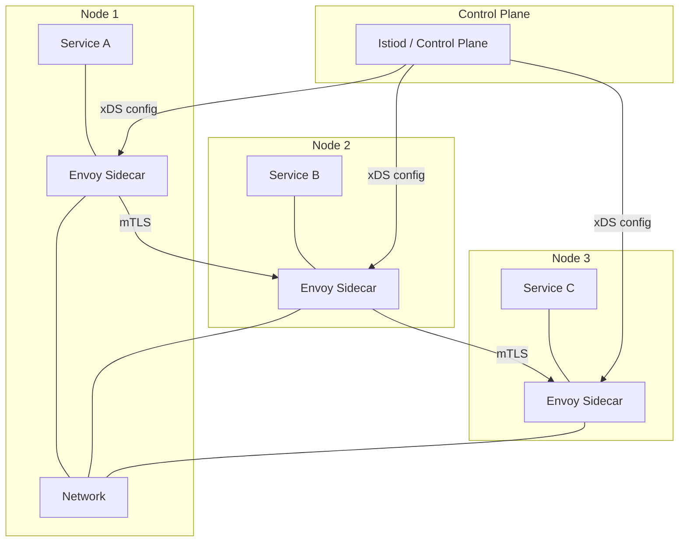

**Gateway in a mesh:** The same Envoy proxy serves as both the sidecar for inter-service traffic AND the edge gateway for external ingress. This unifies the configuration and observability model.

| Aspect             | API Gateway (Edge)                        | Service Mesh Sidecar                       |
| ------------------ | ----------------------------------------- | ------------------------------------------ |
| **Scope**          | North-south traffic (external ↔ internal) | East-west traffic (service ↔ service)      |
| **Authentication** | End-user (JWT, OAuth, API keys)           | Workload identity (mTLS, SPIFFE)           |
| **Rate limiting**  | Per consumer / API key                    | Per service / instance                     |
| **Resilience**     | Circuit breaking at edge                  | Circuit breaking between services          |
| **Tool**           | Kong, AWS API Gateway, NGINX              | Envoy (via Istio, Linkerd, Consul Connect) |

---

## Gateway Deployment Patterns

### Pattern 1: Edge Gateway Only

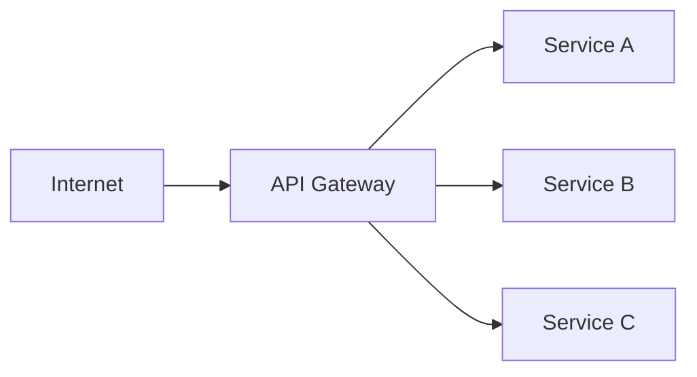

Simplest setup. All external traffic hits the gateway; internal service-to-service calls are direct.

### Pattern 2: Edge Gateway + Service Mesh

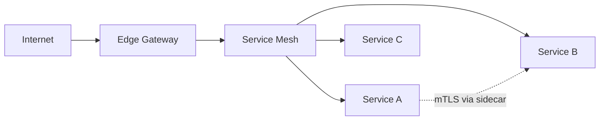

External traffic enters through the edge gateway; internal traffic flows through the mesh with mTLS and fine-grained policies.

### Pattern 3: BFF Gateway

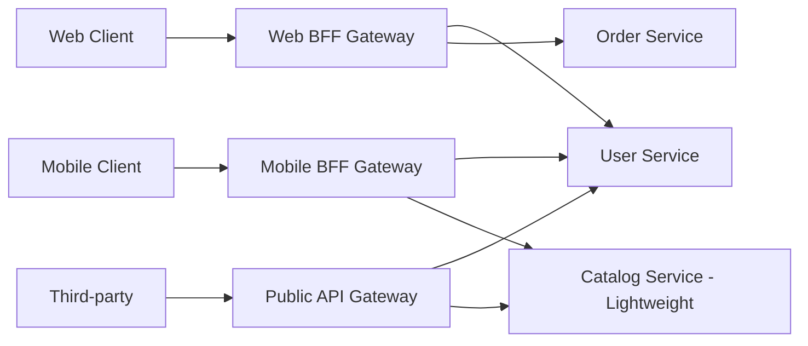

Separate gateways for different client types, each tailored to that client's specific data needs.

---

## Best Practices

### 1. Keep the Gateway Thin

Resist the temptation to put business logic in the gateway. It should handle cross-cutting infrastructure concerns — not domain rules. Business logic belongs in services.

**✅ Gateway responsibilities:**

- Authentication and token validation
- Rate limiting and throttling
- Request routing and load balancing
- Header manipulation
- TLS termination
- Observability (logging, metrics, tracing)

**❌ NOT gateway responsibilities:**

- Order validation rules
- Discount calculation
- Inventory allocation
- Complex data transformations

### 2. Avoid Gateway Coupling

Services should NOT know about the gateway. They should work identically whether called directly or through the gateway. Avoid injecting gateway-specific headers or tokens into service logic.

### 3. Use Correlation IDs

Generate a unique ID at the gateway for every request and propagate it to every downstream call. This enables distributed tracing.

```typescript
// At the gateway
const correlationId = uuidv4();
req.headers['x-correlation-id'] = correlationId;

// Propagate to downstream calls
axios.get('http://user-service/users', {
  headers: { 'X-Correlation-ID': correlationId },
});
```

### 4. Handle Timeouts at Every Layer

- **Gateway → Client:** Set reasonable connection and read timeouts
- **Gateway → Service:** Configure per-service timeouts (shorter than client timeout)
- **Service → Service:** Use circuit breakers with timeouts

```yaml
# Example: layered timeouts
# Client timeout: 10s
# Gateway proxy timeout: 8s
# Service processing timeout: 5s
# Circuit breaker trip: 3 consecutive timeouts
```

### 5. Plan for Gateway Failure

The gateway is a single point of failure. Mitigate with:

- **Multiple gateway instances** behind a load balancer
- **Health checks** with fast failure detection
- **Graceful degradation** — if a plugin breaks, fail open or closed per policy
- **Stateless gateways** — store state externally (Redis, PostgreSQL) so any instance can handle any request

### 6. Version Your Gateway Configuration

Treat gateway config as code. Version it in Git, test changes in staging, deploy via CI/CD.

```bash
# Kong decK — sync config to gateway
deck sync --state kong.yml --kong-addr http://localhost:8001

# Validate before applying
deck validate -s kong.yml
```

---

## Security at the Gateway

| Layer              | Threat                          | Mitigation                                                     |
| ------------------ | ------------------------------- | -------------------------------------------------------------- |
| **Transport**      | Eavesdropping, MITM             | TLS termination at gateway, HSTS headers                       |
| **Authentication** | Impersonation, credential theft | JWT validation, API key rotation, OAuth2 token introspection   |
| **Injection**      | SQLi, XSS, command injection    | Request validation, body size limits, content-type enforcement |
| **DDoS**           | Volumetric attacks              | Rate limiting, IP reputation, WAF rules, CDN                   |
| **Data exposure**  | Sensitive data in responses     | Response filtering, strip internal headers                     |
| **Reconnaissance** | API probing, schema discovery   | Rate limit unknown routes, obfuscate error messages            |

**Hardening checklist:**

```typescript
import helmet from 'helmet';
import hpp from 'hpp';
import cors from 'cors';
import rateLimit from 'express-rate-limit';

// Security middleware stack for a custom gateway
gatewayApp.use(helmet()); // Secure HTTP headers
gatewayApp.use(hpp()); // HTTP parameter pollution protection
gatewayApp.use(
  cors({
    // Strict CORS
    origin: process.env.ALLOWED_ORIGINS?.split(','),
    credentials: true,
  }),
);
gatewayApp.use(
  rateLimit({
    // Global rate limit
    windowMs: 60_000,
    max: 1000,
  }),
);

// Body size limits prevent large payload attacks
gatewayApp.use(express.json({ limit: '1mb' }));
gatewayApp.use(express.urlencoded({ limit: '1mb', extended: false }));

// Never expose server information
gatewayApp.disable('x-powered-by');
```

---

## Troubleshooting Common Issues

| Symptom                   | Likely Cause                                      | Fix                                                                  |
| ------------------------- | ------------------------------------------------- | -------------------------------------------------------------------- |
| `502 Bad Gateway`         | Upstream service unreachable or crashed           | Check upstream health, DNS resolution, network policies              |
| `504 Gateway Timeout`     | Upstream took too long to respond                 | Increase proxy timeout or optimize downstream service                |
| `429 Too Many Requests`   | Client exceeded rate limit                        | Check consumer quotas, adjust limits, verify Redis (if cluster mode) |
| Intermittent `503`        | Circuit breaker open due to cascading failures    | Investigate downstream, check timeout configurations                 |
| `CORS` errors in browser  | Gateway not handling preflight or missing headers | Enable CORS plugin, verify `Access-Control-Allow-Origin`             |
| Stale routes after deploy | Gateway caching old service discovery data        | Reduce DNS TTL, restart gateway, use dynamic service discovery       |

---

## Express Gateway — A Quick Start

Express Gateway is a Node.js-based API gateway built on Express. It's YAML-configured and extensible via plugins.

```yaml
# config/gateway.config.yml
http:
  port: 8080

apiEndpoints:
  api:
    host: 'api.mydomain.com'
    paths: '/api/*'

serviceEndpoints:
  userService:
    url: 'http://localhost:3000'
  orderService:
    url: 'http://localhost:3001'

policies:
  - jwt
  - rate-limit
  - proxy
  - cors

pipelines:
  - name: default
    apiEndpoints:
      - api
    policies:
      - cors:
      - jwt:
          - action:
              secretOrPublicKey: 'supersecret'
      - rate-limit:
          - action:
              max: 50
              windowMs: 60000
      - proxy:
          - action:
              serviceEndpoint: userService
              changeOrigin: true
```

---

## Decision Flow: Choosing a Gateway

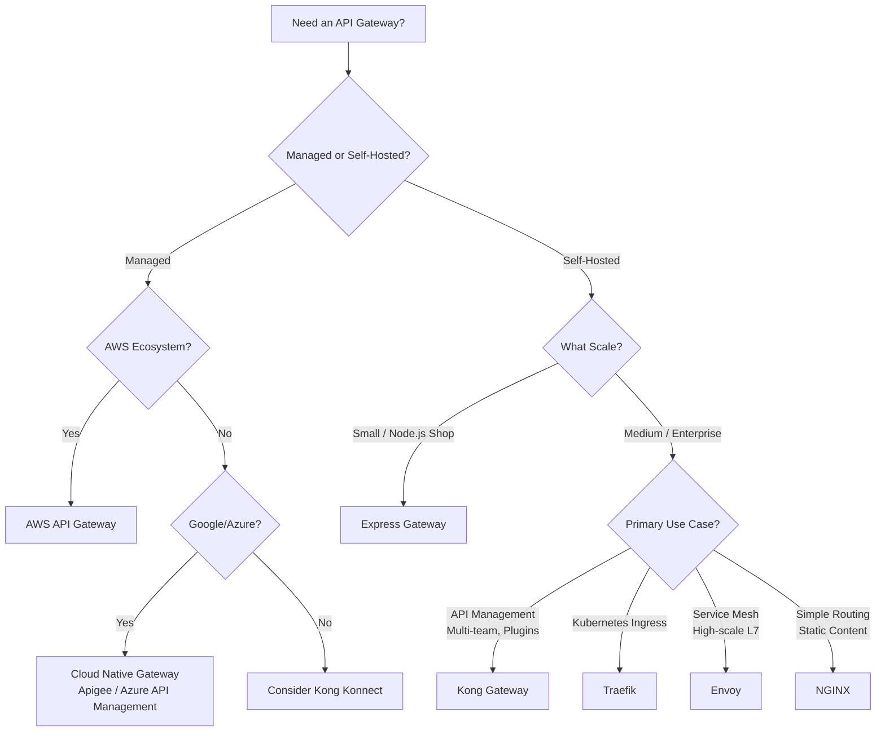

---

## Code Example: Building a Minimal API Gateway in Node.js

Here's a lightweight, production-inspired gateway using Express with middleware for auth, rate limiting, circuit breaking, and observability — in under 200 lines.

```typescript
// minimal-gateway.ts
import express, { Request, Response, NextFunction } from 'express';
import { createProxyMiddleware, Options } from 'http-proxy-middleware';
import jwt from 'jsonwebtoken';
import { v4 as uuidv4 } from 'uuid';
import { createClient } from 'redis';

// ─── Configuration ───────────────────────────────────
const SERVICES: Record<string, string> = {
  users: 'http://localhost:3001',
  orders: 'http://localhost:3002',
  inventory: 'http://localhost:3003',
};

const JWT_SECRET = process.env.JWT_SECRET || 'dev-secret';
const REDIS_URL = process.env.REDIS_URL || 'redis://localhost:6379';

// ─── Redis Client ────────────────────────────────────
const redis = createClient({ url: REDIS_URL });
redis.connect().catch(console.error);

// ─── Express App ─────────────────────────────────────
const app = express();
app.use(express.json());

// ─── Correlation ID ─────────────────────────────────
app.use((req: Request, _res: Response, next: NextFunction) => {
  (req as any).correlationId = (req.headers['x-correlation-id'] as string) || uuidv4();
  next();
});

// ─── JWT Authentication ──────────────────────────────
function authenticate(req: Request, res: Response, next: NextFunction): void {
  // Skip auth for health endpoint
  if (req.path === '/health' || req.path === '/metrics') {
    return next();
  }

  const header = req.headers.authorization;
  if (!header?.startsWith('Bearer ')) {
    res.status(401).json({ error: 'Missing Bearer token' });
    return;
  }

  try {
    const payload = jwt.verify(header.split(' ')[1], JWT_SECRET) as { sub: string };
    (req as any).userId = payload.sub;
    next();
  } catch {
    res.status(401).json({ error: 'Invalid or expired token' });
  }
}

// ─── Sliding Window Rate Limiter ─────────────────────
function rateLimiter(windowMs: number, maxRequests: number) {
  return async (req: Request, res: Response, next: NextFunction): Promise<void> => {
    const key = `rl:${req.ip}:${req.path}`;
    const now = Date.now();
    const windowStart = now - windowMs;

    const multi = redis.multi();
    multi.zAdd(key, { score: now, value: `${now}-${Math.random()}` });
    multi.zRemRangeByScore(key, 0, windowStart);
    multi.zCard(key);
    multi.expire(key, Math.ceil(windowMs / 1000));

    const [, , count] = (await multi.exec()) as [unknown, unknown, number];

    res.setHeader('X-RateLimit-Limit', maxRequests);
    res.setHeader('X-RateLimit-Remaining', Math.max(0, maxRequests - count));

    if (count > maxRequests) {
      res.status(429).json({ error: 'Too many requests', retryAfter: Math.ceil(windowMs / 1000) });
      return;
    }

    next();
  };
}

// ─── Service Proxy Factory ───────────────────────────
function createServiceProxy(serviceUrl: string): ReturnType<typeof createProxyMiddleware> {
  const options: Options = {
    target: serviceUrl,
    changeOrigin: true,
    onProxyReq: (proxyReq, req, _res) => {
      // Propagate correlation ID
      proxyReq.setHeader('X-Correlation-ID', (req as any).correlationId);
      // Propagate authenticated user
      if ((req as any).userId) {
        proxyReq.setHeader('X-User-ID', (req as any).userId);
      }
    },
    onProxyRes: (proxyRes, req, res) => {
      // Add gateway metadata
      proxyRes.headers['x-gateway'] = 'minimal-gateway';
      proxyRes.headers['x-correlation-id'] = (req as any).correlationId;
    },
    onError: (err, req, res) => {
      console.error(`Proxy error for ${(req as any).url}:`, err.message);
      (res as Response).status(502).json({
        error: 'Bad Gateway',
        message: 'Upstream service unavailable',
        correlationId: (req as any).correlationId,
      });
    },
    timeout: 5000,
    proxyTimeout: 5000,
  };

  return createProxyMiddleware(options);
}

// ─── Register Routes ─────────────────────────────────
app.use('/api/users', authenticate, rateLimiter(60_000, 100), createServiceProxy(SERVICES.users));
app.use('/api/orders', authenticate, rateLimiter(60_000, 50), createServiceProxy(SERVICES.orders));
app.use(
  '/api/inventory',
  authenticate,
  rateLimiter(60_000, 200),
  createServiceProxy(SERVICES.inventory),
);

// ─── Health & Metrics Endpoints ──────────────────────
app.get('/health', async (_req: Request, res: Response) => {
  const checks = await Promise.all(
    Object.entries(SERVICES).map(async ([name, url]) => {
      const start = Date.now();
      try {
        await fetch(`${url}/health`, { signal: AbortSignal.timeout(2000) });
        return { service: name, healthy: true, latencyMs: Date.now() - start };
      } catch {
        return { service: name, healthy: false, latencyMs: Date.now() - start };
      }
    }),
  );

  const allHealthy = checks.every((c) => c.healthy);
  res.status(allHealthy ? 200 : 503).json({
    status: allHealthy ? 'healthy' : 'degraded',
    services: checks,
  });
});

// ─── Start ───────────────────────────────────────────
const PORT = process.env.PORT || 8080;
app.listen(PORT, () => {
  console.log(`API Gateway listening on port ${PORT}`);
});

export default app;
```

---

## Summary

The API gateway is the control point at the edge of your system. It unifies authentication, throttling, routing, and observability into a single layer — letting backend services stay lean and focused. Choose your gateway based on your ecosystem (Kong for API management, Envoy for service mesh, Traefik for Kubernetes, AWS API Gateway for serverless), keep it thin, and treat its configuration as production infrastructure code.

[← Back to Backend Engineering](../README.md) · © sparshjaswal
