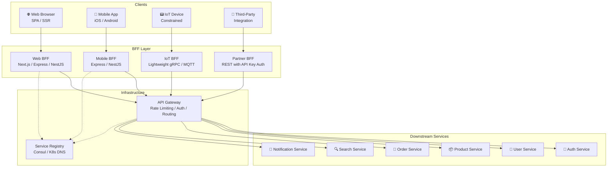
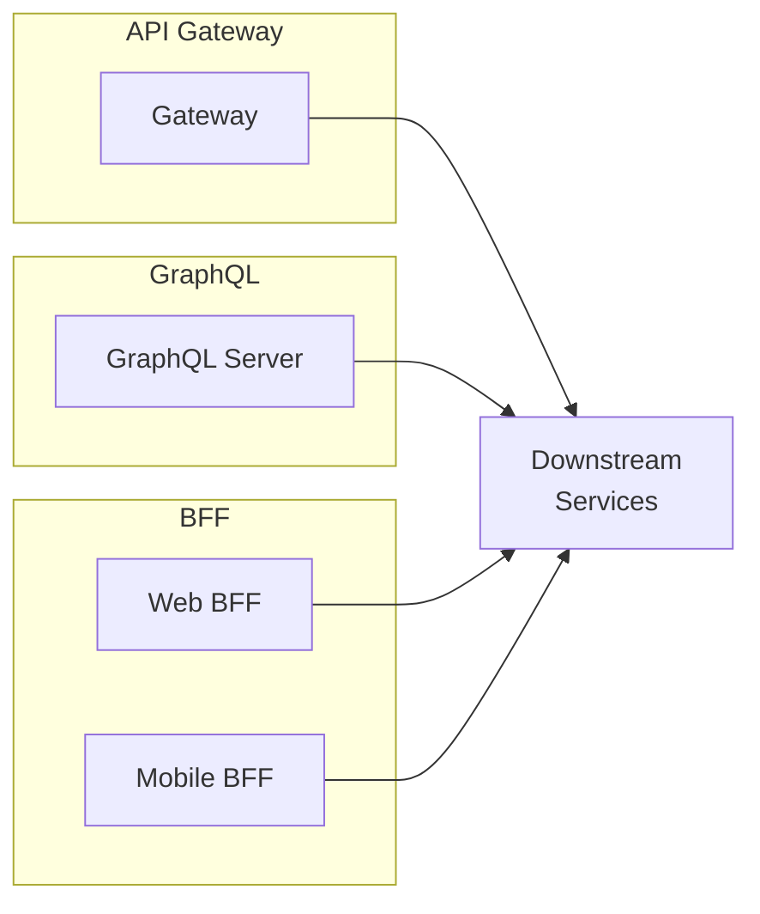
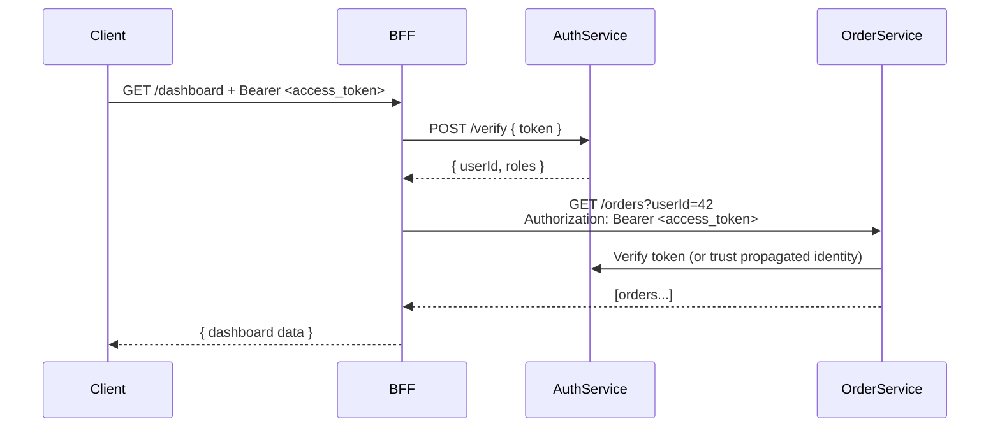
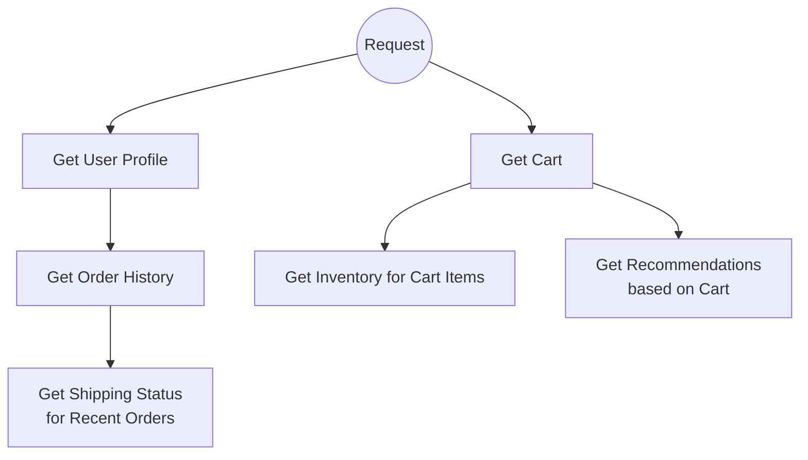

# BFF (Backend for Frontend) 🎯

The BFF pattern introduces a dedicated backend layer for each client type — mobile, web, IoT, or third-party integrations — that sits between the client and downstream microservices. Each BFF is purpose-built: it knows exactly what data that specific client needs, how to fetch it efficiently, and how to shape the response for that client's UI.

> _One-size-fits-all APIs force every client to carry the complexity. BFF puts that complexity back on the server, where it belongs — and tailors it per client._

---

## The Problem BFF Solves

In a microservices architecture, clients often need data from multiple services to render a single screen. Without BFF, clients face several problems:

| Problem | Without BFF | With BFF |
| --- | --- | --- |
| **Over-fetching** | Mobile receives 60 fields for a list view that only needs 6 | BFF strips unused fields before sending to mobile |
| **Under-fetching** | Client makes 5–8 round-trips to different services for one screen | BFF aggregates into 1 request |
| **Chatty clients** | High-latency mobile networks amplify round-trip cost | BFF reduces calls; client pays one network round-trip |
| **Protocol mismatch** | Mobile wants compact binary; service speaks verbose JSON | BFF translates protocols per client |
| **Client-side logic bloat** | Data transformation, merging, and error handling live in the app | All orchestration lives in the BFF |
| **Tight coupling** | Every client embeds knowledge of every service endpoint | Clients know only their BFF contract |
| **Versioning pain** | Changing a downstream service breaks all clients | BFF absorbs the change; client contract stays stable |

---

## Architecture



> **Note:** In some architectures, the BFF itself handles authentication and directly calls services via service discovery — bypassing an API gateway for internal east-west traffic. Both patterns are valid; the diagram above shows one common layout.

---

## BFF Responsibilities

A BFF is not a simple proxy. It owns the **orchestration layer** for its client:

### 1. Data Aggregation

Combine responses from multiple downstream services into a single, coherent response tailored to the screen the client is rendering.

```
Client requests: GET /dashboard
BFF internally calls:
  → GET user-service:/users/me              (profile)
  → GET order-service:/orders?status=active (active orders)
  → GET notif-service:/notifications/unread (unread count)
Response to client: { user, activeOrders, unreadNotifications }
```

### 2. Data Transformation

Reshape, rename, and restructure data so the client receives exactly the shape its UI needs — no mapping logic on the client side.

```typescript
// Downstream User Service returns:
{ id: 42, first_name: "Alice", last_name: "Kim", email: "alice@example.com", ...(extraneous 20 fields) }

// Mobile BFF transforms to:
{ id: 42, displayName: "Alice K.", initials: "AK" }
```

### 3. Protocol Translation

Clients may speak different protocols than downstream services. A BFF bridges that gap:

| Client → BFF | BFF → Services |
| --- | --- |
| REST (JSON) | gRPC |
| GraphQL | REST |
| WebSocket | REST + Redis Pub/Sub |
| MQTT (IoT) | gRPC / REST |
| Binary (protobuf) | REST (JSON) |

### 4. Response Stripping & Field Selection

The web BFF might return 40 fields for a rich admin dashboard, while the mobile BFF returns only 8 fields for the same logical resource — dramatically reducing payload size over cellular networks.

### 5. Client-Specific Auth & Session Management

- **Web BFF**: Cookie-based sessions with CSRF protection
- **Mobile BFF**: Bearer token with refresh token rotation
- **IoT BFF**: mTLS with client certificates
- **Partner BFF**: API key + HMAC request signing

### 6. Error Normalization

Each downstream service may return errors in its own format. The BFF normalizes them into a consistent structure the client expects:

```typescript
// Order Service returns:
{ error: "OUT_OF_STOCK", itemId: "sku-123" }

// User Service returns:
{ status: 404, message: "User not found", code: "ENTITY_NOT_FOUND" }

// BFF normalizes both to:
{
  error: {
    code: "DOWNSTREAM_ERROR",
    message: "Unable to load dashboard. Some services are unavailable.",
    details: [
      { service: "orders", reason: "Item SKU-123 is out of stock" },
      { service: "users", reason: "User profile not found" }
    ]
  }
}
```

---

## Per-Client BFF Types

### Web BFF

The web BFF serves browser-based SPAs (React, Vue, Angular) and server-rendered apps (Next.js, Nuxt).

**Characteristics:**
- Returns rich, fully-hydrated JSON payloads
- Cookie-based session handling (HttpOnly, Secure, SameSite)
- CSRF token management
- SSR support — can pre-fetch data on the server before rendering
- Often colocated with the web server (Next.js API routes, Express middleware)

**Typical tech stack:** Next.js API routes, Express, NestJS, Fastify

```typescript
// Web BFF endpoint for a product detail page
// Next.js App Router — Route Handler
// app/api/products/[id]/route.ts
export async function GET(
  request: Request,
  { params }: { params: { id: string } }
) {
  const session = await getServerSession(authOptions);
  if (!session) return Response.json({ error: 'Unauthorized' }, { status: 401 });

  const [product, reviews, recommendations] = await Promise.all([
    fetch(`http://product-service/products/${params.id}`),
    fetch(`http://review-service/products/${params.id}/reviews?limit=10`),
    fetch(`http://rec-service/products/${params.id}/similar?limit=4`),
  ].map(p => p.then(r => r.json())));

  return Response.json({
    product,
    reviews: reviews.data,
    recommendations: recommendations.data,
    // Web-specific: include SEO metadata
    seo: {
      title: product.name,
      description: product.shortDescription,
      ogImage: product.images[0],
    },
  });
}
```

### Mobile BFF

The mobile BFF optimizes for constrained environments: high-latency cellular networks, limited bandwidth, and battery-conscious applications.

**Characteristics:**
- **Payload minimization** — strip every unused field; every byte matters
- **Batched endpoints** — one request per screen, not per widget
- **Delta/partial updates** — send only what changed (e.g., via `If-Modified-Since` or ETags)
- **Offline-first** — include `lastModified` timestamps for client-side caching
- **Image resizing hints** — return CDN URLs with size parameters
- **Binary protocol support** — protobuf or MessagePack for extreme efficiency

```typescript
// Mobile BFF — stripped-down product endpoint
// Returns ~200 bytes vs ~8 KB from the full service

interface MobileProductDTO {
  id: string;
  title: string;
  price: string;          // Pre-formatted: "$29.99"
  thumb: string;          // 120×120 thumbnail URL
  inStock: boolean;
  rating: number;         // 4.5 (not the full breakdown)
}

app.get('/api/mobile/products/:id', async (req, res) => {
  const product = await productService.get(req.params.id);

  const mobileResponse: MobileProductDTO = {
    id: product.id,
    title: product.name,
    price: formatCurrency(product.price, product.currency),
    thumb: `${CDN_URL}/products/${product.id}?w=120&h=120&fit=crop`,
    inStock: product.inventory.available > 0,
    rating: product.reviews.averageRating,
  };

  res.json(mobileResponse);
});
```

### IoT BFF

IoT devices often have severe constraints: limited RAM (kilobytes), narrow bandwidth (kilobits/sec), and intermittent connectivity.

**Characteristics:**
- Compact binary protocols (protobuf, CBOR, MessagePack)
- MQTT or CoAP for transport (not HTTP)
- Register device-specific data contracts
- Handle device wake/sleep cycles
- Edge computing — run part of the BFF on the edge near the device

### Partner / Third-Party BFF

When exposing APIs to external partners, a dedicated BFF provides a stable, versioned, and well-documented contract that insulates partners from internal service changes.

**Characteristics:**
- Strict versioning (`/v1/`, `/v2/`)
- API key or OAuth2 Client Credentials authentication
- Rate limiting per partner
- Detailed API documentation (OpenAPI spec published)
- Webhook orchestration
- SLA monitoring and usage billing

---

## BFF vs API Gateway vs GraphQL

These three patterns are often confused. Here's how they compare:



| Criteria | API Gateway | BFF | GraphQL |
| --- | --- | --- | --- |
| **Purpose** | Single entry point, cross-cutting concerns | Tailored API per client | Flexible query language |
| **How many?** | One per system | One per client type (web, mobile, IoT...) | One (or federated) |
| **Client specificity** | Generic — all clients share the same API | High — each BFF is client-specific | Medium — clients control what they query |
| **Data shape control** | Service decides | BFF decides | Client decides |
| **Cross-cutting** | Auth, rate limiting, TLS, logging | Auth, aggregation, transformation, caching | Auth, query validation, depth limiting |
| **N+1 problem** | Upstream (gateway calls services sequentially or in parallel) | Controlled internally by BFF | Classic N+1 resolved with DataLoader |
| **Over-fetching** | Yes — fixed responses from services | No — BFF strips unused fields | No — client asks for exact fields |
| **Complexity** | Low — mostly routing | Medium — per-client codebase | Medium–High — schema design, resolver optimization, security |
| **Best for** | Routing, rate limiting, initial setup | Teams with distinct client needs | Data-rich apps with deeply nested entities |

### Decision Framework

```
Do you have multiple client types (web, mobile, IoT) with different data needs?
│
├── NO → Do you need flexible queries where clients pick fields?
│         ├── YES → GraphQL
│         └── NO  → Simple REST API (no BFF or Gateway complexity needed)
│
└── YES → Do clients need to aggregate data from 3+ services per screen?
          ├── YES → BFF per client type + API Gateway for cross-cutting
          └── NO  → API Gateway alone may suffice
```

### They Work Together

These patterns are not mutually exclusive. A mature architecture often layers them:

```
[Web Client] → [Web BFF] → [API Gateway] → [Downstream Services]
[Mobile App] → [Mobile BFF] ──┘
```

The API Gateway handles cross-cutting concerns (auth, rate limiting, TLS, logging); each BFF handles client-specific aggregation, transformation, and protocol translation.

---

## BFF Implementation

### Express BFF

Express is the most common choice for lightweight BFF implementations. Its middleware model maps naturally to BFF concerns:

```typescript
// express-bff/src/server.ts
import express from 'express';
import cors from 'cors';
import cookieParser from 'cookie-parser';
import { createProxyMiddleware } from 'http-proxy-middleware';
import { authenticate } from './middleware/auth';
import { circuitBreaker } from './middleware/circuitBreaker';
import { cache } from './middleware/cache';

const app = express();

app.use(cors({ origin: process.env.WEB_APP_ORIGIN, credentials: true }));
app.use(cookieParser());
app.use(express.json());

// ---- Auth middleware ----
app.use('/api/*', authenticate);

// ---- Dashboard endpoint (aggregation) ----
app.get('/api/dashboard', cache({ ttl: 30 }), async (req, res, next) => {
  try {
    const userId = req.user!.id;

    // Parallel aggregation of independent calls
    const [profile, activeOrders, notifications, recommendations] =
      await Promise.allSettled([
        userService.getProfile(userId),
        orderService.getActiveOrders(userId),
        notificationService.getUnreadCount(userId),
        recommendationService.getForUser(userId),
      ]);

    // Graceful degradation: partial data is better than no data
    res.json({
      profile:     getValue(profile),
      activeOrders: getValue(activeOrders, []),
      unreadNotifications: getValue(notifications, 0),
      recommendations:    getValue(recommendations, []),
      degraded: getDegradedFields({ profile, activeOrders, notifications, recommendations }),
    });
  } catch (err) {
    next(err);
  }
});

// ---- Product detail with downstream BFF aggregation ----
app.get('/api/products/:id', async (req, res) => {
  const { id } = req.params;

  // Sequential + parallel hybrid:
  // Step 1: Fetch product (needed for step 2)
  const product = await productService.getById(id);

  // Step 2: Fetch related data in parallel (all depend on product)
  const [reviews, inventory, relatedProducts] = await Promise.all([
    reviewService.getForProduct(id, { limit: 10 }),
    inventoryService.getStock(product.skus),
    productService.getRelated(id, { limit: 4 }),
  ]);

  // Transform to web-specific shape
  res.json({
    product: {
      ...product,
      // Web-specific: render full review breakdown
      ratingBreakdown: reviews.summary,
      // Web-specific: show inventory by warehouse
      stockByWarehouse: inventory.warehouses,
    },
    reviews: reviews.items,
    relatedProducts,
  });
});

// ---- Error handler (normalize downstream errors) ----
app.use((err: any, req: express.Request, res: express.Response, next: express.NextFunction) => {
  const normalizedError = normalizeError(err, req.id);
  logger.error({ err: normalizedError, requestId: req.id });
  res.status(normalizedError.statusCode).json({ error: normalizedError });
});

app.listen(4000, () => console.log('Web BFF listening on :4000'));
```

### NestJS BFF

NestJS brings structure, dependency injection, and a module system that scales well for larger BFF codebases:

```typescript
// nestjs-bff/src/bff-web/bff-web.module.ts
import { Module } from '@nestjs/common';
import { HttpModule } from '@nestjs/axios';
import { CacheModule } from '@nestjs/cache-manager';
import { BffWebController } from './bff-web.controller';
import { BffWebService } from './bff-web.service';
import { UserServiceClient } from './clients/user-service.client';
import { OrderServiceClient } from './clients/order-service.client';
import { NotificationServiceClient } from './clients/notification-service.client';
import { CircuitBreakerService } from '../common/circuit-breaker.service';

@Module({
  imports: [
    HttpModule.register({ timeout: 5000, maxRedirects: 2 }),
    CacheModule.register({ ttl: 30, max: 100 }),
  ],
  controllers: [BffWebController],
  providers: [
    BffWebService,
    UserServiceClient,
    OrderServiceClient,
    NotificationServiceClient,
    CircuitBreakerService,
  ],
})
export class BffWebModule {}
```

```typescript
// nestjs-bff/src/bff-web/bff-web.service.ts
import { Injectable } from '@nestjs/common';
import { UserServiceClient } from './clients/user-service.client';
import { OrderServiceClient } from './clients/order-service.client';
import { NotificationServiceClient } from './clients/notification-service.client';
import { CircuitBreakerService } from '../common/circuit-breaker.service';

interface DashboardData {
  profile: UserProfileDTO | null;
  activeOrders: OrderDTO[];
  unreadNotifications: number;
  degraded: string[];
}

@Injectable()
export class BffWebService {
  constructor(
    private readonly userClient: UserServiceClient,
    private readonly orderClient: OrderServiceClient,
    private readonly notificationClient: NotificationServiceClient,
    private readonly circuitBreaker: CircuitBreakerService,
  ) {}

  async getDashboard(userId: string): Promise<DashboardData> {
    const degraded: string[] = [];

    const [profile, orders, notifications] = await Promise.allSettled([
      this.circuitBreaker.execute('user-service', () =>
        this.userClient.getProfile(userId),
      ),
      this.circuitBreaker.execute('order-service', () =>
        this.orderClient.getActiveOrders(userId),
      ),
      this.circuitBreaker.execute('notification-service', () =>
        this.notificationClient.getUnreadCount(userId),
      ),
    ]);

    return {
      profile: this.unwrap(profile, null, 'userProfile', degraded),
      activeOrders: this.unwrap(orders, [], 'activeOrders', degraded),
      unreadNotifications: this.unwrap(notifications, 0, 'notifications', degraded),
      degraded,
    };
  }

  private unwrap<T>(
    result: PromiseSettledResult<T>,
    fallback: T,
    field: string,
    degraded: string[],
  ): T {
    if (result.status === 'fulfilled') return result.value;
    degraded.push(field);
    return fallback;
  }
}
```

```typescript
// nestjs-bff/src/bff-web/bff-web.controller.ts
import { Controller, Get, Param, Req, UseGuards } from '@nestjs/common';
import { AuthGuard } from '../common/auth.guard';
import { BffWebService } from './bff-web.service';

@Controller('api')
@UseGuards(AuthGuard)
export class BffWebController {
  constructor(private readonly bffService: BffWebService) {}

  @Get('dashboard')
  async getDashboard(@Req() req: AuthenticatedRequest) {
    return this.bffService.getDashboard(req.user.id);
  }
}
```

---

## Authentication Flow in BFF

The BFF sits at the trust boundary: it authenticates the client and then propagates identity to downstream services. There are two common patterns:

### Pattern A: Token Relay

The BFF receives the client's token, validates it, and forwards it to downstream services:



### Pattern B: Service Token (preferred for internal calls)

The BFF exchanges the client's external token for an internal service token with broader privileges:

```typescript
// The BFF authenticates the client, then uses its own service account
// for downstream calls — the downstream services trust the BFF.

async function getDashboard(userId: string) {
  // Internal service token — not the user's token
  const serviceToken = await getServiceToken({ scope: 'bff:web' });

  const headers = { Authorization: `Bearer ${serviceToken}` };
  const [profile, orders] = await Promise.all([
    fetch(`http://user-service/users/${userId}`, { headers }),
    fetch(`http://order-service/orders?userId=${userId}`, { headers }),
  ].map(p => p.then(r => r.json())));

  return { profile, orders };
}
```

| Approach | Pros | Cons |
| --- | --- | --- |
| **Token Relay** | True end-to-end user context; audit trail intact | User tokens may not have downstream permissions; token expiry mid-request |
| **Service Token** | BFF controls scope; no expiry issues; simpler downstream auth | Downstream loses original user context (pass `X-User-Id` header explicitly) |
| **Hybrid** | Service token for auth + `X-On-Behalf-Of` header with user ID | Best of both worlds — recommended |

---

## Data Aggregation Patterns

When a BFF must call multiple downstream services to build a response, how you sequence those calls matters for latency, reliability, and correctness.

### Sequential (Waterfall)

Use when one call depends on the result of a previous call:

```typescript
async function getOrderWithDetails(orderId: string) {
  // Step 1: Fetch the order
  const order = await orderService.getById(orderId);        // 60 ms

  // Step 2: Fetch related data (depends on order)
  const [user, tracking, invoice] = await Promise.all([
    userService.getById(order.userId),                        // 45 ms
    shippingService.getTracking(order.trackingNumber),        // 80 ms
    billingService.getInvoice(order.invoiceId),               // 50 ms
  ]);

  // Total: 60 + max(45, 80, 50) = 60 + 80 = 140 ms
  return { ...order, user, tracking, invoice };
}
```

### Parallel (Scatter-Gather)

Use when calls are independent. Always use `Promise.allSettled` (not `Promise.all`) so one failure doesn't kill the entire response:

```typescript
async function getDashboard(userId: string) {
  const [profile, orders, notifications, recs] = await Promise.allSettled([
    userService.getProfile(userId),            // independent
    orderService.getActiveOrders(userId),      // independent
    notificationService.getUnreadCount(userId), // independent
    recommendationService.getForUser(userId),  // independent
  ]);

  return {
    profile:     settle(profile, null),
    orders:      settle(orders, []),
    unread:      settle(notifications, 0),
    recommended: settle(recs, []),
  };
}

function settle<T>(result: PromiseSettledResult<T>, fallback: T): T {
  return result.status === 'fulfilled' ? result.value : fallback;
}
```

### Hybrid (DAG — Directed Acyclic Graph)

Real-world screens often require a dependency graph. Model it as a DAG where nodes are service calls and edges are dependencies:



```typescript
async function getFullUserContext(userId: string, cartId: string) {
  // Level 1: No dependencies — fire in parallel
  const [user, cart] = await Promise.all([
    userService.getProfile(userId),
    cartService.getCart(cartId),
  ]);

  // Level 2: Depends on results from Level 1
  const [wishlist, orderHistory] = await Promise.all([
    wishlistService.getForUser(userId),                       // can run with L1
    orderService.getHistory(userId),                          // can run with L1
  ]);

  // Level 3: Depends on cart items from Level 1 + orderHistory from Level 2
  const [inventory, shippingStatuses] = await Promise.all([
    inventoryService.getForSkus(cart.items.map(i => i.sku)),  // depends on cart
    shippingService.getStatuses(                               // depends on orderHistory
      orderHistory.orders.slice(0, 3).map(o => o.trackingId)
    ),
  ]);

  // Level 4: Recommendations based on cart + order history
  const recommendations = await recommendationService.getForUser(userId, {
    basedOnCart: cart.items.map(i => i.productId),
    excludePreviouslyPurchased: orderHistory.productIds,
  });

  return { user, cart, wishlist, orderHistory, inventory, shippingStatuses, recommendations };
}
```

### Aggregation Comparison

| Pattern | Latency | Complexity | Failure Isolation | When to Use |
| --- | --- | --- | --- | --- |
| **Sequential** | Sum of all calls | Low | Must abort on first failure | Strict dependencies |
| **Parallel** | Max of all calls | Low–Medium | Use `allSettled` for partial results | Independent calls |
| **Hybrid (DAG)** | Critical path length | Medium–High | Per-node fallbacks | Complex screens, 5+ services |

---

## BFF Caching

Caching at the BFF layer reduces downstream load and improves response times. Since the BFF understands client needs, it can cache intelligently:

### Cache Strategies

```typescript
// 1. TTL Cache — simple, great for dashboard data
app.get('/api/dashboard', cache({ ttl: 30 }), dashboardHandler);

// 2. Stale-While-Revalidate — serve cached data immediately, refresh in background
async function getWithSWR<T>(key: string, fetcher: () => Promise<T>, ttl: number): Promise<T> {
  const cached = await redis.get(key);
  if (cached) {
    // Trigger background refresh
    fetcher().then(data => redis.setex(key, ttl, JSON.stringify(data))).catch(() => {});
    return JSON.parse(cached);
  }
  const data = await fetcher();
  await redis.setex(key, ttl, JSON.stringify(data));
  return data;
}

// 3. ETag/If-None-Match — client stores hash; BFF returns 304 if unchanged
app.get('/api/products/:id', async (req, res) => {
  const product = await productService.getById(req.params.id);
  const etag = computeETag(product);

  res.setHeader('ETag', etag);
  if (req.headers['if-none-match'] === etag) {
    return res.status(304).end();
  }
  res.json(product);
});

// 4. Per-User Cache Invalidation — when user data changes
// Use Redis keys like: bff:web:dashboard:user:42
// Invalidate on relevant events (order placed, profile updated)
```

### What to Cache at the BFF

| Good Candidates | Poor Candidates |
| --- | --- |
| Dashboard aggregations (TTL: 15–60s) | Real-time stock prices |
| Product detail pages (TTL: 5–15 min) | User-specific live notifications |
| Category listings (TTL: 5–30 min) | Shopping cart contents |
| User preferences/settings (TTL: 5–60 min) | Order status during checkout flow |
| Configuration/feature flags (TTL: 1–5 min) | Anything requiring strong consistency |

---

## Error Handling & Resilience

A BFF aggregates data from multiple services — any of which can fail. The BFF must never let a downstream failure cascade into a broken client experience.

### Circuit Breaker

Prevent cascading failures by stopping calls to a failing service after a threshold:

```typescript
// circuit-breaker.ts
type CircuitState = 'CLOSED' | 'OPEN' | 'HALF_OPEN';

class CircuitBreaker {
  private state: CircuitState = 'CLOSED';
  private failureCount = 0;
  private lastFailureTime = 0;
  private readonly threshold: number;
  private readonly resetTimeout: number;

  constructor(threshold = 5, resetTimeoutMs = 30_000) {
    this.threshold = threshold;
    this.resetTimeout = resetTimeoutMs;
  }

  async execute<T>(name: string, fn: () => Promise<T>): Promise<T> {
    if (this.state === 'OPEN') {
      if (Date.now() - this.lastFailureTime > this.resetTimeout) {
        this.state = 'HALF_OPEN';
        logger.info(`[CircuitBreaker] ${name}: OPEN → HALF_OPEN`);
      } else {
        throw new CircuitOpenError(`Circuit for ${name} is OPEN`);
      }
    }

    try {
      const result = await fn();
      this.onSuccess(name);
      return result;
    } catch (err) {
      this.onFailure(name);
      throw err;
    }
  }

  private onSuccess(name: string): void {
    if (this.state === 'HALF_OPEN') {
      this.state = 'CLOSED';
      this.failureCount = 0;
      logger.info(`[CircuitBreaker] ${name}: HALF_OPEN → CLOSED`);
    }
    this.failureCount = 0;
  }

  private onFailure(name: string): void {
    this.failureCount++;
    this.lastFailureTime = Date.now();
    if (this.state === 'HALF_OPEN' || this.failureCount >= this.threshold) {
      this.state = 'OPEN';
      logger.warn(`[CircuitBreaker] ${name}: → OPEN (${this.failureCount} failures)`);
    }
  }
}
```

### Fallback Strategies

| Strategy | Description | Example |
| --- | --- | --- |
| **Static fallback** | Return hardcoded default value | `recommendations: []` |
| **Stale cache** | Serve expired cached data when service is down | Last known dashboard from 5 min ago |
| **Graceful degradation** | Omit the failed section, signal it in the response | `{ degraded: ["recommendations"] }` |
| **Feature flag off** | Disable the feature if its service is down | Hide "You might also like" section |
| **Retry with backoff** | Retry 2–3 times with exponential delay before fallback | 100ms → 200ms → 400ms → fallback |

### Graceful Degradation Pattern

```typescript
interface DashboardResponse {
  profile: UserProfileDTO | null;
  activeOrders: OrderDTO[];
  unreadNotifications: number;
  recommendations: ProductDTO[];
  degraded: string[];          // Tells the client which sections are incomplete
  stale: string[];             // Tells the client which sections are from cache
  retryAfter?: number;         // Suggested retry time in seconds for failed sections
}

async function getDegradedDashboard(userId: string): Promise<DashboardResponse> {
  const degraded: string[] = [];
  const stale: string[] = [];
  const results: Record<string, any> = {};

  // Define each call with its fallback strategy
  const calls = [
    {
      key: 'profile',
      execute: () => userService.getProfile(userId),
      fallback: async () => {
        const cached = await cache.get(`profile:${userId}`);
        if (cached) { stale.push('profile'); return cached; }
        return null;
      },
    },
    {
      key: 'orders',
      execute: () => orderService.getActiveOrders(userId),
      fallback: () => [],
    },
    {
      key: 'notifications',
      execute: () => notificationService.getUnreadCount(userId),
      fallback: () => 0,
    },
    {
      key: 'recommendations',
      execute: () => recommendationService.getForUser(userId),
      fallback: async () => {
        const cached = await cache.get(`recs:${userId}`);
        return cached ?? [];
      },
    },
  ];

  await Promise.all(calls.map(async ({ key, execute, fallback }) => {
    try {
      results[key] = await execute();
    } catch (err) {
      logger.warn(`[BFF] ${key} failed, applying fallback`, { error: err });
      degraded.push(key);
      results[key] = await fallback();
    }
  }));

  return {
    profile: results.profile,
    activeOrders: results.orders,
    unreadNotifications: results.notifications,
    recommendations: results.recommendations,
    degraded,
    stale,
    retryAfter: degraded.length > 0 ? 30 : undefined,
  };
}
```

---

## TypeScript Service Client Abstraction

A clean pattern for encapsulating downstream service calls with built-in resilience:

```typescript
// clients/base-service.client.ts
import axios, { AxiosInstance, AxiosRequestConfig } from 'axios';
import { CircuitBreaker } from '../resilience/circuit-breaker';

export abstract class BaseServiceClient {
  protected readonly http: AxiosInstance;
  private readonly circuitBreaker: CircuitBreaker;

  constructor(baseURL: string, serviceName: string) {
    this.http = axios.create({
      baseURL,
      timeout: 5000,
      headers: { 'Content-Type': 'application/json' },
    });

    this.circuitBreaker = new CircuitBreaker(serviceName);

    // Inject service token on every request
    this.http.interceptors.request.use(async (config) => {
      const token = await getInternalServiceToken();
      config.headers.Authorization = `Bearer ${token}`;
      return config;
    });

    // Normalize errors
    this.http.interceptors.response.use(
      (res) => res,
      (err) => {
        throw new DownstreamError(
          err.response?.data?.code ?? 'DOWNSTREAM_ERROR',
          err.response?.data?.message ?? err.message,
          err.response?.status ?? 502,
        );
      },
    );
  }

  protected async get<T>(path: string, config?: AxiosRequestConfig): Promise<T> {
    return this.circuitBreaker.execute(path, async () => {
      const { data } = await this.http.get<T>(path, config);
      return data;
    });
  }

  protected async post<T>(path: string, body: unknown, config?: AxiosRequestConfig): Promise<T> {
    return this.circuitBreaker.execute(path, async () => {
      const { data } = await this.http.post<T>(path, body, config);
      return data;
    });
  }
}
```

```typescript
// clients/user-service.client.ts
import { BaseServiceClient } from './base-service.client';
import { SERVICE_REGISTRY } from '../config/service-registry';

interface UserProfileDTO {
  id: string;
  displayName: string;
  avatar: string;
  joinedAt: string;
}

export class UserServiceClient extends BaseServiceClient {
  constructor() {
    super(SERVICE_REGISTRY.userService, 'user-service');
  }

  async getProfile(userId: string): Promise<UserProfileDTO> {
    const user = await this.get<any>(`/users/${userId}`);

    // Transform downstream response into BFF DTO
    return {
      id: user.id,
      displayName: user.preferences?.displayName ?? `${user.first_name} ${user.last_name}`,
      avatar: user.avatar_url ?? user.default_avatar,
      joinedAt: user.created_at,
    };
  }

  async batchGetProfiles(userIds: string[]): Promise<UserProfileDTO[]> {
    const { users } = await this.post<{ users: any[] }>('/users/batch', { ids: userIds });
    return users.map(user => ({
      id: user.id,
      displayName: `${user.first_name} ${user.last_name}`,
      avatar: user.avatar_url,
      joinedAt: user.created_at,
    }));
  }
}
```

---

## Service Discovery Integration

In production, BFF instances should not have hardcoded downstream URLs. They look up services dynamically:

```typescript
// config/service-registry.ts
import { Consul } from 'consul';

const consul = new Consul({ host: process.env.CONSUL_HOST ?? 'localhost' });

export async function resolveService(serviceName: string): Promise<string> {
  const services = await consul.catalog.service.nodes(serviceName);

  if (services.length === 0) {
    throw new Error(`No healthy instances found for ${serviceName}`);
  }

  // Simple round-robin or random pick
  // In production, use a proper load-balancing strategy
  const instance = services[Math.floor(Math.random() * services.length)];
  return `http://${instance.ServiceAddress}:${instance.ServicePort}`;
}

// Usage in client initialization:
const userServiceUrl = await resolveService('user-service');
const userClient = new UserServiceClient(userServiceUrl);
```

For a detailed treatment of service discovery patterns, see [Service Discovery](../service-discovery/README.md).

---

## Testing the BFF

### Unit Testing BFF Services

```typescript
// __tests__/bff-web.service.spec.ts
import { BffWebService } from '../bff-web.service';
import { UserServiceClient } from '../clients/user-service.client';
import { OrderServiceClient } from '../clients/order-service.client';

describe('BffWebService', () => {
  let service: BffWebService;
  let mockUserClient: jest.Mocked<UserServiceClient>;
  let mockOrderClient: jest.Mocked<OrderServiceClient>;

  beforeEach(() => {
    mockUserClient = { getProfile: jest.fn() } as any;
    mockOrderClient = { getActiveOrders: jest.fn() } as any;
    service = new BffWebService(mockUserClient, mockOrderClient, /* ... */);
  });

  it('should return partial data when order service fails', async () => {
    mockUserClient.getProfile.mockResolvedValue({
      id: '42', displayName: 'Alice', avatar: '/alice.png', joinedAt: '2024-01-01',
    });
    mockOrderClient.getActiveOrders.mockRejectedValue(new Error('Connection refused'));

    const result = await service.getDashboard('42');

    expect(result.profile).toBeDefined();
    expect(result.activeOrders).toEqual([]);           // Fallback
    expect(result.degraded).toContain('activeOrders');  // Signaled
  });

  it('should aggregate data from multiple services', async () => {
    mockUserClient.getProfile.mockResolvedValue({ /* ... */ });
    mockOrderClient.getActiveOrders.mockResolvedValue([{ id: '1' }, { id: '2' }]);

    const result = await service.getDashboard('42');

    expect(result.profile).toBeDefined();
    expect(result.activeOrders).toHaveLength(2);
    expect(result.degraded).toHaveLength(0);
  });
});
```

### Integration Testing with Wire Mock

```typescript
// __tests__/bff.integration.spec.ts
import { setupMockServer } from './helpers/wiremock';
import supertest from 'supertest';
import { createApp } from '../app';

describe('BFF Integration', () => {
  let app: Express.Application;
  let wiremock: ReturnType<typeof setupMockServer>;

  beforeAll(async () => {
    wiremock = setupMockServer();
    // Stub downstream services
    await wiremock.stubFor({
      request: { method: 'GET', urlPath: '/users/42' },
      response: { status: 200, jsonBody: { id: 42, first_name: 'Alice', /* ... */ } },
    });
    await wiremock.stubFor({
      request: { method: 'GET', urlPath: '/orders', queryParameters: { userId: '42' } },
      response: { status: 200, jsonBody: { orders: [{ id: 'ord-1' }] } },
    });

    app = createApp({ userServiceUrl: wiremock.url, orderServiceUrl: wiremock.url });
  });

  it('GET /api/dashboard returns aggregated data', async () => {
    const response = await supertest(app)
      .get('/api/dashboard')
      .set('Authorization', 'Bearer valid-token')
      .expect(200);

    expect(response.body.profile.displayName).toBeDefined();
    expect(response.body.activeOrders).toHaveLength(1);
    expect(response.body.degraded).toHaveLength(0);
  });

  it('returns degraded response when a service is down', async () => {
    await wiremock.stubFor({
      request: { method: 'GET', urlPath: '/orders' },
      response: { status: 500 },
    });

    const response = await supertest(app)
      .get('/api/dashboard')
      .set('Authorization', 'Bearer valid-token')
      .expect(200);                                    // Still 200 — graceful degradation

    expect(response.body.activeOrders).toEqual([]);    // Fallback
    expect(response.body.degraded).toContain('activeOrders');
  });
});
```

### Contract Testing

Since the BFF depends on downstream service contracts, use contract tests to catch breaking changes:

```typescript
// __tests__/contracts/user-service.contract.spec.ts
import { UserServiceClient } from '../../clients/user-service.client';

describe('UserService Contract', () => {
  it('GET /users/:id response matches expected shape', async () => {
    const client = new UserServiceClient(process.env.USER_SERVICE_URL!);

    // Call against a real or pact-stubbed service
    const profile = await client.getProfile('test-user-42');

    // Validate the shape the BFF depends on
    expect(profile).toMatchObject({
      id: expect.any(String),
      displayName: expect.any(String),
      avatar: expect.any(String),
      joinedAt: expect.any(String),
    });
  });
});
```

---

## Anti-Patterns

| Anti-Pattern | Why It's Harmful | What to Do Instead |
| --- | --- | --- |
| **Generic BFF** | One BFF serving all clients defeats the purpose — you've built a slower API Gateway | Create separate BFFs per client type; share common code via libraries |
| **Business logic in BFF** | The BFF becomes a monolith with domain logic spread across multiple BFFs | Keep BFFs thin — orchestration only. Business rules belong in downstream services |
| **No fallbacks** | One downstream failure returns a 500 to the client, even when partial data would be useful | Every downstream call should have a fallback. Use `allSettled` and graceful degradation |
| **Unbounded parallelism** | Firing 20+ downstream calls in parallel saturates thread pools and connection limits | Cap parallelism; use a DAG to identify true dependencies; batch calls where possible |
| **BFF calling BFF** | Creates spaghetti dependencies; debugging becomes impossible | Each BFF calls downstream services directly or through the API Gateway — never another BFF |
| **Ignoring client constraints** | A Mobile BFF that returns 500 KB payloads is worse than no BFF | Profile payloads on real devices over throttled networks. Set size budgets per endpoint |
| **Leaking downstream errors** | Exposing internal service names, stack traces, or DB errors to clients | Normalize all errors into a client-friendly format. Never expose internal details |
| **Over-fetching in BFF** | Calling a downstream endpoint that returns 80 fields when the BFF only needs 5 | If you control the service, add sparse fieldsets (`?fields=id,name,price`). If not, at least strip before forwarding to client |
| **BFF as an ESB** | Adding message transformation, routing rules, and orchestration engines to the BFF | BFF should be simple Node.js apps. If you need an ESB, use a dedicated integration layer |
| **No monitoring** | You can't see which downstream service is degrading the BFF experience | Instrument every downstream call: latency, error rate, circuit breaker state. Export to Prometheus/Datadog |

---

## Monitoring the BFF

The BFF is the aggregator — when it slows down, every client suffers. Instrument it thoroughly:

```typescript
// middleware/bff-metrics.ts
import { Request, Response, NextFunction } from 'express';
import { Histogram, Counter, Gauge } from 'prom-client';

const downstreamLatency = new Histogram({
  name: 'bff_downstream_request_duration_seconds',
  help: 'Latency of downstream service calls from BFF',
  labelNames: ['service', 'endpoint', 'status'],
  buckets: [0.01, 0.05, 0.1, 0.25, 0.5, 1, 2, 5, 10],
});

const downstreamErrors = new Counter({
  name: 'bff_downstream_errors_total',
  help: 'Total number of downstream errors',
  labelNames: ['service', 'error'],
});

const circuitBreakerGauge = new Gauge({
  name: 'bff_circuit_breaker_state',
  help: 'Circuit breaker state (0=CLOSED, 1=OPEN, 2=HALF_OPEN)',
  labelNames: ['service'],
});

// Wrap downstream calls with metrics
export async function instrumentedCall<T>(
  service: string,
  endpoint: string,
  fn: () => Promise<T>,
): Promise<T> {
  const start = Date.now();
  try {
    const result = await fn();
    downstreamLatency.observe({ service, endpoint, status: 'success' }, (Date.now() - start) / 1000);
    return result;
  } catch (err) {
    downstreamLatency.observe({ service, endpoint, status: 'error' }, (Date.now() - start) / 1000);
    downstreamErrors.inc({ service, error: err.name ?? 'UnknownError' });
    throw err;
  }
}
```

---

## Quick Reference: When to Use BFF

| Scenario | Recommendation |
| --- | --- |
| Single client type, simple data needs | **No BFF** — direct REST API is sufficient |
| Web + Mobile with significantly different UI | **Separate BFFs** for each |
| 2+ downstream services needed per screen | **BFF** to aggregate and reduce round trips |
| Mobile app on unreliable networks | **Mobile BFF** with minified payloads, SWR caching, and offline hints |
| Public API for third-party developers | **Partner BFF** with versioning, docs, and rate limiting |
| IoT fleet with constrained devices | **IoT BFF** with binary protocol and edge deployment |
| Micro-frontend architecture | **BFF per micro-frontend** (or per domain slice) |

---

[← Back to Backend Engineering](../README.md) · © sparshjaswal