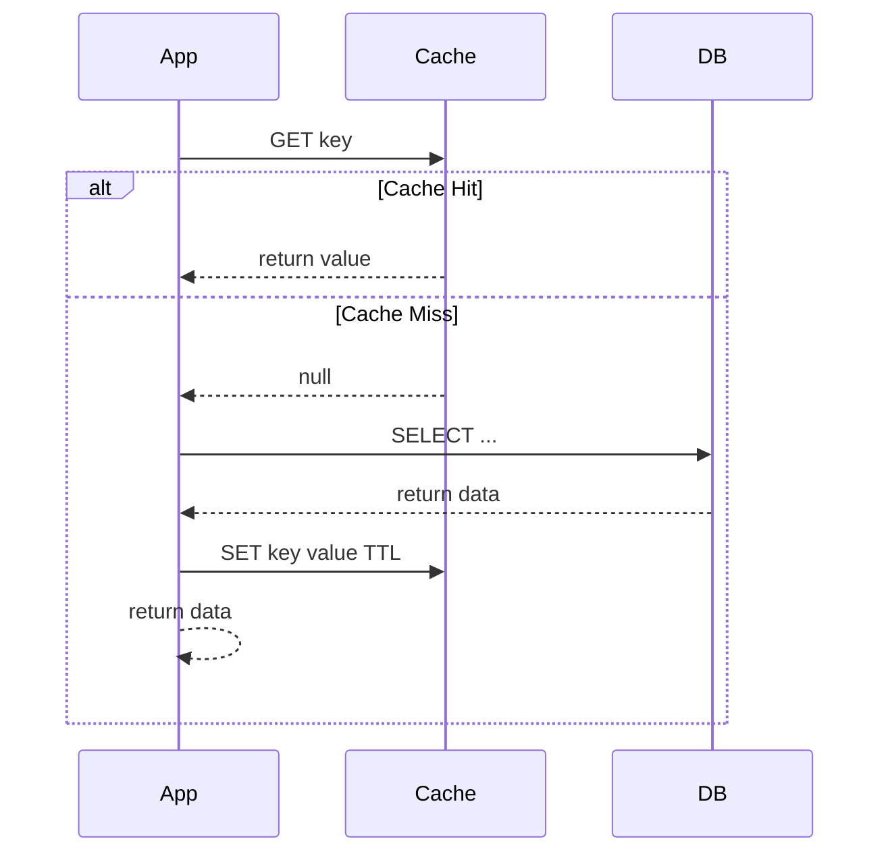
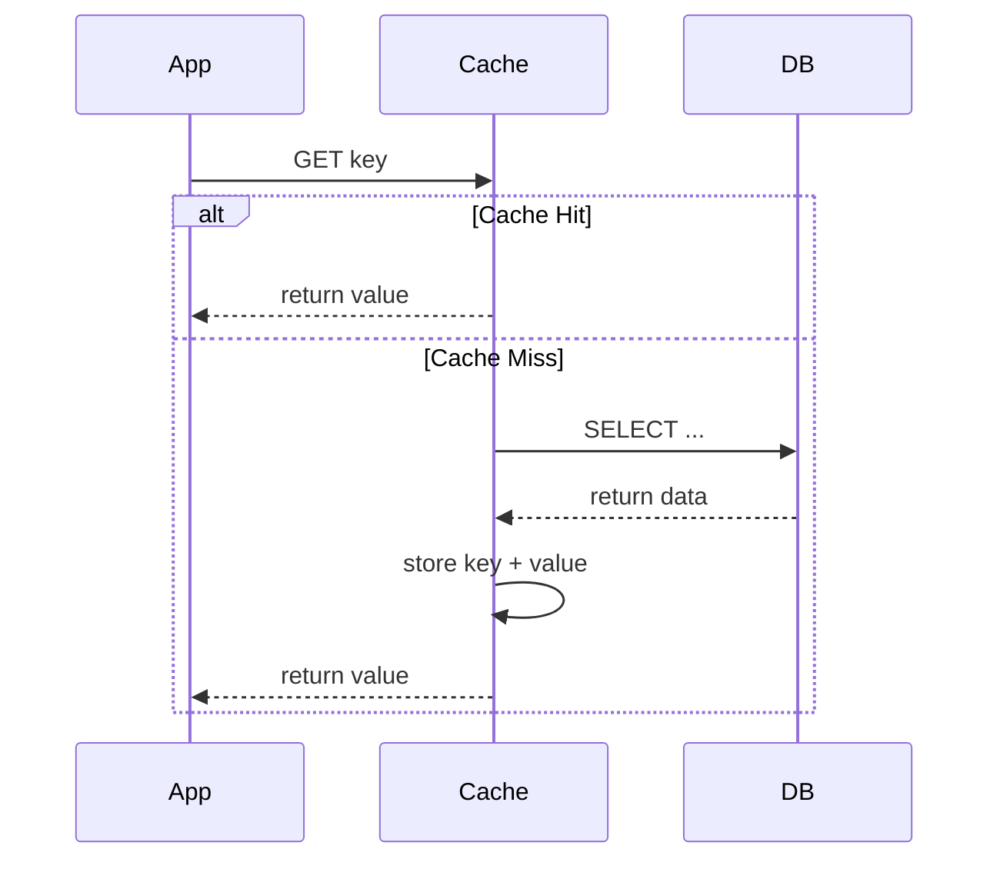
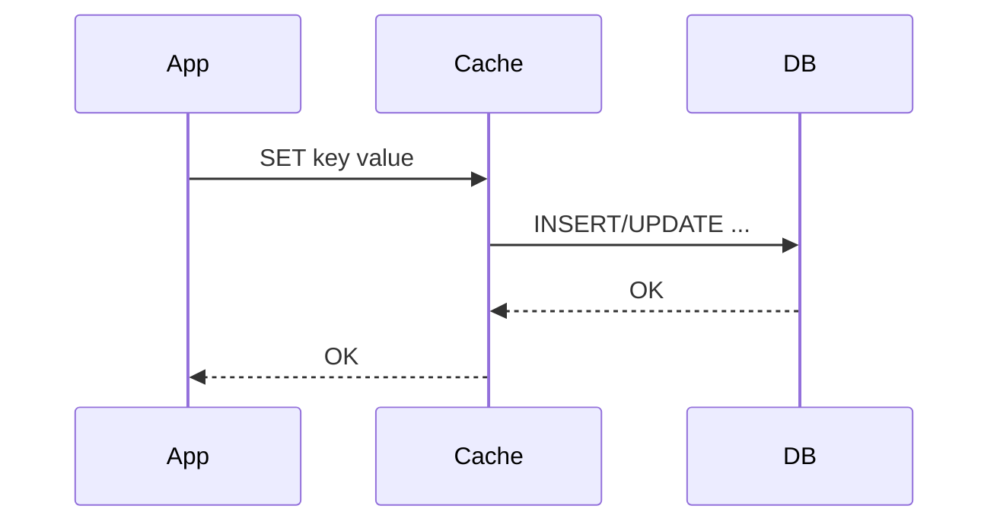
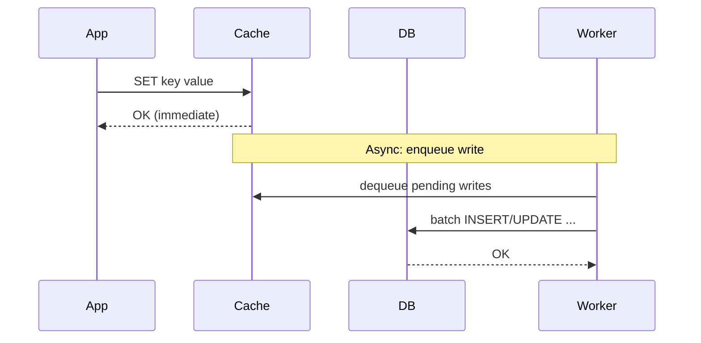
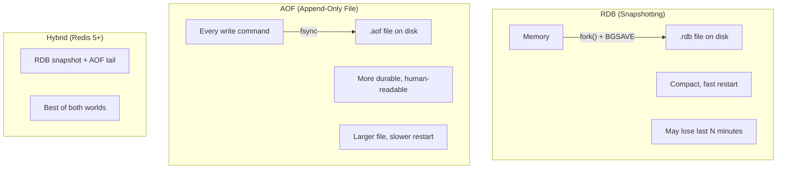
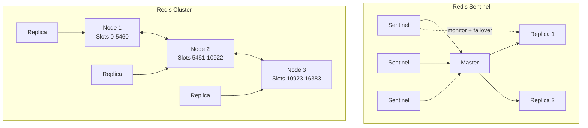
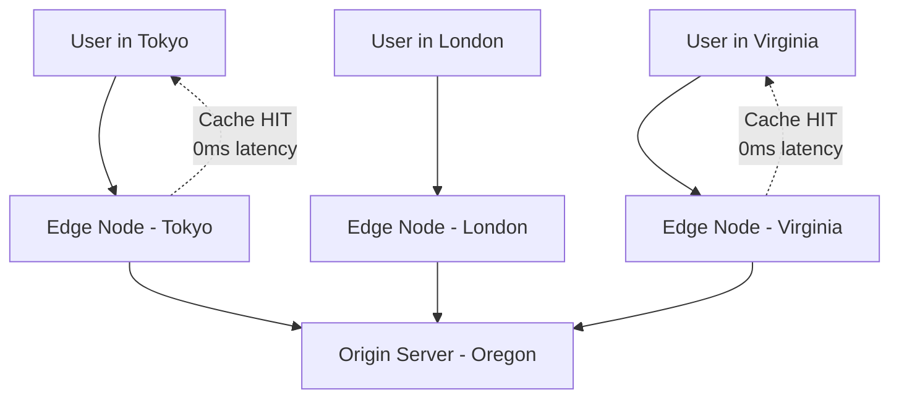
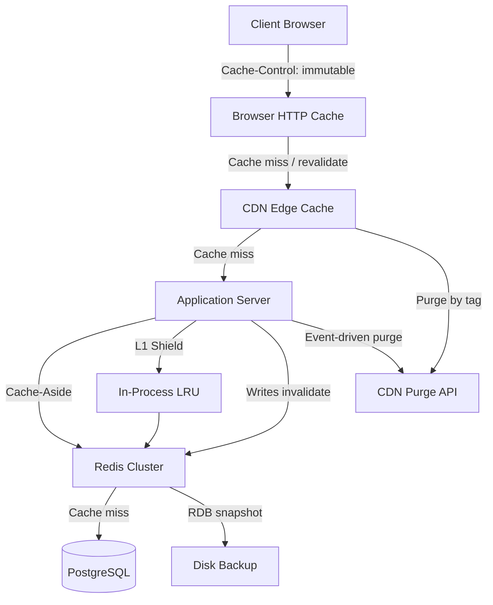
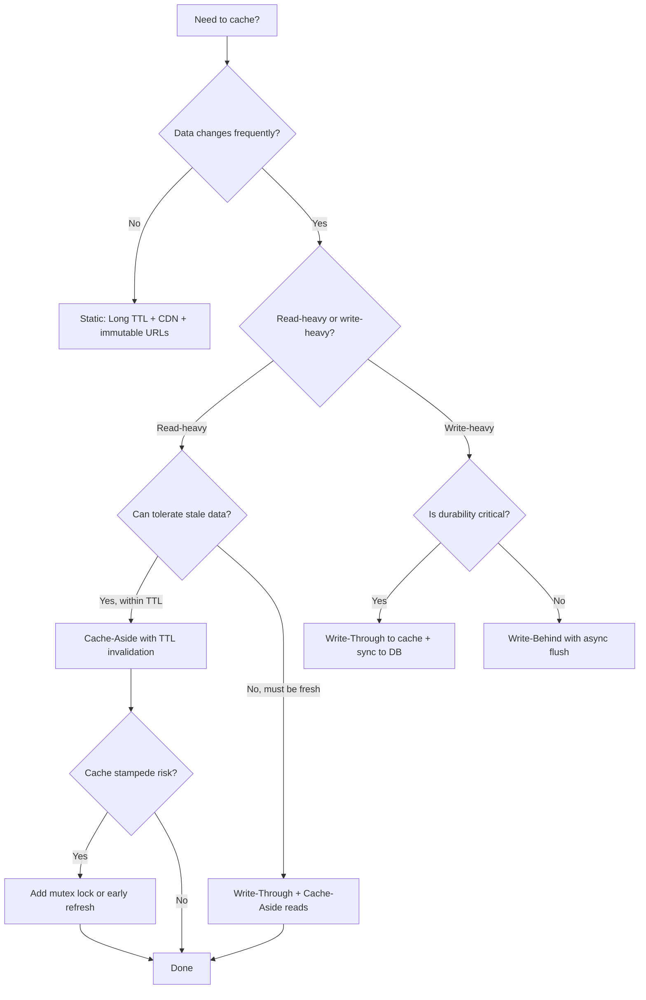

# Caching ⚡

Caching stores copies of frequently accessed data in a faster storage layer, reducing latency, database load, and infrastructure costs. A well-implemented caching layer can turn a sluggish API into one that responds in single-digit milliseconds — but a poorly designed one introduces stale data, thundering herds, and debugging nightmares.

> _"There are only two hard things in Computer Science: cache invalidation and naming things." — Phil Karlton_

---

## Why Cache?

| Benefit                   | Impact                                                         |
| ------------------------- | -------------------------------------------------------------- |
| **Reduced latency**       | In-memory read is ~100× faster than a database query           |
| **Lower database load**   | Fewer queries → more headroom for growth                       |
| **Cost savings**          | Cache scales cheaper than replicating databases                |
| **Improved availability** | Stale cache can serve during DB outages (graceful degradation) |
| **Higher throughput**     | Cache handles far more concurrent reads than a relational DB   |

**Where bottlenecks live (typical latencies):**

```
L1 Cache ref    → 0.5 ns
L2 Cache ref    → 7 ns
Main memory     → 100 ns
SSD read        → 16,000 ns   (16 μs)
In-memory DB    → 50,000 ns   (50 μs)
Network roundtrip (same DC) → 500,000 ns (500 μs)
Disk seek       → 10,000,000 ns (10 ms)
```

---

## Caching Patterns

Every caching decision starts with one question: _who updates the cache — the application or the cache itself?_

### Cache-Aside (Lazy Loading)

The application is responsible for both reading from and writing to the cache. The cache sits "to the side" — the application consults it, but the cache never talks to the database.



**Read path (TypeScript + ioredis):**

```typescript
import Redis from 'ioredis';
import { db } from './db';

const redis = new Redis({ host: 'localhost', port: 6379 });

async function getUser(userId: string): Promise<User> {
  const cacheKey = `user:${userId}`;

  // 1. Check cache
  const cached = await redis.get(cacheKey);
  if (cached) {
    return JSON.parse(cached) as User;
  }

  // 2. Cache miss — fetch from database
  const user = await db.query('SELECT * FROM users WHERE id = $1', [userId]);
  if (!user.rows[0]) {
    throw new NotFoundError('User not found');
  }

  // 3. Populate cache (with TTL to prevent stale data forever)
  await redis.setex(cacheKey, 3600, JSON.stringify(user.rows[0]));

  return user.rows[0];
}
```

**Write path — invalidate, don't update:**

```typescript
async function updateUser(userId: string, data: Partial<User>): Promise<User> {
  // 1. Write through to DB
  const result = await db.query('UPDATE users SET ... WHERE id = $1 RETURNING *', [userId]);

  // 2. Invalidate the cache (let the next read repopulate it)
  await redis.del(`user:${userId}`);

  return result.rows[0];
}
```

| Pros                                       | Cons                                         |
| ------------------------------------------ | -------------------------------------------- |
| Simple to implement                        | Cache misses add latency on first request    |
| App has full control over what gets cached | Stale data risk if invalidation is forgotten |
| Cache failures don't block DB writes       | Cold start: empty cache after deployment     |
| Works with any cache technology            |                                              |

### Read-Through

The cache sits **between** the application and the database. When the application requests data, it only talks to the cache — the cache is responsible for loading data from the database on a miss.



| Pros                                                    | Cons                                                                 |
| ------------------------------------------------------- | -------------------------------------------------------------------- |
| App code is simpler — never talks to DB for cached data | Cache must understand how to query the database                      |
| Cache miss handled transparently                        | Requires a cache that supports read-through (Redis doesn't natively) |
| Consistent data access pattern                          | Tight coupling between cache layer and data model                    |

**Redis doesn't natively support read-through**, but you can implement it with a custom provider or use solutions like **AWS ElastiCache** with a read-through pattern, **Hazelcast**, or **Apache Ignite**.

### Write-Through

The application writes **to the cache first**, and the cache synchronously writes to the database before returning.



| Pros                                                | Cons                                                           |
| --------------------------------------------------- | -------------------------------------------------------------- |
| Cache is always consistent with DB                  | Higher write latency (two synchronous writes)                  |
| No stale data on reads                              | Every write touches both cache and DB                          |
| Works well for read-heavy workloads with few writes | Unnecessary cache population for data that is never read again |

**Implementation sketch:**

```typescript
async function createUser(data: CreateUserDto): Promise<User> {
  // 1. Write to database first (source of truth)
  const result = await db.query('INSERT INTO users (name, email) VALUES ($1, $2) RETURNING *', [
    data.name,
    data.email,
  ]);
  const user = result.rows[0];

  // 2. Write to cache synchronously
  await redis.setex(`user:${user.id}`, 3600, JSON.stringify(user));

  return user;
}
```

### Write-Behind (Write-Back)

The application writes **to the cache first** (fast), and the cache **asynchronously** flushes to the database later (batched, with configurable delay).



| Pros                                             | Cons                                                   |
| ------------------------------------------------ | ------------------------------------------------------ |
| Lowest write latency (cache returns immediately) | Risk of data loss if cache crashes before flush        |
| Batched writes → fewer DB roundtrips             | Dirty reads possible if other nodes query DB directly  |
| Absorbs write spikes                             | Complex to implement correctly (idempotency, ordering) |

**When to use:** High write throughput with tolerance for brief inconsistency — analytics events, counters, metrics ingestion, user activity logs.

---

## Redis Deep-Dive 🧠

Redis (Remote Dictionary Server) is an **in-memory data structure store** — far more than a key-value cache. It's a Swiss Army knife that doubles as a database, cache, message broker, and stream processor.

### Data Types

Redis is "data-structure server" — each key holds a typed data structure with native operations.

| Type            | Description                            | Key Operations                                | Use Cases                                                  |
| --------------- | -------------------------------------- | --------------------------------------------- | ---------------------------------------------------------- |
| **String**      | Binary-safe, up to 512 MB              | `SET`, `GET`, `INCR`, `SETEX`, `MSET`         | Cache values, counters, serialized JSON, distributed locks |
| **Hash**        | Map of field-value pairs               | `HSET`, `HGET`, `HGETALL`, `HINCRBY`          | User profiles, session data, object storage                |
| **List**        | Linked list (ordered by insertion)     | `LPUSH`, `RPOP`, `LRANGE`, `LLEN`             | Job queues, activity feeds, message buffers                |
| **Set**         | Unordered unique strings               | `SADD`, `SISMEMBER`, `SINTER`, `SCARD`        | Tags, unique visitors, friend lists                        |
| **Sorted Set**  | Set with scores, ordered by score      | `ZADD`, `ZRANGE`, `ZRANK`, `ZREVRANGEBYSCORE` | Leaderboards, rate limiters, priority queues               |
| **Stream**      | Append-only log (Kafka-lite)           | `XADD`, `XREAD`, `XREADGROUP`, `XRANGE`       | Event sourcing, message brokers, audit logs                |
| **Bitmap**      | Bit-level operations on strings        | `SETBIT`, `GETBIT`, `BITCOUNT`, `BITOP`       | Feature flags, online/offline status, daily active users   |
| **HyperLogLog** | Probabilistic cardinality estimation   | `PFADD`, `PFCOUNT`, `PFMERGE`                 | Unique visitors (with &lt;1% error), counting distinct events |
| **Geospatial**  | Latitude/longitude with radius queries | `GEOADD`, `GEORADIUS`, `GEODIST`              | Nearby drivers, store locators, geofencing                 |

**Data type selection guide:**

```
Cache a JSON object?        → String (serialize with JSON.stringify)
Cache specific fields?      → Hash (update individual fields without full deserialization)
Need a leaderboard?         → Sorted Set (ZADD score member, ZRANGE by rank)
Need a message queue?       → List (LPUSH + BRPOP) or Stream (for consumer groups)
Need to count unique items? → HyperLogLog (12 KB for 2^64 items)
Tracking online users?      → Bitmap + SETBIT user_id 1
```

**Code examples:**

```typescript
// --- Strings: session cache ---
await redis.setex(`session:${sessionId}`, 1800, JSON.stringify(sessionData));

// --- Hashes: user profile (update single field without full serialization) ---
await redis.hset(`user:${userId}`, 'lastLogin', new Date().toISOString());
const email = await redis.hget(`user:${userId}`, 'email');

// --- Sorted Sets: top 10 leaderboard ---
await redis.zadd('leaderboard', 9500, 'player:42');
const top10 = await redis.zrevrange('leaderboard', 0, 9, 'WITHSCORES');

// --- Lists: job queue ---
await redis.lpush('email:queue', JSON.stringify({ to: 'a@b.com', template: 'welcome' }));
const job = await redis.brpop('email:queue', 5); // blocking pop with 5s timeout

// --- Sets: unique tags for a post ---
await redis.sadd(`post:${postId}:tags`, 'javascript', 'caching', 'redis');
const tags = await redis.smembers(`post:${postId}:tags`);

// --- Bitmaps: daily active users ---
await redis.setbit('dau:2025-01-15', userId, 1);
const dauCount = await redis.bitcount('dau:2025-01-15');
```

### Eviction Policies

What happens when Redis hits `maxmemory`? You choose the eviction policy.

| Policy            | Behavior                                       | Best For                                                  |
| ----------------- | ---------------------------------------------- | --------------------------------------------------------- |
| `noeviction`      | Returns error on writes                        | **Never use for caching** — will crash your app           |
| `allkeys-lru`     | Evict least recently used keys, any key        | **General-purpose caching (recommended)**                 |
| `allkeys-lfu`     | Evict least frequently used keys, any key      | Access patterns where frequency matters more than recency |
| `allkeys-random`  | Evict random keys                              | When access pattern is uniform (rare)                     |
| `volatile-lru`    | Evict LRU among keys **with a TTL**            | Mixed workload: some keys must never be evicted           |
| `volatile-lfu`    | Evict LFU among keys **with a TTL**            | Mixed workload with frequency bias                        |
| `volatile-random` | Evict random among keys **with a TTL**         | Mixed workload, uniform access                            |
| `volatile-ttl`    | Evict keys with the **shortest remaining TTL** | Prefer to evict expiring-soon keys                        |

**Recommendation:** For a pure cache, use `allkeys-lru`. For a mixed cache + persistent store, use `volatile-lru` and ensure only cache keys have TTLs.

```bash
# Check current policy
redis-cli CONFIG GET maxmemory-policy

# Set allkeys-lru with 2 GB max memory
redis-cli CONFIG SET maxmemory 2gb
redis-cli CONFIG SET maxmemory-policy allkeys-lru

# Or in redis.conf
maxmemory 2gb
maxmemory-policy allkeys-lru
```

### Persistence: RDB vs AOF

Redis stores data in memory for speed, but can persist to disk for durability.



| Criteria               | RDB                                  | AOF                                          | Hybrid                                  |
| ---------------------- | ------------------------------------ | -------------------------------------------- | --------------------------------------- |
| **Durability**         | Low — loses data since last snapshot | High — `fsync` every second (or every write) | High                                    |
| **Restart speed**      | Fast (load single file)              | Slow (replay all commands)                   | Fast (RDB base + small AOF tail)        |
| **File size**          | Small (compressed binary)            | Large (every write logged)                   | Medium                                  |
| **Performance impact** | Low (async `fork()`)                 | Configurable (`fsync` frequency)             | Low                                     |
| **Recovery guarantee** | Last snapshot                        | Up to last fsync                             | Near-last snapshot + tail               |
| **Best for**           | Cache with backup, disaster recovery | Durable queue, message store                 | Production — use if you can't lose data |

**AOF fsync policies:**

| Policy                 | Behavior                    | Durability vs Performance                    |
| ---------------------- | --------------------------- | -------------------------------------------- |
| `appendfsync always`   | fsync after every write     | Safest, slowest (every write waits for disk) |
| `appendfsync everysec` | fsync once per second       | **Recommended** — lose ≤1s of data           |
| `appendfsync no`       | Let OS decide when to fsync | Fastest, least durable                       |

### Clustering

When one Redis instance isn't enough, you have three scaling options:



| Feature                    | Standalone           | Sentinel                           | Cluster                                      |
| -------------------------- | -------------------- | ---------------------------------- | -------------------------------------------- |
| **Data distribution**      | Single node          | Single master (replicas for reads) | Sharded across 16384 hash slots              |
| **High availability**      | None                 | Automatic failover to replica      | Automatic failover (each shard has replicas) |
| **Horizontal scaling**     | None (vertical only) | None (writes go to one master)     | Yes — add/remove nodes, reshard slots        |
| **Multi-key operations**   | All                  | All                                | Only keys in the same hash slot              |
| **Transactions**           | Full support         | Full support                       | Only within a single hash slot               |
| **Maximum practical size** | ~25 GB per node      | ~25 GB per node                    | ~25 GB × N nodes                             |
| **Client requirements**    | Simple               | Simple (needs sentinel awareness)  | Cluster-aware client required                |
| **Operations complexity**  | Low                  | Medium                             | High                                         |

**Cluster hash slot mechanism:**

```
HASH_SLOT = CRC16(key) mod 16384

# Keys in the same slot:
user:{userId}:profile   → CRC16("user:{userId}:profile") % 16384
user:{userId}:orders    → CRC16("user:{userId}:orders") % 16384

# Force same slot with hash tags:
user:{userId}:profile   → CRC16("{userId}") % 16384  ← only the content inside {} is hashed
user:{userId}:orders    → CRC16("{userId}") % 16384  ← same slot!
```

---

## Cache Invalidation 🧹

The other hard problem. Invalidation strategies determine how stale data gets removed or updated.

### Strategies

| Strategy                      | Description                                                    | When to Use                                  |
| ----------------------------- | -------------------------------------------------------------- | -------------------------------------------- |
| **TTL (Time-to-Live)**        | Cache entry expires after a fixed duration                     | Most common — accept brief staleness window  |
| **Write invalidation**        | Delete cache key whenever data is updated in DB                | Strong consistency needed                    |
| **Write update**              | Update cache with new value on every DB write                  | Read-heavy, write-rare data                  |
| **Event-driven invalidation** | DB emits change events (CDC), cache subscribes and invalidates | Microservices, multiple cache nodes          |
| **Versioned keys**            | Append version number: `user:42:v3`                            | Rollback-safe, blue-green deployments        |
| **Soft invalidation**         | Mark entry as "stale" (serve from cache + refresh async)       | High-traffic keys that can't tolerate misses |

### TTL Strategy Guide

```
Session data:              15–30 minutes
API rate limit counters:   1 minute window
Product catalog:           1–6 hours (invalidate on product update)
User profile:              5–15 minutes
Static content (blog post): 24 hours
Configuration/flags:       1–5 minutes
Analytics aggregates:      5–60 minutes (depends on freshness needs)
```

### Stale-While-Revalidate Pattern

Serve the stale cached value while asynchronously refreshing it — prevents cache misses from hitting the database under load.

```typescript
async function getWithSWR<T>(
  key: string,
  ttl: number,
  swrWindow: number, // extra window where stale data is served
  fetcher: () => Promise<T>,
): Promise<{ data: T; fresh: boolean }> {
  const cached = await redis.get(key);

  if (!cached) {
    // Complete miss — must fetch
    const data = await fetcher();
    await redis.setex(key, ttl + swrWindow, JSON.stringify({ data, timestamp: Date.now() }));
    return { data, fresh: true };
  }

  const entry = JSON.parse(cached);
  const age = Date.now() - entry.timestamp;

  if (age < ttl * 1000) {
    // Fresh — return immediately
    return { data: entry.data, fresh: true };
  }

  // Stale — return old data BUT trigger async refresh
  // Use a lock to prevent multiple concurrent refreshes (stampede prevention)
  refreshInBackground(key, ttl, swrWindow, fetcher).catch(() => {});
  return { data: entry.data, fresh: false };
}

async function refreshInBackground<T>(
  key: string,
  ttl: number,
  swrWindow: number,
  fetcher: () => Promise<T>,
): Promise<void> {
  const lockKey = `${key}:refresh-lock`;
  const acquired = await redis.set(lockKey, '1', 'EX', 10, 'NX');
  if (!acquired) return; // another process is already refreshing

  try {
    const data = await fetcher();
    await redis.setex(key, ttl + swrWindow, JSON.stringify({ data, timestamp: Date.now() }));
  } finally {
    await redis.del(lockKey);
  }
}
```

---

## Cache Stampede Prevention 🐘🐘🐘

A **cache stampede** (or thundering herd) happens when a heavily-requested cache key expires, and dozens (or hundreds) of concurrent requests all try to recompute and repopulate it simultaneously — crushing the database.

### Solutions

#### 1. Locking (Mutex)

Only **one** request is allowed to recompute the value. Others wait or get a stale copy.

```typescript
async function getWithLock<T>(key: string, ttl: number, fetcher: () => Promise<T>): Promise<T> {
  const cached = await redis.get(key);
  if (cached) return JSON.parse(cached);

  const lockKey = `${key}:lock`;
  const acquired = await redis.set(lockKey, '1', 'EX', 30, 'NX');

  if (acquired) {
    // This process won the lock — fetch and populate
    try {
      const data = await fetcher();
      await redis.setex(key, ttl, JSON.stringify(data));
      return data;
    } finally {
      await redis.del(lockKey);
    }
  }

  // Didn't acquire lock — wait and retry
  await new Promise((resolve) => setTimeout(resolve, 100 + Math.random() * 200));
  return getWithLock(key, ttl, fetcher); // recursive retry
}
```

#### 2. Probabilistic Early Expiry (PER Algorithm)

Refresh the cache **before** it expires, with a probability that increases as expiry approaches. This means the "herd" never encounters a true miss.

```typescript
async function getWithEarlyRefresh<T>(
  key: string,
  ttl: number, // total TTL in seconds
  delta: number, // recomputation window in seconds (e.g., 60s before expiry)
  fetcher: () => Promise<T>,
): Promise<T> {
  const metaKey = `${key}:meta`;

  // Lua script to atomically check and potentially trigger refresh
  const script = `
    local value = redis.call('GET', KEYS[1])
    local meta = redis.call('HMGET', KEYS[2], 'value', 'expiry', 'delta')
    local storedValue = meta[1]
    local expiry = tonumber(meta[2])
    local delta = tonumber(ARGV[1])
    local ttl = tonumber(ARGV[2])
    local now = tonumber(ARGV[3])

    if storedValue then
      local remaining = expiry - now
      if remaining > delta then
        return {storedValue, 'hit'}
      end
      -- Within recomputation window — trigger async refresh but return stale
      redis.call('SETEX', KEYS[3], 5, '1')  -- lock to prevent multiple triggers
      return {storedValue, 'stale'}
    end

    return {nil, 'miss'}
  `;

  const [value, status] = await redis.eval(
    script,
    3,
    key,
    metaKey,
    `${key}:trigger-lock`,
    delta,
    ttl,
    Math.floor(Date.now() / 1000),
  );

  if (status === 'miss') {
    return getWithLock(key, ttl, fetcher);
  }

  if (status === 'stale') {
    fetchAndCache(key, metaKey, ttl, delta, fetcher).catch(() => {});
  }

  return JSON.parse(value);
}
```

#### 3. Local (In-Process) Cache Shield

Add an in-memory LRU cache in each application process as the first line of defense — eliminates network hops for hot keys.

```typescript
import { LRUCache } from 'lru-cache';

const localCache = new LRUCache<string, any>({
  max: 10000,
  ttl: 1000 * 10, // 10 seconds — shorter than Redis TTL
});

async function getMultiLevel<T>(
  key: string,
  redisTTL: number,
  fetcher: () => Promise<T>,
): Promise<T> {
  // L1: Local memory (nanoseconds)
  const local = localCache.get(key);
  if (local !== undefined) return local as T;

  // L2: Redis (microseconds)
  const redisCached = await redis.get(key);
  if (redisCached) {
    localCache.set(key, JSON.parse(redisCached));
    return JSON.parse(redisCached) as T;
  }

  // L3: Database (milliseconds) — with lock
  const data = await getWithLock(key, redisTTL, fetcher);
  localCache.set(key, data);
  return data;
}
```

---

## CDN Caching 🌍

A **Content Delivery Network** caches your content at edge locations close to users. For backend engineers, CDNs are essential for caching static assets, API responses, and even entire pages.



### What to Cache on a CDN

| Content                                | TTL                     | Notes                                                        |
| -------------------------------------- | ----------------------- | ------------------------------------------------------------ |
| Static assets (JS, CSS, images, fonts) | 1 year (versioned URLs) | Use content-hash in filename: `app.a3f2b1c.js`               |
| API responses (public)                 | 1–60 minutes            | GET-only, public data (product listings, search suggestions) |
| HTML pages (public)                    | 5–60 minutes            | Public landing pages, blogs, documentation                   |
| Media files                            | 7–30 days               | Videos, PDFs, audio files                                    |
| GraphQL (persisted queries via GET)    | Configurable            | Only persisted queries with `extensions.persistedQuery`      |

### Cache-Control Headers for CDN

```http
# Static asset with version hash — cache forever
Cache-Control: public, max-age=31536000, immutable

# Public API response — cache for 5 minutes, allow stale for 1 hour
Cache-Control: public, max-age=300, s-maxage=300, stale-while-revalidate=3600

# Personalized content — don't cache at CDN
Cache-Control: private, no-cache
```

**CDN-specific directives:**

| Directive                | Meaning                                                                                |
| ------------------------ | -------------------------------------------------------------------------------------- |
| `s-maxage`               | Overrides `max-age` for shared caches (CDN) only                                       |
| `stale-while-revalidate` | Serve stale while re-fetching in background                                            |
| `stale-if-error`         | Serve stale if origin returns 5xx                                                      |
| `proxy-revalidate`       | CDN must revalidate with origin after max-age, even if client allows stale             |
| `Surrogate-Control`      | CDN-specific (Fastly, some others) — same semantics as Cache-Control but for CDN layer |
| `Surrogate-Key`          | Tag-based purging — `Surrogate-Key: product-42 category-shoes`                         |

### Cache Key Design

CDNs use the **full URL + Host header** as the default cache key. For API responses, you often need more control:

```nginx
# NGINX — include specific headers and cookies in the cache key
proxy_cache_key "$scheme$host$request_uri$http_authorization";

# Varnish — vary cache based on specific headers
sub vcl_hash {
  hash_data(req.url);
  hash_data(req.http.Accept-Language);
}

# Fastly — custom VCL for API cache keys
set req.http.X-Cache-Key = req.url ":" req.http.Accept-Language;
```

### Purging Strategies

| Strategy           | Description                                 | Use Case                                            |
| ------------------ | ------------------------------------------- | --------------------------------------------------- |
| **Purge by URL**   | `PURGE /api/products/123`                   | Single resource update                              |
| **Purge by tag**   | `PURGE /` with `Surrogate-Key: product-123` | Invalidate all cached responses related to resource |
| **Soft purge**     | Mark as stale (serve stale, refresh async)  | High-traffic — never leave the edge cold            |
| **Ban by pattern** | `BAN url ~ ^/api/products/`                 | Bulk invalidation (Varnish)                         |
| **Versioned URLs** | Change URL instead of purging               | Static assets — no purging needed                   |

---

## HTTP Caching Headers 📡

HTTP caching is the first caching layer every backend engineer should understand. It's free, built into every browser and proxy, and dramatically reduces bandwidth and server load.

### Response Headers

| Header          | Example                            | Purpose                                              |
| --------------- | ---------------------------------- | ---------------------------------------------------- |
| `Cache-Control` | `public, max-age=3600, immutable`  | **The master switch** — dictates cache behavior      |
| `ETag`          | `"abc123"`                         | Resource version identifier for conditional requests |
| `Last-Modified` | `Tue, 15 Jan 2025 10:00:00 GMT`    | Timestamp for `If-Modified-Since`                    |
| `Expires`       | `Tue, 15 Jan 2025 12:00:00 GMT`    | Deprecated — use `Cache-Control: max-age` instead    |
| `Vary`          | `Accept-Encoding, Accept-Language` | Tells caches to store multiple variants              |
| `Age`           | `120`                              | Seconds since response was generated by origin       |

### Cache-Control Directives

```http
Cache-Control: public, max-age=3600, s-maxage=600, stale-while-revalidate=300, stale-if-error=86400, must-revalidate
```

| Directive                  | Scope         | Meaning                                                        |
| -------------------------- | ------------- | -------------------------------------------------------------- |
| `public`                   | All caches    | Can be cached by browsers, CDNs, proxies                       |
| `private`                  | Browser only  | Only the end-user's browser may cache                          |
| `no-cache`                 | All           | **Can cache**, but MUST revalidate with origin before each use |
| `no-store`                 | All           | **Cannot cache at all** — never write to disk                  |
| `max-age=N`                | All caches    | Cache for N seconds from time of request                       |
| `s-maxage=N`               | Shared caches | Overrides `max-age` for CDNs/proxies only                      |
| `must-revalidate`          | All           | After expiry, must check with origin before using stale        |
| `proxy-revalidate`         | Shared caches | Like `must-revalidate` but for shared caches only              |
| `immutable`                | All           | Resource will never change — don't revalidate even on reload   |
| `no-transform`             | All           | Proxies must not modify (e.g., compress images)                |
| `stale-while-revalidate=N` | All           | Serve stale for N seconds while re-fetching in background      |
| `stale-if-error=N`         | All           | Serve stale for N seconds if origin returns 5xx                |

### Conditional Requests

The browser sends **validator headers** so the server can respond with `304 Not Modified` (no body sent, saves bandwidth):

```
# First request
GET /api/products/123 HTTP/1.1
→ 200 OK
  ETag: "v1.2.3"
  Last-Modified: Tue, 15 Jan 2025 10:00:00 GMT
  Cache-Control: public, max-age=3600

# Subsequent request (cache validation)
GET /api/products/123 HTTP/1.1
If-None-Match: "v1.2.3"
If-Modified-Since: Tue, 15 Jan 2025 10:00:00 GMT
→ 304 Not Modified  (no body — use cached copy!)
```

### Express Middleware for Caching Headers

```typescript
import { Request, Response, NextFunction } from 'express';

interface CachePolicy {
  public?: boolean;
  maxAge: number; // seconds
  sMaxAge?: number; // CDN override
  staleWhileRevalidate?: number;
  staleIfError?: number;
  immutable?: boolean;
  vary?: string[];
}

function cacheControl(policy: CachePolicy) {
  return (req: Request, res: Response, next: NextFunction) => {
    const directives: string[] = [];

    directives.push(policy.public ? 'public' : 'private');
    directives.push(`max-age=${policy.maxAge}`);

    if (policy.sMaxAge) directives.push(`s-maxage=${policy.sMaxAge}`);
    if (policy.staleWhileRevalidate)
      directives.push(`stale-while-revalidate=${policy.staleWhileRevalidate}`);
    if (policy.staleIfError) directives.push(`stale-if-error=${policy.staleIfError}`);
    if (policy.immutable) directives.push('immutable');

    res.setHeader('Cache-Control', directives.join(', '));

    if (policy.vary && policy.vary.length > 0) {
      res.setHeader('Vary', policy.vary.join(', '));
    }

    next();
  };
}

// Usage in routes:
app.get(
  '/api/products/:id',
  cacheControl({ public: true, maxAge: 300, sMaxAge: 600, staleWhileRevalidate: 3600 }),
  productController.getById,
);

app.get(
  '/api/users/me',
  cacheControl({ maxAge: 0 }), // private, no-cache
  userController.getProfile,
);
```

### ETag Strategies

| Strategy                         | How It's Generated                      | Best For                               |
| -------------------------------- | --------------------------------------- | -------------------------------------- |
| **Content hash**                 | `MD5(response body)`                    | Small payloads that don't change often |
| **Version number**               | `"v" + resource.version`                | Resources with explicit versions       |
| **Last-Modified + content hash** | Combines timestamp with partial content | General-purpose                        |
| **Weak ETags**                   | `W/"abc123"` (byte-range equivalent)    | Compressed/gzip responses              |
| **Database row hash**            | Hash of relevant columns                | API responses backed by a single row   |

---

## Putting It All Together: A Multi-Layer Caching Architecture



**Latency at each layer:**

```
L0: Browser cache         → 0 ms
L1: In-process LRU        → 0.0005 ms  (0.5 μs)
L2: Redis (local network) → 0.1–1 ms
L3: CDN edge (nearby)     → 5–30 ms
L4: Database query        → 10–200 ms
```

---

## Cache Metrics & Observability

You can't improve what you don't measure. Track these metrics across every cache layer:

| Metric                       | What It Tells You                                | Alert Threshold                        |
| ---------------------------- | ------------------------------------------------ | -------------------------------------- |
| **Hit Rate**                 | `hits / (hits + misses)` — overall effectiveness | < 80% — investigate                    |
| **Hit Rate (by key prefix)** | Which data is cacheable vs not                   | Identify un-cached hot keys            |
| **Eviction Rate**            | Keys evicted per second (due to memory pressure) | > 0 — increase memory or change policy |
| **Expired Keys Rate**        | Keys expired due to TTL per second               | Tune TTLs if too high/low              |
| **Latency (p50/p99)**        | Redis response time                              | p99 > 10ms — check network/load        |
| **Cache Fill Time**          | Time to recompute a single cache entry           | > 500ms — precompute or optimize query |
| **Stampede Events**          | How often multiple processes race for same key   | > 0 — implement locking/early expiry   |
| **Memory Usage**             | `used_memory / maxmemory`                        | > 80% — scale up or evict              |

```typescript
// Track cache hit rate in your application
const cacheMetrics = {
  hits: 0,
  misses: 0,
};

function trackHit() {
  cacheMetrics.hits++;
}
function trackMiss() {
  cacheMetrics.misses++;
}

// Expose via Prometheus /metrics endpoint
app.get('/metrics', async (req, res) => {
  const redisInfo = await redis.info('stats');
  res.setHeader('Content-Type', 'text/plain');
  res.send(`
# HELP cache_hit_ratio Cache hit ratio (0-1)
# TYPE cache_hit_ratio gauge
cache_hit_ratio ${cacheMetrics.hits / (cacheMetrics.hits + cacheMetrics.misses || 1)}
${redisInfo}
  `);
});
```

---

## Anti-Patterns & Common Mistakes

| Mistake                             | Why It's Bad                                               | Fix                                                                         |
| ----------------------------------- | ---------------------------------------------------------- | --------------------------------------------------------------------------- |
| **Caching everything blindly**      | Wastes memory on rarely-accessed data                      | Cache only what's hot (80/20 rule — cache the 20% that gets 80% of traffic) |
| **No TTL**                          | Stale data forever, unbounded memory growth                | Always set a TTL, even if it's generous (24h)                               |
| **Cache as primary store**          | If cache is wiped, data is gone                            | Database is source of truth; cache is disposable                            |
| **Large keys/values**               | Slow serialization, network saturation                     | Keep values under 1 MB; compress or store in object storage                 |
| **Using KEYS in production**        | `KEYS *` blocks Redis (O(N) scan)                          | Use `SCAN` (cursor-based, non-blocking)                                     |
| **Cache stampede (no lock)**        | DB crushed under concurrent recomputations                 | Use mutex locking or early refresh (see above)                              |
| **Cache penetration**               | Malicious queries for nonexistent keys hit DB every time   | Cache null/empty results with short TTL (bloom filter also helps)           |
| **Hot key problem**                 | One key gets 90% of traffic, saturates a single Redis node | Replicate the key locally, or use client-side caching                       |
| **Time-based TTL for mutable data** | Stale data served within the TTL window                    | Invalidate on write, use event-driven refresh                               |

---

## Decision Framework

Use this flowchart to choose a caching strategy:



---

## Recommended Stack

| Layer                 | Technology                                    | Why                                           |
| --------------------- | --------------------------------------------- | --------------------------------------------- |
| **In-process cache**  | `lru-cache` (Node.js), Caffeine (Java)        | Sub-microsecond, zero network                 |
| **Distributed cache** | Redis (ElastiCache, Memorystore, self-hosted) | Rich data types, sub-millisecond latency      |
| **CDN**               | Cloudflare, Fastly, CloudFront                | Edge caching, DDoS protection                 |
| **ORM cache**         | TypeORM cache, Hibernate 2nd-level cache      | Transparent query caching                     |
| **Session store**     | Redis (`connect-redis`)                       | Shared across app instances, TTL built-in     |
| **Queue/stream**      | Redis Streams, BullMQ                         | Async write-behind, event-driven invalidation |
| **Monitoring**        | Prometheus + Grafana                          | Cache hit rates, latency, memory dashboards   |

---

## Further Reading

- [Redis Official Documentation](https://redis.io/docs/latest/)
- [Amazon ElastiCache Best Practices](https://docs.aws.amazon.com/AmazonElastiCache/latest/red-ug/BestPractices.html)
- [HTTP Caching — MDN Web Docs](https://developer.mozilla.org/en-US/docs/Web/HTTP/Caching)
- [Cloudflare CDN Cache Docs](https://developers.cloudflare.com/cache/)
- [Fastly API Cache Guide](https://docs.fastly.com/en/guides/api-caching)

[← Back to Backend Engineering](../README.md) · © sparshjaswal
