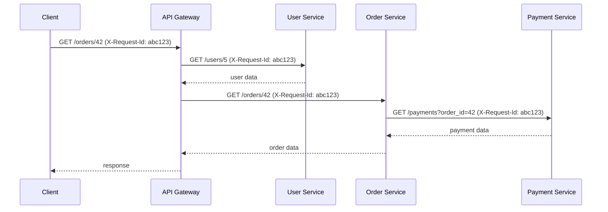
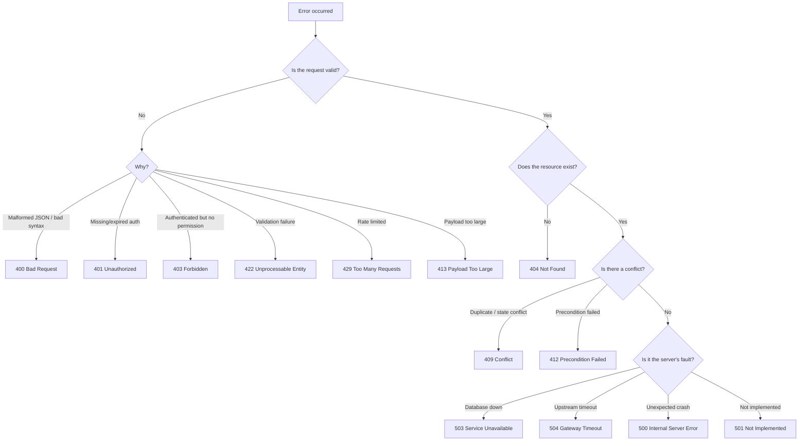

# Error Handling 🚨

Error handling is the discipline of anticipating, detecting, and gracefully recovering from failures in your application. Good error handling prevents crashes, provides meaningful feedback to clients, and simplifies debugging — turning chaotic failures into structured, observable events.

> _Errors are not exceptions to the happy path. In distributed systems, errors **are** the happy path._

---

## Operational vs Programmer Errors

The most important distinction in error handling is between **operational errors** and **programmer errors**. Treating them the same way leads to fragile systems.

| Dimension          | Operational Errors                                                                              | Programmer Errors                                                                |
| ------------------ | ----------------------------------------------------------------------------------------------- | -------------------------------------------------------------------------------- |
| **Definition**     | Expected failures in the runtime environment                                                    | Bugs and logic mistakes in the code                                              |
| **Cause**          | Network timeouts, invalid user input, DB connection failures, disk full, 3rd-party API downtime | `TypeError`, undefined variable, null reference, off-by-one, promise not awaited |
| **Can we handle?** | ✅ Yes — these should be caught and handled gracefully                                          | ❌ No safe recovery — the application state may be corrupted                     |
| **Response**       | Return a structured error to the client (4xx/5xx)                                               | Let the process crash. Restart it with a process manager (PM2, Kubernetes)       |
| **Examples**       | `ECONNREFUSED`, `ETIMEDOUT`, validation failures, rate limits, duplicate key violations         | `Cannot read property 'x' of undefined`, `uncaughtException`, infinite recursion |

### The Golden Rule

> **Handle operational errors. Don't handle programmer errors — fix them.**

```javascript
// ❌ DON'T — catching programmer errors to prevent a crash
try {
  const user = await db.users.findById(id);
  console.log(user.name.first); // if user is null, this throws — and it's a BUG
} catch (err) {
  // Swallowing the error hides the bug. The function that called this
  // should have validated `user` before accessing nested properties.
  return null;
}

// ✅ DO — distinguish between expected and unexpected
try {
  const user = await db.users.findById(id);
  if (!user) {
    throw new NotFoundError('User not found'); // operational
  }
  return user;
} catch (err) {
  if (err instanceof AppError) {
    // operational: return structured error
    return res.status(err.statusCode).json(err.toJSON());
  }
  // programmer: let it bubble up — or crash intentionally
  throw err;
}
```

---

## Structured Error Responses

Clients (and your own frontend) should never have to parse error messages with regex. Use a consistent, machine-readable error envelope.

### Error Envelope Contract

```json
{
  "success": false,
  "error": {
    "code": "VALIDATION_ERROR",
    "message": "One or more validation errors occurred.",
    "details": [
      {
        "field": "email",
        "message": "Must be a valid email address.",
        "received": "notanemail"
      }
    ],
    "requestId": "req_abc123",
    "timestamp": "2025-01-20T10:30:00.000Z"
  }
}
```

### Field-by-field Breakdown

| Field             | Type      | Required | Description                                                                                             |
| ----------------- | --------- | -------- | ------------------------------------------------------------------------------------------------------- |
| `success`         | `boolean` | ✅       | Always `false` for errors. Makes client branching trivial: `if (!res.success) { ... }`                  |
| `error.code`      | `string`  | ✅       | Machine-readable, UPPER_SNAKE_CASE identifier (e.g., `INVALID_INPUT`, `RATE_LIMITED`, `DB_UNAVAILABLE`) |
| `error.message`   | `string`  | ✅       | Human-readable summary. Safe for display to end users in production.                                    |
| `error.details`   | `array`   | ❌       | Field-level errors, validation failures, or additional context. Must be an array for consistency.       |
| `error.requestId` | `string`  | ✅       | Correlation ID — ties the error to a specific request in your logs.                                     |
| `error.timestamp` | `string`  | ✅       | ISO 8601 timestamp of when the error was generated.                                                     |

### Anti-patterns to Avoid

```json
// ❌ String message — impossible to branch programmatically
{ "error": "User not found" }

// ❌ HTML error pages in APIs
"<html><body><h1>500 Internal Server Error</h1></body></html>"

// ❌ Exposing stack traces in production
{
  "error": "TypeError: Cannot read property 'id' of null\n    at UserController.get (/app/src/controllers/user.ts:42:15)"
}

// ❌ Inconsistent shapes
GET  /users/1  → { "error": "Not found" }
POST /users    → { "message": "Validation failed", "errors": [...] }
// Two different error shapes from the same API — the client now needs two parsers.
```

---

## Custom Error Classes

Plain `Error` objects don't carry enough context. Build a hierarchy of custom error classes that encapsulate HTTP status codes, error codes, and serialization logic.

### Base Application Error

```javascript
// errors/AppError.js
class AppError extends Error {
  /**
   * @param {string} message  - Human-readable description
   * @param {number} statusCode - HTTP status code
   * @param {string} code      - Machine-readable error code
   * @param {Array}  details   - Optional field-level details
   */
  constructor(message, statusCode = 500, code = 'INTERNAL_ERROR', details = []) {
    super(message);
    this.name = this.constructor.name;
    this.statusCode = statusCode;
    this.code = code;
    this.details = details;
    this.timestamp = new Date().toISOString();
    this.isOperational = true; // flag for distinguishing from programmer errors
    Error.captureStackTrace(this, this.constructor);
  }

  toJSON() {
    return {
      success: false,
      error: {
        code: this.code,
        message: this.message,
        details: this.details,
        timestamp: this.timestamp,
      },
    };
  }
}

module.exports = AppError;
```

### Specific Error Subclasses

```javascript
// errors/NotFoundError.js
const AppError = require('./AppError');

class NotFoundError extends AppError {
  constructor(message = 'Resource not found', details = []) {
    super(message, 404, 'NOT_FOUND', details);
  }
}

// errors/ValidationError.js
class ValidationError extends AppError {
  constructor(message = 'Validation failed', details = []) {
    super(message, 422, 'VALIDATION_ERROR', details);
  }
}

// errors/UnauthorizedError.js
class UnauthorizedError extends AppError {
  constructor(message = 'Authentication required', details = []) {
    super(message, 401, 'UNAUTHORIZED', details);
  }
}

// errors/ForbiddenError.js
class ForbiddenError extends AppError {
  constructor(message = 'Insufficient permissions', details = []) {
    super(message, 403, 'FORBIDDEN', details);
  }
}

// errors/ConflictError.js
class ConflictError extends AppError {
  constructor(message = 'Resource already exists', details = []) {
    super(message, 409, 'CONFLICT', details);
  }
}

// errors/TooManyRequestsError.js
class TooManyRequestsError extends AppError {
  constructor(message = 'Rate limit exceeded', retryAfter = 60, details = []) {
    super(message, 429, 'RATE_LIMITED', details);
    this.retryAfter = retryAfter;
  }

  toJSON() {
    return {
      ...super.toJSON(),
      retryAfter: this.retryAfter,
    };
  }
}

// errors/ServiceUnavailableError.js
class ServiceUnavailableError extends AppError {
  constructor(message = 'Service temporarily unavailable', details = []) {
    super(message, 503, 'SERVICE_UNAVAILABLE', details);
  }
}
```

### Using Custom Errors in Business Logic

```javascript
async function getUserById(id) {
  const user = await db.users.findById(id);
  if (!user) {
    throw new NotFoundError(`User with ID ${id} not found`);
  }
  return user;
}

async function createUser(data) {
  const existing = await db.users.findByEmail(data.email);
  if (existing) {
    throw new ConflictError('A user with this email already exists', [
      { field: 'email', message: 'Email is already registered' },
    ]);
  }
  return db.users.create(data);
}
```

---

## Express Error Middleware

Express distinguishes between **regular middleware** (3 parameters: `req, res, next`) and **error-handling middleware** (4 parameters: `err, req, res, next`). Error-handling middleware is only invoked when `next(err)` is called or a synchronous error is thrown.

### Basic Error Handler

```javascript
// middleware/errorHandler.js
function errorHandler(err, req, res, next) {
  // If headers already sent, delegate to default Express handler
  if (res.headersSent) {
    return next(err);
  }

  // Determine if this is an operational error we can handle
  if (err.isOperational) {
    const statusCode = err.statusCode || 500;
    const body = err.toJSON();

    // Attach correlation ID from request (set by earlier middleware)
    body.error.requestId = req.requestId;

    return res.status(statusCode).json(body);
  }

  // Programmer error — log the full stack, return generic 500
  console.error('💥 UNEXPECTED ERROR:', err);
  return res.status(500).json({
    success: false,
    error: {
      code: 'INTERNAL_ERROR',
      message: 'An unexpected error occurred',
      requestId: req.requestId,
      timestamp: new Date().toISOString(),
    },
  });
}
```

### Production vs Development Error Format

```javascript
function errorHandler(err, req, res, next) {
  if (res.headersSent) return next(err);

  // Operational errors: safe to expose details
  if (err.isOperational) {
    const body = err.toJSON?.() ?? {
      success: false,
      error: {
        code: err.code || 'INTERNAL_ERROR',
        message: err.message,
        timestamp: new Date().toISOString(),
      },
    };
    body.error.requestId = req.requestId;
    return res.status(err.statusCode || 500).json(body);
  }

  // In development, include the stack trace for debugging
  if (process.env.NODE_ENV === 'development') {
    return res.status(500).json({
      success: false,
      error: {
        code: 'INTERNAL_ERROR',
        message: err.message,
        stack: err.stack,
        requestId: req.requestId,
        timestamp: new Date().toISOString(),
      },
    });
  }

  // In production, never leak internals
  return res.status(500).json({
    success: false,
    error: {
      code: 'INTERNAL_ERROR',
      message: 'An unexpected error occurred',
      requestId: req.requestId,
      timestamp: new Date().toISOString(),
    },
  });
}
```

### Registration Order Matters

```javascript
const express = require('express');
const app = express();

// 1. Request-scoped middleware (body parsing, logging, correlation IDs)
app.use(express.json());
app.use(attachRequestId);
app.use(requestLogger);

// 2. Routes
app.use('/api/users', userRoutes);
app.use('/api/orders', orderRoutes);

// 3. 404 handler — after all routes, before error handler
app.use((req, res, next) => {
  next(new NotFoundError(`Route ${req.method} ${req.originalUrl} not found`));
});

// 4. Error handler — MUST have 4 parameters, MUST be registered LAST
app.use(errorHandler);
```

---

## Async Error Handling

Express 4.x does **not** catch rejected promises or thrown errors inside `async` route handlers by default. An unhandled rejection in an async handler hangs the request forever.

### The Problem

```javascript
// ❌ This will hang the request — Express 4.x doesn't catch the rejection
app.get('/users/:id', async (req, res) => {
  const user = await db.users.findById(req.params.id);
  // If db throws/rejects, Express never sends a response
  res.json(user);
});

// ❌ This also hangs
app.get('/users/:id', (req, res) => {
  someAsyncFunction().then((user) => res.json(user));
  // If someAsyncFunction rejects, the promise chain is broken
});
```

### Solution 1: Async Handler Wrapper

```javascript
// middleware/asyncHandler.js
/**
 * Wraps an async route handler to catch rejections and forward them to next().
 * @param {Function} fn - Async route handler
 * @returns {Function} Express middleware
 */
function asyncHandler(fn) {
  return (req, res, next) => {
    Promise.resolve(fn(req, res, next)).catch(next);
  };
}

// Usage
const asyncHandler = require('./middleware/asyncHandler');
const { getUserById } = require('./controllers/userController');

app.get(
  '/users/:id',
  asyncHandler(async (req, res) => {
    const user = await getUserById(req.params.id);
    res.json({ success: true, data: user });
  }),
);
```

### Solution 2: Use a Library

```javascript
// express-async-errors (monkey-patches express to handle async errors)
require('express-async-errors');

// Now async handlers work without wrapping
app.get('/users/:id', async (req, res) => {
  const user = await getUserById(req.params.id); // rejection → next(err)
  res.json({ success: true, data: user });
});
```

### Solution 3: NestJS / Decorator-based (TypeScript)

```typescript
// NestJS handles async errors natively — no wrapper needed
@Controller('users')
export class UserController {
  @Get(':id')
  async getUser(@Param('id') id: string) {
    const user = await this.userService.findById(id);
    // If this throws, NestJS catches it and routes to its exception filter
    return { success: true, data: user };
  }
}
```

---

## Centralized Error Handling Pattern

Here's a complete, modular error handling architecture for a typical Express + TypeScript application:

### Directory Structure

```
src/
├── errors/
│   ├── AppError.ts           // Base class
│   ├── NotFoundError.ts      // 404
│   ├── ValidationError.ts    // 422
│   ├── UnauthorizedError.ts  // 401
│   ├── ForbiddenError.ts     // 403
│   ├── ConflictError.ts      // 409
│   └── index.ts              // Barrel export
├── middleware/
│   ├── errorHandler.ts       // Central error-handling middleware
│   ├── asyncHandler.ts       // Async wrapper
│   └── notFound.ts           // 404 catch-all
├── utils/
│   └── logger.ts             // Structured logger (Winston/Pino)
└── app.ts                    // Express setup
```

### App Setup (TypeScript)

```typescript
// app.ts
import express from 'express';
import { attachRequestId } from './middleware/requestId';
import { errorHandler } from './middleware/errorHandler';
import { notFound } from './middleware/notFound';
import { asyncHandler } from './middleware/asyncHandler';
import { NotFoundError } from './errors';

const app = express();

// --- Request-scoped middleware ---
app.use(express.json({ limit: '1mb' }));
app.use(attachRequestId);

// --- Routes ---
app.use('/api/users', userRoutes);
app.use('/api/orders', orderRoutes);

// Health check (before 404 handler)
app.get('/health', (req, res) => res.json({ status: 'ok' }));

// --- 404 catch-all ---
app.use(notFound);

// --- Central error handler (always last) ---
app.use(errorHandler);

export default app;
```

### Async Handler (TypeScript)

```typescript
// middleware/asyncHandler.ts
import { Request, Response, NextFunction } from 'express';

type AsyncHandler = (req: Request, res: Response, next: NextFunction) => Promise<any>;

export function asyncHandler(fn: AsyncHandler) {
  return (req: Request, res: Response, next: NextFunction) => {
    Promise.resolve(fn(req, res, next)).catch(next);
  };
}
```

### 404 Catch-All

```typescript
// middleware/notFound.ts
import { Request, Response, NextFunction } from 'express';
import { NotFoundError } from '../errors';

export function notFound(req: Request, res: Response, next: NextFunction) {
  next(new NotFoundError(`Route ${req.method} ${req.originalUrl} not found`));
}
```

### Controller Usage Example

```typescript
// controllers/userController.ts
import { asyncHandler } from '../middleware/asyncHandler';
import { NotFoundError, ValidationError } from '../errors';
import * as userService from '../services/userService';

export const getUserById = asyncHandler(async (req, res) => {
  const user = await userService.findById(req.params.id);
  if (!user) {
    throw new NotFoundError(`User with ID ${req.params.id} not found`);
  }
  res.json({ success: true, data: user });
});

export const createUser = asyncHandler(async (req, res) => {
  const { email, name } = req.body;

  const errors = [];
  if (!email) errors.push({ field: 'email', message: 'Email is required' });
  if (!name) errors.push({ field: 'name', message: 'Name is required' });

  if (errors.length > 0) {
    throw new ValidationError('Validation failed', errors);
  }

  const user = await userService.create({ email, name });
  res.status(201).json({ success: true, data: user });
});
```

---

## Correlation IDs for Logging

In a distributed system, a single user request may touch multiple services. Without a shared identifier, tracing that request across logs is impossible. A **correlation ID** (also called request ID, trace ID) solves this.

### How It Works



Every service logs with the same correlation ID — searching `abc123` in your log aggregator reconstructs the entire request journey.

### Middleware: Attach Correlation ID

```typescript
// middleware/requestId.ts
import { Request, Response, NextFunction } from 'express';
import { v4 as uuidv4 } from 'uuid';

export function attachRequestId(req: Request, res: Response, next: NextFunction) {
  // Accept incoming ID from upstream (X-Request-Id header) or generate one
  const requestId = (req.headers['x-request-id'] as string) || uuidv4();

  // Attach to request object for downstream use
  req.requestId = requestId;

  // Echo back to client in response header
  res.setHeader('X-Request-Id', requestId);

  next();
}

// Type augmentation
declare global {
  namespace Express {
    interface Request {
      requestId: string;
    }
  }
}
```

### Propagate to Outgoing Requests

```typescript
// utils/httpClient.ts
import axios from 'axios';
import { getCurrentRequestId } from './asyncContext';

const httpClient = axios.create();

httpClient.interceptors.request.use((config) => {
  const requestId = getCurrentRequestId();
  if (requestId) {
    config.headers['X-Request-Id'] = requestId;
  }
  return config;
});

export default httpClient;
```

### Async Context (Node.js AsyncLocalStorage)

```typescript
// utils/asyncContext.ts
import { AsyncLocalStorage } from 'async_hooks';

const asyncContext = new AsyncLocalStorage<{ requestId: string }>();

export function runWithContext(requestId: string, fn: () => void) {
  asyncContext.run({ requestId }, fn);
}

export function getCurrentRequestId(): string | undefined {
  return asyncContext.getStore()?.requestId;
}
```

### Wire It All Together

```typescript
// middleware/requestContext.ts
import { Request, Response, NextFunction } from 'express';
import { runWithContext } from '../utils/asyncContext';

export function requestContext(req: Request, res: Response, next: NextFunction) {
  runWithContext(req.requestId, () => {
    next();
  });
}
```

Now every log statement anywhere in the call tree can include the correlation ID without passing it explicitly through every function parameter.

---

## HTTP Status Code Selection

Choosing the right status code is part of your API's contract. Consistency matters more than perfection — pick a convention and stick with it.

### Decision Flowchart



### Quick Reference Table

| Scenario                             | Status Code                  | Notes                                                           |
| ------------------------------------ | ---------------------------- | --------------------------------------------------------------- |
| Missing required field               | `400 Bad Request`            | Simple input errors                                             |
| Invalid JSON syntax                  | `400 Bad Request`            | Malformed request body                                          |
| Wrong `Content-Type`                 | `415 Unsupported Media Type` | Expected `application/json`, got `text/plain`                   |
| Missing `Authorization` header       | `401 Unauthorized`           | Technically means "unauthenticated"                             |
| Wrong credentials / expired token    | `401 Unauthorized`           |                                                                 |
| User lacks role/permission           | `403 Forbidden`              | Re-authenticating won't help                                    |
| Resource not found                   | `404 Not Found`              | Prefer 404 over 403 for existence checks (prevents enumeration) |
| Method not allowed                   | `405 Method Not Allowed`     | `POST` on a `GET`-only endpoint                                 |
| `If-Match` / `If-None-Match` failure | `412 Precondition Failed`    | Optimistic concurrency                                          |
| Duplicate unique field               | `409 Conflict`               | e.g., duplicate email during registration                       |
| Business rule violation              | `409 Conflict`               | e.g., cancelling an already-shipped order                       |
| Semantic validation failure          | `422 Unprocessable Entity`   | Well-formed request, but doesn't pass business rules            |
| Rate limit exceeded                  | `429 Too Many Requests`      | Include `Retry-After` header                                    |
| Database connection failure          | `503 Service Unavailable`    | Include `Retry-After` if known                                  |
| Upstream API timeout                 | `504 Gateway Timeout`        | Your server acting as a gateway                                 |
| Unexpected null pointer              | `500 Internal Server Error`  | Never expose stack in production                                |

### 401 vs 403 — The Subtlety

> **401 Unauthorized** means "I don't know who you are" (unauthenticated).  
> **403 Forbidden** means "I know who you are, but you're not allowed" (unauthorized).

If the client sent no credentials → `401`. If the client sent valid credentials but lacks permission → `403`.

### When to Use 200 vs 201 vs 202 vs 204

| Status           | Meaning                       | When                                                            |
| ---------------- | ----------------------------- | --------------------------------------------------------------- |
| `200 OK`         | Success with body             | `GET`, `PUT`, `PATCH` success                                   |
| `201 Created`    | Resource created              | `POST` success — include `Location` header                      |
| `202 Accepted`   | Accepted for async processing | Long-running operation — body may include a status URL          |
| `204 No Content` | Success, no body              | `DELETE` success, or `PUT`/`PATCH` when you have nothing to say |

---

## Graceful Shutdown

Errors don't only happen during request handling. Your server may need to stop for a deployment, a crash, or resource exhaustion. Handling shutdown gracefully prevents data loss and in-flight request failures.

```javascript
// server.js
const server = app.listen(process.env.PORT || 3000);

// Graceful shutdown on SIGTERM (Kubernetes sends this before killing the pod)
process.on('SIGTERM', () => {
  console.log('🛑 SIGTERM received. Gracefully shutting down...');

  // 1. Stop accepting new connections
  server.close(() => {
    console.log('🔒 No new connections accepted.');
  });

  // 2. Wait for existing requests to finish (max 30 seconds)
  setTimeout(() => {
    console.log('⏰ Forcing shutdown after timeout.');
    process.exit(1);
  }, 30_000);

  // 3. Close database connections
  // await db.disconnect();

  // 4. Close message queue connections
  // await queue.close();

  // 5. Flush logs / metrics
  // await logger.flush();
});
```

---

## Database Error Handling

Database errors need special treatment — they come from an external system and often carry codes you can interpret.

### PostgreSQL Error Codes

```javascript
// utils/dbErrorHandler.js
const { UniqueViolationError, ForeignKeyViolationError } = require('../errors');

function handleDbError(err) {
  // PostgreSQL error codes: https://www.postgresql.org/docs/current/errcodes-appendix.html
  switch (err.code) {
    case '23505': // unique_violation
      return new ConflictError('A record with this value already exists', [
        { field: extractField(err.detail), message: err.detail },
      ]);
    case '23503': // foreign_key_violation
      return new ValidationError('Referenced resource does not exist', [
        { field: extractField(err.detail), message: err.detail },
      ]);
    case '23502': // not_null_violation
      return new ValidationError('A required field is missing', [
        { field: err.column, message: `${err.column} is required` },
      ]);
    default:
      // Unknown DB error — wrap as 500
      return new AppError('Database error', 500, 'DB_ERROR');
  }
}

// Usage in a repository
async function createUser(data) {
  try {
    return await db('users').insert(data).returning('*');
  } catch (err) {
    throw handleDbError(err);
  }
}
```

### MongoDB / Mongoose Error Handling

```javascript
function handleMongooseError(err) {
  if (err.name === 'ValidationError') {
    const details = Object.values(err.errors).map((e) => ({
      field: e.path,
      message: e.message,
    }));
    return new ValidationError('Validation failed', details);
  }
  if (err.code === 11000) {
    // Duplicate key
    const field = Object.keys(err.keyValue)[0];
    return new ConflictError(`A record with this ${field} already exists`, [
      { field, message: `${field} must be unique` },
    ]);
  }
  if (err.name === 'CastError') {
    return new ValidationError(`Invalid value for ${err.path}`, [
      { field: err.path, message: `Expected ${err.kind}, got "${err.value}"` },
    ]);
  }
  return new AppError('Database error', 500, 'DB_ERROR');
}
```

---

## Third-Party API Error Handling

When your backend calls external services, their failures become your operational errors.

```javascript
// services/paymentService.js
const axios = require('axios');

class PaymentServiceError extends AppError {
  constructor(message, statusCode, upstreamCode) {
    super(message, statusCode, 'PAYMENT_SERVICE_ERROR');
    this.upstreamCode = upstreamCode;
  }
}

async function chargeCustomer(amount, token) {
  try {
    const { data } = await axios.post(
      'https://api.stripe.com/v1/charges',
      { amount, source: token },
      {
        headers: { Authorization: `Bearer ${process.env.STRIPE_KEY}` },
        timeout: 5000, // 5 second timeout
      },
    );
    return data;
  } catch (err) {
    // Network error (DNS, connection refused, timeout)
    if (err.code === 'ECONNREFUSED' || err.code === 'ETIMEDOUT' || err.code === 'ENOTFOUND') {
      throw new ServiceUnavailableError('Payment service is currently unreachable');
    }

    // Upstream returned an error response
    if (err.response) {
      const { status, data: upstreamData } = err.response;
      const message = upstreamData?.error?.message || 'Payment failed';

      if (status === 402) {
        throw new PaymentServiceError('Payment declined', 402, 'CARD_DECLINED');
      }
      if (status === 429) {
        throw new TooManyRequestsError('Payment service rate limited', 30);
      }
      throw new PaymentServiceError(message, 502, 'UPSTREAM_ERROR');
    }

    // Axios error without response (request was made but no response received)
    throw new ServiceUnavailableError('Payment service is not responding');
  }
}
```

---

## Logging Errors

Every error should be logged with enough context to debug it later — but without leaking secrets.

```javascript
// utils/logger.js
const winston = require('winston');

const logger = winston.createLogger({
  level: process.env.LOG_LEVEL || 'info',
  format: winston.format.combine(
    winston.format.timestamp(),
    winston.format.errors({ stack: true }),
    winston.format.json(),
  ),
  defaultMeta: { service: 'user-service' },
  transports: [
    new winston.transports.Console(),
    new winston.transports.File({ filename: 'errors.log', level: 'error' }),
  ],
});

module.exports = logger;
```

### Error Logging in the Error Handler

```javascript
// middleware/errorHandler.js
const logger = require('../utils/logger');

function errorHandler(err, req, res, next) {
  if (res.headersSent) return next(err);

  // Build log context
  const logContext = {
    requestId: req.requestId,
    method: req.method,
    url: req.originalUrl,
    statusCode: err.statusCode || 500,
    errorCode: err.code,
    errorName: err.name,
    stack: err.stack,
    // Redact sensitive headers before logging
    headers: redactHeaders(req.headers),
  };

  if (err.isOperational) {
    logger.warn('Operational error', logContext);
  } else {
    logger.error('Programmer error', logContext);
  }

  // ... rest of error handler
}

function redactHeaders(headers) {
  const safe = { ...headers };
  delete safe.authorization;
  delete safe.cookie;
  delete safe['x-api-key'];
  return safe;
}
```

### What to Log (and What Not To)

| ✅ Always Log                      | ❌ Never Log                  |
| ---------------------------------- | ----------------------------- |
| Error code and message             | Passwords, tokens, API keys   |
| Request ID (correlation ID)        | Full request bodies with PII  |
| HTTP method and URL                | Credit card numbers           |
| Stack trace (in development)       | Session tokens                |
| Database query that failed         | `Authorization` header values |
| Upstream service name and endpoint | Cookies with session data     |
| Timestamp and environment          | Unredacted user emails/phones |

---

## Testing Error Handling

Test your error paths as thoroughly as your happy paths.

```javascript
// tests/errors/errorHandler.test.js
const request = require('supertest');
const express = require('express');
const { errorHandler } = require('../../middleware/errorHandler');
const { NotFoundError, ValidationError } = require('../../errors');

describe('Error Handler Middleware', () => {
  let app;

  beforeEach(() => {
    app = express();
    app.use(express.json());

    // Route that throws different errors
    app.get('/test/not-found', (req, res, next) => {
      next(new NotFoundError('User not found'));
    });

    app.get('/test/validation', (req, res, next) => {
      next(new ValidationError('Bad input', [{ field: 'email', message: 'Invalid' }]));
    });

    app.get('/test/crash', (req, res, next) => {
      throw new Error('Unexpected crash'); // programmer error
    });

    app.use(errorHandler);
  });

  it('should return structured error for NotFoundError', async () => {
    const res = await request(app).get('/test/not-found');

    expect(res.status).toBe(404);
    expect(res.body.success).toBe(false);
    expect(res.body.error.code).toBe('NOT_FOUND');
    expect(res.body.error.message).toBe('User not found');
    expect(res.body.error.timestamp).toBeDefined();
  });

  it('should include details for ValidationError', async () => {
    const res = await request(app).get('/test/validation');

    expect(res.status).toBe(422);
    expect(res.body.error.code).toBe('VALIDATION_ERROR');
    expect(res.body.error.details).toHaveLength(1);
    expect(res.body.error.details[0].field).toBe('email');
  });

  it('should hide stack trace in production for programmer errors', async () => {
    process.env.NODE_ENV = 'production';
    const res = await request(app).get('/test/crash');

    expect(res.status).toBe(500);
    expect(res.body.error.code).toBe('INTERNAL_ERROR');
    expect(res.body.error.stack).toBeUndefined();
    expect(res.body.error.message).toBe('An unexpected error occurred');

    process.env.NODE_ENV = 'test'; // restore
  });
});
```

---

## Error Monitoring & Alerting

Errors in production need to be visible. Hook into your error handler to send metrics and alerts.

```javascript
// middleware/errorHandler.js (extended)
const { incrementCounter, recordHistogram } = require('../utils/metrics');

function errorHandler(err, req, res, next) {
  // ... error handling logic ...

  // Emit metric
  incrementCounter('http_errors_total', {
    status_code: err.statusCode || 500,
    error_code: err.code || 'INTERNAL_ERROR',
    route: req.route?.path || req.originalUrl,
  });

  // Record error latency (time since request started)
  if (req.startTime) {
    recordHistogram('http_request_duration_seconds', Date.now() - req.startTime, {
      status_code: err.statusCode || 500,
      route: req.route?.path || req.originalUrl,
    });
  }

  // Alert on sudden spike of 5xx errors
  if ((err.statusCode || 500) >= 500 && !err.isOperational) {
    // Send to your alerting system (PagerDuty, OpsGenie, Slack webhook)
    // alerting.sendCritical(`High severity error: ${err.message}`, { requestId: req.requestId });
  }

  // ... send response ...
}
```

---

## Summary: Error Handling Checklist

- [ ] **Distinguish operational vs programmer errors** — handle the first, fix the second
- [ ] **Use a custom error class hierarchy** — extend a base `AppError` with `statusCode`, `code`, `details`
- [ ] **Return a consistent error envelope** — `{ success: false, error: { code, message, details, requestId, timestamp } }`
- [ ] **Centralize error handling** — Express error middleware (4 params) registered last
- [ ] **Wrap async route handlers** — use `asyncHandler` or `express-async-errors` to catch rejections
- [ ] **Attach and propagate correlation IDs** — `X-Request-Id` header on every request
- [ ] **Never expose stack traces in production** — return a generic message for programmer errors
- [ ] **Log every error with context** — request ID, method, URL, error code — but redact secrets
- [ ] **Handle database and third-party errors explicitly** — map vendor-specific codes to your error classes
- [ ] **Implement graceful shutdown** — close connections, drain in-flight requests, flush logs
- [ ] **Test error paths** — unit test your error middleware, integration test error responses
- [ ] **Monitor error rates** — emit metrics, set up alerts for error spikes
- [ ] **Choose HTTP status codes consistently** — document your code conventions and stick to them

[← Back to Backend Engineering](../README.md) · © sparshjaswal
