# Event-Driven Architecture ⚡

Event-Driven Architecture (EDA) is an architectural pattern where services communicate by producing and consuming **events** — immutable records of something that happened in the system. Unlike request-response models (REST, gRPC), EDA decouples services in both time and space: producers don't know who consumes their events, and consumers don't need producers to be available when they process.

> _In an event-driven system, services don't call each other. They announce facts. Other services listen and react._

---

## Core Concepts

### Events

An **event** is an immutable, factual record of something that happened in the past. It is _not_ a request or a command — it's a statement of completed fact.

```json
{
  "id": "evt_9a3f2b1c",
  "type": "order.placed",
  "source": "order-service",
  "timestamp": "2025-03-15T14:30:00Z",
  "data": {
    "orderId": "ord_7821",
    "customerId": "cust_4491",
    "total": 124.5,
    "items": [{ "productId": "prd_001", "quantity": 2, "price": 49.99 }]
  }
}
```

**Event naming conventions:**

| Convention              | Example                               | Rationale                                        |
| ----------------------- | ------------------------------------- | ------------------------------------------------ |
| **Past tense**          | `order.placed`, `payment.refunded`    | Events describe things that already happened     |
| **Domain language**     | `shipment.delivered`                  | Use terms your business stakeholders understand  |
| **Namespace by domain** | `order.*`, `payment.*`, `inventory.*` | Clear ownership and routing boundaries           |
| **Not CRUD verbs**      | ❌ `OrderCreated`, ❌ `UserUpdated`   | Too generic; use meaningful domain names instead |

### Producers

A **producer** (or publisher) is any service or component that emits events. It owns the truth of what happened and broadcasts that fact to the system.

**Responsibilities of a producer:**

- Publish events only after the local transaction succeeds (use the Outbox pattern!)
- Assign unique, monotonically increasing event IDs
- Include source, timestamp, and schema version in every event
- Never assume who consumes the event — fire and forget

```typescript
// Producer example with Kafka (Node.js + kafkajs)
import { Kafka } from 'kafkajs';

const kafka = new Kafka({ clientId: 'order-service', brokers: ['localhost:9092'] });
const producer = kafka.producer();

await producer.connect();

await producer.send({
  topic: 'order.placed',
  messages: [
    {
      key: 'ord_7821', // partition key for ordering
      value: JSON.stringify({
        id: 'evt_9a3f2b1c',
        type: 'order.placed',
        source: 'order-service',
        schemaVersion: '1.0.0',
        timestamp: new Date().toISOString(),
        data: { orderId: 'ord_7821', customerId: 'cust_4491', total: 124.5 },
      }),
      headers: { 'message-id': 'evt_9a3f2b1c' },
    },
  ],
});
```

### Consumers

A **consumer** (or subscriber) listens for events and reacts to them. Consumers are decoupled — they can be added, removed, or changed without modifying the producer.

**Responsibilities of a consumer:**

- Be **idempotent** — handle the same event multiple times without side effects
- Process events in the correct order (when ordering matters)
- Acknowledge after successful processing (for at-least-once brokers)
- Handle failures gracefully — retry, dead-letter, or skip

```typescript
// Consumer example with Kafka (Node.js + kafkajs)
import { Kafka } from 'kafkajs';

const kafka = new Kafka({ clientId: 'notification-service', brokers: ['localhost:9092'] });
const consumer = kafka.consumer({ groupId: 'notification-group' });

await consumer.connect();
await consumer.subscribe({ topic: 'order.placed', fromBeginning: false });

await consumer.run({
  eachMessage: async ({ topic, partition, message }) => {
    const event = JSON.parse(message.value!.toString());
    const eventId = message.headers?.['message-id']?.toString();

    // Idempotency check — skip if already processed
    const alreadyProcessed = await idempotencyStore.has(eventId!);
    if (alreadyProcessed) {
      console.log(`Skipping duplicate event: ${eventId}`);
      return;
    }

    // Process the event
    await sendOrderConfirmationEmail(event.data);

    // Mark as processed
    await idempotencyStore.set(eventId!, 'processed', 86400); // TTL 24h
  },
});
```

### Brokers

A **broker** (or event bus) is the infrastructure that receives events from producers and delivers them to consumers. It acts as the central nervous system of an event-driven architecture.

**Core broker capabilities:**

| Capability         | Description                                                             |
| ------------------ | ----------------------------------------------------------------------- |
| **Routing**        | Deliver events to the right consumers (topic, queue, exchange bindings) |
| **Persistence**    | Store events on disk so they survive broker restarts                    |
| **Replay**         | Allow consumers to re-read events from a point in time                  |
| **Partitioning**   | Split event streams for parallelism and ordering                        |
| **Replication**    | Copy events across nodes for durability and high availability           |
| **Dead-lettering** | Route unprocessable events to a separate topic/queue                    |

---

## Event Patterns

EDA isn't one-size-fits-all. There are four distinct patterns for how events carry information and how state is managed.

### 1. Event Notification

The simplest pattern. An event notifies consumers that **something happened**, but carries minimal data. Consumers must call back to the source if they need more details.

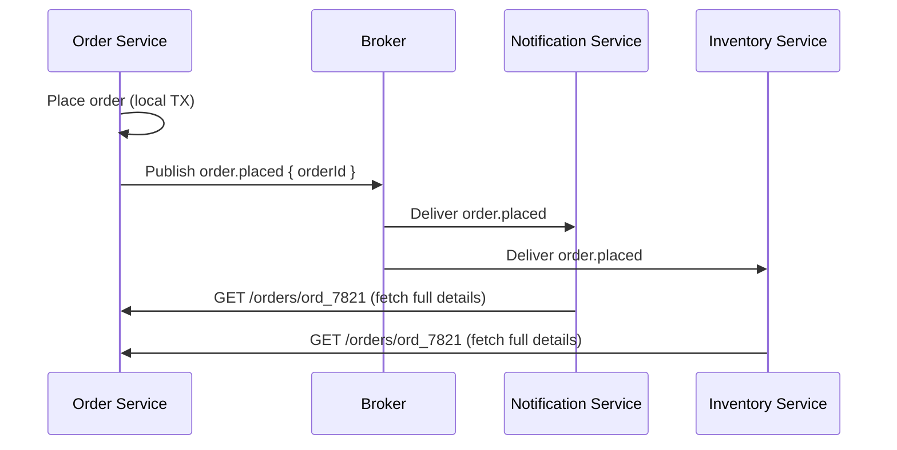

- **Pros**: Minimal payload, loose coupling, source of truth remains in the producer
- **Cons**: Callback creates runtime dependency on the producer; source must be available
- **Best for**: Lightweight notifications — "Hey, something happened, come check it out"

### 2. Event-Carried State Transfer (ECST)

Events carry **all the data** consumers need, eliminating callback requests. Consumers build and maintain their own read models from the event stream.

```json
// The event carries complete state
{
  "id": "evt_9a3f2b1c",
  "type": "order.placed",
  "data": {
    "orderId": "ord_7821",
    "customerId": "cust_4491",
    "customerEmail": "alice@example.com",
    "total": 124.5,
    "status": "placed",
    "items": [{ "productId": "prd_001", "name": "Widget Pro", "quantity": 2, "price": 49.99 }],
    "shippingAddress": { "street": "123 Main St", "city": "Austin", "zip": "78701" }
  }
}
```

- **Pros**: Zero runtime coupling; consumers are fully self-sufficient
- **Cons**: Larger payloads; data duplication across services; eventual consistency
- **Best for**: Microservices that need local queryable data without synchronous calls

### 3. Event Sourcing

Instead of storing the current state in a database, **store the sequence of events** that led to the current state. The state is derived by replaying events.

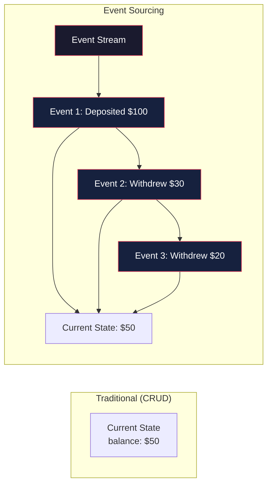

```typescript
// Event-sourced bank account
interface AccountEvent {
  type: 'deposited' | 'withdrew' | 'opened';
  amount: number;
  timestamp: string;
}

const events: AccountEvent[] = [
  { type: 'opened', amount: 0, timestamp: '2025-01-01T10:00:00Z' },
  { type: 'deposited', amount: 100, timestamp: '2025-01-02T09:00:00Z' },
  { type: 'withdrew', amount: 30, timestamp: '2025-01-03T14:00:00Z' },
  { type: 'withdrew', amount: 20, timestamp: '2025-01-05T11:00:00Z' },
];

// Rebuild current state by replaying all events
function rebuildState(events: AccountEvent[]): number {
  return events.reduce((balance, event) => {
    switch (event.type) {
      case 'opened':
      case 'deposited':
        return balance + event.amount;
      case 'withdrew':
        return balance - event.amount;
      default:
        return balance;
    }
  }, 0);
}

console.log(`Current balance: $${rebuildState(events)}`); // $50
```

**Key concepts:**

| Concept         | Description                                                                  |
| --------------- | ---------------------------------------------------------------------------- |
| **Event Store** | Append-only database of events (EventStoreDB, Kafka, PostgreSQL)             |
| **Snapshot**    | Periodic state snapshot to avoid replaying all events from the beginning     |
| **Projection**  | A read model built from events (e.g., current balance, monthly statement)    |
| **Replay**      | Rebuild state by re-processing events — great for bug fixes and new features |

- **Pros**: Full audit trail, temporal queries ("what was the balance on Tuesday?"), easy debugging
- **Cons**: Complex; eventual consistency; snapshots needed for performance; unfamiliar to many devs
- **Best for**: Financial systems, audit-heavy domains, collaborative apps

### 4. CQRS (Command Query Responsibility Segregation)

CQRS separates **write** operations (commands) from **read** operations (queries), often using entirely different data models and databases. It pairs naturally with Event Sourcing.

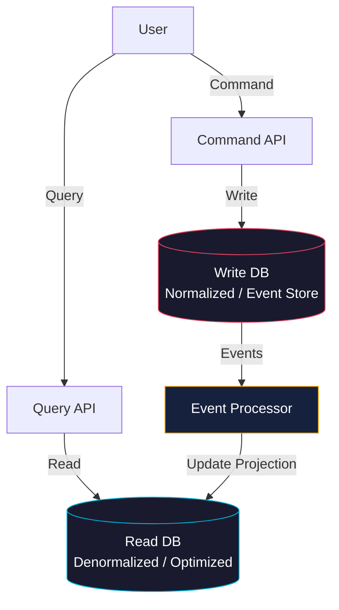

**Why separate?**

| Aspect       | Command Side (Write)                         | Query Side (Read)                       |
| ------------ | -------------------------------------------- | --------------------------------------- |
| **Goal**     | Enforce business rules, maintain consistency | Optimize for fast, flexible reads       |
| **Database** | Normalized, relational (or Event Store)      | Denormalized, materialized views, NoSQL |
| **Model**    | Domain model, aggregates                     | Read model, DTOs, flattened structures  |
| **Scaling**  | Scale by business capability                 | Scale based on read load, add replicas  |

```typescript
// Command side — enforces rules
async function placeOrder(command: PlaceOrderCommand): Promise<void> {
  const order = Order.create(command); // Domain logic, validation
  await eventStore.save(order.getUncommittedEvents());
  await eventBus.publish(order.getUncommittedEvents());
}

// Query side — optimized for reads
async function getOrderHistory(userId: string): Promise<OrderSummary[]> {
  // Reads from a denormalized, indexed table built by event projections
  return db.orderHistory.find({ userId }).sort({ date: -1 }).limit(20);
}
```

- **Pros**: Independent scaling of reads and writes; optimized data models for each; enables Event Sourcing
- **Cons**: Added complexity; eventual consistency between read and write sides; more infrastructure
- **Best for**: High read/write ratio systems, complex reporting, domains with Event Sourcing

### Pattern Selection Guide

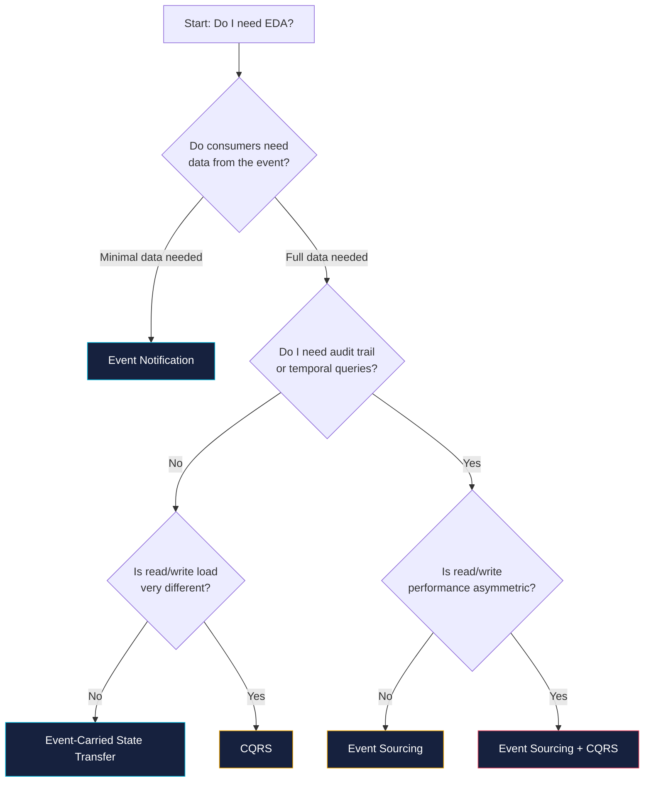

---

## Schema Design & Versioning

Events are long-lived contracts. An event published today might be consumed by services built years from now, or replayed months later. Schema design and versioning are critical.

### Schema Design Principles

| Principle                                | Explanation                                                                         |
| ---------------------------------------- | ----------------------------------------------------------------------------------- |
| **Use a schema registry**                | Centralize schema definitions (Confluent Schema Registry, AWS Glue, Apollo GraphQL) |
| **Prefer Avro / Protobuf / JSON Schema** | Binary formats (Avro, Protobuf) save space; JSON Schema is human-readable           |
| **Never delete fields**                  | Mark as deprecated instead — old consumers may depend on them                       |
| **Never change field types**             | `string` → `number` breaks everything. Add a new field instead                      |
| **Additive changes only**                | New fields are safe; renaming, removing, or re-typing fields is breaking            |
| **Include schema version**               | Every event must carry its schema version: `"schemaVersion": "1.2.0"`               |

### Avro Schema Example (with Confluent Schema Registry)

```json
// order-placed-v1.avsc — stored in Schema Registry
{
  "type": "record",
  "name": "OrderPlaced",
  "namespace": "com.example.orders",
  "version": "1",
  "fields": [
    { "name": "orderId", "type": "string" },
    { "name": "customerId", "type": "string" },
    { "name": "total", "type": "double" },
    { "name": "items", "type": { "type": "array", "items": "string" } }
  ]
}
```

```typescript
// Producer with Avro + Schema Registry
import { Kafka } from 'kafkajs';
import { SchemaRegistry } from '@kafkajs/confluent-schema-registry';

const registry = new SchemaRegistry({ host: 'http://localhost:8081' });
const kafka = new Kafka({ clientId: 'order-service', brokers: ['localhost:9092'] });
const producer = kafka.producer();

await producer.connect();

const avroMessage = await registry.encode(1001, {
  // schema ID
  orderId: 'ord_7821',
  customerId: 'cust_4491',
  total: 124.5,
  items: ['prd_001', 'prd_002'],
});

await producer.send({
  topic: 'order.placed',
  messages: [{ key: 'ord_7821', value: avroMessage }],
});
```

### Versioning Strategies

| Strategy | How it works | Pros | Cons |
| --- | --- | --- |
| **Backward compatible** | New schema can read data written by old schema | Safe to upgrade consumers first | Requires careful field additions |
| **Forward compatible** | Old schema can read data written by new schema | Safe to upgrade producers first | Requires default values for new fields |
| **Full compatible** | Both backward and forward compatible | Safe to upgrade in any order | Most restrictive |
| **No compatibility** | Breaking changes allowed | Simple, fast iteration | Requires coordinated upgrades and downtime |

**Compatibility matrix:**

| Change                | Backward | Forward | Full |
| --------------------- | :------: | :-----: | :--: |
| Add optional field    |    ✅    |   ✅    |  ✅  |
| Add required field    |    ✅    |   ❌    |  ❌  |
| Remove optional field |    ✅    |   ❌    |  ❌  |
| Remove required field |    ❌    |   ❌    |  ❌  |
| Change field type     |    ❌    |   ❌    |  ❌  |
| Rename field          |    ❌    |   ❌    |  ❌  |
| Add default value     |    ✅    |   ✅    |  ✅  |

### Handling Breaking Changes

When you absolutely must make a breaking change:

1. **Introduce a new event type** — `order.placed.v2` alongside `order.placed.v1`
2. **Dual-publish** both versions during the migration period
3. **Migrate consumers** to consume `v2` (they can consume both during transition)
4. **Retire `v1`** once all consumers have migrated
5. **Never delete the old schema** from the registry — historical events still need it

```typescript
// Dual-publish during migration
async function publishOrderPlaced(order: Order): Promise<void> {
  const v1Event = toOrderPlacedV1(order);
  const v2Event = toOrderPlacedV2(order);

  await Promise.all([
    producer.send({ topic: 'order.placed', messages: [{ key: order.id, value: v1Event }] }),
    producer.send({ topic: 'order.placed.v2', messages: [{ key: order.id, value: v2Event }] }),
  ]);
}
```

---

## Delivery Semantics

How many times can a consumer expect to receive a given event? The answer depends on the broker, configuration, and consumer implementation.

| Semantic          | Meaning                         | Guarantee                                                       |
| ----------------- | ------------------------------- | --------------------------------------------------------------- |
| **At-most-once**  | Event delivered 0 or 1 time     | No duplicates, but events may be lost                           |
| **At-least-once** | Event delivered 1 or more times | No data loss, but duplicates possible (default in most systems) |
| **Exactly-once**  | Event delivered exactly 1 time  | No loss, no duplicates — the holy grail, but expensive          |

### At-Least-Once in Practice

Most production systems use **at-least-once** delivery with **idempotent consumers**. Exactly-once is achievable with Kafka transactions and idempotent producers, but it adds significant latency and complexity.

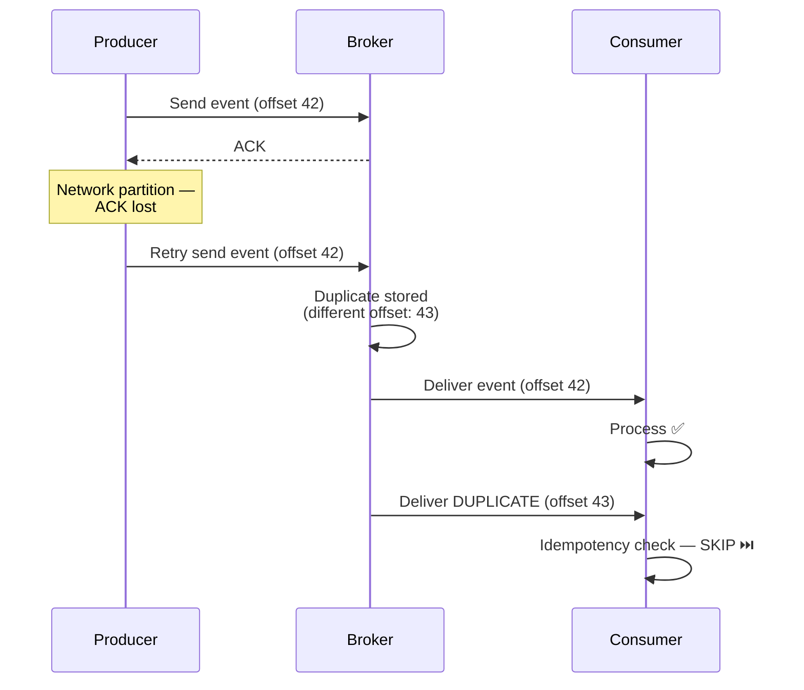

### Kafka Exactly-Once Semantics (EOS)

Kafka supports exactly-once through a combination of:

- **Idempotent producers**: Producer assigns a sequence number; broker deduplicates
- **Transactions**: Atomic writes across multiple topic-partitions
- **Read-Committed isolation**: Consumers only see committed (non-aborted) messages

```typescript
// Kafka exactly-once producer
const producer = kafka.producer({
  idempotent: true, // Enable idempotent producer
  transactionalId: 'order-txn', // Unique per producer instance
  maxInFlightRequests: 5, // Must be ≤ 5 for idempotent producer
});

await producer.connect();

// Start a transaction
const transaction = await producer.transaction();

try {
  await transaction.send({
    topic: 'order.placed',
    messages: [{ key: order.id, value: orderEvent }],
  });
  await transaction.send({
    topic: 'inventory.reserved',
    messages: [{ key: order.id, value: inventoryEvent }],
  });

  // Commit atomically — both topics get the messages, or neither
  await transaction.commit();
} catch (error) {
  await transaction.abort();
  throw error;
}
```

---

## Idempotent Consumers

An **idempotent consumer** can process the same event multiple times without changing the outcome beyond the first processing. This is _essential_ for at-least-once delivery systems.

### Implementation Strategies

**1. Event ID deduplication (most common):**

```typescript
// Store processed event IDs in Redis with TTL
async function isDuplicate(eventId: string): Promise<boolean> {
  // SET NX returns OK only if the key didn't exist
  const result = await redis.set(
    `processed:${eventId}`,
    '1',
    'NX',
    'EX',
    86400, // 24h TTL
  );
  return result !== 'OK'; // 'OK' means first time; null means duplicate
}

// Usage in consumer
if (await isDuplicate(event.id)) {
  logger.info({ eventId: event.id }, 'Skipping duplicate');
  return;
}
```

**2. Database upsert (natural key):**

```sql
-- Use a unique constraint on the natural key (not the event ID)
INSERT INTO orders (order_id, customer_id, total, status)
VALUES ('ord_7821', 'cust_4491', 124.50, 'placed')
ON CONFLICT (order_id) DO NOTHING;
```

**3. State check (optimistic concurrency):**

```typescript
// Use a version/sequence number to detect replays
async function applyPayment(event: PaymentAppliedEvent): Promise<void> {
  const invoice = await db.invoices.findOne({ id: event.data.invoiceId });

  // Skip if this payment has already been applied
  if (event.data.paymentSequence <= invoice.lastAppliedSequence) {
    logger.info('Payment already applied, skipping');
    return;
  }

  invoice.balance -= event.data.amount;
  invoice.lastAppliedSequence = event.data.paymentSequence;
  await db.invoices.save(invoice);
}
```

**4. Event sourcing (inherently idempotent):**

```typescript
// Replaying events is safe if your projections use upsert
async function projectOrderPlaced(event: OrderPlaced): Promise<void> {
  await db.orderProjections.upsert(
    { orderId: event.data.orderId }, // unique key
    { $set: { customerId: event.data.customerId, total: event.data.total, status: 'placed' } },
  );
}
```

### Idempotency Key Lifecycle

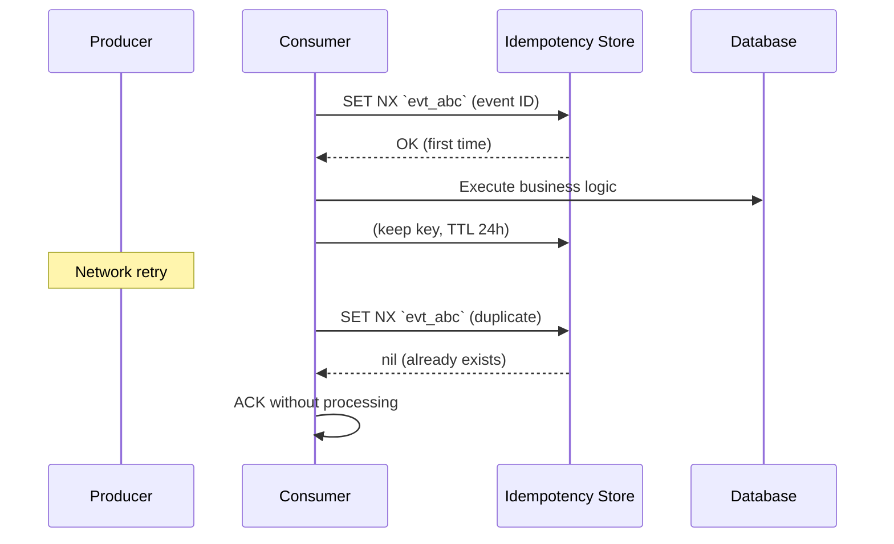

---

## Ordering & Partitioning

In distributed systems, maintaining strict global ordering is impossible without sacrificing throughput. Instead, we use **partitioning** to guarantee order within a logical boundary.

### How Kafka Partitions Work

```mermaid
graph LR
    subgraph "Topic: order.events (3 partitions)"
        P0[Partition 0<br/>keys: A, D, G]
        P1[Partition 1<br/>keys: B, E, H]
        P2[Partition 2<br/>keys: C, F, I]
    end

    A["Message A<br/>key: ord_001"] -->|hash(ord_001) % 3 = 0| P0
    B["Message B<br/>key: ord_002"] -->|hash(ord_002) % 3 = 1| P1
    C["Message C<br/>key: ord_003"] -->|hash(ord_003) % 3 = 2| P2
    D["Message D<br/>key: ord_001"] -->|hash(ord_001) % 3 = 0| P0

    style P0 fill:#1a1a2e,stroke:#e94560,color:#fff
    style P1 fill:#1a1a2e,stroke:#00b4d8,color:#fff
    style P2 fill:#1a1a2e,stroke:#f0a500,color:#fff
```

**Rule:** All events with the same partition key land in the same partition and are consumed in order. Events across different partitions have no ordering guarantee.

### Choosing a Partition Key

| Scenario                        | Partition Key        | Rationale                                                        |
| ------------------------------- | -------------------- | ---------------------------------------------------------------- |
| Order events for one order      | `orderId`            | All events for `ord_7821` stay ordered                           |
| User activity feed              | `userId`             | All events for one user are in order                             |
| Inventory updates per warehouse | `warehouseId`        | Stock changes per location stay ordered                          |
| Global ordering needed          | Single partition     | **Don't do this** — kills parallelism. Consider different design |
| No ordering needed              | Random / round-robin | Maximises parallelism across partitions                          |

### Handling Out-of-Order Events

Sometimes events arrive out of order (multiple producers, network delays). Strategies:

**1. Sequence numbers in the event:**

```typescript
// Consumer maintains last processed sequence per aggregate
async function handleEvent(event: OrderEvent): Promise<void> {
  const lastSeq = await getLastSequence(event.data.orderId);
  if (event.data.sequence <= lastSeq) {
    return; // Skip out-of-order event
  }
  await applyEvent(event);
  await setLastSequence(event.data.orderId, event.data.sequence);
}
```

**2. Buffering and reordering:**

```typescript
// Buffer events for a short window, then process in order
class ReorderBuffer {
  private buffer = new Map<string, StoredEvent[]>();
  private ttl = 5000; // 5 seconds

  add(event: StoredEvent): void {
    const key = event.partitionKey;
    const events = this.buffer.get(key) || [];
    events.push(event);
    events.sort((a, b) => a.sequence - b.sequence);
    this.buffer.set(key, events);
    setTimeout(() => this.flush(key), this.ttl);
  }

  private flush(key: string): void {
    const events = this.buffer.get(key) || [];
    events.forEach((e) => consumer.process(e));
    this.buffer.delete(key);
  }
}
```

### Consumer Groups & Partition Assignment

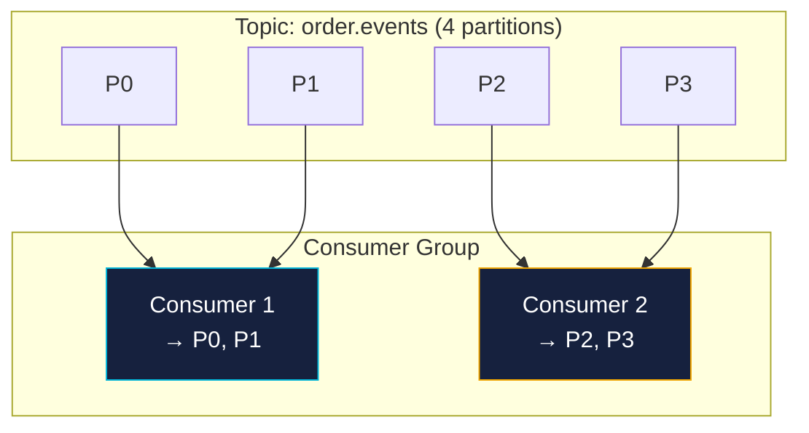

**Key rules:**

- Each partition is assigned to **exactly one** consumer per consumer group
- One consumer can handle **multiple** partitions
- Adding consumers beyond the partition count does nothing (they idle)
- If a consumer dies, its partitions are rebalanced to remaining consumers

---

## Broker Comparison

Choosing the right broker depends on your throughput, latency, ordering, and operational requirements.

| Criteria                   | Apache Kafka                                         | RabbitMQ                                       | NATS                                           | AWS EventBridge                          | Redis Streams                                      |
| -------------------------- | ---------------------------------------------------- | ---------------------------------------------- | ---------------------------------------------- | ---------------------------------------- | -------------------------------------------------- |
| **Type**                   | Distributed log                                      | Message queue (AMQP)                           | Message-oriented middleware                    | Serverless event bus                     | In-memory data structure                           |
| **Throughput**             | 🏆 Extremely high (millions msg/s)                   | High (tens of thousands msg/s)                 | Very high (millions msg/s)                     | Moderate (varies)                        | High (hundreds of thousands msg/s)                 |
| **Latency**                | Low (ms)                                             | Very low (sub-ms)                              | Ultra-low (μs)                                 | Moderate (10-100ms)                      | Very low (sub-ms)                                  |
| **Persistence**            | Disk (log segments, configurable retention)          | Disk or in-memory                              | In-memory (JetStream for persistence)          | Serverless (fully managed)               | Disk (append-only) or in-memory                    |
| **Ordering**               | Per partition ✅                                     | Per queue ✅                                   | Per subject (JetStream) ✅                     | Per event bus ❌                         | Per stream ✅                                      |
| **Replay**                 | ✅ Built in (seek to offset)                         | ❌ Not supported                               | ✅ JetStream                                   | ❌ Archived events only                  | ✅ By ID or time                                   |
| **Push/Pull**              | Pull-based (consumer polls)                          | Push-based (broker pushes)                     | Push and Pull                                  | Push-based (targets rules)               | Pull-based                                         |
| **Exactly-once**           | ✅ Transactions                                      | ❌ (at-least-once)                             | ❌ (at-least-once)                             | ❌ (at-least-once)                       | ❌ (at-least-once)                                 |
| **Protocol**               | Custom binary                                        | AMQP 0-9-1                                     | NATS protocol (text)                           | HTTP / custom                            | Redis protocol                                     |
| **Routing**                | Topic → Partition                                    | Exchange → Queue (flexible bindings)           | Subject-based (wildcards)                      | Event pattern matching                   | Consumer groups                                    |
| **Dead Letter**            | Manual (separate topic)                              | ✅ Built-in (DLX)                              | ✅ JetStream                                   | ✅ Built-in                              | Manual (separate stream)                           |
| **Scale Model**            | Add brokers (horizontal)                             | Add nodes (clustering)                         | Add nodes (clustering)                         | Serverless (auto)                        | Add nodes (clustering)                             |
| **Operational Complexity** | 🔴 High (ZooKeeper/KRaft, tuning)                    | 🟡 Medium                                      | 🟢 Low                                         | 🟢 Lowest (serverless)                   | 🟡 Medium                                          |
| **Best For**               | Event sourcing, high-throughput pipelines, streaming | Task queues, RPC, complex routing, low-latency | IoT, edge, service mesh, low-latency messaging | AWS-native serverless, SaaS integrations | Lightweight Kafka alternative, caching + streaming |

### Detailed Profiles

#### Apache Kafka

A distributed commit log designed for high-throughput, durable event streaming. Kafka stores events in append-only log segments on disk, partitioned for parallelism.

```yaml
# docker-compose.yml — minimal single-node Kafka
services:
  kafka:
    image: confluentinc/cp-kafka:7.6.0
    environment:
      KAFKA_NODE_ID: 1
      KAFKA_LISTENERS: 'PLAINTEXT://:9092,CONTROLLER://:9093'
      KAFKA_ADVERTISED_LISTENERS: 'PLAINTEXT://localhost:9092'
      KAFKA_PROCESS_ROLES: 'broker,controller'
      KAFKA_CONTROLLER_QUORUM_VOTERS: '1@localhost:9093'
      KAFKA_LOG_DIRS: '/tmp/kafka-logs'
    ports:
      - '9092:9092'
```

- **Use when**: You need high throughput, event replay, event sourcing, or stream processing (Kafka Streams, ksqlDB)
- **Avoid when**: You need ultra-low latency (&lt;1ms), simple task queues, or minimal operational overhead

#### RabbitMQ

A mature, battle-tested message broker implementing AMQP. Uses exchanges and queues with flexible routing patterns.

```yaml
# docker-compose.yml — RabbitMQ with management UI
services:
  rabbitmq:
    image: rabbitmq:3.13-management
    environment:
      RABBITMQ_DEFAULT_USER: admin
      RABBITMQ_DEFAULT_PASS: admin
    ports:
      - '5672:5672' # AMQP
      - '15672:15672' # Management UI
```

- **Use when**: You need reliable task queues, complex routing (topic, fanout, header exchanges), or RPC
- **Avoid when**: You need event replay, extremely high throughput, or long-term event persistence

#### NATS

A lightweight, high-performance messaging system. Core NATS offers at-most-once; JetStream adds persistence and at-least-once.

- **Use when**: You need ultra-low latency, edge/IoT messaging, service mesh, or simple pub-sub
- **Avoid when**: You need complex routing, long-term persistence with replay, or a large ecosystem of tooling

#### AWS EventBridge

A serverless event bus that routes events from AWS services, SaaS applications, and custom apps. Pay-per-event, zero infrastructure management.

- **Use when**: You're all-in on AWS, need SaaS integrations (Zendesk, Datadog, Stripe), or want zero operational overhead
- **Avoid when**: You need predictable latency, high throughput at a fixed cost, on-premises deployment, or custom broker behavior

#### Redis Streams

Redis Streams is an append-only log data structure built into Redis. It provides Kafka-like streaming with Redis's simplicity and speed.

- **Use when**: You already use Redis, want lightweight streaming, or need both caching and messaging in one system
- **Avoid when**: You need strong durability guarantees, large-scale distributed streaming, or a rich ecosystem of connectors

---

## Saga Pattern

A **Saga** is a distributed transaction pattern that manages a long-running business process spanning multiple services. Since distributed ACID transactions are impractical (and an anti-pattern in microservices), Sagas break the process into a sequence of local transactions, each with a compensating action for rollback.

### Choreography vs Orchestration

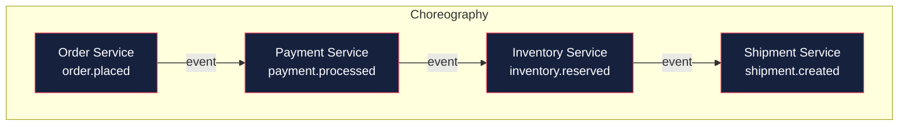

```mermaid
graph TD
    subgraph "Orchestration"
        O[🧠 Order Saga<br/>Orchestrator]

        OS2[Order Service]
        PS2[Payment Service]
        IS2[Inventory Service]
        SS2[Shipment Service]

        O -->|1. Create Order| OS2
        OS2 -->|Order Created| O
        O -->|2. Process Payment| PS2
        PS2 -->|Payment Done| O
        O -->|3. Reserve Inventory| IS2
        IS2 -->|Reserved| O
        O -->|4. Create Shipment| SS2
        SS2 -->|Shipment Created| O

        style O fill:#1a1a2e,stroke:#f0a500,stroke-width:3px,color:#fff
        style OS2 fill:#16213e,stroke:#e94560,color:#fff
        style PS2 fill:#16213e,stroke:#e94560,color:#fff
        style IS2 fill:#16213e,stroke:#e94560,color:#fff
        style SS2 fill:#16213e,stroke:#e94560,color:#fff
```

| Aspect               | Choreography                                                     | Orchestration                                            |
| -------------------- | ---------------------------------------------------------------- | -------------------------------------------------------- |
| **Control**          | Decentralized — each service knows its next step                 | Centralized — orchestrator manages the workflow          |
| **Coupling**         | Low at runtime, but services must agree on event contracts       | Orchestrator couples to each service's API               |
| **Visibility**       | Hard to understand the full flow (events everywhere)             | Central place to see workflow status                     |
| **Failure handling** | Each service handles its own compensations; complex coordination | Orchestrator manages retries and compensations centrally |
| **Complexity**       | Simple for 2-3 steps; exponential growth with more steps         | Linear growth — orchestrator complexity grows with steps |
| **Testing**          | Harder — need to test event chains                               | Easier — orchestrator can be tested in isolation         |
| **Best for**         | Simple, linear flows with few services                           | Complex workflows, branching logic, human-in-the-loop    |

### Choreography Example (Kafka)

```typescript
// ── Order Service ──
async function placeOrder(cmd: PlaceOrderCommand): Promise<void> {
  const order = await db.orders.create(cmd);
  await producer.send({
    topic: 'order.placed',
    messages: [{ key: order.id, value: JSON.stringify(event) }],
  });
}

// ── Payment Service (listens for order.placed) ──
async function handleOrderPlaced(event: OrderPlaced): Promise<void> {
  try {
    const payment = await paymentGateway.charge(event.data.total);
    await producer.send({
      topic: 'payment.processed',
      messages: [
        { key: event.data.orderId, value: JSON.stringify({ ...event, paymentId: payment.id }) },
      ],
    });
  } catch (error) {
    // Compensating action — nothing to undo yet, just publish failure
    await producer.send({
      topic: 'payment.failed',
      messages: [
        {
          key: event.data.orderId,
          value: JSON.stringify({ orderId: event.data.orderId, reason: error.message }),
        },
      ],
    });
  }
}

// ── Order Service (listens for payment.failed) ──
async function handlePaymentFailed(event: PaymentFailed): Promise<void> {
  await db.orders.update(event.data.orderId, { status: 'payment_failed' });
  // Optionally notify customer
}
```

### Orchestration Example (State Machine)

```typescript
// ── Saga Orchestrator (using a state machine) ──
type SagaState = 'created' | 'payment_processed' | 'inventory_reserved' | 'shipped' | 'failed';

interface SagaInstance {
  sagaId: string;
  orderId: string;
  state: SagaState;
  data: Record<string, any>;
  compensations: (() => Promise<void>)[];
}

async function createOrderSaga(cmd: PlaceOrderCommand): Promise<void> {
  const saga: SagaInstance = {
    sagaId: uuid(),
    orderId: uuid(),
    state: 'created',
    data: cmd,
    compensations: [],
  };

  await saveSaga(saga);
  await processSaga(saga);
}

async function processSaga(saga: SagaInstance): Promise<void> {
  try {
    // Step 1: Create Order
    saga.state = 'payment_processed';
    await orderService.create({ orderId: saga.orderId, ...saga.data });
    saga.compensations.push(async () => await orderService.cancel(saga.orderId));

    // Step 2: Process Payment
    const payment = await paymentService.charge({ orderId: saga.orderId, amount: saga.data.total });
    saga.compensations.push(async () => await paymentService.refund(payment.id));

    // Step 3: Reserve Inventory
    await inventoryService.reserve({ orderId: saga.orderId, items: saga.data.items });
    saga.compensations.push(async () => await inventoryService.release(saga.orderId));

    // Step 4: Create Shipment
    await shipmentService.create({ orderId: saga.orderId, address: saga.data.shippingAddress });

    saga.state = 'shipped';
    await saveSaga(saga);
  } catch (error) {
    logger.error({ sagaId: saga.sagaId, error }, 'Saga failed — running compensations');
    saga.state = 'failed';
    await saveSaga(saga);

    // Run compensations in reverse order (LIFO)
    for (const compensation of saga.compensations.reverse()) {
      try {
        await compensation();
      } catch (compError) {
        logger.error(
          { sagaId: saga.sagaId, compError },
          'Compensation failed — manual intervention required',
        );
        // Write to dead-letter / alert ops team
      }
    }
  }
}
```

### Saga Failure Modes

| Failure                      | Mitigation                                                                       |
| ---------------------------- | -------------------------------------------------------------------------------- |
| **Compensation also fails**  | Retry with backoff; eventually escalate to DLT and alert a human                 |
| **Orchestrator crashes**     | Persist saga state in a database; restart from last checkpoint                   |
| **Duplicate saga execution** | Use unique saga ID; make all steps idempotent                                    |
| **Event lost between steps** | Use persistent broker; implement saga timeout and resend                         |
| **Stuck saga**               | Implement saga timeout — if saga isn't completed in N minutes, run compensations |

---

## Outbox Pattern

The **Outbox Pattern** solves the dual-write problem: how to atomically update a database and publish an event without distributed transactions.

### The Problem

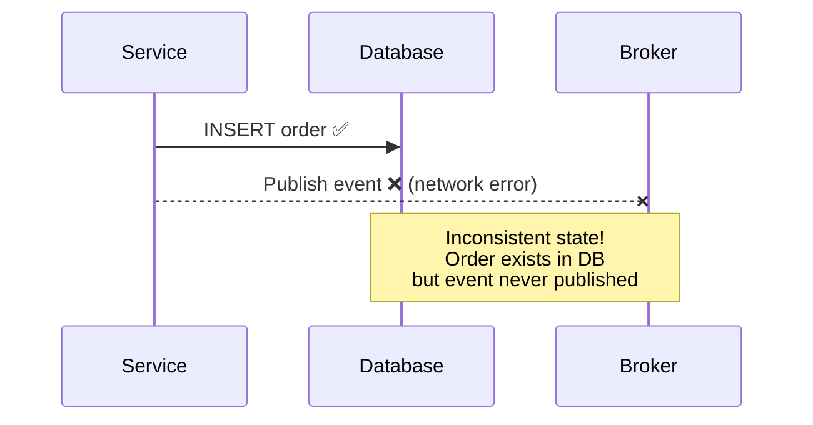

If you update the database and publish an event separately, one can fail while the other succeeds — leading to inconsistent state.

### The Solution

Write the event to an **outbox table** within the same database transaction as the business data. A separate process **(the relay/polling publisher)** reads from the outbox table and publishes to the broker.

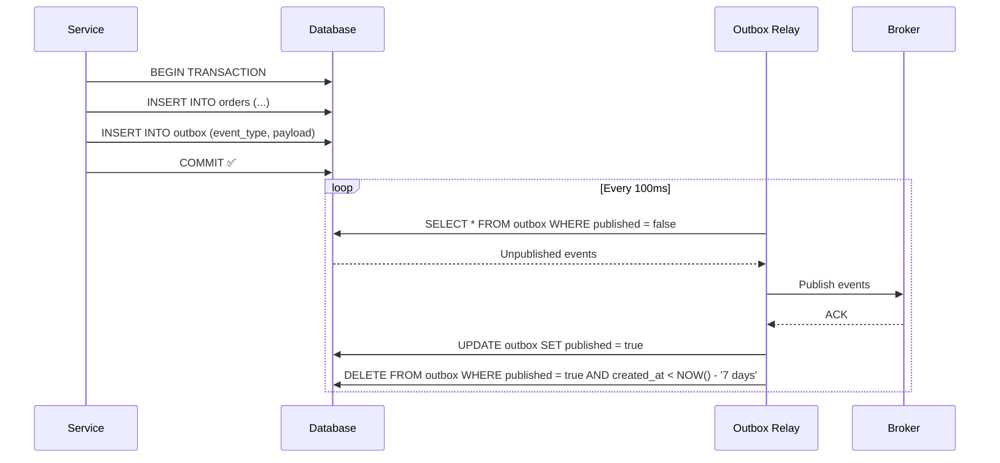

### Implementation

**Database schema:**

```sql
CREATE TABLE outbox (
    id          BIGSERIAL PRIMARY KEY,
    event_type  VARCHAR(255) NOT NULL,
    aggregate_id VARCHAR(255) NOT NULL,
    payload     JSONB NOT NULL,
    created_at  TIMESTAMPTZ DEFAULT NOW(),
    published   BOOLEAN DEFAULT FALSE
);

CREATE INDEX idx_outbox_published ON outbox (published, created_at);
```

**Writing to the outbox (inside the business transaction):**

```typescript
async function placeOrder(cmd: PlaceOrderCommand): Promise<void> {
  const pool = await getDbPool();
  const client = await pool.connect();

  try {
    await client.query('BEGIN');

    // Business operation
    const order = await client.query(
      'INSERT INTO orders (customer_id, total, status) VALUES ($1, $2, $3) RETURNING id',
      [cmd.customerId, cmd.total, 'placed'],
    );
    const orderId = order.rows[0].id;

    // Outbox event — same transaction!
    await client.query(
      'INSERT INTO outbox (event_type, aggregate_id, payload) VALUES ($1, $2, $3)',
      [
        'order.placed',
        orderId,
        JSON.stringify({ orderId, customerId: cmd.customerId, total: cmd.total }),
      ],
    );

    await client.query('COMMIT');
  } catch (error) {
    await client.query('ROLLBACK');
    throw error;
  } finally {
    client.release();
  }
}
```

**Outbox relay (polling publisher):**

```typescript
import { Kafka } from 'kafkajs';

const kafka = new Kafka({ clientId: 'outbox-relay', brokers: ['localhost:9092'] });
const producer = kafka.producer();

async function pollOutbox(): Promise<void> {
  await producer.connect();

  setInterval(async () => {
    const client = await getDbPool().connect();
    try {
      await client.query('BEGIN');

      // Lock a batch of unpublished events (prevents duplicate publishing with multiple relays)
      const { rows } = await client.query(
        `SELECT id, event_type, aggregate_id, payload
         FROM outbox
         WHERE published = FALSE
         ORDER BY id
         LIMIT 100
         FOR UPDATE SKIP LOCKED`,
      );

      for (const row of rows) {
        await producer.send({
          topic: row.event_type,
          messages: [
            {
              key: row.aggregate_id,
              value: row.payload,
              headers: { 'message-id': `outbox-${row.id}` },
            },
          ],
        });

        // Delete published event (or mark as published and clean up later)
        await client.query('DELETE FROM outbox WHERE id = $1', [row.id]);
      }

      await client.query('COMMIT');
    } catch (error) {
      await client.query('ROLLBACK');
      logger.error({ error }, 'Outbox relay error');
    } finally {
      client.release();
    }
  }, 100); // Poll every 100ms — adjust based on latency requirements
}
```

### Outbox Variants

| Variant                       | Description                                               | Best For                                  |
| ----------------------------- | --------------------------------------------------------- | ----------------------------------------- |
| **Polling publisher**         | Application polls outbox table on interval                | Simple, works with any DB                 |
| **CDC (Change Data Capture)** | Use Debezium to tail the DB WAL; publish changes to Kafka | Zero code, low latency, needs CDC tooling |
| **Transactional log tailing** | Kafka Connect JDBC connector reads outbox table           | Kafka-native, no custom relay code        |

### Outbox Gotchas

- **Ordering**: Poll in `id` order, publish sequentially per aggregate to preserve ordering
- **Duplicates**: Use `FOR UPDATE SKIP LOCKED` with multiple relay instances to avoid double-publishing
- **Cleanup**: Periodically delete old published rows or use a partitioned table
- **Latency**: Polling introduces 100-500ms latency; CDC reduces this to near real-time
- **Database load**: Batch reads and tune the polling interval

---

## Dead Letter Topics (DLT / DLQ)

A **Dead Letter Topic** (or Queue) is a destination for events that cannot be processed successfully after all retries are exhausted. It prevents "poison pill" events from blocking the entire stream.

### Dead Letter Flow

```mermaid
flowchart TD
    E[Event Arrives] --> P{Process?}
    P -->|Success| A[ACK ✅]
    P -->|Failure| R{Retries < Max?}
    R -->|Yes| W[Wait (backoff)]
    W --> P
    R -->|No| DLT[Dead Letter Topic 💀]
    DLT --> M[Monitor / Alert]
    DLT --> O[Manual Inspection / Replay]

    style DLT fill:#3d0000,stroke:#e94560,stroke-width:2px,color:#fff
    style M fill:#16213e,stroke:#f0a500,color:#fff
```

### Kafka Implementation

```typescript
import { Kafka, Consumer } from 'kafkajs';

const kafka = new Kafka({ clientId: 'resilient-consumer', brokers: ['localhost:9092'] });
const consumer = kafka.consumer({ groupId: 'order-processor' });
const dlqProducer = kafka.producer();

const MAX_RETRIES = 3;
const RETRY_BACKOFF_MS = [1000, 5000, 15000]; // Exponential: 1s, 5s, 15s

async function startConsumer(): Promise<void> {
  await consumer.connect();
  await dlqProducer.connect();
  await consumer.subscribe({ topic: 'order.placed', fromBeginning: false });

  await consumer.run({
    eachMessage: async ({ topic, partition, message, heartbeat }) => {
      const event = JSON.parse(message.value!.toString());
      const retryCount = parseInt(message.headers?.['retry-count']?.toString() || '0', 10);

      try {
        await processEvent(event);
        // Success — ACK is automatic in auto-commit mode
      } catch (error) {
        if (retryCount >= MAX_RETRIES) {
          // Exhausted retries — send to DLT
          logger.error({ event, retryCount, error }, 'Moving to dead letter topic');
          await dlqProducer.send({
            topic: 'order.placed.dlt',
            messages: [
              {
                key: message.key!,
                value: message.value!,
                headers: {
                  ...message.headers,
                  'original-topic': topic,
                  'error-message': error.message,
                  'dead-lettered-at': new Date().toISOString(),
                },
              },
            ],
          });
        } else {
          // Retry — publish back with incremented retry count and delay
          logger.warn({ eventId: event.id, retryCount, error }, 'Retrying event');
          await dlqProducer.send({
            topic: `order.placed.retry.${retryCount + 1}`,
            messages: [
              {
                key: message.key!,
                value: message.value!,
                headers: {
                  ...message.headers,
                  'retry-count': String(retryCount + 1),
                  'original-topic': topic,
                },
              },
            ],
          });
        }
      }
    },
  });
}

// Separate consumer for retry topics (with built-in delay via topic naming convention)
async function setupRetryConsumers(): Promise<void> {
  for (let i = 1; i <= MAX_RETRIES; i++) {
    const retryConsumer = kafka.consumer({ groupId: `retry-consumer-${i}` });
    await retryConsumer.connect();

    // These topics are consumed after a delay (managed by topic retention or external scheduler)
    await retryConsumer.subscribe({ topic: `order.placed.retry.${i}`, fromBeginning: false });

    await retryConsumer.run({
      eachMessage: async ({ message }) => {
        // Re-post to the original topic for re-processing
        const originalTopic = message.headers?.['original-topic']?.toString() || 'order.placed';
        await dlqProducer.send({
          topic: originalTopic,
          messages: [
            {
              key: message.key!,
              value: message.value!,
              headers: message.headers,
            },
          ],
        });
      },
    });
  }
}
```

### DLT Best Practices

| Practice                   | Description                                                                         |
| -------------------------- | ----------------------------------------------------------------------------------- |
| **Alert on DLT**           | Every event in DLT should trigger an alert — something is broken                    |
| **Preserve headers**       | Store original topic, partition, offset, error message, timestamp                   |
| **Replay capability**      | Build a tool to re-drive DLT events back to the original topic after fixing the bug |
| **Monitor DLT depth**      | A growing DLT is a symptom of a systemic issue                                      |
| **TTL for DLT**            | Auto-delete events after N days to avoid unbounded storage                          |
| **Separate DLT per topic** | `order.placed.dlt`, `payment.processed.dlt` — easier to diagnose                    |

---

## Complete Kafka Example: Order Processing System

Let's tie everything together with a realistic example — an e-commerce order processing system using Kafka with the Outbox pattern, idempotent consumers, and dead letter handling.

### System Architecture

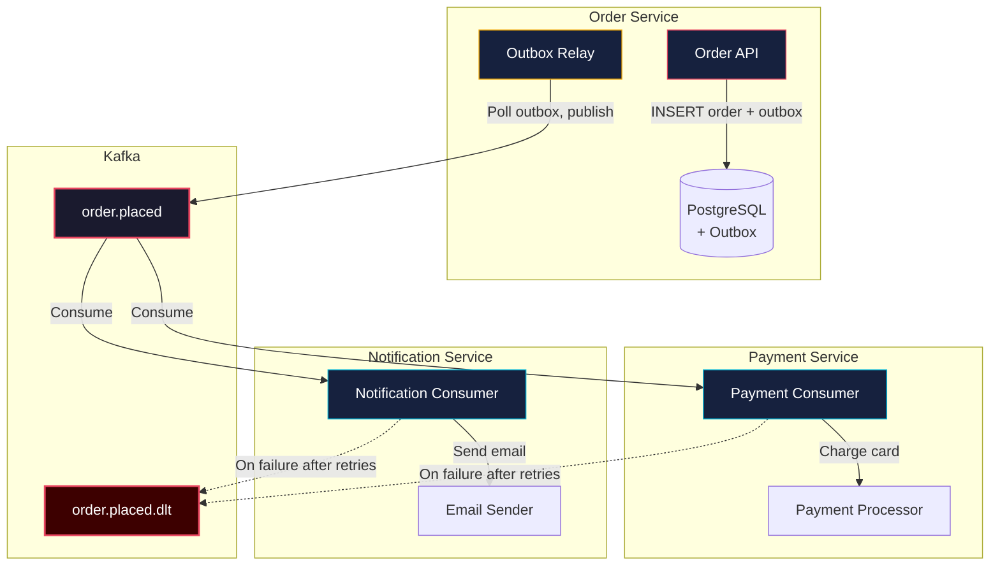

### Full Implementation

**1. Project structure:**

```
order-service/
├── src/
│   ├── api/
│   │   └── orders.ts          # Express route handlers
│   ├── db/
│   │   ├── pool.ts            # PostgreSQL connection pool
│   │   └── migrations/
│   │       └── 001_create_outbox.sql
│   ├── events/
│   │   └── types.ts           # Event type definitions
│   ├── outbox/
│   │   └── relay.ts           # Outbox polling publisher
│   ├── consumers/
│   │   └── payment-failed.ts  # Handles compensating events
│   └── index.ts               # Entry point
├── docker-compose.yml
└── package.json
```

**2. Database migration:**

```sql
-- 001_create_outbox.sql
CREATE TABLE orders (
    id          UUID PRIMARY KEY,
    customer_id UUID NOT NULL,
    total       DECIMAL(10,2) NOT NULL,
    status      VARCHAR(50) NOT NULL DEFAULT 'placed',
    created_at  TIMESTAMPTZ DEFAULT NOW()
);

CREATE TABLE outbox (
    id           BIGSERIAL PRIMARY KEY,
    event_type   VARCHAR(255) NOT NULL,
    aggregate_id UUID NOT NULL,
    payload      JSONB NOT NULL,
    created_at   TIMESTAMPTZ DEFAULT NOW()
);

CREATE INDEX idx_outbox_created ON outbox (created_at);
```

**3. Event types:**

```typescript
// src/events/types.ts
export interface OrderPlaced {
  id: string;
  type: 'order.placed';
  source: 'order-service';
  schemaVersion: '1.0.0';
  timestamp: string;
  data: {
    orderId: string;
    customerId: string;
    total: number;
    items: Array<{ productId: string; quantity: number; price: number }>;
  };
}

export interface PaymentFailed {
  id: string;
  type: 'payment.failed';
  source: 'payment-service';
  schemaVersion: '1.0.0';
  timestamp: string;
  data: {
    orderId: string;
    reason: string;
  };
}
```

**4. Order API (with outbox):**

```typescript
// src/api/orders.ts
import { Router, Request, Response } from 'express';
import { v4 as uuid } from 'uuid';
import { pool } from '../db/pool';

const router = Router();

router.post('/orders', async (req: Request, res: Response) => {
  const { customerId, items } = req.body;
  const orderId = uuid();
  const total = items.reduce((sum: number, item: any) => sum + item.price * item.quantity, 0);

  const eventId = uuid();
  const event: any = {
    id: eventId,
    type: 'order.placed',
    source: 'order-service',
    schemaVersion: '1.0.0',
    timestamp: new Date().toISOString(),
    data: { orderId, customerId, total, items },
  };

  const client = await pool.connect();
  try {
    await client.query('BEGIN');

    // Business write
    await client.query('INSERT INTO orders (id, customer_id, total) VALUES ($1, $2, $3)', [
      orderId,
      customerId,
      total,
    ]);

    // Outbox write — atomic with the above
    await client.query(
      'INSERT INTO outbox (event_type, aggregate_id, payload) VALUES ($1, $2, $3)',
      [event.type, orderId, JSON.stringify(event)],
    );

    await client.query('COMMIT');
    res.status(201).json({ orderId, status: 'placed', total });
  } catch (error) {
    await client.query('ROLLBACK');
    throw error;
  } finally {
    client.release();
  }
});

export default router;
```

**5. Outbox relay:**

```typescript
// src/outbox/relay.ts
import { Kafka, Producer } from 'kafkajs';
import { pool } from '../db/pool';

const kafka = new Kafka({ clientId: 'outbox-relay', brokers: ['localhost:9092'] });
let producer: Producer;

export async function startOutboxRelay(): Promise<void> {
  producer = kafka.producer();
  await producer.connect();

  console.log('📬 Outbox relay started');

  setInterval(async () => {
    const client = await pool.connect();
    try {
      await client.query('BEGIN');
      const { rows } = await client.query(
        `DELETE FROM outbox
         WHERE id IN (
           SELECT id FROM outbox
           ORDER BY id
           LIMIT 100
           FOR UPDATE SKIP LOCKED
         )
         RETURNING *`,
      );

      if (rows.length > 0) {
        const messages = rows.map((row: any) => {
          const payload =
            typeof row.payload === 'string' ? row.payload : JSON.stringify(row.payload);
          return {
            key: row.aggregate_id,
            value: payload,
            headers: { 'message-id': `outbox-${row.id}` },
          };
        });

        await producer.send({
          topic: 'order.placed',
          messages,
        });

        console.log(`📤 Published ${rows.length} events`);
      }

      await client.query('COMMIT');
    } catch (error) {
      await client.query('ROLLBACK');
      console.error('Outbox relay error:', error);
    } finally {
      client.release();
    }
  }, 100);
}
```

**6. Consumer with idempotency and DLT:**

```typescript
// src/consumers/payment-consumer.ts (in payment-service)
import { Kafka } from 'kafkajs';
import Redis from 'ioredis';

const kafka = new Kafka({ clientId: 'payment-service', brokers: ['localhost:9092'] });
const redis = new Redis({ host: 'localhost', port: 6379 });

const MAX_RETRIES = 3;

export async function startPaymentConsumer(): Promise<void> {
  const consumer = kafka.consumer({ groupId: 'payment-processor' });
  const dlq = kafka.producer();

  await consumer.connect();
  await dlq.connect();
  await consumer.subscribe({ topic: 'order.placed', fromBeginning: false });

  await consumer.run({
    eachMessage: async ({ message }) => {
      const event = JSON.parse(message.value!.toString());
      const messageId = message.headers?.['message-id']?.toString() || event.id;
      const retryCount = parseInt(message.headers?.['retry-count']?.toString() || '0', 10);

      try {
        // ── Idempotency check ──
        const isDuplicate = await redis.get(`processed:${messageId}`);
        if (isDuplicate) {
          console.log(`⏭️  Duplicate: ${messageId}`);
          return;
        }

        // ── Process payment ──
        console.log(`💳 Processing payment for order ${event.data.orderId}`);
        const paymentResult = await processPayment(event.data);

        // ── Mark as processed ──
        await redis.set(`processed:${messageId}`, '1', 'EX', 86400);

        // ── Publish success event ──
        await dlq.send({
          topic: 'payment.processed',
          messages: [
            {
              key: event.data.orderId,
              value: JSON.stringify({
                id: `evt_${Date.now()}`,
                type: 'payment.processed',
                source: 'payment-service',
                schemaVersion: '1.0.0',
                timestamp: new Date().toISOString(),
                data: { orderId: event.data.orderId, paymentId: paymentResult.id },
              }),
            },
          ],
        });
      } catch (error: any) {
        console.error(`❌ Error processing ${messageId}:`, error.message);

        if (retryCount >= MAX_RETRIES) {
          // ── Dead letter ──
          await dlq.send({
            topic: 'order.placed.dlt',
            messages: [
              {
                key: message.key!,
                value: message.value!,
                headers: {
                  ...message.headers,
                  'retry-count': String(retryCount),
                  'original-topic': 'order.placed',
                  error: error.message,
                  'dead-lettered-at': new Date().toISOString(),
                },
              },
            ],
          });
          console.log(`💀 Sent to DLT: ${messageId}`);
        } else {
          // ── Retry ──
          await dlq.send({
            topic: 'order.placed',
            messages: [
              {
                key: message.key!,
                value: message.value!,
                headers: {
                  ...message.headers,
                  'retry-count': String(retryCount + 1),
                },
              },
            ],
          });
          console.log(`🔁 Retry ${retryCount + 1}/${MAX_RETRIES}: ${messageId}`);
        }
      }
    },
  });
}

async function processPayment(orderData: any): Promise<{ id: string }> {
  // Simulate payment processing
  if (Math.random() < 0.1) throw new Error('Payment gateway timeout');
  return { id: `pay_${Date.now()}` };
}
```

**7. Compensation handler (in order-service):**

```typescript
// src/consumers/payment-failed.ts
import { Kafka } from 'kafkajs';
import { pool } from '../db/pool';

const kafka = new Kafka({ clientId: 'order-service', brokers: ['localhost:9092'] });

export async function startPaymentFailedConsumer(): Promise<void> {
  const consumer = kafka.consumer({ groupId: 'order-compensation' });
  await consumer.connect();
  await consumer.subscribe({ topic: 'payment.failed', fromBeginning: false });

  await consumer.run({
    eachMessage: async ({ message }) => {
      const event = JSON.parse(message.value!.toString());
      const orderId = event.data.orderId;

      // Compensating action: mark order as failed
      await pool.query('UPDATE orders SET status = $1 WHERE id = $2', ['payment_failed', orderId]);

      console.log(`🔙 Compensation: Order ${orderId} marked as payment_failed`);
    },
  });
}
```

---

## Testing Event-Driven Systems

Testing event-driven systems requires a different approach than testing REST APIs. You're testing asynchronous, eventually consistent flows.

### Testing Strategies

| Level                | What to test                                          | Tools                           |
| -------------------- | ----------------------------------------------------- | ------------------------------- |
| **Unit test**        | Consumer/producer logic in isolation (mock broker)    | Jest, Vitest, Sinon             |
| **Integration test** | Real broker (Testcontainers Kafka), real DB           | Testcontainers, Docker Compose  |
| **End-to-end**       | Full saga workflow across multiple services           | Docker Compose, wait-for-expect |
| **Chaos test**       | Network partitions, broker restarts, consumer crashes | Toxiproxy, Chaos Mesh           |

### Integration Test Example (Testcontainers + Kafka)

```typescript
import { Kafka } from 'kafkajs';
import { GenericContainer, StartedTestContainer } from 'testcontainers';
import { startOutboxRelay } from '../src/outbox/relay';

describe('Order Processing Integration', () => {
  let kafkaContainer: StartedTestContainer;
  let kafka: Kafka;

  beforeAll(async () => {
    // Start Kafka in Docker
    kafkaContainer = await new GenericContainer('confluentinc/cp-kafka:7.6.0')
      .withExposedPorts(9092)
      .withEnvironment({
        KAFKA_NODE_ID: '1',
        KAFKA_LISTENERS: 'PLAINTEXT://:9092,CONTROLLER://:9093',
        KAFKA_ADVERTISED_LISTENERS: 'PLAINTEXT://localhost:9092',
        KAFKA_PROCESS_ROLES: 'broker,controller',
        KAFKA_CONTROLLER_QUORUM_VOTERS: '1@localhost:9093',
      })
      .start();

    const host = kafkaContainer.getHost();
    const port = kafkaContainer.getMappedPort(9092);

    kafka = new Kafka({ clientId: 'test', brokers: [`${host}:${port}`] });
  }, 30000);

  afterAll(async () => {
    await kafkaContainer.stop();
  });

  it('should publish order.placed event when an order is created', async () => {
    // Arrange: Create a test consumer
    const consumer = kafka.consumer({ groupId: 'test-group' });
    await consumer.connect();
    await consumer.subscribe({ topic: 'order.placed', fromBeginning: true });

    const receivedEvents: any[] = [];
    await consumer.run({
      eachMessage: async ({ message }) => {
        receivedEvents.push(JSON.parse(message.value!.toString()));
      },
    });

    // Act: Insert into outbox (simulating order creation)
    await pool.query(
      `INSERT INTO outbox (event_type, aggregate_id, payload)
       VALUES ($1, $2, $3)`,
      ['order.placed', 'ord_test', JSON.stringify({ orderId: 'ord_test', total: 100 })],
    );

    // Wait for outbox relay to publish
    await new Promise((resolve) => setTimeout(resolve, 500));

    // Assert
    expect(receivedEvents.length).toBeGreaterThanOrEqual(1);
    expect(receivedEvents[0].type).toBe('order.placed');

    await consumer.disconnect();
  });
});
```

---

## Monitoring & Observability

Event-driven systems need monitoring across all layers — brokers, producers, consumers, and the events themselves.

### Key Metrics

| Layer        | Metric                      | Why it matters                                    |
| ------------ | --------------------------- | ------------------------------------------------- |
| **Broker**   | Bytes in/out per second     | Throughput monitoring                             |
| **Broker**   | Under-replicated partitions | Data loss risk                                    |
| **Broker**   | Active controller count     | Should always be exactly 1                        |
| **Producer** | Record send rate            | Is the producer healthy?                          |
| **Producer** | Record error rate           | Network issues, broker unavailable                |
| **Producer** | Request latency (p95, p99)  | Broker performance                                |
| **Consumer** | Records consumed rate       | Is the consumer keeping up?                       |
| **Consumer** | Consumer lag                | **Most critical** — are consumers falling behind? |
| **Consumer** | Processing error rate       | Bugs, downstream failures                         |
| **Consumer** | DLT depth                   | Unprocessable events accumulating                 |
| **Event**    | End-to-end latency          | Time from production to consumption completion    |

### Consumer Lag Alerting

```typescript
// Health check that exposes consumer lag
import { Kafka } from 'kafkajs';

async function getConsumerLag(groupId: string, topic: string): Promise<number> {
  const kafka = new Kafka({ clientId: 'monitoring', brokers: ['localhost:9092'] });
  const admin = kafka.admin();
  await admin.connect();

  const groups = await admin.describeGroups([groupId]);
  const offsets = await admin.fetchTopicOffsets(topic);
  const groupOffsets = await admin.fetchOffsets({ groupId, topics: [topic] });

  await admin.disconnect();

  // Calculate total lag across all partitions
  let totalLag = 0;
  for (const partition of offsets) {
    const committed = groupOffsets.find(
      (g: any) => g.topic === topic && g.partition === partition.partition,
    );
    totalLag += parseInt(partition.offset) - parseInt(committed?.offset || '0');
  }

  return totalLag;
}

// Expose via Express health endpoint
app.get('/health/lag', async (req, res) => {
  const lag = await getConsumerLag('payment-processor', 'order.placed');
  // Alert if lag > 1000
  res.json({ status: lag > 1000 ? 'degraded' : 'healthy', lag });
});
```

---

## Anti-Patterns

| Anti-Pattern                         | Why it's bad                                                      | What to do instead                                                           |
| ------------------------------------ | ----------------------------------------------------------------- | ---------------------------------------------------------------------------- |
| **Using events as commands**         | "Please do X" — couples producer to consumer's behavior           | Events = past facts. Use explicit command messages or RPC for requests       |
| **God events**                       | One event type for everything (`entity.updated` with all fields)  | Small, specific events: `order.placed`, `order.shipped`, `order.cancelled`   |
| **No schema registry**               | Producers and consumers go out of sync silently                   | Use Schema Registry (Confluent, Apicurio) or at least versioned JSON schemas |
| **Ignoring idempotency**             | Duplicate events cause double-charging, double-shipping           | Every consumer must handle duplicates — use event ID or natural key dedup    |
| **Single partition (no key)**        | All events go to one partition — kills parallelism and throughput | Choose a meaningful partition key that balances load                         |
| **No dead letter handling**          | One poison pill event blocks the entire consumer group            | Always have a DLT and alerting                                               |
| **No event retention policy**        | Disk fills up, broker crashes                                     | Set `retention.bytes` and `retention.ms` based on your replay needs          |
| **Tight coupling via event schemas** | Every schema change requires coordinated deployments              | Use backward/forward compatible schemas; never remove fields                 |
| **Ignoring consumer lag**            | Silent backpressure buildup — consumers fall hours behind         | Monitor lag; autoscale consumers; set alerts                                 |
| **Outbox relay not idempotent**      | Same event published twice if relay crashes mid-publish           | `DELETE ... RETURNING *` with `SKIP LOCKED`; or CDC-based relay              |

---

## Choosing Your Stack: Decision Framework

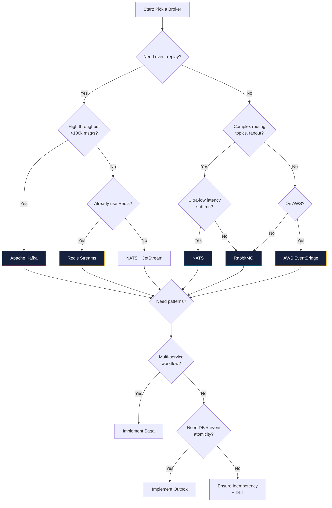

---

## Further Reading

- **Enterprise Integration Patterns** — Gregor Hohpe & Bobby Woolf (the EDA bible)
- **Designing Data-Intensive Applications** — Martin Kleppmann (chapters on replication, partitioning, transactions, stream processing)
- **Building Event-Driven Microservices** — Adam Bellemare
- **Kafka: The Definitive Guide** — Neha Narkhede, Gwen Shapira, Todd Palino
- **Confluent developer courses** — [developer.confluent.io](https://developer.confluent.io/)
- **RabbitMQ tutorials** — [rabbitmq.com/getstarted](https://www.rabbitmq.com/getstarted.html)
- **Microservices Patterns** (Saga) — Chris Richardson, [microservices.io](https://microservices.io/patterns/data/saga.html)

[← Back to Backend Engineering](../README.md) · © sparshjaswal
