# gRPC 🚀

gRPC (gRPC Remote Procedure Call) is a high-performance, open-source universal RPC framework. It uses **Protocol Buffers** for binary serialization and **HTTP/2** for transport, enabling features like multiplexed bidirectional streaming, header compression, and built-in deadline propagation — all with automatic code generation across 12+ languages.

> _Call a method on a remote server as if it were a local function — with type safety, streaming, and sub-millisecond overhead._

---

## Why gRPC? The Architecture

At its core, gRPC replaces the ad-hoc JSON-over-HTTP approach with a **strong contract** defined in a `.proto` file. The contract is the single source of truth — both server and client stubs are generated from it.

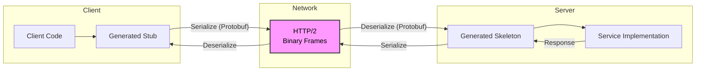

### The Three Pillars

| Pillar               | Role                                                       | Why It Matters                                                                                                                   |
| -------------------- | ---------------------------------------------------------- | -------------------------------------------------------------------------------------------------------------------------------- |
| **Protocol Buffers** | Interface Definition Language (IDL) + binary serialization | Schema-first design. Payloads are 3–10× smaller than JSON. Strongly typed. Backward-compatible evolution.                        |
| **HTTP/2**           | Transport layer                                            | Multiplexed streams over one TCP connection (no head-of-line blocking). Binary framing. Header compression (HPACK). Server push. |
| **Code Generation**  | Auto-generated client/server stubs                         | Write the schema once — generated code handles serialization, deserialization, and network plumbing. Supports 12+ languages.     |

### gRPC vs REST vs GraphQL

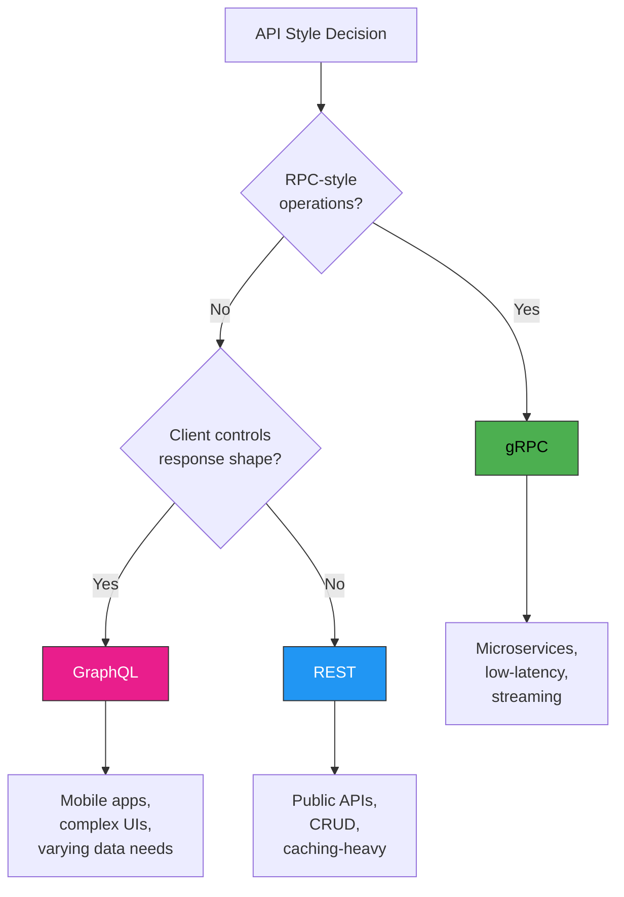

| Criteria            | gRPC                                                              | REST                                       | GraphQL                                                    |
| ------------------- | ----------------------------------------------------------------- | ------------------------------------------ | ---------------------------------------------------------- |
| **Paradigm**        | RPC (call methods)                                                | Resource-oriented                          | Query language                                             |
| **Contract**        | `.proto` file (IDL)                                               | OpenAPI / Swagger                          | GraphQL schema                                             |
| **Serialization**   | Protocol Buffers (binary)                                         | JSON (text)                                | JSON (text)                                                |
| **Payload size**    | Smallest (3–10× smaller)                                          | Medium                                     | Small (client-specified)                                   |
| **Streaming**       | Native: unary, server, client, bidirectional                      | Chunked transfer / SSE (limited)           | Subscriptions (WebSocket)                                  |
| **Code generation** | Built-in (`protoc`)                                               | Optional (OpenAPI Generator)               | Optional (GraphQL Codegen)                                 |
| **Browser support** | Via gRPC-Web or gRPC-gateway                                      | Native                                     | Native                                                     |
| **Caching**         | Application-level                                                 | HTTP caching (CDN-friendly)                | Client-side (Apollo, Relay)                                |
| **Tooling**         | grpcurl, grpcui, BloomRPC, Kreya                                  | curl, Postman, Insomnia                    | GraphiQL, Apollo Studio                                    |
| **Versioning**      | Schema evolution (no breaking changes by default)                 | URL or header versioning                   | Schema deprecation (`@deprecated`)                         |
| **Error handling**  | Rich status codes + metadata                                      | HTTP status codes + JSON body              | `errors` array in response                                 |
| **Learning curve**  | Medium (proto syntax + tooling)                                   | Low                                        | Medium                                                     |
| **Best for**        | Internal microservices, real-time streaming, mobile backends, IoT | Public APIs, CRUD apps, CDN-cached content | Complex data graphs, mobile apps, rapid frontend iteration |

---

## Protocol Buffers (Protobuf)

Protocol Buffers is the IDL for gRPC — you define your service and message types in `.proto` files, then compile them to generate code in your language of choice.

### Why Protobuf?

- **Binary format** — no parsing overhead, 3–10× smaller payloads
- **Schema-first** — the proto file is the contract; client and server cannot drift
- **Backward/forward compatibility** — fields are identified by numbers, not names. Adding fields never breaks existing clients.
- **Code generation** — one `.proto` file generates idiomatic client/server code in 12+ languages
- **Strong typing** — scalars, enums, nested messages, `oneof`, maps, timestamps, wrappers

### Proto3 Syntax Guide

```protobuf
syntax = "proto3";  // Use proto3 (the current standard)

// Package prevents naming collisions across projects
package ecommerce.v1;

// Import well-known types for richer semantics
import "google/protobuf/timestamp.proto";
import "google/protobuf/empty.proto";

// ─── Options ───────────────────────────────────────────
// Go package, Java package, etc. (language-specific)
option go_package = "github.com/myorg/ecommerce/v1;ecommercev1";

// ─── Enums ─────────────────────────────────────────────
enum OrderStatus {
  ORDER_STATUS_UNSPECIFIED = 0;  // 0 is always the default!
  ORDER_STATUS_PENDING     = 1;
  ORDER_STATUS_CONFIRMED   = 2;
  ORDER_STATUS_SHIPPED     = 3;
  ORDER_STATUS_DELIVERED   = 4;
  ORDER_STATUS_CANCELLED   = 5;
}

// ─── Messages ──────────────────────────────────────────
message OrderItem {
  string   product_id = 1;  // Field numbers 1–15 use 1 byte
  int32    quantity   = 2;  // Field numbers 16–2047 use 2 bytes
  double   unit_price = 3;  // Reserve 1–15 for frequently used fields
}

message Order {
  string                     order_id    = 1;
  string                     user_id     = 2;
  repeated OrderItem         items       = 3;  // "repeated" = array
  OrderStatus                status      = 4;
  double                     total       = 5;
  google.protobuf.Timestamp  created_at  = 6;
  map<string, string>        metadata    = 7;  // map<k, v> — keys can be any scalar except float/double
}

// ─── Request / Response Messages ────────────────────────
message CreateOrderRequest {
  string             user_id = 1;
  repeated OrderItem items   = 2;
}

message CreateOrderResponse {
  Order order = 1;
}

message GetOrderRequest {
  string order_id = 1;
}

message GetOrderResponse {
  Order order = 1;
}

message ListOrdersRequest {
  string user_id    = 1;
  int32  page_size  = 2;  // Use int32 for sizes. There's no uint in proto3.
  string page_token = 3;  // Cursor-based pagination
}

message ListOrdersResponse {
  repeated Order orders       = 1;
  string         next_page_token = 2;
  int32          total_count     = 3;
}

// ─── Service Definition ─────────────────────────────────
service OrderService {
  // Unary — one request, one response
  rpc CreateOrder(CreateOrderRequest) returns (CreateOrderResponse);

  // Unary
  rpc GetOrder(GetOrderRequest) returns (GetOrderResponse);

  // Unary
  rpc ListOrders(ListOrdersRequest) returns (ListOrdersResponse);

  // Server streaming — one request, many responses
  rpc WatchOrders(ListOrdersRequest) returns (stream Order);

  // Client streaming — many requests, one response
  rpc BulkCreateOrders(stream CreateOrderRequest) returns (ListOrdersResponse);

  // Bidirectional streaming — many requests, many responses
  rpc ChatSupport(stream SupportMessage) returns (stream SupportMessage);
}

message SupportMessage {
  string order_id = 1;
  string user_id  = 2;
  string text     = 3;
  google.protobuf.Timestamp sent_at = 4;
}
```

### Scalar Types

| Proto Type | C++    | Java       | Go      | TypeScript / Node.js | Notes                                                                         |
| ---------- | ------ | ---------- | ------- | -------------------- | ----------------------------------------------------------------------------- |
| `double`   | double | double     | float64 | number               | 64-bit IEEE 754                                                               |
| `float`    | float  | float      | float32 | number               | 32-bit IEEE 754                                                               |
| `int32`    | int32  | int        | int32   | number               | Variable-length encoding. Negative values are inefficient — use `sint32`.     |
| `int64`    | int64  | long       | int64   | number               | Not exactly representable in JS beyond 2⁵³. Consider `string` representation. |
| `sint32`   | int32  | int        | int32   | number               | Zigzag-encoded — efficient for negative values                                |
| `sint64`   | int64  | long       | int64   | number               | Zigzag-encoded 64-bit                                                         |
| `uint32`   | uint32 | int        | uint32  | number               | Unsigned. Use `int32` in proto3 (no real uint).                               |
| `uint64`   | uint64 | long       | uint64  | number               | Unsigned 64-bit                                                               |
| `bool`     | bool   | boolean    | bool    | boolean              |                                                                               |
| `string`   | string | String     | string  | string               | UTF-8 encoded. Must be valid UTF-8.                                           |
| `bytes`    | string | ByteString | []byte  | Buffer / Uint8Array  | Arbitrary binary data                                                         |

### Field Number Rules

- **1–15**: Single-byte tag — use for frequently populated fields
- **16–2047**: Two-byte tag — for less frequent fields
- **19000–19999**: Reserved for protobuf internals — don't use!
- **Reserved**: Mark deleted field numbers and names as `reserved` to prevent reuse

```protobuf
message Foo {
  reserved 2, 15, 9 to 11;       // Reserve field numbers
  reserved "old_field", "legacy"; // Reserve field names
  string bar = 1;
  string baz = 3;  // Note: never reuse the number 2!
}
```

### `oneof` — Mutually Exclusive Fields

```protobuf
message PaymentMethod {
  oneof method {  // Only one field will be set at a time
    CreditCard    credit_card    = 1;
    PayPalAccount paypal         = 2;
    BankTransfer  bank_transfer  = 3;
    CryptoWallet  crypto_wallet  = 4;
  }
}
```

### Well-Known Types

| Type                        | Use                                                                                                                                                       |
| --------------------------- | --------------------------------------------------------------------------------------------------------------------------------------------------------- |
| `google.protobuf.Timestamp` | Time with nanosecond precision (`seconds` + `nanos`)                                                                                                      |
| `google.protobuf.Duration`  | A span of time (`seconds` + `nanos`)                                                                                                                      |
| `google.protobuf.Empty`     | No data — used when a method takes no input or returns no output                                                                                          |
| `google.protobuf.Struct`    | Arbitrary JSON object (when you can't define a strict schema)                                                                                             |
| `google.protobuf.Any`       | Embed any serialized message (type URL + bytes). Good for generic containers                                                                              |
| `google.protobuf.FieldMask` | Partial update — specifies which fields to modify                                                                                                         |
| `google.protobuf.wrappers`  | Wraps scalars (`google.protobuf.Int32Value`) to allow `null` distinction. In proto3, every field has a default zero-value — wrappers give you optionality |

---

## Service Methods & Streaming

gRPC supports four types of service methods. Each maps to a different interaction pattern.

```mermaid
graph TB
    subgraph Unary
        UA[Client] -->|"1 request"| UB[Server]
        UB -->|"1 response"| UA
    end

    subgraph "Server Streaming"
        SA[Client] -->|"1 request"| SB[Server]
        SB -->|"stream of responses"| SA
    end

    subgraph "Client Streaming"
        CA[Client] -->|"stream of requests"| CB[Server]
        CB -->|"1 response"| CA
    end

    subgraph "Bidirectional Streaming"
        BA[Client] <-->|"stream in both directions"| BB[Server]
    end

    style UA fill:#e3f2fd,stroke:#1565c0,color:#000
    style UB fill:#e3f2fd,stroke:#1565c0,color:#000
    style SA fill:#e8f5e9,stroke:#2e7d32,color:#000
    style SB fill:#e8f5e9,stroke:#2e7d32,color:#000
    style CA fill:#fff3e0,stroke:#e65100,color:#000
    style CB fill:#fff3e0,stroke:#e65100,color:#000
    style BA fill:#fce4ec,stroke:#c62828,color:#000
    style BB fill:#fce4ec,stroke:#c62828,color:#000
```

### 1. Unary RPC — Request/Response

The classic "call a function, get a result" pattern. The client sends one request and waits for one response. Most API endpoints are unary.

**Use cases:** Create/update a record, fetch a single resource, execute a command.

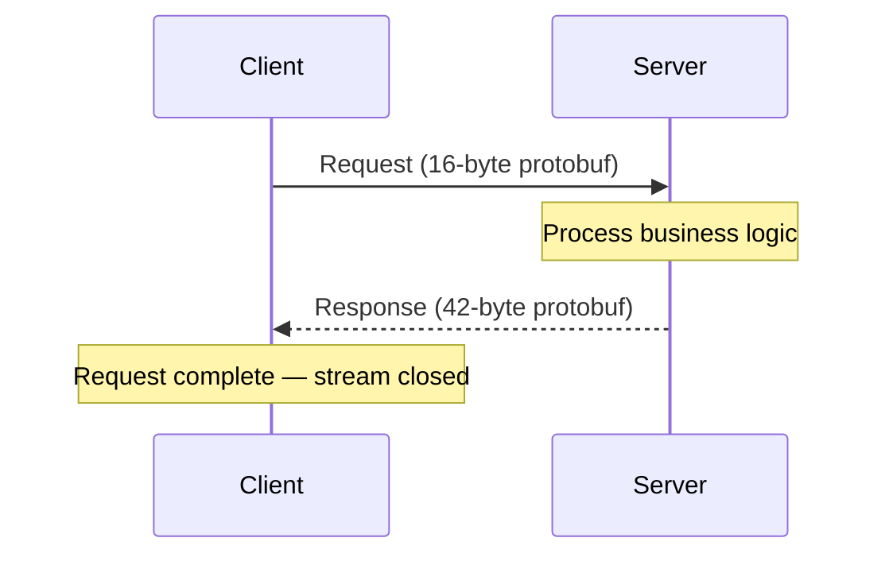

### 2. Server Streaming RPC

The client sends one request, and the server sends back a **stream** of responses. The server can push new data to the client as it becomes available. The client reads until the stream is exhausted.

**Use cases:** Live feeds (stock ticker), log tailing, real-time notifications, exporting large datasets in chunks, long-running job progress.

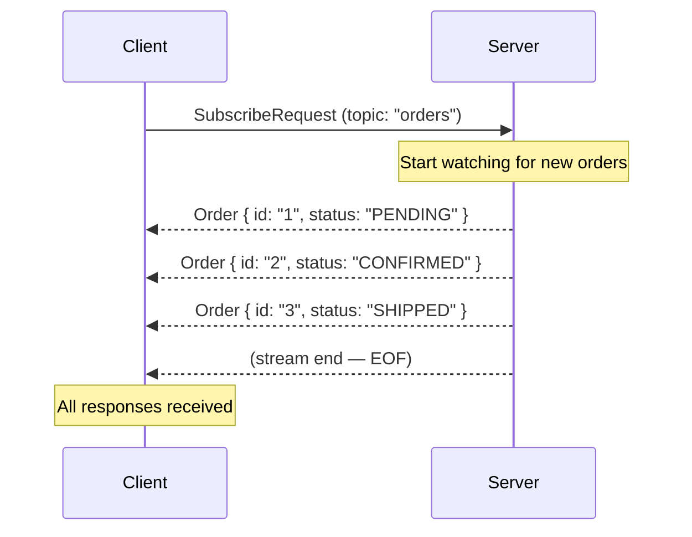

### 3. Client Streaming RPC

The client sends a **stream** of requests, and the server responds with a single message — typically a summary or acknowledgment — after processing the entire stream.

**Use cases:** Uploading a large file in chunks, sending bulk data for batch processing, client-side telemetry/analytics, audio/video upload.

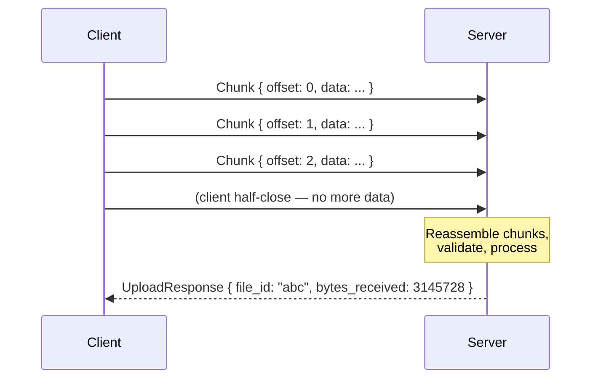

### 4. Bidirectional Streaming RPC

Both sides send a stream of messages independently. The client and server can read and write in any order — the streams operate independently. This is the most flexible pattern.

**Use cases:** Chat, collaborative editing, interactive command shells, real-time gaming, gRPC-based proxies.

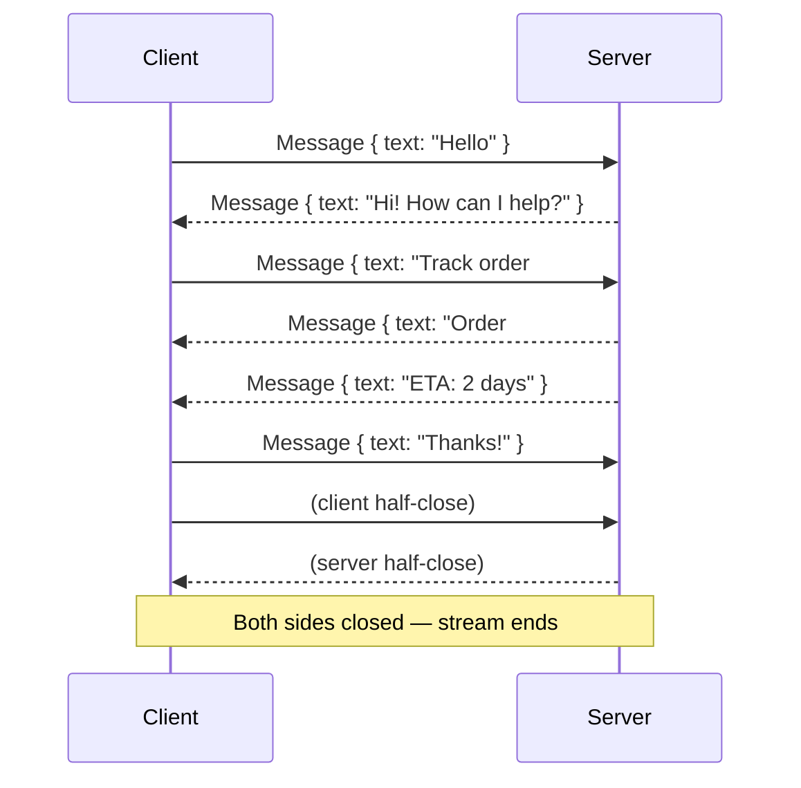

---

## Node.js / TypeScript Setup

Let's walk through a complete gRPC setup with TypeScript.

### Project Structure

```
grpc-service/
├── proto/
│   ├── orders/
│   │   └── v1/
│   │       └── orders.proto
│   └── buf.yaml                # Buf config (modern alternative to protoc)
├── generated/                  # Auto-generated code
│   └── orders/
│       └── v1/
│           ├── orders.ts
│           └── orders_grpc_pb.ts
├── src/
│   ├── server.ts
│   ├── client.ts
│   ├── services/
│   │   └── order.service.ts
│   ├── interceptors/
│   │   ├── auth.interceptor.ts
│   │   ├── logging.interceptor.ts
│   │   └── deadline.interceptor.ts
│   └── utils/
│       └── grpc-error.ts
├── package.json
├── tsconfig.json
└── buf.gen.yaml                 # Code generation config
```

### Package Installation

```bash
npm install @grpc/grpc-js @grpc/proto-loader
npm install -D typescript @types/node ts-node ts-proto protoc-gen-ts
```

> **`@grpc/grpc-js`** is the modern, pure-JavaScript gRPC implementation for Node.js. It replaces the deprecated `grpc` native library. **`@grpc/proto-loader`** loads `.proto` files at runtime — great for development. For production, pre-generate your code.

### Approach 1: Runtime Loading (Quick Start)

Load `.proto` files at runtime with `@grpc/proto-loader`. No code generation step — ideal for development, prototyping, and smaller projects.

```typescript
// src/server-runtime.ts
import * as grpc from '@grpc/grpc-js';
import * as protoLoader from '@grpc/proto-loader';
import path from 'path';

const PROTO_PATH = path.join(__dirname, '../proto/orders/v1/orders.proto');

// Load the proto file with options
const packageDefinition = protoLoader.loadSync(PROTO_PATH, {
  keepCase: true, // Preserve field casing (not snake_case → camelCase)
  longs: String, // Represent int64 as string (JS can't represent full range)
  enums: String, // Represent enums as their string names
  defaults: true, // Include default values on the output
  oneofs: true, // Include oneof fields as named groups
});

// Compile into a gRPC object
const proto = grpc.loadPackageDefinition(packageDefinition) as any;

// Access the service — the path matches your proto package + service name
const orderService = proto.ecommerce.v1.OrderService;

// Implement the service
function createOrder(
  call: grpc.ServerUnaryCall<any, any>,
  callback: grpc.sendUnaryData<any>,
): void {
  const { user_id, items } = call.request;

  // Validate input (protobuf deserialization is not validation!)
  if (!user_id) {
    return callback({
      code: grpc.status.INVALID_ARGUMENT,
      message: 'user_id is required',
    });
  }

  const order = {
    order_id: `ord_${Date.now()}`,
    user_id,
    items,
    status: 'ORDER_STATUS_PENDING',
    total: items.reduce((sum: number, i: any) => sum + i.quantity * i.unit_price, 0),
    created_at: { seconds: Math.floor(Date.now() / 1000), nanos: 0 },
  };

  callback(null, { order });
}

// Start the server
function main(): void {
  const server = new grpc.Server();

  server.addService(orderService.service, {
    CreateOrder: createOrder,
    // ... other methods
  });

  server.bindAsync('0.0.0.0:50051', grpc.ServerCredentials.createInsecure(), (err, port) => {
    if (err) {
      console.error('Failed to bind:', err);
      return;
    }
    console.log(`gRPC server running on port ${port}`);
  });
}

main();
```

### Approach 2: Static Code Generation (Production)

Pre-generate TypeScript code from `.proto` files using `ts-proto` — it generates clean, idiomatic TypeScript interfaces with proper types (no `any`).

```bash
# Install ts-proto
npm install -D ts-proto

# Generate code
protoc \
  --plugin=./node_modules/.bin/protoc-gen-ts_proto \
  --ts_proto_out=./generated \
  --ts_proto_opt=outputServices=grpc-js,env=node,esModuleInterop=true \
  --proto_path=./proto \
  proto/orders/v1/orders.proto
```

The generated code gives you fully typed interfaces:

```typescript
// generated/orders/v1/orders.ts (example of what ts-proto generates)
export interface Order {
  orderId: string;
  userId: string;
  items: OrderItem[];
  status: OrderStatus;
  total: number;
  createdAt: Date | undefined; // Timestamp → Date!
  metadata: { [key: string]: string };
}

export interface CreateOrderRequest {
  userId: string;
  items: OrderItem[];
}
```

Using generated code on the server:

```typescript
// src/server-static.ts
import * as grpc from '@grpc/grpc-js';
import { OrderServiceService, IOrderServiceServer } from '../generated/orders/v1/orders';
import { CreateOrderRequest, CreateOrderResponse } from '../generated/orders/v1/orders';

// Implement the generated service interface for type safety
const orderServiceImpl: IOrderServiceServer = {
  async CreateOrder(
    call: grpc.ServerUnaryCall<CreateOrderRequest, CreateOrderResponse>,
    callback: grpc.sendUnaryData<CreateOrderResponse>,
  ): Promise<void> {
    const { userId, items } = call.request;
    // TypeScript knows userId is string, items is OrderItem[]

    const order = {
      orderId: `ord_${Date.now()}`,
      userId,
      items,
      status: 'PENDING' as const,
      total: items.reduce((sum, i) => sum + i.quantity * i.unitPrice, 0),
      createdAt: new Date(),
    };

    callback(null, { order });
  },

  // Server streaming example
  WatchOrders(call: grpc.ServerWritableStream<ListOrdersRequest, Order>): void {
    const { userId } = call.request;

    const interval = setInterval(() => {
      // Push new order data every 2 seconds
      call.write({
        orderId: `ord_${Date.now()}`,
        userId,
        items: [],
        status: 'SHIPPED',
        total: 99.99,
        createdAt: new Date(),
      });
    }, 2000);

    // When client cancels or connection closes
    call.on('cancelled', () => {
      clearInterval(interval);
      call.end();
    });
  },

  // Bidirectional streaming example
  ChatSupport(call: grpc.ServerDuplexStream<SupportMessage, SupportMessage>): void {
    call.on('data', (msg: SupportMessage) => {
      console.log(`[${msg.userId}]: ${msg.text}`);
      // Echo back with a response — in a real app, route to an agent
      call.write({
        orderId: msg.orderId,
        userId: 'support_agent',
        text: `We received your message: "${msg.text}". An agent will respond shortly.`,
        sentAt: new Date(),
      });
    });

    call.on('end', () => {
      call.end();
    });
  },
};

const server = new grpc.Server();
server.addService(OrderServiceService, orderServiceImpl);

server.bindAsync('0.0.0.0:50051', grpc.ServerCredentials.createInsecure(), () => {
  console.log('Server started');
});
```

### Creating a TypeScript Client

```typescript
// src/client.ts
import * as grpc from '@grpc/grpc-js';
import { OrderServiceClient } from '../generated/orders/v1/orders';
import { CreateOrderRequest, Order } from '../generated/orders/v1/orders';

// Create a client instance
const client = new OrderServiceClient('localhost:50051', grpc.credentials.createInsecure());

// ─── Unary Call ─────────────────────────────────────────
function placeOrder(): void {
  const request: CreateOrderRequest = {
    userId: 'user_42',
    items: [
      { productId: 'prod_abc', quantity: 2, unitPrice: 29.99 },
      { productId: 'prod_xyz', quantity: 1, unitPrice: 149.5 },
    ],
  };

  // Set a deadline of 3 seconds
  const deadline = new Date();
  deadline.setSeconds(deadline.getSeconds() + 3);

  client.CreateOrder(request, { deadline }, (error, response) => {
    if (error) {
      console.error('CreateOrder failed:', error.message);
      return;
    }
    console.log('Order created:', response?.order?.orderId);
  });
}

// ─── Server Streaming Call ──────────────────────────────
function watchOrders(): void {
  const call = client.WatchOrders({ userId: 'user_42', pageSize: 10, pageToken: '' });

  call.on('data', (order: Order) => {
    console.log(`New order update: ${order.orderId} → ${order.status}`);
  });

  call.on('error', (err: grpc.ServiceError) => {
    console.error('Stream error:', err.message);
  });

  call.on('end', () => {
    console.log('WatchOrders stream ended');
  });
}

// ─── Client Streaming Call ──────────────────────────────
function bulkCreateOrders(): void {
  const call = client.BulkCreateOrders((error, response) => {
    if (error) {
      console.error('BulkCreate failed:', error.message);
      return;
    }
    console.log(`Created ${response?.totalCount} orders`);
  });

  // Send 100 orders as a stream
  for (let i = 0; i < 100; i++) {
    call.write({
      userId: 'user_42',
      items: [{ productId: `prod_${i}`, quantity: 1, unitPrice: 10.0 }],
    });
  }

  // Signal that we're done sending
  call.end();
}

// ─── Bidirectional Streaming Call ───────────────────────
function chatSession(): void {
  const call = client.ChatSupport();

  // Handle incoming messages from server
  call.on('data', (msg) => {
    console.log(`[${msg.userId}]: ${msg.text}`);
  });

  call.on('error', (err) => {
    console.error('Chat error:', err.message);
  });

  call.on('end', () => {
    console.log('Chat ended');
  });

  // Send messages as user types them
  call.write({
    orderId: 'ord_123',
    userId: 'user_42',
    text: 'Hello, I need help with my order.',
    sentAt: new Date(),
  });
}
```

---

## Interceptors

Interceptors are middleware for gRPC calls. They can inspect, modify, or reject requests/responses — both on the client and server side. Think of them as Express middleware but for gRPC.


### Unary Interceptors

```typescript
// ─── Logging Interceptor (Server) ────────────────────────
import * as grpc from '@grpc/grpc-js';

function loggingInterceptor(
  methodDescriptor: grpc.UntypedServiceImplementation,
  call: grpc.ServerUnaryCall<any, any>,
  callback: grpc.sendUnaryData<any>,
): void {
  const start = Date.now();
  const method = call.getPath(); // e.g., "/ecommerce.v1.OrderService/CreateOrder"

  console.log(`→ ${method}`, { request: call.request });

  // Wrap the callback to log the response
  const wrappedCallback: grpc.sendUnaryData<any> = (error, response) => {
    const duration = Date.now() - start;
    if (error) {
      console.error(`✗ ${method} [${duration}ms]`, { code: error.code, message: error.message });
    } else {
      console.log(`✓ ${method} [${duration}ms]`);
    }
    callback(error, response);
  };

  // Call the original handler
  (methodDescriptor as any)(call, wrappedCallback);
}

// Apply to server
const server = new grpc.Server();
server.addService(OrderServiceService, orderServiceImpl);
```

### Client Interceptor for Authentication

```typescript
// ─── Auth Client Interceptor ─────────────────────────────
import * as grpc from '@grpc/grpc-js';

class AuthInterceptor extends grpc.InterceptingCall {
  constructor(
    options: grpc.InterceptingCall.InterceptingOptions,
    nextCall: grpc.InterceptingCall.NextCall,
    private accessToken: string,
  ) {
    super(options, nextCall);
  }

  // Override start to inject metadata
  start(metadata: grpc.Metadata, listener: grpc.InterceptingListener): void {
    // Inject authorization token into every outgoing call
    metadata.add('authorization', `Bearer ${this.accessToken}`);

    // Inject request ID for tracing
    metadata.add('x-request-id', this.generateRequestId());

    super.start(metadata, listener);
  }

  private generateRequestId(): string {
    return `req_${Date.now()}_${Math.random().toString(36).substring(2, 9)}`;
  }
}

// Interceptor factory
export function createAuthInterceptor(accessToken: string): grpc.Interceptor {
  return (options, nextCall) => {
    return new AuthInterceptor(options, nextCall, accessToken);
  };
}

// Use the interceptor
const client = new OrderServiceClient('localhost:50051', grpc.credentials.createInsecure(), {
  interceptors: [createAuthInterceptor('eyJhbGciOi...')],
});
```

### Server-Side Auth Verification Interceptor

```typescript
// ─── Auth Server Interceptor ─────────────────────────────
import * as grpc from '@grpc/grpc-js';

function authServerInterceptor(
  methodDescriptor: any,
  call: grpc.ServerUnaryCall<any, any>,
  callback: grpc.sendUnaryData<any>,
  next: (
    methodDescriptor: any,
    call: grpc.ServerUnaryCall<any, any>,
    callback: grpc.sendUnaryData<any>,
  ) => void,
): void {
  const metadata = call.metadata;
  const authHeader = metadata.get('authorization');

  if (!authHeader || authHeader.length === 0) {
    callback({
      code: grpc.status.UNAUTHENTICATED,
      message: 'Missing authorization metadata',
    });
    return;
  }

  const token = authHeader[0] as string;
  try {
    const user = verifyToken(token.replace('Bearer ', ''));
    // Attach user to call for downstream handlers
    (call as any).user = user;
    next(methodDescriptor, call, callback);
  } catch {
    callback({
      code: grpc.status.UNAUTHENTICATED,
      message: 'Invalid or expired token',
    });
  }
}
```

---

## Deadlines, Timeouts & Cancellation

Every gRPC call should have a **deadline** — the point in time by which the call must complete. Deadlines are propagated across service boundaries. If the deadline is exceeded, gRPC cancels the call with `DEADLINE_EXCEEDED`.

### Why Deadlines Matter

Without a deadline, a slow or hung downstream can cause:

- **Resource leaks** — open connections that never close
- **Cascading failures** — one slow service saturates thread pools everywhere upstream
- **Poor user experience** — requests that hang indefinitely

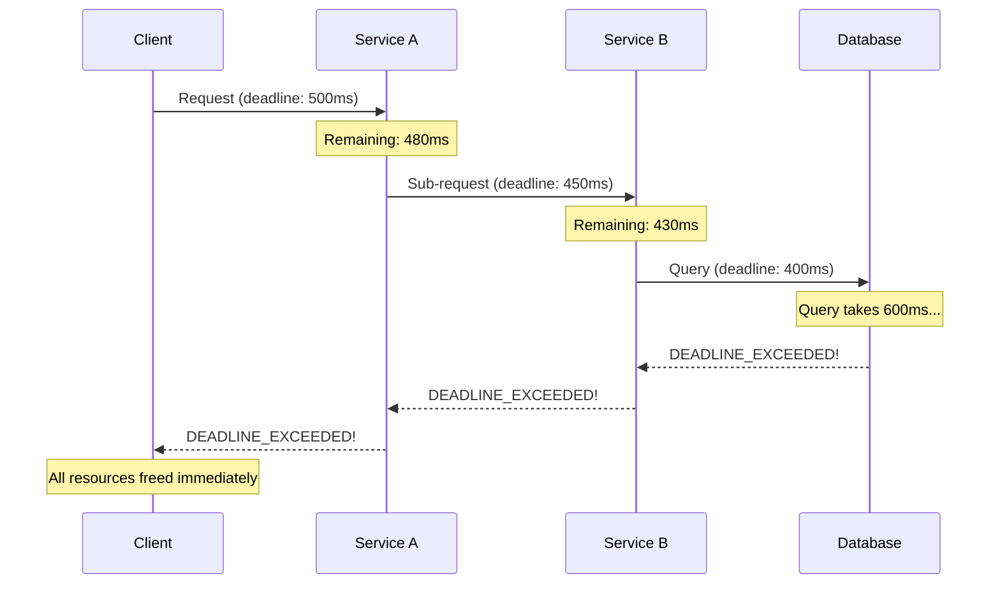

### Setting Deadlines

```typescript
// Server side — enforce deadlines on incoming calls
function orderHandler(
  call: grpc.ServerUnaryCall<OrderRequest, OrderResponse>,
  callback: grpc.sendUnaryData<OrderResponse>,
): void {
  // Check if there's an incoming deadline
  const deadline = call.getDeadline();

  if (deadline) {
    // If deadline has already passed, reject immediately
    if (deadline < new Date()) {
      callback({
        code: grpc.status.DEADLINE_EXCEEDED,
        message: 'Deadline already exceeded before processing',
      });
      return;
    }

    // Calculate remaining time and pass to downstream calls
    const remainingMs = deadline.getTime() - Date.now();
    console.log(`Remaining time: ${remainingMs}ms`);
  }

  // For downstream calls, create a child deadline
  // The parent deadline should be slightly larger than the sum of children
  const childDeadline = new Date(Date.now() + 200); // 200ms for DB call

  dbClient.query(sql, { deadline: childDeadline }, (err, result) => {
    if (err) {
      callback({ code: grpc.status.INTERNAL, message: 'Database error' });
      return;
    }
    callback(null, { order: result });
  });
}
```

```typescript
// Client side — always set a deadline
const deadline = new Date();
deadline.setMilliseconds(deadline.getMilliseconds() + 500); // 500ms deadline

client.GetOrder({ orderId: 'ord_123' }, { deadline }, (error, response) => {
  if (error) {
    if (error.code === grpc.status.DEADLINE_EXCEEDED) {
      console.error('Request timed out — fallback to cache or retry');
    }
    return;
  }
  console.log(response);
});
```

### Cancellation

Clients can cancel a gRPC call at any time — especially useful for streaming calls where the client may no longer need results.

```typescript
// Cancel a streaming call from the client
const call = client.WatchOrders({ userId: 'user_42' });

call.on('data', (order) => {
  console.log('Order:', order.orderId);
  if (order.status === 'ORDER_STATUS_DELIVERED') {
    // We found what we needed — cancel the stream
    call.cancel();
  }
});

// Server-side handling of cancellation
function WatchOrders(call: grpc.ServerWritableStream<WatchRequest, Order>): void {
  const dbStream = db.query('SELECT * FROM orders').stream();

  dbStream.on('data', (row) => {
    // Check if client cancelled before writing more data
    if (call.cancelled || call.destroyed) {
      dbStream.destroy(); // Stop reading from DB
      return;
    }
    call.write(mapRowToOrder(row));
  });

  // gRPC event: client cancelled the call
  call.on('cancelled', () => {
    console.log('Client cancelled — cleaning up resources');
    dbStream.destroy();
    // Don't call call.end() — the stream is already cancelled
  });

  dbStream.on('end', () => call.end());
}
```

### Retry Policy (Built-in)

gRPC supports automatic retries with configurable policies:

```typescript
// Client-side retry configuration
const client = new OrderServiceClient('localhost:50051', grpc.credentials.createInsecure(), {
  // Retry policy: retry on UNAVAILABLE up to 3 times with exponential backoff
  'grpc.service_config': JSON.stringify({
    methodConfig: [
      {
        name: [{ service: 'ecommerce.v1.OrderService' }],
        retryPolicy: {
          maxAttempts: 3,
          initialBackoff: '0.1s',
          maxBackoff: '5s',
          backoffMultiplier: 2,
          retryableStatusCodes: ['UNAVAILABLE', 'DEADLINE_EXCEEDED'],
        },
      },
    ],
  }),
});
```

---

## Error Handling

gRPC uses a well-defined set of **status codes** — much richer than HTTP status codes. Every error carries a code, a message, and optional metadata (details).

### gRPC Status Codes

| Code                      | Description             | When to Use                                                |
| ------------------------- | ----------------------- | ---------------------------------------------------------- |
| `OK` (0)                  | Success                 | Not an error — the call succeeded                          |
| `CANCELLED` (1)           | Call was cancelled      | Client cancelled the call or server is shutting down       |
| `UNKNOWN` (2)             | Unknown error           | Catch-all — prefer more specific codes                     |
| `INVALID_ARGUMENT` (3)    | Bad input               | Missing or malformed field, invalid enum value             |
| `DEADLINE_EXCEEDED` (4)   | Too slow                | Operation took longer than the deadline                    |
| `NOT_FOUND` (5)           | Resource not found      | Entity doesn't exist                                       |
| `ALREADY_EXISTS` (6)      | Duplicate               | Resource already exists (idempotency concern)              |
| `PERMISSION_DENIED` (7)   | Not authorized          | Authenticated but insufficient permissions                 |
| `RESOURCE_EXHAUSTED` (8)  | Quota/rate limit        | Rate limit, storage full, connection pool exhausted        |
| `FAILED_PRECONDITION` (9) | State conflict          | Request conflicts with current system state                |
| `ABORTED` (10)            | Concurrency conflict    | Optimistic lock failure, retriable                         |
| `OUT_OF_RANGE` (11)       | Value out of range      | Pagination `page_token` invalid, number beyond valid range |
| `UNIMPLEMENTED` (12)      | Not implemented         | Method not implemented on this server                      |
| `INTERNAL` (13)           | Internal server error   | Unhandled exception — never expose internals!              |
| `UNAVAILABLE` (14)        | Service unavailable     | Transient failure — retriable                              |
| `DATA_LOSS` (15)          | Unrecoverable data loss | Corruption, disk failure                                   |
| `UNAUTHENTICATED` (16)    | Missing credentials     | No valid auth token                                        |

### Structured Error Details

gRPC allows sending structured error details using the **`google.rpc.Status`** message — much richer than just a string message.

```typescript
import * as grpc from '@grpc/grpc-js';
import { status as StatusBuilder } from '@grpc/grpc-js';

// Custom error factory
function validationError(
  fieldViolations: Array<{ field: string; description: string }>,
): grpc.ServiceError {
  const error: any = new Error('Validation failed');
  error.code = grpc.status.INVALID_ARGUMENT;
  error.details = 'One or more fields failed validation';
  error.metadata = new grpc.Metadata();
  // Attach structured error info
  error.metadata.add(
    'bad-request-bin', // "-bin" suffix for binary metadata
    Buffer.from(
      JSON.stringify({
        field_violations: fieldViolations,
      }),
    ),
  );
  return error;
}

// Usage in handler
function createOrder(
  call: grpc.ServerUnaryCall<CreateOrderRequest, CreateOrderResponse>,
  callback: grpc.sendUnaryData<CreateOrderResponse>,
): void {
  const violations: Array<{ field: string; description: string }> = [];

  if (!call.request.userId) {
    violations.push({ field: 'user_id', description: 'user_id is required' });
  }
  if (!call.request.items || call.request.items.length === 0) {
    violations.push({ field: 'items', description: 'At least one item is required' });
  }

  if (violations.length > 0) {
    callback(validationError(violations));
    return;
  }

  // ... proceed with creation
}
```

### Client-Side Error Handling

```typescript
function handleGrpcError(error: grpc.ServiceError): void {
  switch (error.code) {
    case grpc.status.UNAVAILABLE:
      // Transient — retry with exponential backoff
      scheduleRetry(error);
      break;

    case grpc.status.DEADLINE_EXCEEDED:
      // Too slow — use cached data or degrade gracefully
      console.warn('Timeout — serving stale data from cache');
      serveCachedData();
      break;

    case grpc.status.UNAUTHENTICATED:
      // Token expired — refresh and retry
      refreshTokenAndRetry();
      break;

    case grpc.status.PERMISSION_DENIED:
      // Not authorized — don't retry, inform user
      console.error('Access denied');
      break;

    case grpc.status.RESOURCE_EXHAUSTED:
      // Rate limited — wait and retry with backoff
      const retryAfter = error.metadata.get('retry-after')?.[0] || '5';
      waitAndRetry(Number(retryAfter));
      break;

    case grpc.status.INVALID_ARGUMENT:
      // Bad input — don't retry, fix the request
      console.error('Invalid request:', error.metadata.get('bad-request-bin'));
      break;

    default:
      console.error(`Unhandled gRPC error [${error.code}]: ${error.message}`);
  }
}
```

---

## Load Balancing

gRPC connections are **long-lived** (HTTP/2). Traditional L4 round-robin load balancers don't work well because all requests on a connection go to the same backend. gRPC requires **L7 (application-layer)** load balancing strategies.

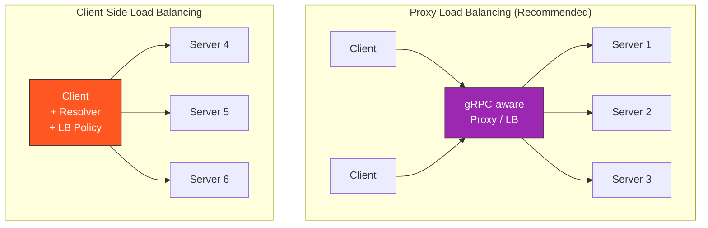

### Strategies

| Strategy        | Description                                                              | Best For                                                                |
| --------------- | ------------------------------------------------------------------------ | ----------------------------------------------------------------------- |
| **Proxy (L7)**  | Envoy, NGINX, or Linkerd sits in front of servers and distributes RPCs   | Kubernetes, large fleets. Simplest to operate.                          |
| **Client-side** | Client resolves server addresses and load-balances itself                | Low-latency, no extra hop. Requires DNS / naming service (Consul, etc). |
| **Look-aside**  | Control plane publishes endpoints; client queries it for the server list | Medium-to-large deployments                                             |

### Client-Side Load Balancing with DNS Resolution

```typescript
import * as grpc from '@grpc/grpc-js';

// Use DNS SRV records to discover backend instances
const client = new OrderServiceClient(
  'dns:///orders.internal.mycompany.com:50051',
  grpc.credentials.createInsecure(),
  {
    // Default load balancing policy
    'grpc.service_config': JSON.stringify({
      loadBalancingConfig: [{ round_robin: {} }],
    }),
  },
);
```

### Envoy Proxy as gRPC Load Balancer (Production Pattern)

```yaml
# envoy.yaml snippet — L7 gRPC load balancing
static_resources:
  listeners:
    - name: grpc_listener
      address:
        socket_address:
          address: 0.0.0.0
          port_value: 9000
      filter_chains:
        - filters:
            - name: envoy.filters.network.http_connection_manager
              typed_config:
                '@type': type.googleapis.com/envoy.extensions.filters.network.http_connection_manager.v3.HttpConnectionManager
                codec_type: AUTO
                stat_prefix: grpc_json
                route_config:
                  name: local_route
                  virtual_hosts:
                    - name: backend
                      domains: ['*']
                      routes:
                        - match:
                            prefix: '/'
                          route:
                            cluster: grpc_backend_cluster
                http_filters:
                  - name: envoy.filters.http.router
                    typed_config:
                      '@type': type.googleapis.com/envoy.extensions.filters.http.router.v3.Router

  clusters:
    - name: grpc_backend_cluster
      type: STRICT_DNS
      lb_policy: ROUND_ROBIN
      http2_protocol_options: {} # Enable HTTP/2!
      load_assignment:
        cluster_name: grpc_backend_cluster
        endpoints:
          - lb_endpoints:
              - endpoint:
                  address:
                    socket_address:
                      address: service-1.internal
                      port_value: 50051
              - endpoint:
                  address:
                    socket_address:
                      address: service-2.internal
                      port_value: 50051
              - endpoint:
                  address:
                    socket_address:
                      address: service-3.internal
                      port_value: 50051
```

### Health Checking

gRPC has a [standard health checking protocol](https://github.com/grpc/grpc/blob/master/doc/health-checking.md):

```protobuf
syntax = "proto3";
package grpc.health.v1;

message HealthCheckRequest {
  string service = 1;
}
message HealthCheckResponse {
  enum ServingStatus {
    UNKNOWN = 0;
    SERVING = 1;
    NOT_SERVING = 2;
    SERVICE_UNKNOWN = 3;  // Used only by Watch
  }
  ServingStatus status = 1;
}

service Health {
  rpc Check(HealthCheckRequest) returns (HealthCheckResponse);
  rpc Watch(HealthCheckRequest) returns (stream HealthCheckResponse);
}
```

```typescript
// Add health check to your gRPC server
import { health } from '@grpc/grpc-js';

const server = new grpc.Server();
const healthImpl = new health.HealthImplementation({
  '': health.ServingStatus.SERVING, // Overall server status
  'ecommerce.v1.OrderService': health.ServingStatus.SERVING, // Per-service status
});

healthImpl.addToServer(server);

// When shutting down gracefully
process.on('SIGTERM', () => {
  healthImpl.setStatus('ecommerce.v1.OrderService', health.ServingStatus.NOT_SERVING);
  // Wait for in-flight requests to complete, then shutdown
  setTimeout(() => server.forceShutdown(), 10000);
});
```

---

## gRPC-Web

Browsers cannot speak raw HTTP/2 gRPC (they don't expose the HTTP/2 framing layer to JavaScript). **gRPC-Web** bridges this gap — it lets browser clients call gRPC services via HTTP/1.1 or HTTP/2 with a small proxy translating the wire format.

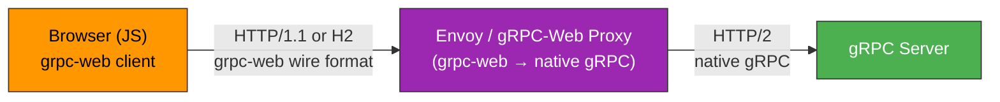

### Limitations of gRPC-Web

- ❌ **No client streaming** — browsers can't stream requests (only unary and server streaming)
- ❌ **No bidirectional streaming** — only server streaming is supported
- ⚠️ **Trailers-only responses** require special handling
- ✅ **All unary RPCs** work as expected
- ✅ **Server streaming** works via chunked transfer encoding

### Envoy gRPC-Web Proxy Configuration

```yaml
# envoy.yaml snippet — gRPC-Web filter
http_filters:
  - name: envoy.filters.http.grpc_web
    typed_config:
      '@type': type.googleapis.com/envoy.extensions.filters.http.grpc_web.v3.GrpcWeb
  - name: envoy.filters.http.router
    typed_config:
      '@type': type.googleapis.com/envoy.extensions.filters.http.router.v3.Router
```

### gRPC-Web TypeScript Client

```typescript
// In the browser — using @grpc/grpc-js is not supported in browsers.
// Use the grpc-web JavaScript client instead:
import { OrderServiceClient } from './generated/orders/v1/orders_grpc_web_pb';
import { CreateOrderRequest } from './generated/orders/v1/orders_pb';

// The client connects to the gRPC-Web proxy (Envoy), NOT directly to the gRPC server
const client = new OrderServiceClient('https://api.mycompany.com', null, null);

const request = new CreateOrderRequest();
request.setUserId('user_42');

// Unary call
client.createOrder(request, {}, (err, response) => {
  if (err) {
    console.error('Error:', err.message);
    return;
  }
  console.log('Order created:', response.getOrder()?.getOrderId());
});

// Server streaming (browser supports this!)
const stream = client.watchOrders(request, {});
stream.on('data', (order) => {
  console.log('Order update:', order.getOrderId(), order.getStatus());
});
stream.on('status', (status) => {
  console.log('Stream status:', status);
});
stream.on('end', () => {
  console.log('Stream ended');
});
```

### Alternative: gRPC-Gateway (REST+JSON Translation)

If you need full browser support (including client and bidirectional streaming), use **gRPC-gateway** — it generates a reverse proxy that translates REST+JSON to gRPC:

```protobuf
// In your .proto file, add HTTP annotations
import "google/api/annotations.proto";

service OrderService {
  rpc CreateOrder(CreateOrderRequest) returns (CreateOrderResponse) {
    option (google.api.http) = {
      post: "/v1/orders"
      body: "*"
    };
  }

  rpc GetOrder(GetOrderRequest) returns (GetOrderResponse) {
    option (google.api.http) = {
      get: "/v1/orders/{order_id}"
    };
  }
}
```

```bash
# Generate gRPC-gateway code
protoc -I./proto \
  --grpc-gateway_out=logtostderr=true:./generated \
  proto/orders/v1/orders.proto
```

This gives you the best of both worlds: a native gRPC API for internal services AND a REST+JSON API for browsers and external clients — all from the same `.proto` file.

---

## TLS / mTLS

Transport Layer Security encrypts traffic between client and server. **Mutual TLS (mTLS)** goes a step further — both parties present certificates to prove their identity.

### Server-Side TLS

```typescript
import * as grpc from '@grpc/grpc-js';
import fs from 'fs';

// Server with TLS
const server = new grpc.Server();

const serverCredentials = grpc.ServerCredentials.createSsl(
  /* rootCerts */ null, // null = don't require client certs (TLS, not mTLS)
  [
    {
      cert_chain: fs.readFileSync('./certs/server.crt'),
      private_key: fs.readFileSync('./certs/server.key'),
    },
  ],
  /* checkClientCertificate */ false,
);

server.addService(OrderServiceService, orderServiceImpl);

server.bindAsync('0.0.0.0:50051', serverCredentials, (err, port) => {
  if (err) throw err;
  console.log(`🔒 gRPC TLS server on port ${port}`);
});

// ─── Client Connecting with TLS ─────────────────────────
const clientCredentials = grpc.credentials.createSsl(
  fs.readFileSync('./certs/ca.crt'), // Root CA to verify server
  fs.readFileSync('./certs/client.key'), // Optional: client key (for mTLS)
  fs.readFileSync('./certs/client.crt'), // Optional: client cert (for mTLS)
);

const client = new OrderServiceClient('localhost:50051', clientCredentials);
```

### mTLS (Mutual TLS) Configuration

```typescript
// Server with mTLS — requires AND verifies client certificates
const mTLSServerCredentials = grpc.ServerCredentials.createSsl(
  fs.readFileSync('./certs/ca.crt'), // Root CA to verify client certs
  [
    {
      cert_chain: fs.readFileSync('./certs/server.crt'),
      private_key: fs.readFileSync('./certs/server.key'),
    },
  ],
  /* checkClientCertificate */ true, // ← Enforce mTLS!
);

// Client with mTLS — presents its own certificate
const mTLSClientCredentials = grpc.credentials.createSsl(
  fs.readFileSync('./certs/ca.crt'), // Root CA to verify server
  fs.readFileSync('./certs/client.key'), // Client private key
  fs.readFileSync('./certs/client.crt'), // Client certificate
);

const mTLSClient = new OrderServiceClient('orders.internal:50051', mTLSClientCredentials);
```

### Certificate Generation (for Development)

```bash
# Generate a self-signed CA
openssl req -new -x509 -days 365 -nodes \
  -subj "/CN=My CA" \
  -out ca.crt -keyout ca.key

# Generate server certificate signed by the CA
openssl req -new -nodes \
  -subj "/CN=localhost" \
  -out server.csr -keyout server.key

openssl x509 -req -days 365 \
  -CA ca.crt -CAkey ca.key -CAcreateserial \
  -in server.csr -out server.crt

# Generate client certificate (for mTLS)
openssl req -new -nodes \
  -subj "/CN=client" \
  -out client.csr -keyout client.key

openssl x509 -req -days 365 \
  -CA ca.crt -CAkey ca.key -CAcreateserial \
  -in client.csr -out client.crt
```

### Channel Credentials vs Call Credentials

gRPC distinguishes between **transport-level** security (TLS/mTLS, set on the channel) and **per-call** credentials (JWT tokens, API keys, set per-request):

```typescript
import * as grpc from '@grpc/grpc-js';

// Channel credentials — transport security
const channelCreds = grpc.credentials.createSsl(caCert);

// Call credentials — per-request metadata (JWT, API key)
const jwtCallCreds = grpc.credentials.createFromMetadataGenerator((_params, callback) => {
  const metadata = new grpc.Metadata();
  metadata.add('authorization', `Bearer ${getAccessToken()}`);
  callback(null, metadata);
});

// Combine: TLS + JWT per call
const combinedCredentials = grpc.credentials.combineChannelCredentials(channelCreds, jwtCallCreds);

const client = new OrderServiceClient('api.mycompany.com:443', combinedCredentials);
```

---

## Performance Tuning & Best Practices

### Connection Pooling & Keepalive

gRPC connections are multiplexed (one TCP connection handles many concurrent streams). In most cases, a **single client per remote service** is sufficient. The client is thread-safe and connection reuse is automatic.

```typescript
// Anti-pattern: creating a new client per request
// ❌ BAD — creates a new TCP connection + TLS handshake per request
function badApproach() {
  const client = new OrderServiceClient('server:50051', creds);
  client.GetOrder({ orderId: '123' }, () => {});
  client.close(); // Don't do this per request!
}

// ✅ GOOD — reuse a single long-lived client instance
const orderClient = new OrderServiceClient('server:50051', creds);
// Use orderClient across your application
```

### Keepalive Pings

Configure HTTP/2 keepalive to detect dead connections and prevent idle timeouts:

```typescript
const client = new OrderServiceClient('server:50051', creds, {
  'grpc.keepalive_time_ms': 30_000, // Ping every 30 seconds
  'grpc.keepalive_timeout_ms': 10_000, // Wait 10 seconds for ping ack
  'grpc.keepalive_permit_without_calls': 1, // Allow pings even with no active calls
  'grpc.http2.max_pings_without_data': 0, // Unlimited pings without data
});

const server = new grpc.Server({
  'grpc.keepalive_time_ms': 60_000,
  'grpc.keepalive_timeout_ms': 15_000,
  'grpc.http2.min_ping_interval_without_data_ms': 30_000, // Throttle client pings
  'grpc.max_connection_age_ms': 300_000, // Force refresh connections every 5 min
  'grpc.max_connection_age_grace_ms': 10_000,
});
```

### Channel & Call Options Reference

| Option                              | Default   | Description                                                |
| ----------------------------------- | --------- | ---------------------------------------------------------- |
| `grpc.ssl_target_name_override`     | —         | Override the TLS server name for hostname verification     |
| `grpc.default_authority`            | —         | Override the `:authority` pseudo-header                    |
| `grpc.keepalive_time_ms`            | `MAX_INT` | Ping interval — disables keepalive by default              |
| `grpc.keepalive_timeout_ms`         | `20_000`  | How long to wait for ping ack before closing               |
| `grpc.http2.max_pings_without_data` | `2`       | Close connection after N pings without data/header frames  |
| `grpc.max_connection_idle_ms`       | `MAX_INT` | Close connections idle for this long                       |
| `grpc.max_connection_age_ms`        | `MAX_INT` | Force close connection after this age                      |
| `grpc.max_connection_age_grace_ms`  | `MAX_INT` | Grace period after max age, before force close             |
| `grpc.enable_retries`               | `1`       | Enable automatic retries (service config must also permit) |

### Message Size Limits

By default, gRPC limits messages to **4 MB**. For large payloads (file uploads, bulk data), increase or disable:

```typescript
const server = new grpc.Server({
  'grpc.max_receive_message_length': 100 * 1024 * 1024, // 100 MB
  'grpc.max_send_message_length': 100 * 1024 * 1024, // 100 MB
});

// Client-side
client.GetLargePayload(
  request,
  {
    'grpc.max_receive_message_length': 100 * 1024 * 1024,
  },
  callback,
);
```

> ⚠️ Increasing message size limits has memory implications. For truly large payloads (>100 MB), prefer **client streaming** — chunk the data into multiple smaller messages and stream them.

---

## Proto Best Practices & Style Guide

Following Google's [AIPs](https://google.aip.dev/) (API Improvement Proposals) and the [Uber Protobuf Style Guide](https://github.com/uber/prototool):

| Guideline                                                       | Example ✅                                 | Anti-Pattern ❌                                                    |
| --------------------------------------------------------------- | ------------------------------------------ | ------------------------------------------------------------------ |
| Use `snake_case` for field names                                | `user_id`, `created_at`                    | `userId`, `createdAt`                                              |
| Use `PascalCase` for message/enum names                         | `CreateOrderRequest`                       | `createOrderRequest`                                               |
| Use `UPPER_SNAKE_CASE` for enum values, prefixed with enum name | `ORDER_STATUS_PENDING`                     | `PENDING` (ambiguous)                                              |
| Version packages                                                | `package ecommerce.v1;`                    | `package ecommerce;`                                               |
| Use separate request/response messages (even if identical)      | `GetOrderRequest`, `GetOrderResponse`      | Reusing `Order` for both                                           |
| Reserve deleted field numbers and names                         | `reserved 2, 5 to 7; reserved "old_name";` | Delete and reuse numbers                                           |
| Default enum value must be `0` and should be `UNSPECIFIED`      | `ORDER_STATUS_UNSPECIFIED = 0;`            | `ORDER_STATUS_PENDING = 0;` (can't distinguish unset from pending) |
| Fields 1–15 for frequently used fields                          | `user_id = 1;`, `status = 2;`              | `user_id = 20;` (2-byte tag)                                       |
| Never remove or reuse field numbers                             | Keep them, mark `reserved`                 | Drop a field and reuse its number                                  |
| Use `google.protobuf.Timestamp` for time, not `int64`           | `Timestamp created_at = 5;`                | `int64 created_at_ms = 5;`                                         |
| Request messages: resources as nouns, methods as verbs          | `CreateOrderRequest`, `ListOrdersRequest`  | `OrderRequest` (ambiguous)                                         |
| Use `google.protobuf.FieldMask` for partial updates             | `FieldMask update_mask = 2;`               | `bool clear_name = 2;` (messy)                                     |

---

## Testing gRPC Services

### Unit Testing Handlers

```typescript
import { OrderServiceImpl } from '../src/services/order.service';
import { CreateOrderRequest, CreateOrderResponse } from '../generated/orders/v1/orders';
import { ServerUnaryCall, sendUnaryData } from '@grpc/grpc-js';

describe('OrderService.CreateOrder', () => {
  it('should create an order with valid input', (done) => {
    const service = new OrderServiceImpl(mockDb);
    const request: CreateOrderRequest = {
      userId: 'user_1',
      items: [{ productId: 'p1', quantity: 2, unitPrice: 10.0 }],
    };

    // Create a mock ServerUnaryCall
    const call = {
      request,
      getDeadline: () => undefined,
      metadata: new Map(),
    } as unknown as ServerUnaryCall<CreateOrderRequest, CreateOrderResponse>;

    const callback: sendUnaryData<CreateOrderResponse> = (error, response) => {
      expect(error).toBeNull();
      expect(response?.order?.userId).toBe('user_1');
      expect(response?.order?.total).toBe(20.0);
      done();
    };

    service.CreateOrder(call, callback);
  });

  it('should reject with INVALID_ARGUMENT when userId is missing', (done) => {
    const service = new OrderServiceImpl(mockDb);
    const call = {
      request: { userId: '', items: [] },
    } as ServerUnaryCall<CreateOrderRequest, CreateOrderResponse>;

    const callback: sendUnaryData<CreateOrderResponse> = (error) => {
      expect(error?.code).toBe(3); // INVALID_ARGUMENT
      done();
    };

    service.CreateOrder(call, callback);
  });
});
```

### Integration Testing with a Real Server

```typescript
import * as grpc from '@grpc/grpc-js';
import { OrderServiceClient } from '../generated/orders/v1/orders';

describe('OrderService Integration', () => {
  let server: grpc.Server;
  let client: OrderServiceClient;

  beforeAll((done) => {
    server = createTestServer();
    server.bindAsync('localhost:0', grpc.ServerCredentials.createInsecure(), (err, port) => {
      if (err) throw err;
      client = new OrderServiceClient(`localhost:${port}`, grpc.credentials.createInsecure());
      done();
    });
  });

  afterAll(() => {
    client.close();
    server.forceShutdown();
  });

  it('CreateOrder and GetOrder round-trip', (done) => {
    client.CreateOrder(
      { userId: 'test_user', items: [{ productId: 'p1', quantity: 1, unitPrice: 9.99 }] },
      { deadline: new Date(Date.now() + 5000) },
      (err, createRes) => {
        expect(err).toBeNull();
        expect(createRes?.order?.orderId).toBeDefined();

        client.GetOrder(
          { orderId: createRes!.order!.orderId },
          { deadline: new Date(Date.now() + 5000) },
          (err2, getRes) => {
            expect(err2).toBeNull();
            expect(getRes?.order?.orderId).toBe(createRes!.order!.orderId);
            done();
          },
        );
      },
    );
  });
});
```

### Using grpcurl for Manual Testing

```bash
# List services on a server
grpcurl -plaintext localhost:50051 list

# List methods of a service
grpcurl -plaintext localhost:50051 list ecommerce.v1.OrderService

# Describe a method's request/response types
grpcurl -plaintext localhost:50051 describe ecommerce.v1.OrderService.CreateOrder

# Call a method
grpcurl -plaintext \
  -d '{"user_id": "user_1", "items": [{"product_id": "p1", "quantity": 2, "unit_price": 10.0}]}' \
  localhost:50051 \
  ecommerce.v1.OrderService/CreateOrder

# With TLS
grpcurl -cacert ca.crt \
  -H 'Authorization: Bearer eyJhbGciOi...' \
  api.mycompany.com:443 \
  ecommerce.v1.OrderService/GetOrder
```

---

## Summary: When to Use gRPC

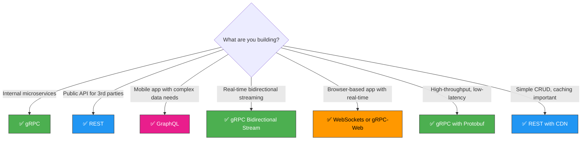

**gRPC shines when:**

- Communication is between **internal services** you control (same proto, same team)
- You need **streaming** — server, client, or bidirectional
- **Payload efficiency** matters (mobile, IoT, high-throughput systems)
- Strong **API contracts** with automatic code generation are valuable
- **Low latency** is critical — binary serialization + multiplexed HTTP/2

**Consider alternatives when:**

- Your API is **public-facing** for unknown clients (REST is more universally accessible)
- **Browser clients** need full bidirectional streaming (use WebSockets or Socket.IO)
- **HTTP caching** (CDN, browser cache) is essential
- You need **human-readable** requests/responses for debugging (JSON is easier to inspect)
- Your team is not ready to adopt Protobuf tooling and HTTP/2 infrastructure

[← Back to Backend Engineering](../README.md) · © sparshjaswal
