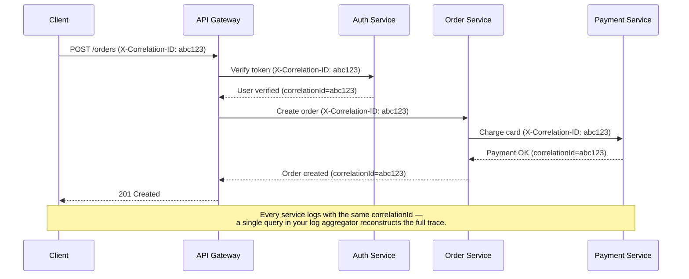
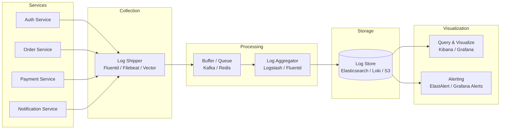
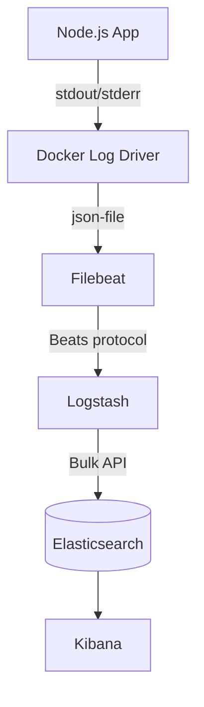
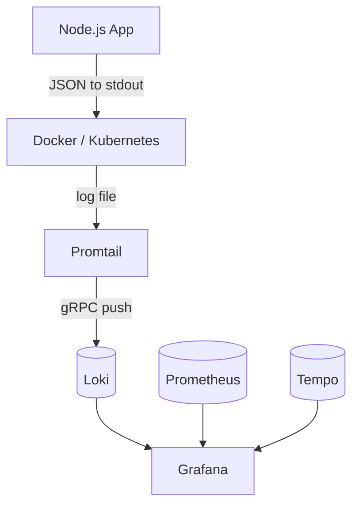

# Logging 📋

Logging is the practice of recording events, errors, and diagnostic information during application execution. In production systems, logs are often the **only window** into what happened when things go wrong — making a well-designed logging strategy essential for debugging, monitoring, auditing, and security forensics.

> _Logs tell the story of your application. Make sure it's a story worth reading — structured, searchable, and free of noise._

---

## Why Logging Matters

Before diving into implementation, it's important to understand what logging actually gives you:

| Purpose | Description |
| --- | --- |
| **Debugging** | Trace execution flow and pinpoint where failures occur |
| **Monitoring** | Detect anomalies, performance regressions, and error spikes |
| **Auditing** | Record who did what and when (compliance, security) |
| **Alerting** | Trigger alerts when critical errors or patterns appear |
| **Forensics** | Reconstruct what happened during a security incident |
| **Business intelligence** | Analyze user behavior, feature adoption, and usage patterns |

---

## Structured Logging

Structured logging means writing logs as machine-parseable data (typically JSON) rather than free-form text. Every log entry is a set of key-value pairs with a consistent schema.

### Why Structured?

**Unstructured (bad):**
```
User alice@example.com failed to login from IP 192.168.1.100 at 2024-01-15T10:30:00Z
```

**Structured (good):**
```json
{
  "timestamp": "2024-01-15T10:30:00.000Z",
  "level": "warn",
  "message": "Failed login attempt",
  "userId": "usr_abc123",
  "email": "alice@example.com",
  "ip": "192.168.1.100",
  "reason": "invalid_password",
  "attemptNumber": 3,
  "service": "auth-service",
  "traceId": "abc123def456"
}
```

With structured logs you can query with precision: _"Show me all failed logins for user usr_abc123 in the last hour"_ becomes a simple log-aggregator query instead of a regex nightmare.

### Key Properties of a Good Log Entry

Every log entry should include:

| Field | Required? | Description |
| --- | --- | --- |
| `timestamp` | ✅ | ISO 8601 with timezone (millisecond precision) |
| `level` | ✅ | severity level: `trace`, `debug`, `info`, `warn`, `error`, `fatal` |
| `message` | ✅ | Human-readable summary (the "what happened") |
| `service` | ✅ | Name of the service/application |
| `traceId` | ✅ | Correlation ID — links requests across services |
| `spanId` | Recommended | Individual operation within a trace (OpenTelemetry) |
| `requestId` | Recommended | Unique per HTTP request |
| `userId` | When applicable | Identifier of the authenticated user |
| `duration` | When applicable | Operation duration in milliseconds |
| `error.stack` | On error | Stack trace (dev/staging only, never production) |
| `context` | Optional | Additional structured data specific to the operation |

### Implementing Structured Logging in Node.js

```typescript
// logger.ts — base logger factory
import pino from 'pino';

export const logger = pino({
  level: process.env.LOG_LEVEL || 'info',
  formatters: {
    level(label) {
      return { level: label };
    },
  },
  timestamp: pino.stdTimeFunctions.isoTime,
  // Redact sensitive fields globally
  redact: {
    paths: [
      'password',
      'token',
      'authorization',
      'creditCard',
      'ssn',
      'body.password',
      'body.token',
      'headers.authorization',
    ],
    censor: '[REDACTED]',
  },
  // Pretty-print in development, JSON in production
  transport: process.env.NODE_ENV !== 'production'
    ? { target: 'pino-pretty', options: { colorize: true } }
    : undefined,
});
```

---

## Log Levels

Log levels provide a graduated scale of severity. Using the right level makes it easy to filter noise and focus on what matters.

### Standard Level Hierarchy

| Level | Severity | Meaning | When to Use |
| --- | --- | --- | --- |
| `fatal` / `critical` | 60 | System is unusable | Database is down, out of memory — immediate human intervention required |
| `error` | 50 | Error events that might still allow continued operation | Failed API call, transaction rollback, unhandled exception in a request |
| `warn` | 40 | Potentially harmful situations | Deprecated API usage, retry attempts, approaching rate limit, slow query |
| `info` | 30 | Normal but significant events | Application startup, user signup, order placed, config loaded |
| `debug` | 20 | Detailed information for debugging | SQL queries, request/response payloads, cache hits/misses |
| `trace` | 10 | Very fine-grained tracing | Every function entry/exit, variable values — extremely verbose |

### Level Guidelines

- **Production default:** `info` — captures the signal without the noise
- **Staging:** `debug` — troubleshoot issues before they reach production
- **Development:** `debug` or `trace` — full visibility during local work
- **Never log at `error` for expected failures** — a validation error is a `warn` at most; an `error` implies something broke that shouldn't have
- **Adjust dynamically:** provide an admin endpoint or feature flag to temporarily raise/lower the log level without redeploying

```typescript
// Example: using levels correctly in an Express route
app.post('/api/orders', async (req, res) => {
  logger.info({ userId: req.user.id, items: req.body.items.length }, 'Order creation requested');

  try {
    const order = await orderService.create(req.body);
    logger.info({ orderId: order.id, total: order.total }, 'Order created successfully');
    res.status(201).json(order);
  } catch (err) {
    if (err instanceof ValidationError) {
      logger.warn({ err, body: req.body }, 'Order validation failed');
      res.status(422).json({ error: err.message });
    } else {
      logger.error({ err }, 'Unexpected error creating order');
      res.status(500).json({ error: 'Internal server error' });
    }
  }
});
```

---

## Logger Comparison: Winston vs Pino vs Bunyan

Choosing a logger is a foundational decision. Here's how the three major Node.js loggers compare.

### Overview

| Criteria | [Winston](https://github.com/winstonjs/winston) | [Pino](https://github.com/pinojs/pino) | [Bunyan](https://github.com/trentm/node-bunyan) |
| --- | --- | --- | --- |
| **First release** | 2011 | 2016 | 2012 |
| **Performance** | Moderate (~6K ops/s) | Extremely fast (~30K+ ops/s) | Moderate (~5K ops/s) |
| **Ecosystem** | Largest — dozens of transports | Growing — core transports built-in | Mature but less active |
| **Dependencies** | 30+ (heavy) | ~5 (lightweight) | ~10 (moderate) |
| **TypeScript support** | Via `@types/winston` | First-class (written in TS) | Via `@types/bunyan` |
| **Child loggers** | Yes (`logger.child()`) | Yes (`logger.child()`) — very fast | Yes (`logger.child()`) — foundational concept |
| **Serializers** | Via `winston.format` | Yes (custom serializers per field) | Yes (custom serializers) |
| **Streams / Transports** | Console, File, HTTP, many community | Console, File, custom streams (fast) | Stream-based (stdout, file, raw) |
| **Async logging** | Yes (async transports) | No (synchronous by design — for speed) | No (synchronous) |
| **Redaction** | Manual via format transforms | Built-in `redact` option | Manual via serializers |
| **Browser support** | Yes (browser build) | Yes (limited) | No |

### Performance Comparison

Pino's speed advantage comes from its design philosophy: **minimal work per log call**. It defers formatting, serialization, and transport writes to a separate thread/callback using Node.js's `pino.destination()` with asynchronous flushing.

```typescript
// Winston — familiar callback/stream-based API
import winston from 'winston';

const winstonLogger = winston.createLogger({
  level: 'info',
  format: winston.format.combine(
    winston.format.timestamp(),
    winston.format.errors({ stack: true }),
    winston.format.json(),
  ),
  transports: [
    new winston.transports.Console(),
    new winston.transports.File({ filename: 'error.log', level: 'error' }),
  ],
});

winstonLogger.info('User logged in', { userId: 'abc123' });
```

```typescript
// Pino — minimal-overhead, synchronous-by-design
import pino from 'pino';

const pinoLogger = pino({
  level: 'info',
  redact: ['password', 'token'],
  transport: {
    target: 'pino/file',
    options: { destination: './app.log' },
  },
});

pinoLogger.info({ userId: 'abc123' }, 'User logged in');
```

```typescript
// Bunyan — hierarchical child loggers as core pattern
import bunyan from 'bunyan';

const bunyanLogger = bunyan.createLogger({
  name: 'myapp',
  level: 'info',
  serializers: {
    err: bunyan.stdSerializers.err,
    req: bunyan.stdSerializers.req,
    res: bunyan.stdSerializers.res,
  },
  streams: [
    { stream: process.stdout },
    { path: 'error.log', level: 'error' },
  ],
});

bunyanLogger.info({ userId: 'abc123' }, 'User logged in');
```

### Which Logger Should You Choose?

| Scenario | Recommendation |
| --- | --- |
| High-throughput services (10K+ req/s) | **Pino** — its speed advantage is real at scale |
| Enterprise / legacy ecosystem | **Winston** — largest plugin ecosystem, async transports |
| Microservices with correlation IDs | **Pino** — child loggers are faster and more ergonomic |
| Teams that value simplicity | **Pino** — fewer config options, sensible defaults |
| You need browser + server logging | **Winston** — browser build available |
| You're building a NestJS app | **Winston** (via `nest-winston`) or **Pino** (via `nestjs-pino`) |

> **My recommendation:** Start with **Pino** for new Node.js projects. It's the fastest, has the smallest footprint, and its API is clean and modern. Choose Winston if you have specific transport needs (e.g., logging to a legacy syslog server with an existing Winston transport).

---

## Correlation IDs

A correlation ID (also called trace ID or request ID) is a unique identifier attached to every log entry within a single request's lifecycle. It's the thread that ties together log entries across multiple services, async operations, and time — allowing you to reconstruct the full journey of a request.

### How It Works



### Implementation in Express

```typescript
// middleware/correlationId.ts
import { randomUUID } from 'crypto';
import { Request, Response, NextFunction } from 'express';
import { AsyncLocalStorage } from 'async_hooks';

// AsyncLocalStorage keeps context across async boundaries
// without passing the correlation ID through every function call
export const requestContext = new AsyncLocalStorage<{ correlationId: string }>();

export function correlationIdMiddleware(req: Request, res: Response, next: NextFunction) {
  // Accept incoming correlation ID or generate a new one
  const correlationId =
    req.headers['x-correlation-id'] as string ||
    req.headers['x-request-id'] as string ||
    randomUUID();

  // Attach to request object for convenience
  (req as any).correlationId = correlationId;

  // Echo back to client in response header
  res.setHeader('X-Correlation-ID', correlationId);

  // Run the entire request within AsyncLocalStorage context
  requestContext.run({ correlationId }, () => {
    next();
  });
}
```

```typescript
// logger.ts — logger that automatically includes correlation ID
import pino from 'pino';
import { requestContext } from './middleware/correlationId';

export const logger = pino({
  level: process.env.LOG_LEVEL || 'info',
  timestamp: pino.stdTimeFunctions.isoTime,
  mixin() {
    // Automatically add correlationId to every log entry
    const ctx = requestContext.getStore();
    return ctx ? { correlationId: ctx.correlationId } : {};
  },
});
```

```typescript
// Usage in a service
import { logger } from '../logger';

async function createOrder(userId: string, items: Item[]) {
  // No need to pass correlationId — the logger pulls it from AsyncLocalStorage
  logger.info({ userId, itemCount: items.length }, 'Creating order');
  // ... business logic ...
  logger.info({ orderId: order.id }, 'Order created');
}
```

### Passing Correlation IDs Between Services

When calling downstream services, forward the correlation ID in the request headers:

```typescript
// httpClient.ts
import { requestContext } from './middleware/correlationId';

export async function callDownstream(url: string, options: RequestInit = {}) {
  const ctx = requestContext.getStore();
  const headers = {
    ...options.headers,
    'X-Correlation-ID': ctx?.correlationId || 'unknown',
    'Content-Type': 'application/json',
  };

  return fetch(url, { ...options, headers });
}
```

### Trace ID vs Span ID (OpenTelemetry Alignment)

If you're using OpenTelemetry (or plan to), align your correlation ID with the W3C Trace Context standard:

| Field | W3C Header | Description |
| --- | --- | --- |
| **traceId** | `traceparent` | Identifies the entire end-to-end trace (32 hex chars) |
| **spanId** | `traceparent` | Identifies a single operation within the trace (16 hex chars) |
| **traceFlags** | `traceparent` | Sampling decision (01 = sampled) |

```typescript
// Aligning custom correlation ID with OpenTelemetry trace context
import { trace } from '@opentelemetry/api';

export function correlationIdMiddleware(req: Request, res: Response, next: NextFunction) {
  const activeSpan = trace.getActiveSpan();
  const traceId = activeSpan?.spanContext().traceId || randomUUID();

  (req as any).correlationId = traceId;
  res.setHeader('X-Correlation-ID', traceId);
  res.setHeader('X-Trace-Id', traceId);

  requestContext.run({ correlationId: traceId }, () => {
    next();
  });
}
```

---

## Child Loggers

Child loggers create a new logger instance that inherits configuration from a parent but adds additional bound context. Every log entry from the child automatically includes the bound fields — no need to pass them manually.

### Why Child Loggers?

Without child loggers, you repeat context everywhere:

```typescript
// Repetitive and error-prone — easy to forget a field
logger.info({ module: 'OrderService', orderId: '123', userId: 'abc' }, 'Processing');
logger.info({ module: 'OrderService', orderId: '123', userId: 'abc' }, 'Validated');
logger.info({ module: 'OrderService', orderId: '123', userId: 'abc' }, 'Saved');
```

With a child logger, context is bound once:

```typescript
// Context bound once — all subsequent logs inherit it
const orderLogger = logger.child({ module: 'OrderService', orderId: '123', userId: 'abc' });
orderLogger.info('Processing');
orderLogger.info('Validated');
orderLogger.info('Saved');
```

### Child Logger Patterns

**Per-module logger:**

```typescript
// modules/orders/logger.ts
import { logger } from '../../logger';

export const orderLogger = logger.child({ module: 'OrderService' });
```

**Per-request logger (using correlation ID + user context):**

```typescript
// middleware/requestLogger.ts
import { Request, Response, NextFunction } from 'express';

export function requestLoggerMiddleware(req: Request, res: Response, next: NextFunction) {
  const childLogger = logger.child({
    correlationId: (req as any).correlationId,
    userId: (req as any).user?.id,
    ip: req.ip,
    userAgent: req.headers['user-agent'],
    method: req.method,
    path: req.path,
  });

  (req as any).logger = childLogger;

  const start = Date.now();
  res.on('finish', () => {
    childLogger.info({
      statusCode: res.statusCode,
      duration: Date.now() - start,
    }, `${req.method} ${req.path} ${res.statusCode}`);
  });

  next();
}
```

**Per-job logger (background jobs):**

```typescript
// workers/emailWorker.ts
import { logger } from '../logger';

export async function processEmailJob(job: Job) {
  const jobLogger = logger.child({
    jobId: job.id,
    jobType: 'sendEmail',
    recipient: job.data.to,
  });

  jobLogger.info('Starting email job');

  try {
    await emailService.send(job.data);
    jobLogger.info('Email sent successfully');
  } catch (err) {
    jobLogger.error({ err }, 'Email job failed');
    throw err;
  }
}
```

### Pino Child Logger Performance

Pino's `.child()` is exceptionally fast because it doesn't create a new logger instance — it creates a lightweight wrapper that prepends the bound fields to every log call. Bunyan has a similar concept (it pioneered child loggers in Node.js). Winston's `.child()` is supported but adds more overhead due to its format pipeline.

---

## PII Redaction

Personally Identifiable Information (PII) must never appear in plaintext in your logs. This includes names, email addresses, phone numbers, government IDs, credit card numbers, IP addresses (in some jurisdictions), and authentication tokens.

### What Constitutes PII?

| Category | Examples | Risk Level |
| --- | --- | --- |
| **Direct identifiers** | Full name, email, phone, SSN, passport number | 🔴 Critical — never log |
| **Financial data** | Credit card numbers, bank account numbers, CVV | 🔴 Critical — never log |
| **Credentials** | Passwords, API keys, JWT tokens, session IDs | 🔴 Critical — never log |
| **Biometric data** | Fingerprints, face recognition data | 🔴 Critical — never log |
| **Location data** | GPS coordinates, street address | 🟡 High — log only if essential; mask or coarse-grain |
| **IP addresses** | Client IP | 🟡 High — GDPR considers IP as personal data; hash or truncate if logging |
| **Device identifiers** | IMEI, advertising IDs | 🟡 High — avoid logging raw values |

### Redaction Strategies

#### 1. **Schema-Level Redaction (Pino built-in)**

Pino's `redact` option removes or masks fields before they reach the transport layer. This is the safest approach — the data never leaves the logger.

```typescript
const logger = pino({
  redact: {
    paths: [
      // Top-level fields
      'password',
      'token',
      'authorization',
      'creditCard',
      'ssn',
      // Nested fields in request/response bodies
      'body.password',
      'body.creditCard',
      'body.*.password',   // wildcard support
      'headers.authorization',
      'headers.cookie',
      // Arrays
      'users[*].email',     // redact email in every array element
    ],
    censor: '[REDACTED]',
    // Optional: completely remove instead of replacing
    remove: false,
  },
});
```

#### 2. **Serializer-Based Redaction**

For more control, define custom serializers that transform objects before they're logged:

```typescript
import pino from 'pino';

const logger = pino({
  serializers: {
    user(user: any) {
      // Only log non-sensitive fields
      return {
        id: user.id,
        role: user.role,
        // Explicitly omit: password, email, phone, ssn
      };
    },
    req(req: any) {
      return {
        method: req.method,
        url: req.url,
        // Strip sensitive headers
        headers: {
          ...req.headers,
          authorization: req.headers?.authorization ? '[REDACTED]' : undefined,
          cookie: req.headers?.cookie ? '[REDACTED]' : undefined,
        },
        // Don't log the body at all (or sanitize it)
        remoteAddress: req.ip,
      };
    },
  },
});
```

#### 3. **Regex-Based Scrubbing (Winston)**

Winston requires formatter-based scrubbing since it lacks built-in redaction:

```typescript
import winston from 'winston';

// Custom formatter that scrubs PII from the message string
const scrubPii = winston.format((info) => {
  // Scrub email addresses
  info.message = info.message.replace(
    /[a-zA-Z0-9._%+-]+@[a-zA-Z0-9.-]+\.[a-zA-Z]{2,}/g,
    '[EMAIL_REDACTED]',
  );
  // Scrub credit card numbers (basic pattern)
  info.message = info.message.replace(
    /\b(?:\d[ -]*?){13,16}\b/g,
    '[CC_REDACTED]',
  );
  return info;
});

const logger = winston.createLogger({
  format: winston.format.combine(
    scrubPii(),
    winston.format.json(),
  ),
  transports: [new winston.transports.Console()],
});
```

> ⚠️ **Regex scrubbing is a safety net, not a primary strategy.** It's easy to miss edge cases. Always prefer schema-level redaction and serializers.

#### 4. **Hashing for Auditability**

Sometimes you need to identify a user in logs without storing their actual identifier. Hashing provides a one-way mapping:

```typescript
import crypto from 'crypto';

function hashIdentifier(value: string, salt: string = process.env.LOG_SALT || 'default'): string {
  return crypto
    .createHmac('sha256', salt)
    .update(value)
    .digest('hex')
    .substring(0, 16); // First 16 chars is enough for log correlation
}

// Usage
logger.info({
  userIdHash: hashIdentifier(user.email),
  action: 'password_reset_requested',
});
```

### Redaction Checklist for Production

- [ ] Passwords and tokens: **never logged** — redact at schema level
- [ ] Email addresses: **redacted or hashed** in production logs
- [ ] Full request bodies: **logged only at debug/trace level**, with PII fields redacted
- [ ] Authorization headers: **always stripped**
- [ ] Stack traces: **logged in dev/staging only** — never in production (they can leak paths, secrets, and query parameters)
- [ ] Third-party API responses: **sanitized before logging** — they may contain user data you didn't expect
- [ ] Log retention policies: **aligned with data retention requirements** (GDPR: right to erasure applies to logs too)

---

## Centralized Logging

In a single-server application, `tail -f /var/log/app.log` works. In a distributed system with dozens or hundreds of services, you need centralized logging — all logs shipped to a single place where they can be searched, correlated, and analyzed.

### The Centralized Logging Architecture



### Option 1: ELK Stack (Elasticsearch + Logstash + Kibana)

The most widely deployed centralized logging stack. Mature, feature-rich, and battle-tested — but resource-heavy.

| Component | Role |
| --- | --- |
| **Elasticsearch** | Distributed search and analytics engine — stores and indexes logs |
| **Logstash** | Data processing pipeline — ingests, transforms, and ships logs |
| **Kibana** | Visualization layer — dashboards, queries, alerting |
| **Filebeat** | Lightweight shipper — tails log files and sends to Logstash/Elasticsearch |

**Architecture:**



**Pino + ELK integration:**

```typescript
// Pino logs JSON to stdout — Docker/Filebeat picks it up natively
import pino from 'pino';

const logger = pino({
  level: process.env.LOG_LEVEL || 'info',
  timestamp: pino.stdTimeFunctions.isoTime,
  // Elasticsearch maps @timestamp by default — align your timestamp field
  formatters: {
    level(label) {
      return { level: label };
    },
  },
  // No pretty-printing in production — raw JSON for Logstash
});

logger.info({ service: 'order-service', userId: 'abc' }, 'Order placed');
```

**Logstash pipeline config:**

```
# logstash.conf
input {
  beats {
    port => 5044
  }
}

filter {
  json {
    source => "message"
  }
  # Parse @timestamp for Elasticsearch
  date {
    match => ["timestamp", "ISO8601"]
    target => "@timestamp"
  }
  # Remove unnecessary fields
  mutate {
    remove_field => ["@version", "host", "ecs"]
  }
}

output {
  elasticsearch {
    hosts => ["http://elasticsearch:9200"]
    index => "app-logs-%{+YYYY.MM.dd}"
  }
}
```

**Pros:**
- Extremely powerful full-text search and aggregation
- Rich ecosystem of plugins and tools
- Kibana dashboards are highly customizable
- Handles petabytes of data

**Cons:**
- **Heavy:** Elasticsearch is a resource hog (heap memory, disk i/o)
- **Expensive at scale:** licensing (Elastic license changes), infrastructure costs
- **Complex to operate:** tuning JVM, managing indices, shard allocation

### Option 2: Grafana Loki

Loki is a horizontally-scalable, highly-available log aggregation system inspired by Prometheus. It indexes only **metadata** (labels) — not the full text of log lines — making it dramatically cheaper to operate than Elasticsearch.

| Component | Role |
| --- | --- |
| **Loki** | Log storage and query engine |
| **Promtail** | Agent that tails log files, adds labels, and pushes to Loki |
| **Grafana** | Unified UI for logs (Loki), metrics (Prometheus), and traces (Tempo) |

**Architecture:**



**Pino + Loki integration:**

```typescript
// pino-loki transport sends logs directly to Loki via HTTP
import pino from 'pino';

const logger = pino({
  level: 'info',
  transport: {
    target: 'pino-loki',
    options: {
      batching: true,
      interval: 5,          // batch interval in seconds
      host: 'http://loki:3100',
      labels: {
        service: 'order-service',
        environment: process.env.NODE_ENV || 'development',
      },
      // Map Pino fields to Loki labels (for efficient querying)
      propsToLabels: ['level', 'module', 'userId'],
    },
  },
});
```

**Promtail config:**

```yaml
# promtail-config.yaml
server:
  http_listen_port: 9080

clients:
  - url: http://loki:3100/loki/api/v1/push

scrape_configs:
  - job_name: app-logs
    static_configs:
      - targets:
          - localhost
        labels:
          job: app-logs
          service: order-service
          __path__: /var/log/app/*.log
    pipeline_stages:
      - json:
          expressions:
            level: level
            message: message
            timestamp: timestamp
      - labels:
          level:
      - timestamp:
          source: timestamp
          format: RFC3339
```

**Pros:**
- **Cost-effective:** indexes only metadata, stores compressed log chunks
- **Unified observability:** same Grafana instance for logs, metrics, traces
- **Simple to operate:** single binary, no JVM tuning, object storage backend
- **LogQL:** query language similar to PromQL (familiar to DevOps)

**Cons:**
- Limited full-text search (no indexing of log body — sequential scan of chunks)
- Smaller ecosystem than ELK
- Newer, less battle-tested in very large deployments

### Option 3: AWS CloudWatch

CloudWatch is AWS's native monitoring and observability service. If you're on AWS, it's the path of least resistance — no infrastructure to manage.

| Component | Role |
| --- | --- |
| **CloudWatch Logs** | Log storage, querying, and retention |
| **CloudWatch Agent** | Collects logs and metrics from EC2/on-prem |
| **CloudWatch Insights** | Query language for searching and analyzing logs |
| **CloudWatch Alarms** | Alert on log patterns (e.g., "ERROR" count > threshold) |

**Pino + CloudWatch integration:**

```typescript
// Option A: Write JSON to stdout/console — CloudWatch Agent or ECS/Docker log driver picks it up
import pino from 'pino';

const logger = pino({
  level: 'info',
  // Plain JSON to stdout — no transport overhead
});

// Option B: Use AWS SDK directly (for Lambda or when you need programmatic control)
import { CloudWatchLogs } from '@aws-sdk/client-cloudwatch-logs';
import pino from 'pino';

const cloudWatch = new CloudWatchLogs({ region: 'us-east-1' });

const logger = pino({
  level: 'info',
  transport: {
    target: 'pino-cloudwatch',
    options: {
      groupName: '/app/order-service',
      streamName: process.env.NODE_ENV,
      awsRegion: 'us-east-1',
      interval: 2000, // batch interval in ms
    },
  },
});
```

**CloudWatch Logs Insights query examples:**

```
# Find all errors in the last hour
fields @timestamp, level, message, correlationId
| filter level = "error"
| sort @timestamp desc
| limit 50

# Count errors by service
fields @timestamp, service, level
| filter level = "error"
| stats count(*) as errorCount by service
| sort errorCount desc

# Find slow requests (duration > 1000ms)
fields @timestamp, method, path, duration, statusCode
| filter duration > 1000
| sort duration desc
| limit 20
```

**Pros:**
- **Zero infrastructure management** — fully managed service
- **Deep AWS integration** — automatically collects Lambda, ECS, RDS, and other service logs
- **IAM-based access control** — fine-grained permissions
- **Retention policies** — set per log group (1 day to never expire)

**Cons:**
- **Cost:** ingestion ($0.50/GB) + storage ($0.03/GB/month) + queries ($0.005/GB scanned) — can add up fast
- **Vendor lock-in:** tight coupling to AWS ecosystem
- **Query experience:** CloudWatch Insights is functional but less powerful than Kibana or Grafana
- **Limited visualization:** no dashboards as rich as Kibana/Grafana without exporting to another tool

### Comparison Matrix

| Criteria | ELK Stack | Grafana Loki | AWS CloudWatch |
| --- | --- | --- | --- |
| **Full-text search** | ✅ Excellent | ⚠️ Limited (no indexing) | ⚠️ Moderate (Insights queries) |
| **Cost** | 🔴 High (infra + licensing) | 🟢 Low (cheap object storage) | 🟡 Variable (pay per GB) |
| **Operational complexity** | 🔴 High (JVM tuning, clusters) | 🟢 Low (single binary) | 🟢 None (fully managed) |
| **Visualization** | ✅ Kibana — powerful | ✅ Grafana — unified | ⚠️ Basic dashboards |
| **Alerting** | ✅ ElastAlert / Kibana | ✅ Grafana Alerts | ✅ CloudWatch Alarms |
| **Retention** | Configurable | Configurable (S3/GCS backend) | Configurable per log group |
| **Multi-cloud** | ✅ Runs anywhere | ✅ Runs anywhere | ❌ AWS only |
| **Open source** | ✅ (with license caveats) | ✅ (AGPLv3) | ❌ Proprietary |
| **Best for** | Large enterprises, full-text search needs | Kubernetes, Prometheus users, cost-conscious teams | AWS-native shops, serverless apps |

---

## Logging Best Practices

### 1. Log Everything to stdout/stderr

Applications should write logs to standard output and standard error — not to files. Let the runtime environment (Docker, systemd, Kubernetes, process manager) handle log routing, rotation, and shipping. This keeps your application portable and follows the [Twelve-Factor App](https://12factor.net/logs) methodology.

```
✅  console.log(JSON.stringify(logEntry))   // stdout
✅  logger.info('Event')                     // writes to stdout via Pino
❌  fs.appendFileSync('/var/log/app.log')    // don't do this in-app
```

### 2. Use Appropriate Log Levels

```
logger.error()  → Something broke that shouldn't have. Needs attention.
logger.warn()   → Something unexpected but handled. Worth investigating.
logger.info()   → Normal business event. Order placed, user signed up, payment processed.
logger.debug()  → Detailed internal state. SQL queries, cache state, intermediate values.
logger.trace()  → Extremely verbose. Function entry/exit, loop iterations.
```

### 3. One Log Entry Per Event

Resist the temptation to log multiple lines for one event. A single structured log entry with all relevant context is always better:

```typescript
// ❌ Multiple lines — hard to correlate
console.log('Processing order...');
console.log(`User: ${userId}`);
console.log(`Items: ${items.length}`);
console.log(`Total: $${total}`);

// ✅ Single structured entry
logger.info({ userId, itemCount: items.length, total }, 'Order processed');
```

### 4. Include Enough Context to Reproduce the Issue

A log entry should answer: **who, what, when, where, and why**. If you can't reproduce the issue from the log alone, you didn't log enough context.

```typescript
// ❌ Not enough context
logger.error('Database query failed');

// ✅ Reproducible context
logger.error({
  query: 'SELECT * FROM orders WHERE id = $1',
  params: [orderId],
  dbHost: 'orders-db.internal',
  duration: 5240,
  err,
}, 'Database query failed — connection timeout after 5s');
```

### 5. Never Log Sensitive Data

Covered in detail in the PII Redaction section above. As a rule of thumb: **if you wouldn't want it shown on a screen during a conference presentation, don't log it.**

### 6. Log at Service Boundaries

Always log when a request enters your service and when it exits. This creates natural "bookends" that make distributed tracing possible even without a tracing system:

```typescript
// Express middleware — request boundary
app.use((req, res, next) => {
  req.startTime = Date.now();
  logger.info({
    method: req.method,
    path: req.path,
    query: req.query,
    ip: req.ip,
  }, '→ Request received');
  next();
});

app.use((req, res) => {
  logger.info({
    method: req.method,
    path: req.path,
    statusCode: res.statusCode,
    duration: Date.now() - req.startTime,
  }, '← Response sent');
});
```

### 7. Handle High-Volume Logging with Sampling

At very high throughput (10K+ req/s), logging every single request can become a bottleneck. Consider **log sampling** for debug/trace levels:

```typescript
// Log all errors, but only 1% of debug entries
const debugLogger = {
  debug: (obj: object, msg: string) => {
    if (Math.random() < 0.01) {  // 1% sampling
      logger.debug(obj, msg);
    }
  },
  // info, warn, error always logged
};

// Or use Pino's level-based approach — set level to 'info' in production
// debug and trace are automatically suppressed
```

### 8. Monitor Your Logging Pipeline

Logging itself can fail — disk full, network partition, log aggregator down. Monitor log shipment lag and error rates:

```typescript
// Track dropped logs
let droppedLogs = 0;

const logger = pino({
  transport: {
    target: 'pino-loki',
    options: {
      host: 'http://loki:3100',
      onError(err) {
        droppedLogs++;
        if (droppedLogs % 100 === 0) {
          console.error(`Dropped ${droppedLogs} log entries — Loki unreachable`);
        }
      },
    },
  },
});

// Expose as a Prometheus metric
import { Counter } from 'prom-client';
export const droppedLogsCounter = new Counter({
  name: 'app_dropped_logs_total',
  help: 'Total number of log entries dropped',
});
```

---

## Sample Logging Configuration (Production-Ready)

Here's a complete, production-ready logging setup using Pino with correlation IDs, redaction, and environment-aware configuration:

```typescript
// src/lib/logger.ts
import pino from 'pino';
import { randomUUID } from 'crypto';
import { AsyncLocalStorage } from 'async_hooks';

// ── Request Context ──────────────────────────────────────────
export const requestContext = new AsyncLocalStorage<{
  correlationId: string;
  userId?: string;
}>();

// ── Logger Factory ───────────────────────────────────────────
const isProduction = process.env.NODE_ENV === 'production';
const isTest = process.env.NODE_ENV === 'test';

export const logger = pino({
  // Level: respect LOG_LEVEL env var, default based on environment
  level: process.env.LOG_LEVEL || (isProduction ? 'info' : 'debug'),

  // Timestamp format
  timestamp: pino.stdTimeFunctions.isoTime,

  // Structured metadata added to every log entry
  base: {
    service: process.env.SERVICE_NAME || 'unknown',
    environment: process.env.NODE_ENV || 'development',
    version: process.env.APP_VERSION || '0.0.0',
    hostname: require('os').hostname(),
  },

  // PII Redaction — strip sensitive fields before they hit the transport
  redact: {
    paths: [
      'password',
      'token',
      'authorization',
      'creditCard',
      'ssn',
      'body.password',
      'body.token',
      'body.creditCard',
      'headers.authorization',
      'headers.cookie',
      'headers["set-cookie"]',
    ],
    censor: '[REDACTED]',
    remove: false,
  },

  // Serializers — transform objects before logging
  serializers: {
    err: pino.stdSerializers.err,
    req: (req: any) => ({
      method: req.method,
      url: req.url,
      headers: {
        host: req.headers?.host,
        'user-agent': req.headers?.['user-agent'],
        'content-type': req.headers?.['content-type'],
        // authorization intentionally omitted
      },
      remoteAddress: req.ip,
    }),
    res: (res: any) => ({
      statusCode: res.statusCode,
      headers: {
        'content-type': res.getHeader?.('content-type'),
      },
    }),
  },

  // Mixin — add dynamic context (correlation ID) to every log
  mixin() {
    const ctx = requestContext.getStore();
    return ctx ? { correlationId: ctx.correlationId, userId: ctx.userId } : {};
  },

  // Transport — pretty in dev, raw JSON in production
  ...(isTest
    ? {} // Suppress all output in test
    : isProduction
      ? {} // Raw JSON to stdout (Docker/Filebeat/Promtail picks it up)
      : {
          transport: {
            target: 'pino-pretty',
            options: {
              colorize: true,
              translateTime: 'SYS:standard',
              ignore: 'pid,hostname',
            },
          },
        }),
});

// ── Express Middleware ────────────────────────────────────────
import { Request, Response, NextFunction } from 'express';

export function loggingMiddleware(req: Request, res: Response, next: NextFunction) {
  const correlationId =
    (req.headers['x-correlation-id'] as string) ||
    (req.headers['x-request-id'] as string) ||
    randomUUID();

  res.setHeader('X-Correlation-ID', correlationId);
  const start = Date.now();

  requestContext.run({ correlationId }, () => {
    // Log incoming request
    logger.info({ req }, '→ Incoming request');

    // Log outgoing response on finish
    res.on('finish', () => {
      const duration = Date.now() - start;
      const logFn = res.statusCode >= 500 ? logger.error
        : res.statusCode >= 400 ? logger.warn
        : logger.info;

      logFn({
        res,
        duration,
        correlationId,
      }, `← ${req.method} ${req.path} ${res.statusCode} (${duration}ms)`);
    });

    next();
  });
}

// ── Unhandled Error Handling ──────────────────────────────────
process.on('uncaughtException', (err) => {
  logger.fatal({ err }, 'Uncaught exception — process terminating');
  process.exit(1);
});

process.on('unhandledRejection', (reason) => {
  logger.error({ err: reason }, 'Unhandled promise rejection');
});

// ── Graceful Shutdown ─────────────────────────────────────────
process.on('SIGTERM', () => {
  logger.info('SIGTERM received — shutting down gracefully');
  // Give transports time to flush
  setTimeout(() => process.exit(0), 1000);
});
```

---

## Troubleshooting Common Logging Problems

| Problem | Likely Cause | Solution |
| --- | --- | --- |
| **Logs appear out of order** | Buffering in transport; clock skew between services | Use NTP; ensure timestamps are generated at log call time, not transport flush time |
| **Missing logs** | Log level too low; transport buffer overflow; disk full | Check LOG_LEVEL; monitor dropped log counter; alert on disk usage |
| **Performance degradation** | Synchronous file writes; too many log calls | Use Pino (async flush); sample debug/trace logs; don't log in hot paths |
| **PII in logs** | Redaction config missed a field; logged raw request body | Audit redaction paths; use serializers to whitelist fields instead of blacklisting |
| **High log volume costs** | Logging too much at info level; verbose third-party libraries | Set appropriate levels per module; suppress noisy libraries (e.g., `aws-sdk`, `kafkajs`) |
| **Correlation IDs missing** | Middleware not applied to all routes; background jobs not propagating context | Apply middleware globally; use `logger.child()` for job workers; propagate via headers in HTTP calls |

---

## Logging Anti-Patterns

| Anti-Pattern | Why It's Bad | Do This Instead |
| --- | --- | --- |
| `console.log()` everywhere | No levels, no structure, can't disable | Use a proper logger with levels |
| Logging entire request/response bodies at info level | Performance hit, PII exposure, log spam | Log bodies at `debug` level only, with PII redaction |
| `try { ... } catch (err) { console.log(err); }` | Swallows the error completely — no context, wrong level | `logger.error({ err, context }, 'Descriptive message')` — and re-throw if unhandled |
| String interpolation for context: `` `User ${id} did X` `` | Not structured — can't query by `id` | `logger.info({ userId: id }, 'User performed action X')` |
| Logging and then re-throwing the same error | Duplicate log entries, confusing trace | Log once at the boundary (controller level), or log and wrap with context |
| Using `logger.error()` for expected validation failures | Dilutes the meaning of "error" — alerts become noise | `logger.warn()` for handled/expected issues; reserve `error` for unexpected failures |
| Not setting a log retention policy | Logs grow indefinitely; storage costs explode; legal risk | Define retention: e.g., 30 days hot (indexed), 90 days cold (archive), 1 year compliance |

---

## Quick Reference: Choosing Your Stack

```
┌─────────────────────────────────────────────────────────────┐
│                    Logging Decision Tree                     │
├─────────────────────────────────────────────────────────────┤
│                                                             │
│  Are you on AWS with minimal ops bandwidth?                 │
│    ├── YES → CloudWatch + Pino (stdout JSON)                │
│    └── NO → Continue...                                     │
│                                                             │
│  Are you on Kubernetes with Prometheus/Grafana?             │
│    ├── YES → Grafana Loki + Promtail + Pino                 │
│    └── NO → Continue...                                     │
│                                                             │
│  Do you need powerful full-text search across logs?         │
│    ├── YES → ELK Stack + Filebeat + Pino                    │
│    └── NO → Continue...                                     │
│                                                             │
│  Do you have budget/resource constraints?                   │
│    ├── YES → Loki (cheapest) or self-hosted ELK (no license)│
│    └── NO → ELK (most features)                             │
│                                                             │
│  Which logger library?                                      │
│    → Pino (default) — fastest, clean API, built-in redaction│
│    → Winston — if you need specific community transports    │
│    → Bunyan — if you're maintaining an existing Bunyan app  │
│                                                             │
└─────────────────────────────────────────────────────────────┘
```

[← Back to Backend Engineering](../README.md) · © sparshjaswal