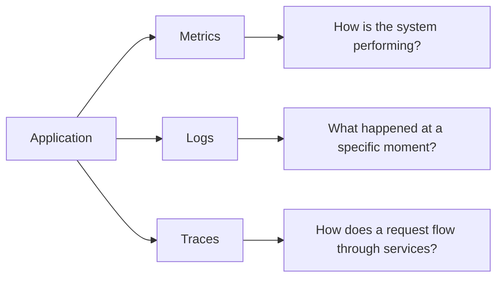
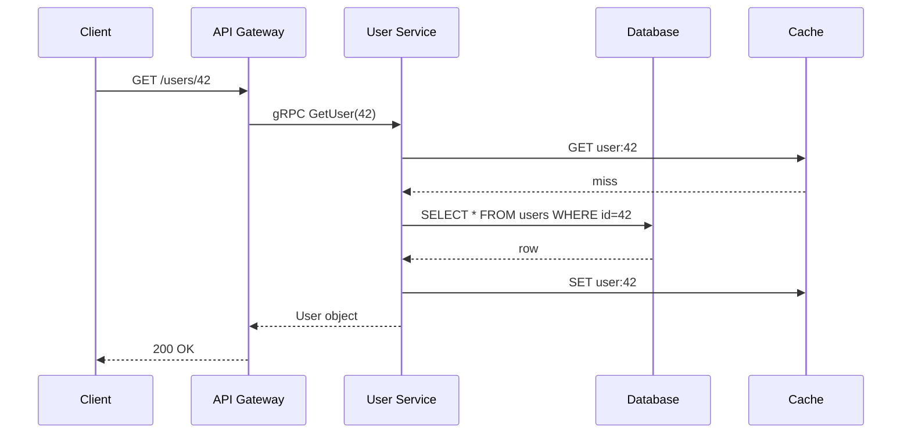
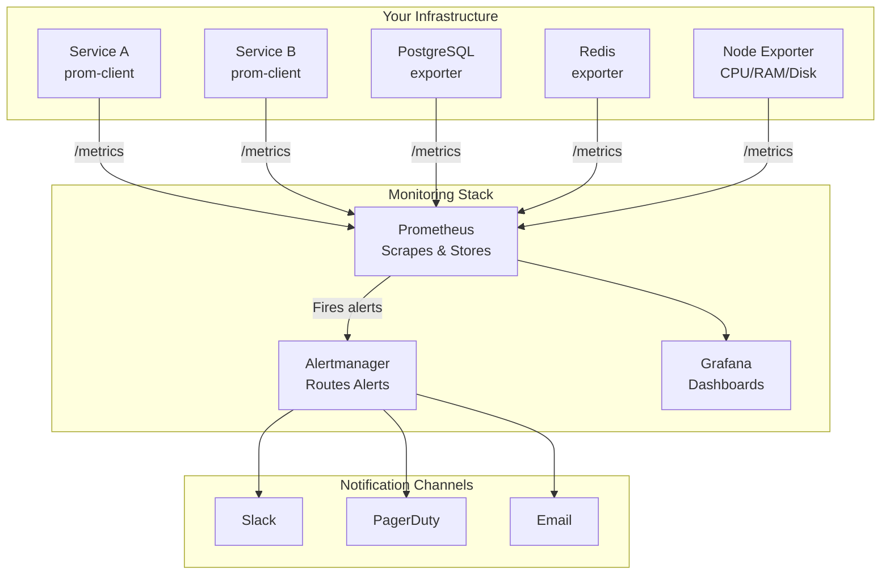
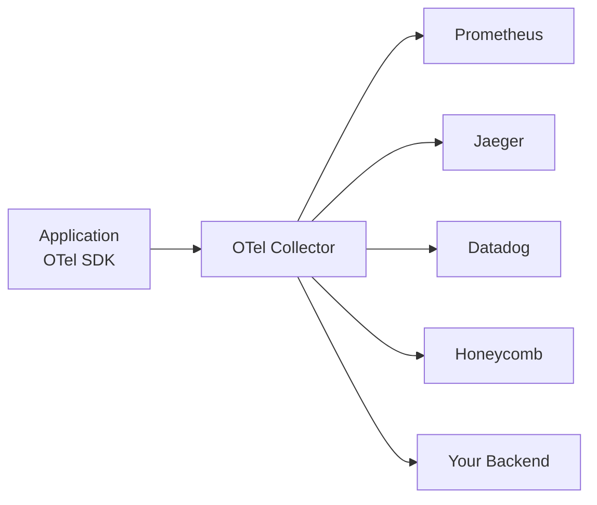
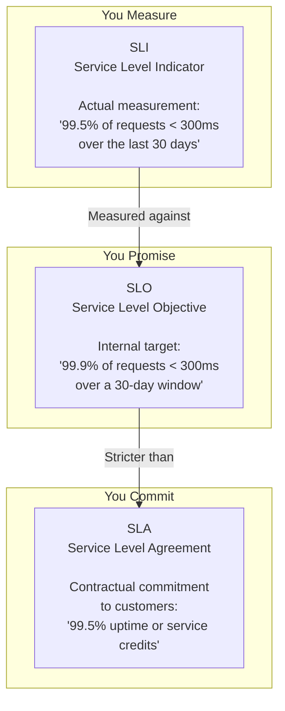

# Monitoring & Observability 📊

Monitoring is the practice of collecting, analyzing, and alerting on metrics to understand system health, performance, and behaviour. Observability extends monitoring by giving you the ability to ask _any_ question about your system's internal state — without shipping new code.

> _"Monitoring tells you **that** something is wrong. Observability helps you understand **why**."_

---

## The Three Pillars of Observability

Observability rests on three fundamental telemetry signals. Each answers a different question about your system.



| Pillar      | Question                    | Data Shape                                         | Retention                   | Cost        |
| ----------- | --------------------------- | -------------------------------------------------- | --------------------------- | ----------- |
| **Metrics** | "Is the system healthy?"    | Numeric time-series (counters, gauges, histograms) | Long (months–years)         | Low         |
| **Logs**    | "What exactly happened?"    | Immutable, timestamped text/JSON events            | Medium (days–weeks)         | Medium      |
| **Traces**  | "How did a request travel?" | Directed acyclic graph of spans with timing        | Short (hours–days, sampled) | Medium–High |

### Metrics (Quantitative)

Metrics are numeric measurements collected at regular intervals. They are lightweight, cheap to store, and ideal for dashboards and alerting.

```typescript
// Prometheus counter example — counts requests
import { Counter, Histogram } from 'prom-client';

const httpRequestsTotal = new Counter({
  name: 'http_requests_total',
  help: 'Total number of HTTP requests',
  labelNames: ['method', 'route', 'status'],
});

// Increment on every request
app.use((req, res, next) => {
  res.on('finish', () => {
    httpRequestsTotal.inc({
      method: req.method,
      route: req.route?.path ?? 'unknown',
      status: res.statusCode.toString(),
    });
  });
  next();
});
```

**Metric types (Prometheus):**

| Type          | Purpose                                                       | Example                                               |
| ------------- | ------------------------------------------------------------- | ----------------------------------------------------- |
| **Counter**   | Monotonically increasing value (can only go up or reset to 0) | Total requests, errors, bytes sent                    |
| **Gauge**     | Value that can go up and down                                 | Current memory usage, active connections, queue depth |
| **Histogram** | Distribution of values across configurable buckets            | Request latency, response size                        |
| **Summary**   | Distribution with client-side quantile calculation            | Latency percentiles (p50, p95, p99)                   |

### Logs (Qualitative, Event-Based)

Logs are immutable, timestamped records of discrete events. They provide the detailed context needed for debugging. Structured logging (JSON) makes logs machine-queryable.

```typescript
import pino from 'pino';

const logger = pino({
  level: process.env.LOG_LEVEL ?? 'info',
  formatters: {
    level(label) {
      return { level: label };
    },
  },
});

// Structured log with correlation IDs
logger.info(
  {
    event: 'order_created',
    orderId: 'ord_abc123',
    userId: 'usr_xyz',
    traceId: req.traceId,
    durationMs: 42,
  },
  'Order created successfully',
);
```

> **Best practice**: Always include a `traceId` in every log line so you can correlate logs with traces across services.

### Traces (Request-Centric)

A trace is a collection of **spans** — each span represents a unit of work (an HTTP call, a DB query, a cache lookup). Spans form a tree that shows the complete path of a request through distributed services.



**Span attributes:**

| Attribute       | Description                            | Example                                          |
| --------------- | -------------------------------------- | ------------------------------------------------ |
| `traceId`       | Unique ID for the entire request chain | `a1b2c3d4e5f6`                                   |
| `spanId`        | Unique ID for this specific span       | `9f8e7d6c`                                       |
| `parentSpanId`  | The span that called this one          | `a1b2c3d4`                                       |
| `operationName` | What the span is doing                 | `GET /users/:id`, `SELECT users`                 |
| `durationMs`    | How long the span took                 | `42ms`                                           |
| `status`        | Outcome                                | `OK`, `ERROR`                                    |
| `attributes`    | Key-value metadata                     | `http.status_code=200`, `db.statement=SELECT...` |

---

## The RED Method (Service-Level)

RED focuses on what the **service** experiences from the perspective of its **consumers**. It is the go-to method for monitoring microservices, APIs, and any request-driven workload.

| Metric       | Definition                           | Why It Matters                                    |
| ------------ | ------------------------------------ | ------------------------------------------------- |
| **R**ate     | Number of requests per second        | Traffic spikes, capacity planning, DDoS detection |
| **E**rrors   | Number of failed requests per second | Degraded experience, bugs, downstream failures    |
| **D**uration | Latency distribution (p50, p95, p99) | Performance regressions, user experience          |

**RED for every service = a consistent monitoring baseline.** Every service in your architecture should expose these three metrics. No exceptions.

```typescript
// Express middleware implementing all three RED metrics
import { Counter, Histogram } from 'prom-client';

const requestDuration = new Histogram({
  name: 'http_request_duration_seconds',
  help: 'Request duration in seconds',
  labelNames: ['method', 'route', 'status'],
  buckets: [0.01, 0.05, 0.1, 0.25, 0.5, 1, 2.5, 5, 10],
});

const requestErrors = new Counter({
  name: 'http_request_errors_total',
  help: 'Total failed HTTP requests',
  labelNames: ['method', 'route', 'status'],
});

app.use((req, res, next) => {
  const end = requestDuration.startTimer();

  res.on('finish', () => {
    const labels = {
      method: req.method,
      route: req.route?.path ?? 'unknown',
      status: res.statusCode.toString(),
    };

    // D — Duration
    end(labels);

    // E — Errors (5xx responses)
    if (res.statusCode >= 500) {
      requestErrors.inc(labels);
    }
  });

  next();
});

// R — Rate is derived: rate(http_request_duration_seconds_count[1m])
```

---

## The USE Method (Resource-Level)

USE focuses on **system resources** — CPU, memory, disks, network interfaces, etc. It answers: "Is this resource behaving as expected?"

| Metric          | Definition                                                | Example                                            |
| --------------- | --------------------------------------------------------- | -------------------------------------------------- |
| **U**tilization | Percentage of resource capacity in use                    | CPU at 85%, memory at 92%, disk at 70%             |
| **S**aturation  | Amount of work queued beyond what the resource can handle | Run queue length, swap usage, network packet drops |
| **E**rrors      | Count of error events on the resource                     | Disk I/O errors, NIC CRC errors, page faults       |

```yaml
# Prometheus recording rules for USE method — Node Exporter
groups:
  - name: use_method
    rules:
      # CPU Utilization
      - record: instance:cpu_utilization:ratio
        expr: 1 - avg(rate(node_cpu_seconds_total{mode="idle"}[5m])) by (instance)

      # CPU Saturation (run queue)
      - record: instance:cpu_saturation:load1
        expr: node_load1

      # Memory Utilization
      - record: instance:memory_utilization:ratio
        expr: 1 - (node_memory_MemAvailable_bytes / node_memory_MemTotal_bytes)

      # Memory Saturation (swapping)
      - record: instance:memory_saturation:swapping
        expr: rate(node_vmstat_pgmajfault[5m])

      # Disk Errors
      - record: instance:disk_errors:rate
        expr: rate(node_disk_io_time_seconds_total[5m]) > 0.9
```

### RED vs USE — When to Apply Each

| Method            | Scope          | Answers                                                       | Apply To                                                  |
| ----------------- | -------------- | ------------------------------------------------------------- | --------------------------------------------------------- |
| **RED**           | Service-level  | "How are my users experiencing this service?"                 | Every microservice, API endpoint, HTTP handler            |
| **USE**           | Resource-level | "Is this resource saturated or failing?"                      | CPU, memory, disks, network, load balancers, DB instances |
| **Both together** | Holistic       | "The service is slow — is it the code or the infrastructure?" | Production systems                                        |

---

## Understanding Percentiles: p50, p95, p99

Averages lie. Percentiles tell the truth. If your average latency is 200ms but p99 is 8 seconds, **1% of your users are having a terrible experience** — and the average will never reveal that.

### Definitions

| Percentile       | Meaning                                      | Real-World Analogy                                 |
| ---------------- | -------------------------------------------- | -------------------------------------------------- |
| **p50** (median) | 50% of requests are faster than this value   | "The typical user's experience"                    |
| **p90**          | 90% of requests are faster than this value   | "Most users, excluding the unlucky ones"           |
| **p95**          | 95% of requests are faster than this value   | "The practical worst case for most users"          |
| **p99**          | 99% of requests are faster than this value   | "The tail — long-running requests, GC pauses"      |
| **p999**         | 99.9% of requests are faster than this value | "Extreme outliers — usually infrastructure issues" |

### Why p99 Matters More Than Average

```
Request latencies (ms):  [10, 12, 11, 10, 13, 12, 11, 10, 10, 5000]
Average: 509 ms  ← Looks terrible!
p50:     11 ms    ← Actually, most users are fine
p95:     13 ms    ← 95% of users have a great experience
p99:     5000 ms  ← 1 outlier request is terrible
```

> **Always alert on p95/p99, never on average.** Averages smooth out the outliers that indicate real problems.

### Computing Percentiles in Prometheus

```promql
# p50 request latency over the last 5 minutes
histogram_quantile(0.50, rate(http_request_duration_seconds_bucket[5m]))

# p95 request latency
histogram_quantile(0.95, rate(http_request_duration_seconds_bucket[5m]))

# p99 request latency
histogram_quantile(0.99, rate(http_request_duration_seconds_bucket[5m]))

# Apdex-like: % of requests under 300ms
sum(rate(http_request_duration_seconds_bucket{le="0.3"}[5m]))
  /
sum(rate(http_request_duration_seconds_count[5m]))
```

---

## Monitoring Tools & Stacks

### Prometheus + Grafana (Open-Source Stack)

The gold standard for self-hosted monitoring. Prometheus scrapes and stores metrics; Grafana visualizes them with dashboards and alerts.



**Setting up Prometheus metrics in Node.js:**

```typescript
// instrumentation.ts — Express metrics setup with prom-client
import express from 'express';
import client, { Registry, collectDefaultMetrics, Counter, Histogram, Gauge } from 'prom-client';

// Create a registry (per-service, do not use global default)
const register = new Registry();

// Enable default metrics (CPU, memory, event loop lag, GC, file descriptors)
collectDefaultMetrics({ register, prefix: 'myapp_' });

// Custom metrics
export const httpRequestDuration = new Histogram({
  name: 'http_request_duration_seconds',
  help: 'Request duration in seconds',
  labelNames: ['method', 'route', 'status_code'],
  buckets: [0.005, 0.01, 0.025, 0.05, 0.1, 0.25, 0.5, 1, 2.5, 5, 10],
  registers: [register],
});

export const activeConnections = new Gauge({
  name: 'http_active_connections',
  help: 'Currently open HTTP connections',
  registers: [register],
});

export const databaseQueryDuration = new Histogram({
  name: 'db_query_duration_seconds',
  help: 'Database query duration in seconds',
  labelNames: ['query', 'table'],
  buckets: [0.001, 0.005, 0.01, 0.05, 0.1, 0.5, 1],
  registers: [register],
});

// Expose metrics endpoint
export function setupMetrics(app: express.Application): void {
  app.get('/metrics', async (_req, res) => {
    res.set('Content-Type', register.contentType);
    res.end(await register.metrics());
  });

  // Middleware: measure every request
  app.use((req, res, next) => {
    const start = Date.now();
    activeConnections.inc();

    res.on('finish', () => {
      activeConnections.dec();
      httpRequestDuration
        .labels(req.method, req.route?.path ?? 'unmatched', res.statusCode.toString())
        .observe((Date.now() - start) / 1000);
    });

    next();
  });
}
```

**Prometheus configuration (prometheus.yml):**

```yaml
global:
  scrape_interval: 15s
  evaluation_interval: 15s

alerting:
  alertmanagers:
    - static_configs:
        - targets: ['alertmanager:9093']

rule_files:
  - 'alerts/*.yml'

scrape_configs:
  - job_name: 'api-service'
    metrics_path: '/metrics'
    static_configs:
      - targets: ['api-1:3000', 'api-2:3000']
        labels:
          service: 'api'
          env: 'production'

  - job_name: 'node-exporter'
    static_configs:
      - targets: ['node-exporter:9100']

  - job_name: 'redis-exporter'
    static_configs:
      - targets: ['redis-exporter:9121']

  - job_name: 'postgres-exporter'
    static_configs:
      - targets: ['postgres-exporter:9187']
```

### Datadog (SaaS / Agent-Based)

Datadog is a commercial observability platform combining metrics, logs, traces, and APM in a single product. The Datadog Agent runs on each host, collecting system metrics and forwarding application telemetry.

```typescript
// Datadog with dd-trace for automatic instrumentation
import tracer from 'dd-trace';

tracer.init({
  service: 'user-service',
  env: process.env.NODE_ENV,
  logInjection: true, // Injects trace IDs into logs
  runtimeMetrics: true, // Collects runtime metrics (event loop, GC, heap)
  profiling: true, // Continuous profiling
  analytics: true, // Trace search & analytics
});

// Express is automatically instrumented — no code changes needed!
// For custom spans:
import { Span } from 'dd-trace';

app.post('/orders', async (req, res) => {
  const span = tracer.scope().active() as Span;

  span?.setTag('order.total', req.body.total);
  span?.setTag('order.item_count', req.body.items.length);

  const order = await createOrder(req.body);

  span?.setTag('order.id', order.id);
  res.status(201).json(order);
});
```

### OpenTelemetry (Vendor-Neutral Standard)

OpenTelemetry (OTel) is a CNCF project providing a unified standard for collecting telemetry data. Instrument once, export to any backend — Prometheus, Datadog, Jaeger, Zipkin, Honeycomb, or any OTLP-compatible backend.



```typescript
// OpenTelemetry setup for Node.js with Express
import { NodeSDK } from '@opentelemetry/sdk-node';
import { OTLPTraceExporter } from '@opentelemetry/exporter-trace-otlp-http';
import { OTLPMetricExporter } from '@opentelemetry/exporter-metrics-otlp-http';
import { HttpInstrumentation } from '@opentelemetry/instrumentation-http';
import { ExpressInstrumentation } from '@opentelemetry/instrumentation-express';
import { PgInstrumentation } from '@opentelemetry/instrumentation-pg';
import { RedisInstrumentation } from '@opentelemetry/instrumentation-redis-4';
import { Resource } from '@opentelemetry/resources';
import { SemanticResourceAttributes } from '@opentelemetry/semantic-conventions';

const sdk = new NodeSDK({
  resource: new Resource({
    [SemanticResourceAttributes.SERVICE_NAME]: 'user-service',
    [SemanticResourceAttributes.SERVICE_VERSION]: '2.1.0',
    [SemanticResourceAttributes.DEPLOYMENT_ENVIRONMENT]: 'production',
  }),
  traceExporter: new OTLPTraceExporter({
    url: 'http://otel-collector:4318/v1/traces',
  }),
  metricExporter: new OTLPMetricExporter({
    url: 'http://otel-collector:4318/v1/metrics',
  }),
  instrumentations: [
    new HttpInstrumentation(),
    new ExpressInstrumentation(),
    new PgInstrumentation(),
    new RedisInstrumentation(),
  ],
});

sdk.start();

// Graceful shutdown
process.on('SIGTERM', async () => {
  await sdk.shutdown();
  process.exit(0);
});
```

### Tool Comparison

| Feature              | Prometheus + Grafana                  | Datadog                       | OpenTelemetry                  |
| -------------------- | ------------------------------------- | ----------------------------- | ------------------------------ |
| **Cost**             | Free (self-hosted)                    | $$ (SaaS, per-host)           | Free (standard, backends vary) |
| **Metrics**          | ✅ Excellent                          | ✅ Excellent                  | ✅ (via exporters)             |
| **Logs**             | ❌ (pair with Loki)                   | ✅ Built-in                   | ✅ (via exporters)             |
| **Traces**           | ❌ (pair with Jaeger/Tempo)           | ✅ Built-in                   | ✅ Core feature                |
| **APM**              | ❌                                    | ✅                            | ⚠️ (depends on backend)        |
| **Alerting**         | ✅ Alertmanager                       | ✅ Built-in                   | ⚠️ (backend-dependent)         |
| **Setup complexity** | Medium                                | Low                           | Medium–High                    |
| **Vendor lock-in**   | None                                  | High                          | None (by design)               |
| **Best for**         | Cost-sensitive, on-prem, full control | Teams wanting "it just works" | Multi-cloud, avoiding lock-in  |

---

## Health Checks: Liveness vs Readiness

Health checks tell orchestration systems (Kubernetes, Nomad, load balancers) whether your service is alive and ready to serve traffic. They are **not the same thing** — confusing them causes cascading failures.

| Check         | Purpose                                 | Failure Consequence                       | When It Returns 200                       |
| ------------- | --------------------------------------- | ----------------------------------------- | ----------------------------------------- |
| **Liveness**  | "Am I alive, or should I be restarted?" | Container is killed and restarted         | Process is responsive (lightweight check) |
| **Readiness** | "Can I handle traffic right now?"       | Removed from load balancer / service mesh | All downstream dependencies are reachable |
| **Startup**   | "Am I done initializing?"               | Delays liveness probe until ready         | All initialization is complete            |

### Examples

```typescript
import express from 'express';
import os from 'os';

const app = express();

// ── Liveness — simple, fast, no dependency checks ──
// Kubernetes livenessProbe:
//   httpGet: { path: /healthz, port: 3000 }
//   initialDelaySeconds: 10
//   periodSeconds: 5
app.get('/healthz', (_req, res) => {
  // Only check: is the process alive and the event loop not blocked?
  // Do NOT check database, Redis, or any downstream here — a dead DB
  // should NOT cause Kubernetes to kill your pods!
  res.status(200).json({
    status: 'ok',
    uptime: process.uptime(),
    timestamp: Date.now(),
  });
});

// ── Readiness — checks downstream dependencies ──
// Kubernetes readinessProbe:
//   httpGet: { path: /ready, port: 3000 }
//   periodSeconds: 10
//   failureThreshold: 3
app.get('/ready', async (_req, res) => {
  const checks: Record<string, boolean> = {};

  // Check database
  try {
    await db.raw('SELECT 1');
    checks.database = true;
  } catch {
    checks.database = false;
  }

  // Check Redis
  try {
    await redis.ping();
    checks.redis = true;
  } catch {
    checks.redis = false;
  }

  // Check critical downstream service
  try {
    const response = await fetch('http://payment-service:3000/healthz', {
      signal: AbortSignal.timeout(2000),
    });
    checks['payment-service'] = response.ok;
  } catch {
    checks['payment-service'] = false;
  }

  const allHealthy = Object.values(checks).every(Boolean);

  res.status(allHealthy ? 200 : 503).json({
    status: allHealthy ? 'ready' : 'not_ready',
    checks,
    timestamp: Date.now(),
  });
});

// ── Startup — checks initialization state ──
let initialized = false;

async function bootstrap(): Promise<void> {
  await db.migrate.latest();
  await redis.connect();
  initialized = true;
}

app.get('/startupz', (_req, res) => {
  if (initialized) {
    res.status(200).json({ status: 'initialized' });
  } else {
    res.status(503).json({ status: 'initializing' });
  }
});
```

### Kubernetes Probe Configuration

```yaml
apiVersion: apps/v1
kind: Deployment
metadata:
  name: api-service
spec:
  template:
    spec:
      containers:
        - name: api
          image: api-service:latest
          ports:
            - containerPort: 3000
          livenessProbe:
            httpGet:
              path: /healthz
              port: 3000
            initialDelaySeconds: 10
            periodSeconds: 5
            timeoutSeconds: 2
            failureThreshold: 3
          readinessProbe:
            httpGet:
              path: /ready
              port: 3000
            initialDelaySeconds: 5
            periodSeconds: 10
            timeoutSeconds: 3
            failureThreshold: 3
          startupProbe:
            httpGet:
              path: /startupz
              port: 3000
            initialDelaySeconds: 0
            periodSeconds: 5
            failureThreshold: 30 # Up to 150s for startup
```

### Health Check Anti-Patterns

| Anti-Pattern                    | Why It's Bad                                                 | Fix                                                 |
| ------------------------------- | ------------------------------------------------------------ | --------------------------------------------------- |
| Checking DB in liveness         | A dead DB kills all pods → cascading restart storm           | Check DB only in readiness                          |
| No startup probe                | Slow-starting app killed before initialization completes     | Add `startupProbe` with generous `failureThreshold` |
| Slow health check endpoints     | Health check timeouts cause flapping (up/down/up/down)       | Keep liveness < 500ms, readiness < 3s               |
| Health checks with side effects | Every probe writes to DB, enqueues jobs, increments counters | Pure reads only — no mutations                      |

---

## SLIs, SLOs, and SLAs

These three terms define how you measure, target, and commit to reliability.



| Term    | Definition                                                             | Example                                     | Who Sets It            |
| ------- | ---------------------------------------------------------------------- | ------------------------------------------- | ---------------------- |
| **SLI** | A quantitative measure of some aspect of the service                   | "p99 latency = 245ms over the last 30 days" | Engineering (measured) |
| **SLO** | A target value or range for an SLI                                     | "p99 latency must be ≤ 300ms over 30 days"  | Engineering + Product  |
| **SLA** | A contract with customers about service reliability, with consequences | "99.5% uptime, or 10% service credit"       | Legal + Business       |

### Choosing Good SLIs

The "Four Golden Signals" (from Google SRE book) are the most important SLIs:

| Signal         | SLI Example                              | Why                                  |
| -------------- | ---------------------------------------- | ------------------------------------ |
| **Latency**    | p99 request latency < 300ms              | Directly measures user experience    |
| **Traffic**    | Requests per second                      | Capacity planning, anomaly detection |
| **Errors**     | Error rate < 0.1% (5xx / total requests) | Service quality                      |
| **Saturation** | CPU < 70%, queue depth < 100             | Predicts impending degradation       |

### Error Budgets

An **error budget** is the amount of unreliability your SLO allows. If your SLO is 99.9% uptime, your error budget is 0.1% — about 43 minutes of downtime per 30 days.

```
Error Budget = 1 - SLO target

SLO: 99.9% availability
Error Budget: 0.1% of 30 days = 43m 50s of acceptable downtime per month
```

**What error budgets enable:**

- **Burn rate alerts**: Alert when you're consuming budget faster than expected (e.g., 5% of budget burned in 1 hour)
- **Release gating**: If budget is nearly exhausted, freeze deployments until reliability recovers
- **Risk-based decisions**: Team can consciously spend budget on risky deployments

```promql
# Error budget burn rate alert — fast burn: 2% of budget in 1 hour
# For a 99.9% SLO over 30 days, the allowed error rate is 0.1%
# 2% of monthly budget in 1 hour = 14.4x burn rate

(
  sum(rate(http_requests_total{status=~"5.."}[1h]))
  /
  sum(rate(http_requests_total[1h]))
) > 0.1 * 14.4
```

---

## Alerting Best Practices

Alerts are your system's way of asking a human to pay attention. Every alert that fires should be **actionable** — if there's nothing for a human to do, it's noise, not an alert.

### The Alerting Maturity Model

| Level                | Description                         | Example                                |
| -------------------- | ----------------------------------- | -------------------------------------- |
| **Page** (Critical)  | Immediate human action required     | "p99 latency > 5s, error rate > 5%"    |
| **Ticket** (Warning) | Action needed within business hours | "Disk 80% full, will fill in 48 hours" |
| **Dashboard** (Info) | No action needed, visibility only   | "Traffic 10% above normal, no errors"  |

### Principles

1. **Alert on symptoms, not causes.** "p99 latency > 500ms" is a symptom users experience. "CPU > 90%" is a cause — it might not matter if latency is fine.
2. **Never alert on raw counters in isolation.** A spike in 500s from 0 to 10 when traffic doubles from 10 to 10,000 is fine. Alert on **rate** or **ratio**.
3. **Use multi-window, multi-burn-rate alerts.** Catch both fast-burning and slow-burning error budget consumption.
4. **Avoid alert fatigue.** If an alert fires frequently and the response is "hmm, it always does that," it needs tuning or removal.
5. **Every alert must have a runbook.** A documented, step-by-step response procedure.

### Prometheus Alerting Rules

```yaml
groups:
  - name: service_alerts
    rules:
      # ─── High Error Rate (Page) ───
      - alert: HighErrorRate
        expr: |
          (
            sum(rate(http_requests_total{status=~"5.."}[5m])) by (service)
            /
            sum(rate(http_requests_total[5m])) by (service)
          ) > 0.01
        for: 5m
        labels:
          severity: page
          team: backend
        annotations:
          summary: 'High error rate on {{ $labels.service }}'
          description: '{{ $labels.service }} error rate is {{ $value | humanizePercentage }} over the last 5 minutes.'
          runbook: 'https://wiki.example.com/runbooks/high-error-rate'

      # ─── High Latency (Page) ───
      - alert: HighLatency
        expr: |
          histogram_quantile(0.99,
            rate(http_request_duration_seconds_bucket[5m])
          ) > 2
        for: 10m
        labels:
          severity: page
          team: backend
        annotations:
          summary: 'p99 latency > 2s on {{ $labels.route }}'
          description: 'p99 latency for {{ $labels.route }} is {{ $value }}s over the last 10 minutes.'
          runbook: 'https://wiki.example.com/runbooks/high-latency'

      # ─── Error Budget Burn (Page) ───
      - alert: ErrorBudgetBurnFast
        expr: |
          (
            sum(rate(http_requests_total{status=~"5.."}[1h]))
            /
            sum(rate(http_requests_total[1h]))
          ) > 0.1 * 14.4    # 14.4x burn rate = 2% of 30-day budget in 1 hour
        for: 10m
        labels:
          severity: page
        annotations:
          summary: 'Error budget burning fast — 2% consumed in 1 hour'
          description: 'At this rate, the 30-day error budget will be exhausted in ~2 days.'

      # ─── Disk Space (Ticket) ───
      - alert: DiskWillFillIn48Hours
        expr: |
          predict_linear(node_filesystem_free_bytes{mountpoint="/"}[6h], 48 * 3600) < 0
        for: 1h
        labels:
          severity: ticket
        annotations:
          summary: 'Disk on {{ $labels.instance }} predicted to fill within 48 hours'
          description: 'Current free space: {{ $value | humanize }}B. Extend or clean up.'

      # ─── No Metrics (Page — service is down!) ───
      - alert: ServiceDown
        expr: up{job="api-service"} == 0
        for: 2m
        labels:
          severity: page
        annotations:
          summary: '{{ $labels.instance }} is down'
          description: 'The metrics endpoint has been unreachable for 2 minutes.'
```

### Alertmanager Configuration

```yaml
global:
  slack_api_url: 'https://hooks.slack.com/services/xxx'

route:
  receiver: 'slack-warnings'
  group_by: ['alertname', 'service']
  group_wait: 30s
  group_interval: 5m
  repeat_interval: 4h

  routes:
    - match:
        severity: page
      receiver: 'pagerduty-critical'
      continue: true

    - match:
        severity: ticket
      receiver: 'slack-warnings'

receivers:
  - name: 'pagerduty-critical'
    pagerduty_configs:
      - routing_key: 'your-pagerduty-key'
        severity: critical

  - name: 'slack-warnings'
    slack_configs:
      - channel: '#alerts'
        title: '{{ .GroupLabels.alertname }}'
        text: '{{ .CommonAnnotations.description }}'
```

---

## Dashboard Design

A well-designed dashboard tells a story at a glance. Bad dashboards are walls of numbers that require 15 minutes to interpret.

### The Four Golden Signal Dashboards

Every service should have a dashboard built around the four golden signals, organized in this exact layout:

```
┌─────────────────────────────────────────────────────────────┐
│  Row 1: RED — Traffic & Errors (sparklines + current rate) │
│  ┌──────────┐ ┌──────────┐ ┌──────────┐ ┌───────────────┐ │
│  │ Requests │ │ Errors   │ │ Error %  │ │ SLO Remaining │ │
│  │ per sec  │ │ per sec  │ │          │ │ Budget        │ │
│  └──────────┘ └──────────┘ └──────────┘ └───────────────┘ │
├─────────────────────────────────────────────────────────────┤
│  Row 2: Latency (heatmap or percentile time-series)        │
│  ┌──────────────────────────────────────────────────────────┐│
│  │ ████ p50  ████ p95  ████ p99  ████ p999                 ││
│  └──────────────────────────────────────────────────────────┘│
├─────────────────────────────────────────────────────────────┤
│  Row 3: Saturation (CPU, memory, connections, queue depth) │
│  ┌──────────┐ ┌──────────┐ ┌──────────┐ ┌───────────────┐ │
│  │ CPU %    │ │ Memory % │ │ DB Conns │ │ Queue Depth   │ │
│  └──────────┘ └──────────┘ └──────────┘ └───────────────┘ │
├─────────────────────────────────────────────────────────────┤
│  Row 4: Business metrics (signups, orders, revenue)        │
│  ┌──────────┐ ┌──────────┐ ┌──────────┐ ┌───────────────┐ │
│  │ Orders   │ │ Revenue  │ │ Signups  │ │ Active Users  │ │
│  └──────────┘ └──────────┘ └──────────┘ └───────────────┘ │
└─────────────────────────────────────────────────────────────┘
```

### Grafana Dashboard JSON (Excerpt)

```json
{
  "dashboard": {
    "title": "API Service — Golden Signals",
    "templating": {
      "list": [
        {
          "name": "service",
          "type": "query",
          "query": "label_values(http_requests_total, service)"
        }
      ]
    },
    "panels": [
      {
        "title": "Request Rate",
        "targets": [
          {
            "expr": "sum(rate(http_requests_total{service="$service"}[1m]))"
          }
        ],
        "gridPos": { "x": 0, "y": 0, "w": 6, "h": 4 }
      },
      {
        "title": "Error Rate (%)",
        "targets": [
          {
            "expr": "sum(rate(http_requests_total{service="$service",status=~"5.."}[1m])) / sum(rate(http_requests_total{service="$service"}[1m])) * 100"
          }
        ],
        "gridPos": { "x": 6, "y": 0, "w": 6, "h": 4 }
      },
      {
        "title": "Latency (p50, p95, p99)",
        "type": "timeseries",
        "targets": [
          {
            "expr": "histogram_quantile(0.50, sum(rate(http_request_duration_seconds_bucket{service="$service"}[1m])) by (le))",
            "legendFormat": "p50"
          },
          {
            "expr": "histogram_quantile(0.95, sum(rate(http_request_duration_seconds_bucket{service="$service"}[1m])) by (le))",
            "legendFormat": "p95"
          },
          {
            "expr": "histogram_quantile(0.99, sum(rate(http_request_duration_seconds_bucket{service="$service"}[1m])) by (le))",
            "legendFormat": "p99"
          }
        ],
        "gridPos": { "x": 0, "y": 4, "w": 12, "h": 8 }
      }
    ]
  }
}
```

### Dashboard Design Principles

| Principle                             | Good                                    | Bad                                        |
| ------------------------------------- | --------------------------------------- | ------------------------------------------ |
| **Left-to-right, top-to-bottom**      | Most critical info top-left             | Random layout, scrolling required          |
| **Consistent color semantics**        | Green=good, Red=bad, Yellow=warning     | Colors change meaning per panel            |
| **Show trends, not absolute numbers** | Sparklines, time-series graphs          | Large single-stat numbers with no context  |
| **Use percentiles, not averages**     | p50, p95, p99 lines on latency graph    | Single "avg latency" line                  |
| **Annotations for deployments**       | Vertical lines at deploy times          | No correlation between deploys and metrics |
| **Template variables**                | `$service`, `$environment`, `$instance` | Hardcoded per-service dashboards           |
| **Thresholds on graphs**              | SLO line drawn on latency graph         | No reference for what "good" looks like    |

### Metrics to Expose by Component

| Component                  | Key Metrics                                                              |
| -------------------------- | ------------------------------------------------------------------------ |
| **HTTP Server**            | Request rate, error rate, latency percentiles, active connections        |
| **Database (PostgreSQL)**  | Query duration, connection pool utilization, deadlocks, transaction rate |
| **Cache (Redis)**          | Hit/miss ratio, command latency, connected clients, memory usage         |
| **Message Queue (BullMQ)** | Queue depth, processing rate, failed jobs, oldest pending job age        |
| **External APIs**          | Call rate, error rate, latency, circuit breaker state                    |
| **Node.js Runtime**        | Event loop lag, heap usage, GC pause time, active handles                |

```typescript
// Exposing event loop lag (critical Node.js metric)
import { Gauge } from 'prom-client';
import { monitorEventLoopDelay } from 'perf_hooks';

const eventLoopLagHistogram = monitorEventLoopDelay({ resolution: 20 });
eventLoopLagHistogram.enable();

const eventLoopLagGauge = new Gauge({
  name: 'nodejs_event_loop_lag_seconds',
  help: 'Event loop lag in seconds',
});

// Record p95 event loop lag every 5 seconds
setInterval(() => {
  eventLoopLagGauge.set(eventLoopLagHistogram.percentile(95) / 1e6);
}, 5000);
```

---

## Distributed Tracing in Depth

In a microservices architecture, a single user request can touch dozens of services. Distributed tracing lets you stitch together every hop into a single view.

### Propagation: The Key to Tracing

Every service must propagate the `traceparent` header (W3C Trace Context standard). If one service drops the header, the trace breaks.

```typescript
// Explicit trace context propagation (when not using auto-instrumentation)
import { context, propagation, trace } from '@opentelemetry/api';

async function callDownstream(url: string, body: unknown): Promise<Response> {
  // Get current active context (includes span)
  const activeContext = context.active();

  // Create headers with trace context injected
  const headers: Record<string, string> = {};
  propagation.inject(activeContext, headers);

  // Forward to downstream
  return fetch(url, {
    method: 'POST',
    headers: {
      'Content-Type': 'application/json',
      ...headers, // traceparent, tracestate
    },
    body: JSON.stringify(body),
  });
}
```

### Sampling Strategies

Tracing every request is expensive. Sampling reduces data volume while preserving statistical significance.

| Strategy                    | How It Works                                                 | Best For                                              |
| --------------------------- | ------------------------------------------------------------ | ----------------------------------------------------- |
| **Head-based (fixed rate)** | Randomly decide at request start (e.g., 10%)                 | Low-traffic services, consistent sampling rate        |
| **Tail-based**              | Keep all spans, decide after request completes which to keep | Catching all errors and slow requests                 |
| **Adaptive**                | Dynamically adjust rate based on traffic volume              | High-traffic services needing predictable data volume |
| **Error-biased**            | Always trace errors, probabilistically trace successes       | Maximizing debugging value per stored trace           |

---

## Synthetic Monitoring

Synthetic monitoring simulates user behaviour to verify availability and functionality from outside the system — even when no real users are active.

```typescript
// Simple synthetic health check using Node.js
import cron from 'node-cron';
import fetch from 'node-fetch';

// Run every 5 minutes
cron.schedule('*/5 * * * *', async () => {
  const checks = [
    { name: 'Homepage loads', url: 'https://api.example.com/healthz', expectStatus: 200 },
    { name: 'Search works', url: 'https://api.example.com/search?q=test', expectStatus: 200 },
    {
      name: 'Auth endpoint',
      url: 'https://api.example.com/auth/login',
      expectStatus: 200,
      method: 'POST',
      body: { test: true },
    },
  ];

  for (const check of checks) {
    const start = Date.now();
    try {
      const res = await fetch(check.url, {
        method: check.method ?? 'GET',
        headers: { 'Content-Type': 'application/json' },
        body: check.body ? JSON.stringify(check.body) : undefined,
        signal: AbortSignal.timeout(10_000),
      });
      const duration = Date.now() - start;

      // Record as metric
      syntheticCheckDuration.labels(check.name).observe(duration / 1000);
      syntheticCheckStatus.labels(check.name, res.ok ? 'success' : 'failure').inc();
    } catch (err) {
      syntheticCheckStatus.labels(check.name, 'error').inc();
    }
  }
});
```

---

## Real-Time Monitoring: WebSocket Dashboard

For internal operations dashboards, a real-time feed via WebSocket can push live metrics to the browser without polling.

```typescript
// Server: push metrics to connected dashboard clients
import { WebSocketServer } from 'ws';
import { register } from 'prom-client';

const wss = new WebSocketServer({ port: 8080 });

// Collect and push metrics every 5 seconds
setInterval(async () => {
  const metrics = await register.getMetricsAsJSON();
  const payload = JSON.stringify({ timestamp: Date.now(), metrics });

  wss.clients.forEach((client) => {
    if (client.readyState === client.OPEN) {
      client.send(payload);
    }
  });
}, 5000);
```

---

## Key Takeaways

1. **Implement all three pillars**: Metrics for what, logs for why, traces for where.
2. **Use RED for every service, USE for every resource** — together they give a complete picture.
3. **Alert on p95/p99, never averages.** Averages hide the tail that hurts users.
4. **Health checks**: Liveness tells Kubernetes when to restart; readiness tells load balancers when to route traffic. Never confuse them.
5. **Define SLOs before you need them.** Error budgets turn reliability from a religious argument into a data-driven decision.
6. **Every alert must be actionable.** If a human can't fix it, it should be a dashboard, not an alert.
7. **Instrument your code, not just your infrastructure.** Custom business metrics are as valuable as CPU graphs.
8. **Pick OpenTelemetry for instrumentation.** It future-proofs your telemetry against vendor changes.

[← Back to Backend Engineering](../README.md) · © sparshjaswal
