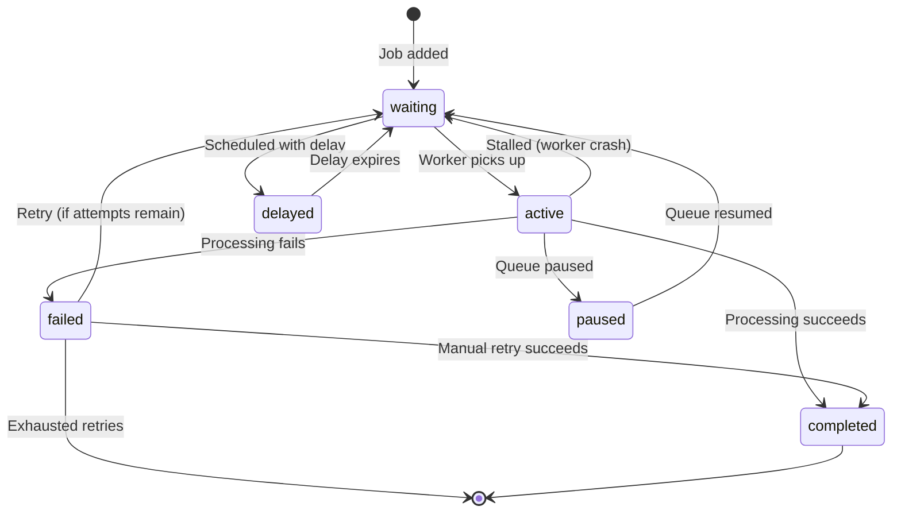
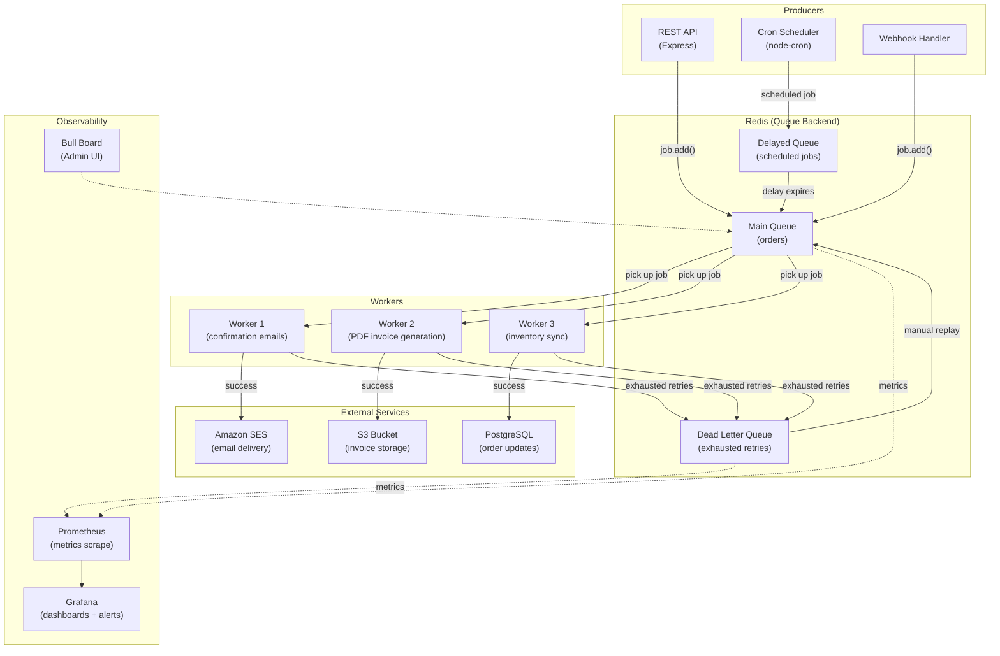

# Message Queues & Job Processing 📬

A message queue is a durable, asynchronous communication layer that decouples producers from consumers. Producers push messages (jobs, tasks, events) onto the queue; consumers pull and process them — independently, at their own pace.

> _Queues turn brittle point-to-point calls into resilient, fire-and-forget workflows. If a downstream service is down, the message waits. If traffic spikes, the queue absorbs it._

---

## Why Message Queues?

Without queues, every service-to-service call is synchronous and fragile — a slow or dead downstream service cascades failure upstream. Queues introduce a buffer:

| Problem | Without Queues | With Queues |
| --- | --- | --- |
| **Service downtime** | Requests fail immediately | Messages wait until service recovers |
| **Traffic spikes** | Overwhelm downstream, cause cascading failures | Queue absorbs burst; consumers process steadily |
| **Long-running work** | Client waits (timeout risk) | Client gets immediate acknowledgment; work happens later |
| **Retry on failure** | Manual or ad-hoc retry logic | Built-in retry with backoff |
| **Tight coupling** | Producer must know consumer address | Producer only knows the queue |

**Common use cases:**

- Sending transactional emails (welcome, password reset, invoice)
- Generating PDF reports, exporting large CSVs
- Image/video processing (resize, transcode, thumbnail generation)
- Webhook delivery with retry
- Data synchronization between services
- Scheduled tasks (nightly cleanup, subscription renewals)

---

## Messaging Patterns

### 1. Task Queue (Point-to-Point / Work Queue)

A producer submits a job; exactly **one** consumer picks it up and processes it. If the job fails, it can be retried or moved to a dead letter queue.

```
Producer → [Queue] → Consumer
```

**Examples:** Send a single email, resize one image, charge a credit card.

**Characteristics:**
- One-to-one: each message is delivered to exactly one consumer
- Load-balanced across multiple consumer instances
- Order not strictly guaranteed unless using a FIFO queue

### 2. Publish-Subscribe (Pub/Sub)

A producer publishes an event to a **topic** (or exchange). Multiple subscribers — each with their own queue — receive a copy. Each subscriber processes independently.

```
Publisher → [Exchange/Topic] ─→ [Queue A] → Subscriber A
                              ├→ [Queue B] → Subscriber B
                              └→ [Queue C] → Subscriber C
```

**Examples:** "OrderPlaced" event triggers: email notification, inventory update, analytics tracking, loyalty points accrual — all in parallel.

**Characteristics:**
- One-to-many: each subscriber gets its own copy
- Subscribers can join or leave without affecting others
- Each subscriber has its own delivery/retry semantics

### 3. Delayed / Scheduled Jobs

Jobs are submitted now but processed at a future time. Useful for time-based workflows.

**Examples:**
- Send a reminder 24 hours before an appointment
- Unlock an account after a 15-minute cooldown
- Retry a failed webhook after 30 seconds
- Expire an abandoned cart after 1 hour

**Implementation with BullMQ:**
```typescript
// Schedule a job to run 1 hour from now
await queue.add('send-reminder', { appointmentId: 'apt_123' }, {
  delay: 60 * 60 * 1000, // 1 hour in milliseconds
});

// Schedule a job at an exact timestamp
await queue.add('subscription-renewal', { userId: 'usr_456' }, {
  delay: targetDate.getTime() - Date.now(),
});
```

### 4. Priority Queues

Higher-priority jobs jump ahead of lower-priority ones. Not all queue systems support true priority — BullMQ does.

```typescript
await queue.add('critical-alert', { message: 'CPU > 95%' }, { priority: 1 });
await queue.add('daily-report',   { reportType: 'sales' }, { priority: 100 });
// Priority 1 processes before priority 100 (lower number = higher priority)
```

### 5. Fan-Out with Routing Keys

Messages are routed to specific queues based on pattern matching (RabbitMQ topic exchanges) or attributes. Enables selective consumption without hardcoding queue names.

### 6. Chaining / Pipelines

The output of one job becomes the input of another, forming a processing pipeline:

```
[Extract PDF] → [OCR Text] → [Translate] → [Store Result]
```

---

## Delivery Guarantees

Distributed queues face an inherent trade-off between safety and performance. Choose the guarantee that matches your business requirements:

| Guarantee | Description | Risk | Best For |
| --- | --- | --- | --- |
| **At-most-once** | Message delivered 0 or 1 time; no retry | Messages can be lost | Metrics, logs, non-critical telemetry |
| **At-least-once** | Message delivered ≥1 time; retry on failure | Duplicates possible (must handle idempotently) | Most business workflows — email, payments, orders |
| **Exactly-once** | Message delivered and processed exactly 1 time | Extremely difficult in practice; requires idempotency + deduplication + transactions | Ledger entries, financial settlements |

> **Practical reality:** True "exactly-once" delivery is impossible in distributed systems (the Two Generals' Problem). What most systems call "exactly-once" is actually **at-least-once delivery + idempotent processing** — the consumer recognizes and ignores duplicates.

### How At-Least-Once Works (BullMQ)

1. Worker picks up a job — job moves from `waiting` to `active`.
2. If the worker crashes mid-processing, the job **stays in `active`**.
3. A **stalled job detection** timer fires — if a job is active for longer than the timeout, it's moved back to `waiting` for retry.
4. This means a partially-processed job **can be re-processed** — hence at-least-once.

### Achieving Effective Exactly-Once

- **Idempotency keys**: Each job carries a unique key. Before processing, check if the key has already been processed (store in Redis/DB).
- **Database transactions**: Wrap processing + idempotency-key insertion in a single transaction.
- **Deduplication built-in**: Some systems (Kafka with idempotent producers; SQS FIFO with deduplication IDs) offer server-side dedup.

---

## Job Lifecycle

A job passes through distinct states from creation to final resolution. Understanding this lifecycle is critical for debugging, monitoring, and designing retry logic.



**State descriptions:**

| State | Meaning |
| --- | --- |
| `waiting` | Job is enqueued, waiting for an available worker |
| `active` | A worker has claimed the job and is processing it |
| `completed` | Job finished successfully; result is stored (if configured) |
| `failed` | Job threw an error; may be retried if attempts remain |
| `delayed` | Job is scheduled for a future time; not yet ready for processing |
| `paused` | Queue is paused — no jobs move to `active` until resumed |
| `stalled` (implied) | Worker died or timed out; job goes back to `waiting` |

**Job retention:** Completed and failed jobs are retained in Redis for inspection (configurable). BullMQ can auto-clean old jobs:

```typescript
const queue = new Queue('emails', {
  connection,
  defaultJobOptions: {
    removeOnComplete: { age: 3600, count: 1000 },  // keep last 1000, or 1 hour
    removeOnFail: { age: 24 * 3600 },               // keep failed jobs for 24 hours
  },
});
```

---

## Dead Letter Queue (DLQ)

A Dead Letter Queue is a holding area for jobs that have **exhausted all retry attempts** or are otherwise undeliverable. Instead of silently dropping failed messages, the DLQ preserves them for inspection, manual intervention, and replay.

### Why You Need a DLQ

- **No data loss**: Failed jobs aren't silently discarded
- **Debugging**: Inspect the job payload and error to diagnose root cause
- **Manual replay**: After fixing the bug, re-enqueue the job from the DLQ
- **Alerting**: Monitor DLQ size — a growing DLQ is a leading indicator of a problem

### DLQ Architecture

```
Producer → [Main Queue] → Worker ──success──→ Completed
                              │
                              └──failure──→ Retry (with backoff)
                                              │
                                              └──retries exhausted──→ [DLQ]
                                                                       │
                                                                       └──→ Alerting / Inspection / Manual Replay
```

### BullMQ DLQ Pattern

BullMQ does not have a built-in "DLQ" concept, but you can implement one easily:

```typescript
import { Queue, Worker, QueueEvents } from 'bullmq';

const mainQueue = new Queue('orders', { connection });
const dlq = new Queue('orders-dlq', { connection });

const worker = new Worker('orders', async (job) => {
  // Process the job
  await processOrder(job.data);
}, {
  connection,
  attempts: 5,                    // Max retry attempts
  backoff: { type: 'exponential', delay: 1000 },
});

// Listen for exhausted jobs and move them to DLQ
const queueEvents = new QueueEvents('orders', { connection });
queueEvents.on('failed', async ({ jobId, failedReason, attemptsMade }) => {
  const job = await mainQueue.getJob(jobId);
  if (job && job.attemptsMade >= job.opts.attempts) {
    // All retries exhausted — move to DLQ
    await dlq.add('dead-letter', {
      originalQueue: 'orders',
      originalJobId: jobId,
      data: job.data,
      failedReason,
      attemptsMade,
      failedAt: new Date().toISOString(),
    });
    await job.remove(); // Clean up from main queue
  }
});
```

**DLQ best practices:**
- Set up monitoring/alerting on DLQ depth
- Build a simple admin UI or CLI to inspect and replay DLQ messages
- Store the original queue name, job ID, error message, and timestamp
- Don't let the DLQ grow unbounded — have a retention policy

---

## Backpressure

Backpressure is the mechanism that prevents a fast producer from overwhelming a slow consumer. Without backpressure, queues grow unbounded, memory is exhausted, and the system crashes.

### Backpressure Strategies

| Strategy | How It Works | When to Use |
| --- | --- | --- |
| **Consumer concurrency limit** | Limit how many jobs a worker processes simultaneously | BullMQ: set `concurrency` on Worker |
| **Rate limiting** | Cap the number of jobs processed per time window | API calls to rate-limited external services |
| **Queue size cap** | Reject new jobs when queue depth exceeds a threshold | Prevent unbounded memory growth |
| **Producer throttling** | Producer slows down or pauses submission | Upstream awareness of downstream capacity |
| **Load shedding** | Drop non-critical jobs when overloaded | Graceful degradation under extreme load |

### Implementing Backpressure in BullMQ

**Consumer-side (most common):**

```typescript
// Limit concurrency — process at most 10 jobs simultaneously
const worker = new Worker('image-processing', processImage, {
  connection,
  concurrency: 10,
});

// Rate limit — max 5 jobs per second
const worker = new Worker('api-calls', callExternalApi, {
  connection,
  limiter: {
    max: 5,        // 5 jobs
    duration: 1000, // per 1 second
  },
});
```

**Producer-side:**

```typescript
async function enqueueWithBackpressure(queue: Queue, data: any) {
  const waitingCount = await queue.getWaitingCount();
  const MAX_QUEUE_SIZE = 10_000;

  if (waitingCount >= MAX_QUEUE_SIZE) {
    throw new Error('Queue at capacity — apply backpressure to producer');
  }

  await queue.add('my-job', data);
}
```

### Signal-Based Backpressure (Advanced)

In distributed systems, backpressure signals can propagate upstream:

1. Consumer reports its capacity (e.g., via a `/health` endpoint or metrics)
2. Load balancer / API gateway reads capacity metric
3. If capacity is low, the gateway returns `503 Service Unavailable` with `Retry-After` header
4. Producers back off

---

## Retry Strategies

When a job fails, retrying is often the right approach — transient failures (network blips, deadlocks, temporary resource exhaustion) resolve themselves. But retrying without a strategy makes things worse.

### Common Retry Strategies

| Strategy | Formula | Behavior |
| --- | --- | --- |
| **Fixed delay** | `delay_ms` after each failure | Simple, but can cause thundering herd |
| **Linear backoff** | `attempt × delay_ms` | Waits longer each attempt |
| **Exponential backoff** | `delay_ms × 2^attempt` | Rapidly increases wait — standard for most systems |
| **Exponential with jitter** | `delay_ms × 2^attempt + random(0, jitter_ms)` | Spreads retries, prevents synchronization |
| **Immediate retry** | Retry instantly (1–3 times) | For transient deadlocks, connection resets |

### BullMQ Backoff Configuration

```typescript
const worker = new Worker('payments', processPayment, {
  connection,
  attempts: 5, // Maximum total attempts (initial + 4 retries)

  // Option 1: Fixed delay — 2 seconds between each retry
  backoff: { type: 'fixed', delay: 2000 },

  // Option 2: Exponential — 1s, 2s, 4s, 8s, 16s...
  backoff: { type: 'exponential', delay: 1000 },
});

// Custom backoff strategy
const worker = new Worker('custom', processJob, {
  connection,
  attempts: 5,
  backoff: {
    type: 'custom',
    // You control the exact delay per attempt
    delay: (attemptsMade: number) => {
      const base = 1000;
      const exponential = base * Math.pow(2, attemptsMade);
      const jitter = Math.random() * 1000; // ±1s jitter
      return Math.min(exponential + jitter, 60_000); // Cap at 60 seconds
    },
  },
});
```

### Retry Best Practices

- **Always set a maximum number of attempts**: Infinite retries hide bugs and fill queues.
- **Use exponential backoff with jitter**: Without jitter, retries from many jobs synchronize and hammer the downstream service simultaneously (thundering herd).
- **Distinguish transient vs. permanent failures**: Don't retry on validation errors or "not found" — those will never succeed. Only retry on timeouts, connection errors, 5xx, and 429.
- **Log every retry with context**: Job ID, attempt number, error message, and timestamp.
- **Set a global timeout per job**: A stuck job shouldn't hold a worker forever.
- **Monitor retry rates**: A sudden spike in retries signals a downstream problem.

---

## Idempotency

An operation is **idempotent** if performing it multiple times produces the same result as performing it once. In queue systems, idempotency is **not optional** — at-least-once delivery guarantees that duplicate processing will happen.

### Why Duplicates Happen

1. **Worker crashes mid-processing** → job re-queued and processed again
2. **Network partition** → producer doesn't receive ACK, re-sends the same message
3. **Consumer timeout** → queue assumes consumer died, redelivers to another consumer
4. **Client retry** → user double-clicks "Submit" button

### Idempotency Strategies

**1. Idempotency Key (recommended)**

Generate a unique key per logical operation. Store processed keys in a database. Before processing, check if the key exists.

```typescript
import { createHash } from 'crypto';
import Redis from 'ioredis';

const redis = new Redis();
const IDEMPOTENCY_TTL = 60 * 60 * 24; // 24 hours

function generateIdempotencyKey(data: any): string {
  // Deterministic key from the business entity, not a random UUID
  return `idem:order:${data.orderId}:action:sendConfirmation`;
}

async function processWithIdempotency(
  jobData: any,
  handler: () => Promise<void>
): Promise<void> {
  const key = generateIdempotencyKey(jobData);

  // SET NX (set if not exists) — atomic check-and-set
  const acquired = await redis.set(key, 'processing', 'PX', IDEMPOTENCY_TTL, 'NX');

  if (!acquired) {
    console.log(`Duplicate detected — skipping job: ${key}`);
    return; // Already processed or in progress
  }

  try {
    await handler();
    await redis.set(key, 'completed', 'PX', IDEMPOTENCY_TTL);
  } catch (error) {
    await redis.del(key); // Remove so it can be retried
    throw error;
  }
}
```

**2. Database Unique Constraints**

If the job inserts/updates a database record, use a unique constraint on the business identifier:

```sql
CREATE UNIQUE INDEX idx_orders_idempotency_key
ON orders (idempotency_key);
```

```typescript
async function processOrder(job: { data: OrderPayload }) {
  try {
    await db.insert('orders').values({
      idempotencyKey: job.data.idempotencyKey,
      ...job.data,
    });
  } catch (error) {
    if (error.code === '23505') { // PostgreSQL unique violation
      console.log('Duplicate — order already processed');
      return; // Idempotent — skip
    }
    throw error; // Real error — let queue retry
  }
}
```

**3. State Machine Guards**

Only allow transitions from valid states:

```typescript
// Only confirm an order if it's in 'pending' state
const result = await db.query(`
  UPDATE orders SET status = 'confirmed'
  WHERE id = $1 AND status = 'pending'
  RETURNING id
`, [orderId]);

if (result.rowCount === 0) {
  return; // Already confirmed (or doesn't exist) — idempotent skip
}
```

### Choosing an Idempotency Strategy

| Strategy | Best For | Limitations |
| --- | --- | --- |
| Idempotency key in Redis | General purpose, fast lookups | Requires Redis; must set TTL |
| DB unique constraint | Jobs that insert unique records | Only works for inserts/unique fields |
| State machine guard | Workflows with defined states | Requires well-modeled state machine |
| Deduplication at queue level | SQS FIFO (dedup ID), Kafka (idempotent producer) | Tool-specific; limited dedup window |

---

## Tool Comparison

Choosing the right queue technology depends on your scale, latency requirements, operational budget, and ecosystem.

### BullMQ vs RabbitMQ vs Apache Kafka vs AWS SQS

| Criteria | BullMQ | RabbitMQ | Apache Kafka | AWS SQS |
| --- | --- | --- | --- | --- |
| **Type** | Job queue (library) | Message broker | Distributed event streaming platform | Managed queue service |
| **Protocol** | Redis-based (custom) | AMQP 0-9-1 (pluggable) | Custom binary over TCP | HTTPS / AWS SDK |
| **Hosting** | Self-hosted (needs Redis) | Self-hosted or CloudAMQP | Self-hosted or Confluent/MSK | Fully managed (AWS) |
| **Delivery model** | Point-to-point (jobs) | Point-to-point + pub/sub | Pub/sub (consumers poll) | Point-to-point + fan-out (SNS + SQS) |
| **Message ordering** | Best-effort (FIFO when concurrency=1) | Per-queue FIFO with single consumer | Per-partition strict ordering | Standard: best-effort; FIFO: strict ordering |
| **Throughput** | ~10k jobs/sec (Redis-bound) | ~50k msg/sec per node | ~1M+ msg/sec (partitioned) | Unlimited (AWS scales automatically) |
| **Latency** | Sub-millisecond | Sub-millisecond | Low ms (batching trades latency for throughput) | Single-digit ms (variable) |
| **Persistence** | Optional (Redis RDB/AOF) | Yes (disk, memory, or both) | Yes (append-only log, durable) | Yes (redundant across AZs) |
| **Retry / DLQ** | Built-in retry; manual DLQ pattern | Built-in DLX (Dead Letter Exchange) | No built-in; app-level retry handles this | Built-in DLQ (redrive policy) |
| **Scheduling** | Built-in (delay option) | Via plugin (rabbitmq_delayed_message) | No native scheduling | Yes (DelaySeconds up to 15 min; or use Scheduler) |
| **Message size** | Up to Redis limit (512MB default) | Configurable (128MB typical) | Up to 1MB default (configurable) | 256KB (Standard); Extended client up to 2GB via S3 |
| **Authentication** | Redis AUTH | Built-in (SASL, TLS, LDAP) | SASL, TLS, Kerberos | IAM (AWS Identity) |
| **Monitoring** | Bull Board / QueueEvents | Management UI + Prometheus plugin | JMX, Prometheus, Confluent Control Center | CloudWatch metrics |
| **Ecosystem** | Node.js / TypeScript native | All major languages | All major languages | AWS SDK (all major languages) |
| **Use case** | Background job processing in Node.js apps | General-purpose messaging, microservice communication | Event sourcing, stream processing, high-throughput ingest | AWS-native apps, zero-ops queue |
| **Operational complexity** | Low (just Redis) | Medium (Erlang clustering) | High (ZooKeeper/KRaft, partitioning, rebalancing) | None (fully managed) |

### When to Choose What

**Choose BullMQ when:**
- You're building a Node.js/TypeScript application
- You need background job processing with scheduling, retries, and progress
- You already use Redis (no new infrastructure)
- You value developer experience (TypeScript types, Bull Board UI)

**Choose RabbitMQ when:**
- You need flexible routing (topic exchanges, headers exchanges, fan-out)
- You have a polyglot environment (multiple languages)
- You need both point-to-point and pub/sub in one broker
- You want battle-tested AMQP compliance

**Choose Apache Kafka when:**
- You need to process millions of events per second
- You need event replay capability (consumers can rewind to any offset)
- You're building event sourcing or CQRS systems
- You need long-term event retention (days, weeks, or indefinitely)
- You have a data engineering / stream processing use case

**Choose AWS SQS when:**
- You're already on AWS and want zero operational overhead
- You don't want to manage broker infrastructure
- Your throughput needs are variable and you want auto-scaling
- You need FIFO ordering with exactly-once semantics (SQS FIFO)
- You pair it with SNS for fan-out (SNS → multiple SQS queues)

---

## BullMQ Deep Dive

BullMQ is the modern, TypeScript-native successor to Bull. It's built on top of Redis and provides a rich job queue with scheduling, priorities, concurrency control, rate limiting, and event-driven monitoring.

### Architecture

```
┌──────────┐     ┌─────────────┐     ┌──────────────┐
│ Producer │────▶│    Redis     │◀────│   Worker 1   │
│ (Node.js)│     │  (Queue DB)  │     │  (Consumer)   │
└──────────┘     │              │     └──────────────┘
                 │  ┌────────┐  │     ┌──────────────┐
                 │  │  Lists │  │◀────│   Worker 2   │
                 │  │  Sets  │  │     └──────────────┘
                 │  │ Hashes │  │     ┌──────────────┐
                 │  │ Streams│  │◀────│   Worker N   │
                 │  └────────┘  │     └──────────────┘
                 └─────────────┘
                        │
                        ▼
                 ┌──────────────┐
                 │  Bull Board   │
                 │  (Monitoring) │
                 └──────────────┘
```

### Core Components

| Component | Responsibility |
| --- | --- |
| **Queue** | Holds jobs; producers add to it |
| **Worker** | Picks up and processes jobs from the queue |
| **Job** | A single unit of work with data, options, and state |
| **QueueEvents** | Real-time event emitter for job state changes |
| **QueueScheduler** | Manages delayed jobs and stalled job recovery |
| **FlowProducer** | Creates job flows/chains with parent-child relationships |

### QueueScheduler — The Silent Hero

The `QueueScheduler` is a lightweight process that handles two critical background tasks:

1. **Delayed jobs**: Moves jobs from `delayed` state to `waiting` when their delay expires
2. **Stalled jobs**: Detects workers that crashed or timed out and moves their active jobs back to `waiting`

```typescript
import { QueueScheduler } from 'bullmq';

// Must run alongside your workers for delay/stall handling
const scheduler = new QueueScheduler('my-queue', { connection });
```

### Sandboxed Processors

By default, workers run job processors in the same Node.js process (good for I/O-bound work). For CPU-bound work (image processing, PDF generation), use sandboxed processors to avoid blocking the event loop:

```typescript
// main.ts — creates a worker with a sandboxed processor file
const worker = new Worker('image-processing', './processors/image-processor.ts', {
  connection,
  concurrency: 4, // 4 parallel sandboxed processes
  useWorkerThreads: true, // Use worker_threads (Node 12+) instead of child_process
});
```

```typescript
// processors/image-processor.ts
import { Sharp } from 'sharp';

module.exports = async (job) => {
  const { inputPath, outputPath, width } = job.data;

  // CPU-intensive work — runs in a separate thread
  await Sharp(inputPath).resize(width).toFile(outputPath);

  // Report progress to the queue
  await job.updateProgress(100);
  return { outputPath };
};
```

---

## BullMQ Code Examples

### Complete Example: Order Confirmation Pipeline

A realistic scenario: when an order is placed, send a confirmation email and generate an invoice PDF asynchronously.

```typescript
// ---------------------------------------------------------------
// setup.ts — Queue and Worker initialization
// ---------------------------------------------------------------
import { Queue, Worker, QueueScheduler, QueueEvents } from 'bullmq';
import Redis from 'ioredis';

const connection = new Redis({
  host: process.env.REDIS_HOST || 'localhost',
  port: Number(process.env.REDIS_PORT) || 6379,
  maxRetriesPerRequest: null, // Required for BullMQ
});

// Define queues
export const emailQueue = new Queue('order-emails', {
  connection,
  defaultJobOptions: {
    attempts: 3,
    backoff: { type: 'exponential', delay: 2000 },
    removeOnComplete: { age: 3600 * 24, count: 500 },
    removeOnFail: { age: 3600 * 24 * 7 },
  },
});

export const invoiceQueue = new Queue('order-invoices', {
  connection,
  defaultJobOptions: {
    attempts: 5,
    backoff: { type: 'exponential', delay: 3000 },
    removeOnComplete: { age: 3600 * 24 * 30 },
  },
});

// Schedulers (required for delayed jobs and stalled recovery)
new QueueScheduler('order-emails', { connection });
new QueueScheduler('order-invoices', { connection });

// QueueEvents for real-time monitoring
const emailEvents = new QueueEvents('order-emails', { connection });

emailEvents.on('completed', ({ jobId, returnvalue }) => {
  console.log(`✅ Email job ${jobId} completed`, returnvalue);
});

emailEvents.on('failed', ({ jobId, failedReason, attemptsMade }) => {
  console.error(`❌ Email job ${jobId} failed (attempt ${attemptsMade}): ${failedReason}`);
});

emailEvents.on('delayed', ({ jobId, delay }) => {
  console.log(`⏰ Email job ${jobId} delayed by ${delay}ms`);
});

// ---------------------------------------------------------------
// Worker definition
// ---------------------------------------------------------------
const emailWorker = new Worker('order-emails', async (job) => {
  const { orderId, customerEmail, customerName } = job.data;

  // Simulate sending an email
  console.log(`Sending confirmation email to ${customerEmail} for order ${orderId}`);

  // Update progress so Bull Board shows real-time status
  await job.updateProgress(50);

  // Call your email service
  await emailService.sendTemplate('order-confirmation', customerEmail, {
    name: customerName,
    orderId,
  });

  await job.updateProgress(100);

  return { sent: true, email: customerEmail };
}, {
  connection,
  concurrency: 20,              // Send up to 20 emails simultaneously
  limiter: {
    max: 50,                    // But not more than 50 per second
    duration: 1000,
  },
});

// ---------------------------------------------------------------
// Producer: Called from your order service
// ---------------------------------------------------------------
async function onOrderPlaced(order: Order) {
  // Add the email job
  await emailQueue.add(
    'send-confirmation',
    {
      orderId: order.id,
      customerEmail: order.customerEmail,
      customerName: order.customerName,
    },
    {
      jobId: `email-confirmation-${order.id}`, // Idempotent key as job ID
    }
  );

  // Add the invoice generation job with a 30-second delay
  // (allows inventory checks to complete first)
  await invoiceQueue.add(
    'generate-invoice',
    {
      orderId: order.id,
      items: order.items,
      totalAmount: order.totalAmount,
    },
    {
      delay: 30_000,          // Process 30 seconds later
    }
  );
}
```

### Graceful Shutdown

Workers should finish in-progress jobs before shutting down to avoid data loss:

```typescript
import { Worker } from 'bullmq';

const worker = new Worker('my-queue', processor, { connection });

async function gracefulShutdown() {
  console.log('Shutting down worker...');

  // Stop picking up new jobs; wait for active jobs to finish
  await worker.close(true); // 'true' = wait for current jobs to complete

  console.log('Worker shut down cleanly');
  process.exit(0);
}

process.on('SIGTERM', gracefulShutdown);
process.on('SIGINT', gracefulShutdown);
```

### Job Flow (Chaining with FlowProducer)

Complex workflows where the output of one job feeds into the next:

```typescript
import { FlowProducer, Queue } from 'bullmq';

const extractQueue = new Queue('pdf-extract', { connection });
const ocrQueue = new Queue('pdf-ocr', { connection });
const translateQueue = new Queue('pdf-translate', { connection });

const flowProducer = new FlowProducer({ connection });

async function createProcessingPipeline(pdfPath: string, targetLanguage: string) {
  const flow = await flowProducer.add({
    name: 'extract-text',
    queueName: 'pdf-extract',
    data: { pdfPath },
    children: [
      {
        name: 'ocr-text',
        queueName: 'pdf-ocr',
        data: {}, // Will receive parent's return value
        children: [
          {
            name: 'translate-text',
            queueName: 'pdf-translate',
            data: { targetLanguage },
            // opts can be set at any level
            opts: { attempts: 2 },
          },
        ],
      },
    ],
  });

  // A child only runs after its parent completes successfully.
  // If any job in the chain fails, downstream children are not executed.
  return flow;
}

// --- Worker implementations ---
new Worker('pdf-extract', async (job) => {
  const text = await extractTextFromPdf(job.data.pdfPath);
  return { extractedText: text }; // Passed to next job in chain
}, { connection });

new Worker('pdf-ocr', async (job) => {
  const { extractedText, ...parentResult } = job.data; // Inherits parent data
  // ...
}, { connection });

new Worker('pdf-translate', async (job) => {
  // Receives combined data from all ancestors
  const { extractedText, targetLanguage } = job.data;
  const translated = await translateText(extractedText, targetLanguage);
  return { translated };
}, { connection });
```

### Preventing Duplicate Jobs (Idempotency via jobId)

BullMQ allows you to set a custom `jobId`. If a job with the same ID already exists in the queue (in any non-terminal state), adding it again throws an error — which you can catch to enforce idempotency:

```typescript
async function enqueueUnique(jobName: string, data: any, idempotencyKey: string) {
  try {
    await queue.add(jobName, data, { jobId: idempotencyKey });
  } catch (error) {
    if (error.message?.includes('Job') && error.message?.includes('already exists')) {
      console.log(`Job with key ${idempotencyKey} already enqueued — skipping`);
      return;
    }
    throw error;
  }
}

// Usage
await enqueueUnique('charge', { amount: 49.99 }, `charge:${paymentIntentId}`);
```

### Manual Job Inspection & Admin

```typescript
// Get counts for dashboard
const counts = await queue.getJobCounts();
// {
//   waiting: 42,
//   active: 5,
//   completed: 1832,
//   failed: 3,
//   delayed: 12,
//   paused: 0,
// }

// Fetch jobs by state
const failedJobs = await queue.getFailed(0, 20); // Paginated (start, end)

// Manually retry a specific failed job
const job = await queue.getJob('email-confirmation-order_456');
if (job) {
  await job.retry(); // Re-enqueue from 'failed' state
}

// Remove a stuck job
await job.remove();

// Obsolete (orphaned) a job — mark as failed with custom reason
await job.moveToFailed(new Error('Business rule change — no longer needed', false));

// Promote a delayed job to process immediately
const delayed = await queue.getDelayed();
if (delayed.length > 0) {
  await delayed[0].promote();
}

// Pause / Resume entire queue
await queue.pause();
await queue.resume();

// Drain the queue (remove all waiting and delayed jobs)
await queue.drain();
```

### Bull Board — Admin UI

```typescript
import { createBullBoard } from '@bull-board/api';
import { BullMQAdapter } from '@bull-board/api/bullMQAdapter';
import { ExpressAdapter } from '@bull-board/express';
import express from 'express';

const app = express();

const serverAdapter = new ExpressAdapter();
serverAdapter.setBasePath('/admin/queues');

createBullBoard({
  queues: [
    new BullMQAdapter(emailQueue),
    new BullMQAdapter(invoiceQueue),
    new BullMQAdapter(dlq),
  ],
  serverAdapter,
});

app.use('/admin/queues', serverAdapter.getRouter());
app.listen(3000, () => console.log('Bull Board at http://localhost:3000/admin/queues'));
```

---

## Production Checklist

- [ ] **Redis persistence enabled** — RDB snapshots + AOF for durability. Losing Redis means losing all jobs.
- [ ] **QueueScheduler is running** — without it, delayed jobs are never processed and stalled jobs are never recovered.
- [ ] **`maxRetriesPerRequest: null`** set on the Redis connection (BullMQ requirement).
- [ ] **Concurrency and rate limiter tuned** — match your downstream capacity to prevent overload.
- [ ] **Graceful shutdown implemented** — `worker.close(true)` on SIGTERM to finish in-progress jobs.
- [ ] **DLQ implemented** — jobs that exhaust retries go to a DLQ, not into the void.
- [ ] **Idempotency handled** — every job processor assumes duplicates will happen.
- [ ] **Job timeouts configured** — no job runs forever (BullMQ default: 30 seconds).
- [ ] **Monitoring in place** — Bull Board, Prometheus metrics (queue depth, wait time, throughput), alerting on DLQ growth.
- [ ] **Logging with correlation IDs** — every job log includes `job.id`, `job.name`, and `attemptsMade`.
- [ ] **Cleanup policy set** — `removeOnComplete` and `removeOnFail` to prevent Redis memory bloat.
- [ ] **Redis connection pool sized** appropriately for your number of queues and workers.
- [ ] **Error handling distinguishes transient vs permanent** — don't retry validation errors.
- [ ] **Processor files are idempotent** — test by running the same job twice; the second should be a no-op.

---

## Mermaid: End-to-End Queue Architecture



---

## Further Reading

- [BullMQ Official Documentation](https://docs.bullmq.io/)
- [Redis Persistence](https://redis.io/docs/latest/operate/rs/databases/configure/database-persistence/)
- [RabbitMQ Tutorials](https://www.rabbitmq.com/tutorials)
- [Kafka Documentation](https://kafka.apache.org/documentation/)
- [AWS SQS Developer Guide](https://docs.aws.amazon.com/AWSSimpleQueueService/latest/SQSDeveloperGuide/welcome.html)
- [Enterprise Integration Patterns](https://www.enterpriseintegrationpatterns.com/) (the canonical book on messaging patterns)

[← Back to Backend Engineering](../README.md) · © sparshjaswal