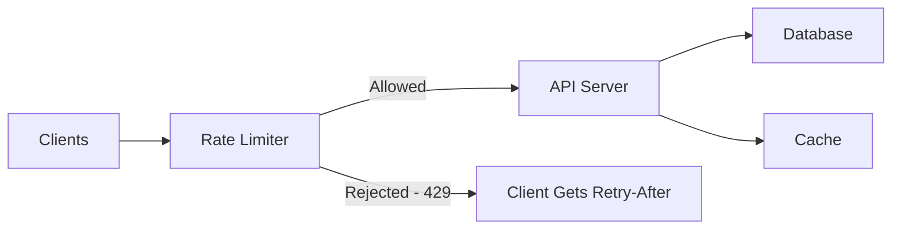
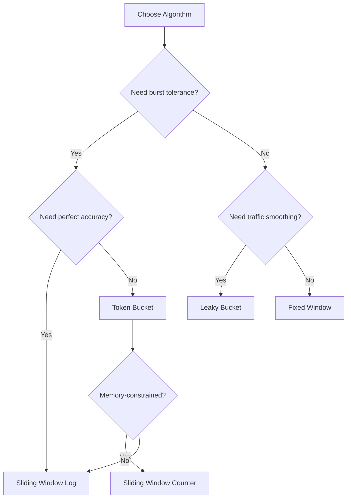
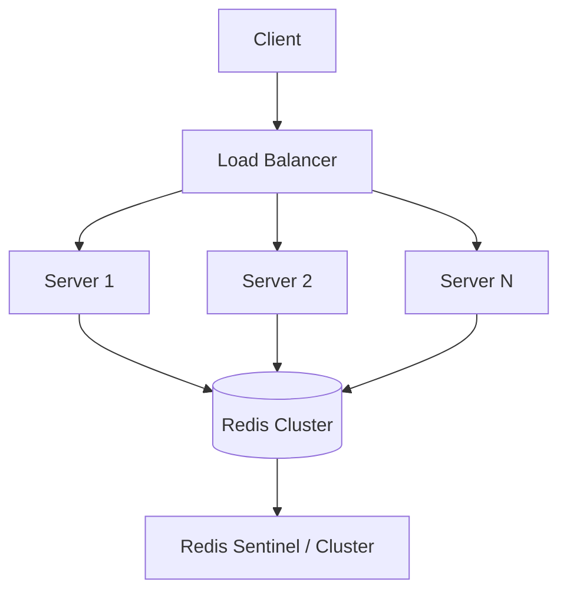
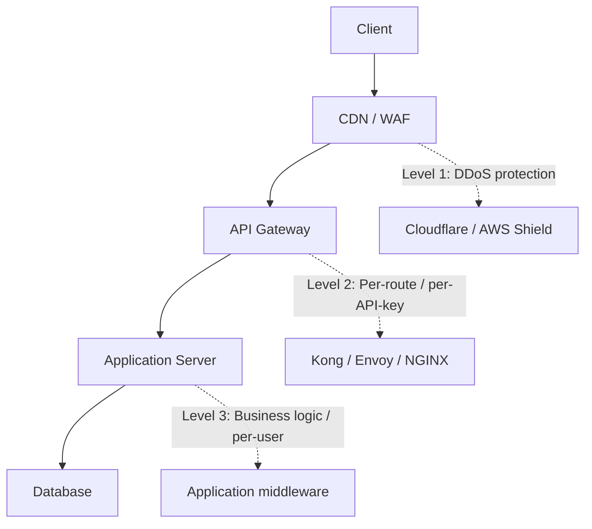

# Rate Limiting 🚦

Rate limiting controls how many requests a client can make to an API within a given time window. It is a critical defensive layer that protects backend services from abuse, ensures fair resource distribution, and maintains system stability under load.

> _Rate limiting is not just about saying "no" — it's about graceful degradation and predictable performance for everyone._

Without rate limiting, a single misbehaving client — or a DDoS attack — can degrade service for all other users. With proper rate limiting, your system degrades gracefully: excess requests are rejected early, preserving capacity for legitimate traffic.

---

## Why Rate Limiting Matters

| Goal                     | How Rate Limiting Helps                                         |
| ------------------------ | --------------------------------------------------------------- |
| **Prevent abuse**        | Block brute-force login attempts, credential stuffing, scraping |
| **Ensure fairness**      | No single tenant monopolizes shared resources                   |
| **Control costs**        | Limit calls to expensive third-party APIs or database queries   |
| **Protect downstream**   | Shield databases and microservices from traffic spikes          |
| **Graceful degradation** | Reject excess traffic early instead of crashing under load      |
| **SLA enforcement**      | Guarantee throughput tiers for different API plans              |



---

## Core Concepts & Terminology

| Term               | Definition                                                                    |
| ------------------ | ----------------------------------------------------------------------------- |
| **Limit**          | Maximum number of requests allowed in a window (e.g., 100 requests)           |
| **Window**         | The time interval for the limit (e.g., 60 seconds)                            |
| **Burst**          | A short spike of traffic that exceeds the sustained rate but is still allowed |
| **Sustained rate** | The long-term average request rate the system can handle                      |
| **Throttling**     | Slowing down (but not rejecting) requests — e.g., adding artificial delay     |
| **Backpressure**   | Signaling the client to slow down, usually via `429` + `Retry-After`          |
| **Quota**          | A total allowance over a longer period (e.g., 10,000 requests/day)            |

---

## Rate Limiting Algorithms

Each algorithm makes different trade-offs between accuracy, memory usage, and burst tolerance. Choosing the right one depends on your use case.

### 1. Fixed Window Counter

The simplest algorithm. Requests are counted within fixed, non-overlapping time windows (e.g., 00:00–00:59, 01:00–01:59).

**How it works:**

- A counter starts at 0 at the beginning of each window
- Every request increments the counter
- If the counter exceeds the limit, subsequent requests are rejected until the next window

```
Window: [0──────59s]
Requests:  x x x x x ... (up to limit)
At limit:  x x x ↓ ↓ ↓ (rejected)
Next window: starts fresh
```

**Implementation (conceptual):**

```javascript
const fixedWindow = new Map(); // key -> { count, windowStart }

function fixedWindowRateLimiter(key, limit, windowMs) {
  const now = Date.now();
  const entry = fixedWindow.get(key);

  if (!entry || now - entry.windowStart >= windowMs) {
    // New window
    fixedWindow.set(key, { count: 1, windowStart: now });
    return true;
  }

  if (entry.count >= limit) {
    return false; // Rate limited
  }

  entry.count++;
  return true;
}

// Usage: 100 requests per 60 seconds
if (!fixedWindowRateLimiter(req.ip, 100, 60_000)) {
  res.status(429).json({ error: 'Too many requests' });
  return;
}
```

**Pros & Cons:**

| Pros                                                  | Cons                                                                                                                                                                     |
| ----------------------------------------------------- | ------------------------------------------------------------------------------------------------------------------------------------------------------------------------ |
| Very simple to implement                              | **Edge burst** — a client can consume the entire limit at the very end of one window and immediately again at the start of the next, effectively 2× the limit in a burst |
| Low memory footprint (one counter per key per window) | Inaccurate — boundary conditions allow abuse                                                                                                                             |
| O(1) time complexity                                  | Not suitable for strict enforcement                                                                                                                                      |

```mermaid
gantt
    title Fixed Window — Edge Burst Problem
    dateFormat X
    axisFormat %s
    section Window 1
    Requests 1-100 (last second) :0, 1s
    section Window 2
    Requests 101-200 (first second) :1, 1s
```



> In the diagram above, a client can send 200 requests in 2 seconds while the limit was supposedly 100/min.

---

### 2. Sliding Window Log

Instead of fixed boundaries, the sliding window log tracks the timestamp of every request. For each new request, the algorithm counts how many requests occurred in the last `windowMs`, removing expired timestamps.

**How it works:**

- Maintain a sorted list (log) of request timestamps per client
- On each request, remove all timestamps older than `now - windowMs`
- If the remaining count < limit, allow the request and append `now` to the log

**Implementation (conceptual):**

```javascript
const slidingWindowLog = new Map(); // key -> Timestamp[]

function slidingWindowLogRateLimiter(key, limit, windowMs) {
  const now = Date.now();
  const log = slidingWindowLog.get(key) || [];

  // Remove expired timestamps
  while (log.length > 0 && log[0] <= now - windowMs) {
    log.shift();
  }

  if (log.length >= limit) {
    return { allowed: false, retryAfter: Math.ceil((log[0] + windowMs - now) / 1000) };
  }

  log.push(now);
  slidingWindowLog.set(key, log);
  return { allowed: true };
}
```

| Pros                                   | Cons                                                                   |
| -------------------------------------- | ---------------------------------------------------------------------- |
| Perfectly accurate — no edge bursts    | High memory usage — stores a timestamp for every request               |
| Smooth rate enforcement                | O(N) to remove expired entries (optimizable with sorted sets in Redis) |
| Allows burst within the sliding window | Not practical at very high throughput without Redis sorted sets        |

---

### 3. Sliding Window Counter (Hybrid / Approximate)

A practical compromise between the simplicity of fixed window and the accuracy of sliding window log. It maintains counters for the **current** and **previous** windows, calculating a weighted average based on how far into the current window we are.

**How it works:**

- Keep a counter for the current fixed window and the previous one
- The effective request count = `previous_window_count * overlap_ratio + current_window_count`
- `overlap_ratio` = fraction of the sliding window that overlaps with the previous fixed window

```
|<--- Previous Window --->|<--- Current Window --->|
                           |<--- Sliding Window --->|
                           |   overlap   |  current |
                           |<--- 30s --->|<-- 30s ->|

Effective count = prev_count * (30/60) + curr_count
```

**Implementation (conceptual):**

```javascript
const windowCounters = new Map(); // key -> { prevCount, currCount, currWindowStart }

function slidingWindowCounterRateLimiter(key, limit, windowMs) {
  const now = Date.now();
  let entry = windowCounters.get(key);
  const windowSize = windowMs;

  if (!entry) {
    entry = { prevCount: 0, currCount: 0, currWindowStart: now };
    windowCounters.set(key, entry);
  }

  // Check if we've moved to a new fixed window
  const elapsed = now - entry.currWindowStart;
  if (elapsed >= windowSize) {
    entry.prevCount = entry.currCount;
    entry.currCount = 0;
    entry.currWindowStart = now;
  }

  // Calculate the sliding window count
  const overlapRatio = (windowSize - (now - entry.currWindowStart)) / windowSize;
  const weightedCount = entry.prevCount * overlapRatio + entry.currCount;

  if (weightedCount >= limit) {
    return false;
  }

  entry.currCount++;
  return true;
}
```

| Pros                                     | Cons                                            |
| ---------------------------------------- | ----------------------------------------------- |
| Low memory — only two counters per key   | Approximation, not perfectly accurate           |
| Smooth — avoids edge-burst problem       | Slightly more complex logic                     |
| Good enough for most practical use cases | Requires careful handling of window transitions |

---

### 4. Token Bucket

The token bucket is the most flexible algorithm. Tokens are added to a bucket at a constant rate (the **refill rate**). Each request consumes one or more tokens. If the bucket is empty, the request is rejected. The bucket has a **maximum capacity** — allowing bursts up to the bucket size.

**How it works:**

- Bucket starts full (capacity = burst limit)
- Tokens refill at a steady rate: `refillRate` tokens per second
- Each request costs 1 (or more) tokens
- If enough tokens are available, consume them and allow the request
- Otherwise, reject the request

```
        Tokens refill at rate R/sec
                ↓   ↓   ↓
        ┌───────────────────┐
        │  [T][T][T][T][T]  │  Capacity = 10
        │  [T][T][T][T][T]  │
        └───────────────────┘
                ↓
        Each request consumes 1 token
```

**Implementation (conceptual):**

```javascript
const buckets = new Map(); // key -> { tokens, lastRefill }

function tokenBucketRateLimiter(key, capacity, refillRatePerSec) {
  const now = Date.now();
  let bucket = buckets.get(key);

  if (!bucket) {
    bucket = { tokens: capacity, lastRefill: now };
    buckets.set(key, bucket);
  }

  // Refill tokens based on elapsed time
  const elapsed = (now - bucket.lastRefill) / 1000; // seconds
  bucket.tokens = Math.min(capacity, bucket.tokens + elapsed * refillRatePerSec);
  bucket.lastRefill = now;

  if (bucket.tokens >= 1) {
    bucket.tokens -= 1;
    return true;
  }

  return false;
}
```

| Pros                                                   | Cons                                               |
| ------------------------------------------------------ | -------------------------------------------------- |
| Allows short bursts (up to bucket capacity)            | Slightly more state to track (tokens + lastRefill) |
| Smooth sustained rate after burst                      | Requires a refill calculation on each request      |
| Works well for shaping traffic (not just rejecting)    |                                                    |
| Intuitive — "bucket of tokens" is easy to reason about |                                                    |

---

### 5. Leaky Bucket

The leaky bucket processes requests at a constant rate, queuing excess requests. If the queue is full, requests are discarded. Unlike the token bucket (which allows bursts), the leaky bucket **smooths** traffic to a uniform rate.

**How it works:**

- Requests arrive at variable rates and enter a FIFO queue
- The queue "leaks" (processes) at a constant rate
- If the queue is full, new requests are rejected

```
Requests arrive    │ Queue (FIFO)      │ Processed at
(bursty)           │                   │ constant rate
   x  x x x        │ ┌───┬───┬───┐     │
     ↓ ↓ ↓ ↓       │ │ 4 │ 3 │ 2 │ 1   │  →  →  → (steady drip)
                   │ └───┴───┴───┘     │
  Too many ──→  rejected (queue full)
```

**Implementation (conceptual):**

```javascript
const leakyBuckets = new Map(); // key -> { queue, lastLeak, queueSize }

function leakyBucketRateLimiter(key, capacity, leakRatePerSec) {
  const now = Date.now();
  let bucket = leakyBuckets.get(key);

  if (!bucket) {
    bucket = { queue: 0, lastLeak: now };
    leakyBuckets.set(key, bucket);
  }

  // Leak: remove requests based on elapsed time
  const elapsed = (now - bucket.lastLeak) / 1000;
  bucket.queue = Math.max(0, bucket.queue - elapsed * leakRatePerSec);
  bucket.lastLeak = now;

  if (bucket.queue < capacity) {
    bucket.queue += 1;
    return { allowed: true };
  }

  return {
    allowed: false,
    retryAfter: Math.ceil(bucket.queue / leakRatePerSec),
  };
}
```

| Pros                                                  | Cons                                                          |
| ----------------------------------------------------- | ------------------------------------------------------------- |
| Guaranteed constant output rate — protects downstream | No burst tolerance — even a small burst is queued/delayed     |
| Simple FIFO model                                     | If `capacity` is too small, legitimate bursts are rejected    |
| Good for traffic shaping at the network level         | Less common for API rate limiting (token bucket is preferred) |

---

### Algorithm Comparison Summary



| Algorithm                  | Accuracy         | Memory | Burst Handling                 | Complexity | Best For                           |
| -------------------------- | ---------------- | ------ | ------------------------------ | ---------- | ---------------------------------- |
| **Fixed Window**           | Low              | Low    | Poor (edge bursts)             | Simple     | Simple throttling, non-critical    |
| **Sliding Window Log**     | Perfect          | High   | Good                           | Medium     | Strict enforcement, paid API tiers |
| **Sliding Window Counter** | Good (~1% error) | Low    | Good                           | Medium     | General-purpose API rate limiting  |
| **Token Bucket**           | Good             | Low    | Excellent (configurable burst) | Medium     | **Recommended for most APIs**      |
| **Leaky Bucket**           | N/A (shapes)     | Low    | None (smooths traffic)         | Simple     | Network-level traffic shaping      |

> **Recommendation:** Start with **Token Bucket** for API rate limiting. It provides the best balance of burst tolerance, memory efficiency, and intuitive behavior. For paid tiers that need strict enforcement, upgrade to **Sliding Window Log** backed by Redis sorted sets.

---

## Rate Limiting in Express

### express-rate-limit

[`express-rate-limit`](https://www.npmjs.com/package/express-rate-limit) is the most popular rate limiting middleware for Express. It uses a **fixed window** counter in memory by default.

```bash
npm install express-rate-limit
```

**Basic usage:**

```javascript
const express = require('express');
const rateLimit = require('express-rate-limit');

const app = express();

// Global rate limiter: 100 requests per 15 minutes per IP
const globalLimiter = rateLimit({
  windowMs: 15 * 60 * 1000, // 15 minutes
  max: 100, // limit each IP to 100 requests per windowMs
  standardHeaders: true, // Return rate limit info in the `RateLimit-*` headers
  legacyHeaders: false, // Disable the `X-RateLimit-*` headers
  message: {
    error: {
      code: 'RATE_LIMITED',
      message: 'Too many requests, please try again later.',
    },
  },
});

// Apply to all routes
app.use(globalLimiter);

app.get('/api/health', (req, res) => {
  res.json({ status: 'ok' });
});

app.listen(3000, () => console.log('Server running on port 3000'));
```

**Route-specific limiters:**

```javascript
// Strict limiter for authentication routes
const authLimiter = rateLimit({
  windowMs: 15 * 60 * 1000,
  max: 5, // 5 attempts per 15 min
  skipSuccessfulRequests: false,
  message: { error: { code: 'TOO_MANY_ATTEMPTS', message: 'Too many login attempts' } },
});

app.post('/api/login', authLimiter, (req, res) => {
  // login logic
});

// Moderate limiter for general API
const apiLimiter = rateLimit({
  windowMs: 60 * 1000, // 1 minute
  max: 60, // 60 requests per minute
});

app.use('/api/', apiLimiter);
```

**Custom key generator (e.g., by user ID or API key):**

```javascript
const userLimiter = rateLimit({
  windowMs: 60 * 1000,
  max: 100,
  keyGenerator: (req) => {
    // Rate limit by authenticated user ID, fallback to IP
    return req.user?.id || req.ip;
  },
});
```

**Using external stores (Redis, Memcached):**

```javascript
const RedisStore = require('rate-limit-redis');
const Redis = require('ioredis');

const redisClient = new Redis({ host: 'localhost', port: 6379 });

const limiter = rateLimit({
  windowMs: 60 * 1000,
  max: 1000,
  store: new RedisStore({
    // @ts-ignore — known typing issue with sendCommand
    sendCommand: (...args) => redisClient.call(...args),
  }),
});
```

---

### rate-limiter-flexible

[`rate-limiter-flexible`](https://www.npmjs.com/package/rate-limiter-flexible) is a more advanced library supporting multiple algorithms (token bucket, sliding window, fixed window), multiple backends (Redis, MongoDB, MySQL, PostgreSQL, in-memory), and atomic operations.

```bash
npm install rate-limiter-flexible
```

**Why choose it over express-rate-limit:**

- Supports **Token Bucket** (with burst) and **Sliding Window** out of the box
- Atomic operations — safe for distributed/multi-process deployments even without Redis
- Built-in **block** duration (penalty box for abusers)
- In-memory **queues** with configurable max queue size
- **Insurance** mode — retry rejected promises after a delay

**Basic token bucket limiter:**

```javascript
const { RateLimiterMemory } = require('rate-limiter-flexible');

// Token bucket: 100 points, refill 2 points/sec (sustained 2 req/s, burst 100)
const opts = {
  points: 100, // max requests
  duration: 1, // per second (points + duration define refill rate)
  blockDuration: 0, // don't block, just reject
};

const rateLimiter = new RateLimiterMemory(opts);

app.use(async (req, res, next) => {
  try {
    const rateLimiterRes = await rateLimiter.consume(req.ip);
    // Allowed — attach rate limit info to response
    res.setHeader('Retry-After', rateLimiterRes.msBeforeNext / 1000);
    res.setHeader('X-RateLimit-Limit', opts.points);
    res.setHeader('X-RateLimit-Remaining', rateLimiterRes.remainingPoints);
    res.setHeader(
      'X-RateLimit-Reset',
      new Date(Date.now() + rateLimiterRes.msBeforeNext).toISOString(),
    );
    next();
  } catch (rejRes) {
    // Rejected
    res.setHeader('Retry-After', rejRes.msBeforeNext / 1000);
    res.status(429).json({
      error: {
        code: 'RATE_LIMITED',
        message: `Too many requests. Retry after ${Math.ceil(rejRes.msBeforeNext / 1000)}s`,
      },
    });
  }
});
```

**Sliding window with rate-limiter-flexible:**

```javascript
const { RateLimiterRedis } = require('rate-limiter-flexible');
const Redis = require('ioredis');

const redisClient = new Redis({ host: 'localhost', port: 6379 });

// Sliding window: 100 requests per 60 seconds, accurate to the request
const slidingWindowLimiter = new RateLimiterRedis({
  storeClient: redisClient,
  points: 100,
  duration: 60,
  execEvenly: false, // false = allow bursts within the window
  keyPrefix: 'rl:sw:', // Redis key prefix
  blockDuration: 120, // Block for 2 min if limit exceeded consecutively
});
```

**Penalty box / blocking repeat offenders:**

```javascript
const strictLimiter = new RateLimiterRedis({
  storeClient: redisClient,
  points: 5, // 5 requests
  duration: 1, // per second
  blockDuration: 60 * 5, // Block for 5 minutes if repeatedly exceeded
  inmemoryBlockOnConsumed: 10, // Track top 10 blocked keys in memory
});
```

**Advanced: In-memory queue (wait if busy):**

```javascript
const { RateLimiterQueue } = require('rate-limiter-flexible');

const limiter = new RateLimiterMemory({
  points: 10,
  duration: 1,
});

const queue = new RateLimiterQueue(limiter, {
  maxQueueSize: 100, // Reject if > 100 waiting
});

async function handleRequest(req, res) {
  try {
    const remainingTokens = await queue.removeTokens(1);
    // Process request — it may have waited if tokens weren't available
    res.json({ success: true });
  } catch (err) {
    // Queue full or limiter rejected
    res.status(429).json({ error: 'Rate limited' });
  }
}
```

---

## Distributed Rate Limiting with Redis

In a multi-process or multi-server deployment, in-memory rate limiters don't work — each instance has its own counters. Redis provides a centralized state store that all instances share.

### Why Redis?

- **Atomic operations**: `INCR`, `EXPIRE`, sorted set commands are atomic
- **Lua scripting**: Run complex logic atomically in a single round-trip
- **Persistence**: Optional RDB/AOF for durability across restarts
- **Low latency**: Sub-millisecond operations in typical deployments
- **Data structures**: Sorted sets for sliding window, hashes for bucket state, strings for counters

### Architecture



---

### Fixed Window with Redis (Lua Script)

This Lua script atomically increments a counter and sets a TTL (time-to-live) if the key doesn't exist. The `EXPIRE` is set only on first creation to avoid extending the window on every request.

```lua
-- fixed_window.lua
-- KEYS[1]: rate limit key (e.g., "rl:192.168.1.1")
-- ARGV[1]: limit (max requests)
-- ARGV[2]: window in seconds (TTL)

local current = redis.call('INCR', KEYS[1])
if current == 1 then
    -- First request in the window — set expiration
    redis.call('EXPIRE', KEYS[1], ARGV[2])
end

if current > tonumber(ARGV[1]) then
    -- Rate limited
    local ttl = redis.call('TTL', KEYS[1])
    if ttl < 0 then ttl = tonumber(ARGV[2]) end
    return {0, ttl}  -- {allowed=0, ttl}
end

return {1, 0}  -- {allowed=1}
```

**Node.js usage:**

```javascript
const Redis = require('ioredis');
const redis = new Redis();

const FIXED_WINDOW_SCRIPT = `
local current = redis.call('INCR', KEYS[1])
if current == 1 then
    redis.call('EXPIRE', KEYS[1], ARGV[2])
end
if current > tonumber(ARGV[1]) then
    local ttl = redis.call('TTL', KEYS[1])
    if ttl < 0 then ttl = tonumber(ARGV[2]) end
    return {0, ttl}
end
return {1, 0}
`;

async function fixedWindowRateLimit(key, limit, windowSec) {
  const [allowed, ttl] = await redis.eval(
    FIXED_WINDOW_SCRIPT,
    1, // number of keys
    key, // KEYS[1]
    limit, // ARGV[1]
    windowSec, // ARGV[2]
  );
  return { allowed: allowed === 1, retryAfter: ttl };
}
```

---

### Sliding Window with Redis Sorted Sets (Lua Script)

Uses a Redis sorted set where the **score** is the timestamp. Each request adds a member with a unique ID and timestamp score. Before adding, expired members (outside the window) are removed. Then the count of remaining members is checked against the limit.

```lua
-- sliding_window.lua
-- KEYS[1]: sorted set key
-- ARGV[1]: current timestamp (milliseconds)
-- ARGV[2]: window in milliseconds
-- ARGV[3]: limit
-- ARGV[4]: unique member ID (timestamp + random for uniqueness)

-- Remove expired entries (older than window)
redis.call('ZREMRANGEBYSCORE', KEYS[1], 0, tonumber(ARGV[1]) - tonumber(ARGV[2]))

-- Count requests in the current window
local count = redis.call('ZCARD', KEYS[1])

if count >= tonumber(ARGV[3]) then
    -- Find the oldest entry for Retry-After
    local oldest = redis.call('ZRANGE', KEYS[1], 0, 0, 'WITHSCORES')
    local retryAfter = 0
    if #oldest > 0 then
        retryAfter = math.ceil((tonumber(oldest[2]) + tonumber(ARGV[2]) - tonumber(ARGV[1])) / 1000)
        if retryAfter < 0 then retryAfter = 0 end
    end
    return {0, retryAfter}
end

-- Add current request
redis.call('ZADD', KEYS[1], ARGV[1], ARGV[4])
-- Set expiration on the key itself
redis.call('PEXPIRE', KEYS[1], ARGV[2])

return {1, 0}
```

**Node.js usage:**

```javascript
const crypto = require('crypto');

const SLIDING_WINDOW_SCRIPT = `...`; // Lua script from above

async function slidingWindowRateLimit(key, limit, windowMs) {
  const now = Date.now();
  const memberId = `${now}-${crypto.randomBytes(4).toString('hex')}`;

  const [allowed, retryAfter] = await redis.eval(
    SLIDING_WINDOW_SCRIPT,
    1,
    key, // KEYS[1]
    now, // ARGV[1]
    windowMs, // ARGV[2]
    limit, // ARGV[3]
    memberId, // ARGV[4]
  );
  return { allowed: allowed === 1, retryAfter };
}
```

---

### Token Bucket with Redis (Lua Script)

Stores bucket state as a Redis hash: `{ tokens, lastRefill }`. The Lua script calculates refill, consumes a token if available, and returns updated state — all atomically.

```lua
-- token_bucket.lua
-- KEYS[1]: bucket key
-- ARGV[1]: capacity (max tokens)
-- ARGV[2]: refill rate (tokens per second)
-- ARGV[3]: tokens to consume (usually 1)
-- ARGV[4]: current time in seconds (with decimal)

local bucket = redis.call('HMGET', KEYS[1], 'tokens', 'lastRefill')
local tokens = tonumber(bucket[1])
local lastRefill = tonumber(bucket[2])
local now = tonumber(ARGV[4])
local capacity = tonumber(ARGV[1])
local refillRate = tonumber(ARGV[2])
local consume = tonumber(ARGV[3])

if tokens == nil then
    -- First request — initialize full bucket
    tokens = capacity
    lastRefill = now
end

-- Refill
local elapsed = now - lastRefill
tokens = math.min(capacity, tokens + elapsed * refillRate)
lastRefill = now

local allowed = 0
if tokens >= consume then
    tokens = tokens - consume
    allowed = 1
end

-- Store updated state
redis.call('HMSET', KEYS[1], 'tokens', tokens, 'lastRefill', lastRefill)
redis.call('EXPIRE', KEYS[1], math.ceil(capacity / refillRate) + 60)

local retryAfter = 0
if allowed == 0 then
    retryAfter = math.ceil((consume - tokens) / refillRate)
end

return {allowed, retryAfter, tokens}
```

---

### Production Redis Configuration

```javascript
const Redis = require('ioredis');

// For high-availability, use Redis Sentinel or Cluster
const redis = new Redis.Cluster(
  [
    { host: 'redis-node-1', port: 6379 },
    { host: 'redis-node-2', port: 6379 },
    { host: 'redis-node-3', port: 6379 },
  ],
  {
    redisOptions: {
      password: process.env.REDIS_PASSWORD,
      enableOfflineQueue: false, // Fail fast if Redis is unreachable
      maxRetriesPerRequest: 1, // Quick failure for rate limiter operations
      connectTimeout: 500, // 500ms connection timeout
    },
  },
);

// Fallback: if Redis is down, allow requests (fail-open) or reject (fail-closed)
async function rateLimitWithFallback(key, limit, windowMs) {
  try {
    return await slidingWindowRateLimit(key, limit, windowMs);
  } catch (err) {
    console.error('Redis rate limiter error:', err.message);
    // Fail-open: allow the request (prefer availability over protection)
    // OR fail-closed: reject the request (prefer protection over availability)
    return { allowed: true, degraded: true };
    // For mission-critical protection: return { allowed: false, degraded: true };
  }
}
```

---

## Rate Limit HTTP Headers

Standardized headers let clients understand their current quota and adjust behavior accordingly. These headers are defined by the IETF draft [RateLimit Header Fields for HTTP](https://datatracker.ietf.org/doc/draft-ietf-httpapi-ratelimit-headers/).

### Standard Headers (RFC draft)

| Header                | Description                              | Example    |
| --------------------- | ---------------------------------------- | ---------- |
| `RateLimit-Limit`     | The quota for this time window           | `100`      |
| `RateLimit-Remaining` | Remaining requests in the current window | `47`       |
| `RateLimit-Reset`     | Seconds until the window resets          | `38`       |
| `RateLimit-Policy`    | The quota policy (optional)              | `100;w=60` |

### Legacy Headers (common but non-standard)

| Header                  | Description                           |
| ----------------------- | ------------------------------------- |
| `X-RateLimit-Limit`     | Maximum requests per window           |
| `X-RateLimit-Remaining` | Remaining requests                    |
| `X-RateLimit-Reset`     | Unix timestamp when the window resets |

### Retry-After Header

When returning `429 Too Many Requests`, always include a `Retry-After` header:

```
HTTP/1.1 429 Too Many Requests
Retry-After: 42
RateLimit-Limit: 100
RateLimit-Remaining: 0
RateLimit-Reset: 42
```

The `Retry-After` value can be:

- **Seconds** (integer): `Retry-After: 42`
- **HTTP-date** (timestamp): `Retry-After: Wed, 21 Oct 2025 07:28:00 GMT`

**Express middleware that sets headers properly:**

```javascript
function rateLimitHeadersMiddleware(req, res, next) {
  const originalJson = res.json.bind(res);

  res.json = function (body) {
    // Attach rate limit headers from rate-limiter-flexible result on res.locals
    if (res.locals.rateLimit) {
      const rl = res.locals.rateLimit;
      res.setHeader('RateLimit-Limit', rl.limit);
      res.setHeader('RateLimit-Remaining', rl.remaining);
      res.setHeader('RateLimit-Reset', rl.resetSec);
    }
    return originalJson(body);
  };

  next();
}
```

---

## Client Backoff Strategies

When a client receives a `429` response, it must back off — waiting before retrying. A naive retry loop makes things worse (thundering herd problem). Proper backoff strategies ensure clients retry intelligently.

### 1. Fixed Delay

Wait a constant amount of time between retries.

```javascript
async function fetchWithFixedDelay(url, options, retries = 3, delayMs = 1000) {
  for (let attempt = 0; attempt <= retries; attempt++) {
    const response = await fetch(url, options);

    if (response.status !== 429 || attempt === retries) {
      return response;
    }

    const retryAfter = response.headers.get('Retry-After');
    const waitMs = retryAfter ? parseInt(retryAfter) * 1000 : delayMs;
    await sleep(waitMs);
  }
}
```

| Pros        | Cons                            |
| ----------- | ------------------------------- |
| Simple      | Causes synchronized retry waves |
| Predictable | Doesn't adapt to server load    |

---

### 2. Exponential Backoff

Wait progressively longer after each failure: `delay = base * 2^attempt`. Add **jitter** (randomness) to prevent synchronized retries.

```javascript
function exponentialBackoff(attempt, baseMs = 1000, maxMs = 60000) {
  const exponential = baseMs * Math.pow(2, attempt);
  // Full jitter: random between 0 and exponential
  const withJitter = Math.random() * exponential;
  return Math.min(withJitter, maxMs);
}

async function fetchWithExponentialBackoff(url, options, maxRetries = 5) {
  for (let attempt = 0; attempt <= maxRetries; attempt++) {
    const response = await fetch(url, options);

    if (response.status !== 429 || attempt === maxRetries) {
      return response;
    }

    const retryAfter = response.headers.get('Retry-After');
    // Prefer server-provided Retry-After, fallback to exponential
    let waitMs;
    if (retryAfter) {
      waitMs = parseInt(retryAfter) * 1000;
    } else {
      waitMs = exponentialBackoff(attempt);
    }

    console.log(
      `Rate limited. Retrying in ${Math.round(waitMs / 1000)}s (attempt ${attempt + 1}/${maxRetries})`,
    );
    await sleep(waitMs);
  }
}
```


---

### 3. Circuit Breaker Pattern

When a service consistently fails, the circuit breaker **opens** and rejects requests immediately for a cooldown period — avoiding wasted retries and giving the service time to recover.

```
States:
  CLOSED → (failures > threshold) → OPEN
  OPEN   → (timeout expires)       → HALF-OPEN
  HALF-OPEN → (success)            → CLOSED
  HALF-OPEN → (failure)            → OPEN
```

```javascript
class CircuitBreaker {
  constructor(failureThreshold = 5, cooldownMs = 30000) {
    this.failureThreshold = failureThreshold;
    this.cooldownMs = cooldownMs;
    this.failureCount = 0;
    this.lastFailureTime = null;
    this.state = 'CLOSED'; // CLOSED | OPEN | HALF_OPEN
  }

  async call(fn) {
    if (this.state === 'OPEN') {
      if (Date.now() - this.lastFailureTime >= this.cooldownMs) {
        this.state = 'HALF_OPEN';
      } else {
        throw new Error('Circuit breaker is OPEN');
      }
    }

    try {
      const result = await fn();
      this.onSuccess();
      return result;
    } catch (err) {
      this.onFailure();
      throw err;
    }
  }

  onSuccess() {
    this.failureCount = 0;
    this.state = 'CLOSED';
  }

  onFailure() {
    this.failureCount++;
    this.lastFailureTime = Date.now();
    if (this.failureCount >= this.failureThreshold) {
      this.state = 'OPEN';
    }
  }
}

// Usage with fetch
const breaker = new CircuitBreaker(5, 30000);

async function fetchWithBreaker(url, options) {
  return breaker.call(() =>
    fetch(url, options).then((res) => {
      if (res.status === 429) throw new Error('Rate limited');
      return res;
    }),
  );
}
```

---

### 4. Retry-After Compliance (Best Practice)

Always honor the `Retry-After` header if present. It reflects the server's actual capacity — ignoring it is disrespectful to the service and typically wastes retries.

```javascript
function getRetryDelay(response, attempt) {
  const retryAfter = response.headers.get('Retry-After');

  if (retryAfter) {
    // Could be seconds (integer) or HTTP-date
    const parsed = parseInt(retryAfter);
    if (!isNaN(parsed)) {
      return parsed * 1000; // Convert seconds to ms
    }
    // HTTP-date format
    const retryDate = new Date(retryAfter).getTime();
    return Math.max(0, retryDate - Date.now());
  }

  // Fallback to exponential backoff with jitter
  return exponentialBackoff(attempt);
}
```

---

## Bypass Tiers and Granular Rate Limiting

Not all traffic should be rate-limited equally. A production system typically has multiple tiers, exceptions, and granular controls.

### Rate Limiting Tiers

```javascript
const TIERS = {
  free: { points: 100, duration: 3600 }, // 100 req/hour
  basic: { points: 1000, duration: 3600 }, // 1000 req/hour
  pro: { points: 5000, duration: 3600 }, // 5000 req/hour
  enterprise: { points: 50000, duration: 3600 }, // 50000 req/hour
  internal: { points: 0, duration: 0 }, // Unlimited (skip)
};
```

### Multi-Dimensional Rate Limiting

Apply different limits along different dimensions simultaneously:

| Dimension      | Key                   | Example Limit | Rationale                   |
| -------------- | --------------------- | ------------- | --------------------------- |
| **IP address** | `ip:192.168.1.1`      | 100 req/min   | Prevent single-IP abuse     |
| **User ID**    | `user:12345`          | 1000 req/min  | Per-user quota              |
| **API Key**    | `apikey:sk_abc123`    | 5000 req/hour | Customer tier enforcement   |
| **Endpoint**   | `endpoint:/api/login` | 5 req/min     | Protect sensitive endpoints |
| **Global**     | `global`              | 10000 req/sec | Overall system protection   |

```javascript
async function multiLevelRateLimit(req, res, next) {
  const checks = [];

  // Per-IP check
  checks.push(ipLimiter.consume(req.ip));

  // Per-user check (if authenticated)
  if (req.user) {
    checks.push(userLimiter.consume(req.user.id));
  }

  // Per-endpoint check for sensitive routes
  if (req.path.startsWith('/api/login')) {
    checks.push(loginLimiter.consume(req.ip));
  }

  try {
    await Promise.all(checks);
    next();
  } catch (rejRes) {
    // The first limiter to reject will throw
    res.status(429).json({
      error: { code: 'RATE_LIMITED', message: 'Too many requests' },
    });
  }
}
```

---

### Whitelists and Blacklists

```javascript
const WHITELIST_IPS = ['10.0.0.0/8', '172.16.0.0/12']; // Internal networks
const BLACKLIST_IPS = new Set(); // Known abusers

const ADMIN_API_KEYS = new Set(['sk_admin_internal']);

function shouldSkipRateLimit(req) {
  // Whitelisted IPs
  if (WHITELIST_IPS.some((cidr) => ipInCidr(req.ip, cidr))) return true;

  // Blacklisted IPs — reject immediately
  if (BLACKLIST_IPS.has(req.ip)) return 'blacklist';

  // Admin API keys
  const apiKey = req.headers['x-api-key'];
  if (apiKey && ADMIN_API_KEYS.has(apiKey)) return true;

  // Health check endpoints
  if (req.path === '/health' || req.path === '/metrics') return true;

  return false;
}

app.use((req, res, next) => {
  const skip = shouldSkipRateLimit(req);

  if (skip === 'blacklist') {
    return res.status(403).json({ error: { code: 'BLOCKED', message: 'Access denied' } });
  }

  if (skip === true) {
    return next(); // Skip all rate limiting
  }

  // Apply rate limiting
  rateLimiter
    .consume(req.ip)
    .then(() => next())
    .catch(() => res.status(429).json({ error: { code: 'RATE_LIMITED' } }));
});
```

---

### Priority-Based Queuing

For critical operations, implement priority queuing instead of simple rejection:

```javascript
const { RateLimiterQueue } = require('rate-limiter-flexible');

// High-priority limiter: more tokens, used by paying customers
const highPriorityLimiter = new RateLimiterMemory({ points: 50, duration: 1 });
const highPriorityQueue = new RateLimiterQueue(highPriorityLimiter, { maxQueueSize: 50 });

// Low-priority limiter: fewer tokens, used by free tier
const lowPriorityLimiter = new RateLimiterMemory({ points: 10, duration: 1 });
const lowPriorityQueue = new RateLimiterQueue(lowPriorityLimiter, { maxQueueSize: 20 });

async function prioritizedRateLimit(req, res, next) {
  const tier = req.user?.tier || 'free';
  const queue = tier === 'pro' ? highPriorityQueue : lowPriorityQueue;

  try {
    await queue.removeTokens(1);
    next();
  } catch (err) {
    res.status(429).json({ error: { code: 'RATE_LIMITED' } });
  }
}
```

---

## Architecture Patterns

### Where to Enforce Rate Limiting



| Level            | Where                              | What It Protects                       | Examples                                                 |
| ---------------- | ---------------------------------- | -------------------------------------- | -------------------------------------------------------- |
| **Edge / CDN**   | Cloudflare, Fastly, AWS CloudFront | DDoS, volumetric attacks               | WAF rules, IP reputation                                 |
| **API Gateway**  | Kong, NGINX, Envoy, Traefik        | Upstream services, per-route quotas    | Kong rate-limit plugin, Envoy local/global rate limiting |
| **Application**  | Express middleware, Spring filter  | Business logic, per-user, per-endpoint | express-rate-limit, rate-limiter-flexible                |
| **Service Mesh** | Istio, Linkerd                     | Service-to-service calls               | Envoy rate limit service                                 |

---

### Fail-Open vs Fail-Closed Strategy

When the rate limiting backend (Redis) is unavailable, you must choose:

```javascript
async function resilientRateLimit(req, res, next) {
  try {
    const result = await redisRateLimiter.consume(req.ip);
    next();
  } catch (err) {
    if (err.name === 'RateLimiterError') {
      // Decision point
      console.error('Rate limiter backend unavailable:', err.message);

      if (process.env.RATE_LIMIT_FAIL_MODE === 'CLOSED') {
        // Fail-closed: reject all requests (safe but blocks legitimate traffic)
        return res.status(503).json({
          error: {
            code: 'SERVICE_DEGRADED',
            message: 'Rate limiting unavailable. Please try later.',
          },
        });
      } else {
        // Fail-open (default): allow requests (risk of overload but maintains availability)
        console.warn('Rate limiting bypassed due to backend failure');
        return next();
      }
    }
    // Normal rate limit rejection
    res.status(429).json({ error: { code: 'RATE_LIMITED' } });
  }
}
```

| Strategy        | Behavior When Redis Is Down             | Trade-off                                          |
| --------------- | --------------------------------------- | -------------------------------------------------- |
| **Fail-open**   | Allow all requests                      | Risk of overload; maintains availability           |
| **Fail-closed** | Reject all requests                     | Safe but blocks all traffic (including legitimate) |
| **Fail-cached** | Use last known counter from local cache | Best effort; slightly stale                        |

---

### Monitoring and Observability

Rate limiting decisions should be monitored to detect attacks, tune limits, and understand usage patterns.

```javascript
const prometheus = require('prom-client');

const rateLimitedTotal = new prometheus.Counter({
  name: 'rate_limit_rejected_total',
  help: 'Total number of rate-limited requests',
  labelNames: ['endpoint', 'tier', 'dimension'],
});

const rateLimitRemaining = new prometheus.Gauge({
  name: 'rate_limit_remaining',
  help: 'Remaining rate limit quota',
  labelNames: ['client_id'],
});

// In middleware:
app.use((req, res, next) => {
  rateLimiter
    .consume(req.ip)
    .then((result) => {
      rateLimitRemaining.set({ client_id: req.ip }, result.remainingPoints);
      res.setHeader('RateLimit-Remaining', result.remainingPoints);
      next();
    })
    .catch((rejRes) => {
      rateLimitedTotal.inc({ endpoint: req.path, tier: req.user?.tier || 'anonymous' });
      res.status(429).json({ error: { code: 'RATE_LIMITED' } });
    });
});
```

**Key metrics to track:**

| Metric                                  | What It Tells You                                 |
| --------------------------------------- | ------------------------------------------------- |
| `rate_limit_rejected_total`             | Are we under attack? Is a client abusing the API? |
| `rate_limit_remaining` (histogram)      | Are limits too tight or too loose?                |
| `rate_limiter_redis_latency_ms`         | Is Redis performing well?                         |
| `rate_limiter_fallback_triggered_total` | How often do we fail open?                        |

---

## Best Practices

### 1. Start Conservative, Monitor, then Tweak

Begin with generous limits. Monitor real usage patterns, then tighten gradually. Overly strict limits frustrate legitimate users.

### 2. Use Different Limits for Different Endpoints

```javascript
const LIMITS = {
  '/api/health': { points: 0, duration: 1 }, // Unlimited
  '/api/search': { points: 30, duration: 60 }, // 30/min
  '/api/login': { points: 5, duration: 900 }, // 5/15min
  '/api/upload': { points: 10, duration: 3600 }, // 10/hour
  default: { points: 100, duration: 60 }, // 100/min
};
```

### 3. Never Use Memory-Only Limiting in Production (Multi-Instance)

If you have more than one server instance, use Redis (or another shared store). In-memory limiters create per-instance quotas that effectively multiply the actual limit by the number of instances.

### 4. Return Clear, Actionable Error Responses

```json
{
  "error": {
    "code": "RATE_LIMITED",
    "message": "You have exceeded the rate limit of 100 requests per minute.",
    "retryAfter": 42,
    "limit": 100,
    "remaining": 0,
    "resetAt": "2025-01-15T10:45:00Z"
  }
}
```

### 5. Log Rate Limit Events

Every rejection should be logged with: client identifier, endpoint, time, current usage. This data is invaluable for debugging, abuse detection, and capacity planning.

### 6. Test Rate Limiting Under Load

Use tools like [k6](https://k6.io/), [Artillery](https://www.artillery.io/), or [wrk2](https://github.com/giltene/wrk2) to verify your rate limiting behaves correctly at scale:

```bash
# Artillery: 500 requests/second for 30 seconds
artillery quick --count 15000 --rate 500 http://localhost:3000/api/test
```

### 7. Graceful Degradation Under Attack

When a single IP is hammering your API, rate limit them — but don't degrade the experience for other users. Use per-key limiting, not global limiting, to isolate abusers.

### 8. Avoid `Date.now()` in Rate Limiting Keys

If you use the current timestamp in the Redis key name (e.g., `rl:192.168.1.1:2025-01-15-10:30`), you'll create infinite keys. Instead, let Redis `EXPIRE` handle cleanup.

---

## Common Pitfalls

| Pitfall                                     | Why It's Bad                                     | Solution                                                                        |
| ------------------------------------------- | ------------------------------------------------ | ------------------------------------------------------------------------------- |
| **Global rate limit**                       | One abusive client blocks everyone               | Always limit per key (IP, user ID, API key)                                     |
| **In-memory store in cluster**              | Each instance has its own counter                | Use Redis or another distributed store                                          |
| **Missing `Retry-After` header**            | Clients don't know when to retry                 | Always include `Retry-After` with `429`                                         |
| **No jitter in client retries**             | Synchronized retry waves (thundering herd)       | Add random jitter to backoff delays                                             |
| **Using `Date.now()` in key**               | Infinite unique keys, memory leak                | Use Redis `EXPIRE`; don't put timestamps in key names                           |
| **Rate limiting authenticated users by IP** | Shared IPs (office, NAT) get unfairly limited    | Rate limit by user ID for authenticated requests; fall back to IP for anonymous |
| **Blocking instead of rejecting**           | Holding connections consumes server resources    | Reject fast (return 429) rather than queuing on the server side                 |
| **Not monitoring rate limiting**            | No visibility into abuse or misconfigured limits | Export metrics; set up dashboards and alerts                                    |

---

## Full Production Example

A complete Express middleware that combines: token bucket algorithm, Redis backend, tier-based limits, proper headers, fail-open strategy, and Prometheus metrics.

```javascript
const express = require('express');
const { RateLimiterRedis } = require('rate-limiter-flexible');
const Redis = require('ioredis');
const prometheus = require('prom-client');

// ─── Redis Setup ────────────────────────────────────
const redisClient = new Redis.Cluster(
  [{ host: process.env.REDIS_HOST || 'localhost', port: 6379 }],
  {
    redisOptions: { enableOfflineQueue: false, maxRetriesPerRequest: 1 },
  },
);

// ─── Metrics ────────────────────────────────────────
const rateLimitRejected = new prometheus.Counter({
  name: 'rate_limit_rejected_total',
  help: 'Total rate-limited requests',
  labelNames: ['tier', 'endpoint'],
});

// ─── Tier Configuration ─────────────────────────────
const TIER_OPTS = {
  free: { points: 100, duration: 3600, blockDuration: 0 },
  basic: { points: 1000, duration: 3600, blockDuration: 0 },
  pro: { points: 5000, duration: 3600, blockDuration: 0 },
  enterprise: { points: 50000, duration: 3600, blockDuration: 0 },
};

// ─── Create Limiters Per Tier ───────────────────────
const limiters = {};
for (const [tier, opts] of Object.entries(TIER_OPTS)) {
  limiters[tier] = new RateLimiterRedis({
    storeClient: redisClient,
    points: opts.points,
    duration: opts.duration,
    blockDuration: opts.blockDuration,
    keyPrefix: `rl:${tier}:`,
    execEvenly: false,
  });
}

// ─── Whitelist ──────────────────────────────────────
const WHITELIST_IPS = ['127.0.0.1', '::1'];

// ─── Middleware ─────────────────────────────────────
async function rateLimitMiddleware(req, res, next) {
  // 1. Skip for whitelisted IPs
  if (WHITELIST_IPS.includes(req.ip)) return next();

  // 2. Determine client key and tier
  const apiKey = req.headers['x-api-key'];
  const userId = req.user?.id;
  const tier = req.user?.tier || 'free';

  const clientKey = userId ? `user:${userId}` : `ip:${req.ip}`;
  const limiter = limiters[tier] || limiters.free;

  try {
    // 3. Consume a token
    const result = await limiter.consume(clientKey);

    // 4. Set response headers
    res.setHeader('RateLimit-Limit', TIER_OPTS[tier].points);
    res.setHeader('RateLimit-Remaining', result.remainingPoints);
    res.setHeader('RateLimit-Reset', Math.ceil(result.msBeforeNext / 1000));

    // 5. Store result for downstream use
    res.locals.rateLimit = {
      limit: TIER_OPTS[tier].points,
      remaining: result.remainingPoints,
      resetSec: Math.ceil(result.msBeforeNext / 1000),
    };

    next();
  } catch (err) {
    // 6. Handle rate limit rejection
    if (err.name === 'RateLimiterError') {
      // Redis unavailable — fail-open
      console.error('Rate limiter backend error:', err.message);
      return next();
    }

    // 7. Log and respond with 429
    rateLimitRejected.inc({ tier, endpoint: req.path });

    res.setHeader('Retry-After', Math.ceil(err.msBeforeNext / 1000));
    res.setHeader('RateLimit-Limit', TIER_OPTS[tier].points);
    res.setHeader('RateLimit-Remaining', 0);
    res.setHeader('RateLimit-Reset', Math.ceil(err.msBeforeNext / 1000));

    res.status(429).json({
      error: {
        code: 'RATE_LIMITED',
        message: `Too many requests. Retry after ${Math.ceil(err.msBeforeNext / 1000)} seconds.`,
        retryAfter: Math.ceil(err.msBeforeNext / 1000),
        limit: TIER_OPTS[tier].points,
        remaining: 0,
      },
    });
  }
}

// ─── Express App ────────────────────────────────────
const app = express();
app.set('trust proxy', 1);
app.use(rateLimitMiddleware);

app.get('/api/data', (req, res) => {
  res.json({ data: 'Here is your data!', rateLimit: res.locals.rateLimit });
});

app.listen(3000, () => console.log('Server running on port 3000'));
```

---

## Summary

Rate limiting is a foundational defensive layer in backend systems. The key decisions are:

1. **Algorithm**: Token bucket (flexible bursts) or sliding window (strict accuracy) for most APIs
2. **Storage**: In-memory for single-instance dev; Redis for production multi-instance
3. **Key**: Rate limit by meaningful identifiers — user ID, API key, or IP (in that order of preference)
4. **Headers**: Always return `Retry-After` with `429`; use standard `RateLimit-*` headers
5. **Client cooperation**: Clients must implement exponential backoff with jitter and honor `Retry-After`
6. **Tiers**: Different limits for different customer levels and endpoints
7. **Resilience**: Decide fail-open vs fail-closed; monitor rate limiting decisions

> _A good rate limiter says "not right now" — not "no." It gives clients the information they need to retry successfully._

[← Back to Backend Engineering](../README.md) · © sparshjaswal
