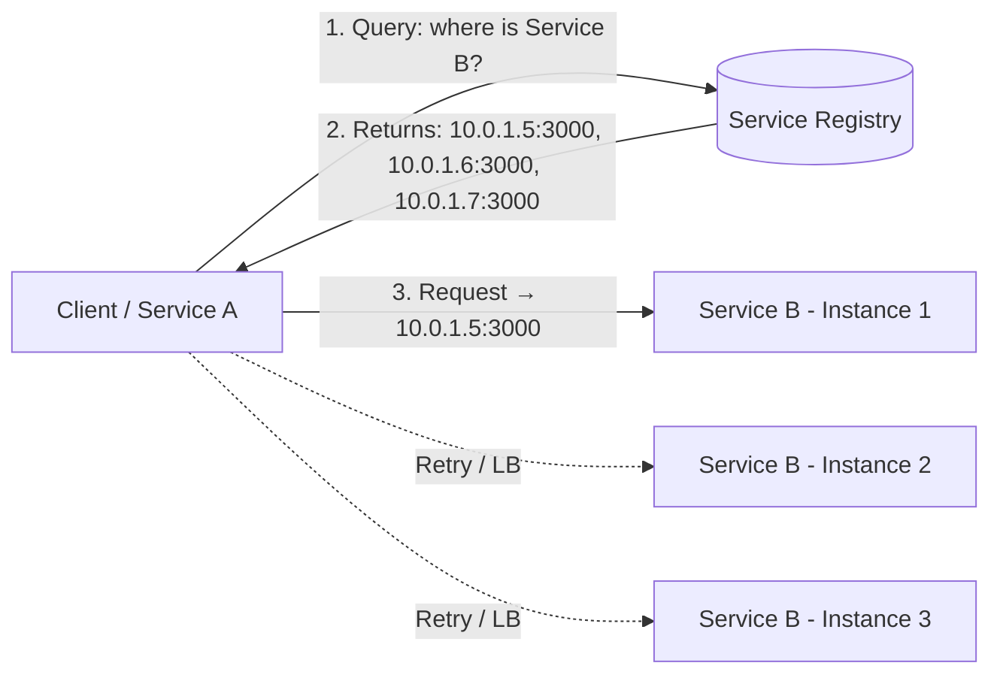
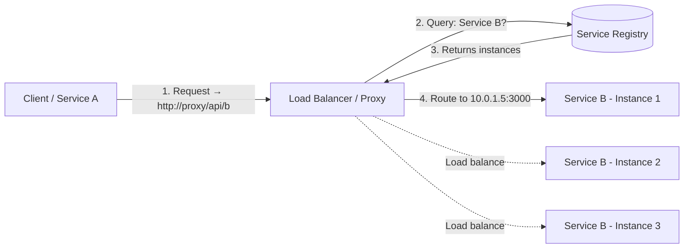
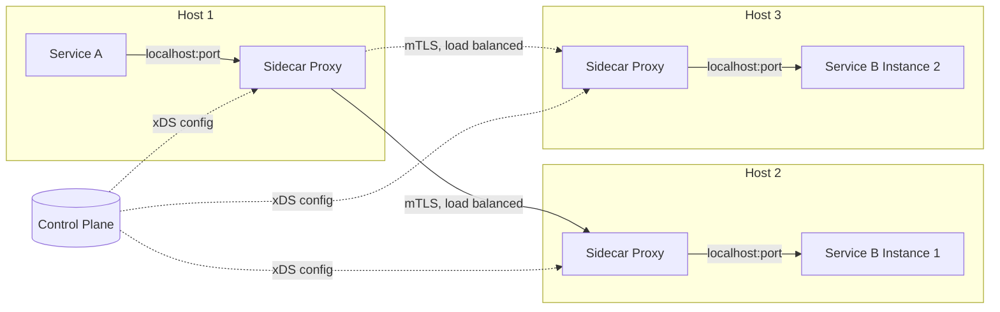
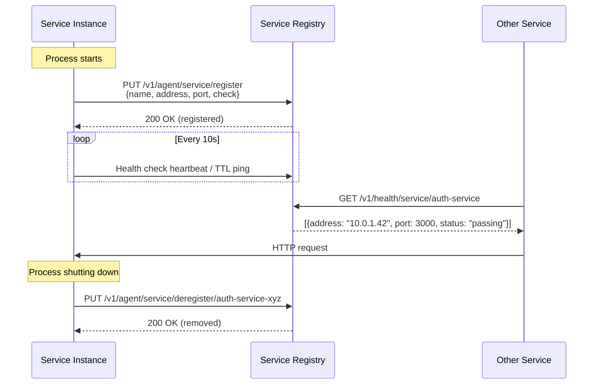
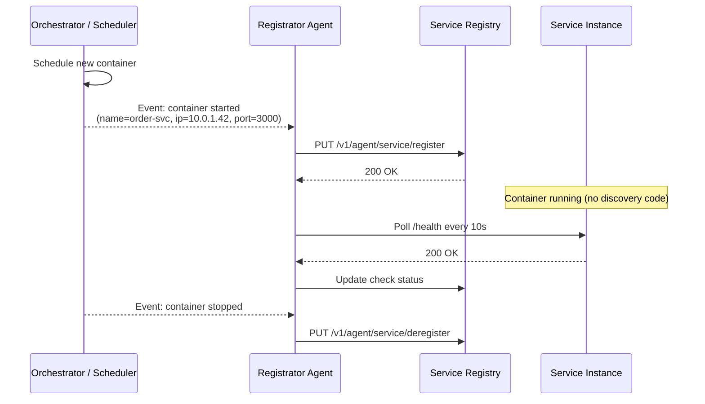
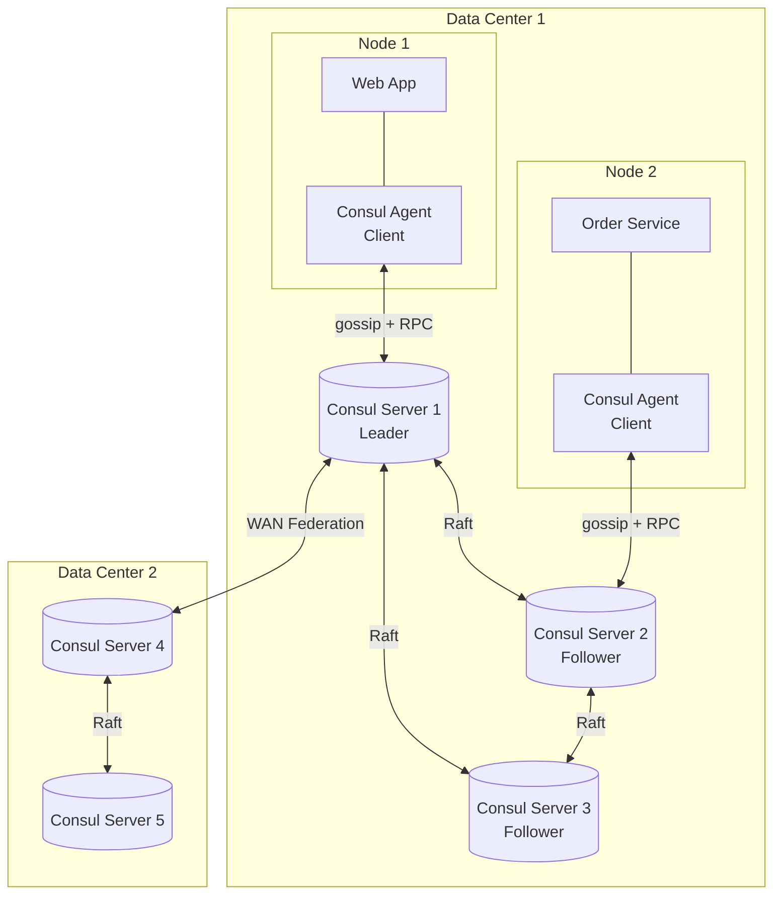
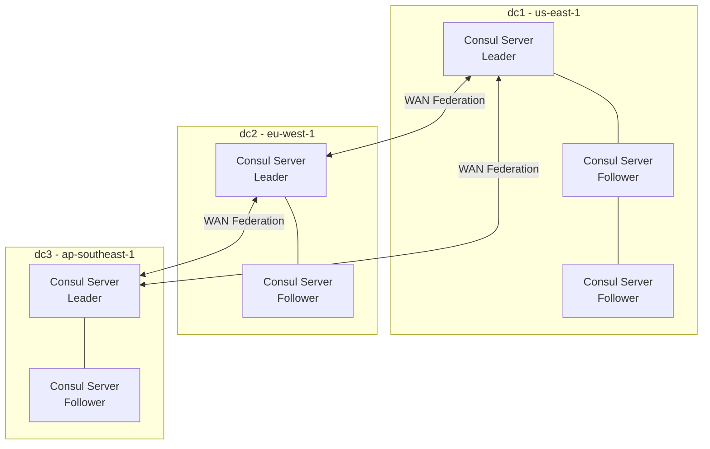
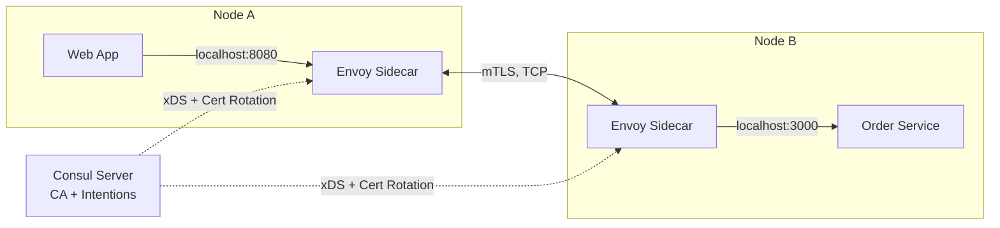
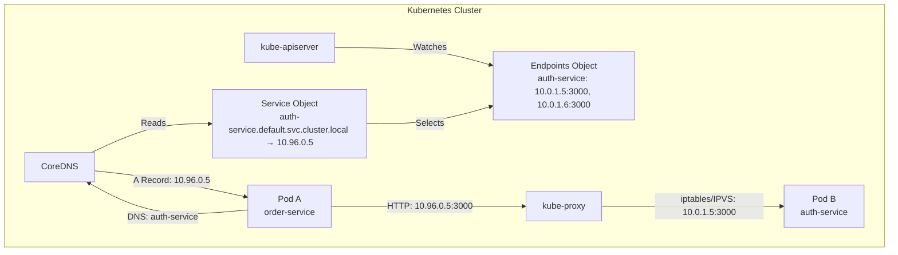

# Service Discovery 🔍

Service discovery is the automatic detection of services and their network locations in a distributed system. In a microservices architecture, where instances are dynamically created, destroyed, and scaled, hardcoding IP addresses or hostnames is impossible — service discovery solves this by maintaining a real-time map of which services are available and where they live.

> _In a static world, you write `http://auth-service:3000` and it works forever. In the cloud, that instance might be gone in 60 seconds. Service discovery is how your system keeps working when nothing stays put._

---

## Why Service Discovery?

Before microservices, applications were monoliths — one process, one address, one deployment. Service discovery wasn't needed because there was only one "service" to locate.

In a modern distributed system:

- **Dynamic scaling**: Instances come and go as autoscalers respond to load. An instance that existed 30 seconds ago might be terminated now.
- **Ephemeral infrastructure**: Containers and serverless functions have short lifetimes. IP addresses are recycled constantly.
- **Rolling deployments**: New versions replace old ones gradually. At any moment, multiple versions of the same service are running.
- **Health fluctuations**: Instances crash, become unresponsive, or degrade. Clients must not route traffic to unhealthy nodes.
- **Multi-region / multi-cloud**: Services span data centers and cloud providers. DNS alone can't express routing rules and health status.

Without service discovery, you're left with manual configuration files, brittle load-balancer rules, and late-night pages when a moved service breaks everything downstream.

---

## Core Concepts

Before diving into patterns, let's establish the vocabulary used throughout the service discovery ecosystem:

| Term | Definition |
| --- | --- |
| **Service Instance** | A single running copy of a service (a process, container, or pod). Has an IP, port, and metadata. |
| **Service Registry** | A database of available service instances. Stores instance addresses, health status, and arbitrary metadata. |
| **Registration** | The act of adding a service instance to the registry so others can discover it. |
| **Deregistration** | Removing an instance from the registry — either gracefully (shutdown hook) or forcibly (failed health check). |
| **Health Check** | A mechanism to determine whether an instance is capable of serving traffic. |
| **Discovery** | Querying the registry to find healthy instances of a given service. |
| **Service Name** | A logical identifier (e.g., `auth-service`, `payment-api`) that maps to one or more instances. |
| **Load Balancer** | Distributes requests across discovered instances according to a strategy (round-robin, least connections, etc.). |

---

## Client-Side vs Server-Side Discovery

The fundamental architectural decision in service discovery is **where the discovery logic lives** — in the client or behind a load balancer. Each pattern trades off simplicity, coupling, and operational complexity.

### Client-Side Discovery

The client is responsible for querying the service registry and selecting an instance. The client knows about the registry and implements load-balancing logic.



**How it works:**

1. Service instances register themselves with the registry on startup.
2. The client (or a library in the client process) queries the registry for instances of the target service.
3. The registry returns a list of healthy instances with their network addresses.
4. The client selects one instance (round-robin, random, least-latency) and makes a direct request.
5. The client periodically refreshes the instance list or subscribes to registry change events.

**Advantages:**
- No extra network hop — the client talks directly to the target instance.
- No single point of failure in the data path (the registry is only in the control path).
- Simple to understand and debug — the client controls which instance it calls.
- Flexible load-balancing strategies per client.

**Disadvantages:**
- Every client must include discovery and load-balancing logic (library dependency in every service).
- Language-specific — a registry client library must exist for every language your stack uses.
- Client and registry are coupled — registry API changes affect every service.
- Harder to enforce consistent load-balancing policies across the organization.

**Examples:** Netflix Eureka + Ribbon, Consul with client libraries, DNS-based discovery with client-side round-robin.

### Server-Side Discovery

The client makes a request to a load balancer (or API gateway). The load balancer queries the registry and routes the request to an available instance. The client knows nothing about the registry or the backend topology.



**How it works:**

1. Service instances register with the registry.
2. The client sends a request to a well-known address — the load balancer (often an FQDN like `api.internal.example.com`).
3. The load balancer queries the service registry to find healthy backend instances.
4. The load balancer forwards the request to a selected instance and returns the response to the client.
5. The client is completely unaware of the backend topology — it only knows the load balancer address.

**Advantages:**
- Clients are simple — no discovery logic, no registry client library.
- Language-agnostic — any HTTP client works. No code changes for new languages.
- Centralized control — operators can change routing, load balancing, and security policies in one place.
- Works naturally with cloud load balancers (AWS ALB/NLB, GCP Load Balancer).

**Disadvantages:**
- Extra network hop — every request passes through the load balancer, adding latency.
- The load balancer is in the data path — if it fails, all communication stops (requires HA setup).
- The load balancer can become a bottleneck under high throughput.
- More infrastructure to manage (load balancer cluster, configuration, TLS certificates).

**Examples:** AWS ALB + ECS, NGINX + Consul Template, Kubernetes Services + kube-proxy, Envoy + xDS.

### Hybrid Approach: Sidecar Proxy (Service Mesh)

Modern architectures often blend both patterns using a **sidecar proxy** — a lightweight proxy deployed alongside each service instance. The service talks to its local sidecar over localhost, and the sidecar handles discovery, load balancing, retries, and TLS. This is the foundation of the service mesh.



The sidecar is technically server-side discovery from the application's perspective (the app treats the sidecar as a local proxy), but client-side discovery from the network's perspective (each sidecar discovers peers via the control plane). We'll explore service mesh in detail later in this document.

---

## Service Registry

The service registry is the heart of service discovery — a highly available, strongly consistent (or eventually consistent) database that stores the network locations of all service instances.

### What a Registry Stores

A registry entry for each service instance typically contains:

```json
{
  "service": "auth-service",
  "id": "auth-service-7f3a2b1c-4d5e-6f78-9012-abcdef123456",
  "address": "10.0.1.42",
  "port": 3000,
  "meta": {
    "version": "2.4.1",
    "region": "us-east-1",
    "az": "us-east-1a",
    "protocol": "http",
    "weight": 10
  },
  "checks": [
    {
      "type": "http",
      "endpoint": "/health",
      "interval": "10s",
      "timeout": "2s",
      "status": "passing"
    }
  ],
  "tags": ["production", "v2", "primary"]
}
```

### Key Properties of a Good Registry

| Property | Description |
| --- | --- |
| **High availability** | The registry itself must be highly available. If it goes down, new instances can't register and clients can't discover. |
| **Consistency model** | How quickly do all clients see the same view? Strong consistency (CP, like ZooKeeper/etcd) vs eventual consistency (AP, like Eureka). |
| **Health-aware** | The registry must track which instances are healthy and automatically remove failing ones. |
| **Watch/subscribe** | Clients should be notified of changes instantly rather than polling the registry every N seconds. |
| **Multi-tenancy** | Support for multiple services, environments, and teams with appropriate isolation. |
| **DNS and/or HTTP API** | DNS is universal (any language, any tool); HTTP API provides richer metadata and programmatic access. |

### Consistency in Registries: The CAP Trade-off

Service registries are distributed systems, so they face the CAP theorem trade-off. In the context of service discovery:

- **CP (Consistent + Partition-tolerant)**: Returns a consistent view, but may reject reads/writes during a network partition. **Good for**: scenarios where routing to the wrong instance is worse than being temporarily unavailable (e.g., financial transactions).
- **AP (Available + Partition-tolerant)**: Always accepts reads/writes, but may return stale data during a partition. **Good for**: scenarios where availability is paramount and a stale routing decision causes only a brief error that can be retried (most web applications).

> **Practical insight:** In many microservice architectures, eventual consistency is acceptable. A client might get a stale list and try a dead instance — but a quick connection timeout + retry to another instance recovers faster than blocking on a consistent read during a partition.

---

## Registration Patterns

How do service instances get into the registry? Two primary patterns exist.

### Self-Registration

Each service instance registers itself on startup and deregisters itself on shutdown. This is the most common pattern in modern architectures.



**How to implement self-registration in practice:**

- Use a library or SDK (Consul client, Eureka client, etcd client) embedded in your application process.
- On startup, call the registry API to register with a unique instance ID, address, port, and health check configuration.
- Configure a health check endpoint or TTL heartbeat that the registry uses to verify the instance is alive.
- On graceful shutdown (`SIGTERM`, `SIGINT`), call deregister to immediately remove the instance from the pool (faster than waiting for the health check to time out).

**Advantages:**
- No external registration agent to manage.
- The instance knows its own state best — it can include version, region, capacity in registration metadata.
- Zero configuration drift — the instance that registers is the one that runs.

**Disadvantages:**
- Every service must include registration logic (language-specific SDK or HTTP calls).
- Registration code is boilerplate that must be maintained across all services.
- If the application crashes without graceful shutdown, it stays in the registry until the health check fails.

**TypeScript Example — Self-Registration with Consul (using HTTP API):**

```typescript
import http from 'http';
import { v4 as uuidv4 } from 'uuid';

const CONSUL_AGENT = 'http://127.0.0.1:8500';
const SERVICE_NAME = 'order-service';
const SERVICE_PORT = 3001;
const INSTANCE_ID = `${SERVICE_NAME}-${uuidv4()}`;

// ── Registration payload ──────────────────────────────────────────
const registrationPayload = {
  ID: INSTANCE_ID,
  Name: SERVICE_NAME,
  Address: '10.0.1.42',                // IP that other services can reach
  Port: SERVICE_PORT,
  Tags: ['production', 'v1.2.0', 'primary'],
  Meta: {
    version: '1.2.0',
    region: 'us-east-1',
    commit: 'abc1234',
  },
  Check: {
    Name: `${SERVICE_NAME} health check`,
    HTTP: `http://10.0.1.42:${SERVICE_PORT}/health`,
    Interval: '10s',
    Timeout: '2s',
    DeregisterCriticalServiceAfter: '60s', // auto-remove after 60s of failure
  },
};

// ── Register on startup ───────────────────────────────────────────
async function register(): Promise<void> {
  const payload = JSON.stringify(registrationPayload);

  await fetch(`${CONSUL_AGENT}/v1/agent/service/register`, {
    method: 'PUT',
    body: payload,
    headers: { 'Content-Type': 'application/json' },
  });

  console.log(`[Consul] Registered: ${INSTANCE_ID} → ${SERVICE_NAME}`);
}

// ── Deregister on graceful shutdown ───────────────────────────────
async function deregister(): Promise<void> {
  await fetch(`${CONSUL_AGENT}/v1/agent/service/deregister/${INSTANCE_ID}`, {
    method: 'PUT',
  });

  console.log(`[Consul] Deregistered: ${INSTANCE_ID}`);
}

// ── Health endpoint that Consul probes ────────────────────────────
const server = http.createServer((req, res) => {
  if (req.url === '/health' && req.method === 'GET') {
    res.writeHead(200, { 'Content-Type': 'application/json' });
    res.end(JSON.stringify({ status: 'ok', uptime: process.uptime() }));
    return;
  }

  // ... application routes
  res.writeHead(404);
  res.end('Not found');
});

server.listen(SERVICE_PORT, async () => {
  await register();
  console.log(`Order service listening on port ${SERVICE_PORT}`);
});

// ── Graceful shutdown ─────────────────────────────────────────────
async function shutdown(signal: string): Promise<void> {
  console.log(`\nReceived ${signal}, shutting down gracefully...`);
  await deregister();

  // Small delay to allow inflight requests to complete
  await new Promise((resolve) => setTimeout(resolve, 2000));
  server.close(() => process.exit(0));
}

process.on('SIGTERM', () => shutdown('SIGTERM'));
process.on('SIGINT', () => shutdown('SIGINT'));
```

### Third-Party Registration

A separate process (the "registrator") watches the infrastructure — container orchestrator events, process lists, or health endpoints — and registers/deregisters instances on their behalf. The service itself has no knowledge of the registry.



**How it works:**

- A registrator agent runs on each host (or as a centralized service) watching the container runtime (Docker socket, containerd), orchestrator API (Kubernetes, Nomad), or a process supervisor.
- When a new container/pod starts, the registrator detects the event, reads metadata (labels, environment variables), and registers it with the service registry.
- The registrator performs health checks on behalf of the services and updates the registry.
- When the container/pod stops, the registrator removes it from the registry.

**Advantages:**
- Services are completely decoupled from the registry — no discovery code in the application.
- Works with legacy applications and third-party software that you can't modify.
- Centralized registration logic — update the registrator, not every service.
- Clean separation of concerns — developers write business logic, operators manage infrastructure.

**Disadvantages:**
- Additional infrastructure to run and monitor.
- The registrator must understand every container runtime and orchestrator you use.
- Registration metadata must be communicated through labels, environment variables, or annotations — less flexible than in-code registration.
- If the registrator crashes, new instances aren't registered until it recovers.

**Popular registrator projects:**
- **Consul Registrator** (by GliderLabs) — watches Docker events and registers containers with Consul.
- **Consul ESM** (External Service Monitor) — health checks external/non-consul services.
- **Kubernetes** — built-in: kubelet registers pods, kube-proxy maintains the cluster IP mapping.

**Kubernetes Example — Third-Party Registration via Annotations:**

```yaml
apiVersion: v1
kind: Pod
metadata:
  name: order-service-abc123
  annotations:
    consul.hashicorp.com/service-name: "order-service"
    consul.hashicorp.com/service-port: "3001"
    consul.hashicorp.com/service-tags: "production,v1.2.0"
    consul.hashicorp.com/connect-inject: "true"
  labels:
    app: order-service
    version: v1.2.0
spec:
  containers:
    - name: order-service
      image: myregistry/order-service:v1.2.0
      ports:
        - containerPort: 3001
```

The Consul agent (or a Mutating Webhook in Consul Connect) reads these annotations and registers the pod automatically — the application code contains zero registration logic.

---

## Health Checks

Health checks are the mechanism that distinguishes a running instance from a healthy, traffic-ready instance. Without them, the registry is just a list of addresses — some of which may be unresponsive, returning 500s, or slow to the point of being unusable.

### Health Check Strategies

#### Heartbeat / TTL Check

The service instance periodically sends a "I'm alive" ping to the registry. If the registry doesn't receive a ping within the TTL window, the instance is marked as unhealthy.

```
Service Instance ────[heartbeat every 10s]────> Service Registry
                                                 If no heartbeat for 30s → mark critical
```

**Pros:**
- Works even if the health endpoint is unreachable from the registry.
- The service can include rich state in the heartbeat (queue depth, connection pool usage, memory pressure).
- No need for an open HTTP port.

**Cons:**
- The service must actively send heartbeats — more code in the application.
- A service that is alive but returning errors still sends heartbeats (the service might not know it's broken from the client's perspective).
- Network delays can cause false positives.

**Consul TTL Example:**

```typescript
const CHECK_ID = `service:${INSTANCE_ID}`;

// Register with a TTL check
await fetch(`${CONSUL_AGENT}/v1/agent/check/register`, {
  method: 'PUT',
  body: JSON.stringify({
    ID: CHECK_ID,
    Name: 'Order Service heartbeat',
    TTL: '30s',
    ServiceID: INSTANCE_ID,
  }),
  headers: { 'Content-Type': 'application/json' },
});

// Send heartbeat every 10 seconds
setInterval(async () => {
  await fetch(`${CONSUL_AGENT}/v1/agent/check/pass/${CHECK_ID}`, {
    method: 'PUT',
  });
}, 10_000);
```

#### Polling / Health Endpoint

The registry (or an agent near the service) periodically sends an HTTP/TCP/gRPC health check request to the service instance. The service responds with a status.

```
Service Registry ────[GET /health every 10s]───> Service Instance
                      <──[200 OK]──
```

**Common health endpoint patterns:**

```typescript
// ── Simple liveness check ─────────────────────────────────────────
// "Can the process respond?" — used by orchestrators to restart dead containers
app.get('/health/live', (_req, res) => {
  res.json({ status: 'alive' });
});

// ── Readiness check ───────────────────────────────────────────────
// "Can this instance serve traffic?" — used by registries and load balancers
app.get('/health/ready', async (_req, res) => {
  const dbConnected = await db.ping();
  const redisConnected = await redis.ping();
  const notOverloaded = cpuUsage() < 0.9;

  const ready = dbConnected && redisConnected && notOverloaded;

  res.status(ready ? 200 : 503).json({
    status: ready ? 'ready' : 'not_ready',
    checks: {
      database: dbConnected ? 'ok' : 'error',
      redis: redisConnected ? 'ok' : 'error',
      cpu: notOverloaded ? 'ok' : 'overloaded',
    },
  });
});

// ── Deep health check ─────────────────────────────────────────────
// "What's the overall health?" — used for monitoring dashboards
app.get('/health', async (_req, res) => {
  const checks = {
    self: 'ok',
    database: await checkDb().then(() => 'ok').catch(e => e.message),
    redis: await checkRedis().then(() => 'ok').catch(e => e.message),
    upstream: await checkUpstreamServices().then(r => r).catch(e => e.message),
  };

  const allOk = Object.values(checks).every(v => v === 'ok');

  res.status(allOk ? 200 : 503).json({
    status: allOk ? 'healthy' : 'degraded',
    uptime: process.uptime(),
    memory: process.memoryUsage(),
    checks,
  });
});
```

### Comparing Health Check Strategies

| Criteria | Heartbeat / TTL | Polling (Registry-initiated) |
| --- | --- | --- |
| **Who initiates?** | Service instance | Registry / agent |
| **Network direction** | Outbound from service | Inbound to service |
| **Works behind NAT?** | Yes (outbound HTTP) | Needs routable address or agent on same host |
| **Detects app-level bugs** | No — service might not know it's returning errors | Yes — HTTP probe can validate response body |
| **Custom state in check** | Yes — heartbeat payload can include metrics | Limited — inferred from response code + body |
| **Simple to implement?** | Moderate — requires timer in app | Easy — just a route handler |
| **Common with** | Consul TTL, etcd lease keep-alive | Consul HTTP/TCP checks, K8s liveness/readiness probes |

> **Best practice:** Use **both**. A health endpoint validates that the service can handle requests (polling), and a heartbeat provides rapid failure detection when the process hangs or the network path is asymmetric. Many production setups use an HTTP health check for readiness and a short TTL heartbeat (10–15s) as a liveness backup.

---

## Tool Comparison

Choosing a service discovery tool depends on your infrastructure, consistency requirements, operational maturity, and whether you're on Kubernetes (which has built-in discovery).

| Feature | **Consul** | **etcd** | **ZooKeeper** | **Eureka** | **Kubernetes DNS** |
| --- | --- | --- | --- | --- | --- |
| **CAP focus** | CP (default) | CP | CP | AP | AP (eventually consistent) |
| **Protocols** | HTTP, DNS, gRPC | gRPC (HTTP/2) | Custom binary | HTTP/REST | DNS, env vars |
| **Health checking** | ✅ Rich (HTTP, TCP, gRPC, TTL, script) | ❌ Via lease TTL only | ❌ Via session ephemeral znodes | ✅ Heartbeat + self-preservation | ✅ Liveness/readiness probes |
| **KV store** | ✅ Yes (full-featured) | ✅ Yes (core feature) | ✅ Yes (hierarchical znodes) | ❌ No | ❌ No (use etcd separately) |
| **Multi-DC** | ✅ First-class (WAN federation) | ❌ Single cluster | ❌ Single cluster (multi-DC via observers) | ✅ Multi-region (peer-to-peer) | ❌ Single cluster (kube-federation complex) |
| **Service mesh** | ✅ Consul Connect (built-in) | ❌ Needs external tooling | ❌ Needs external tooling | ❌ Needs external tooling | ❌ Needs Istio/Linkerd |
| **Consensus** | Raft | Raft | Zab | None (peer replication) | None (kube-apiserver → etcd) |
| **Web UI** | ✅ Built-in, excellent | ❌ No built-in (use etcd-keeper) | ❌ No built-in (use zk-web, ZooNavigator) | ✅ Dashboard | ✅ Via Kubernetes Dashboard |
| **DNS interface** | ✅ Built-in, cached, health-aware | ❌ No DNS (use coredns with plugin) | ❌ No DNS | ❌ No DNS | ✅ CoreDNS (built-in) |
| **ACL / Security** | ✅ ACLs, TLS, mTLS | ✅ RBAC, TLS | ✅ ACLs, SASL, TLS | ❌ Basic (relies on network security) | ✅ RBAC + NetworkPolicy |
| **Operational complexity** | Medium | Low-Medium | High (JVM, manual management) | Medium (Java, Spring ecosystem) | Low (managed by K8s) |
| **Best for** | Multi-DC, hybrid cloud, service mesh | Kubernetes backing store, small-scale coordination | Legacy Hadoop/Kafka ecosystems | JVM/Spring Cloud shops | Services running entirely on Kubernetes |

### When to Choose Which

- **Consul**: You need multi-DC, service mesh (mTLS), a rich health-check system, and a DNS interface. Consul is the most feature-complete option for heterogeneous, multi-platform environments.
- **etcd**: You're on Kubernetes (it's already there as the control-plane store) or you need a simple, fast, strongly-consistent KV store with watch semantics. Not a full service-discovery platform — you'll build discovery logic on top of it.
- **ZooKeeper**: You're in a JVM ecosystem (Kafka, Hadoop, HBase, Storm depend on it). ZooKeeper is battle-tested but operationally heavy. Prefer etcd or Consul for new projects.
- **Eureka**: You're deep in the Spring Cloud / Netflix OSS stack. Eureka's self-preservation mode is unique and useful in unreliable networks. Less common outside the JVM world.
- **Kubernetes DNS**: Your entire workload runs on Kubernetes. You get service discovery for free via DNS and ClusterIP. Combine with a service mesh (Istio/Linkerd) for finer traffic control.

---

## Consul Deep Dive

HashiCorp Consul is the most feature-complete service discovery platform. It combines service discovery, health checking, a KV store, a service mesh (Consul Connect), and multi-data-center federation into a single binary.

### Architecture

A Consul deployment consists of:

- **Consul Agents** — run on every node (host/VM/container). Agents handle health checking and registration for local services. They communicate with the server cluster.
- **Consul Servers** — a small cluster (3–5 nodes) that stores all cluster state, handles consensus (Raft), and responds to queries. Servers are the authoritative source of truth.
- **Clients (SDKs/HTTP)** — any application that queries the Consul HTTP API or DNS interface to discover services.



### Core Components

#### 1. Agent

The Consul agent is a long-running daemon on every node. It runs in two modes:

- **Client mode**: Forwards all RPCs to a server. Lightweight — handles local service registration, health checks, and DNS queries. Every node runs a client agent (or you use the server as a client too).
- **Server mode**: Participates in Raft consensus, stores cluster state, handles queries. Server nodes also run the agent functionality for services that happen to be co-located.

The agent is the **single point of contact** for services on a node. Services register with their local agent — they never talk directly to the server cluster.

#### 2. Catalog

The catalog is the central registry of all services, nodes, and health check statuses across the entire data center. It's replicated across all Consul servers via Raft.

**Querying the catalog:**

```bash
# List all services
curl http://localhost:8500/v1/catalog/services

# List instances of a specific service
curl http://localhost:8500/v1/catalog/service/auth-service

# Response
# [
#   {
#     "ID": "40e4a748-2192-161a-0510-9bf59fe950b5",
#     "Node": "node-02",
#     "Address": "10.0.1.42",
#     "ServiceName": "auth-service",
#     "ServiceID": "auth-service-01",
#     "ServiceAddress": "10.0.1.42",
#     "ServicePort": 3000,
#     "ServiceTags": ["production", "v1", "primary"]
#   }
# ]
```

**Key difference — Catalog vs Health endpoints:**

- `/v1/catalog/service/:name` — returns ALL instances regardless of health status.
- `/v1/health/service/:name` — returns ONLY passing instances (this is what you should use for discovery).

#### 3. Health Checking

Consul has the most sophisticated health-check system of any service-discovery tool. It supports:

| Check Type | Description | Example |
| --- | --- | --- |
| **HTTP** | Performs an HTTP GET and expects a 2xx response | `http://10.0.1.42:3000/health` |
| **TCP** | Attempts a TCP connection | `10.0.1.42:3000` |
| **gRPC** | Performs a gRPC health check (standard health protocol) | `10.0.1.42:50051` |
| **Script** | Runs an external script or command (exit 0 = healthy) | `check_memory.sh` |
| **TTL** | Service must periodically call `check/pass` | Application heartbeat |
| **Docker** | Runs `docker exec` to probe a container | `docker exec container-id /healthcheck.sh` |
| **Alias** | Mirrors the status of another check on the same node | `alias: node-maintenance-check` |

**Health check configuration:**

```hcl
# Consul configuration file
check = {
  id       = "auth-service-http-check"
  name     = "Auth Service HTTP Health"
  service_id = "auth-service-01"
  http     = "http://localhost:3000/health"
  interval = "10s"
  timeout  = "2s"

  # Number of consecutive failures before marking as critical
  failures_before_critical = 3

  # Auto-deregister after this duration in critical state
  deregister_critical_service_after = "120s"
}
```

**Health endpoint response enrichment:**

Consul can parse JSON health check responses. If the response contains `{ "status": "passing" }`, the check is considered passing. This allows the application to report its own health state to Consul via the same HTTP endpoint.

```json
// GET /health returns
{
  "status": "passing",
  "output": "All systems operational",
  "checks": {
    "database": "ok",
    "redis": "ok"
  }
}
```

#### 4. KV Store

Consul's key-value store is a distributed, strongly-consistent (via Raft) data store. It's not just for configuration — it's a building block for distributed coordination.

**Common use cases:**

- **Feature flags**: `config/features/new-checkout-flow` → `true`
- **Dynamic configuration**: `config/payment-service/max-retries` → `3`
- **Leader election**: Use session + acquire/release for distributed locking.
- **Service mesh configuration**: Consul Connect stores intentions (traffic rules) in the KV store.
- **Distributed counters/semaphores**: Using check-and-set operations.

**TypeScript — Using Consul KV for dynamic configuration:**

```typescript
// ── Read config from Consul KV ────────────────────────────────────
async function getConfig(key: string): Promise<object | null> {
  const res = await fetch(`http://localhost:8500/v1/kv/${key}`);
  if (res.status === 404) return null;

  const data = await res.json();
  // Value is base64-encoded in Consul HTTP API
  const value = Buffer.from(data[0].Value, 'base64').toString('utf-8');
  return JSON.parse(value);
}

// ── Watch for config changes (long polling with Consul blocking queries) ──
async function watchConfig(key: string, onChange: (val: object) => void): Promise<void> {
  let index = 0;

  while (true) {
    const res = await fetch(
      `http://localhost:8500/v1/kv/${key}?index=${index}&wait=60s`
    );

    if (res.status === 200) {
      const data = await res.json();
      const value = JSON.parse(Buffer.from(data[0].Value, 'base64').toString('utf-8'));
      index = data[0].ModifyIndex; // Use ModifyIndex for next blocking query
      onChange(value);
    }
    // If 404, key doesn't exist yet; wait and retry
    if (res.status === 404) {
      await new Promise(r => setTimeout(r, 5000));
    }
  }
}

// Usage
await watchConfig('config/order-service/rate-limit', (config) => {
  console.log('Rate limit config updated:', config);
  updateRateLimiter(config);
});
```

#### 5. DNS Interface

Consul exposes every service through a built-in DNS server (default port `8600`). This is one of its most powerful features — any application, in any language, can discover services using standard DNS lookups.

**DNS query format:**

```
<service>.service.<datacenter>.consul
<service>.service.consul             (default datacenter)
<tag>.<service>.service.consul       (filter by tag)
```

**Examples:**

```bash
# Discover auth-service instances (returns A records)
dig @127.0.0.1 -p 8600 auth-service.service.consul

# Filter by tag
dig @127.0.0.1 -p 8600 primary.auth-service.service.consul

# Get SRV records (includes port numbers)
dig @127.0.0.1 -p 8600 auth-service.service.consul SRV

# Get all info about a service node
dig @127.0.0.1 -p 8600 node-01.node.consul

# Forward regular DNS through Consul (recursive)
dig @127.0.0.1 -p 8600 google.com
```

**How applications use Consul DNS:**

```bash
# In a Node.js app — just use the service name as the hostname
# Configure /etc/resolv.conf or dnsmasq to forward .consul to 127.0.0.1:8600
const response = await fetch('http://auth-service.service.consul:3000/login');

# Or, in a code stack that can't configure DNS:
# Use the HTTP API to resolve the address first, then use the IP
```

**DNS caching and TTLs:**

Consul DNS responses include TTLs. By default, healthy services return a TTL of 0 (no caching — clients always get the latest healthy instance list). For performance, you can configure a longer TTL if eventual consistency is acceptable.

#### 6. HTTP API

The HTTP API is the programmatic interface to everything Consul does:

| API Endpoint | Purpose |
| --- | --- |
| `/v1/agent/service/register` | Register a service with the local agent |
| `/v1/agent/service/deregister/:id` | Remove a service registration |
| `/v1/agent/checks` | List all checks on the local agent |
| `/v1/agent/check/pass/:id` | Mark a TTL check as passing |
| `/v1/catalog/service/:name` | List service instances (all health statuses) |
| `/v1/health/service/:name` | List only healthy (passing) service instances |
| `/v1/kv/:key` | Read/write/delete KV entries |
| `/v1/session/create` | Create a session (for distributed locking) |
| `/v1/status/leader` | Get the current Raft leader |
| `/v1/status/peers` | Get all Raft peers |

**TypeScript — Full Service Discovery Client using Consul HTTP API:**

```typescript
interface ServiceInstance {
  id: string;
  name: string;
  address: string;
  port: number;
  tags: string[];
  meta: Record<string, string>;
  health: 'passing' | 'warning' | 'critical';
}

interface ConsulClientOptions {
  agentUrl: string;
  datacenter?: string;
  token?: string;
}

class ConsulServiceDiscovery {
  private agentUrl: string;
  private datacenter: string;
  private token?: string;
  private watchIndexes: Map<string, number> = new Map();

  constructor(options: ConsulClientOptions) {
    this.agentUrl = options.agentUrl;
    this.datacenter = options.datacenter || 'dc1';
    this.token = options.token;
  }

  // ── Discover healthy instances of a service ─────────────────────
  async discover(serviceName: string): Promise<ServiceInstance[]> {
    const url = new URL(`${this.agentUrl}/v1/health/service/${serviceName}`);
    url.searchParams.set('dc', this.datacenter);
    url.searchParams.set('passing', 'true'); // Only passing instances

    const res = await fetch(url.toString(), {
      headers: this.headers(),
    });

    if (!res.ok) {
      throw new Error(`Consul discovery failed: ${res.status} ${res.statusText}`);
    }

    const entries = await res.json();

    return entries.map((entry: any) => ({
      id: entry.Service.ID,
      name: entry.Service.Service,
      address: entry.Service.Address || entry.Node.Address,
      port: entry.Service.Port,
      tags: entry.Service.Tags || [],
      meta: entry.Service.Meta || {},
      health: entry.Checks.every((c: any) => c.Status === 'passing')
        ? 'passing'
        : 'warning',
    }));
  }

  // ── Watch for changes in a service's instance list ──────────────
  async watch(
    serviceName: string,
    callback: (instances: ServiceInstance[]) => void
  ): Promise<() => void> {
    let running = true;
    const key = serviceName;

    const poll = async () => {
      while (running) {
        try {
          const index = this.watchIndexes.get(key) || 0;
          const url = new URL(
            `${this.agentUrl}/v1/health/service/${serviceName}`
          );
          url.searchParams.set('dc', this.datacenter);
          url.searchParams.set('passing', 'true');
          url.searchParams.set('index', String(index));
          url.searchParams.set('wait', '55s'); // Blocking long poll

          const res = await fetch(url.toString(), {
            headers: this.headers(),
          });

          if (!running) break;

          const newIndex = res.headers.get('X-Consul-Index');
          if (newIndex && parseInt(newIndex) !== index) {
            this.watchIndexes.set(key, parseInt(newIndex));
            const entries = await res.json();
            const instances = entries.map((entry: any) => ({
              id: entry.Service.ID,
              name: entry.Service.Service,
              address: entry.Service.Address || entry.Node.Address,
              port: entry.Service.Port,
              tags: entry.Service.Tags || [],
              meta: entry.Service.Meta || {},
              health: entry.Checks.every((c: any) => c.Status === 'passing')
                ? 'passing'
                : 'warning',
            }));
            callback(instances);
          }
        } catch (err) {
          if (!running) break;
          console.error('[Consul Watch] Error, retrying in 5s:', err);
          await new Promise((r) => setTimeout(r, 5000));
        }
      }
    };

    poll(); // Start polling (don't await — fire and forget)

    // Return cancel function
    return () => {
      running = false;
    };
  }

  // ── Service registry integration: resolve URL for a service ─────
  async resolveUrl(serviceName: string, path: string = '/'): Promise<string> {
    const instances = await this.discover(serviceName);
    if (instances.length === 0) {
      throw new Error(`No healthy instances found for service: ${serviceName}`);
    }

    // Simple round-robin — in production, use a proper load balancer
    const instance = instances[Math.floor(Math.random() * instances.length)];
    return `http://${instance.address}:${instance.port}${path}`;
  }

  private headers(): Record<string, string> {
    const h: Record<string, string> = {
      'Content-Type': 'application/json',
    };
    if (this.token) {
      h['X-Consul-Token'] = this.token;
    }
    return h;
  }
}

// ── Usage ──────────────────────────────────────────────────────────
const discovery = new ConsulServiceDiscovery({
  agentUrl: 'http://127.0.0.1:8500',
  datacenter: 'dc1',
});

// One-time discovery
const authInstances = await discovery.discover('auth-service');
console.log(`Found ${authInstances.length} auth instances`);

// Watch for real-time changes
const cancel = await discovery.watch('auth-service', (instances) => {
  console.log(`Auth service instances changed: ${instances.length} healthy`);
  // Update in-memory pool, connection map, etc.
});

// Later, when shutting down:
// cancel();
```

#### 7. Multi-Data Center (WAN Federation)

One of Consul's standout features is native multi-DC support. Data centers are federated over the WAN — each DC runs its own Raft cluster, and servers in different DCs communicate via WAN gossip.



**What's replicated across DCs:**
- Services and health status are NOT replicated by default (each DC is autonomous).
- The WAN gossip pool shares the list of known DCs and their server addresses.
- Queries can be forwarded to a remote DC: `GET /v1/health/service/auth-service?dc=eu-west-1`

**What's NOT replicated:**
- KV store data (this is per-DC).
- Session data (sessions are local to a DC).
- ACL tokens (can be replicated separately via ACL replication).

**Multi-DC DNS:**

```
auth-service.service.dc1.consul          → instances in dc1
auth-service.service.dc2.consul          → instances in dc2
auth-service.service.consul              → instances in the local DC
```

**Prepared queries** allow defining failover logic across DCs:

```bash
# Create a prepared query that tries dc1 first, then dc2
curl -X POST http://localhost:8500/v1/query \
  -d '{
    "Name": "auth-service-failover",
    "Service": {
      "Service": "auth-service",
      "Failover": {
        "NearestN": 3,
        "Datacenters": ["dc1", "dc2", "dc3"]
      }
    }
  }'
```

---

## etcd Overview

etcd is a distributed, reliable key-value store written in Go. It's the backbone of Kubernetes (stores all cluster state) and uses the Raft consensus algorithm for strong consistency. While etcd is primarily a KV store, its watch mechanism and lease system make it suitable as a building block for service discovery.

### Architecture

- **Cluster**: 3–5 nodes (odd number). All nodes participate in Raft. One leader, others are followers.
- **Client**: Talks to any node. Reads can be served by any node (with `Serializable` option) or only the leader (linearizable). Writes always go through the leader.
- **gRPC API**: The native protocol is gRPC. There's also a JSON gateway (`/v3/...` endpoints) for HTTP clients.

### Core Primitives for Service Discovery

**1. Key-Value with Lease**

A service instance writes its address to a key and attaches a lease. If the instance crashes and stops renewing the lease, the key is automatically deleted.

```typescript
import { Etcd3 } from 'etcd3';

const etcd = new Etcd3({ hosts: ['http://localhost:2379'] });
const INSTANCE_ID = 'auth-service-abc123';
const KEY = `/services/auth-service/${INSTANCE_ID}`;

// Create a lease with a 10-second TTL
const lease = etcd.lease(10);

// Store instance info with the lease
await lease.put(KEY).value(
  JSON.stringify({
    address: '10.0.1.42',
    port: 3000,
    version: '1.2.0',
    region: 'us-east-1',
  })
);

// Auto-renew the lease every 3 seconds
lease.on('lost', () => {
  console.error('Lease lost! Instance removed from registry.');
  // Re-register or exit
});

// Keep the lease alive
// The etcd3 library auto-renews leases by default
```

**2. Watch**

Clients watch a key prefix and receive real-time notifications when instances come and go.

```typescript
// Watch for changes to the auth-service registry
const watcher = await etcd
  .watch()
  .prefix('/services/auth-service/')
  .create();

watcher.on('put', (kv) => {
  console.log(`Instance registered/updated: ${kv.key}`);
  const instance = JSON.parse(kv.value.toString());
  addToPool(instance);
});

watcher.on('delete', (kv) => {
  console.log(`Instance removed: ${kv.key}`);
  removeFromPool(kv.key.toString());
});
```

### etcd vs Consul for Service Discovery

| Scenario | Recommendation |
| --- | --- |
| Kubernetes-only environment | etcd (already running; build minimal discovery on top) |
| Multi-DC, hybrid cloud | Consul (built-in federation, DNS, health checks) |
| Small team, minimal ops | Consul (single binary, less glue code needed) |
| Already have health-check infrastructure | etcd (use what you have; etcd is a great pure registry) |
| Need a generic distributed KV store | etcd (its primary purpose) |
| Need service mesh / mTLS | Consul Connect (etcd doesn't provide this) |

---

## Service Mesh

A service mesh extracts service-to-service communication concerns (discovery, load balancing, mTLS, retries, circuit breaking, observability) out of application code and into the infrastructure layer. It's the natural evolution of service discovery — not just finding services, but controlling how they talk to each other.

### Consul Connect

Consul Connect extends Consul with service mesh capabilities. It uses the Consul agent as a sidecar proxy (or an Envoy sidecar) and provides:

- **Automatic mTLS**: Every service-to-service connection is encrypted and mutually authenticated.
- **Intentions**: Declarative rules defining which services can talk to which.
- **Observability**: Metrics and tracing exported via the proxy.
- **No code changes**: The application talks to a local proxy on localhost — no library dependencies.



**Intention example** — allow web to talk to order-service, deny everything else:

```hcl
# Declarative (HCL) or via API
intention {
  source_name      = "web-app"
  destination_name = "order-service"
  action           = "allow"
}
```

In code, the application doesn't change — it calls `http://localhost:8080` (the sidecar's local port) instead of the remote service directly. The sidecar handles discovery, TLS, retries, and metrics.

### Istio

Istio is a platform-independent service mesh, most commonly deployed on Kubernetes. It uses Envoy as the sidecar proxy and provides a richer (but more complex) feature set than Consul Connect.

| Feature | Consul Connect | Istio |
| --- | --- | --- |
| **Sidecar proxy** | Built-in proxy or Envoy | Envoy (required) |
| **Traffic routing** | Basic (via intentions + config entries) | Advanced (virtual services, destination rules, gateways) |
| **Circuit breaking** | Via Envoy config | Rich (connection pool, outlier detection) |
| **Observability** | Metrics via proxy | Deep (Jaeger tracing, Prometheus metrics, Kiali dashboard, access logs) |
| **Ingress gateway** | Limited (via external tools) | Built-in (Istio Ingress Gateway with Envoy) |
| **Platform** | Any (VMs, containers, Kubernetes) | Primarily Kubernetes |
| **Complexity** | Low-Medium | High (many CRDs, steep learning curve) |
| **Best for** | Multi-platform, simpler requirements | Kubernetes-native, complex traffic management |

---

## Kubernetes DNS, Services & Endpoints

Kubernetes has built-in service discovery. If your entire workload runs on K8s, you may not need an external service discovery tool — the platform provides it.

### How Kubernetes Service Discovery Works



**Step-by-step:**

1. You create a **Service** that selects pods by label.
2. The **Endpoints** controller watches for matching pods and populates an Endpoints (or EndpointSlice) object with their IPs and ports.
3. **CoreDNS** creates a DNS record (`<service>.<namespace>.svc.cluster.local`) pointing to the Service's ClusterIP — a virtual IP.
4. **kube-proxy** programs iptables (or IPVS) rules on every node to DNAT traffic from the ClusterIP to one of the backend pod IPs.
5. When a client pod resolves the service DNS name and sends a request to the ClusterIP, kube-proxy transparently redirects the traffic to a healthy backend pod.

### Kubernetes Service Types

| Type | Behavior |
| --- | --- |
| **ClusterIP** | Internal-only virtual IP. Default type. Only reachable within the cluster. |
| **NodePort** | Opens a static port (30000–32767) on every node. `<NodeIP>:<NodePort>` reaches the service. |
| **LoadBalancer** | Provisions an external cloud load balancer (AWS NLB, GCP LB) that forwards to the NodePort. |
| **ExternalName** | Creates a CNAME record to an external DNS name. No proxying. |
| **Headless** (ClusterIP: None) | No ClusterIP allocated. DNS returns the pod IPs directly (A/AAAA records). Used for StatefulSets and custom discovery. |

### DNS-Based Discovery on Kubernetes

Inside any pod, you can resolve other services:

```bash
# Same namespace
curl http://auth-service:3000/health

# Different namespace
curl http://auth-service.production:3000/health

# FQDN (fully qualified domain name)
curl http://auth-service.production.svc.cluster.local:3000/health

# Headless service — returns individual pod IPs
dig auth-service-headless.production.svc.cluster.local

# Environment variables (injected at pod startup)
echo $AUTH_SERVICE_SERVICE_HOST
echo $AUTH_SERVICE_SERVICE_PORT
```

### Limitations of Kubernetes-Native Discovery

Kubernetes DNS and Services work great for Kubernetes-only workloads, but have gaps:

- **No multi-cluster discovery** — a pod in cluster A can't resolve a service in cluster B without extra tooling.
- **No health-aware DNS** — the Service includes all "Ready" pods. There's no concept of "passing but degraded" — it's binary Ready/NotReady.
- **No non-Kubernetes services** — VMs, bare-metal servers, and managed services (RDS, ElastiCache) aren't automatically discovered.
- **DNS caching** — applications may cache DNS results and keep sending traffic to a dead pod IP until the TTL expires.
- **No metadata queries** — DNS only returns IPs. You can't ask "give me auth-service instances with tag canary and health passing."

> **Pattern:** Many teams run Consul or etcd alongside Kubernetes to unify service discovery for in-cluster and out-of-cluster workloads. Kubernetes handles pod-to-pod routing; Consul/etcd provides a single registry that spans K8s, VMs, and cloud-managed services.

---

## Load Balancing Integration

Service discovery answers "where are the instances?" Load balancing answers "which instance gets this request?" The two are tightly coupled — discovery feeds the load balancer with a real-time pool of healthy endpoints.

### Client-Side Load Balancing

The client itself chooses an instance from the discovered list.

**Strategies:**

```typescript
type LoadBalancerStrategy = 'round-robin' | 'random' | 'least-connections' | 'weighted';

class ClientSideLoadBalancer {
  private instances: ServiceInstance[] = [];
  private rrIndex = 0;

  updateInstances(instances: ServiceInstance[]): void {
    this.instances = instances;
  }

  select(strategy: LoadBalancerStrategy = 'round-robin'): ServiceInstance {
    if (this.instances.length === 0) {
      throw new Error('No healthy instances available');
    }

    switch (strategy) {
      case 'round-robin': {
        const idx = this.rrIndex++ % this.instances.length;
        return this.instances[idx];
      }
      case 'random': {
        const idx = Math.floor(Math.random() * this.instances.length);
        return this.instances[idx];
      }
      case 'weighted': {
        // Instances declare weight in metadata; higher weight = more traffic
        const totalWeight = this.instances.reduce(
          (sum, inst) => sum + parseInt(inst.meta.weight || '10'),
          0
        );
        let target = Math.random() * totalWeight;
        for (const inst of this.instances) {
          target -= parseInt(inst.meta.weight || '10');
          if (target <= 0) return inst;
        }
        return this.instances[0]; // fallback
      }
      default:
        return this.instances[0];
    }
  }
}
```

### Server-Side Load Balancing (Consul + NGINX + Consul Template)

A common pattern: Consul maintains the registry. Consul Template watches Consul and rewrites NGINX's upstream configuration whenever instances change. NGINX reloads and starts routing traffic to the new set of backends.

```nginx
# nginx.conf.ctmpl — Consul Template file
upstream auth_service {
  {{ range service "auth-service" }}
  server {{ .Address }}:{{ .Port }} max_fails=3 fail_timeout=30s;
  {{ end }}
}

server {
  listen 80;
  location /api/auth/ {
    proxy_pass http://auth_service;
    proxy_set_header Host $host;
  }
}
```

```bash
# Consul Template watches Consul and regenerates nginx.conf
consul-template \
  -template "nginx.conf.ctmpl:/etc/nginx/nginx.conf:nginx -s reload"
```

### Integration Patterns Summary

| Pattern | Discovery Tool | Load Balancer | Best For |
| --- | --- | --- | --- |
| **Client-side** | Consul / Eureka / etcd | Application code or SDK | Small-to-medium systems; same-language stacks |
| **Proxy + Template** | Consul | NGINX / HAProxy (with consul-template) | Traditional ops; existing reverse proxy investment |
| **Service mesh sidecar** | Consul Connect / Istio | Envoy sidecar | Modern microservices; need mTLS + observability |
| **K8s native** | CoreDNS + Services | kube-proxy (iptables/IPVS) | Kubernetes-only workloads |
| **Cloud LB** | AWS Cloud Map / GCP Service Directory | ALB/NLB, Google Cloud LB | Fully managed; cloud-native stacks |

---

## Production Considerations

### Security

- **Encrypt communication with the registry**: Consul and etcd support TLS. Never send service registration data over plaintext in production.
- **Authenticate registrations**: Require ACL tokens so only authorized services can register or query the registry.
- **Isolate the registry network**: The registry (Consul servers, etcd cluster) should be on a private network, not exposed to the public internet.
- **Rotate tokens and certificates**: Automate TLS certificate rotation for the registry and service mesh.

### Resilience

- **Run an agent on every node**: In Consul, running a local agent means the service never talks directly to the server cluster — the agent handles caching, health checks, and DNS locally. If the server cluster is unreachable, the agents still serve the last-known-good state.
- **Graceful degradation**: If the registry is entirely down, the application should continue serving traffic using the last-known instance list (stale, but better than down).
- **Client-side caching**: Always cache discovery results in memory. Don't query the registry on every request.
- **Quick failure detection**: Use short health-check intervals (5–10s) and aggressive timeouts so dead instances are removed quickly.

### Observability

- **Monitor the registry itself**: Track Raft leader changes, commit latency, and disk usage. A slow registry slows down the entire infrastructure.
- **Track discovery staleness**: Emit a metric for "seconds since last successful registry sync." Alert if it exceeds a threshold.
- **Trace service-to-service calls**: Integrate service discovery with distributed tracing (OpenTelemetry, Jaeger) to attribute latency to specific instances.

---

## Summary

Service discovery is not a luxury — it's a prerequisite for operating a distributed system at any scale beyond a handful of static servers. The landscape offers solutions for every architecture:

- **Kubernetes-only** → built-in DNS + Services (simplest path).
- **Multi-platform, multi-DC** → Consul (the most feature-complete option).
- **Need a building block** → etcd (lightweight, reliable, watch-based).
- **JVM/Spring ecosystem** → Eureka (tight integration with Spring Cloud).
- **Complex traffic management + observability** → Service mesh (Consul Connect or Istio).

Whichever tool you choose, the principles are the same: register on startup, deregister on shutdown, check health continuously, discover dynamically, and cache locally. Build your services to assume the registry might be stale and to retry gracefully — because in a distributed system, nothing is ever perfectly up-to-date.

[← Back to Backend Engineering](../README.md) · © sparshjaswal