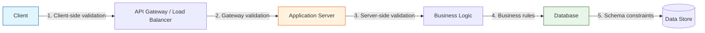
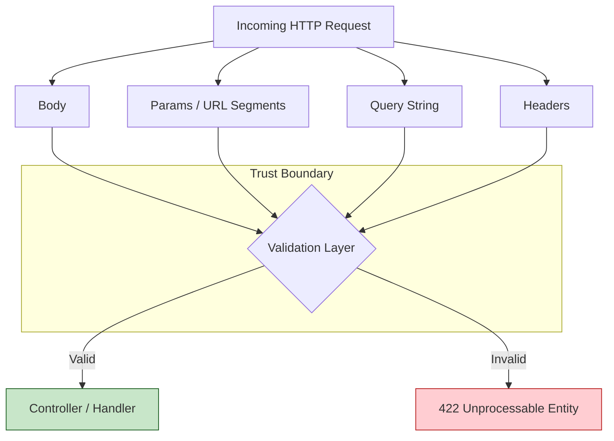
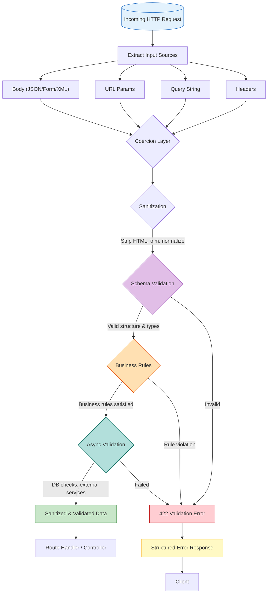

# Validation 🛡️

Input validation is the first line of defense in any backend application. It ensures that data entering your system is well-formed, safe, and semantically correct **before** it reaches your business logic, database, or any downstream service.

> _Never trust user input. Validate everything. Sanitize what you can't reject._

---

## Why Validation Matters

Skipping validation is like leaving your front door unlocked. Attackers constantly probe endpoints for injection vectors, malformed payloads, and edge cases. Even non-malicious clients send bad data — empty fields, wrong types, strings where numbers belong.

| Risk                        | Without Validation                         | With Validation                                 |
| --------------------------- | ------------------------------------------ | ----------------------------------------------- |
| **SQL Injection**           | Raw user input concatenated into queries   | Rejected before touching the database           |
| **XSS**                     | Stored malicious scripts rendered to users | Stripped or escaped on input                    |
| **Data corruption**         | `null` in NOT NULL columns, wrong types    | Schema enforcement catches mismatches           |
| **Business logic bugs**     | Negative prices, future birth dates        | Custom rules reject invalid states              |
| **API contract violations** | Downstream services receive garbage        | Contract enforced at the boundary               |
| **Debugging hell**          | Error discovered deep in the stack         | Error caught at the boundary with clear message |

**Core principle:** Fail fast and fail loudly. Catch bad data as early as possible, and return actionable error messages to the caller.

---

## Defense in Depth: Where to Validate

Relying on a single validation layer is fragile. A robust system validates at multiple boundaries.



| Layer                    | Responsibility                                               | Tools / Techniques                            | Must-Have?                          |
| ------------------------ | ------------------------------------------------------------ | --------------------------------------------- | ----------------------------------- |
| **Client**               | Immediate UX feedback, reduce round-trips                    | HTML5 validation, Zod (shared schemas)        | ❌ Nice-to-have (never trust alone) |
| **Gateway / Proxy**      | Basic request validation, rate limiting                      | WAF rules, NGINX/Envoy Lua scripting, AWS WAF | ✅ For public-facing APIs           |
| **Application (Server)** | **Primary validation layer** — schema, types, business rules | Joi, Zod, class-validator, custom middleware  | ✅ **Mandatory**                    |
| **Business Logic**       | Domain invariants, cross-field rules                         | Service-layer checks, domain-driven design    | ✅ For complex domains              |
| **Database**             | Last line of defense — type constraints, NOT NULL, CHECK     | SQL constraints, triggers, foreign keys       | ✅ Always                           |

**The golden rule:** Client-side validation is for UX. Server-side validation is for security. Never substitute one for the other.

---

## Validation Library Comparison

Choosing the right validation library shapes your entire codebase. Here's how the four major contenders stack up:

| Criteria                   | **Joi**                         | **Zod**                                       | **Yup**                        | **class-validator**                     |
| -------------------------- | ------------------------------- | --------------------------------------------- | ------------------------------ | --------------------------------------- |
| **TypeScript inference**   | ❌ Manual types                 | ✅ First-class, `z.infer`                     | ❌ Limited (`InferType`)       | ❌ Decorator-based, no inference        |
| **Bundle size (minified)** | ~150 KB                         | ~12 KB                                        | ~60 KB                         | ~40 KB (+ `class-transformer`)          |
| **Learning curve**         | Medium                          | Low (TypeScript-native feel)                  | Low                            | Medium (requires decorator knowledge)   |
| **Async validation**       | ✅ `external()`                 | ✅ `.refine()` with async                     | ✅ `.test()` with async        | ✅ `@Validate` with promises            |
| **Custom messages**        | Excellent, template-based       | Good, string/method-based                     | Good                           | Good, decorator options                 |
| **Conditional schemas**    | ✅ `.when()`, `.alternatives()` | ✅ `.discriminatedUnion()`, `.refine()`       | ✅ `.when()`                   | ✅ `@ValidateIf()`                      |
| **Transforms / coercion**  | ✅ Built-in                     | ✅ `.transform()`, `.coerce`                  | ✅ `.transform()`              | ✅ `@Transform()` via class-transformer |
| **Framework integration**  | Express/Hapi (native)           | Any (unopinionated)                           | Formik (React), Express        | NestJS (first-class), Express           |
| **Ecosystem / plugins**    | Mature (since 2013)             | Rapidly growing (since 2020)                  | Stable                         | NestJS-only                             |
| **Best for**               | Legacy Express apps, Hapi       | Modern TypeScript projects, full-stack (tRPC) | React form validation, Express | NestJS DTO validation                   |

### When to Choose What

```
┌─────────────────────────────────────────────────────────────┐
│                    Which Validation Library?                 │
├─────────────────────────────────────────────────────────────┤
│                                                             │
│  Are you using NestJS?                                      │
│      ├── Yes ──► class-validator + ValidationPipe          │
│      │                                                     │
│      └── No ──► Is TypeScript inference critical?          │
│                    ├── Yes ──► Zod                          │
│                    │                                        │
│                    └── No ──► Is bundle size critical?      │
│                                  ├── Yes ──► Zod           │
│                                  │                         │
│                                  └── No ──► Joi (mature,   │
│                                              feature-rich)  │
└─────────────────────────────────────────────────────────────┘
```

---

## Joi Deep Dive

Joi is the battle-tested validation library for Node.js, maintained by the Hapi.js team. It uses a declarative, chainable API to define schemas that describe exactly what valid data looks like.

### Installation & Basic Setup

```bash
npm install joi
```

```typescript
import Joi from 'joi';

// Define a schema
const userSchema = Joi.object({
  username: Joi.string().alphanum().min(3).max(30).required(),
  email: Joi.string().email().required(),
  password: Joi.string()
    .pattern(new RegExp('^[a-zA-Z0-9]{8,30}$'))
    .message('Password must be 8-30 alphanumeric characters')
    .required(),
  age: Joi.number().integer().min(18).max(120),
  role: Joi.string().valid('user', 'admin', 'moderator').default('user'),
});

// Validate
const { error, value } = userSchema.validate(req.body, {
  abortEarly: false, // Return ALL errors, not just the first
  stripUnknown: true, // Remove properties not in schema
});

if (error) {
  // error.details is an array of { message, path, type, context }
  const messages = error.details.map((d) => d.message);
}
```

### Joi Schema Building Blocks

#### Strings

```typescript
Joi.string()
  .min(2)
  .max(100)
  .alphanum() // a-z, A-Z, 0-9
  .email({ tlds: false }) // Email validation
  .uri() // Valid URI
  .isoDate() // ISO 8601 date
  .guid({ version: 'uuidv4' })
  .trim() // Auto-trim whitespace
  .lowercase() // Auto-lowercase
  .uppercase() // Auto-uppercase
  .pattern(/^[a-zA-Z ]+$/) // Custom regex
  .message('Invalid string format');
```

#### Numbers

```typescript
Joi.number()
  .integer()
  .min(0)
  .max(99999)
  .positive()
  .negative()
  .precision(2) // Max 2 decimal places
  .port() // 0–65535
  .default(0);
```

#### Arrays

```typescript
Joi.array()
  .items(Joi.string().email()) // Array of emails
  .min(1)
  .max(100)
  .unique() // No duplicates
  .ordered(Joi.string(), Joi.number()) // First item string, second number
  .single() // Accept single value as array of one
  .sparse(false); // Reject undefined/null items
```

#### Objects & Nested Schemas

```typescript
const addressSchema = Joi.object({
  street: Joi.string().required(),
  city: Joi.string().required(),
  zip: Joi.string().pattern(/^\d{5}(-\d{4})?$/),
  country: Joi.string().length(2).uppercase(), // ISO country code
});

const userSchema = Joi.object({
  name: Joi.string().required(),
  addresses: Joi.array().items(addressSchema).min(1).max(5),
  primaryAddress: Joi.number().integer().min(0).max(4), // Index into addresses array
});
```

### Custom Validation with `.custom()`

```typescript
// Custom validator — synchronous or async
const productSchema = Joi.object({
  sku: Joi.string().custom((value, helpers) => {
    if (!value.startsWith('SKU-')) {
      return helpers.error('sku.prefix', { message: 'SKU must start with "SKU-"' });
    }
    return value.toUpperCase(); // Can transform!
  }),
  price: Joi.number().custom((value, helpers) => {
    if ((value * 100) % 1 !== 0) {
      return helpers.error('price.precision');
    }
    return value;
  }),
});
```

### Conditional Validation with `.when()`

```typescript
const orderSchema = Joi.object({
  paymentMethod: Joi.string().valid('credit_card', 'paypal', 'bank_transfer').required(),

  // Conditional: credit card number only required when payment method is 'credit_card'
  creditCardNumber: Joi.string().when('paymentMethod', {
    is: 'credit_card',
    then: Joi.string().creditCard().required(),
    otherwise: Joi.string().forbidden(), // Must NOT be present
  }),

  // Multi-value conditional
  shippingAddress: Joi.object().when('paymentMethod', {
    is: Joi.string().valid('credit_card', 'paypal'),
    then: Joi.object({
      street: Joi.string().required(),
      city: Joi.string().required(),
    }).required(),
    otherwise: Joi.object().optional(),
  }),
});
```

### Async Validation with `.external()`

```typescript
const registrationSchema = Joi.object({
  email: Joi.string()
    .email()
    .external(async (value) => {
      const existingUser = await db.users.findByEmail(value);
      if (existingUser) {
        throw new Joi.ValidationError(
          'Email already registered',
          [{ message: 'Email already registered', path: ['email'] }],
          value,
        );
      }
    }),
  username: Joi.string()
    .alphanum()
    .external(async (value) => {
      const existing = await db.users.findByUsername(value);
      if (existing) {
        throw new Joi.ValidationError(
          'Username taken',
          [{ message: 'Username is already taken', path: ['username'] }],
          value,
        );
      }
    }),
});

// Async validation must use validateAsync
const validated = await registrationSchema.validateAsync(req.body);
```

### Joi with Express Middleware

```typescript
import { Request, Response, NextFunction } from 'express';
import Joi, { Schema } from 'joi';

interface ValidationSchemas {
  body?: Schema;
  params?: Schema;
  query?: Schema;
}

/**
 * Express middleware factory — validates body, params, and query against Joi schemas.
 */
function validate(schemas: ValidationSchemas) {
  return (req: Request, res: Response, next: NextFunction): void => {
    const errors: Record<string, string[]> = {};

    for (const [location, schema] of Object.entries(schemas)) {
      if (!schema) continue;

      const { error, value } = schema.validate((req as any)[location], {
        abortEarly: false,
        stripUnknown: location !== 'query',
      });

      if (error) {
        errors[location] = error.details.map((d) => d.message);
      } else {
        // Replace with validated & sanitized data
        (req as any)[location] = value;
      }
    }

    if (Object.keys(errors).length > 0) {
      res.status(422).json({
        error: {
          code: 'VALIDATION_ERROR',
          message: 'One or more validation errors occurred',
          details: errors,
        },
      });
      return;
    }

    next();
  };
}

// Usage in routes
router.post(
  '/users',
  validate({
    body: Joi.object({
      email: Joi.string().email().required(),
      password: Joi.string().min(8).max(128).required(),
    }),
    params: Joi.object({
      orgId: Joi.string().uuid().required(),
    }),
    query: Joi.object({
      invite: Joi.string().valid('true', 'false').default('false'),
    }),
  }),
  userController.create,
);
```

---

## Zod Deep Dive

Zod is a TypeScript-first schema declaration and validation library. Its killer feature: **static type inference** from schemas, eliminating the need to define types and schemas separately.

### Installation & Basic Setup

```bash
npm install zod
```

```typescript
import { z } from 'zod';

// Define a schema — notice the TypeScript-like syntax
const userSchema = z.object({
  username: z
    .string()
    .min(3)
    .max(30)
    .regex(/^[a-zA-Z0-9_]+$/),
  email: z.string().email(),
  password: z.string().min(8).max(128),
  age: z.number().int().min(18).max(120).optional(),
  role: z.enum(['user', 'admin', 'moderator']).default('user'),
});

// ✨ STATIC TYPE INFERENCE — no double-declaration needed!
type User = z.infer<typeof userSchema>;
// User = { username: string; email: string; password: string; age?: number; role: 'user' | 'admin' | 'moderator' }

// Parse (throws on failure) vs safeParse (returns result object)
const result = userSchema.safeParse(req.body);

if (!result.success) {
  // result.error is a ZodError with .issues array
  console.error(result.error.issues);
} else {
  // result.data is FULLY TYPED — TypeScript knows its shape
  const user: User = result.data;
}
```

### Zod Schema Building Blocks

#### Primitives & Coercion

```typescript
// Coercion — automatically convert strings from query params / form data
const querySchema = z.object({
  page: z.coerce.number().int().min(1).default(1), // "3" → 3
  limit: z.coerce.number().int().min(1).max(100).default(20),
  active: z.coerce.boolean(), // "true" → true
  createdAt: z.coerce.date(), // "2024-01-15" → Date
});

// Without coercion — strict type checking
const strictSchema = z.object({
  page: z.number().int().min(1), // Passes only if page is actually a number
});
```

#### Strings

```typescript
z.string()
  .min(1)
  .max(255)
  .email()
  .url()
  .uuid()
  .cuid()
  .datetime() // ISO 8601 datetime
  .trim() // Auto-trim
  .toLowerCase() // Auto-transform to lowercase
  .regex(/^[a-z]+$/i)
  .includes('@') // Must contain '@'
  .startsWith('USER_')
  .length(10);
```

#### Numbers

```typescript
z.number().int().positive().nonnegative().min(0).max(100).multipleOf(5).finite().safe(); // Between Number.MIN_SAFE_INTEGER and MAX_SAFE_INTEGER
```

#### Arrays

```typescript
z.array(z.string()); // string[]
z.string().array(); // Equivalent syntax

z.array(
  z.object({
    name: z.string(),
    quantity: z.number().int().positive(),
  }),
)
  .min(1) // At least 1 item
  .max(100)
  .nonempty() // Alias for .min(1)
  .length(5); // Exactly 5 items
```

#### Objects — Shape, Extend, Merge, Pick, Omit

```typescript
const baseUser = z.object({
  id: z.string().uuid(),
  email: z.string().email(),
  name: z.string(),
});

// Extend — add fields
const fullUser = baseUser.extend({
  password: z.string().min(8),
  createdAt: z.date(),
});

// Pick / Omit — subset of fields
const publicUser = fullUser.pick({ id: true, email: true, name: true });
const updateUser = fullUser.omit({ id: true, createdAt: true });

// Merge — combine two schemas
const withMetadata = z.object({ metadata: z.record(z.string()) });
const enrichedUser = fullUser.merge(withMetadata);

// Partial — all fields optional (useful for PATCH)
const patchUser = fullUser.partial();

// Deep partial — optional at all nested levels
const deepPatchUser = fullUser.deepPartial();

// Passthrough / Strip — handle unknown keys
z.object({ email: z.string() }).passthrough(); // Keep unknown keys
z.object({ email: z.string() }).strict(); // Error on unknown keys
```

### Unions, Discriminated Unions & Enums

```typescript
// Simple union — match any of multiple schemas
const idSchema = z.union([z.string().uuid(), z.number().int().positive()]);

// Discriminated union — tagged union, excellent for event/action types
const eventSchema = z.discriminatedUnion('type', [
  z.object({ type: z.literal('user.created'), userId: z.string(), email: z.string() }),
  z.object({ type: z.literal('order.placed'), orderId: z.string(), total: z.number() }),
  z.object({ type: z.literal('payment.received'), orderId: z.string(), amount: z.number() }),
]);

type Event = z.infer<typeof eventSchema>;
// TypeScript narrows the type based on the 'type' discriminator — exhaustive checking!
```

### Refinement & Super Refinement

```typescript
// .refine() — simple predicate (returns boolean)
const passwordSchema = z
  .string()
  .refine((val) => /[A-Z]/.test(val) && /[0-9]/.test(val), {
    message: 'Password must contain at least one uppercase letter and one number',
  });

// .superRefine() — multi-issue refinement with full control
const bookingSchema = z
  .object({
    checkIn: z.coerce.date(),
    checkOut: z.coerce.date(),
    guests: z.number().int().positive(),
  })
  .superRefine((data, ctx) => {
    const now = new Date();

    if (data.checkIn < now) {
      ctx.addIssue({
        code: z.ZodIssueCode.custom,
        message: 'Check-in date must be in the future',
        path: ['checkIn'],
      });
    }

    if (data.checkOut <= data.checkIn) {
      ctx.addIssue({
        code: z.ZodIssueCode.custom,
        message: 'Check-out must be after check-in',
        path: ['checkOut'],
      });
    }

    const daysDiff = (data.checkOut.getTime() - data.checkIn.getTime()) / (1000 * 3600 * 24);
    if (daysDiff > 30) {
      ctx.addIssue({
        code: z.ZodIssueCode.custom,
        message: 'Maximum stay is 30 days',
        path: ['checkOut'],
      });
    }
  });
```

### Transforms — Reshaping Data During Validation

```typescript
// Transform a string to a Date
const dateFromString = z.string().transform((val, ctx) => {
  const date = new Date(val);
  if (isNaN(date.getTime())) {
    ctx.addIssue({
      code: z.ZodIssueCode.invalid_date,
      message: 'Invalid date format',
    });
    return z.NEVER; // Abort the transform
  }
  return date;
});

// Trim + lowercase + transform
const emailSchema = z
  .string()
  .trim()
  .toLowerCase()
  .email()
  .transform((email) => email.split('@')[1]) // Extract domain
  .refine((domain) => !domain.endsWith('.test'), 'Test domains not allowed');

// Preprocess — transform BEFORE validation
const numericId = z.preprocess(
  (val) => (typeof val === 'string' ? parseInt(val, 10) : val),
  z.number().int().positive(),
);
// numericId.parse("123") → 123
// numericId.parse("abc") → throws (NaN fails .int().positive())
```

### Zod with Express Middleware

```typescript
import { Request, Response, NextFunction } from 'express';
import { ZodSchema, ZodError } from 'zod';

/**
 * Generic Zod validation middleware.
 * Validates body, params, and query against provided Zod schemas.
 * On success: replaces req.{body,params,query} with parsed (coerced & sanitized) data.
 * On failure: returns 422 with structured error details.
 */
function validate(schemas: { body?: ZodSchema; params?: ZodSchema; query?: ZodSchema }) {
  return (req: Request, res: Response, next: NextFunction): void => {
    const errors: Array<{ location: string; field: string; message: string }> = [];

    for (const [location, schema] of Object.entries(schemas)) {
      if (!schema) continue;

      const result = schema.safeParse((req as any)[location]);

      if (!result.success) {
        const zodError = result.error as ZodError;
        for (const issue of zodError.issues) {
          errors.push({
            location,
            field: issue.path.join('.'),
            message: issue.message,
          });
        }
      } else {
        (req as any)[location] = result.data;
      }
    }

    if (errors.length > 0) {
      res.status(422).json({
        error: {
          code: 'VALIDATION_ERROR',
          message: 'One or more validation errors occurred',
          details: errors,
        },
      });
      return;
    }

    next();
  };
}

// Usage
router.post(
  '/orders',
  validate({
    body: z.object({
      items: z
        .array(
          z.object({
            productId: z.string().uuid(),
            quantity: z.number().int().min(1).max(99),
          }),
        )
        .min(1)
        .max(50),
      shippingAddress: z.string().min(20).max(500),
    }),
    query: z.object({
      coupon: z.string().optional(),
    }),
  }),
  orderController.create,
);
```

---

## class-validator with NestJS

class-validator works with TypeScript decorators to annotate class properties with validation rules. When paired with NestJS's `ValidationPipe`, validation becomes nearly invisible — DTOs self-validate.

### Installation & NestJS Setup

```bash
npm install class-validator class-transformer
```

```typescript
// main.ts — Enable global validation
import { NestFactory } from '@nestjs/core';
import { ValidationPipe } from '@nestjs/common';
import { AppModule } from './app.module';

async function bootstrap() {
  const app = await NestFactory.create(AppModule);

  app.useGlobalPipes(
    new ValidationPipe({
      whitelist: true, // Strip properties not in DTO
      forbidNonWhitelisted: true, // Throw error on unknown properties
      transform: true, // Auto-transform payloads to DTO instances
      transformOptions: {
        enableImplicitConversion: true, // Auto-coerce types from query strings
      },
      validationError: {
        target: false, // Don't expose the DTO in error response
        value: false, // Don't expose the invalid value
      },
    }),
  );

  await app.listen(3000);
}
bootstrap();
```

### DTOs with Decorators

```typescript
import {
  IsString,
  IsEmail,
  IsInt,
  Min,
  Max,
  IsEnum,
  IsOptional,
  IsUUID,
  IsArray,
  ArrayMinSize,
  ArrayMaxSize,
  ValidateNested,
  IsBoolean,
  IsDateString,
  Matches,
  Length,
  MaxLength,
} from 'class-validator';
import { Type } from 'class-transformer';

// --- Nested DTO ---
class OrderItemDto {
  @IsUUID('4')
  productId: string;

  @IsInt()
  @Min(1)
  @Max(99)
  quantity: number;

  @IsOptional()
  @IsString()
  @MaxLength(500)
  notes?: string;
}

// --- Main DTO ---
export class CreateOrderDto {
  @IsUUID('4')
  userId: string;

  @IsArray()
  @ArrayMinSize(1)
  @ArrayMaxSize(50)
  @ValidateNested({ each: true }) // Validate EACH item in the array
  @Type(() => OrderItemDto) // Required for nested validation
  items: OrderItemDto[];

  @IsString()
  @Length(20, 500)
  shippingAddress: string;

  @IsOptional()
  @IsString()
  @Matches(/^[A-Z0-9]{4,10}$/)
  couponCode?: string;

  @IsEnum(['standard', 'express', 'overnight'])
  shippingMethod: 'standard' | 'express' | 'overnight';
}

// --- Controller ---
import { Body, Controller, Post, Query, Param, Get } from '@nestjs/common';

@Controller('orders')
export class OrdersController {
  @Post()
  create(@Body() dto: CreateOrderDto) {
    // dto is already validated AND typed correctly!
    return this.ordersService.create(dto);
  }

  @Get()
  findAll(@Query('page') page: number = 1, @Query('limit') limit: number = 20) {
    return this.ordersService.findAll({ page, limit });
  }
}
```

### Custom Decorators

```typescript
import {
  registerDecorator,
  ValidationOptions,
  ValidatorConstraint,
  ValidatorConstraintInterface,
  ValidationArguments,
} from 'class-validator';

// --- Custom validator: IsStrongPassword ---
@ValidatorConstraint({ name: 'isStrongPassword', async: false })
export class IsStrongPasswordConstraint implements ValidatorConstraintInterface {
  validate(password: string, args: ValidationArguments): boolean {
    if (typeof password !== 'string') return false;
    const hasUpper = /[A-Z]/.test(password);
    const hasLower = /[a-z]/.test(password);
    const hasNumber = /[0-9]/.test(password);
    const hasSpecial = /[!@#$%^&*(),.?":{}|<>]/.test(password);
    const isValidLength = password.length >= 8 && password.length <= 128;

    // Count how many conditions pass
    const passed = [hasUpper, hasLower, hasNumber, hasSpecial].filter(Boolean).length;
    return isValidLength && passed >= 3;
  }

  defaultMessage(args: ValidationArguments): string {
    return 'Password must be 8-128 characters and include at least 3 of: uppercase, lowercase, number, special character';
  }
}

export function IsStrongPassword(validationOptions?: ValidationOptions) {
  return function (object: Object, propertyName: string) {
    registerDecorator({
      target: object.constructor,
      propertyName,
      options: validationOptions,
      constraints: [],
      validator: IsStrongPasswordConstraint,
    });
  };
}

// --- Custom validator: IsAfterDate ---
@ValidatorConstraint({ name: 'isAfterDate', async: false })
export class IsAfterDateConstraint implements ValidatorConstraintInterface {
  validate(value: string, args: ValidationArguments): boolean {
    const [relatedPropertyName] = args.constraints;
    const relatedValue = (args.object as any)[relatedPropertyName];
    if (!value || !relatedValue) return true; // Let @IsNotEmpty handle missing values
    return new Date(value) > new Date(relatedValue);
  }

  defaultMessage(args: ValidationArguments): string {
    return `${args.property} must be after ${args.constraints[0]}`;
  }
}

export function IsAfterDate(property: string, validationOptions?: ValidationOptions) {
  return function (object: Object, propertyName: string) {
    registerDecorator({
      target: object.constructor,
      propertyName,
      options: validationOptions,
      constraints: [property],
      validator: IsAfterDateConstraint,
    });
  };
}

// --- Usage in DTO ---
export class CreateBookingDto {
  @IsDateString()
  checkIn: string;

  @IsDateString()
  @IsAfterDate('checkIn')
  checkOut: string;

  @IsStrongPassword()
  password: string;
}
```

### Async Custom Validators (DB Lookups)

```typescript
@ValidatorConstraint({ name: 'isUniqueEmail', async: true })
@Injectable() // Make injectable to use services
export class IsUniqueEmailConstraint implements ValidatorConstraintInterface {
  constructor(private readonly usersService: UsersService) {}

  async validate(email: string, args: ValidationArguments): Promise<boolean> {
    if (!email) return true;
    const user = await this.usersService.findByEmail(email);
    return !user; // Return true if email is NOT taken
  }

  defaultMessage(args: ValidationArguments): string {
    return `Email "${args.value}" is already registered`;
  }
}

export function IsUniqueEmail(validationOptions?: ValidationOptions) {
  return function (object: Object, propertyName: string) {
    registerDecorator({
      target: object.constructor,
      propertyName,
      options: validationOptions,
      constraints: [],
      validator: IsUniqueEmailConstraint,
    });
  };
}

// Usage in DTO
export class RegisterDto {
  @IsEmail()
  @IsUniqueEmail()
  email: string;
}

// IMPORTANT: Register the constraint as a provider in your module
@Module({
  providers: [IsUniqueEmailConstraint, UsersService],
})
export class UsersModule {}
```

### Conditional Validation with @ValidateIf

```typescript
import { ValidateIf } from 'class-validator';

export class PaymentDto {
  @IsEnum(['credit_card', 'paypal', 'bank_transfer'])
  paymentMethod: string;

  @ValidateIf((o) => o.paymentMethod === 'credit_card')
  @IsCreditCard()
  cardNumber?: string;

  @ValidateIf((o) => o.paymentMethod === 'credit_card')
  @IsString()
  @Length(3, 4)
  cvv?: string;

  @ValidateIf((o) => o.paymentMethod === 'bank_transfer')
  @IsString()
  @Matches(/^[A-Z]{2}\d{2}[A-Z0-9]{4,30}$/)
  iban?: string;
}
```

---

## Validating All Input Types

Unvalidated request data can come from **four** locations. All must be validated:



### Body Validation

```typescript
// Express + Zod
const createUserBody = z.object({
  email: z.string().email(),
  password: z.string().min(8),
});
```

### URL Parameters Validation

```typescript
// Express + Zod
const userIdParams = z.object({
  userId: z.string().uuid(),
});

router.get('/users/:userId', validate({ params: userIdParams }), userController.getById);
```

### Query String Validation

Query strings are always strings — **coercion is critical**:

```typescript
// Express + Zod — use z.coerce for all query values
const listUsersQuery = z.object({
  page: z.coerce.number().int().min(1).default(1),
  limit: z.coerce.number().int().min(1).max(100).default(20),
  sort: z.enum(['name', 'email', 'createdAt']).default('createdAt'),
  order: z.enum(['asc', 'desc']).default('desc'),
  search: z.string().max(200).optional(),
  status: z.enum(['active', 'inactive', 'banned']).optional(),
  role: z.string().optional(),
});

// curl "http://api.example.com/users?page=2&limit=10&status=active"
// page="2" → coerce to 2, limit="10" → coerce to 10
```

### Headers Validation

```typescript
// Express + Zod
const authHeaders = z.object({
  authorization: z.string().regex(/^Bearer [A-Za-z0-9\-._~+/]+=*$/),
  'content-type': z.literal('application/json'),
  'x-request-id': z.string().uuid().optional(),
});

router.post('/secure-endpoint', validate({ headers: authHeaders }), (req, res) => {
  /* ... */
});
```

---

## Nested & Array Validation

Real-world payloads contain deeply nested structures. Every level must be validated.

```typescript
// Zod — recursive nested schema
const attributeSchema = z.object({
  key: z.string().min(1).max(50),
  value: z.union([z.string(), z.number(), z.boolean()]),
});

const variantSchema = z.object({
  sku: z.string().regex(/^[A-Z]{2}-\d{6}$/),
  size: z.enum(['XS', 'S', 'M', 'L', 'XL', 'XXL']),
  color: z.string(),
  price: z.number().positive().max(99999.99),
  attributes: z.array(attributeSchema).max(20),
});

const createProductSchema = z.object({
  name: z.string().min(3).max(200),
  variants: z
    .array(variantSchema)
    .min(1)
    .max(100)
    .refine(
      (variants) => {
        // Business rule: all SKUs within a product must be unique
        const skus = variants.map((v) => v.sku);
        return new Set(skus).size === skus.length;
      },
      { message: 'Duplicate SKU within product variants' },
    ),
  tags: z.array(z.string().min(1).max(30)).max(20).default([]),
  metadata: z.record(z.string(), z.union([z.string(), z.number()])).optional(),
});
```

---

## Custom Business Rule Validation

Schema validation handles structure and types. Business rules enforce domain constraints — combinations of fields that must (or must not) exist together.

```typescript
// Example: Shipment validation with complex business rules
const shipmentSchema = z
  .object({
    origin: z.object({
      country: z.string().length(2),
      city: z.string().min(1),
      postalCode: z.string(),
    }),
    destination: z.object({
      country: z.string().length(2),
      city: z.string().min(1),
      postalCode: z.string(),
    }),
    packageDetails: z.object({
      weightKg: z.number().positive().max(1000),
      dimensionsCm: z.object({
        length: z.number().positive().max(300),
        width: z.number().positive().max(300),
        height: z.number().positive().max(300),
      }),
      isHazardous: z.boolean(),
      isFragile: z.boolean(),
    }),
    shippingSpeed: z.enum(['standard', 'express', 'overnight']),
  })
  .superRefine((data, ctx) => {
    // Rule 1: Domestic shipments can't be 'overnight'
    if (data.origin.country === data.destination.country && data.shippingSpeed === 'overnight') {
      ctx.addIssue({
        code: z.ZodIssueCode.custom,
        message: 'Overnight shipping is only available for international shipments',
        path: ['shippingSpeed'],
      });
    }

    // Rule 2: Hazardous materials can't use express or overnight
    if (data.packageDetails.isHazardous && data.shippingSpeed !== 'standard') {
      ctx.addIssue({
        code: z.ZodIssueCode.custom,
        message: 'Hazardous materials can only be shipped via standard',
        path: ['shippingSpeed'],
      });
    }

    // Rule 3: Fragile items must have volumetric weight under 30kg
    const volumetricWeight =
      (data.packageDetails.dimensionsCm.length *
        data.packageDetails.dimensionsCm.width *
        data.packageDetails.dimensionsCm.height) /
      5000;
    if (data.packageDetails.isFragile && volumetricWeight > 30) {
      ctx.addIssue({
        code: z.ZodIssueCode.custom,
        message: 'Fragile items must have volumetric weight under 30kg',
        path: ['packageDetails', 'dimensionsCm'],
      });
    }

    // Rule 4: Specific country restrictions
    const restrictedDestinations = ['KP', 'IR', 'SY', 'CU'];
    if (restrictedDestinations.includes(data.destination.country)) {
      ctx.addIssue({
        code: z.ZodIssueCode.custom,
        message: `Shipping to ${data.destination.country} is restricted`,
        path: ['destination', 'country'],
      });
    }
  });
```

---

## Input Sanitization

Validation **rejects** bad data. Sanitization **cleans** acceptable data. Both are necessary.

### What to Sanitize

| Input Type                        | Risk                                | Sanitization                                             |
| --------------------------------- | ----------------------------------- | -------------------------------------------------------- |
| Free-text fields (comments, bios) | XSS via stored `<script>` tags      | Strip HTML, or use allowlist-based HTML sanitizer        |
| File names                        | Path traversal (`../../etc/passwd`) | Strip path separators, allow only safe characters        |
| URLs / redirect params            | Open redirect phishing              | Validate against allowlist of domains                    |
| Rich text (WYSIWYG editors)       | XSS, CSS injection                  | Sanitize with DOMPurify (server-side)                    |
| Markdown                          | XSS via raw HTML in markdown        | Render then sanitize, or strip raw HTML before rendering |

### XSS Sanitization

```bash
npm install dompurify jsdom
```

```typescript
import { JSDOM } from 'jsdom';
import DOMPurify from 'dompurify';

const window = new JSDOM('').window;
const purify = DOMPurify(window as any);

function sanitizeHtml(dirty: string): string {
  return purify.sanitize(dirty, {
    ALLOWED_TAGS: ['b', 'i', 'em', 'strong', 'a', 'p', 'br', 'ul', 'ol', 'li'],
    ALLOWED_ATTR: ['href', 'title', 'target'],
    ALLOW_DATA_ATTR: false,
  });
}

// Intercept in validation middleware or use as Zod transform
const commentSchema = z
  .string()
  .max(5000)
  .transform((val) => sanitizeHtml(val))
  .refine((val) => val.length > 0, 'Comment cannot be empty after sanitization');
```

### SQL Injection — Parameterized Queries (the only correct answer)

```typescript
// ❌ NEVER do this — SQL injection vulnerability
const query = `SELECT * FROM users WHERE email = '${req.body.email}'`;

// ✅ ALWAYS use parameterized queries / ORM
// Raw SQL with parameterized query
const { rows } = await pool.query('SELECT * FROM users WHERE email = $1', [req.body.email]);

// ORM (Prisma example — parameterized by design)
const user = await prisma.user.findUnique({
  where: { email: req.body.email },
});
```

### NoSQL Injection Prevention

```typescript
// ❌ Dangerous — user controls the filter object
await db.collection('users').find(req.body.filter);

// ✅ Whitelist acceptable filter fields
const allowedFields = ['email', 'username', 'status'];
const filter: Record<string, unknown> = {};
for (const [key, value] of Object.entries(req.body.filter)) {
  if (allowedFields.includes(key) && typeof value === 'string') {
    filter[key] = value;
  }
}
await db.collection('users').find(filter);
```

---

## Async Validation Patterns

Some validations require database queries or external service calls. Handle them carefully — they add latency and can be exploited for enumeration attacks.

### Zod Async Refinement

```typescript
const registerSchema = z
  .object({
    email: z.string().email(),
    username: z.string().min(3).max(30),
  })
  .refine(
    async (data) => {
      // Returns true if email is NOT taken
      const existing = await userRepository.findByEmail(data.email);
      return !existing;
    },
    { message: 'Email is already registered', path: ['email'] },
  )
  .refine(
    async (data) => {
      const existing = await userRepository.findByUsername(data.username);
      return !existing;
    },
    { message: 'Username is already taken', path: ['username'] },
  );

// Must use .parseAsync() or .safeParseAsync()
const result = await registerSchema.safeParseAsync(req.body);
```

### Performance Considerations for Async Validation

```typescript
// ✅ BATCH: Parallelize independent async checks
const [emailExists, usernameExists] = await Promise.all([
  userRepository.findByEmail(data.email),
  userRepository.findByUsername(data.username),
]);

// ✅ CACHE: Cache expensive lookups to avoid repeated DB hits
// ✅ TIMEOUT: Add timeouts to external service calls
const product = await Promise.race([
  externalCatalogService.lookup(data.productId),
  new Promise((_, reject) => setTimeout(() => reject(new Error('Catalog service timeout')), 2000)),
]);
```

---

## Error Response Formatting

Validation errors must be structured, consistent, and actionable. Clients parse error responses programmatically — make them predictable.

### Standard Error Format

```json
{
  "error": {
    "code": "VALIDATION_ERROR",
    "message": "One or more validation errors occurred",
    "details": [
      {
        "field": "email",
        "message": "Must be a valid email address",
        "rejectedValue": "not-an-email"
      },
      {
        "field": "items.0.quantity",
        "message": "Must be at least 1",
        "rejectedValue": 0
      },
      {
        "field": "checkOut",
        "message": "Check-out must be after check-in",
        "rejectedValue": "2024-01-10T00:00:00.000Z"
      }
    ],
    "requestId": "req_c9d8f7e6"
  }
}
```

### Generic Validation Error Handler (Express)

```typescript
import { ZodError } from 'zod';
import { Request, Response, NextFunction } from 'express';

class AppError extends Error {
  constructor(
    public statusCode: number,
    public code: string,
    message: string,
    public details?: any[],
  ) {
    super(message);
  }
}

function validationErrorHandler(err: Error, req: Request, res: Response, next: NextFunction): void {
  if (err instanceof ZodError) {
    res.status(422).json({
      error: {
        code: 'VALIDATION_ERROR',
        message: 'One or more validation errors occurred',
        details: err.issues.map((issue) => ({
          field: issue.path.join('.'),
          message: issue.message,
          rejectedValue: 'value' in req.body ? (req.body as any)[issue.path[0]] : undefined,
        })),
        requestId: req.headers['x-request-id'] || undefined,
      },
    });
    return;
  }

  if (err instanceof AppError) {
    res.status(err.statusCode).json({
      error: {
        code: err.code,
        message: err.message,
        details: err.details,
        requestId: req.headers['x-request-id'] || undefined,
      },
    });
    return;
  }

  // Unexpected error — log it, return generic message
  console.error('Unhandled error:', err);
  res.status(500).json({
    error: {
      code: 'INTERNAL_ERROR',
      message: 'An unexpected error occurred',
      requestId: req.headers['x-request-id'] || undefined,
    },
  });
}

// Register after all routes
app.use(validationErrorHandler);
```

### NestJS Exception Filter for Validation Errors

```typescript
import {
  ExceptionFilter,
  Catch,
  ArgumentsHost,
  HttpStatus,
  BadRequestException,
} from '@nestjs/common';
import { Response, Request } from 'express';

@Catch(BadRequestException)
export class ValidationExceptionFilter implements ExceptionFilter {
  catch(exception: BadRequestException, host: ArgumentsHost) {
    const ctx = host.switchToHttp();
    const response = ctx.getResponse<Response>();
    const request = ctx.getRequest<Request>();
    const exceptionResponse = exception.getResponse() as any;

    // class-validator errors come as an array on the message property
    const details = Array.isArray(exceptionResponse.message)
      ? exceptionResponse.message.map((msg: string) => ({
          field: this.extractFieldName(msg),
          message: msg,
        }))
      : [{ field: 'unknown', message: exceptionResponse.message }];

    response.status(HttpStatus.UNPROCESSABLE_ENTITY).json({
      error: {
        code: 'VALIDATION_ERROR',
        message: 'One or more validation errors occurred',
        details,
        requestId: request.headers['x-request-id'] || undefined,
      },
    });
  }

  private extractFieldName(message: string): string {
    // class-validator messages often start with the field name
    const match = message.match(/^(\w+)\s/);
    return match ? match[1] : 'unknown';
  }
}

// Register in main.ts
app.useGlobalFilters(new ValidationExceptionFilter());
```

---

## Complete Validation Pipeline



---

## Best Practices Summary

| #   | Practice                                                    | Why                                                               |
| --- | ----------------------------------------------------------- | ----------------------------------------------------------------- |
| 1   | **Validate at the boundary**                                | Catch bad data before it enters your domain layer                 |
| 2   | **Use schema-first validation**                             | Schemas are self-documenting, testable, and reusable              |
| 3   | **Prefer Zod for TypeScript projects**                      | Eliminate dual type/schema maintenance with `z.infer`             |
| 4   | **Always strip unknown properties**                         | Prevents mass-assignment attacks (`stripUnknown` / `whitelist`)   |
| 5   | **Validate all four input sources**                         | Body, params, query, headers — no blind spots                     |
| 6   | **Coerce query params**                                     | Everything from a query string is a string                        |
| 7   | **Use discriminated unions for polymorphic payloads**       | Exhaustive type narrowing in TypeScript                           |
| 8   | **Format errors consistently**                              | Clients should get the same structure from every endpoint         |
| 9   | **Never expose stack traces or internal details in errors** | Production errors should be generic; details go to logs           |
| 10  | **Batch independent async validations**                     | `Promise.all` to minimize latency                                 |
| 11  | **Sanitize free-text fields**                               | XSS prevention even if HTML is never "supposed" to be there       |
| 12  | **Use parameterized queries — always**                      | The only reliable defense against SQL injection                   |
| 13  | **Validate file uploads separately**                        | Check MIME type, magic bytes, file size BEFORE processing         |
| 14  | **Test your validation**                                    | Write unit tests for schemas and integration tests for middleware |

---

### Quick Decision Matrix

| Situation                                       | Tool                                             | Pattern                                        |
| ----------------------------------------------- | ------------------------------------------------ | ---------------------------------------------- |
| NestJS app, DTOs with decorators                | class-validator + ValidationPipe                 | `@IsString()`, `@IsEmail()`, `whitelist: true` |
| TypeScript Express app, team values type safety | Zod                                              | `z.object({ ... }).safeParse(req.body)`        |
| Legacy Node.js app, Hapi framework              | Joi                                              | `Joi.object({ ... }).validate(req.payload)`    |
| React form validation shared with server        | Zod                                              | Share schemas via monorepo package             |
| Simple API, minimal dependencies                | Zod (12 KB)                                      | Lightweight, tree-shakeable                    |
| Complex conditional logic, alternatives         | Joi `.when()` / Zod `.discriminatedUnion()`      | Match library to complexity                    |
| DB lookup required for uniqueness               | Zod `.refine(async ...)` / class-validator async | Use safeParseAsync or async custom validator   |

[← Back to Backend Engineering](../README.md) · © sparshjaswal
