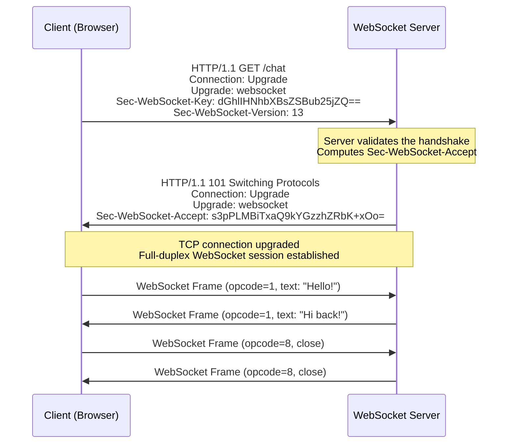
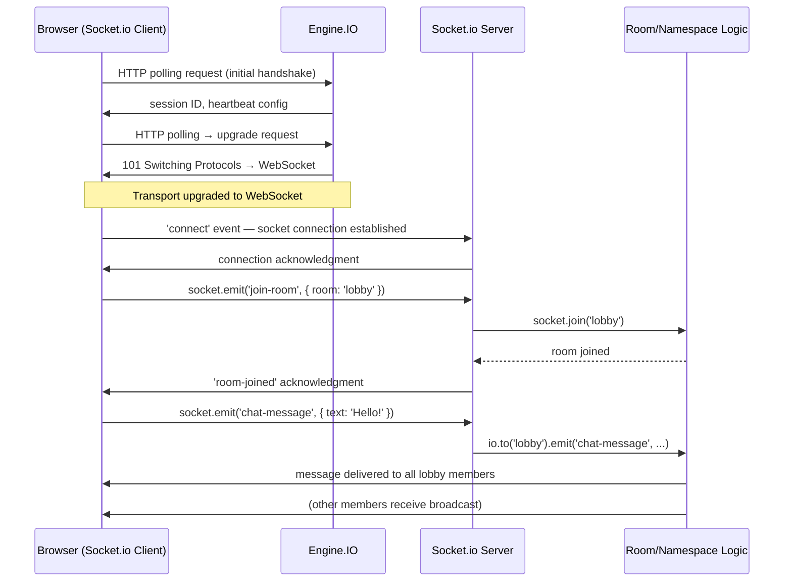
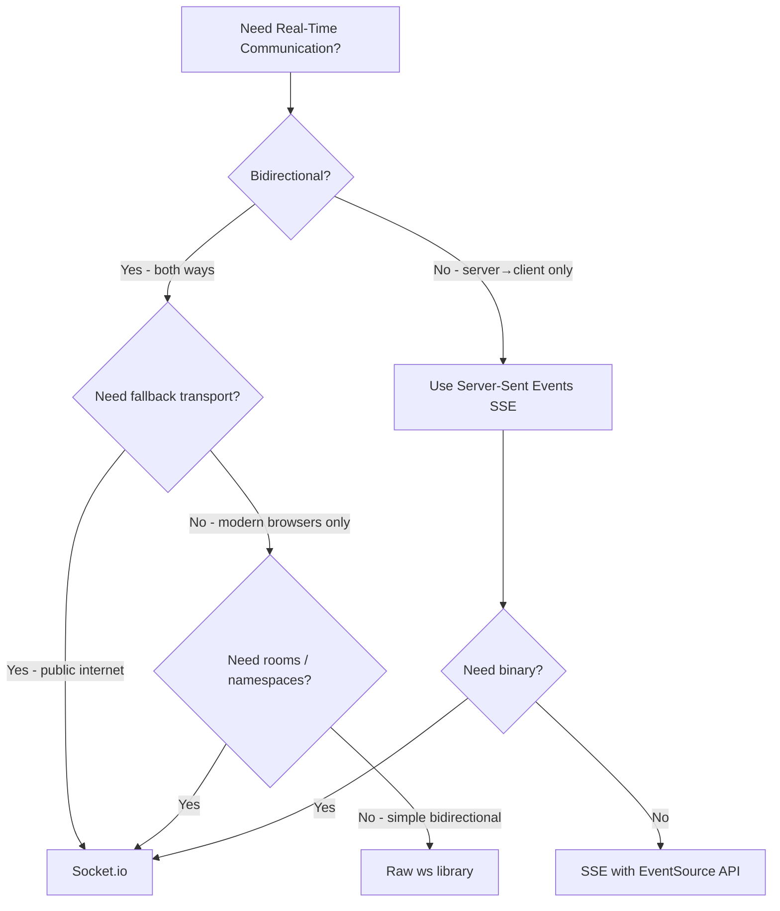

# WebSockets 🔌

WebSocket is a communication protocol that provides **full-duplex**, **persistent** connections between a client and a server over a single TCP socket. Unlike the traditional request–response model of HTTP, WebSockets allow both parties to send data at any time — making them ideal for real-time applications.

> _HTTP is like sending letters. WebSockets are like having a phone call._

---

## Why WebSockets?

Before WebSockets, real-time communication over HTTP was achieved through workarounds — each with significant trade-offs:

| Technique | How it works | Drawbacks |
| --- | --- | --- |
| **Short Polling** | Client sends HTTP requests at fixed intervals (e.g., every 2s) | Wasted requests when no new data; latency up to polling interval |
| **Long Polling** | Client sends HTTP request; server holds it open until data is available, then responds; client immediately reconnects | Still request–response; high connection overhead; complex server state |
| **Server-Sent Events (SSE)** | Server pushes data over a single HTTP connection; client receives a stream | **Unidirectional only** (server → client); limited browser support for custom headers |
| **WebSocket** | Persistent TCP connection upgraded from HTTP; bidirectional, low overhead | Requires protocol upgrade; slightly more complex infrastructure |

### WebSocket vs HTTP/2 SSE vs Long Polling

| Criteria | WebSocket | SSE (Server-Sent Events) | Long Polling |
| --- | --- | --- | --- |
| **Direction** | Bidirectional (full-duplex) | Unidirectional (server → client) | Bidirectional (simulated) |
| **Protocol** | `ws://` / `wss://` | Plain HTTP | Plain HTTP |
| **Connection** | Persistent single TCP connection | Persistent single HTTP connection | New request per message |
| **Overhead** | 2–6 bytes per frame after handshake | HTTP headers per event; text-only | Full HTTP headers per request |
| **Binary support** | ✅ Native (blob, arraybuffer) | ❌ Text-only (base64-encode binary) | ✅ (base64-encode) |
| **Browser support** | All modern browsers | All modern browsers (except IE) | Universal |
| **Auto-reconnection** | Manual (or via library like Socket.io) | Built-in (`EventSource` auto-reconnects) | Manual |
| **HTTP/2 compatibility** | ✅ Works over HTTP/2 (h2c upgrade) | ✅ Native | ✅ Native |
| **Firewall friendliness** | Can be blocked by some corporate proxies | Rarely blocked (plain HTTP) | Rarely blocked |
| **Best for** | Chat, gaming, collaboration, live dashboards | Feeds, notifications, live scores, stock tickers | Simple real-time with legacy support |

> **Rule of thumb:** If you need bidirectional communication → WebSocket. If you only need server→client push → SSE is simpler. If you need maximum compatibility and simplicity → Long Polling.

---

## The WebSocket Protocol

### The Upgrade Handshake

WebSocket connections begin as a standard HTTP/1.1 request. The client sends an `Upgrade` header, asking the server to switch protocols.



**The handshake in detail:**

1. **Client sends** an HTTP/1.1 `GET` request with:
   - `Connection: Upgrade` — signals intent to change protocols
   - `Upgrade: websocket` — target protocol
   - `Sec-WebSocket-Key` — 16-byte random value, base64-encoded (proves the server understands WebSocket)
   - `Sec-WebSocket-Version` — protocol version (13 is the only version in modern use)

2. **Server responds** with `101 Switching Protocols`:
   - Computes `Sec-WebSocket-Accept` by concatenating the client's key with the magic GUID `258EAFA5-E914-47DA-95CA-C5AB0DC85B11`, then SHA-1 hashing and base64-encoding
   - After this response, the connection is no longer HTTP — it's a raw TCP socket speaking the WebSocket frame protocol

### Frame Structure

After the handshake, data is exchanged in **frames** — compact binary packets with minimal overhead:

```
 0                   1                   2                   3
 0 1 2 3 4 5 6 7 8 9 0 1 2 3 4 5 6 7 8 9 0 1 2 3 4 5 6 7 8 9 0 1
+-+-+-+-+-------+-+-------------+-------------------------------+
|F|R|R|R| opcode|M| Payload len |    Extended payload length    |
|I|S|S|S|  (4)  |A|     (7)     |             (16/64)           |
|N|V|V|V|       |S|             |   (if payload len==126/127)   |
| |1|2|3|       |K|             |                               |
+-+-+-+-+-------+-+-------------+ - - - - - - - - - - - - - - - +
|     Extended payload length continued, if payload len == 127  |
+ - - - - - - - - - - - - - - - +-------------------------------+
|                               | Masking key (4 bytes, if MASK) |
+-------------------------------+-------------------------------+
|                     Payload Data (masked if MASK set)          |
+---------------------------------------------------------------+
```

**Key frame fields:**
- **FIN** (1 bit): Final fragment in a message
- **Opcode** (4 bits): Frame type — `0x1` (text), `0x2` (binary), `0x8` (close), `0x9` (ping), `0xA` (pong)
- **MASK** (1 bit): All client→server frames must be masked (prevents cache poisoning attacks)
- **Payload length**: 7 bits (0–125), or 7+16 bits (126), or 7+64 bits (127)

> **Why the mask?** In 2011, researchers demonstrated a cross-protocol attack where a malicious script could use a browser's WebSocket to send crafted data to non-WebSocket TCP services. The masking requirement (random XOR key per frame) ensures data from browsers cannot be controlled by an attacker to exploit non-WebSocket servers.

### Control Frames: Ping/Pong

WebSocket defines **ping** and **pong** control frames for keep-alive and connectivity checks:

```
Client → Server: Ping frame (opcode 0x9, optional application data)
Server → Client: Pong frame (opcode 0xA, echoes the application data)
```

These operate at the protocol level — they are **not** application-level messages. Browsers' `WebSocket` API does not expose ping/pong to JavaScript; the browser may send pings automatically. On the server side, `ws` and Socket.io expose ping/pong for heartbeat management.

---

## The `ws` Library

[`ws`](https://github.com/websockets/ws) is the most popular, performant, and spec-compliant WebSocket library for Node.js. It implements the full WebSocket protocol (RFC 6455) and is used as the underlying transport by Socket.io.

### Basic Server

```javascript
// server.js — Pure ws WebSocket server
const { WebSocketServer } = require('ws');

const wss = new WebSocketServer({ port: 8080 });

wss.on('connection', (ws, req) => {
  const clientIp = req.socket.remoteAddress;
  console.log(`Client connected from ${clientIp}`);

  // Send a welcome message
  ws.send(JSON.stringify({ type: 'welcome', message: 'Connected to WebSocket server!' }));

  // Listen for messages
  ws.on('message', (data, isBinary) => {
    const message = isBinary ? data : data.toString();
    console.log(`Received: ${message}`);

    // Echo back (or broadcast)
    ws.send(JSON.stringify({ type: 'echo', payload: JSON.parse(message) }));
  });

  // Handle close
  ws.on('close', (code, reason) => {
    console.log(`Client disconnected — code: ${code}, reason: ${reason.toString()}`);
  });

  // Handle errors
  ws.on('error', (err) => {
    console.error('Socket error:', err.message);
  });
});

console.log('WebSocket server listening on ws://localhost:8080');
```

### Broadcasting to All Clients

```javascript
// Broadcast helper — send to every connected client
function broadcast(wss, data, excludeWs = null) {
  const payload = JSON.stringify(data);
  wss.clients.forEach((client) => {
    if (client !== excludeWs && client.readyState === 1) { // 1 = OPEN
      client.send(payload);
    }
  });
}

// Usage: broadcast to everyone except the sender
wss.on('connection', (ws) => {
  ws.on('message', (data) => {
    const msg = JSON.parse(data.toString());
    broadcast(wss, { type: 'new_message', ...msg }, ws);
  });
});
```

### Production Setup with Express + ws

```javascript
// server.js — Attach WebSocket to an existing HTTP server
const express = require('express');
const http = require('http');
const { WebSocketServer } = require('ws');

const app = express();
const server = http.createServer(app);
const wss = new WebSocketServer({ server }); // Attach to HTTP server — shares port

app.get('/health', (req, res) => res.json({ status: 'ok' }));

wss.on('connection', (ws) => {
  ws.on('message', (msg) => {
    ws.send(`Echo: ${msg}`);
  });
});

server.listen(3000, () => {
  console.log('HTTP + WebSocket server on http://localhost:3000');
});
```

> Attaching to an existing HTTP server allows the WebSocket server to share the same port as your REST API — no need for a separate port. This is essential when deploying behind load balancers that expect a single port.

### Client-Side (Browser)

```javascript
// client.js — Native WebSocket API
const ws = new WebSocket('ws://localhost:3000');

ws.onopen = () => {
  console.log('Connected');
  ws.send(JSON.stringify({ type: 'hello', user: 'Alice' }));
};

ws.onmessage = (event) => {
  const data = JSON.parse(event.data);
  console.log('Received:', data);
};

ws.onclose = (event) => {
  console.log(`Disconnected — code: ${event.code}, reason: ${event.reason}`);
};

ws.onerror = (err) => {
  console.error('WebSocket error:', err);
};
```

---

## Socket.io Deep Dive

[Socket.io](https://socket.io/) is a library that builds on top of WebSocket (using `ws` under the hood for Node.js servers, and the `engine.io` protocol). It adds critical features missing from raw WebSockets:

| Feature | Raw WebSocket | Socket.io |
| --- | --- | --- |
| **Fallback transport** | ❌ None | HTTP long polling (automatic) |
| **Auto-reconnection** | ❌ Manual | ✅ Built-in, with exponential backoff |
| **Acknowledgments** | ❌ Manual | ✅ Request–response pattern (`ack` callback) |
| **Broadcasting** | ❌ Manual (loop over clients) | ✅ `socket.broadcast.emit()` |
| **Rooms** | ❌ Manual | ✅ `socket.join('room')` / `socket.to('room').emit()` |
| **Namespaces** | ❌ Manual paths | ✅ `io.of('/namespace')` |
| **Middleware** | ❌ None | ✅ `io.use()` for auth, logging |
| **Multiplexing** | ❌ One connection per URL | ✅ Namespaces share one connection |
| **Disconnection detection** | ❌ Manual via ping/pong | ✅ Built-in heartbeat with configurable timeout |
| **Binary streaming** | ✅ Native blobs/arraybuffers | ✅ Buffer support |

### Core Architecture

Socket.io has two parts:
- **Server**: `socket.io` package (Node.js), handling connections, rooms, and events
- **Client**: `socket.io-client` package (browser/Node.js), connecting to the server

Under the hood, Socket.io uses the **Engine.IO** protocol — an abstraction over the transport (WebSocket, polling). Engine.IO handles the handshake, upgrade, reconnection, and heartbeat, while Socket.io adds the event-oriented API on top.



### Server Setup

```javascript
// server.js — Socket.io with Express
const express = require('express');
const http = require('http');
const { Server } = require('socket.io');

const app = express();
const server = http.createServer(app);
const io = new Server(server, {
  cors: {
    origin: ['http://localhost:3000', 'https://myapp.com'],
    methods: ['GET', 'POST'],
  },
  pingTimeout: 60000,      // How long to wait for pong before disconnecting (ms)
  pingInterval: 25000,     // How often to ping (ms)
  connectTimeout: 45000,   // How long to wait for the initial handshake
  maxHttpBufferSize: 1e6,  // Max message size (1 MB)
});

io.on('connection', (socket) => {
  console.log(`User connected: ${socket.id}`);

  // --- Connection metadata ---
  // socket.handshake contains query params, headers, auth token
  console.log('Auth token:', socket.handshake.auth.token);
  console.log('Client IP:', socket.handshake.address);

  socket.on('disconnect', (reason) => {
    console.log(`User ${socket.id} disconnected — reason: ${reason}`);
  });
});

server.listen(3000, () => console.log('Server on http://localhost:3000'));
```

### Client Setup

```javascript
// client.js — Socket.io client
import { io } from 'socket.io-client';

const socket = io('ws://localhost:3000', {
  auth: { token: 'Bearer <jwt>' },
  reconnection: true,
  reconnectionAttempts: 10,
  reconnectionDelay: 1000,
  reconnectionDelayMax: 5000,
});

socket.on('connect', () => {
  console.log('Connected with ID:', socket.id);
});

socket.on('disconnect', (reason) => {
  console.log('Disconnected:', reason);
  if (reason === 'io server disconnect') {
    // Server initiated disconnect — need to reconnect manually
    socket.connect();
  }
  // 'io client disconnect' — you called socket.disconnect()
  // 'ping timeout' — server didn't respond to pings
  // 'transport close' — connection dropped
  // 'transport error' — connection error
});

socket.on('connect_error', (err) => {
  console.error('Connection error:', err.message);
});
```

### Rooms

Rooms are **server-side** channels that sockets can join and leave. They are not known to the client — the server routes messages to rooms.

```javascript
io.on('connection', (socket) => {
  // Join a room
  socket.join('room:general');

  // Join multiple rooms at once
  socket.join(['room:general', 'room:announcements']);

  // Leave a room
  socket.leave('room:general');

  // --- Broadcasting to rooms ---

  // To everyone in a room (including sender)
  io.to('room:general').emit('message', { text: 'Hello room!' });

  // To everyone in a room (excluding sender)
  socket.to('room:general').emit('message', { text: 'Someone says hi' });

  // To everyone EXCEPT a specific room
  socket.broadcast.except('room:vip').emit('message', { text: 'Non-VIP message' });

  // To multiple rooms (union — sockets in EITHER room)
  io.to('room:a').to('room:b').emit('message', { text: 'Multi-room' });

  // Private message (one socket)
  io.to(targetSocketId).emit('private', { text: 'Psst...' });

  // --- Room info ---
  // Get all rooms the socket is in
  console.log(socket.rooms); // Set { socket.id, 'room:general', 'room:announcements' }

  // Get all sockets in a room (async)
  const socketsInRoom = await io.in('room:general').fetchSockets();
  console.log(`${socketsInRoom.length} users in room:general`);
});

// --- Room events ---
// These are not automatic — you must emit them:
// socket.to('room').emit('user-joined', { userId: socket.id });
// socket.to('room').emit('user-left', { userId: socket.id });
```

> **Important:** Each Socket.io connection is automatically placed in a room identified by its own `socket.id`. This is how private messages work: `io.to(socketId).emit(...)`.

### Namespaces

Namespaces allow you to split your application logic across different communication channels **over a single WebSocket connection**. This is Socket.io's multiplexing feature.

```javascript
// Server — Defining namespaces
const io = new Server(server);

// Default namespace: '/'
io.on('connection', (socket) => {
  // Main app logic
});

// Admin namespace
const adminNamespace = io.of('/admin');

// Apply middleware to a specific namespace
adminNamespace.use((socket, next) => {
  const token = socket.handshake.auth.token;
  if (token === 'admin-secret') {
    return next();
  }
  next(new Error('Unauthorized'));
});

adminNamespace.on('connection', (socket) => {
  console.log(`Admin connected: ${socket.id}`);
  // Admin-only events
  socket.on('ban-user', (userId) => { /* ... */ });
});

// Chat namespace
const chatNamespace = io.of('/chat');
chatNamespace.on('connection', (socket) => {
  console.log(`Chat user connected: ${socket.id}`);
});
```

```javascript
// Client — Connecting to namespaces
const mainSocket = io('ws://localhost:3000');           // '/' namespace
const adminSocket = io('ws://localhost:3000/admin', {   // '/admin' namespace
  auth: { token: 'admin-secret' },
});
const chatSocket = io('ws://localhost:3000/chat');     // '/chat' namespace
```

> **Namespaces vs Rooms:** Namespaces are a **connection-level** separation (different middleware, different event handlers). Rooms are a **message-routing** separation within a namespace. Use namespaces for truly separate concerns (admin vs user, public vs authenticated); use rooms for grouping within a concern (chat room A vs chat room B).

### Adapters

Socket.io's **Adapter** is the in-memory data structure that manages rooms, socket associations, and broadcasting. By default, it's an in-process adapter — all connected sockets must be on the same Node.js process. For horizontal scaling, you need a **persistent adapter** that coordinates across multiple server instances.

```javascript
// Single-server (default in-memory adapter)
const io = new Server(server);
// io.of('/').adapter — in-memory, tracks rooms→sockets
```

```javascript
// Multi-server with Redis adapter
const { Server } = require('socket.io');
const { createAdapter } = require('@socket.io/redis-adapter');
const { createClient } = require('redis');

const pubClient = createClient({ url: 'redis://localhost:6379' });
const subClient = pubClient.duplicate(); // Redis requires separate clients for pub/sub

await Promise.all([pubClient.connect(), subClient.connect()]);

const io = new Server(server, {
  adapter: createAdapter(pubClient, subClient),
});
```

**How the Redis adapter works:**
- When a socket joins a room, the adapter publishes a message to Redis
- Other server instances receive the message and update their local adapter state
- When broadcasting, the adapter publishes the event to a Redis channel; all instances forward it to their local sockets
- This ensures `io.to('room').emit(...)` reaches sockets connected to **any** server instance

### Broadcasting Patterns

```javascript
io.on('connection', (socket) => {
  // 1. Broadcast to all connected sockets (all namespaces)
  io.emit('global-alert', { message: 'Server restart in 5 minutes' });

  // 2. Broadcast to all sockets in current namespace EXCEPT sender
  socket.broadcast.emit('user-joined', { userId: socket.id });

  // 3. Broadcast to all sockets in a room (including sender)
  io.to('room:lobby').emit('chat-message', { text: 'Hello lobby!' });

  // 4. Broadcast to a room excluding sender
  socket.to('room:lobby').emit('chat-message', { text: 'A new user entered' });

  // 5. Broadcast to multiple rooms
  io.to('room:lobby').to('room:vip').emit('announcement', { text: 'VIP event starting' });

  // 6. Broadcast with acknowledgment (wait for client confirmation)
  io.to('room:lobby').timeout(5000).emit('sync-request', { data: 'sync' }, (err, responses) => {
    if (err) {
      console.log('Some clients did not acknowledge:', err);
      return;
    }
    console.log('All clients acknowledged:', responses);
  });

  // 7. Volatile messages — skip if client is not reachable (no queuing)
  io.to('room:game').volatile.emit('game-state', { position: { x: 10, y: 20 } });
});
```

---

## Authentication

WebSocket authentication differs from HTTP because there's no "per-request" auth — you authenticate **once**, at connection time. After that, the socket is trusted for its lifetime (or until credentials expire and a re-auth is triggered).

### Strategy 1: Token in Handshake (Recommended)

The client sends credentials during the initial connection. Socket.io captures these in `socket.handshake`.

```javascript
// Client
const socket = io('ws://localhost:3000', {
  auth: { token: 'Bearer <jwt>' },
  // Or via query string (less secure — appears in server logs):
  // query: { token: '<jwt>' }
});
```

```javascript
// Server — Socket.io middleware
const jwt = require('jsonwebtoken');

io.use((socket, next) => {
  const token = socket.handshake.auth.token;

  if (!token) {
    return next(new Error('Authentication required'));
  }

  try {
    // Strip 'Bearer ' prefix if present
    const cleanToken = token.startsWith('Bearer ') ? token.slice(7) : token;
    const decoded = jwt.verify(cleanToken, process.env.JWT_SECRET);

    // Attach user data to socket for later use
    socket.user = {
      id: decoded.sub,
      email: decoded.email,
      roles: decoded.roles || [],
    };

    next(); // Proceed — socket is authenticated
  } catch (err) {
    next(new Error('Invalid or expired token'));
  }
});

io.on('connection', (socket) => {
  // socket.user is now available
  console.log(`Authenticated user: ${socket.user.email}`);
});
```

### Strategy 2: Cookie-Based Session

If your WebSocket server shares a domain with your HTTP server, cookies are sent automatically with the WebSocket upgrade request:

```javascript
// Server — Extract session from cookie
const cookie = require('cookie');
const sessionStore = require('./session-store');

io.use((socket, next) => {
  const cookies = cookie.parse(socket.handshake.headers.cookie || '');
  const sessionId = cookies['connect.sid']; // Express session cookie name

  if (!sessionId) {
    return next(new Error('No session'));
  }

  sessionStore.get(sessionId, (err, session) => {
    if (err || !session) {
      return next(new Error('Invalid session'));
    }
    socket.user = session.user;
    next();
  });
});
```

### Strategy 3: Token Refresh Mid-Connection

JWT tokens expire. For long-lived WebSocket connections, you need a way to refresh without disconnecting:

```javascript
// Client — Listen for auth expiry and refresh
socket.on('auth:expiring', async () => {
  const newToken = await fetch('/api/auth/refresh', { method: 'POST' }).then(r => r.json());
  socket.emit('auth:refresh', { token: newToken.accessToken });
});

// Server — Check token expiry periodically
io.on('connection', (socket) => {
  const tokenExpiry = socket.user.exp * 1000; // JWT 'exp' claim
  const refreshBuffer = 60_000; // Warn 1 minute before expiry

  const timer = setTimeout(() => {
    socket.emit('auth:expiring');
  }, tokenExpiry - Date.now() - refreshBuffer);

  // Client sends refreshed token
  socket.on('auth:refresh', (data) => {
    try {
      const decoded = jwt.verify(data.token, process.env.JWT_SECRET);
      socket.user = { id: decoded.sub, email: decoded.email, roles: decoded.roles };
      // Reset timer with new expiry
    } catch (err) {
      socket.emit('auth:failed', { message: 'Token refresh failed — disconnecting' });
      socket.disconnect();
    }
  });

  socket.on('disconnect', () => clearTimeout(timer));
});
```

---

## Scaling WebSockets

Scaling WebSockets is fundamentally harder than scaling HTTP because connections are **stateful and persistent**. An HTTP request can be routed to any server; a WebSocket connection must remain pinned to the same server for its lifetime — unless you use a shared adapter.

### Sticky Sessions (Session Affinity)

Without a shared adapter, all messages for a given socket must go to the same server. Load balancers must be configured with **sticky sessions**:

```
                    ┌─────────────┐
                    │   Nginx /   │
 Clients ──────────▶│   HAProxy   │──── sticky: route by cookie/IP
                    │             │
                    └──────┬──────┘
                           │
              ┌────────────┼────────────┐
              │            │            │
              ▼            ▼            ▼
         ┌─────────┐ ┌─────────┐ ┌─────────┐
         │  WS Srv │ │  WS Srv │ │  WS Srv │
         │    1    │ │    2    │ │    3    │
         └─────────┘ └─────────┘ └─────────┘
         Sockets: A  Sockets: B  Sockets: C
```

**Nginx sticky session configuration:**

```nginx
upstream websocket_backend {
    # Use ip_hash for session persistence by client IP
    ip_hash;

    server 10.0.0.1:3000;
    server 10.0.0.2:3000;
    server 10.0.0.3:3000;
}

server {
    listen 443 ssl;

    location /socket.io/ {
        proxy_pass http://websocket_backend;
        proxy_http_version 1.1;
        proxy_set_header Upgrade $http_upgrade;
        proxy_set_header Connection "upgrade";
        proxy_set_header Host $host;
        proxy_set_header X-Forwarded-For $proxy_add_x_forwarded_for;
        proxy_read_timeout 86400s;    # No timeout — long-lived connection
        proxy_send_timeout 86400s;
    }
}
```

> **`ip_hash`** routes all requests from the same client IP to the same backend. This is simple but breaks down when clients share IPs (NAT, corporate proxies). **`sticky cookie`** (Nginx Plus) or HAProxy's `stick-table` provides more granular control.

### Redis Adapter (True Horizontal Scaling)

With the Redis adapter, any server can reach any socket — even if connected to a different instance:

```
 Clients ────▶ Load Balancer (no stickiness needed!)
                    │
       ┌────────────┼────────────┐
       │            │            │
       ▼            ▼            ▼
  ┌─────────┐ ┌─────────┐ ┌─────────┐
  │ Server  │ │ Server  │ │ Server  │
  │    A    │ │    B    │ │    C    │
  │Sockets: │ │Sockets: │ │Sockets: │
  │ 1, 2, 3 │ │ 4, 5, 6 │ │ 7, 8, 9 │
  └────┬────┘ └────┬────┘ └────┬────┘
       │            │            │
       └────────────┼────────────┘
                    │
                    ▼
            ┌──────────────┐
            │    Redis     │
            │  Pub/Sub +   │
            │  Adapter     │
            │  State       │
            └──────────────┘
```

```javascript
// Full multi-server setup with Redis adapter
const { Server } = require('socket.io');
const { createAdapter } = require('@socket.io/redis-adapter');
const { createClient } = require('redis');
const express = require('express');
const http = require('http');

const app = express();
const server = http.createServer(app);

const pubClient = createClient({ url: process.env.REDIS_URL });
const subClient = pubClient.duplicate();

(async () => {
  await Promise.all([pubClient.connect(), subClient.connect()]);

  const io = new Server(server, {
    adapter: createAdapter(pubClient, subClient),
    transports: ['websocket'], // Disable long polling for production (optional)
  });

  // Authentication middleware (runs on every server instance)
  io.use(async (socket, next) => {
    const token = socket.handshake.auth.token;
    // Validate JWT...
    next();
  });

  io.on('connection', (socket) => {
    socket.join(`user:${socket.user.id}`); // Join a user-specific room

    socket.on('private-message', ({ toUserId, text }) => {
      // This works even if 'toUserId' is connected to a DIFFERENT server
      io.to(`user:${toUserId}`).emit('private-message', {
        from: socket.user.id,
        text,
      });
    });
  });

  server.listen(3000);
})();
```

### Scaling with Multiple Nodes: Checklist

| Concern | Without Redis Adapter | With Redis Adapter |
| --- | --- | --- |
| **Load balancer** | Must use sticky sessions | Any routing (round-robin, least-conn) |
| **Broadcasting** | Only reaches sockets on the same server | Reaches all sockets across all servers |
| **Rooms** | Room membership per-server only | Global room membership via Redis |
| **Socket IDs** | Server-local only | Still server-local (use custom rooms for cross-server identification) |
| **Redis dependency** | None | Required; becomes single point of failure (use Redis Cluster/Sentinel) |
| **Latency** | Minimal (local) | Small overhead for cross-server events (Redis round-trip) |
| **Disconnection handling** | Local only | `disconnect` event fires only on the server the socket was connected to |

---

## Connection Management

### Heartbeat & Keep-Alive

WebSockets are long-lived, but networks are unreliable. Without active heartbeat checks, you can accumulate "zombie connections" — sockets that appear open but are actually dead.

```javascript
// ws library — manual ping/pong
const wss = new WebSocketServer({ port: 8080 });

function heartbeat() {
  this.isAlive = true;
}

wss.on('connection', (ws) => {
  ws.isAlive = true;
  ws.on('pong', heartbeat);
});

// Interval: ping every 30 seconds
const interval = setInterval(() => {
  wss.clients.forEach((ws) => {
    if (ws.isAlive === false) {
      console.log('Terminating dead connection');
      return ws.terminate(); // Force-close without handshake
    }
    ws.isAlive = false;
    ws.ping(); // Send ping frame
  });
}, 30000);

wss.on('close', () => clearInterval(interval));
```

```javascript
// Socket.io — built-in heartbeat (configure at server level)
const io = new Server(server, {
  pingInterval: 25000,   // Send a ping every 25 seconds
  pingTimeout: 20000,    // Disconnect if no pong within 20 seconds
  // Total disconnect detection time: pingInterval + pingTimeout = 45s max
});
```

> **Why not rely on TCP keepalive?** OS-level TCP keepalive probes are too slow (default 2+ hours on Linux). Application-level ping/pong detects dead connections in seconds, not hours.

### Reconnection Strategies

**Client-side reconnection (Socket.io):**

```javascript
const socket = io('ws://localhost:3000', {
  reconnection: true,              // Enable auto-reconnect
  reconnectionAttempts: Infinity,  // Or a number like 10
  reconnectionDelay: 1000,        // Start at 1 second
  reconnectionDelayMax: 30000,    // Cap at 30 seconds
  randomizationFactor: 0.5,       // Add jitter: delay * (1 ± 0.5)
  // Formula: min(reconnectionDelay * 2^attempt, reconnectionDelayMax) * (1 ± randomizationFactor)
});

socket.on('reconnect_attempt', (attempt) => {
  console.log(`Reconnection attempt ${attempt}`);
});

socket.on('reconnect', () => {
  console.log('Reconnected! Re-joining rooms, re-syncing state...');
  // Re-join rooms, re-fetch missed data
  socket.emit('rejoin-rooms');
});

socket.on('reconnect_failed', () => {
  console.log('All reconnection attempts failed');
});
```

**Server-side handling of reconnecting clients:**

```javascript
io.on('connection', (socket) => {
  // When a client reconnects, it gets a NEW socket.id
  // Use a user ID to track the same user across reconnections

  const userId = socket.user.id;

  // Track by user ID, not socket ID
  onlineUsers.set(userId, socket.id);

  // Re-join the user's rooms (persisted in database)
  const userRooms = await db.userRooms.findByUserId(userId);
  userRooms.forEach(room => socket.join(room));

  socket.on('disconnect', () => {
    onlineUsers.delete(userId);
    // Don't leave rooms on disconnect — they'll re-join on reconnect
    // Only clean up after a timeout (e.g., 5 minutes of no reconnection)
    setTimeout(async () => {
      if (onlineUsers.has(userId)) return; // Already reconnected
      // Actually leave rooms, mark user offline
      await markUserOffline(userId);
    }, 5 * 60 * 1000);
  });
});
```

### Graceful Shutdown

When deploying, you need to drain connections gracefully so clients reconnect to the new instance:

```javascript
// Signal handling for graceful shutdown
process.on('SIGTERM', async () => {
  console.log('SIGTERM received — draining connections...');

  // 1. Stop accepting new connections
  server.close();

  // 2. Tell all clients to reconnect (custom event)
  io.emit('server:restart', { message: 'Server restarting — please reconnect' });

  // 3. Give clients time to reconnect elsewhere
  await new Promise(resolve => setTimeout(resolve, 5000));

  // 4. Close all socket connections
  const sockets = await io.fetchSockets();
  await Promise.all(sockets.map(socket => {
    return new Promise((resolve) => {
      socket.disconnect(true); // true = close the underlying connection
      socket.on('disconnect', resolve);
    });
  }));

  // 5. Close Redis adapter connections
  await pubClient.quit();
  await subClient.quit();

  console.log('Shutdown complete');
  process.exit(0);
});
```

---

## Real-World Patterns

### Pattern 1: Chat Application

```javascript
// Chat server
const chatNamespace = io.of('/chat');

chatNamespace.use(authMiddleware); // Authenticate all chat connections

chatNamespace.on('connection', (socket) => {
  const userId = socket.user.id;

  // 1. Join personal room (for direct messages)
  socket.join(`user:${userId}`);

  // 2. Handle room joining
  socket.on('chat:join', async ({ roomId }) => {
    // Verify user is a member of this room (database check)
    const isMember = await db.rooms.isMember(roomId, userId);
    if (!isMember) {
      return socket.emit('error', { message: 'Not a member of this room' });
    }

    // Leave previous room (optional — you can be in multiple)
    socket.rooms.forEach(room => {
      if (room.startsWith('chatroom:')) socket.leave(room);
    });

    socket.join(`chatroom:${roomId}`);
    socket.currentRoom = roomId;

    // Notify others
    socket.to(`chatroom:${roomId}`).emit('chat:user-joined', {
      userId,
      username: socket.user.username,
    });

    // Send recent message history
    const messages = await db.messages.getRecent(roomId, 50);
    socket.emit('chat:history', messages);
  });

  // 3. Handle sending messages
  socket.on('chat:message', async ({ roomId, text }) => {
    // Persist to database
    const message = await db.messages.create({
      roomId,
      userId,
      text,
      createdAt: new Date(),
    });

    // Broadcast to everyone in the room (including sender)
    chatNamespace.to(`chatroom:${roomId}`).emit('chat:message', {
      id: message.id,
      userId,
      username: socket.user.username,
      text,
      createdAt: message.createdAt,
    });
  });

  // 4. Typing indicators (volatile — no need to queue)
  socket.on('chat:typing', ({ roomId, isTyping }) => {
    socket.to(`chatroom:${roomId}`).volatile.emit('chat:typing', {
      userId,
      username: socket.user.username,
      isTyping,
    });
  });

  // 5. Leave room on disconnect
  socket.on('disconnect', () => {
    if (socket.currentRoom) {
      socket.to(`chatroom:${socket.currentRoom}`).emit('chat:user-left', {
        userId,
        username: socket.user.username,
      });
    }
  });
});
```

### Pattern 2: Real-Time Notifications

```javascript
// Notification server — separate namespace from chat
const notificationNamespace = io.of('/notifications');

notificationNamespace.use(authMiddleware);

notificationNamespace.on('connection', (socket) => {
  const userId = socket.user.id;

  // Each user stays in their personal notification room
  socket.join(`notifications:${userId}`);

  // Fetch unread notifications on connect
  socket.on('notifications:fetch', async () => {
    const notifications = await db.notifications.getUnread(userId);
    socket.emit('notifications:list', notifications);
  });

  // Mark as read (acknowledgment pattern)
  socket.on('notifications:read', async ({ notificationIds }, ack) => {
    await db.notifications.markRead(userId, notificationIds);
    ack({ success: true }); // Acknowledge back to client
  });
});

// To send a notification from anywhere in the app (e.g., REST endpoint):
function sendNotification(userId, notification) {
  notificationNamespace.to(`notifications:${userId}`).emit('notification:new', {
    id: notification.id,
    type: notification.type,
    title: notification.title,
    message: notification.message,
    createdAt: new Date(),
  });
}

// Usage from an Express route:
app.post('/api/orders', async (req, res) => {
  const order = await createOrder(req.body);
  sendNotification(req.user.id, {
    type: 'order_confirmed',
    title: 'Order Confirmed',
    message: `Your order #${order.id} has been placed.`,
  });
  res.status(201).json(order);
});
```

### Pattern 3: Collaborative Editing (Operational Transform / CRDT)

```javascript
// Collaboration server — simplified document collaboration
const collabNamespace = io.of('/collab');

collabNamespace.use(authMiddleware);

// In-memory document state (production: use a database with CRDT support)
const documents = new Map();

collabNamespace.on('connection', (socket) => {
  let currentDocId = null;

  socket.on('collab:join', async ({ docId }) => {
    // Load document from database
    if (!documents.has(docId)) {
      const doc = await db.documents.findById(docId);
      documents.set(docId, { content: doc.content, version: doc.version });
    }

    currentDocId = docId;
    socket.join(`doc:${docId}`);

    // Send current document state
    const doc = documents.get(docId);
    socket.emit('collab:init', { docId, content: doc.content, version: doc.version });

    // Track connected users in this document
    const usersInDoc = await collabNamespace.in(`doc:${docId}`).fetchSockets();
    const userList = usersInDoc.map(s => ({ id: s.user.id, username: s.user.username }));
    collabNamespace.to(`doc:${docId}`).emit('collab:users', userList);
  });

  // Handle edits (simplified — real OT/CRDT is more complex)
  socket.on('collab:edit', async ({ docId, operation, baseVersion }) => {
    const doc = documents.get(docId);

    // Version check — reject if client is behind
    if (baseVersion !== doc.version) {
      return socket.emit('collab:conflict', {
        serverVersion: doc.version,
        serverContent: doc.content,
      });
    }

    // Apply operation (simplified — real implementation uses OT/CRDT)
    doc.content = applyOperation(doc.content, operation);
    doc.version++;

    // Broadcast to all other editors
    socket.to(`doc:${docId}`).emit('collab:remote-edit', {
      userId: socket.user.id,
      username: socket.user.username,
      operation,
      newVersion: doc.version,
    });

    // Periodically persist to database (debounced)
    debouncedPersist(docId, doc.content, doc.version);
  });

  socket.on('disconnect', () => {
    if (currentDocId) {
      const usersInDoc = collabNamespace.adapter.rooms.get(`doc:${currentDocId}`);
      // Update user list for remaining collaborators
    }
  });
});

function applyOperation(content, op) {
  // Simplified — real implementation would use OT (e.g., ShareJS, Yjs) or CRDT (e.g., Yjs, Automerge)
  switch (op.type) {
    case 'insert':
      return content.slice(0, op.position) + op.text + content.slice(op.position);
    case 'delete':
      return content.slice(0, op.position) + content.slice(op.position + op.length);
    default:
      return content;
  }
}
```

### Pattern 4: Real-Time Dashboard (Live Metrics)

```javascript
// Dashboard server — streaming live metrics
const dashboardNamespace = io.of('/dashboard');

dashboardNamespace.use(authMiddleware);

// Simulated metrics stream (production: subscribe to Kafka, Redis pub/sub, or polling)
const metricsCache = {
  activeUsers: 0,
  requestsPerSecond: 0,
  errorRate: 0,
  p95Latency: 0,
};

// Update metrics every second (in production: consume from message queue)
setInterval(async () => {
  const metrics = await fetchMetricsFromMonitoring();
  Object.assign(metricsCache, metrics);

  // Push to all connected dashboard viewers
  dashboardNamespace.emit('metrics:update', {
    ...metricsCache,
    timestamp: Date.now(),
  });
}, 1000);

dashboardNamespace.on('connection', (socket) => {
  console.log(`Dashboard viewer: ${socket.user.id}`);

  // Send current snapshot on connect
  socket.emit('metrics:snapshot', {
    ...metricsCache,
    timestamp: Date.now(),
  });

  // Client can subscribe to specific metric streams
  socket.on('dashboard:subscribe', ({ metrics: requestedMetrics }) => {
    socket.subscribedMetrics = requestedMetrics;
  });

  socket.on('disconnect', () => {
    // Clean up any subscriptions
  });
});
```

---

## Security

### Common Attacks & Mitigations

| Attack | Description | Mitigation |
| --- | --- | --- |
| **Cross-Site WebSocket Hijacking (CSWSH)** | Malicious site opens a WebSocket to your server using the victim's cookies (no same-origin policy for WebSocket) | Validate `Origin` header on handshake; use token-based auth (not cookies) |
| **Denial of Service** | Attacker opens thousands of connections, exhausting server resources | Rate limit connections by IP; set `maxHttpBufferSize`; use connection timeouts |
| **Message Injection** | Malicious client sends crafted messages to exploit server logic | Validate ALL incoming messages; use schema validation (Zod, Joi) before processing |
| **Unauthenticated Access** | Attacker connects without credentials | Require authentication in middleware; reject unauthenticated connections |
| **Data Leakage** | Broadcasting sensitive data to wrong rooms or namespaces | Authorize room joins; validate room membership against database |
| **Replay Attacks** | Attacker captures and replays messages | Include sequence numbers or timestamps; use short-lived tokens |
| **Downgrade Attacks** | Attacker forces fallback to insecure transport | Enforce `wss://` (TLS); disable insecure transports in production |

### Origin Validation

Unlike HTTP (where CORS is enforced by the browser), WebSocket connections can be initiated by any origin. The server **must** validate:

```javascript
// ws library — manual origin check
const wss = new WebSocketServer({ port: 8080 });

wss.on('headers', (headers, req) => {
  // headers is an array of [key, value] pairs to send back
});

wss.on('connection', (ws, req) => {
  const origin = req.headers.origin;

  const allowedOrigins = ['https://myapp.com', 'https://app.myapp.com'];
  if (!allowedOrigins.includes(origin)) {
    ws.close(4001, 'Origin not allowed');
    return;
  }
  // Proceed...
});
```

```javascript
// Socket.io — CORS configuration (enforced at the HTTP handshake level)
const io = new Server(server, {
  cors: {
    origin: ['https://myapp.com', 'https://admin.myapp.com'],
    methods: ['GET', 'POST'],
    credentials: true,
  },
});
```

### Message Validation

```javascript
const { z } = require('zod');

// Define schemas for every message type
const messageSchemas = {
  'chat:message': z.object({
    roomId: z.string().uuid(),
    text: z.string().min(1).max(5000),
  }),
  'chat:join': z.object({
    roomId: z.string().uuid(),
  }),
  'collab:edit': z.object({
    docId: z.string().uuid(),
    operation: z.object({
      type: z.enum(['insert', 'delete']),
      position: z.number().int().min(0),
      text: z.string().optional(),
      length: z.number().int().positive().optional(),
    }),
    baseVersion: z.number().int().min(0),
  }),
};

// Middleware to validate every incoming event
io.on('connection', (socket) => {
  // Wrap socket to add validation
  const originalOn = socket.on.bind(socket);

  // For critical events, validate manually:
  socket.on('chat:message', (data) => {
    const result = messageSchemas['chat:message'].safeParse(data);
    if (!result.success) {
      return socket.emit('error', {
        code: 'VALIDATION_ERROR',
        message: 'Invalid message format',
        details: result.error.flatten(),
      });
    }
    // Process validated data...
    handleChatMessage(socket, result.data);
  });
});
```

### Rate Limiting Connections

```javascript
// Simple connection rate limiter
const connectionAttempts = new Map(); // IP → { count, resetTime }

io.use((socket, next) => {
  const ip = socket.handshake.address;
  const now = Date.now();
  const windowMs = 60_000; // 1 minute window
  const maxConnections = 10; // Max 10 connections per minute per IP

  let record = connectionAttempts.get(ip);

  if (!record || now > record.resetTime) {
    record = { count: 0, resetTime: now + windowMs };
    connectionAttempts.set(ip, record);
  }

  record.count++;

  if (record.count > maxConnections) {
    return next(new Error('Too many connection attempts. Try again later.'));
  }

  next();
});

// Clean up the map periodically to prevent memory leaks
setInterval(() => {
  const now = Date.now();
  for (const [ip, record] of connectionAttempts) {
    if (now > record.resetTime) {
      connectionAttempts.delete(ip);
    }
  }
}, 60_000);
```

### Securing Production Deployments

```nginx
# Nginx configuration for WebSocket security
server {
    listen 443 ssl http2;
    server_name ws.myapp.com;

    # TLS configuration
    ssl_certificate     /etc/letsencrypt/live/ws.myapp.com/fullchain.pem;
    ssl_certificate_key /etc/letsencrypt/live/ws.myapp.com/privkey.pem;
    ssl_protocols       TLSv1.2 TLSv1.3;
    ssl_ciphers         HIGH:!aNULL:!MD5;

    # Rate limit connections
    limit_conn_zone $binary_remote_addr zone=ws_conn:10m;
    limit_conn ws_conn 5;              # Max 5 concurrent WebSocket connections per IP
    limit_req_zone $binary_remote_addr zone=ws_req:10m rate=10r/s;
    limit_req zone=ws_req burst=20 nodelay;

    location /socket.io/ {
        proxy_pass http://backend;
        proxy_http_version 1.1;
        proxy_set_header Upgrade $http_upgrade;
        proxy_set_header Connection "upgrade";
        proxy_set_header Host $host;
        proxy_set_header X-Forwarded-For $proxy_add_x_forwarded_for;
        proxy_set_header X-Forwarded-Proto $scheme;

        # Prevent connection hanging
        proxy_read_timeout 3600s;
        proxy_send_timeout 3600s;

        # Max body size — prevent large payload attacks
        client_max_body_size 1m;
    }
}
```

---

## Performance Optimization

| Technique | Impact | Implementation |
| --- | --- | --- |
| **Use `wss://` (TLS)** | Security + avoids proxy issues | Always in production |
| **Binary transport** | 30–50% smaller payloads vs JSON | Use MessagePack, Protocol Buffers, or native `ArrayBuffer` |
| **Volatile events** | No queuing for stale data | `socket.volatile.emit(...)` for ephemeral data (typing indicators, cursor positions) |
| **Batch messages** | Fewer TCP packets | Combine small messages into one frame |
| **Connection pooling** | Reduce handshake overhead | On the client, reuse a single connection per namespace |
| **Disable long polling** (Socket.io) | Eliminate polling overhead | `transports: ['websocket']` if all clients support it |
| **Compress messages** | Smaller payloads | Use `perMessageDeflate` (ws) or `wsEngine` compression (Socket.io) |

```javascript
// Enable per-message deflate compression (ws library)
const wss = new WebSocketServer({
  port: 8080,
  perMessageDeflate: {
    zlibDeflateOptions: {
      chunkSize: 1024,
      memLevel: 7,
      level: 3,          // Compression level 0–9 (3 is a good balance)
    },
    zlibInflateOptions: {
      chunkSize: 10 * 1024,
    },
    threshold: 1024,     // Only compress messages > 1KB
  },
});
```

---

## Debugging & Monitoring

### Socket.io Debug Logs

```bash
# Enable debug logs for Socket.io
DEBUG=socket.io:* node server.js

# Filter specific components
DEBUG=socket.io:socket* node server.js     # Socket-level events
DEBUG=socket.io:namespace* node server.js  # Namespace events
DEBUG=socket.io:adapter* node server.js   # Adapter events
```

### Connection Monitoring Dashboard

```javascript
// Expose connection metrics for monitoring
const metrics = {
  totalConnections: 0,
  activeConnections: 0,
  messagesReceived: 0,
  messagesSent: 0,
};

io.on('connection', (socket) => {
  metrics.totalConnections++;
  metrics.activeConnections++;

  socket.on('disconnect', () => {
    metrics.activeConnections--;
  });

  // Count messages (use a middleware approach for all events)
  socket.use(([event, ...args], next) => {
    metrics.messagesReceived++;
    next();
  });

  // Override emit to count outgoing
  const originalEmit = socket.emit;
  socket.emit = function (...args) {
    metrics.messagesSent++;
    return originalEmit.apply(this, args);
  };
});

// Expose via HTTP for Prometheus scraping
app.get('/metrics', (req, res) => {
  res.json(metrics);
});
```

---

## Summary: Choosing Your Stack



| Library | Use when | Avoid when |
| --- | --- | --- |
| **`ws`** | You need lightweight, spec-compliant WebSocket; full control over protocol; high throughput (gaming, market data) | You need auto-reconnection, rooms, or fallback; low-level protocol management is undesired |
| **Socket.io** | You need batteries-included: rooms, namespaces, auto-reconnect, fallback to polling; chat apps, notifications, collaboration | You're building a gRPC streaming endpoint; you need raw binary frames without the Engine.IO overhead |
| **SSE (EventSource)** | You only need server→client push; simpler than WebSocket; built-in auto-reconnect | You need client→server messages (use WebSocket); you need binary support |
| **gRPC streams** | You already use gRPC; need strongly typed bidirectional streaming with code generation | You're building a browser-only client (limited gRPC-web support); you need simple event broadcast |

---

[← Back to Backend Engineering](../README.md) · © sparshjaswal