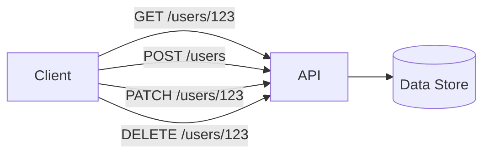
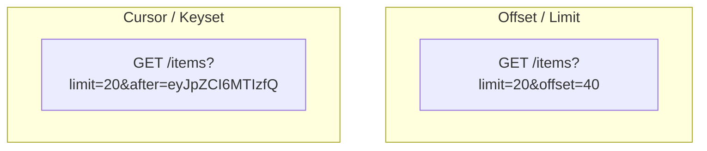
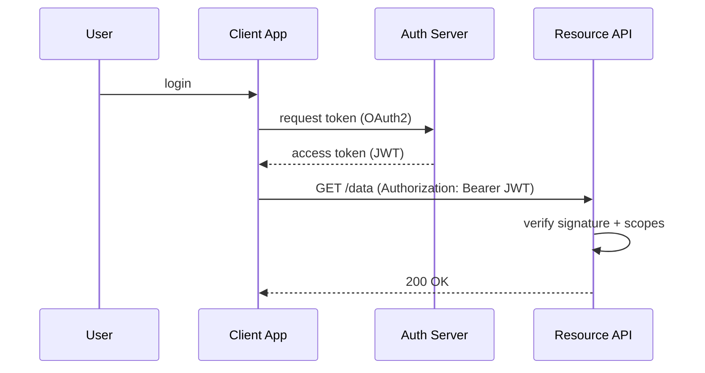

# API Design

> **One-line summary**: A good API is a clear, stable, and evolvable contract — pick the right protocol, model resources well, and handle versioning, errors, and auth deliberately.

---

## 🧩 Core Concepts

### REST Principles

**REST** (Representational State Transfer) models the system as **resources** identified by URLs, manipulated with standard HTTP verbs.

- **Resource-oriented URLs** — nouns, not verbs: `/users/123/orders`, not `/getUserOrders`.
- **HTTP verbs** — `GET` (read), `POST` (create), `PUT` (replace), `PATCH` (partial update), `DELETE` (remove).
- **Statelessness** — each request carries all context; no server-side session between calls (enables horizontal scaling).
- **Correct status codes** — communicate outcome via HTTP semantics.
- **Cacheability** — use `Cache-Control`, `ETag`, and conditional requests.



### REST vs. GraphQL vs. gRPC

| Dimension              | REST                              | GraphQL                       | gRPC                               |
| ---------------------- | --------------------------------- | ----------------------------- | ---------------------------------- |
| **Transport / format** | HTTP + JSON                       | HTTP + JSON                   | HTTP/2 + Protobuf (binary)         |
| **Contract**           | OpenAPI (optional)                | Strong schema (SDL)           | Strong schema (.proto)             |
| **Data fetching**      | Fixed endpoints; over/under-fetch | Client selects exact fields   | Fixed RPC methods                  |
| **Round trips**        | Often several                     | Single query, many resources  | One per call; streaming supported  |
| **Streaming**          | Limited (SSE/WebSocket)           | Subscriptions                 | First-class (uni/bi-directional)   |
| **Browser support**    | Native                            | Native                        | Needs gRPC-Web proxy               |
| **Best for**           | Public/CRUD APIs, caching         | Flexible clients, aggregation | Low-latency internal microservices |

**Rule of thumb**: REST for public and cache-friendly APIs, GraphQL when diverse clients need flexible/aggregated data, gRPC for high-performance internal service-to-service calls.

### API Versioning Strategies

| Strategy        | Example                               | Pros                            | Cons                             |
| --------------- | ------------------------------------- | ------------------------------- | -------------------------------- |
| **URI path**    | `/v1/users`                           | Simple, visible, cache-friendly | URL churn; not RESTful-purist    |
| **Query param** | `/users?version=1`                    | Easy to default                 | Easy to overlook; caching quirks |
| **Header**      | `Accept: application/vnd.api.v1+json` | Clean URLs                      | Harder to test/discover          |

- Prefer **additive, backward-compatible** changes (add fields, never remove/rename).
- Version only on **breaking** changes; document a **deprecation policy** with timelines.

### Pagination: Offset vs. Cursor



| Aspect                   | Offset/Limit                | Cursor/Keyset                 |
| ------------------------ | --------------------------- | ----------------------------- |
| **Ease**                 | Very simple                 | Slightly more complex         |
| **Performance at depth** | Degrades (skips rows)       | Constant (indexed seek)       |
| **Stability**            | Items shift if data changes | Stable across inserts/deletes |
| **Random page jump**     | Yes                         | No (sequential)               |

Use **offset** for small, admin-style tables; use **cursor** for large, frequently-changing, or infinite-scroll feeds.

### Idempotency

`GET`, `PUT`, and `DELETE` are naturally idempotent; `POST` is not. Make unsafe retries safe with an **idempotency key**:

```http
POST /payments
Idempotency-Key: 5f3c9a1e-...-8b2d
```

The server stores the key + result; a retry with the same key returns the original response instead of charging twice.

### Error Handling & Status Codes

| Range   | Meaning      | Common codes                                                                                                            |
| ------- | ------------ | ----------------------------------------------------------------------------------------------------------------------- |
| **2xx** | Success      | 200 OK, 201 Created, 202 Accepted, 204 No Content                                                                       |
| **3xx** | Redirection  | 301 Moved, 304 Not Modified                                                                                             |
| **4xx** | Client error | 400 Bad Request, 401 Unauthorized, 403 Forbidden, 404 Not Found, 409 Conflict, 422 Unprocessable, 429 Too Many Requests |
| **5xx** | Server error | 500 Internal, 502 Bad Gateway, 503 Unavailable, 504 Timeout                                                             |

Return **structured, consistent** error bodies (e.g., RFC 7807 Problem Details):

```json
{
  "type": "https://api.example.com/errors/validation",
  "title": "Validation failed",
  "status": 422,
  "detail": "email must be a valid address",
  "instance": "/users",
  "errors": [{ "field": "email", "message": "invalid format" }]
}
```

---

## 🔐 Authentication & Authorization

- **API keys** — simple shared secret per client; good for server-to-server and identifying callers, but coarse-grained. Send via header, never in the URL.
- **OAuth 2.0** — delegated authorization. A client obtains a scoped **access token** from an authorization server to act on a user's behalf without seeing credentials.
- **JWT** — a signed, self-contained token (header.payload.signature). Enables **stateless** auth: the server verifies the signature without a session lookup. Keep them short-lived and pair with refresh tokens.



**Authentication** = who you are. **Authorization** = what you're allowed to do (scopes, roles, RBAC/ABAC).

### Rate Limiting

Protect the API from abuse and overload with quotas. Communicate limits via headers (`X-RateLimit-Limit`, `X-RateLimit-Remaining`, `Retry-After`) and return **429 Too Many Requests** when exceeded. See [Rate Limiting](./rate-limiting.md) for token bucket, leaky bucket, and sliding window algorithms.

### HATEOAS

**Hypermedia As The Engine Of Application State** — responses include links to related actions, letting clients navigate the API without hardcoding URLs:

```json
{
  "id": 123,
  "status": "pending",
  "_links": {
    "self": { "href": "/orders/123" },
    "cancel": { "href": "/orders/123/cancel", "method": "POST" }
  }
}
```

It maximizes discoverability and decoupling but adds payload weight and is rarely fully adopted in practice.

---

## ⚖️ Trade-offs / When to Use

| Choose...             | When...                                            |
| --------------------- | -------------------------------------------------- |
| **REST**              | Public API, CRUD, HTTP caching matters             |
| **GraphQL**           | Many client shapes, aggregation, avoid over-fetch  |
| **gRPC**              | Internal, low-latency, streaming, strong contracts |
| **Cursor pagination** | Large/volatile datasets, infinite scroll           |
| **JWT (stateless)**   | Horizontal scaling, no shared session store        |
| **API keys**          | Simple machine-to-machine identification           |

---

## 🔗 Related Topics

- [Rate Limiting](./rate-limiting.md) — protect endpoints and enforce quotas
- [Load Balancing](./load-balancing.md) — distribute API traffic across instances
- [Scalability](./scalability.md) — stateless APIs scale horizontally
- [Consistency Models](./consistency-models.md) — what your API can promise about reads after writes
- [Microservices](./microservices.md) — API gateways and inter-service contracts

[← Back to System Design](./index.md) · © sparshjaswal
