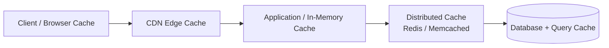
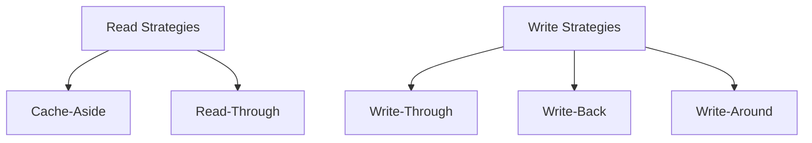
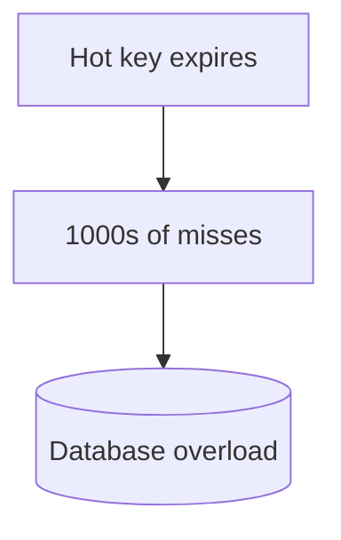
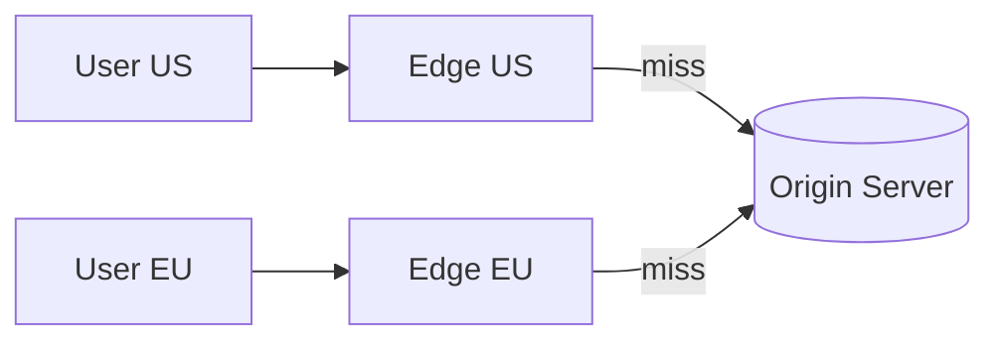

# Caching

> **One-line summary**: A cache stores copies of expensive-to-fetch data in fast storage so most requests are served in microseconds instead of hitting the database.

---

## 🧩 Core Concepts

A **cache** is a high-speed data layer that stores a subset of data — typically the most frequently or recently accessed — so future requests are served faster. Caching trades a little memory and staleness risk for huge gains in **latency**, **throughput**, and reduced load on [databases](./databases.md).

### Why Cache?

- **Reduce latency** — memory reads are ~1000× faster than disk/DB.
- **Increase throughput** — serve more requests with the same backend.
- **Reduce cost & load** — fewer expensive DB/API calls, relieving [read replicas](./replication.md).

Two key metrics: **hit ratio** (fraction served from cache) and **miss penalty** (cost of a miss).

---

## 🏗️ Cache Layers

Caching happens at every tier of a system:

| Layer           | Example                   | Caches                              |
| --------------- | ------------------------- | ----------------------------------- |
| **Client**      | Browser cache, mobile app | Static assets, API responses        |
| **CDN**         | Cloudflare, CloudFront    | Images, CSS/JS, video, edge content |
| **Application** | Local in-process, Guava   | Hot objects near the app            |
| **Distributed** | Redis, Memcached          | Shared cache across app servers     |
| **Database**    | Query/buffer cache        | Recent query results, pages         |

---

## 🔄 Caching Strategies

| Strategy                      | How It Works                                                 | Pros                               | Cons                              |
| ----------------------------- | ------------------------------------------------------------ | ---------------------------------- | --------------------------------- |
| **Cache-Aside** (lazy)        | App checks cache; on miss, loads from DB and populates cache | Only caches what's used; resilient | First request is slow; stale risk |
| **Read-Through**              | Cache library loads from DB on miss automatically            | Simple app code                    | Needs cache provider support      |
| **Write-Through**             | Write to cache **and** DB synchronously                      | Cache always fresh                 | Higher write latency              |
| **Write-Back** (write-behind) | Write to cache, flush to DB async later                      | Fast writes, absorbs bursts        | Risk of data loss before flush    |
| **Write-Around**              | Write straight to DB, bypass cache                           | Avoids caching write-once data     | Recent writes miss the cache      |

> 💡 **Cache-aside + write-through** is the most common combo for read-heavy web apps.

---

## 🗑️ Eviction Policies

Caches are size-bounded, so they must **evict** entries when full:

| Policy                          | Evicts                               | Best For                           |
| ------------------------------- | ------------------------------------ | ---------------------------------- |
| **LRU** (Least Recently Used)   | The item unused for the longest time | General-purpose; temporal locality |
| **LFU** (Least Frequently Used) | The least-accessed item              | Stable popularity distributions    |
| **FIFO** (First In, First Out)  | The oldest inserted item             | Simple, order-based workloads      |

> 🔗 See a full, worked **LRU cache implementation** here: [LRU Cache](../DSA/lru-cache/README.md).

---

## ⏳ TTL (Time-To-Live)

A **TTL** sets an expiry on each entry so stale data auto-evicts:

- Short TTL → fresher data, lower hit ratio.
- Long TTL → higher hit ratio, more staleness.
- Add **jitter** to TTLs so many keys don't expire simultaneously (avoids [thundering herd](#-thundering-herd)).

---

## 🪲 Cache Invalidation

> _"There are only two hard things in Computer Science: cache invalidation and naming things."_

Keeping the cache in sync with the source of truth:

- **TTL / expiry** — let entries age out (simplest, eventually consistent).
- **Write-through / write invalidation** — update or delete the cache key on every write.
- **Event-based** — publish change events (e.g., via [message queues](./message-queues.md)) to invalidate keys.
- **Versioned keys** — embed a version/hash in the key so new data uses a new key.

---

## 💥 Thundering Herd

When a popular key expires (or the cache restarts), **many** concurrent requests miss at once and stampede the database.

**Mitigations:**

- **Request coalescing / locking** — only one request recomputes; others wait.
- **Stale-while-revalidate** — serve stale data while refreshing in the background.
- **TTL jitter** — spread expirations over time.
- **Cache warming** — pre-populate hot keys before traffic.

---

## 🌐 Distributed Caches

When one machine's memory isn't enough or the cache must be shared across app servers, use a **distributed cache**:

|                 | Redis                                            | Memcached                        |
| --------------- | ------------------------------------------------ | -------------------------------- |
| **Data types**  | Rich (strings, hashes, lists, sets, sorted sets) | Strings/blobs only               |
| **Persistence** | ✅ Optional (RDB/AOF)                            | ❌ In-memory only                |
| **Replication** | ✅ Built-in                                      | ❌ (client-side)                 |
| **Best for**    | Complex data, pub/sub, leaderboards              | Simple, high-throughput KV cache |

- Data is partitioned across nodes using [consistent hashing](./sharding.md#-consistent-hashing).
- Can be [replicated](./replication.md) for availability.

---

## 🛰️ CDN (Content Delivery Network)

A **CDN** caches static (and cacheable dynamic) content at **edge servers** geographically close to users, cutting latency and origin load.

- Great for images, video, CSS/JS, and downloads.
- Uses TTLs, cache-control headers, and purge APIs for invalidation.

---

## 🧠 Trade-offs / When to Use

- ✅ **Use caching** for read-heavy, tolerant-to-staleness data with high reuse (hot keys).
- ❌ **Avoid / be careful** with rapidly changing data, strong-consistency requirements, or low-reuse data (low hit ratio wastes memory).
- Every cache adds a **consistency vs freshness** trade-off — pick strategy, TTL, and invalidation to match your correctness needs (see [Consistency Models](./consistency-models.md) and [CAP Theorem](./cap-theorem.md)).

---

## 🔗 Related Topics

- [LRU Cache](../DSA/lru-cache/README.md) — full implementation of the LRU eviction policy
- [Databases](./databases.md) — the backing store caches protect
- [Replication](./replication.md) — read replicas complement caching
- [Sharding](./sharding.md) — consistent hashing for distributed caches
- [CAP Theorem](./cap-theorem.md) — consistency vs availability trade-offs
- [Consistency Models](./consistency-models.md) — staleness and consistency guarantees
- [Scalability](./scalability.md) — caching as a scaling lever

[← Back to System Design](./index.md) · © sparshjaswal
