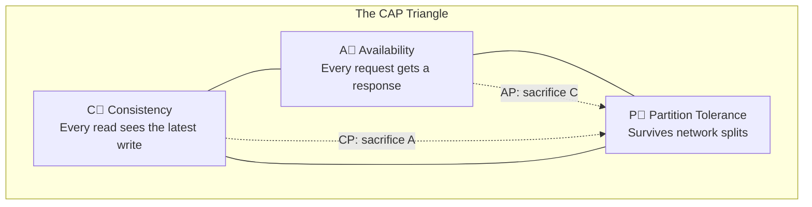
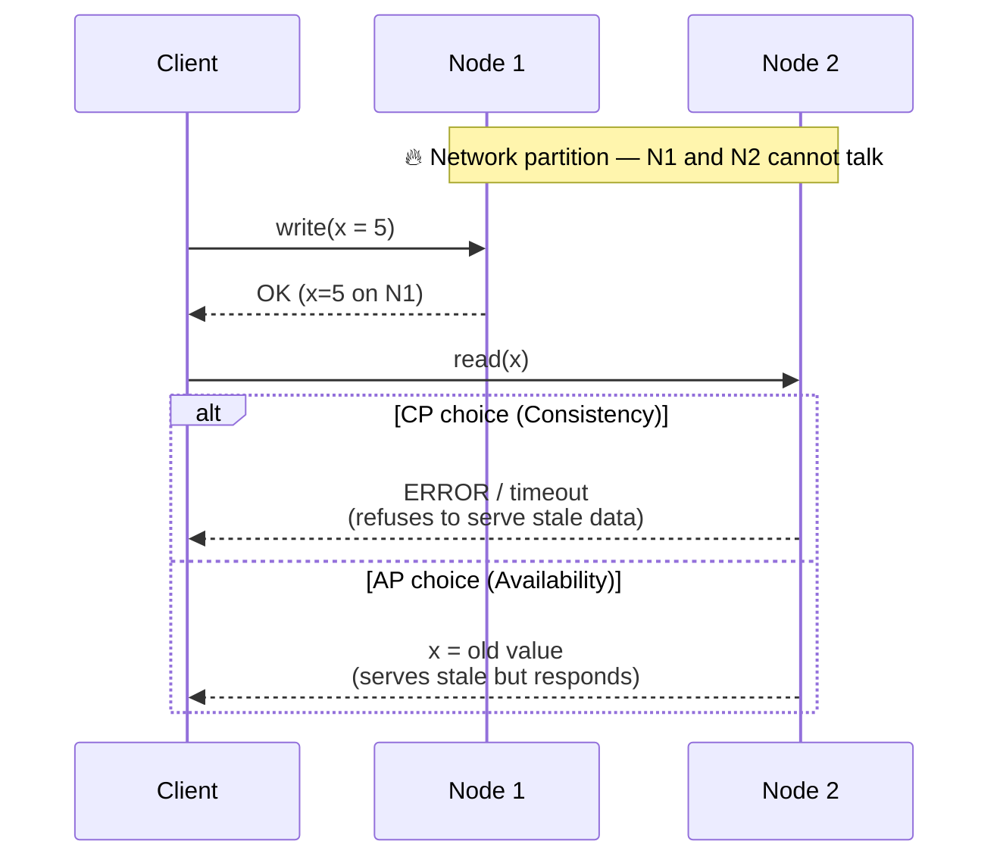
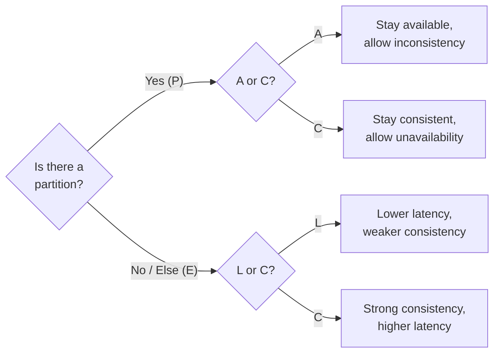

# CAP Theorem

> **One-line summary**: In a distributed data store, when a network **partition** happens you must choose between **Consistency** and **Availability** — you cannot have both.

---

## 🧩 Core Concepts

The **CAP theorem** (Brewer's theorem) states that a distributed data store can simultaneously provide **at most two** of the following three guarantees:

- **C — Consistency**: Every read receives the most recent write or an error. All nodes see the same data at the same time (this is _linearizability_, not the "C" of ACID).
- **A — Availability**: Every request receives a (non-error) response — without the guarantee that it contains the most recent write.
- **P — Partition Tolerance**: The system continues to operate despite an arbitrary number of messages being dropped or delayed between nodes.

---

## ⚡ Why You Can Only Pick 2 (During a Partition)

The key insight often missed: **partition tolerance is not optional** for any real distributed system. Networks _will_ fail — packets drop, links go down, nodes get isolated. Therefore, the practical choice is not "pick any 2 of 3" but rather:

> **When a partition occurs, do you sacrifice Consistency (become AP) or Availability (become CP)?**

Consider two nodes, N1 and N2, replicating the same value. A network partition cuts the link between them:

- **CP path**: N2 refuses the read because it cannot confirm it has the latest value → **consistent but unavailable**.
- **AP path**: N2 returns its (possibly stale) local value → **available but inconsistent**.

When there is **no** partition, a well-designed system can offer both consistency _and_ availability — the trade-off only bites during the partition.

---

## 🏛️ CP Systems (Consistency + Partition Tolerance)

CP systems prioritize correctness: during a partition they will reject or block requests rather than return stale/conflicting data. Ideal when **stale reads are unacceptable** (banking, coordination, locking).

| System                                       | Notes                                                                                                             |
| -------------------------------------------- | ----------------------------------------------------------------------------------------------------------------- |
| **HBase**                                    | Strongly consistent reads/writes on top of HDFS; a region becomes unavailable if its RegionServer is partitioned. |
| **MongoDB** (default)                        | With majority write concern + primary reads, it favors consistency; minority side steps down.                     |
| **ZooKeeper**                                | Coordination service using ZAB consensus; will not serve writes without a quorum.                                 |
| **etcd / Consul**                            | Raft-based; require a majority quorum, sacrificing availability on the minority partition.                        |
| **Redis (with Redlock / Sentinel majority)** | Coordination use cases favor consistency over availability.                                                       |

---

## 🌐 AP Systems (Availability + Partition Tolerance)

AP systems prioritize staying online: every node keeps answering, accepting reads and writes, and reconciles divergence later (via [eventual consistency](./consistency-models.md)). Ideal when **being online matters more than immediate correctness** (shopping carts, feeds, telemetry).

| System              | Notes                                                                                                   |
| ------------------- | ------------------------------------------------------------------------------------------------------- |
| **Cassandra**       | Tunable, but AP by default — accepts writes on any replica; conflicts resolved via last-write-wins.     |
| **Amazon DynamoDB** | Eventually consistent reads by default (strongly consistent reads available at higher cost/latency).    |
| **CouchDB**         | Multi-master replication; accepts writes offline and syncs later with revision-based conflict handling. |
| **Riak**            | Dynamo-style; tunable N/R/W with vector clocks for conflict resolution.                                 |
| **DNS**             | Highly available, eventually consistent globally.                                                       |

---

## 📊 CP vs AP at a Glance

| Dimension             | **CP** (Consistency)                    | **AP** (Availability)              |
| --------------------- | --------------------------------------- | ---------------------------------- |
| Behavior on partition | Rejects/blocks requests                 | Serves possibly stale data         |
| Guarantees            | Latest write or error                   | Always responds                    |
| Conflict handling     | Prevented (single truth)                | Reconciled later (eventual)        |
| Latency               | Higher (coordination/quorum)            | Lower (local response)             |
| Best for              | Money, locks, inventory counts          | Carts, feeds, sessions, metrics    |
| Examples              | HBase, ZooKeeper, etcd, Mongo (default) | Cassandra, DynamoDB, CouchDB, Riak |

---

## 🔬 PACELC — The Missing Half

CAP only describes behavior **during a partition**. **PACELC** (Abadi) extends it to normal operation:

> **If Partition (P), choose between Availability (A) and Consistency (C); Else (E), choose between Latency (L) and Consistency (C).**

| System                   | PACELC classification                                               |
| ------------------------ | ------------------------------------------------------------------- |
| DynamoDB / Cassandra     | **PA/EL** — available under partition, low-latency otherwise        |
| MongoDB (default)        | **PC/EC** — consistency-leaning in both modes                       |
| HBase / etcd / ZooKeeper | **PC/EC** — consistency first, always                               |
| PNUTS (Yahoo)            | **PC/EL** — consistent under partition, latency-optimized otherwise |

The **ELC** dimension is the everyday reality: even without partitions, strong consistency costs latency because it requires cross-node coordination (quorums, consensus round-trips).

---

## ⚖️ Trade-offs / When to Use

- **Choose CP** when a wrong/stale answer is worse than no answer: financial ledgers, unique-ID generation, distributed locks, leader election.
- **Choose AP** when downtime is worse than temporary staleness: social feeds, shopping carts, recommendation caches, IoT ingestion.
- **Remember the "else" (ELC)**: most systems are _not_ partitioned most of the time — so the latency-vs-consistency trade-off shapes 99% of your p99.
- **Consistency is a spectrum, not a switch**: many stores are _tunable_ (per-request quorums), letting you dial C↔A/L per operation. See [Consistency Models](./consistency-models.md).
- **CAP is coarse**: it is a starting mental model, not a full design. Real systems mix guarantees per operation and per data type.

---

<!-- AI-DRAFT: The sections below were generated as an initial AI-assisted draft. Please review and edit before publishing. -->

> **Note (AI-assisted draft):** The following Interview Questions, Production Checklist, and Testing & Monitoring items are a draft intended to accelerate review. Please verify operational details and add any organization-specific runbook links.

## Interview Questions

- When should you accept availability over consistency in a global service? Give examples.
- How does PACELC extend CAP, and why does it matter for low-latency systems?
- Explain practical steps to make a CP system more available during maintenance windows (quorum adjustments, staggered maintenance, read-only fallbacks).

## Production Checklist

- Document the partition behavior and expected application semantics during partitions
- Train runbooks for maintenance and partition handling (failover, promotions, and read routing)
- Monitor partition symptoms (increased error rates, timeouts, quorum loss)
- Ensure backups and cross-region replication strategies are tested regularly
- Maintain an automated playbook for promoting replicas and recovering from split-brain scenarios

## Testing & Monitoring

- Simulate network partitions in staging and observe application behavior under CP and AP choices
- Measure latency impact for chosen consistency levels during normal operation and during induced partitions
- Run failure drills to validate failover, leader election, and recovery procedures
- Add chaos experiments that introduce intermittent packet loss and validate recovery automation

## 🔗 Related Topics

- [Databases](./databases.md) — SQL vs. NoSQL and how each positions on the CAP spectrum
- [Replication](./replication.md) — leader/follower and quorums that implement CP or AP behavior
- [Consistency Models](./consistency-models.md) — the finer-grained guarantees beyond "C or A"
- [Message Queues](./message-queues.md) — delivery guarantees and async decoupling under failures

[← Back to System Design](./index.md) · © sparshjaswal
