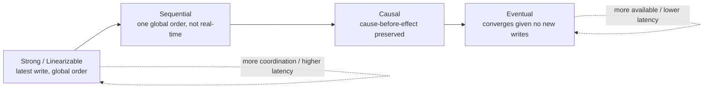
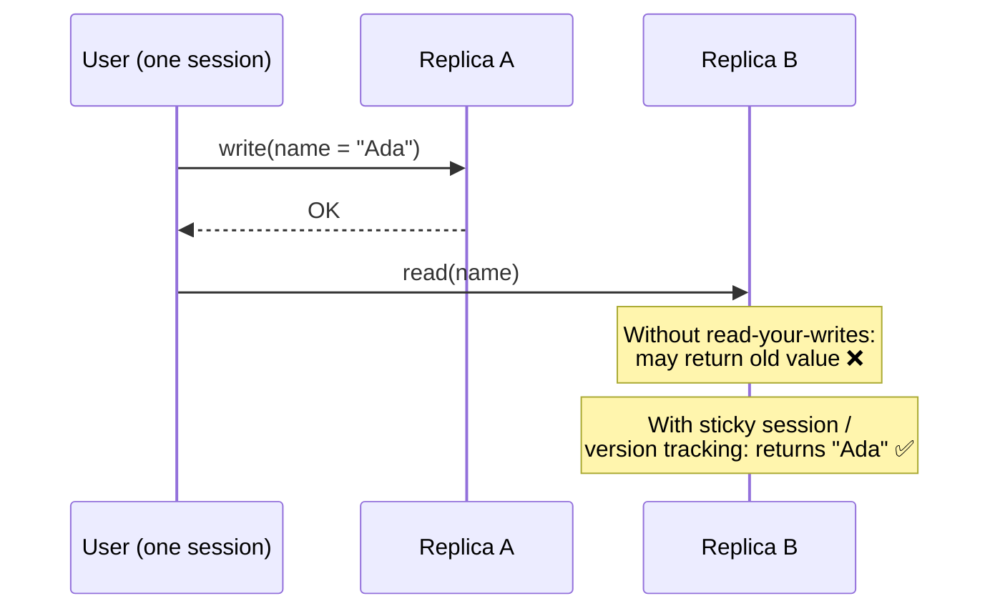
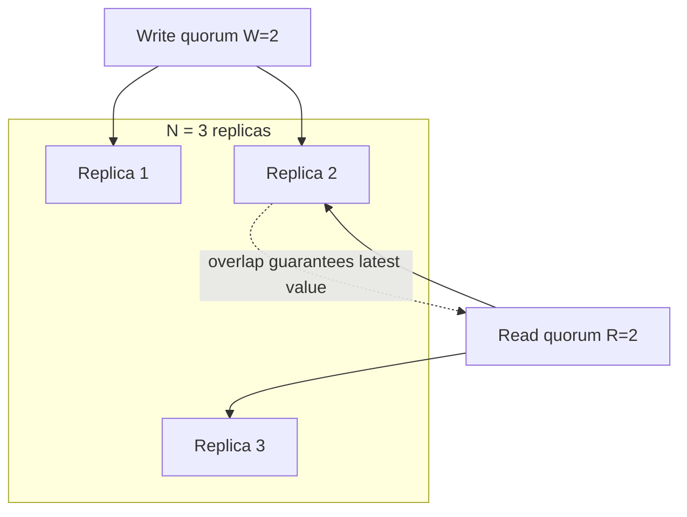
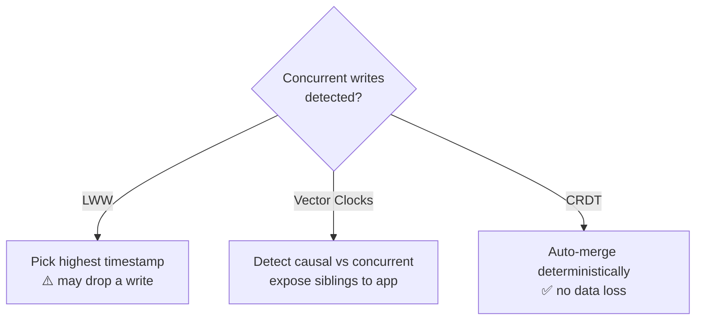

# Consistency Models

> **One-line summary**: A consistency model is the _contract_ between a distributed store and its clients about **when** and **in what order** writes become visible to reads.

---

## 🧩 Core Concepts

When data is replicated across nodes (see [Replication](./replication.md)), reads and writes can race. A **consistency model** defines what guarantees you get. Stronger models are easier to reason about but cost latency and availability (recall the [CAP theorem](./cap-theorem.md) and PACELC's else-latency-vs-consistency trade-off).

---

## 📈 The Consistency Spectrum

From strongest (most coordination, highest latency) to weakest (most available, lowest latency):



| Model                     | Guarantee                                                                          | Cost                                 | Example                       |
| ------------------------- | ---------------------------------------------------------------------------------- | ------------------------------------ | ----------------------------- |
| **Strong (Linearizable)** | Reads always return the most recent write; behaves like a single copy in real time | Highest latency, lowest availability | etcd, ZooKeeper, Spanner      |
| **Sequential**            | All nodes see operations in the _same_ order, but not necessarily real-time order  | High                                 | Some replicated logs          |
| **Causal**                | Operations that are causally related are seen in order; concurrent ops may differ  | Medium                               | COPS, MongoDB causal sessions |
| **Eventual**              | If writes stop, all replicas eventually converge                                   | Lowest                               | DynamoDB, Cassandra, DNS      |

---

## 👤 Client-Centric (Session) Guarantees

Even under eventual consistency, these per-client guarantees make behavior sane for a single user session:

- **Read-your-writes**: after you write a value, your subsequent reads see it (never a stale value you just overwrote). _Example: after editing your profile, you see the update immediately._
- **Monotonic reads**: once you read a value, you never see an _older_ value on later reads. _No "time-travel backwards."_
- **Monotonic writes**: your writes are applied in the order you issued them.
- **Writes-follow-reads**: a write made after reading a value happens-after that value.



---

## 🗳️ Quorum Reads & Writes (W + R > N)

Dynamo-style stores tune consistency with three numbers:

- **N** = number of replicas that store each key
- **W** = replicas that must acknowledge a **write** before it's considered successful
- **R** = replicas that must respond to a **read** before returning

> **Strong-consistency rule of thumb**: if **W + R > N**, the read and write quorums overlap by at least one node, so every read is guaranteed to see the latest write.



| Config (N=3) | W + R | Property                                           |
| ------------ | ----- | -------------------------------------------------- |
| W=3, R=1     | 4 > 3 | Strong; fast reads, slow/less-available writes     |
| W=1, R=3     | 4 > 3 | Strong; fast writes, slow reads                    |
| W=2, R=2     | 4 > 3 | Balanced strong consistency (common default)       |
| W=1, R=1     | 2 < 3 | Eventual; fastest & most available, may read stale |

---

## 🔀 Conflict Resolution

When concurrent writes diverge (common in AP / multi-leader systems), replicas must reconcile:

- **Last-Write-Wins (LWW)**: keep the write with the highest timestamp. Simple but **loses data** on true concurrency and depends on clock sync. _Used by Cassandra by default._
- **Vector clocks**: track causality per replica to detect whether writes are ordered or truly concurrent; concurrent writes are surfaced as **siblings** for the app (or a merge function) to resolve. _Used by Riak / Dynamo._
- **CRDTs (Conflict-free Replicated Data Types)**: data structures (counters, sets, maps) mathematically designed so concurrent updates _always_ merge deterministically without conflicts. _Used by Redis CRDTs, Riak, collaborative editors._



### Vector clock example

```text
Replica A writes:  {A:1}
Replica B writes:  {B:1}     → concurrent (neither dominates) → sibling / merge
Replica A reads {A:1,B:1}, writes: {A:2,B:1} → dominates {A:1} → supersedes
```

---

## 🎛️ Tunable Consistency

Modern stores let you choose the model **per request**, dialing between availability/latency and correctness:

| Store         | How to tune                                                                            |
| ------------- | -------------------------------------------------------------------------------------- |
| **Cassandra** | Per-query consistency level: `ONE`, `QUORUM`, `LOCAL_QUORUM`, `ALL`                    |
| **DynamoDB**  | `ConsistentRead: true` for strong reads, else eventual                                 |
| **MongoDB**   | `writeConcern` (w=majority) + `readConcern` (majority/linearizable) + `readPreference` |
| **Riak**      | Per-bucket / per-request `n_val`, `r`, `w`                                             |

This lets a single application use **strong consistency for money** and **eventual consistency for analytics/feeds** — the right trade-off per operation.

---

## ⚖️ Trade-offs / When to Use

- **Strong / linearizable**: use for correctness-critical data — balances, inventory, locks, unique constraints. Accept higher latency and reduced availability under partitions.
- **Causal**: great sweet spot for social apps — preserves "reply appears after the post" without full linearizability cost.
- **Eventual + session guarantees**: use for high-scale, latency-sensitive workloads (feeds, carts, telemetry) where users mainly need to see _their own_ actions consistently.
- **Quorum tuning (W+R>N)**: your lever to move along the spectrum without changing databases.
- **Conflict strategy matters**: prefer CRDTs/vector clocks over LWW when losing concurrent writes is unacceptable.

---

## 🔗 Related Topics

- [CAP Theorem](./cap-theorem.md) — the C-vs-A trade-off these models refine
- [Replication](./replication.md) — leader/follower & quorum mechanics that implement these models
- [Databases](./databases.md) — which stores offer which consistency guarantees
- [Message Queues](./message-queues.md) — delivery guarantees (at-least/at-most/exactly-once) as a consistency analog

[← Back to System Design](./index.md) · © sparshjaswal
