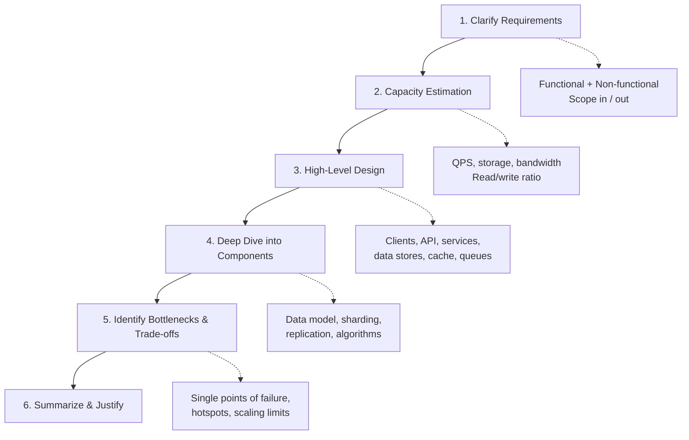
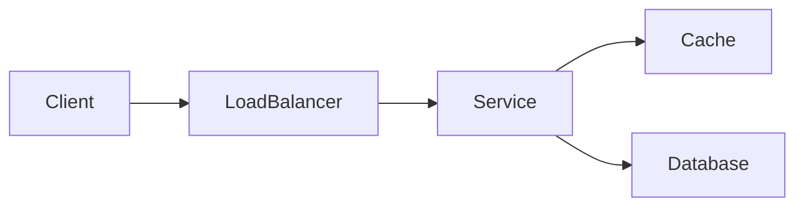

# 🏗️ System Design

## Learning Objectives

- Understand core system design goals: scalability, availability, latency, and consistency.
- Learn a repeatable interview framework: clarify, estimate, design, deep dive, summarize.
- Choose appropriate data stores, caching, and messaging patterns for real-world systems.
- Reason about trade-offs (CAP, consistency models, SQL vs NoSQL, caching vs freshness).

## Prerequisites

- Basic networking and HTTP knowledge
- Familiarity with databases (SQL/NoSQL) and basic DSA concepts
- Comfort with asynchronous programming and services

## Difficulty Level

- Intermediate → Advanced (varies by topic)

## Estimated Reading Time

Approximately 30–45 minutes for this overview; individual topic pages vary (15m–3h each).

## Mental Model

Think of a system as a set of interacting components: clients, API surface, services, caches, data stores, and infrastructure (load balancers, CDNs, message brokers). Design is choosing the right components and connections to meet functional and non-functional requirements while keeping complexity manageable.

## How to use this section

- Start with the high-level overview and follow the recommended order in the Table of Contents below.
- For interview preparation, practice the approach in “How to Approach a System Design Interview” and run through mock designs.
- For production engineering, read the deep-dive pages (databases, sharding, caching) and pay attention to the "Trade-offs" and "Operational Concerns" subsections.

## Quick Links (what to read first)

- [Clarify requirements and capacity estimation](#1%EF%B8%8F-clarify-requirements)
- [High-level design pattern and example architectures](./api-design.md)
- [Data storage and consistency guide](./databases.md)


> **One-line summary**: Learn to design large-scale, reliable, and scalable systems — and to reason about the trade-offs interviewers care about.

---

## 🎯 What is System Design?

**System Design** is the discipline of defining the architecture, components, interfaces, and data flow of a software system to satisfy a set of **functional** and **non-functional requirements** (scalability, availability, latency, consistency, cost).

Unlike a single algorithm problem, system design is **open-ended**: there is rarely one correct answer. The goal is to make **reasoned trade-offs** — balancing performance, reliability, complexity, and cost — and to communicate them clearly.

These fundamentals power every large product you use: the timeline that loads instantly, the payment that never double-charges, the video that streams to millions at once.

---

## 🧩 How to Approach a System Design Interview

Follow a repeatable framework so you never freeze on a blank whiteboard. Spend time proportionally — don't jump to databases before pinning down requirements.



### 1️⃣ Clarify Requirements

- **Functional**: what must the system _do_? (e.g., "shorten a URL", "post a tweet").
- **Non-functional**: how _well_? (availability, latency, consistency, durability, scale).
- **Scope explicitly**: state what is _in_ and _out_ of scope to bound the problem.

### 2️⃣ Capacity Estimation (Back-of-the-Envelope)

- Estimate **QPS** (queries/sec), **read:write ratio**, **storage growth/year**, and **bandwidth**.
- These numbers justify later choices (caching, sharding, replication).

### 3️⃣ High-Level Design

- Draw the major building blocks: **clients → load balancer → API/services → cache → databases**, plus **queues** for async work.
- Define the **API contract** (endpoints, request/response) between components.

### 4️⃣ Deep Dive into Components

- Pick the 1–2 most interesting components and go deep: **data model**, **sharding strategy**, **replication**, **consistency model**, indexing, and algorithms.

### 5️⃣ Identify Bottlenecks & Trade-offs

- Find **single points of failure**, **hotspots**, and **scaling limits**.
- Discuss trade-offs explicitly (e.g., **CAP theorem**, strong vs. eventual consistency, SQL vs. NoSQL).

### 6️⃣ Summarize & Justify

- Recap the design, restate key trade-offs, and note what you'd improve with more time.

---

## 📚 Fundamentals — Table of Contents

Work through these in order. Each page is a focused deep-dive on one building block.

### Core Scaling Building Blocks

- [Scalability](./scalability.md) — vertical vs. horizontal scaling, stateless services
- [Caching](./caching.md) — cache patterns, eviction, invalidation, CDNs
- [Load Balancing](./load-balancing.md) — algorithms, layers (L4/L7), health checks

### Data & Storage

- [Databases](./databases.md) — SQL vs. NoSQL, indexing, when to use what
- [CAP Theorem](./cap-theorem.md) — consistency, availability, partition tolerance
- [Sharding](./sharding.md) — partitioning strategies and hotspots
- [Replication](./replication.md) — leader/follower, multi-leader, quorums
- [Consistency Models](./consistency-models.md) — strong, eventual, causal consistency

### Communication & System Boundaries

- [Message Queues](./message-queues.md) — async processing, decoupling, delivery guarantees
- [API Design](./api-design.md) — REST, gRPC, versioning, pagination
- [Rate Limiting](./rate-limiting.md) — token bucket, leaky bucket, sliding window
- [Microservices](./microservices.md) — service decomposition, trade-offs vs. monoliths

### Backend Engineering Concepts

- [Node.js](../backend-engineering/nodejs/README.md)
- [Authentication/Authorization](../backend-engineering/authentication/README.md)
- [Validation](../backend-engineering/validation/README.md)
- [Error Handling](../backend-engineering/error-handling/README.md)
- [Rate Limiting](../backend-engineering/rate-limiting/README.md)
- [Logging](../backend-engineering/logging/README.md)
- [Monitoring](../backend-engineering/monitoring/README.md)
- [Caching](../backend-engineering/caching/README.md)
- [Queues](../backend-engineering/queues/README.md)
- [Event Driven Architecture](../backend-engineering/event-driven-architecture/README.md)
- [WebSockets](../backend-engineering/websockets/README.md)
- [gRPC](../backend-engineering/grpc/README.md)
- [API Gateway](../backend-engineering/api-gateway/README.md)
- [BFF (Backend for Frontend)](../backend-engineering/bff/README.md)
- [Service Discovery](../backend-engineering/service-discovery/README.md)

---

## ✍️ Authoring Conventions (Read Before Contributing)

> **Contributors: follow these conventions exactly** so every page in this section stays consistent.

### 1. Front Matter

Every page **must** begin with YAML front matter containing at least `title` and `sidebar_position`:

```yaml
---
title: Caching
sidebar_position: 3
---
```

- `title` — human-readable page title (Title Case), shown in the sidebar and browser tab.
- `sidebar_position` — integer controlling ordering within this section. **Do not change** the pre-assigned positions (they lock the sidebar order).

### 2. Mermaid for Diagrams

Use fenced **`mermaid`** code blocks for all architecture and flow diagrams (Docusaurus renders them natively):



### 3. Cross-Link Relative Path Style

- Link between pages in this section with **relative paths including the `.md` extension**: `[Caching](./caching.md)`.
- Link to sibling concept folders with `../folder/README.md`: `[Hashing](../DSA/hashing/README.md)`.
- End each page with a back-link footer: `[← Back to System Design](./index.md) · © sparshjaswal`.

### 4. Page Structure (Recommended)

Each fundamentals page should include: a one-line summary blockquote, **Core Concepts**, at least one **mermaid diagram**, **Trade-offs / When to Use**, and **Related Topics**.

---

## 🎯 Quick Interview Prep Checklist

- [ ] Always clarify functional and non-functional requirements first
- [ ] Do back-of-the-envelope capacity estimation
- [ ] Draw a clean high-level diagram before going deep
- [ ] Know when to cache, shard, and replicate — and why
- [ ] Be able to explain the CAP theorem and consistency trade-offs
- [ ] Discuss bottlenecks and single points of failure proactively

---

> **Note (AI-assisted draft):** The following Interview Questions, Production Checklist, and Testing & Monitoring items are drafted to accelerate review. Please verify wording and add organization-specific links/runbooks.

## Interview Questions

- Walk me through how you would design a system to handle 10× traffic. What steps and trade-offs would you describe?
- How do you pick a shard key and how would you detect and mitigate hotspots?
- Describe a safe failover and promotion process for a leader–follower database cluster.

## Production Checklist

- Capture expected peak QPS, read/write ratio, and storage growth; publish to the design doc
- Define SLOs and alerts for p50/p95/p99 latency, error rates, and saturation
- Provide runbooks for failover, rebalancing, and emergency rollback
- Ensure tracing, metrics, and structured logs are in place before production rollouts

## Testing & Monitoring

- Load-test with realistic traffic shapes, including sudden spikes and sustained growth
- Run chaos experiments for node/network failures and validate automated recovery
- Monitor replication lag, cache hit ratios, and per-shard metrics; alert on skew/hotspots

## 🔗 Related Topics

- [DSA (Data Structures & Algorithms)](../DSA/index.md) — data structures and algorithms
- [Hashing](../DSA/hashing/README.md) — consistent hashing for sharding
- [Heaps](../DSA/heap/README.md) — priority queues in schedulers and rate limiters

[← Back to Home](../index.md) · © sparshjaswal
