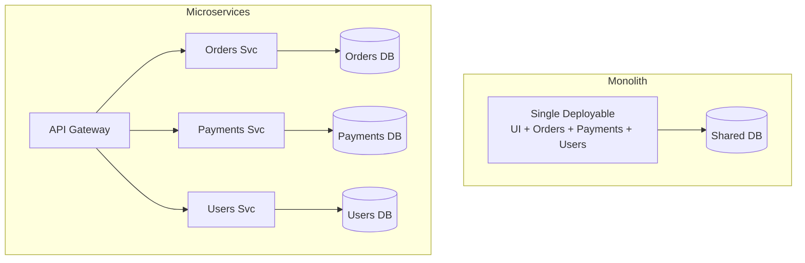
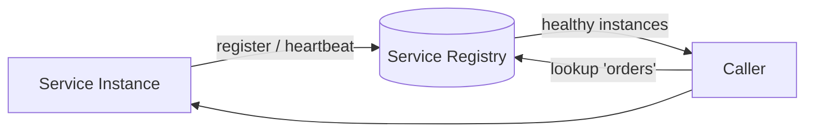
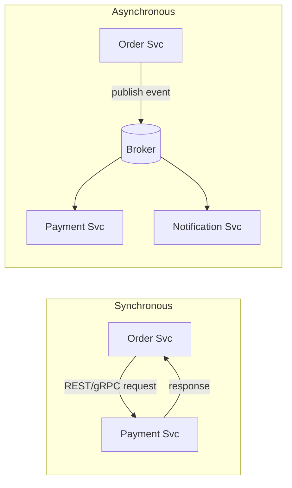
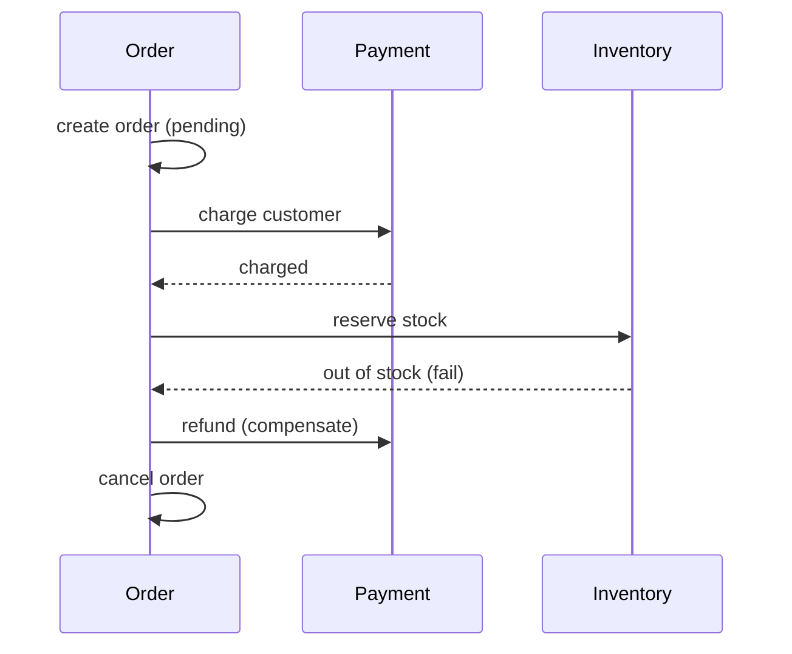
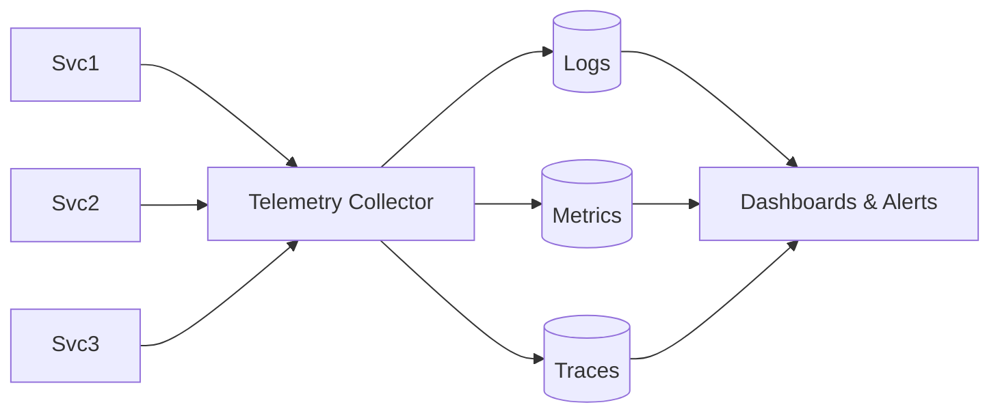
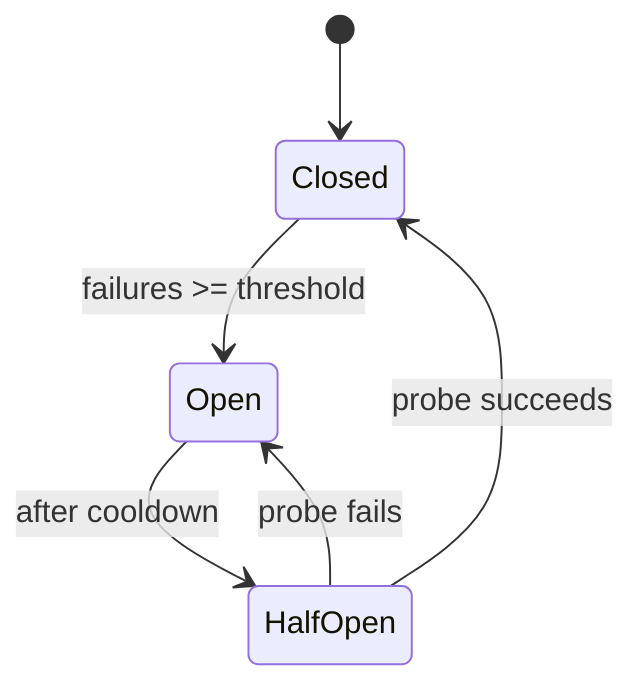

# Microservices

> **One-line summary**: Microservices split a system into small, independently deployable services aligned to business capabilities — trading operational complexity for team autonomy and independent scaling.

---

## 🧩 Core Concepts

### Monolith vs. Microservices

| Aspect               | Monolith                     | Microservices                           |
| -------------------- | ---------------------------- | --------------------------------------- |
| **Deployment**       | One unit                     | Independent per service                 |
| **Scaling**          | Whole app together           | Per-service, targeted                   |
| **Tech stack**       | Uniform                      | Polyglot allowed                        |
| **Team autonomy**    | Coupled                      | High (own service end-to-end)           |
| **Data**             | Shared DB, easy joins/txns   | DB-per-service, distributed data        |
| **Operational cost** | Low                          | High (infra, observability, networking) |
| **Fault isolation**  | Weak (one bug can crash all) | Strong (blast radius contained)         |
| **Local dev/debug**  | Simple                       | Complex (many moving parts)             |

**Start with a well-structured monolith**; extract services when team size, scaling needs, or deployment friction justify the added complexity.

### Service Boundaries & DDD

Use **Domain-Driven Design** to draw boundaries. Each service should own a **bounded context** — a cohesive business capability with its **own data**. Aim for **high cohesion inside** a service and **loose coupling between** services. Avoid the _distributed monolith_ anti-pattern (services that must deploy together).

### Service Discovery

Instances come and go (autoscaling, failures), so their network locations are dynamic. A **service registry** tracks healthy instances.

- **Client-side discovery** — caller queries the registry and load-balances itself.
- **Server-side discovery** — a load balancer / gateway resolves the target (e.g., Kubernetes Services, Consul, Eureka).

### API Gateway

A single entry point for clients that handles cross-cutting concerns so individual services don't have to:

- Routing & request aggregation
- Authentication / authorization
- Rate limiting & throttling
- TLS termination, caching, request/response transformation

See [API Design](./api-design.md) for the contract details behind the gateway.

### Inter-Service Communication: Sync vs. Async

|                    | Synchronous (REST/gRPC)     | Asynchronous (events/queues)        |
| ------------------ | --------------------------- | ----------------------------------- |
| **Coupling**       | Temporal (both must be up)  | Decoupled                           |
| **Latency**        | Immediate response          | Eventual                            |
| **Failure impact** | Cascades if downstream slow | Absorbed by broker                  |
| **Best for**       | Query needing an answer now | Fire-and-forget, fan-out, workflows |

Prefer **async messaging** for workflows and fan-out (see [Message Queues](./message-queues.md)); use **sync** when the caller genuinely needs an immediate result.

---

## 🔄 Saga Pattern (Distributed Transactions)

Without a shared database you can't use a single ACID transaction across services. A **saga** is a sequence of local transactions; if one step fails, **compensating transactions** undo the prior steps.

- **Choreography** — services react to each other's events; no central coordinator. Simple but harder to trace.
- **Orchestration** — a central orchestrator drives the steps and compensations. Clearer control flow, single point to reason about.

Sagas provide **eventual consistency** rather than immediate atomicity — see [Consistency Models](./consistency-models.md).

---

## 🔎 Observability

With many services, you can't debug by reading one log file. The three pillars:

- **Logging** — structured, centralized logs correlated by a **trace/correlation ID**.
- **Metrics** — numeric time series (latency, error rate, throughput, saturation — the RED/USE methods).
- **Tracing** — distributed traces follow a request across service hops to pinpoint bottlenecks.

---

## 🛡️ Resilience Patterns

| Pattern                          | Problem it solves                       | How                                                     |
| -------------------------------- | --------------------------------------- | ------------------------------------------------------- |
| **Timeouts**                     | Hanging calls tie up resources          | Cap how long a call may wait                            |
| **Retries (+ backoff + jitter)** | Transient failures                      | Retry idempotent calls with exponential backoff         |
| **Circuit breaker**              | Cascading failures to a sick service    | Trip open after N failures, fail fast, probe to recover |
| **Bulkhead**                     | One dependency exhausting all resources | Isolate pools per dependency                            |
| **Fallback**                     | Degrade gracefully                      | Serve cached/default response                           |

Combine retries with **idempotency** (see [API Design](./api-design.md)) to avoid duplicate side effects.

---

## ⚖️ Trade-offs / When to Use

| Adopt microservices when...                  | Stay monolithic when...                            |
| -------------------------------------------- | -------------------------------------------------- |
| Multiple teams need to ship independently    | Small team / early-stage product                   |
| Components have very different scaling needs | Domain is not yet well understood                  |
| You need fault isolation and polyglot stacks | Operational maturity (CI/CD, observability) is low |
| Deployment of the monolith is a bottleneck   | Simplicity and low latency joins matter most       |

**Prerequisites**: strong automation (CI/CD), containerization/orchestration, centralized observability, and clear ownership — without these, microservices amplify pain.

---

## 🔗 Related Topics

- [Scalability](./scalability.md) — scale individual services independently
- [Load Balancing](./load-balancing.md) — distribute traffic across service instances
- [Consistency Models](./consistency-models.md) — sagas yield eventual consistency
- [Rate Limiting](./rate-limiting.md) — enforced at the API gateway
- [Message Queues](./message-queues.md) — async backbone for inter-service events
- [API Design](./api-design.md) — the contracts services expose

[← Back to System Design](./index.md) · © sparshjaswal
