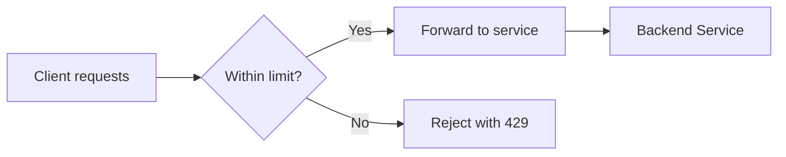
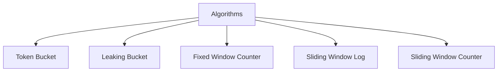
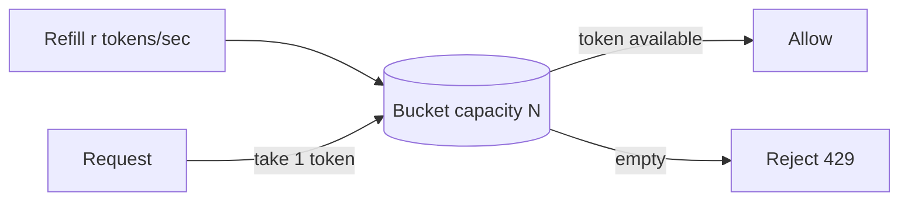
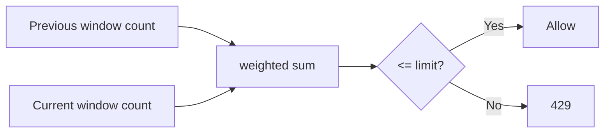
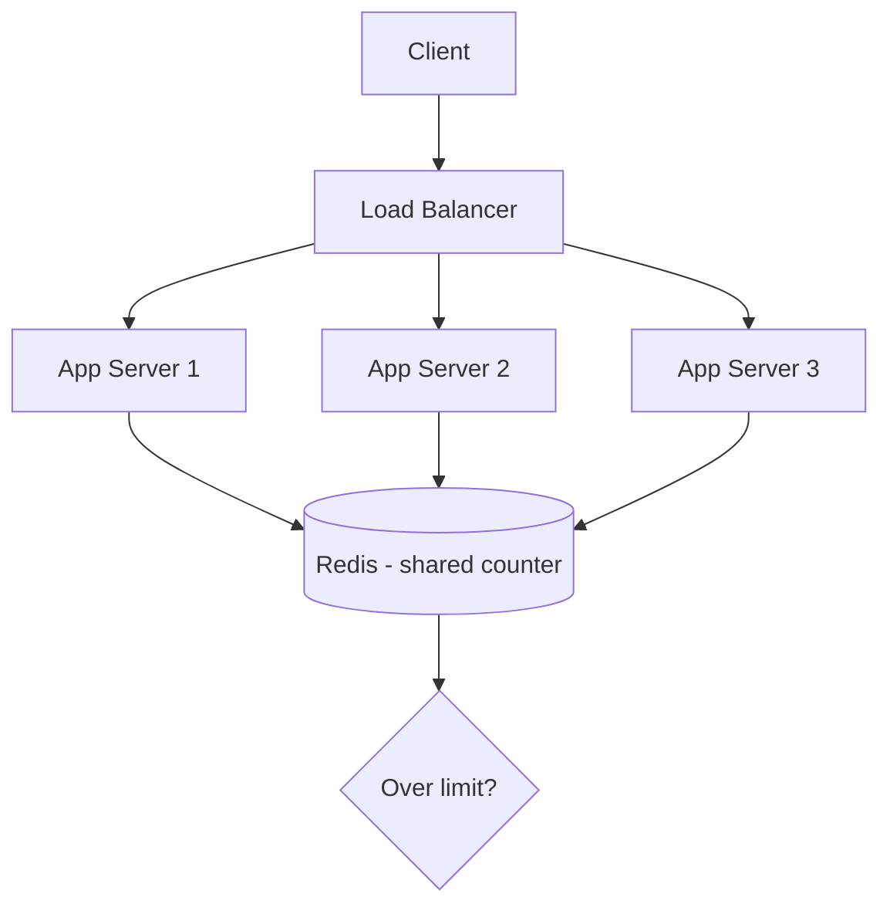
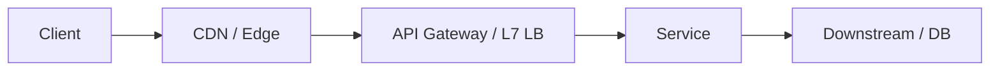
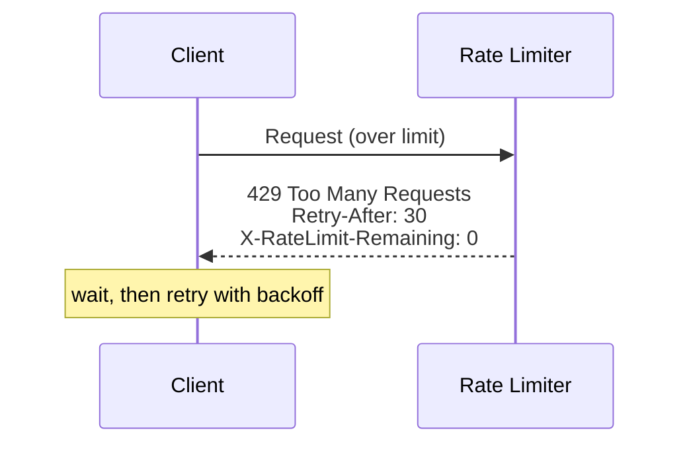

# Rate Limiting

> **One-line summary**: Rate limiting caps how many requests a client can make in a time window — protecting your system from abuse, overload, and runaway costs while ensuring fair use.

---

## 🧩 Core Concepts — Why Rate Limit?

Without limits, a single client (buggy loop, scraper, or attacker) can exhaust your capacity and degrade service for everyone. **Rate limiting** enforces a quota per client, endpoint, or API key.

**Why it matters:**

- **Prevent abuse & DoS** — block brute-force logins and floods.
- **Ensure fairness** — no single tenant starves others.
- **Control cost** — cap usage of expensive downstream calls (e.g., paid APIs, LLMs).
- **Protect stability** — shed excess load before it topples the system.

---

## 🎛️ Rate Limiting Algorithms

Each algorithm trades memory, accuracy, and burst behavior differently.

### Token Bucket

A bucket holds up to _N_ tokens and refills at a steady rate. Each request consumes one token; if the bucket is empty, the request is rejected. **Allows short bursts** (up to bucket size) while enforcing an average rate. Widely used (e.g., API gateways, AWS).

### Leaking Bucket

Requests enter a queue (bucket) and are processed ("leak") at a **fixed constant rate**. Smooths bursts into a steady output stream. Great when the downstream needs a stable rate; excess overflows and is dropped.

### Fixed Window Counter

Count requests per fixed interval (e.g., 100/min). Simple and memory-cheap, but suffers the **boundary burst problem**: a client can send 100 at 0:59 and 100 at 1:00 — 200 in ~2 seconds.

### Sliding Window Log

Store a timestamp for every request and count those within the trailing window. **Perfectly accurate**, but memory grows with request volume — expensive at scale.

### Sliding Window Counter

A hybrid: combines the current and previous fixed-window counts, weighted by how far into the current window we are. **Approximates** the sliding log with tiny memory — the popular production sweet spot.

| Algorithm           | Bursts          | Accuracy      | Memory          | Notes                    |
| ------------------- | --------------- | ------------- | --------------- | ------------------------ |
| **Token Bucket**    | Allows bursts   | Good          | Low             | Average rate + burst cap |
| **Leaking Bucket**  | Smooths bursts  | Good          | Low–med (queue) | Constant output rate     |
| **Fixed Window**    | Boundary bursts | Low           | Very low        | Simplest                 |
| **Sliding Log**     | No bursts       | Exact         | High            | Costly at scale          |
| **Sliding Counter** | Minimal         | High (approx) | Low             | Best general choice      |

---

## 🌐 Distributed Rate Limiting

With many app servers behind a [load balancer](./load-balancing.md), each instance seeing only its own traffic can't enforce a global limit. The counter must live in a **shared, fast store** — typically Redis (see [Caching](./caching.md)) — so all instances share one source of truth.

- **Atomicity** — use atomic ops (Redis `INCR`/Lua scripts) so concurrent updates don't race.
- **Latency vs. accuracy** — a central store is accurate but adds a network hop; some systems allow small per-node quotas for speed and reconcile centrally.
- **Consistency** — relates to broader trade-offs in [Consistency Models](./consistency-models.md).

---

## 📍 Where to Place Rate Limiting

- **Edge / CDN** — stops floods before they reach your infrastructure.
- **API Gateway / L7 [load balancer](./load-balancing.md)** — the most common place; centralized policy per API key/route (see [API Design](./api-design.md)).
- **Within a service / [microservice](./microservices.md)** — fine-grained, business-aware limits (e.g., per-user-tier quotas).

> **Rule of thumb**: limit as early (close to the edge) as possible to save resources, but add finer per-user/per-endpoint limits deeper in where business context lives.

---

## 📡 Response Handling (HTTP 429)

When a client exceeds the limit, return **`429 Too Many Requests`** with headers so well-behaved clients can back off:

- `Retry-After: 30` — seconds to wait before retrying.
- `X-RateLimit-Limit` — the ceiling for the window.
- `X-RateLimit-Remaining` — requests left in the current window.
- `X-RateLimit-Reset` — when the window resets.

> **Client best practice**: honor `Retry-After` and use **exponential backoff with jitter** to avoid synchronized retry storms.

---

## ⚖️ Trade-offs / When to Use

- **Accuracy vs. cost.** Sliding-window-log is exact but memory-heavy; sliding-window-counter or token bucket give near-exact results cheaply — preferred for most APIs.
- **Burst tolerance.** Token bucket permits bursts (good UX); leaking bucket enforces a strict smooth rate (protects fragile downstreams).
- **Local vs. distributed.** Per-node limiting is fast but inaccurate globally; a shared store is accurate but adds latency and a dependency.
- **Fail open vs. fail closed.** If the rate-limit store is down, decide whether to allow traffic (availability) or block it (protection) — a classic availability-vs-safety choice.
- **Don't over-restrict.** Aggressive limits harm legitimate users; tune with real traffic data and offer higher tiers where appropriate.

---

## 🔗 Related Topics

- [Load Balancing](./load-balancing.md) — the L7 gateway is the usual enforcement point
- [Caching](./caching.md) — Redis as the shared counter store
- [Microservices](./microservices.md) — per-service and per-tenant limits
- [API Design](./api-design.md) — quota policies, keys, and 429 semantics
- [Consistency Models](./consistency-models.md) — accuracy trade-offs of distributed counters
- [Scalability](./scalability.md) — rate limiting protects capacity under load
- [Heap](../DSA/heap/README.md) — priority queues used in scheduling/limiters

---

[← Back to System Design](./index.md) · © sparshjaswal
