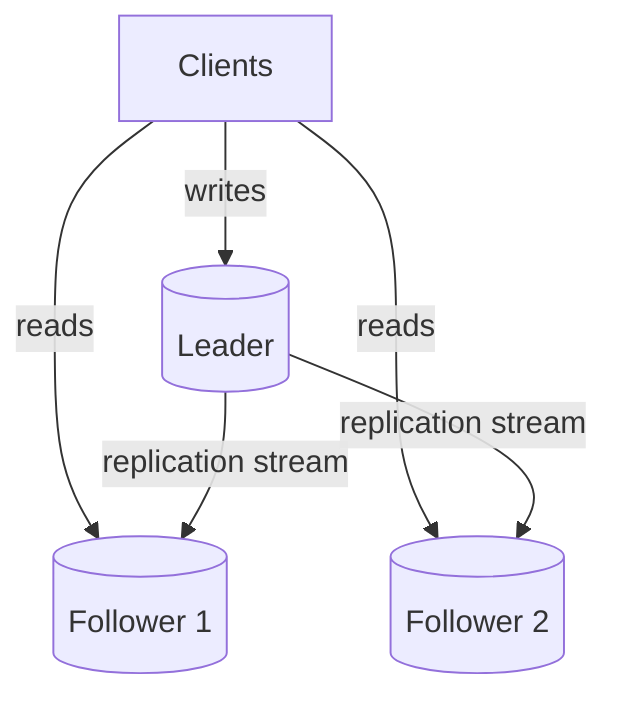
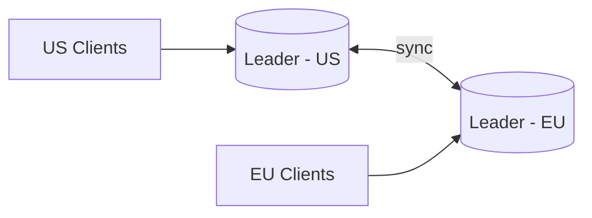
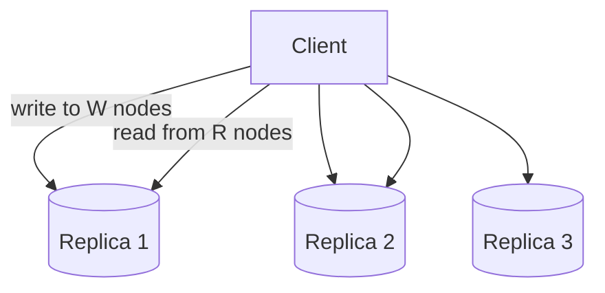
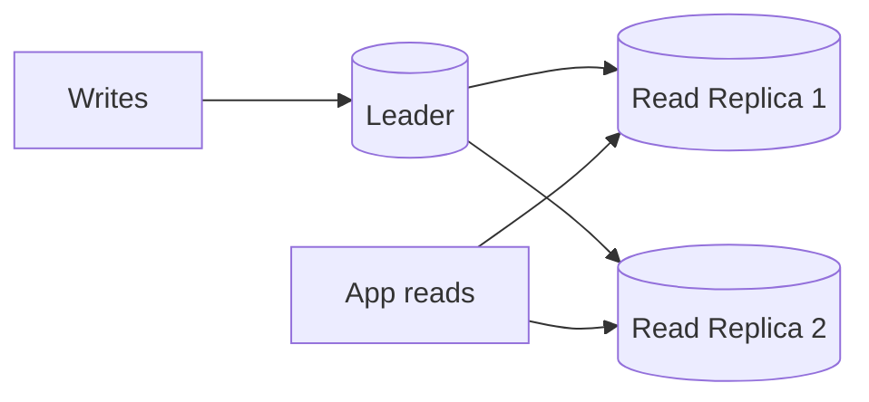
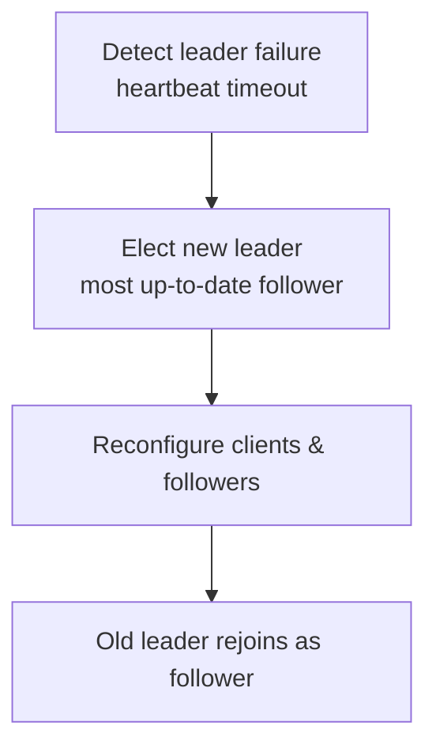

# Replication

> **One-line summary**: Replication keeps copies of your data on multiple nodes to improve availability, durability, and read scalability — at the cost of consistency complexity.

---

## 🧩 Core Concepts

**Replication** maintains multiple copies (**replicas**) of the same data across different machines. Where [sharding](./sharding.md) splits data to scale _writes_, replication _copies_ data to scale _reads_ and survive failures.

### Why Replicate?

- **High availability** — if one node dies, others keep serving.
- **Read scalability** — spread read traffic across many replicas.
- **Durability** — data survives single-node loss.
- **Lower latency** — place replicas near users (geo).

---

## 👑 Leader–Follower (Master–Slave)

One node is the **leader** (accepts all writes); others are **followers** that replicate the leader's changes and serve reads.

- ✅ Simple; no write conflicts (single writer); great for **read-heavy** workloads.
- ❌ Leader is a **write bottleneck** and a single point of failure (needs [failover](#-failover)).

---

## 👑👑 Multi-Leader

Multiple nodes accept writes and replicate to each other — often one leader **per region**.

- ✅ Low write latency per region; tolerant to inter-region partitions.
- ❌ **Write conflicts** are possible — need conflict resolution (last-write-wins, CRDTs, app logic).

---

## 🔄 Leaderless

Any replica accepts reads and writes; clients (or a coordinator) write to _several_ replicas and read from _several_, using **quorums** to stay consistent (e.g., Dynamo, Cassandra).

- **Quorum rule**: if `W + R > N`, reads and writes overlap on at least one up-to-date node.
- Uses **read-repair** and **anti-entropy** to converge stale replicas.
- ✅ No single point of failure; highly available. ❌ Tunable but weaker consistency (see [Consistency Models](./consistency-models.md)).

---

## ⏱️ Synchronous vs Asynchronous

|                         | Synchronous                 | Asynchronous                         |
| ----------------------- | --------------------------- | ------------------------------------ |
| **When write is ack'd** | After replicas confirm      | Immediately, before replicas confirm |
| **Data safety**         | ✅ No loss if leader dies   | ❌ Recent writes may be lost         |
| **Write latency**       | ❌ Higher                   | ✅ Lower                             |
| **Availability**        | Blocks if a replica is down | Keeps going                          |

> 💡 **Semi-synchronous** is a common middle ground: one replica syncs synchronously, the rest asynchronously.

---

## 📉 Replication Lag

With asynchronous replication, followers trail the leader by a **lag** window. This causes classic anomalies:

- **Read-your-own-writes** — a user updates data then reads a stale replica. _Fix_: read from leader for that user's recent writes.
- **Monotonic reads** — successive reads appear to go backwards in time. _Fix_: pin a user to one replica.
- **Consistent prefix reads** — causally ordered writes seen out of order. _Fix_: causal tracking.

---

## 📖 Read Replicas

Followers used purely to serve reads. Ideal for **read-heavy** systems: the leader handles writes; replicas absorb read traffic. Combine with [caching](./caching.md) for even more read relief.

> ⚠️ Reads from replicas may be **stale** due to lag — acceptable for feeds/analytics, not for read-after-write critical paths.

---

## 🔁 Failover

When the leader fails, a follower is **promoted** to leader:

**Pitfalls:**

- **Split-brain** — two nodes believe they're leader (use fencing/consensus like Raft).
- **Data loss** — async writes not yet replicated are lost on promotion.
- **Choosing the replica** — promote the most up-to-date follower.

---

## 🧠 Trade-offs / When to Use

| Topology            | Consistency       | Write Scale         | Complexity  | Best For               |
| ------------------- | ----------------- | ------------------- | ----------- | ---------------------- |
| **Leader–Follower** | Strong at leader  | Single writer       | Low         | Read-heavy apps        |
| **Multi-Leader**    | Conflict-prone    | Multi-region writes | High        | Geo-distributed writes |
| **Leaderless**      | Tunable (quorums) | High                | Medium–High | Always-on, HA systems  |

- Replication and [sharding](./sharding.md) are complementary: shard to scale writes, replicate each shard for availability and read scale.
- The consistency you get is governed by the [CAP Theorem](./cap-theorem.md) and your chosen [Consistency Models](./consistency-models.md).

---

## 🔗 Related Topics

- [Sharding](./sharding.md) — partition data to scale writes (pairs with replication)
- [Databases](./databases.md) — SQL vs NoSQL and transactions
- [Caching](./caching.md) — offload reads before hitting replicas
- [CAP Theorem](./cap-theorem.md) — consistency vs availability under partitions
- [Consistency Models](./consistency-models.md) — strong, eventual, causal consistency
- [Scalability](./scalability.md) — horizontal scaling fundamentals

[← Back to System Design](./index.md) · © sparshjaswal
