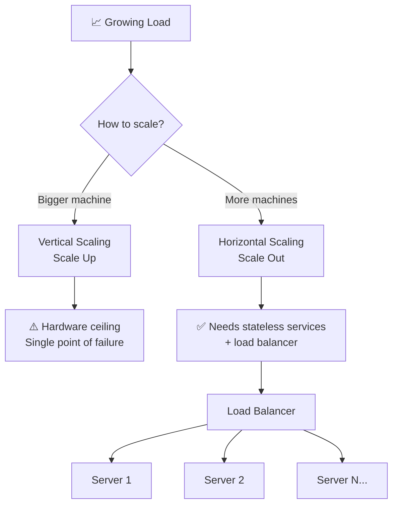
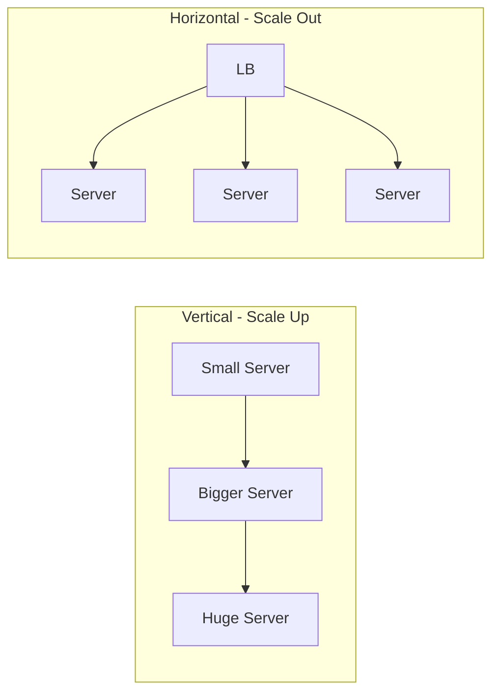
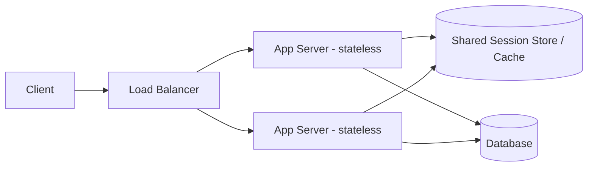
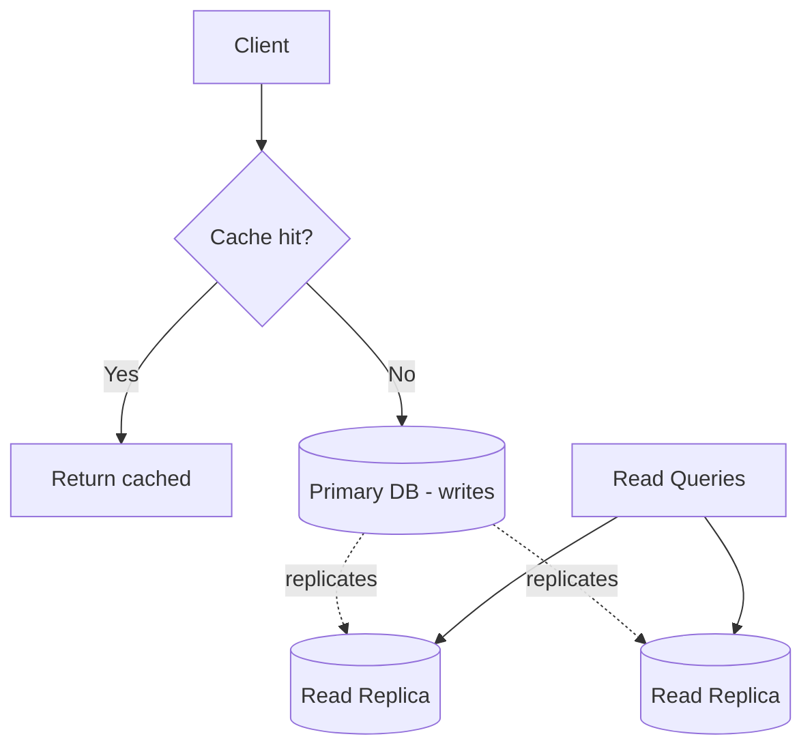
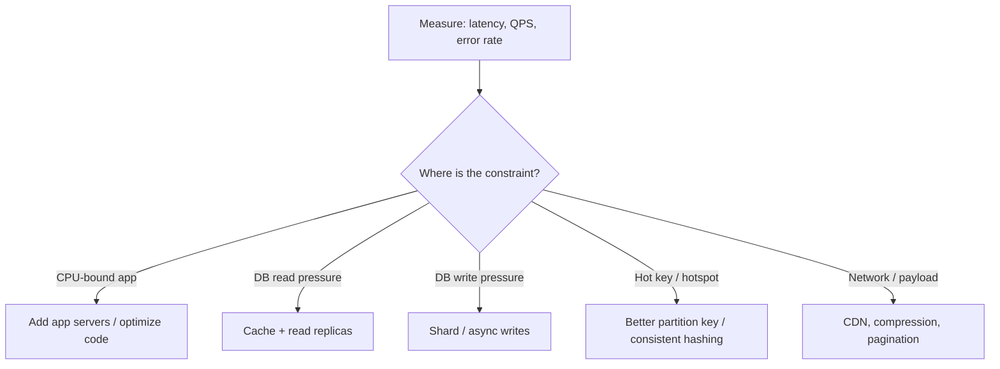

# Scalability

> **One-line summary**: Scalability is a system's ability to handle growing load — more users, more data, more requests — by adding resources, ideally without redesigning the whole system.

---

## 🧩 Core Concepts

A system is **scalable** when its capacity grows (roughly) in proportion to the resources you add. The two fundamental axes are **vertical** and **horizontal** scaling, and the biggest architectural decision that unlocks (or blocks) horizontal scaling is whether your services are **stateless** or **stateful**.

---

## ↕️ Vertical vs. Horizontal Scaling

**Vertical scaling (scale up)** means giving a single machine more power — more CPU, RAM, faster disks. It's simple and requires no code changes, but hits a hard physical/cost ceiling and leaves you with a single point of failure.

**Horizontal scaling (scale out)** means adding more machines and distributing load across them. It scales almost limitlessly and improves fault tolerance, but requires your architecture to support distribution (stateless services, a load balancer, and often a shared data tier).

| Dimension             | Vertical (Scale Up)     | Horizontal (Scale Out)    |
| --------------------- | ----------------------- | ------------------------- |
| **How**               | Add CPU/RAM to one node | Add more nodes            |
| **Ceiling**           | Hardware limit (finite) | Near-unlimited            |
| **Fault tolerance**   | Poor (single node)      | Strong (redundancy)       |
| **Complexity**        | Low                     | Higher (LB, coordination) |
| **Cost curve**        | Exponential at high end | Roughly linear            |
| **Downtime to scale** | Often requires restart  | Add nodes live            |
| **Code changes**      | None usually            | Requires stateless design |

**Real-world example**: A startup begins on a single large database instance (vertical). As traffic grows, they add read replicas and a fleet of stateless app servers behind a load balancer (horizontal), keeping only the primary database as a vertically-scaled component until they [shard](./sharding.md) it.

---

## 🧱 Stateless vs. Stateful Services

Horizontal scaling depends on **statelessness**. A **stateless service** keeps no client-specific data between requests — any instance can serve any request. This makes adding/removing instances trivial and enables simple load balancing.

A **stateful service** stores session or connection data locally, so requests must return to the same instance (see [sticky sessions](./load-balancing.md)), which complicates scaling and failover.

> **Golden rule**: Push state _out_ of your app servers. Store session data in a shared store (Redis, a database, or a signed token like a JWT) so app servers stay stateless and disposable.

|                    | Stateless                          | Stateful                                |
| ------------------ | ---------------------------------- | --------------------------------------- |
| **Scaling**        | Easy (any node serves any request) | Hard (affinity required)                |
| **Failover**       | Seamless                           | Session may be lost                     |
| **Load balancing** | Any algorithm                      | Needs sticky sessions                   |
| **Examples**       | REST APIs, CDN edges               | WebSocket servers, in-memory game state |

---

## 📖 Scaling Reads vs. Writes

Most systems are **read-heavy**, so reads and writes are scaled with different tools.

- **Scaling reads**: add a [cache](./caching.md) in front of the database, and add **read replicas** so read traffic fans out across many copies (see [replication](./replication.md)). Cheap and highly effective.
- **Scaling writes**: harder, because a single primary is the source of truth. Techniques include [sharding](./sharding.md) (partition data across nodes so each takes a slice of writes), batching, write-behind buffers via [message queues](./message-queues.md), and choosing write-optimized stores.

| Concern           | Scaling Reads          | Scaling Writes                   |
| ----------------- | ---------------------- | -------------------------------- |
| **Primary tools** | Caching, read replicas | Sharding, queues, batching       |
| **Difficulty**    | Low–medium             | High                             |
| **Trade-off**     | Stale/eventual reads   | Complexity, rebalancing hotspots |

---

## 🚀 Common Scaling Strategies

1. **Add a cache** — the cheapest win for read-heavy workloads ([Caching](./caching.md)).
2. **Load balance** across stateless app servers ([Load Balancing](./load-balancing.md)).
3. **Replicate** the database for read scaling and availability ([Replication](./replication.md)).
4. **Shard** to scale writes and storage beyond a single node ([Sharding](./sharding.md)).
5. **Go asynchronous** — offload slow work to background workers via [message queues](./message-queues.md).
6. **Split the monolith** into [microservices](./microservices.md) so each part scales independently.
7. **Use a CDN** to serve static/edge content close to users.

---

## 📐 Capacity Estimation Basics

Back-of-the-envelope math justifies every scaling decision. Estimate the load _before_ choosing a design.

- **QPS (Queries Per Second)** = daily requests ÷ 86,400. Then size for **peak** (often 2–10× average).
- **Read:write ratio** — decides how much to invest in caching/replicas vs. sharding.
- **Storage growth** = (bytes per record) × (records per day) × (retention days).
- **Bandwidth** = QPS × average payload size.

> **Example**: 100M requests/day ≈ **~1,160 QPS average**, so plan for **~5,000+ QPS peak**. If each response is 2 KB, peak egress ≈ 10 MB/s. That single number tells you whether one server suffices or you need a fleet.

Handy rounded constants: 1 day ≈ **86,400 s** (≈ 10⁵), and powers of two: KB ≈ 10³, MB ≈ 10⁶, GB ≈ 10⁹ bytes.

---

## 🔍 Identifying Bottlenecks

Scaling the wrong layer wastes money. Find the actual constraint first.

- **Measure before optimizing** — use metrics (p50/p95/p99 latency), not guesses.
- Watch for **single points of failure** and **hotspots** (one shard/key absorbing disproportionate traffic).
- Remember **Amdahl's Law**: a serial bottleneck caps the benefit of parallelism — the slowest shared component limits the whole system.

---

## ⚖️ Trade-offs / When to Use

- **Start vertical, then go horizontal.** For small systems, scaling up is faster and simpler. Adopt horizontal scaling once you need fault tolerance or hit hardware ceilings.
- **Stateless first.** Designing services stateless from day one makes every later scaling move easier.
- **Scaling adds complexity.** More nodes mean more failure modes, harder debugging, and consistency challenges (see [Consistency Models](./consistency-models.md) and [CAP Theorem](./cap-theorem.md)). Don't distribute a system that doesn't need it.
- **Cost vs. performance.** Over-provisioning wastes money; under-provisioning risks outages. Autoscaling helps match capacity to real demand.

---

## 🔗 Related Topics

- [Caching](./caching.md) — the cheapest way to scale reads
- [Load Balancing](./load-balancing.md) — distribute traffic across horizontally-scaled servers
- [Databases](./databases.md) — pick storage that scales with your access pattern
- [Sharding](./sharding.md) — partition data to scale writes and storage
- [Replication](./replication.md) — copies for read scaling and availability
- [Microservices](./microservices.md) — scale components independently
- [Consistency Models](./consistency-models.md) — the trade-offs distribution forces

---

[← Back to System Design](./index.md) · © sparshjaswal
