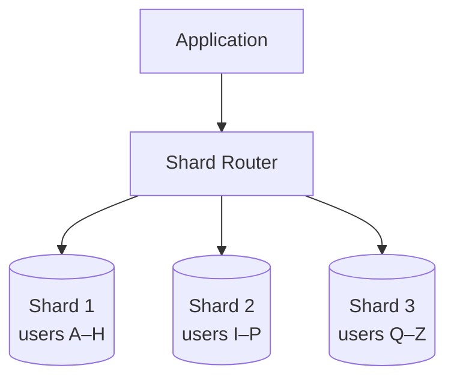
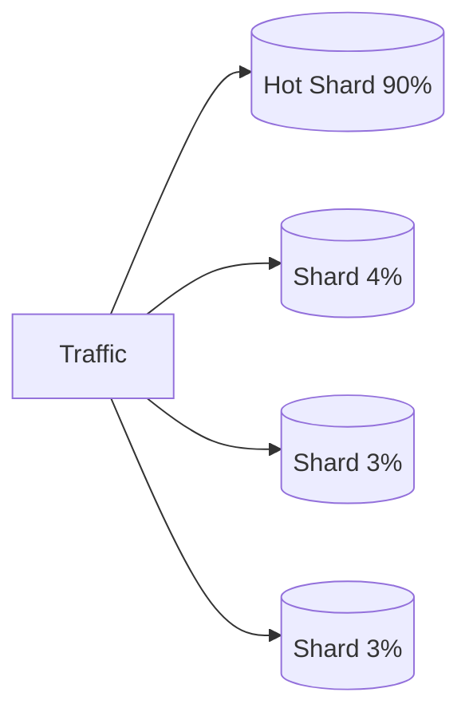
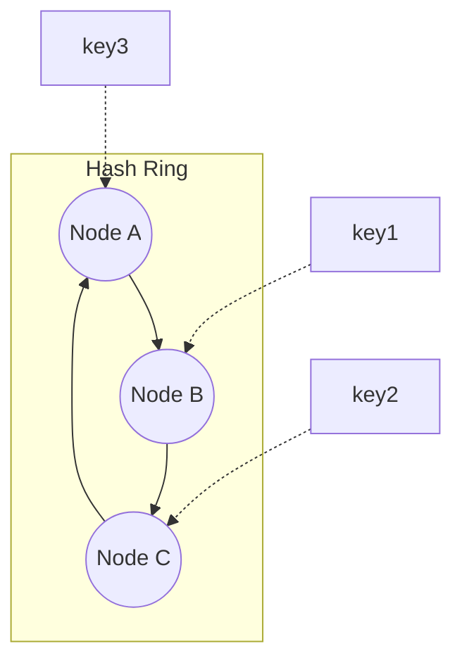

# Sharding

> **One-line summary**: Sharding splits one large dataset across many machines so a database can scale writes and storage beyond a single server's limits.

---

## 🧩 Core Concepts

**Sharding** (horizontal partitioning) divides a dataset into smaller pieces called **shards**, each stored on a separate database node. Every shard holds a _subset of the rows_, and together they form the whole dataset.

### Why Shard?

- **Scale writes** — a single primary can only handle so many writes; sharding spreads them.
- **Scale storage** — data exceeds one machine's disk.
- **Reduce contention** — smaller working set per node, better cache locality.
- Complements [replication](./replication.md) (which scales _reads_ and availability) — sharding scales _writes_.

> ⚠️ Sharding adds real operational complexity. Exhaust vertical scaling, [caching](./caching.md), and [read replicas](./replication.md) **first**.

---

## 🧭 Sharding Strategies

### 1. Range-Based Sharding

Assign contiguous key ranges to shards (e.g., users `A–H`, `I–P`, `Q–Z`).

- ✅ Simple; efficient **range queries**.
- ❌ Prone to **hotspots** if data/traffic is skewed (e.g., everyone signs up with names starting `A`, or sequential timestamps hit the newest shard).

### 2. Hash-Based Sharding

Compute `hash(shard_key) % N` to pick a shard.

- ✅ **Even distribution**, avoids most hotspots.
- ❌ Range queries become scatter-gather; `% N` breaks badly when `N` changes (mass reshuffle) — solved by [consistent hashing](#-consistent-hashing).

### 3. Directory-Based Sharding

A **lookup service** maps each key (or key-range) to its shard.

- ✅ Maximum flexibility; can rebalance by editing the directory.
- ❌ The directory becomes a **single point of failure** and an extra hop — must be replicated & cached.

### 4. Geo-Based Sharding

Partition by **location** (e.g., EU users → EU shard).

- ✅ Low latency for local users; helps data-residency/compliance.
- ❌ Uneven load across regions; cross-region queries are costly.

| Strategy      | Distribution  | Range Queries     | Rebalancing                   | Best For                     |
| ------------- | ------------- | ----------------- | ----------------------------- | ---------------------------- |
| **Range**     | Can be uneven | ✅ Efficient      | Split/merge ranges            | Time-series, ordered scans   |
| **Hash**      | ✅ Even       | ❌ Scatter-gather | Hard (use consistent hashing) | Uniform key access           |
| **Directory** | Flexible      | Depends           | ✅ Easy (edit map)            | Dynamic / heterogeneous data |
| **Geo**       | By region     | Local ✅          | By region                     | Global, latency/compliance   |

---

## 🗝️ Shard Key Selection

The **shard key** determines which shard a row lives on — the most important decision in sharding.

A good shard key has:

- **High cardinality** — many distinct values to spread data.
- **Even distribution** — no single value dominates.
- **Query alignment** — most queries filter by it (avoids scatter-gather).
- **Low mutability** — changing a row's key means moving it between shards.

> ❌ _Bad key_: `country` (few values, skewed). ✅ _Good key_: `user_id` (high cardinality, evenly hashed).

---

## 🔥 Hotspots

A **hotspot** is a shard receiving disproportionate load — it becomes the bottleneck while others sit idle.

**Causes & fixes:**

- Sequential keys (auto-increment IDs, timestamps) → use **hashing** or **key salting**.
- Celebrity/popular records → add a **cache** ([caching](./caching.md)) or split the hot key.
- Poor shard key → pick a higher-cardinality key.

---

## ⚖️ Rebalancing

As data grows or nodes are added/removed, shards must be **rebalanced** to keep load even.

- **Fixed number of partitions**: create many more logical partitions than nodes upfront; move whole partitions between nodes (no re-hashing of keys).
- **Consistent hashing**: only a fraction of keys move when a node joins/leaves.
- Avoid `hash % N` for a variable `N` — changing `N` remaps _most_ keys.

---

## 🌀 Consistent Hashing

**Consistent hashing** maps both keys and nodes onto a **hash ring**. A key belongs to the first node clockwise from it. Adding/removing a node only reassigns the keys in its arc — roughly `K/N` keys move instead of nearly all.

- **Virtual nodes** (multiple ring positions per physical node) smooth out uneven distribution.
- The standard technique for dynamic sharding & distributed caches. See also [Hashing](../DSA/hashing/README.md).

---

## 🔗 Cross-Shard Queries & Joins

Once data is split, operations spanning multiple shards get hard:

- **Cross-shard joins** — no single node has all the data; you must **scatter-gather** (query every shard, merge in the app) or **denormalize** to keep related data co-located.
- **Cross-shard transactions** — require distributed transactions (2PC/Sagas), which are slow and complex.
- **Aggregations** (`COUNT`, `SUM`) — run per-shard then combine.
- **Unique constraints** across shards can't be enforced natively.

> 💡 Design your shard key so that the most common queries hit a **single shard**.

---

## 🧠 Trade-offs / When to Use

| Benefit                              | Cost                                      |
| ------------------------------------ | ----------------------------------------- |
| Scales writes & storage horizontally | Operational & code complexity             |
| Smaller working set per node         | Cross-shard joins/transactions are hard   |
| Fault isolation per shard            | Rebalancing & hotspot management overhead |

**Use sharding when** a single node truly can't hold the data or handle the write throughput — and only after simpler options are exhausted.

---

## Interview Questions

- How would you pick a shard key for a user-facing service with both read and write hotspots?
- Explain a safe rebalancing strategy when adding new nodes to a sharded cluster.
- How would you design to avoid cross-shard joins for the most common queries?

## Production Checklist

- Monitor per-shard QPS, storage, and latency to detect hotspots early
- Maintain a partition map and version it for safe rollouts
- Automate rebalancing with low-impact migration windows and throttling
- Ensure backups and consistent snapshots per shard
- Test failure scenarios: node loss, network partitions, and partial rebalances

## Testing & Monitoring

- Load test with skewed key distributions to reveal hotspots
- Verify that rebalancing moves data without violating consistency guarantees
- Monitor shard-level metrics and set alerts on skew, queue buildup, and retry rates
- Run chaos tests that remove/add nodes and validate client behavior

## 🔗 Related Topics

- [Replication](./replication.md) — copies data for read-scaling & availability (pairs with sharding)
- [Databases](./databases.md) — SQL vs NoSQL and data modeling
- [Caching](./caching.md) — relieve hotspots and reduce shard load
- [CAP Theorem](./cap-theorem.md) — consistency/availability under partitions
- [Consistency Models](./consistency-models.md) — consistency across shards
- [Scalability](./scalability.md) — horizontal scaling fundamentals
- [Hashing](../DSA/hashing/README.md) — consistent hashing internals

[← Back to System Design](./index.md) · © sparshjaswal
